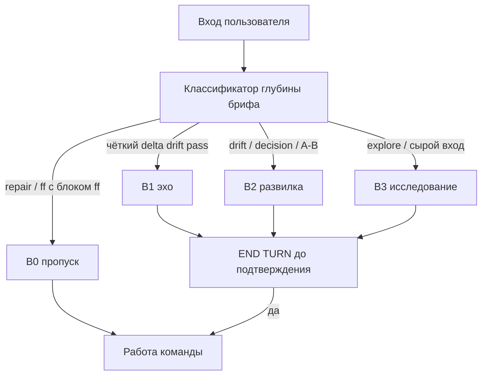

# Адаптивный бриф как точка синхронизации

## Независимая оценка (ревью плана)

### Диагноз — подтверждён по коду

| Наблюдение | Доказательство | Вердict |
|------------|----------------|---------|
| Единый 5-слотовый исследовательский каркас для всех entry-команд | `opsx-output-style.md` §5.1 строки 297–307: «единый каркас для всех команд», лимит 8–12 для всех | **verified** |
| Extend в чате обязан содержать «Как буду искать» | `openspec-extend-change/SKILL.md` строка 96: «Секция **Как буду искать** того же сообщения: 1)…5)» — прямое противоречие строкам 77–78 («в чат не выводятся») | **verified — баг SSOT** |
| Команда extend требует scope-блок в чате | `opsx-extend.md` п.3: «включая блок **Соответствие исходному scope**» | **verified — противоречие SKILL** |
| «Adaptive-by-default» de facto anti-adaptive | `opsx-output-style.md` §7 п.15: «обязательные секции заполнены» без tier; п.12 ссылается на «8 строк» vs «8–12 для всех» | **verified** |
| Escape hatch без классификатора | lite-бриф `--from-verify`, skip ff при `## Для /opsx:ff` — есть, но нет правила «минимальный достаточный уровень» | **verified** |

**Корневая причина:** бриф задуман как **Sync Card** (сверка шага), но SSOT и extend SKILL кодируют его как **Research Plan Card** (план работы агента). Оркестратор следует более детальным инструкциям (строка 96 extend) и перечисляет артефакты — это ожидаемое поведение при текущих правилах, не «сломанный агент».

### Оценка предложенного решения

**Сильные стороны**

- Разделение B0–B3 закрывает реальный UX-разрыв: extend/ff ≠ explore.
- Сохранение внутреннего якоря «Хочу понять» при переименовании чат-слота в **Вопрос** — правильный компромисс (Symptom Lock, `## Для /opsx:ff`, промпты explorer).
- Явный запрет «плана правки артефактов» в B1/B2 согласуется с Chat Surface Contract §2.6 Правило 5.
- Порядок внедрения SSOT → skills → budget → tests — корректный.

**Риски и пробелы исходного плана (закрыты ниже)**

| Риск | Митигация в доработанном плане |
|------|--------------------------------|
| «Псевдокод классификатора» отсутствовал в файле | Добавлен § «Алгоритм классификатора» |
| `--code-sync`, `--from-review`, `--from-report` не классифицированы | Матрица входов extend/ff |
| ff B0 сейчас использует `AskQuestion` — конфликт с «подтверждение текстом» | B0 ff: одна строка + текстовое «да» / имя; HALT AskQuestion на entry |
| `--from-verify` после decision дублирует verify-развилку | B2 = только **delta** extend, не повтор verify-карточки |
| Нет регрессии B2 (drift-warning) | Сценарий **F3** в ux-acceptance |
| explore §1.6 «KB в scope» в брифе (≤3 строк) | Явно internal для B1/B2/B3 чата; KB только в промпты после «да» |
| `§6 P5a/P5` эталоны со старыми слотами | В scope ssot-brief-model |
| `init-project` — отдельный bootstrap | Остаётся out of scope |

**Альтернативы, отклонённые (осознанно)**

| Альтернатива | Почему не берём |
|--------------|-----------------|
| Полностью убрать бриф для extend | Теряется END TURN и drift-check до правок артефактов |
| Один шаблон, только переименовать слоты | Не решает переполнение чата планом агента |
| Отдельный термин «Sync Card» в чате | План сохраняет «бриф» для пользователя; Sync Card — определение в SSOT |

---

## Проблема (кратко)

Сейчас в [`.cursor/docs/opsx-output-style.md`](.cursor/docs/opsx-output-style.md) §5.1 зафиксирован **один каркас из 5 слотов с исследовательскими лейблами** для explore, extend и ff. Extend SKILL добавляет заголовок «Бриф для исследования» и **требует** секцию «Как буду искать» в том же сообщении (строка 96).

Внутренний план оркестратора попадает в чат вместо **сверки понимания**. Escape hatch'и есть, но **нет классификатора глубины** — оркестратор выбирает максимальный шаблон.



---

## Целевая модель

**Бриф = Sync Card** — структурированная суммаризация **текущего шага** для сверки и подтверждения. Не отчёт о плане агента.

| Уровень | Когда | Бюджет чата | Сигнал |
|---------|-------|-------------|--------|
| **B0** | repair-from-verify; ff при свежем `## Для /opsx:ff` в чате/handoff | 0–1 строка | без полного брифа; ff — «Создаю ЗНИ по блоку в чате — имя `<slug>`. Подтвердите «да» или укажите имя.» |
| **B1** | extend/ff: конкретное требование, `Drift-check: pass`, нет открытой A/B | **≤6 строк** | «Подтвердить?» текстом |
| **B2** | extend: `drift-warning` / `scope-violation`; ≥1 неоднозначность; `--from-verify` после decision (только delta extend) | **≤8 строк** | развилка прозой + «Подтвердить?» |
| **B3** | `/opsx:explore`; сырой вход после Readiness Check | **8–12** (escape 14) | **План** исследования + «Подтвердить?» |

**Единый заголовок:** `Бриф: <тема>` — без «для исследования» и без `/opsx:extend` в заголовке.

**Якорь explore** «Хочу понять» / `user-goal` сохраняется **внутри** (промпты агентов, финал `## Для /opsx:ff`, Symptom Lock, §5.1a «Итог»). В чате B3 слот — **Вопрос** (не «Хочу понять»).

### Алгоритм классификатора (SSOT — в §5.1)

```
function classifyBrief(command, context):
  if command == extend and mode == repair-from-verify:
    return B0

  if command == ff and freshBlock("## Для /opsx:ff") in chat_or_handoff:
    return B0

  if command == explore:
    if readinessCheckNeedsOneQuestion(context):
      return ONE_QUESTION  // не полный бриф; затем B3
    return B3

  if command in (extend, ff):
    drift = computeDriftCheck(context)  // internal, до брифа
    if drift in (drift-warning, scope-violation):
      return B2
    if countOpenAmbiguities(context) >= 1:
      return B2
    if command == extend and flag --from-verify and priorDecision(context):
      return B2  // только delta extend, не повтор verify-вопроса
    if command == extend and flag --code-sync:
      return B2  // всегда: затронуты phantom-symbol / drift design↔code
    if command == extend and flag --from-review and findings.count > 3:
      return B2  // сводка + приоритет, не полный список findings
    if drift == pass and requirementIsConcrete(context):
      return B1
    return B2  // fallback при сомнении — не B3

  // B3 только для explore
  HALT if wouldOutputResearchPlanForExtendOrFf()
```

**Правило минимальной глубины:** если сомнение между B1 и B2 — **B2**; между B2 и B3 для extend/ff — **никогда B3**. B3 зарезервирован за explore.

### Слоты по уровням

| Слот | B1 extend/ff | B2 extend | B3 explore |
|------|--------------|-----------|------------|
| **От вас** | эхо запроса дословно | то же | симптом/постановка |
| **Цель** | что изменится в постановке (эффект) | то же + почему нужен выбор | **Вопрос** — на что ищем ответ |
| **Риск / развилка** | — (или 1 уточняющий вопрос в «Подтвердить?») | одна A/B прозой | опционально ≤2 открытых вопроса |
| **План** | **запрещён** → `debug.md` | только «как проверим выбор» (1 строка), не список файлов | 2–3 пункта исследования (без имён агентов) |
| **На выходе** | язык эффекта | то же | ответ / блок для ff |
| **Подтвердить?** | «да» или уточните | «да» + вариант развилки | «да» или уточните план |

**Внутреннее (никогда в чат-бриф):** `Drift-check`, «Соответствие исходному scope», список файлов артефактов, KB-discovery, нумерованный план правки proposal/design/tasks, Scope Coherence Audit — только `debug.md` / `reports/`.

**HALT-строки для greppable self-check (extend B1/B2):** `Как буду искать`, `Бриф для исследования`, `proposal.md / design.md`, `1) уточнить`, `обновить артефакты`, `Drift-check:`.

### Эталон B1 (extend)

```
Бриф: signing-contract-sign-verify-bytes

**От вас** — ограничить исключение подписанта из ключевых полей только облачными УНЭП, без отката правок S1–S3.
**Цель** — в постановке явно зафиксировать условие «облачный УНЭП» для исключения полей подписанта.
**На выходе** — обновлённые требования и задачи срезов; затронуты поля подписания и Kontur CryptoAPI.
**Подтвердить?** — «да» или уточните критерий «облачный УНЭП» в вашем контуре.
```

### Эталон B2 (extend, drift-warning)

```
Бриф: signing-contract-sign-verify-bytes

**От вас** — добавить поддержку локального УНЭП наравне с облачным для исключения полей подписанта.
**Цель** — расширить правило исключения полей: не только облачный УНЭП.
**Риск / развилка** — это меняет поведение для локальных сертификатов, которое раньше было вне scope. **A.** Только облачный УНЭП (как в текущем Why). **B.** Оба типа УНЭП с отдельными условиями в требованиях.
**На выходе** — уточнённые требования и задачи по выбранному варианту.
**Подтвердить?** — «A» / «B» или уточните.
```

(Drift-check и таблица scope — только в `debug.md` перед правками.)

---

## Изменения по файлам

### 1. SSOT — [`.cursor/docs/opsx-output-style.md`](.cursor/docs/opsx-output-style.md)

**§5.1** — переписать как «Бриф (Sync Card)»:

- Определение, таблица B0–B3, алгоритм классификатора (см. выше).
- Заголовок `Бриф: <тема>`.
- Таблица слотов по уровням; удалить «единый каркас для всех команд».
- Явный запрет плана правки артефактов в B1/B2 extend.
- Обновить legacy-шаблон (строки 285–295) под B3; добавить эталоны B1/B2.

**§2.6 Правило 6** — заменить текст:

- B3 (полный бриф с **План**) — только `/opsx:explore`.
- extend user-path: B1 по умолчанию, B2 при drift/decision/неоднозначности.
- repair-from-verify / ff с блоком ff — B0.

**§6 P5, P5a** — обновить good/bad под слот **Вопрос** и заголовок `Бриф:`.

**§7 self-check:**

- **П.12:** tier-лимиты из `chat-output-budget.mdc` (B1≤6, B2≤8, B3 8–12).
- **П.15 (переписать полностью):** «выбран **минимальный достаточный** уровень B0–B3; для extend B1 — нет слота План и HALT-строк; для explore — слот **Вопрос** в чате, якорь `user-goal` в промптах».
- **П.7 KB:** для всех entry-брифов KB **не в чат** (только промпты после «да»).

### 2. Extend — [`.cursor/skills/openspec-extend-change/SKILL.md`](.cursor/skills/openspec-extend-change/SKILL.md)

- Entry Protocol шаг 6: **Brief Depth Classifier** до формирования текста.
- **Удалить** строку 96 и блок «Секция Как буду искать того же сообщения» — перенести в internal template для `debug.md` § Extend (шаги после подтверждения).
- T-BRIEF: `Бриф: <change-name>`, шаблоны B1/B2.
- `--from-verify после decision`: B2; не дублировать verify-карточку — только «что допишем в постановку по вашему ответу».
- Self-check: HALT при B1 + нумерованный план / «Бриф для исследования» / «Как буду искать».

### 3. Explore — [`.cursor/skills/openspec-explore/SKILL.md`](.cursor/skills/openspec-explore/SKILL.md)

- §3: B3; заголовок `Бриф: <тема>`; слот **Вопрос** в чате.
- §1.6: KB — internal, не в стартовый бриф (убрать «≤3 строк в бриф»).
- HALT-список: **Вопрос** / **План** / **На выходе** / **Подтвердить?** (не «Хочу понять» в чате).
- §5.1a: в «Итог» — «связь с **Вопросом** из брифа»; в `## Для /opsx:ff` поле **Симптом** = дословно из якоря **Вопрос** / `user-goal`.

Профили `profiles/bug.md`, `profiles/question.md` — слот **Вопрос**.

[`.cursor/commands/opsx-explore.md`](.cursor/commands/opsx-explore.md) — заголовок и слоты B3.

### 4. FF — [`.cursor/skills/openspec-ff-change/SKILL.md`](.cursor/skills/openspec-ff-change/SKILL.md)

- B1: **От вас / Цель / На выходе / Подтвердить?** (≤6 строк).
- B0: одна строка + текстовое подтверждение имени; **заменить** `AskQuestion` на entry short-circuit (AskQuestion допустим только после scaffold для «Другое имя» — не на entry).
- Убрать слот **План** из чат-брифа.

[`.cursor/commands/opsx-ff.md`](.cursor/commands/opsx-ff.md) — синхронизировать.

### 5. Бюджет — [`.cursor/rules/chat-output-budget.mdc`](.cursor/rules/chat-output-budget.mdc)

| Строка таблицы §1 | Было | Станет |
|-------------------|------|--------|
| Старт explore | 5 исслед. секций, «Бриф для исследования» | B3: `Бриф:`, **От вас / Вопрос / План / На выходе / Подтвердить?**, 8–12 |
| Entry-бриф extend/ff | «каркас §5.1 (5 секций)» | extend B1 ≤6, B2 ≤8; ff B1 ≤6; B0 — 0–1 строка |
| Explore §5.1a «Итог» | «Хочу понять» | «Вопрос» |

### 6. Команды и смежные правила

| Файл | Правка |
|------|--------|
| [`.cursor/commands/opsx-extend.md`](.cursor/commands/opsx-extend.md) | п.3: B1/B2; scope/drift — internal в `debug.md`, не в чат |
| [`.cursor/rules/session-discipline.mdc`](.cursor/rules/session-discipline.mdc) | explore: якорь **Вопрос** / `user-goal` |
| [`.cursor/rules/architect-gate.mdc`](.cursor/rules/architect-gate.mdc) | «Drift-check из брифа» → «из internal block extend (debug.md)»; триггер B2 без вывода drift в чат |
| [`.cursor/agents/onec-code-explorer.md`](.cursor/agents/onec-code-explorer.md) | `user-goal` ← слот **Вопрос** брифа |
| [`.cursor/skills/1c-agent-patterns/SKILL.md`](.cursor/skills/1c-agent-patterns/SKILL.md) | explore: якорь из **Вопрос** |
| [`AGENTS.md`](AGENTS.md) | одна строка в карте SSOT: бриф = Sync Card, уровни B0–B3 |

**Вне scope:** [`init-project.md`](.cursor/commands/init-project.md).

### 7. Регрессия

| Артефакт | Изменение |
|----------|-----------|
| `openspec-explore/test-cases/signature-verify-double-binary.md` | `Бриф:`, **Вопрос**, **План** |
| `openspec-explore/test-cases/extend-b1-scope-clarify.md` | **новый** — эталон B1 signing-contract |
| `openspec-explore/test-cases/extend-b2-drift-warning.md` | **новый** — эталон B2 |
| `ux-acceptance-isolated-chat.md` | **F** → B3; **F2** → extend B1; **F3** → extend B2 drift |
| Greppable checklist | `rg "Бриф для исследования|Как буду искать" .cursor/skills/openspec-extend*` → 0 в chat-templates |

---

## Критерии приёмки

1. `/opsx:extend <change> "конкретное уточнение"` → B1 ≤6 строк; нет «Как буду искать», «Бриф для исследования», нумерованного плана артефактов.
2. `/opsx:explore <симптом>` → B3: **Вопрос** + **План** (2–3 пункта); заголовок `Бриф:`.
3. repair-from-verify → 0 строк; ff с `## Для /opsx:ff` → B0 (≤1 строка, текстовое «да»).
4. extend с `drift-warning` → B2 ≤8 строк, одна A/B; `Drift-check` только в `debug.md`.
5. `--code-sync` → B2 (не B1), даже при pass drift по тексту.
6. §7 п.15 и `chat-output-budget.mdc` §1 — согласованные tier-лимиты; `rg` HALT-строк в extend chat-шаблонах = 0.
7. Isolated chat: **F**, **F2**, **F3** pass в новом чате.

---

## Порядок внедрения

1. **SSOT** — `opsx-output-style.md` (§5.1, §2.6, §6, §7).
2. **Extend SKILL** — удаление строки 96 (критично: иначе skills перебивают SSOT).
3. **Explore + FF** skills и commands.
4. **Budget + gates** — `chat-output-budget.mdc`, `opsx-extend.md`, `architect-gate.mdc`, `session-discipline.mdc`, `AGENTS.md`.
5. **Tests + ux-acceptance** — test-cases, F2/F3, greppable HALT.

Один PR — только `.cursor/` и `.cursor/docs/`, без BSL и артефактов ЗНИ.

---

## Чеклист ревью плана (для исполнителя)

- [ ] Строка 96 `openspec-extend-change/SKILL.md` удалена или помечена DEPRECATED с HALT
- [ ] `opsx-extend.md` п.3 не требует scope в чате
- [ ] §7 п.15 не требует «все 5 секций» для extend
- [ ] ff entry не использует AskQuestion (B0)
- [ ] explore §1.6 KB не в чат-бриф
- [ ] F2 + F3 добавлены в ux-acceptance
- [ ] `rg "Бриф для исследования" .cursor/` — только исторические/deprecated или 0
