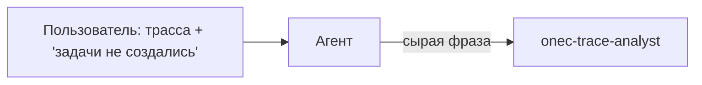
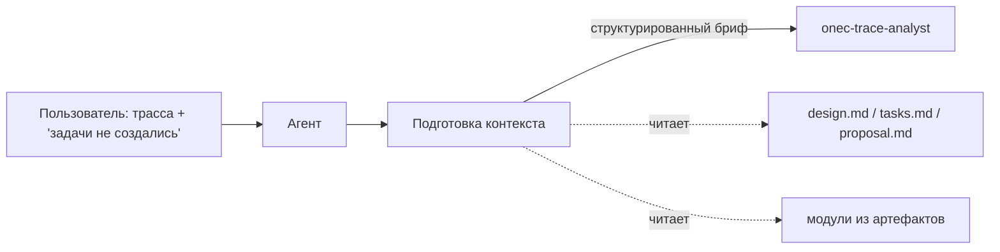

# Обогащённый контекст для анализа трассировок

## Диагноз проблемы

Сейчас цепочка работает так:




Trace-analyst получает только путь к файлу и дословную фразу пользователя. Его шаг 0 (Determine Analysis Focus) пытается из этой фразы понять, **что** искать в трассе, но контекста недостаточно: нет информации о доработке, ожидаемом поведении, затронутых модулях.

**Целевая цепочка:**




## Что менять (5 файлов)

### 1. [.cursor/rules/1c-error-analysis.mdc](.cursor/rules/1c-error-analysis.mdc) — главный оркестратор

**Добавить новый раздел "ПОДГОТОВКА КОНТЕКСТА" между "ПРИОРИТЕТ НАД РЕЖИМОМ" и "ДЕРЕВО РЕШЕНИЙ".**

Содержание раздела:

- **Обязательный шаг перед вызовом trace-analyst** (не пропускать):
  1. Определить, есть ли активное openspec-изменение (`openspec list --json` или из контекста диалога).
  2. **Если есть** — прочитать proposal.md, design.md, tasks.md (не более 3 файлов); извлечь:
    - Суть доработки (1-2 предложения)
    - Ожидаемое поведение (что должно было произойти)
    - Затронутые модули/процедуры (из design/tasks)
    - Какая задача (task) провалилась (если указан номер)
  3. **Если нет** (ad-hoc) — из описания пользователя и при необходимости 1-2 поиска по кодовой базе (Grep/Glob) извлечь:
    - О чём функциональность (по ключевым словам пользователя)
    - Ожидаемое vs фактическое поведение
    - Релевантные модули (если упомянуты или найдены поиском)
  4. Сформировать **структурированный бриф** (формат ниже) и передать его в промпт trace-analyst.
- **Формат брифа:**

```
## Контекст задачи для анализа трассы

### Суть доработки
[Что делали / какая функциональность]

### Ожидаемое поведение  
[Что должно было произойти]

### Фактический симптом
[Что произошло на самом деле — из слов пользователя]

### Релевантные модули и процедуры
[Из design/tasks или из поиска по кодовой базе]

### Что искать в трассе
[Конкретные точки: вызов создания задач, запись в регистр, обработчик проведения и т.п.]
```

- **Обновить формулировку вызова trace-analyst** (стр. 36-37): вместо `[вопрос/описание ошибки]` — `[структурированный бриф]`. Новая шаблонная формулировка:

> «Проанализируй трассу [путь].
>
> [--- вставить структурированный бриф ---]
>
> Выдели MODULES MAP, определи фокус анализа по контексту выше. ОБЯЗАТЕЛЬНО проверь контекст критичных строк по исходному коду. Если трасса COMPACT и контекст неясен — требуй FULL. Не додумывай. Формат вывода: Verified facts / Hypotheses и блок "Recommended next steps".»

- **Обновить раздел "ФОРМУЛИРОВКИ ДЛЯ СУБАГЕНТОВ"** — шаблон для onec-trace-analyst должен включать бриф.

### 2. [.cursor/skills/openspec-debug/SKILL.md](.cursor/skills/openspec-debug/SKILL.md) — шаг 3.5

**Добавить подшаг 3.5.0 "Подготовить контекст для trace-analyst"** перед текущим пунктом 1.

Содержание:

- На основе шага 2 (уже загружены proposal, design, tasks) синтезировать бриф:
  - Суть доработки (из proposal)
  - Ожидаемое поведение затронутой задачи (из tasks.md — конкретная задача, если указан номер)
  - Затронутые модули/процедуры (из design.md — секция с архитектурой/модулями)
  - Что искать в трассе (вывести из ожидаемого поведения: например, если задача «создать задачи при проведении» — искать вызов создания задач, запись в регистр задач, обработчик проведения)
  - Фактический симптом (из шага 3 — текст ошибки / замечание пользователя)

**Обновить пункт 1 шага 3.5** — передавать trace-analyst не просто путь + "Parse trace", а путь + подготовленный бриф. Заменить текущий шаблонный instruction на:

> Pass the trace file path **and the enriched context brief** (from step 3.5.0).


### 4. [.cursor/agents/onec-trace-analyst.md](.cursor/agents/onec-trace-analyst.md) — агент

**Обновить секцию INPUT** — документировать, что агент ожидает получить:

- Путь к трассе (обязательно)
- **Структурированный бриф** (рекомендуется) — с полями: суть доработки, ожидаемое поведение, фактический симптом, релевантные модули, что искать
- Или минимально: текст ошибки / описание проблемы

**Обновить шаг 0 (Determine Analysis Focus)** — добавить:

- Если получен структурированный бриф — использовать его как основу для фокуса, а не пытаться извлечь фокус из одной фразы
- Из поля «Что искать в трассе» — конкретные точки для анализа
- Из поля «Релевантные модули» — приоритетные модули для Context Verification (шаг 3)

### 5. [AGENTS.md](AGENTS.md) — секция "Анализ ошибок 1С"

**Добавить упоминание** обязательного шага подготовки контекста перед вызовом trace-analyst. Одно предложение, ссылка на `1c-error-analysis.mdc`.

## Ключевые принципы доработки

- **Бриф — не роман.** 5-10 строк, структурированные. Цель — дать trace-analyst фокус, не перегружая контекстом.
- **Допустимые затраты:** чтение 2-3 артефактов (они и так читаются в debug на шаге 2) + формулировка брифа. Это не добавляет лишних вызовов в ad-hoc сценарии — максимум 1-2 Grep.
- **Не ломать существующее:** trace-analyst продолжает работать и с минимальным контекстом (если вызван напрямую без артефактов), но с обогащённым контекстом даёт значительно лучший результат.
- **Формат "Что искать в трассе"** — самое ценное: это перевод бизнес-описания («задачи не создались») в технические точки поиска («вызов СоздатьЗадачиПроведения, запись в РегистрСведений.Задачи, обработчик ОбработкаПроведения»).

