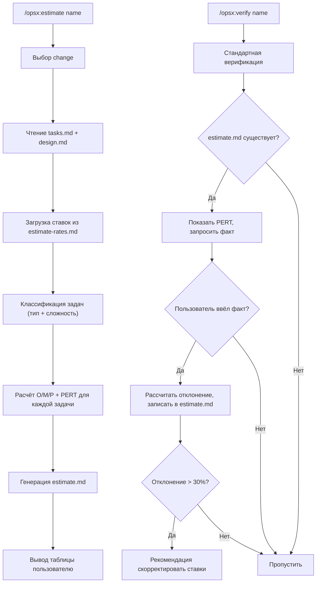

# Скилл оценки трудозатрат ЗНИ

## Что создаём

Структурированную оценку трудозатрат по артефактам OpenSpec change в человеко-часах (как если бы работу выполнял разработчик 1С, а не ИИ). Метод — трёхточечная PERT-оценка. Калибровка по факту — на этапе verify.

## Файлы для создания/изменения

### 1. Команда: [.cursor/commands/opsx-estimate.md](.cursor/commands/opsx-estimate.md) (новый)

Точка входа. Формат аналогичен существующим командам (пример — [opsx-ff.md](.cursor/commands/opsx-ff.md)):

```markdown
---
name: /opsx-estimate
id: opsx-estimate
category: Workflow
description: Estimate man-hours for a change using PERT method
---
```

Делегирует в `.cursor/skills/openspec-estimate/SKILL.md`.

### 2. Скилл: [.cursor/skills/openspec-estimate/SKILL.md](.cursor/skills/openspec-estimate/SKILL.md) (новый)

Основная логика. Алгоритм:

**Шаг 1 — Выбор change** (стандартная логика: аргумент / auto-detect / AskQuestion)

**Шаг 2 — Загрузка артефактов**

- Обязательно: `tasks.md` (основа для оценки)
- Контекст: `proposal.md`, `design.md` (для понимания сложности)
- Если `tasks.md` нет — грубая оценка по `design.md` с предупреждением о низкой точности

**Шаг 3 — Загрузка ставок**

- Читать `openspec/estimate-rates.md`
- Если файла нет — использовать встроенные значения по умолчанию, предложить создать файл

**Шаг 4 — Классификация каждой задачи**

Для каждой задачи из tasks.md определить:

- **Тип активности**: Анализ, Проектирование, Кодирование, Тестирование, Ревью
- **Сложность**: Простая / Средняя / Сложная

Критерии классификации (встроены в скилл):

- Кодирование: основной тип для задач с изменением .bsl
- Анализ: задачи аудита, обследования, трассировки
- Тестирование: задачи ручной верификации (секция "Ручная верификация" в tasks.md)
- Ревью: финальное ревью расширения
- Проектирование: задачи с архитектурными решениями

Сложность определяется по содержимому задачи:

- Простая: 1 процедура, ясный паттерн, нет зависимостей
- Средняя: 1 модуль, нетривиальная логика или зависимости от других задач
- Сложная: несколько модулей, интеграция, побочные эффекты, &ИзменениеИКонтроль

**Шаг 5 — Расчёт**

Для каждой задачи: O/M/P из ставок по типу+сложность, PERT = (O + 4M + P) / 6.
Суммирование. Буфер (%). Итого.

**Шаг 6 — Генерация estimate.md**

Сохранить в `openspec/changes/<name>/estimate.md`. Формат:

```markdown
# Оценка трудозатрат: <change-name>
Дата оценки: YYYY-MM-DD

## Сводка
| Показатель | Значение |
|---|---|
| Оптимистичная | X ч/ч |
| PERT (взвешенная) | Y ч/ч |
| Пессимистичная | Z ч/ч |
| Буфер | N% |
| Итого (PERT + буфер) | W ч/ч |

## Детализация
| # | Задача | Тип | Сложн. | O | M | P | PERT |
|---|---|---|---|---|---|---|---|
| 1.1 | ... | Кодирование | Средняя | 2 | 3 | 5 | 3.2 |

## Допущения
- Разработчик знаком с предметной областью 1С:ДО
- Имеется доступ к тестовой базе
- ...

## Риски, влияющие на оценку
- ...
```

**Шаг 7 — Вывод пользователю**

Показать таблицу и итог. Предложить: "Скорректировать оценку вручную?" (AskQuestion).

### 3. Ставки: [openspec/estimate-rates.md](openspec/estimate-rates.md) (новый)

Конфигурируемые референсные ставки для проекта. Формат:

```markdown
# Референсные ставки оценки трудозатрат

## Кодирование
| Сложность | O | M | P |
|---|---|---|---|
| Простая | 0.5 | 1 | 2 |
| Средняя | 1.5 | 3 | 5 |
| Сложная | 3 | 6 | 10 |

## Анализ / Обследование
| Сложность | O | M | P |
|---|---|---|---|
| Простая | 0.5 | 1 | 2 |
| Средняя | 1 | 2 | 4 |
| Сложная | 2 | 4 | 8 |

## Тестирование (за сценарий)
| O | M | P |
|---|---|---|
| 0.3 | 0.75 | 1.5 |

## Ревью (за модуль)
| O | M | P |
|---|---|---|
| 0.5 | 1 | 1.5 |

## Проектирование
| Сложность | O | M | P |
|---|---|---|---|
| Средняя | 1 | 2 | 4 |
| Сложная | 2 | 4 | 8 |

## Буфер
15%
```

### 4. Правило: [.cursor/rules/no-roi-estimates.mdc](.cursor/rules/no-roi-estimates.mdc) (изменение)

Добавить исключение:

```markdown
## EXCEPTIONS

- Команда `/opsx:estimate` — структурированная оценка трудозатрат по артефактам change.
  Оценка выполняется по tasks.md методом PERT, с конфигурируемыми ставками.
  Спонтанные оценки в других контекстах (proposal, design, apply) по-прежнему запрещены.
```

### 5. Скилл verify: [.cursor/skills/openspec-verify-change/SKILL.md](.cursor/skills/openspec-verify-change/SKILL.md) (изменение)

Добавить шаг калибровки **после** шага 8 (Generate Verification Report), перед финальным выводом:

**Шаг 8.5 — Калибровка оценки (если estimate.md существует)**

1. Проверить наличие `openspec/changes/<name>/estimate.md`
2. Если существует:
  - Показать PERT-итог из файла
  - AskQuestion: "Оценка трудозатрат: Y ч/ч (PERT). Укажите фактические трудозатраты для калибровки (ч/ч), или пропустите."
  Варианты: [Ввести факт / Пропустить]
  - Если пользователь вводит факт:
    - Рассчитать отклонение: (факт - PERT) / PERT * 100%
    - Добавить в estimate.md секцию `## Факт`:

```
       ## Факт
       | Показатель | Значение |
       |---|---|
       | Фактические трудозатраты | F ч/ч |
       | Отклонение от PERT | +/-N% |
       | Дата фиксации | YYYY-MM-DD |
       

```

```
 - Если отклонение > 30% — предложить: "Отклонение значительное. Рекомендую скорректировать ставки в `openspec/estimate-rates.md`." (совет, не автоматическая правка)
```

1. Если estimate.md не существует — пропустить шаг

### 6. Скилл archive: [.cursor/skills/openspec-archive-change/SKILL.md](.cursor/skills/openspec-archive-change/SKILL.md) (изменение, опционально)

Мягкое напоминание. Добавить в шаг 3 (Check task completion status), после проверки tasks:

- Если `estimate.md` существует и **не содержит** секции `## Факт`:
  - Показать предупреждение: "Оценка трудозатрат не калиброван. Рекомендуется: `/opsx:verify <name>` для фиксации факта."
  - Не блокировать архивацию

### 7. Регистрация в навигационных файлах

- [AGENTS.md](AGENTS.md): добавить секцию "Оценка трудозатрат" с ссылкой на скилл и команду
- [openspec/project.md](openspec/project.md): упомянуть `/opsx:estimate` в списке команд

## Схема работы




## Ключевые решения

- **estimate.md — не артефакт схемы OpenSpec.** Обычный файл в каталоге change, не требует изменений CLI/схемы. Скилл создаёт, verify проверяет, archive архивирует вместе с остальным.
- **Ставки — отдельный файл, не project.md.** Чтобы не перегружать project.md и дать возможность менять ставки независимо.
- **Калибровка — в verify, не в archive.** Verify — точка осознанной проверки. Archive — быстрая операция, не стоит её нагружать вводом данных (но мягкое напоминание полезно).
- **Автоматическая корректировка ставок — не делаем.** Только совет пользователю. Ставки — ответственность человека.
- **Группировка задач.** Задачи из одной секции tasks.md (например "Ручная верификация" с 4 сценариями) могут группироваться в одну строку оценки, если все сценарии однотипны.

