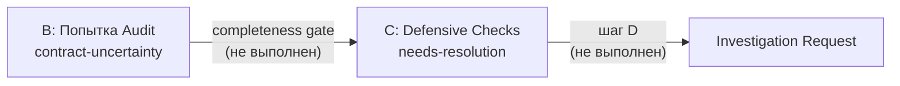

# Исправление пропуска Investigation Request ревьювером

## Проблема

Ревьювер корректно выставляет RootCause = contract-uncertainty в таблице B (Попытка Audit), но **не переносит** этот источник в таблицу C (Defensive Checks) и **не добавляет** секцию Investigation Request. Причина — разрыв между шагами:




Completeness gate (стр. 589) **описан**, но его формулировка привязана к «источникам с типом доступа DEFENSIVE/GUARDED/EXPLORATORY» и «Свойство/ТипЗнч». Когда доступ к полям источника идёт **напрямую внутри Попытка** (DIRECT внутри Попытка, без Свойство/ТипЗнч), ревьювер не классифицирует тип доступа как один из перечисленных и не создаёт строку в C.

Шаг D (стр. 591–598) формально срабатывает по первому условию (RootCause = contract-uncertainty в B), но без строки в C ревьювер «не знает», для какого конкретно источника/метода формировать запись в Investigation Request.

## Файл для правки

[.cursor/agents/onec-code-reviewer.md](.cursor/agents/onec-code-reviewer.md)

## Правка 1: Completeness gate — явная связка B → C (стр. 587–589)

**Текущий текст** (стр. 589):

```
Completeness gate (Defensive Checks): для КАЖДОГО источника из Contract Map
с типом доступа DEFENSIVE, GUARDED или EXPLORATORY, а также для источников,
к полям которых обращаются ТОЛЬКО внутри Попытка — в Defensive Checks Table
обязательна строка. ...
```

**Проблема:** «а также для источников, к полям которых обращаются ТОЛЬКО внутри Попытка» — это подпункт внутри длинного предложения, легко пропустить. Нет явной связки с таблицей B (RootCause = contract-uncertainty).

**Новый текст:** добавить отдельный абзац-правило сразу после completeness gate:

```
Completeness gate (B → C bridge): для КАЖДОЙ строки таблицы B
с RootCause = contract-uncertainty или mixed(ext+contract):
  1. Определить источник данных, к полям которого идёт доступ
     внутри этого блока Попытка (из Contract Map или Operations inside).
  2. Добавить строку в таблицу C:
     Source = имя источника (модуль.метод, параметр и т.д.),
     Field = перечень полей, к которым обращается код внутри Попытка,
     Contract = needs-resolution,
     Verdict = contract-compensating-try,
     Пометка: «DIRECT inside Попытка, no explicit check — from Audit row #N».
  3. Если строка по этому источнику уже есть в C (источник также
     проверяется через Свойство/ТипЗнч) — обновить Contract на
     needs-resolution, не дублировать строку.
Без этой строки Phase 2.5 считается незавершённой для данного блока.
```

## Правка 2: Шаг D — дублировать триггер по таблице B (стр. 591–598)

**Текущий текст** (стр. 591–598) начинается:

```
D. Investigation Request (резолв контрактов по запросу ревьювера):
   Если при заполнении таблиц B (Попытка Audit) или C (Defensive Checks)
   для какого-либо источника данных:
     - RootCause = contract-uncertainty (Попытка Audit), ИЛИ
     ...
```

**Проблема:** условие формально верное, но ревьювер его не связывает с конкретным действием «заполнить таблицу Investigation Request по данным из B». Триггеры перечислены, но не указано, откуда брать информацию для строки IR (метод, контекст вызова, что определить).

**Новый текст:** после пункта 2 (стр. 598) добавить пункт 3:

```
     3. Для КАЖДОГО источника с needs-resolution из таблицы C
        добавить строку в Investigation Request:
        - Метод: имя функции/процедуры, возвращающей данные
          (из Contract Map, колонка Origin).
        - Контекст вызова: объект/модуль, где определена функция.
        - Что нужно определить: тип возврата, ключи структуры/массива,
          вложенные структуры, fixed/dynamic.
        Если источник попал в C через B → C bridge (Правка 1),
        метод берётся из Operations inside соответствующей строки B.
```

## Правка 3: Pre-emit checklist в Phase 4 (стр. 627–649)

В секцию Phase 4: Report Generation перед `3. Summary` добавить:

```
2.6. Pre-emit checklist (выполнить перед финализацией отчёта):
   - [ ] Для каждой строки таблицы B с contract-uncertainty:
         есть ли строка в C с needs-resolution по тому же источнику?
         Нет → добавить (B → C bridge).
   - [ ] Если в C есть хотя бы одна строка с needs-resolution:
         есть ли секция Investigation Request?
         Нет → добавить.
   - [ ] Количество строк в Investigation Request >= количество
         уникальных источников с needs-resolution в C.
```

## Правка 4: AGENTS.md — обновить описание (стр. 6 секции «Code reviewer»)

Добавить упоминание B → C bridge и pre-emit checklist для навигации:

```
**B → C bridge:** contract-uncertainty в Попытка Audit → обязательная
строка в Defensive Checks (needs-resolution) → Investigation Request.
Pre-emit checklist гарантирует целостность.
```

## Правка 5: Версия и changelog

Обновить footer (стр. 1244–1245):

- Version: 2.2 → **2.3**
- Changes: «B → C bridge (completeness gate для contract-uncertainty → Defensive Checks → Investigation Request); pre-emit checklist в Phase 4»

## Обоснование

- **Правки 1–2** устраняют корневую причину: ревьювер не переносил источник из Audit Table в Defensive Checks при DIRECT-доступе внутри Попытка, поэтому шаг D не мог сформировать конкретный запрос.
- **Правка 3** — страховочный чеклист перед выдачей отчёта; даже если ревьювер пропустит bridge, чеклист напомнит.
- **Правка 4** — навигация для оркестратора (AGENTS.md — единственный индекс).
- **Правка 5** — трекинг изменений.

