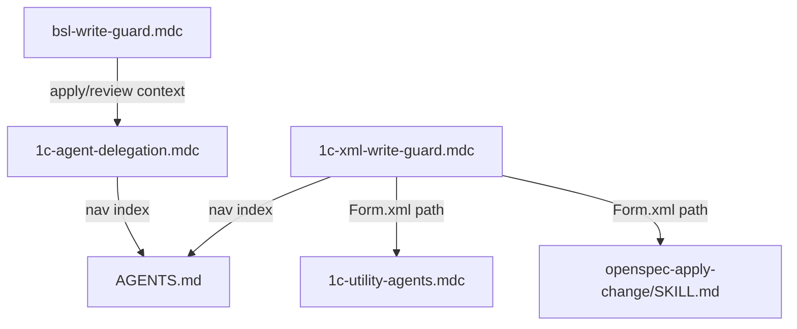

# Усиление guards: формы и BSL в apply-контексте

## Проблемы (root cause из предыдущей сессии)

В сессии [apply cloud-signatures раздел 7](d2c317b0-e1ae-4e54-84b5-dd5d48d92345) оркестратор нарушил два правила:

- **Form.xml**: прямая правка через StrReplace (добавление колонок, кнопок, команд), хотя `1c-xml-write-guard.mdc` это запрещает. Причина: правило предлагает делегировать в `onec-form-generator` / `1c-forms/edit`, но для конкретных операций (колонка в таблице атрибутов, кнопка в popup) эти инструменты не подходили — и оркестратор "пошёл напрямую".
- **BSL**: прямая правка через StrReplace для post-reviewer fixes и spot-check corrections. Оркестратор трактовал их как «однострочные правки» (исключение из `bsl-write-guard.mdc`), хотя это были содержательные изменения логики.

## Изменение 1: Form.xml — только инструкции ручного конфигурирования

**Файл:** `[.cursor/rules/1c-xml-write-guard.mdc](.cursor/rules/1c-xml-write-guard.mdc)`

Переработать секцию для Form.xml в таблице ДЕЛЕГИРОВАНИЕ:

- **Было:** `Form.xml → Скилл 1c-forms/edit (form-edit.ps1) или onec-form-generator с design-спецификацией`
- **Станет:** `Form.xml → СТОП. Сформировать инструкцию ручного конфигурирования для пользователя. WAIT.`

Добавить новую секцию **ФОРМАТ ИНСТРУКЦИИ РУЧНОГО КОНФИГУРИРОВАНИЯ** с шаблоном:

```markdown
## Ручное конфигурирование: <Имя формы>

**Форма:** <Полное имя формы>
**Конфигурация/расширение:** <Имя>

### Действия в Конфигураторе:

1. <Шаг — например: Открыть форму ... в Конфигураторе>
2. <Шаг — например: Добавить реквизит "ТипРазмещения" (Число, 1, 0)>
   - Тип: ...
   - Заголовок: ...
3. ...

### После выгрузки
Ожидаемые изменения в Form.xml: <краткое описание>
```

Принцип: аналогичен `1c-no-metadata-creation.mdc` — не делать, а инструктировать.

**Файл:** `[1c-utility-agents.mdc](.cursor/rules/1c-utility-agents.mdc)`

Обновить строку:

- **Было:** `Работа с формами 1С (Form.xml) → Загрузить 1c-forms. Делегировать onec-form-generator`
- **Станет:** `Работа с формами 1С (Form.xml) → СТОП. Инструкция ручного конфигурирования. Ref: 1c-xml-write-guard.mdc`

**Файл:** `[openspec-apply-change/SKILL.md](.cursor/skills/openspec-apply-change/SKILL.md)` (строка ~163, Task Dispatch)

Обновить строку:

- **Было:** `Форма (Form.xml) → onec-form-generator или скилл 1c-forms через агента`
- **Станет:** `Форма (Form.xml) → СТОП. Инструкция ручного конфигурирования (1c-xml-write-guard.mdc). WAIT — не продолжать до выгрузки`

Обновить HALT (строка ~169): добавить Form.xml в перечень запрещённых для прямой реализации.

## Изменение 2: BSL — запрет прямой правки в командных сессиях

**Файл:** `[bsl-write-guard.mdc](.cursor/rules/bsl-write-guard.mdc)`

В секцию ИСКЛЮЧЕНИЯ добавить ограничитель:

```markdown
**Контекст apply/review:** Исключения (однострочная правка, только комментарии)
НЕ действуют в командных сессиях /opsx:apply и /review.
В этих контекстах ВСЕ правки .bsl → writer.
Post-reviewer fixes, spot-check corrections, пропущенные строки —
всегда через writer. Rationale: в apply-сессии оркестратор склонен
трактовать содержательные правки как "мелкие", обходя делегирование.
```

**Файл:** `[1c-agent-delegation.mdc](.cursor/rules/1c-agent-delegation.mdc)`

В секцию АВТО-ИСПРАВЛЕНИЕ РЕВЬЮ (строка ~107-113) добавить:

```markdown
**Без прямого StrReplace.** Все кодовые замечания — через writer.
Оркестратор НЕ исправляет замечания ревью напрямую (StrReplace),
даже если правка кажется "однострочной". Spot-check corrections
после writer — тоже через writer.
```

В секцию ИСКЛЮЧЕНИЯ (строка ~271-276) добавить оговорку:

```markdown
**Ограничение:** Исключения для прямой правки .bsl не действуют
в контексте командных сессий /opsx:apply и /review.
```

## Изменение 3: AGENTS.md — обновить навигацию

**Файл:** `[AGENTS.md](AGENTS.md)`

Обновить запись `## XML write guard`: отразить, что Form.xml → только инструкции ручного конфигурирования (не через скиллы/агентов).

## Что НЕ меняем

- `1c-no-metadata-creation.mdc` — не затронут (создание объектов, не правка форм)
- Скиллы `1c-forms/`* — остаются доступными для анализа (info, validate), но не для edit/compile/scaffold в контексте Form.xml
- `onec-form-generator` — остаётся как агент, но его полномочия на Form.xml ограничиваются инструкцией: генерировать инструкции, а не править XML

## Граф зависимостей




