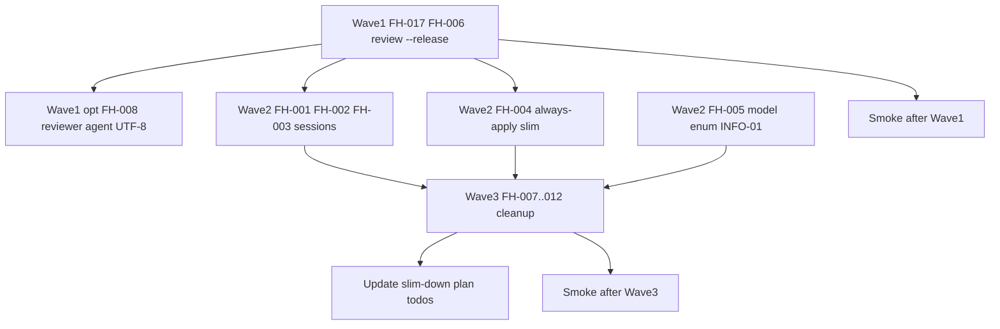

# План устранения замечаний Framework Health Verdict

**Источник:** [reports/framework-health-verdict-2026-06-07.md](reports/framework-health-verdict-2026-06-07.md)  
**Базовый коммит аудита:** `0109f977fa`  
**Перепроверка плана:** 2026-06-07 — находки **актуальны** (grep по репо); размеры always-apply ~21.6 KB + ~22.4 KB ≈ **44 KB** (ratio ~53%, порог WARN сохраняется).

**Решения заказчика:** glossary — убрать ссылку (не создавать файл); slim always-apply — Wave 2; legacy read-only в ff/extend для `openspec/sessions/` — **оставить**, не удалять.

---

## Карта находок → волны

| ID | Severity | Волна | Статус (код) |
|----|----------|-------|--------------|
| FH-017 | CRITICAL | 1 | FAIL — шаги 2–3 review SKILL без ветки `--release` |
| FH-006 | HIGH | 1 | FAIL — slim-down todo `review-release` pending; порт 3b не в теле SKILL |
| FH-001 | HIGH | 2 | FAIL — `AGENTS.md` L14 ссылается на несуществующий glossary |
| FH-002 | HIGH | 2 | FAIL — `openspec-sessions.mdc` без DEPRECATED (on-demand, не always-apply) |
| FH-003 | HIGH | 2 | FAIL — cycle/compose/composer с инструкциями создания sessions |
| FH-004 | HIGH | 2 | WARN — always-apply >20 KB на файл |
| FH-005 | HIGH | 2 | WARN — Primary вне enum Task |
| FH-007 | MED | 3 | estimate/doc-tz в chat-budget, opsx-output-style |
| FH-008 | MED | 3 (+1 опц.) | mojibake reviewer-checks + **весь** onec-code-reviewer.md |
| FH-009 | MED | 3 | knowledge-format L390 — legacy команды |
| FH-010 | MED | 3 | AGENTS decision tree — 3 команды |
| FH-011 | MED | 3 | navigator → platform links |
| FH-012 | MED | 3 | LINT GATE — частичное дублирование (см. уточнение ниже) |
| FH-013, FH-014 | LOW | — | без действий |
| INFO-01 | INFO | 2/3 | slim-down todos 3b pending, 3c фактически done |

**Примечание:** INFO-01 ≠ FH-006. FH-006 — только предрелизный порт (3b); закрытие todo `migrate-slices-replacement` — INFO-01.

---

## Диаграмма зависимостей



---

## Wave 1 — Blocker (CRITICAL + FH-006 / slim-down 3b)

### FH-017 + FH-006: починить `/review --release`

**Проблема:** в [`.cursor/skills/review/SKILL.md`](.cursor/skills/review/SKILL.md) шапка (L16) обещает `mode=prerelease`, Category 12, Tier 2; шаг 2 (L206) и шаг 3 (L265) **всегда** запрещают prerelease — режим не работает.

**Источник для порта:**

```powershell
git show 6b9be07e74:.cursor/skills/prerelease-review/SKILL.md
```

Детальный чеклист порта — фаза 3b в [`.cursor/plans/framework_slim-down_34f3d829.plan.md`](.cursor/plans/framework_slim-down_34f3d829.plan.md) (§ «Фаза 3b»).

#### 1. Флаг и ранний резолв scope

В начале шага 1 (до 1.1) добавить `release_mode = (--release в аргументах)`:

| `--release` | Scope по умолчанию | `review_focus` | Light-review (1.4) |
|---|---|---|---|
| без change | все `*.bsl` в cfe расширения (`full-extension`) | `full` | **отключить** (как при `--full`) |
| с change (`/review --release <ext> <change>`) | `target_files` из resolver (architecture → tasks → design → git) | `diff-focused` + Review Boundaries | **отключить** |
| обычный `/review` | без изменений (таблица 1.2) | как сейчас | как сейчас |

При `--release` + неоднозначный/пустой scope — подшаг **1.3a** (Scope Preview, см. ниже).

#### 2. Шаг 2 — условный бриф

Заменить жёсткую строку L206 на ветвление:

```markdown
- Задача (release_mode=false): «Полный подробный ревью. Без mode=prerelease.»
- Задача (release_mode=true): «Предрелизное ревью. mode=prerelease. Category 12 Release Readiness. Эскалация severity по AP-каталогу.»
```

#### 3. Шаг 3 — передать `mode=prerelease`

- Убрать L265 «Не передавать mode=prerelease» при `release_mode=true`.
- Добавить в промпт: `mode=prerelease`, Category 12, release-hygiene focus (legacy skill §2.1 батчи 1a–3).
- Шаг 3 «fix pipeline» (L381+ LINT GATE) — **не дублировать** полный текст; ссылка на SSOT (задел FH-012, можно в Wave 1 только если мешает читаемости).

#### 4. Портировать из legacy prerelease (FH-006)

| Capability | Куда | Приоритет |
|---|---|---|
| `change-scoped` resolver (1.3a) | новый подшаг 1.3a в review SKILL, только при `--release` + change | HIGH |
| Scope Preview (AskQuestion при ambiguous/пустом target) | подшаг 1.3a | MED |
| Tier 2 explorer (architect deep-analysis по `extension_all_bsl`) | новый шаг 3.2, только `--release` | HIGH |
| Батчи A/B/C (object/server/form modules) | расширить шаг 3 при `--release` и >5 файлов | MED |
| Follow-up extend | §7.2/7.2b — в Summary «Куда дальше» явная строка для `--release` | LOW |

**Не дублировать:** mandatory control (1.6–1.6.2) и LINT GATE evidence (1.8) уже в review v2.0.

#### 5. Синхронизировать смежные файлы

| Файл | Изменение |
|---|---|
| [`.cursor/skills/1c-agent-patterns/reviewer.md`](.cursor/skills/1c-agent-patterns/reviewer.md) | Новый шаблон «Reviewer (предрелиз)» с `mode=prerelease`, Category 12, эскалацией `(prerelease) / HIGH` |
| [`.cursor/agents/onec-code-reviewer.md`](.cursor/agents/onec-code-reviewer.md) | Секция «Prerelease mode»: при `mode=prerelease` — Category 12 из [`reviewer-checks.md`](.cursor/docs/standard/reviewer-checks.md) §12, эскалация HIGH→CRITICAL по AP-каталогу |
| [`.cursor/commands/review.md`](.cursor/commands/review.md) | Уже описывает `--release` — сверить с SKILL после правок |

#### 6. Закрыть todo slim-down

В [`.cursor/plans/framework_slim-down_34f3d829.plan.md`](.cursor/plans/framework_slim-down_34f3d829.plan.md): `review-release` → **completed** (после Wave 1 + smoke).

**Парадокс плана slim-down:** `verify-grep` (фаза 8) уже **completed**, а 3b **pending** — после Wave 1 выровнять metadata (3b completed) или добавить в фазу 8 примечание «3b отложен до remediation».

#### 7. Опционально до smoke — FH-008 (reviewer agent)

Файл [`onec-code-reviewer.md`](.cursor/agents/onec-code-reviewer.md) целиком в mojibake (не только AP-секции). Для smoke `/review --release` достаточно перекодировать **frontmatter + секцию Prerelease mode**; полный файл — Wave 3.

#### Acceptance Wave 1

- Grep: в review SKILL нет безусловных «Без mode=prerelease» / «Не передавать mode=prerelease» (только в ветке `release_mode=false`).
- Checkpoint #8 в отчёте → **PASS**.
- Smoke: `/review --release <расширение>` по [`.cursor/docs/ux-acceptance-isolated-chat.md`](.cursor/docs/ux-acceptance-isolated-chat.md) — reviewer получает `mode=prerelease`, отчёт содержит Category 12 / release-hygiene; light-review не срабатывает.

#### Out of scope Wave 1 (зафиксировать, не чинить без отдельного решения)

- Review SKILL L30–31 «Понял: запускаю ревью…» vs `chat-output-budget` No Acknowledgement — отдельный UX-конфликт, не входит в FH-017.

---

## Wave 2 — Consistency (HIGH + context budget)

### FH-001: glossary (решение — убрать ссылку)

- [AGENTS.md](AGENTS.md) L14: удалить «Полный глоссарий терминов: `openspec/glossary.md`» или заменить на «Термины workflow — decision tree ниже и [`openspec/project.md`](openspec/project.md)».
- Grep по репо (искл. archive/plans): других ссылок на `openspec/glossary.md` не должно остаться.

### FH-002 + FH-003: legacy sessions protocol

**Конфликт:** Ultra-Lite explore запрещает **создание** `openspec/sessions/`, но:

- [`.cursor/rules/openspec-sessions.mdc`](.cursor/rules/openspec-sessions.mdc) — полный bootstrap (**уже** `alwaysApply: false`, конфликт при on-demand Read)
- [`.cursor/skills/openspec-explore/cycle.md`](.cursor/skills/openspec-explore/cycle.md), [`compose.md`](.cursor/skills/openspec-explore/compose.md) — DEPRECATED в шапке, но тело с Write sessions
- [`.cursor/agents/openspec-composer.md`](.cursor/agents/openspec-composer.md) — active path к sessions

**Действия:**

1. `openspec-sessions.mdc` — **DEPRECATED** в description + redirect: «Актуально: [`openspec-explore/SKILL.md`](.cursor/skills/openspec-explore/SKILL.md) §Bootstrap; отчёты — `temp/reports/`».
2. `cycle.md`, `compose.md` — свернуть до stub (~15 строк): DEPRECATED + ссылка на explore SKILL; **убрать** шаги Write `openspec/sessions/...`.
3. `openspec-composer.md` — deprecated или «read-only legacy sessions if exist»; убрать из active explore path.
4. [`session-discipline.mdc`](.cursor/rules/session-discipline.mdc) — уже Ultra-Lite; согласовать формулировки.

**Не трогать (намеренный legacy read-only):**

- [`openspec-ff-change/SKILL.md`](.cursor/skills/openspec-ff-change/SKILL.md) — fallback `Glob openspec/sessions/*/analysis.md` (≤48ч)
- [`openspec-extend-change/SKILL.md`](.cursor/skills/openspec-extend-change/SKILL.md) — `--from-report` legacy path
- [`opsx-extend.md`](.cursor/commands/opsx-extend.md) — то же

Grep-потребители composer: ff/extend — только fallback, не active create.

### FH-004: slim always-apply (~44 KB → цель <30 KB суммарно)

**Файлы:** [`chat-output-budget.mdc`](.cursor/rules/chat-output-budget.mdc) (~21.6 KB), [`1c-agent-delegation.mdc`](.cursor/rules/1c-agent-delegation.mdc) (~22.4 KB).

**Подход:**

1. Создать on-demand [`.cursor/rules/1c-halt-triggers.mdc`](.cursor/rules/1c-halt-triggers.mdc):
   - `alwaysApply: false`
   - `globs: **/*.bsl` (или явный Read из delegation stub при правке BSL)
   - полная HALT-таблица + LIGHT/MECHANICAL/исключения (тело из delegation)
2. В `1c-agent-delegation.mdc` always-apply оставить: принцип, «HALT → Read 1c-halt-triggers», APPLY GATE stub, XML WRITE GUARD stub, таблицу делегирования (компактно), DELEGATION GATE, **краткий** LINT GATE stub (1–2 строки + ссылка).
3. LINT GATE полный текст — SSOT в [`1c-writer-pipeline.mdc`](.cursor/rules/1c-writer-pipeline.mdc); в skills — однострочная ссылка (FH-012).
4. `chat-output-budget.mdc`: §7 HALT — «см. [`chat-lexicon.md`](.cursor/docs/chat-lexicon.md)» вместо дублирования; оставить лимиты строк и non-events.
5. **Регистрация:** добавить `1c-halt-triggers.mdc` в SSOT-карту [AGENTS.md](AGENTS.md); при необходимости строку-триггер в [`gate-dispatcher.mdc`](.cursor/rules/gate-dispatcher.mdc) («правка .bsl → 1c-halt-triggers»).

**Риск:** оркестратор может пропустить HALT без явного Read — mitigation: компактная мини-таблица триггеров (1 строка на триггер) в always-apply delegation + обязательный Read on-demand при срабатывании.

**Gate:** `always_apply_ratio` < 40% (было ~53%); оба файла < 20 KB.

### FH-005: model-selection vs Task enum

[`.cursor/rules/model-selection.mdc`](.cursor/rules/model-selection.mdc) L19–21, L33–35:

| Роль | Было | Стало (enum-safe, сверить с актуальным enum Task) |
|---|---|---|
| architect Primary | `claude-opus-4-8-thinking-high` | `claude-opus-4-7-thinking-xhigh` или `gemini-3.1-pro` |
| writer/explorer Primary | `default` | убрать `default`; Primary = вызов **без** `model=` (inherit) или slug из enum: `composer-2.5-fast` / `gpt-5.3-codex` |

**Важно:** в enum Task **нет** `composer-2-fast` и `claude-opus-4-8-thinking-high` — не использовать в таблице Primary.

Обновить секцию «Целостность цепочки Task» и примеры вызовов (L45, L53) — первый шаг не должен падать на `Invalid model selection`.

### INFO-01: metadata slim-down (3c)

- Plan todo `migrate-slices-replacement` → **completed** (grep skills/rules = 0 `migrate-slices` вне CHANGELOG/plans — уже выполнено в коде).
- `review-release` → **completed** только после Wave 1.

---

## Wave 3 — Cleanup (MED/LOW + dedup)

### FH-007: legacy terms `estimate` / `doc-tz`

| Файл | Правка |
|---|---|
| [`chat-output-budget.mdc`](.cursor/rules/chat-output-budget.mdc) L54 | «verify, длинные сводки» без estimate/doc-tz |
| [`opsx-output-style.md`](.cursor/docs/opsx-output-style.md) L3, L414 | убрать estimate/doc-tz или «вне фреймворка» |

### FH-008: mojibake (полный проход)

| Файл | Объём |
|---|---|
| [`.cursor/docs/standard/reviewer-checks.md`](.cursor/docs/standard/reviewer-checks.md) | AP-секции L55+ (`Перед` → `&Перед` и т.д.); §12 Release Readiness — на англ., проверить отдельно |
| [`.cursor/agents/onec-code-reviewer.md`](.cursor/agents/onec-code-reviewer.md) | **весь файл** (если не сделано в Wave 1 opt) |

**Метод:** перекодировать UTF-8; верификация — grep `РџР|РЎР|РІР` = 0; выборочно `&Перед`, `&ИзменениеИКонтроль`, `#Вставка`.

### FH-009: knowledge-format commands list

[`knowledge-format.mdc`](.cursor/rules/knowledge-format.mdc) L390: заменить `new`, `continue`, `estimate` на актуальный набор (`explore`, `ff`, `verify`, `apply`, `archive`, `extend`, `status`, `sync`, `bulk-archive`, `knowledge-add`, `review`, `init-project`).

### FH-010: AGENTS decision tree

[AGENTS.md](AGENTS.md): добавить строки:

| Задача | Команда |
|---|---|
| Синхронизировать delta specs в main | `/opsx:sync` |
| Архивировать несколько change | `/opsx:bulk-archive` |
| Первичная настройка проекта | `/init-project` |

### FH-011: navigator links

[`.cursor/docs/standard/1c-standards-navigator.md`](.cursor/docs/standard/1c-standards-navigator.md):

```powershell
# Проверка относительных ссылок ../platform/*.md
$nav = 'c:\GitHub\DemoDocMngCorp3_TRS\.cursor\docs\standard\1c-standards-navigator.md'
$base = Split-Path $nav
Select-String -Path $nav -Pattern '\]\(\.\./platform/([^)]+)\)' -AllMatches |
  ForEach-Object { $_.Matches } | ForEach-Object { $_.Groups[1].Value } | Sort-Object -Unique |
  ForEach-Object { $p = Join-Path $base "..\platform\$_"; [PSCustomObject]@{ Link=$_; Exists=(Test-Path $p) } }
```

Исправить только реально битые пути; platform/ содержит ~52 файла с кириллицей — унифицировать encoding в URL при необходимости.

### FH-012: LINT GATE dedup (уточнение scope)

**SSOT (полный текст остаётся):** `1c-agent-delegation.mdc` (stub после FH-004), `1c-writer-pipeline.mdc`.

**Сократить до ссылки:**

- [`openspec-apply-change/SKILL.md`](.cursor/skills/openspec-apply-change/SKILL.md) L361 — inline абзац про LINT
- [`review/SKILL.md`](.cursor/skills/review/SKILL.md) — шаг 3 fix pipeline (L381+) и перекрёстные абзацы L445

**Не трогать:** `1c-agent-patterns/reviewer.md` — только ссылки на evidence, не дубликат GATE.

Формулировка замены: «LINT GATE — см. [`1c-agent-delegation.mdc`](.cursor/rules/1c-agent-delegation.mdc) §LINT GATE + [`1c-writer-pipeline.mdc`](.cursor/rules/1c-writer-pipeline.mdc)».

### FH-013, FH-014 — без действий

- FH-013: baseline восполнен Appendix A вердикта.
- FH-014: `init-project.md` inline — оставить.

---

## Верификация после всех волн

### Static grep-gates

```powershell
# Битые legacy команды (вне CHANGELOG/plans)
rg "opsx:new|opsx:continue|migrate-slices|prerelease-review" .cursor AGENTS.md --glob "!**/CHANGELOG.md" --glob "!**/plans/**"

# Sessions CREATE в active path (legacy read-only в ff/extend — OK)
rg "Write.*openspec/sessions|Создать каталоги.*openspec/sessions" .cursor --glob "!**/plans/**" --glob "!**/archive/**"

# glossary
rg "openspec/glossary" . --glob "!**/plans/**" --glob "!openspec/changes/archive/**"

# review prerelease contradiction
rg "Без `mode=prerelease`|Не передавать mode=prerelease" .cursor/skills/review/SKILL.md
# → только внутри ветки release_mode=false или удалены

# mojibake
rg "РџР|РЎР" .cursor/docs/standard/reviewer-checks.md .cursor/agents/onec-code-reviewer.md

# always-apply size (ручной порог)
# chat-output-budget.mdc, 1c-agent-delegation.mdc — каждый < 20 KB
```

### Process E2E (из отчёта)

| Checkpoint | Ожидание |
|---|---|
| #8 Review `--release` | PASS |
| #10 Model chain | PASS (без Invalid model на Primary) |
| Explore Ultra-Lite vs sessions | PASS (нет create в active path; legacy read-only сохранён) |

### Behavioral smoke (SKIPPED в аудите)

По [`.cursor/docs/ux-acceptance-isolated-chat.md`](.cursor/docs/ux-acceptance-isolated-chat.md):

| Когда | Сценарии |
|---|---|
| После Wave 1 | **E3 опционально**; обязательно `/review --release` smoke |
| После Wave 3 | **E** — apply mechanical 3+ задачи; **E2** — mixed slice + пауза Primary; **E3** — verify GO на pilot change |

---

## Рекомендуемый порядок коммитов

1. **PR1 (blocker):** Wave 1 — review `--release` + reviewer agent/patterns (+ opt. UTF-8 agent) + slim-down todo 3b.
2. **PR2 (consistency):** Wave 2 — sessions deprecate, always-apply slim, model-selection, AGENTS glossary, INFO-01 migrate-slices.
3. **PR3 (cleanup):** Wave 3 — encoding, legacy terms, navigator, LINT dedup, plan metadata финал.

Каждый PR — grep-gates из секции верификации для своего scope.

---

## Критерий закрытия remediation

- Executive Summary вердикта → **GREEN** или **YELLOW** без CRITICAL/HIGH открытых пунктов.
- Все FH-001..FH-012 закрыты или явно deferred с записью в план.
- Smoke E + E2 + E3 выполнены хотя бы раз после финальной волны.
