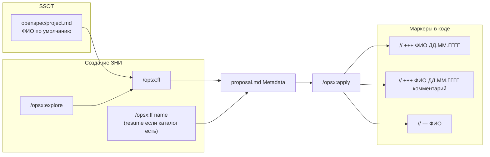
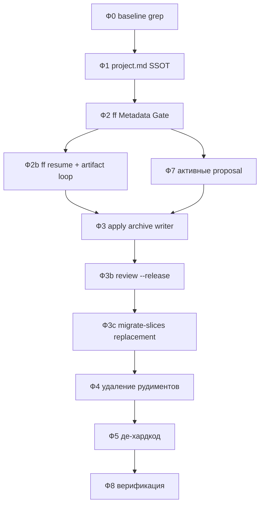

# План: упрощение фреймворка и маркеров разработчика

## Вердикт аудита (2026-06-07, перепроверка)

**Направление верное и подтверждено по коду:** убрать `zni_id` / `generate_tz` / четырёхполевой Metadata Gate, централизовать ФИО в `project.md`, сократить команды до `explore → ff → verify → apply → archive` (+ `extend`, `status`, `archive`-сателлиты).

**Главный риск не в идее, а в исполнении:** slim-down легко превращается в «ff++» — один скилл с двумя режимами, портом continue, explore-context, design gate и metadata gate. Без **Phase 0 baseline** и **shared artifact loop** (один блок, не копипаста) фреймворк станет *сложнее*, хотя команд станет меньше.

**План принимается с доработками ниже.** Без **2b (ff resume)**, **3b (`/review --release`)**, **3c (замена migrate-slices)** и **переходного контракта legacy-маркеров** массовое удаление сломает дозавершение артефактов, предрелизный контроль и legacy tasks.

### Принципы «не развалить и не раздуть»

1. **Один SSOT на тему:** regex маркеров и whitelist — только `project.md`; `bsl-comment-formats-project.md` остаётся тонкой памяткой по колонкам (не второй набор правил).
2. **Удалять команды, не дублировать логику:** continue → режим ff resume; prerelease → флаг `--release` у `/review`; migrate-slices → текст в verify/extend (не новый skill).
3. **Переходный период обязателен:** код в `src/` с `[б/н#…]` не трогаем; archive/review считают legacy + канон.
4. **Два PR, не один монolith:** (1) контракт + поведение, (2) удаление файлов после grep=0 битых ссылок.
5. **P7 до apply на активных ЗНI:** metadata в proposal обновить сразу после P2, до первого `/opsx:apply` по этим change.
6. **Stub-redirect на 1 релиз:** `opsx-continue.md` → «используйте `/opsx:ff <name>`» до P4; снижает muscle memory поломку.

---

## Что проверено в репозитории

| Утверждение плана | Статус | Факт |
|---|---|---|
| 4 активных change | ✓ | `diadoc-interrupt-processing-unlink`, `diadoc-mchd-fio-display`, `diadoc-admin-edo-narrow-semantics`, `diadok-mchd-before-pack` |
| `project.md` § маркеры ссылается на `zni_id` | ✓ | стр. 106–108 |
| Секция «Форматы и соглашения по комментариям BSL» в project.md отсутствует | ✓ | есть только абзац про whitelist; шаблон живёт в `init-project.md` Phase 4 |
| ff Metadata Gate — 4 поля + ТЗ | ✓ | `openspec-ff-change/SKILL.md` шаг 1.5 |
| apply/archive формулы с `zni_id` | ✓ | `openspec-apply-change` 85–98, `openspec-archive-change` 79–100 |
| Хардкод «Борисов И.Г.» в ff | ✓ | пример в Metadata Gate |
| Код в `src/` с legacy-маркерами | ✓ | `// +++ Борисов И.Г. … [б/н#…]` и `// --- Борисов И.Г.` / `// --- Борисов И.Г. [б/н]` |
| `review/SKILL` уже читает whitelist + mandatory control | ✓ | шаги 1.6–1.6.2; ссылка на алгоритм prerelease 1.7c |
| `ff` всегда вызывает `openspec new change` | ✓ **риск** | при существующем каталоге change упадёт; `continue` сейчас единственный путь дозавершения |
| `onec-code-architect-2nd` в ротации | ⚠ | файл есть; `model-selection.mdc` уже без 2nd; в `.cursor` ссылки только CHANGELOG + сам файл |
| `review.md` без `--release` | ✓ **пропуск** | флаг в `commands/review.md`, не только SKILL |
| `no-roi-estimates` → estimate | ✓ **пропуск** | после P4 убрать исключение |
| verify/QC → migrate-slices | ✓ **пропуск** | без P3c — битая рекомендация |
| interrupt-processing-unlink | ⚠ | `zni_id: <zni_id>` плейсхолдер |
| comment_suffix активных | ⚠ | «ТРС ДО» не переносить — suffix пустой |
| `migrate-slices` нужен активным ЗНИ | ✗ | `phase-gate` только в `archive/`; активные change — модель срезов |

---

## Целевое состояние



**Канон маркеров (новый код):**
- `// +++ <ФИО> <ДД.ММ.ГГГГ>`
- `// +++ <ФИО> <ДД.ММ.ГГГГ> <comment_suffix>`
- `// --- <ФИО>`

**Нормализация ФИО:** в metadata и маркерах всегда «Фамилия И.О.» **с пробелами**. При чтении project.md / proposal — trim; исправить `БорисовИ.Г.` в `diadoc-admin-edo-narrow-semantics`.

**Правило для `.cursor/**`:** только плейсхолдеры; реальное ФИО — в `openspec/project.md` и артефактах ЗНИ.

---

## Переходный период (legacy-маркеры) — обязательно

**Код в `src/` не массово мигрировать.** Существующие строки с `[б/н#…]`, `[ID#…]` остаются до следующей правки файла.

| Компонент | Поведение в переход |
|---|---|
| **Writer** | Новые маркеры — только канон; не переписывать чужие/legacy пары |
| **Archive balance** | Считать в diff **оба** паттерна open для `developer` из proposal: канон **и** legacy `// +++ {developer} … [{zni_id}|б/н#…]`; close — `// --- {developer}` с опциональным `[…]` |
| **AP-040 / whitelist** | Whitelist по proposal metadata **того же ЗНI**; legacy-строки в уже изменённых файлах не трогать |
| **Active proposals** | `zni_name` → `comment_suffix` **только если осмысленный** (не «ТРС ДО»); поля `zni_id`, `generate_tz` удалить |

---

## Фаза 0 — Baseline (до любых правок)

Сохранить снимок в `temp/reports/framework-slim-baseline-YYYY-MM-DD.md`:

```powershell
# Примеры (Windows); результат — таблица file:line:match
rg -n "zni_id|generate_tz|zni_name" .cursor openspec AGENTS.md
rg -n "opsx:new|opsx:continue|opsx:doc-tz|opsx:estimate|migrate-slices|prerelease-review" .cursor AGENTS.md
rg -n "Борисов|ID#79|ID#86|86939" .cursor
rg -n "phase-gate" openspec/changes --glob "!archive/**"
```

**Gate P0→P1:** baseline записан; нет «сюрпризов» вне чеклиста P4.

---

## Фаза 1 — SSOT: ФИО и контракт маркеров в project.md

### 1.1 Секция «Разработчик по умолчанию»

```markdown
#### Разработчик по умолчанию

- **ФИО для маркеров:** <заполнить при первом ff или вручную>
  Формат: «Фамилия И.О.» с пробелами — как в строках `// +++`.
```

### 1.2 Переписать § «Маркеры разработчика»

- Whitelist: пары `// +++` / `// ---` ↔ `## Metadata (comment markers)` **того же ЗНI** (`developer` + опциональный `comment_suffix`).
- Примеры — только плейсхолдеры (без `diadok-shelf-upload-timeout-180s`, без `[б/н#…]` в каноне).

### 1.3 Секция «Форматы и соглашения по комментариям BSL»

Добавить в `project.md` (из шаблона `init-project.md` Phase 4):
- Таблица **Whitelist** (переименовать «Whitelist предрелиза» → **Whitelist** — убрать привязку к удаляемой команде).
- Таблица **Обязательный контроль** с regex:
  - `^// \+\+\+ .+ \d{2}\.\d{2}\.\d{4}(\s.+)?$`
- Обновить `bsl-comment-formats-project.md`: SSOT = project.md; ссылки на `/review --release`, не на prerelease skill.

### 1.4 `capture-to-project.mdc`

- Триггер: первое указание ФИО в ff → предложить запись в «Разработчик по умолчанию».
- Ссылка prerelease → `/review --release`.

---

## Фаза 2 — Metadata Gate и proposal.md

### 2.1 Блок proposal.md

```markdown
## Metadata (comment markers)

developer: <ФИО>
comment_suffix:          # пусто → // +++ ФИО дата без текста
```

**Удалить:** `zni_id`, `zni_name`, `generate_tz`.

### 2.2 Metadata Gate (`openspec-ff-change` + `opsx-ff.md`)

1. Read `openspec/project.md` → ФИО по умолчанию.
2. **ФИО есть** — один текстовый вопрос: опциональный `comment_suffix`.
3. **ФИО нет** — один вопрос: ФИО + опциональный комментарий; затем capture-to-project.
4. `пропустить` / `позже` → `<ФИО>` + follow-up F1 («Заполнить developer…»).
5. **Убрать** вопрос про ТЗ и `generate_tz`.

Guardrail: проверять `<developer>` / `<ФИО>`, не `zni_id`.

### 2.3 Удалить `openspec-new-change` + `opsx-new.md`

Metadata полностью в ff. Explore / delegation — только `/opsx:ff`.

---

## Фаза 2b — ff resume (БЛОКЕР перед удалением continue)

**Проблема:** `ff` шаг 2 всегда `openspec new change "<name>"` — при существующем каталоге ошибка. `apply` при `state: blocked` сейчас советует `openspec-continue-change`.

**Решение — встроить в ff (и `opsx-ff.md`):**

```
Если openspec/changes/<name>/ существует:
  - НЕ вызывать openspec new change
  - openspec status --json
  - Создавать только артефакты со status != done (цикл как continue-change)
  - Metadata Gate: если proposal.md уже есть — читать metadata, не спрашивать повторно (кроме плейсхолдеров)
Иначе:
  - Текущий путь: Metadata Gate → openspec new change → scaffold
```

**После 2b:** заменить все «suggest continue» → `/opsx:ff <name>` (resume). **Stub:** `opsx-continue.md` = redirect до P4. Только потом удалять `continue` skill.

**Anti-bloat:** не копировать тело `openspec-continue-change/SKILL.md` в ff. Общий подраздел **`## Artifact completion loop`** (status → instructions → ONE artifact → progress) — один экземпляр в ff; continue до P4 **ссылается** на него.

---

## Фаза 3 — Пайплайн маркеров

### 3.1 `openspec-apply-change`

| Было | Стало |
|------|-------|
| Проверка `<zni_id>` | `<developer>` / `<ФИО>` |
| `open_marker` с zni_name и [zni_id] | `// +++ {developer} {date}` или `+ comment_suffix` |
| `close_marker` с [zni_id] | `// --- {developer}` |
| AskQuestion 3 поля | один вопрос; default ФИО из project.md |
| suggest continue | `/opsx:ff <name>` (resume) |

### 3.2 `onec-code-writer.md`

Не трогать маркеры с **другим** `developer` (другое ФИО в `// +++` / `// ---`).

### 3.3 `openspec-archive-change` (шаг 3.2)

- Ключ: `developer` из proposal (+ legacy-паттерны open в diff — см. «Переходный период»).
- Hard blocker: `count_open != count_close` для этого developer в diff.
- Silent: 0/0.

### 3.4 Review pipeline

| Файл | Изменение |
|------|-----------|
| `1c-agent-patterns/reviewer.md` | BORDER-PAIR-001: `// +++ <ФИО>…` ↔ `// --- <ФИО>` |
| `review/SKILL.md` | см. фазу 3b; убрать ссылки на prerelease skill |
| `reviewer-checks.md` | `mode=prerelease` → `/review --release` |
| `bsl-antipatterns.md` | плейсхолдеры вместо Борисов / ID# |

### 3.5 Architect task hints

`1c-agent-patterns/architect.md`: `// +++ <ФИО> …` + ссылка на metadata proposal.

---

## Фаза 3b — `/review --release` (до удаления prerelease)

**Не дублировать** mandatory control — уже в review 1.6–1.6.2.

**Портировать из `prerelease-review/SKILL.md`:**

| Capability | Куда |
|---|---|
| `mode=prerelease` / эскалация severity | промпт reviewer при `--release` |
| `full-extension` scope | флаг `--release` без change-аргумента |
| `change-scoped` + target_files resolver (1.3a) | уже частично в review; выровнять |
| Tier 2 explorer | только `--release` |
| Category 12 Release Readiness | reviewer-checks + `--release` |
| Follow-up openspec после отчёта | оставить в review финале |

**Smoke:** `/review --release КонтурДиадок` ≈ старый prerelease full-extension.

**Обязательно:** обновить `.cursor/commands/review.md` — описать `--release`, `--full`, change-scoped (как в prerelease command).

---

## Фаза 3c — Замена migrate-slices (до P4)

Удаление `/opsx:migrate-slices` без замены сломает **verify + QC + vertical-slices + architect.md** (6+ ссылок).

**Новое поведение (info, не блокер verify):**

| Было | Стало |
|------|-------|
| verify/QC: «запустите `/opsx:migrate-slices`» | «Формат legacy: `# Фаза` / `<!-- phase-gate -->` / нет `# Срез` — перестройка через `/opsx:extend <name>` (architect slice decomposition) или ручная правка по `vertical-slices.mdc`» |
| `openspec-migrate-slices` skill | удалить; **не** переносить в новый skill |
| `architect.md` шаблон migrate | переименовать триггер: «после `/opsx:extend` при legacy tasks» |

**Gate P3c→P4:** grep `.cursor` — ноль рекомендаций `migrate-slices` кроме CHANGELOG/history.

---

## Фаза 4 — Удаление рудиментов

### 4.0 Порядок (важно)

1. Сначала **grep + правки ссылок** во всех потребителях.
2. Потом удаление файлов.
3. Один коммит «framework slim-down» или два: (контракт маркеров) + (удаление рудиментов).

### 4.1 Удалить команды

- `opsx-new.md`, `opsx-continue.md` *(только после фазы 2b)*
- `opsx-doc-tz.md`, `opsx-estimate.md`, `opsx-migrate-slices.md`, `prerelease-review.md` *(после 3b + 3c)*

### 4.2 Удалить skills и агентов

- `openspec-new-change/`, `openspec-continue-change/` *(после 2b)*
- `openspec-docs/`, `openspec-estimate/`, `openspec-migrate-slices/`, `prerelease-review/` *(после 3b + 3c)*
- `openspec-doc-writer.md` + строка в `model-selection.mdc`
- `tz-lexicon-dictionary.md`
- `onec-code-architect-2nd.md` *(опционально: stub уже не в model-selection; удалить файл + запись CHANGELOG)*

### 4.3 Обновить ссылки (grep-чеклист)

`AGENTS.md`, `sdd-workflow.mdc`, `1c-agent-delegation.mdc`, `openspec-explore/SKILL.md` + `profiles/` + `compose.md`, `chat-output-budget.mdc`, `opsx-output-style.md`, `openspec-status`, `openspec-apply`, `openspec-verify`, `vertical-slices.mdc`, `openspec-quality-controller.md`, `1c-agent-patterns/architect.md`, `openspec-bulk-archive`, `init-project.md`, `openspec-sessions.mdc`, `no-roi-estimates.mdc`, `capture-to-project.mdc`, `commands/review.md`, `tool-name-guard.mdc`, `reviewer-checks.md`, `agents/CHANGELOG.md`.

**Явно добавить в чеклист:**
- `1c-agent-delegation.mdc` — «`/opsx:new` или ff» → только ff
- `model-selection.mdc` — убрать `openspec-doc-writer`
- `bsl-comment-formats-project.md`, `init-project.md` Block 7 — prerelease → `/review --release`
- `openspec-verify-change` — убрать `generate_tz` / doc-tz / migrate-slices (~416–417)
- `openspec-explore` финал — убрать вилку «пошагово new→continue»
- `openspec-status` — continue → ff resume
- `sdd-workflow.mdc` — строка generate_tz и prerelease-review

### 4.4 Осознанные потери (не баг)

| Удаляемое | Альтернатива |
|---|---|
| `/opsx:doc-tz`, `/opsx:estimate` | вне фреймворка / вручную |
| `/opsx:migrate-slices` | `/opsx:extend` + architect / ручная правка tasks |
| `/opsx:new`, `/opsx:continue` | `/opsx:ff` (+ resume) |
| `/prerelease-review` | `/review --release` |

---

## Фаза 5 — Де-хардкод `.cursor/**`

Grep-замена: `Борисов И.Г.`, `БорисовИ.Г.`, `ID#79714`, `ID#79813`, `86939`.

**Расширить список файлов** (к исходному плану):
- `openspec-apply-change/SKILL.md`
- `onec-code-writer.md`, `1c-agent-patterns/writer.md`
- `openspec-verify-change/SKILL.md` (если остались примеры)

---

## Фаза 6 — Опционально (отдельное решение пользователя)

| Skill | Рекомендация аудита |
|---|---|
| `1c-roles`, `1c-mxl` | **Не удалять в этом PR** — XML guard в delegation ссылается на них; вынос в отдельный change после оценки использования |
| `1c-bsp` | оставить |
| остальные | не трогать |

---

## Фаза 7 — Активные ЗНИ

**Когда:** сразу после P2, **до** `/opsx:apply` по этим change.

4 change (не archive):

| Change | Metadata после P7 |
|---|---|
| `diadoc-admin-edo-narrow-semantics` | `developer: Борисов И.Г.`; `comment_suffix:` пусто |
| `diadoc-interrupt-processing-unlink` | убрать `<zni_id>`; suffix пусто |
| `diadoc-mchd-fio-display`, `diadok-mchd-before-pack` | suffix пусто («ТРС ДО» не переносить) |

- Обновить Metadata в proposal.md; удалить `zni_id`, `zni_name`, `generate_tz`.
- tasks.md: F1 без `zni_id`; подсказки маркеров — канон.
- **Код не трогать.**

---

## Фаза 8 — Верификация

1. Grep `.cursor/`: нет битых путей к удалённым skills/commands.
2. Grep: нет `opsx:new`, `opsx:continue`, `generate_tz`, `openspec-continue-change` (кроме CHANGELOG/history).
3. Grep `openspec/changes/` (не archive): нет `zni_id` в активных proposal.
4. Smoke **ff resume**: прервать ff после design → `/opsx:ff name` дозавершает без `openspec new`.
5. Smoke **markers**: apply передаёт writer канон; archive balance на тестовом diff.
6. Smoke **`/review --release`**: эскалация + mandatory control + Tier2 на тестовом расширении.
7. Smoke **legacy archive**: change с legacy-маркерами в diff — balance не ломается.
8. Grep post-P4: `migrate-slices` только в CHANGELOG/archive history.

---

## Порядок выполнения (исправленный)



**Критично:** P2b, P3b, P3c **до** P4. P7 **до** apply на активных change. P4 — только после grep=0 битых ссылок.

---

## Решения для заказчика (перед стартом)

1. **Удалять `onec-code-architect-2nd.md`?** Рекомендация: **да** (dead stub; fallback уже без 2nd).
2. **Фаза 6 (1c-roles / 1c-mxl):** **вне scope** этого slim-down — не трогать.
3. **Один PR или два?** Рекомендация: **два** — PR1 контракт+поведение (P0–P3c, P7), PR2 удаление (P4–P5).
4. **Stub `opsx-continue` на 1 релиз?** Рекомендация: **да** — redirect в `/opsx:ff` до P4.
5. **ФИО по умолчанию в project.md:** заполнить сейчас (например «Борисов И.Г.») или оставить пустым до первого ff?

## Чего не делать (анти-паттерны)

- Не добавлять новые команды/skills «вместо удалённых» (кроме флага `--release`).
- Не массово переписывать маркеры в `src/`.
- Не объединять PR1 и PR4 — сложно откатить и ревьюить.
- Не удалять `extend` / `status` / `bulk-archive` / `sync` — они не рудименты.
- Не переносить regex mandatory control в второй файл — только `project.md`.
