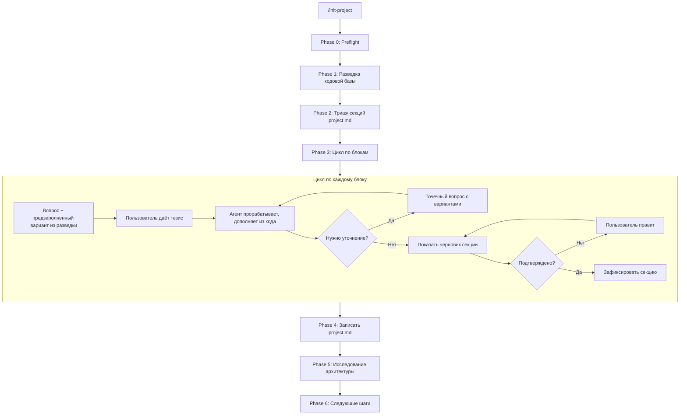
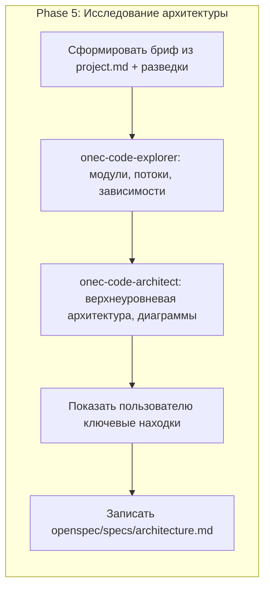

# Переработка команды /init-project

## Проблемы текущей версии

1. **Нет разведки до интервью** — агент задаёт открытые вопросы, не зная кодовую базу. Пользователь должен описать всё с нуля.
2. **Записывает тезисы «как есть»** — если пользователь дал 2 слова, в project.md попадут 2 слова. Нет проработки, нет дополнения из кода.
3. **Не вызывает уточнения** — пропущенные подвопросы списываются как «уточнять позже» вместо того чтобы предложить конкретный вариант ответа.
4. **Не раскрывает ключевые термины** — если пользователь упомянул «БШИ», это нужно раскрыть в документе, а не оставить аббревиатурой.
5. **Повторный запуск формально описан** — «показать что заполнено, дополнить» — но нет механики: как оценить качество существующих секций, как предложить улучшения.

## Архитектура нового процесса







## Изменения в файле [init-project.md](.cursor/commands/init-project.md)

### A. Новая Phase 1 — Разведка кодовой базы (до интервью)

Вставить между Preflight и Интервью. Агент **молча** (без вопросов пользователю) собирает:

- Структура каталогов верхнего уровня (`src/`, `docs/`, расширения)
- `Configuration.xml` базы и каждого расширения — название, синоним, версия, назначение, префикс
- Бизнес-процессы, HTTP-сервисы, общие модули (по Glob)
- Имена справочников, документов, регистров (из `ConfigDumpInfo.xml`)
- Файлы документации в `docs/` (если есть)

Результат разведки — **внутренний контекст** агента. Не показывается пользователю целиком, но используется для предзаполнения вариантов ответов и точечных вопросов.

### B. Новая Phase 2 — Триаж секций (при повторном запуске)

Если `project.md` уже существует:

1. Прочитать его.
2. Оценить каждую секцию по критериям качества:
  - **Пустая** — нет содержимого.
  - **Stub** — формальная отписка: «уточнять позже», тавтология (проблема = цель), менее половины ожидаемых пунктов.
  - **Достаточная** — содержит осмысленный контент, согласованный с кодовой базой.
3. Показать пользователю карту секций со статусами и предложить:
  - Дополнить только пустые/stub
  - Пройти по всем с возможностью пропуска
  - Указать конкретные секции для доработки

### C. Переработка каждого блока интервью — принцип «тезис — проработка — подтверждение»

Для **каждого** блока команда теперь предписывает три шага:

**Шаг 1 — Вопрос с предзаполнением.** Агент формулирует вопрос и тут же предлагает свой вариант ответа на основе разведки. Пример:

> Я вижу в коде бизнес-процессы «Согласование» и «Подписание», HTTP-сервис `arsCompareFiles`, обработку «РедакторСкриптов». Предлагаю такие ключевые возможности:
>
> 1. Согласовывать договоры через БШИ
> 2. Подписывать документы ЭП через Контур.Диадок
> 3. Сравнивать версии файлов через веб-сервис
> 4. Писать и тестировать скрипты обработки документов
>
> Это верно? Что убрать, добавить, переформулировать?

**Шаг 2 — Проработка тезиса.** Получив краткий ответ, агент:

- Развёртывает тезис в полноценную формулировку
- Дополняет из кодовой базы (конкретные имена модулей, процессов)
- Раскрывает ключевые термины и аббревиатуры
- Задаёт точечные уточняющие вопросы **с вариантами ответа** (не открытые)

**Шаг 3 — Черновик секции.** Агент показывает готовый текст секции в формате project.md и просит подтверждения. Только после «ок» фиксирует и переходит к следующему блоку.

### D. Качественные гейты на блоках

Добавить проверки, которые **не дают перейти к следующему блоку** при недостаточном результате:

- **Блок 2 (Назначение):** проблема != цель (нет тавтологии); проблема описывает текущее состояние «без системы»; цель описывает желаемое состояние.
- **Блок 3 (Возможности):** минимум 3 пункта; если расширений больше, чем пунктов — предложить недостающие.
- **Блок 4 (Принципы):** каждый принцип подкреплён наблюдением из кода или слов пользователя; не записывать собственные домыслы без подтверждения.
- **Блок 5 (Зависимости):** по каждому внешнему сервису — хотя бы «что за сервис и зачем»; пропущенные подвопросы — задать повторно с конкретным вариантом.
- **Ключевые термины:** если в ответах есть аббревиатура или термин, не общеизвестный (БШИ, ЭП, ДО) — раскрыть и согласовать определение.

### E. Блок-специфичные улучшения

**Блок 2 (Назначение)** — вместо открытого «какую проблему решает» задавать конкретнее: *«Как сейчас работают без этой системы? Что именно плохо?»* и отдельно *«Что должно стать возможным с системой?»*

**Блок 5 (Зависимости)** — по каждому обнаруженному в разведке сервису/интеграции задать конкретный вопрос: *«Для подписания через Диадок нужен криптопровайдер (КриптоПро, VipNet) — какой у вас?»*, а не открытый *«какое серверное ПО?»*

**Блок 6 (Структура)** — агент строит таблицу сам из разведки, показывает пользователю и просит подтвердить/скорректировать. Текущее поведение «изучи сам» — правильное, его нужно сделать дефолтным.

### F. Обновлённый Guardrails

Добавить:

- **Не записывай свои домыслы без явного подтверждения** — если предложил принцип, а пользователь сказал «ты правильно понял», зафиксировать, но пометить источник: «из анализа кода» vs «со слов пользователя».
- **Не принимай минимальный ответ** — если получено менее половины ожидаемых пунктов, предложить свои варианты из разведки.
- **Тавтология = stub** — если проблема и цель дублируют друг друга, переформулировать и показать.
- **Ключевые термины раскрывать** — каждая аббревиатура должна быть расшифрована в project.md при первом упоминании.

### G. Новая Phase 5 — Исследование архитектуры (после записи project.md)

После того как project.md записан (Phase 4), агент **автоматически** запускает исследование кодовой базы и фиксирует текущую архитектуру.

**Шаг 1 — Бриф для исследования.** Агент формирует структурированный бриф из:

- Заполненного project.md (расширения, назначение, ключевые возможности, принципы)
- Данных Phase 1 (разведка): обнаруженные модули, бизнес-процессы, HTTP-сервисы, регистры

**Шаг 2 — Делегирование onec-code-explorer.** Задача: по каждому расширению и ключевым модулям базы — определить entry points, цепочки вызовов, зависимости между расширениями, ключевые общие модули. Передать бриф и пути к расширениям.

**Шаг 3 — Делегирование onec-code-architect.** По результатам explorer — сформировать:

- Карту компонентов (расширения, их зоны ответственности, точки интеграции с базой)
- Потоки данных (ключевые сценарии: согласование, подписание, и т.п.)
- Mermaid-диаграммы (component diagram, sequence diagrams для ключевых потоков)
- Зависимости между расширениями (если есть)

**Шаг 4 — Показать пользователю ключевые находки.** Краткое резюме: сколько модулей, какие потоки, что неожиданного обнаружено. Пользователь может скорректировать или дополнить.

**Шаг 5 — Записать `openspec/specs/architecture.md`.** Полный отчёт с диаграммами (по правилу preserve-subagent-reports — без сокращений). Структура файла:

```markdown
# Архитектура: <название проекта>

## Обзор
<1-2 абзаца из project.md + результаты исследования>

## Компоненты
<карта расширений и их зон ответственности, Mermaid component diagram>

## Ключевые потоки данных
<для каждого ключевого сценария — Mermaid sequence diagram + описание>

## Зависимости
<между расширениями, от базовой конфигурации, от внешних сервисов>

## Ключевые модули
<таблица: модуль / расширение / назначение / тип (серверный, клиентский, общий)>
```

**При повторном запуске /init-project:** если `openspec/specs/architecture.md` уже существует — Phase 5 предлагает обновить (если project.md изменился) или пропустить. Не пересоздаёт автоматически.

### H. После записи — применить улучшения к текущему project.md

Второй частью работы (todo `rerun-interview`) будет повторный прогон по слабым секциям текущего `project.md` по новым правилам (Phase 2 — Триаж выявит stub-секции, затем Phase 3 — цикл доработки), а затем Phase 5 — исследование и создание `openspec/specs/architecture.md`.

## Что НЕ меняется

- Формат frontmatter команды
- Целевая структура project.md (секции остаются те же)
- Секция «Соглашения» (стандартная, не зависит от интервью)
- Принцип «не пиши код — только project.md»

