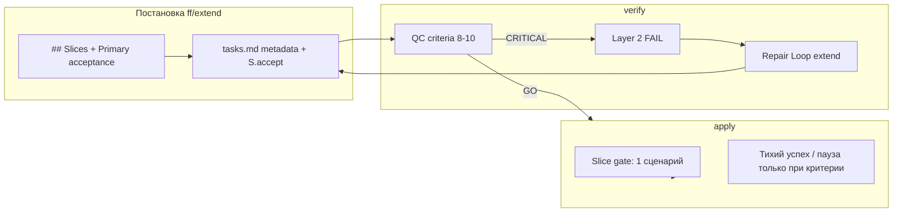

# План: приёмка срезов и стиль apply-чата

## Контекст

В чате выявлены **два связанных дефекта фреймворка**:

| Трек | Симптом | Корень |
|------|---------|--------|
| **A. Приёмка срезов** | `S<N>.accept` требует diff/API/6 сценариев; срезы закрываются формально (`принят (archive)`) | Правила есть в [`vertical-slices.mdc`](.cursor/rules/vertical-slices.mdc), но QC крит. 8–9 = WARNING для Standard; нет поля «один главный сценарий»; archive bypass |
| **B. Стиль apply** | «Ваш шаг (пошаговая пауза)», перегруз шапки, diff-чеклист как «Что проверить», meta-статус pipeline («автопроверки пройдены») | Жёсткий шаблон в [`openspec-apply-change/SKILL.md`](.cursor/skills/openspec-apply-change/SKILL.md) ~347; `slice-size-threshold` → 46 пауз на миграции |

**Scope:** только `.cursor/`. Активные ЗНИ не трогаем — доработка через `/opsx:verify` → internal repair → повторный verify.

**Связь с [`framework_slim-down`](.cursor/plans/framework_slim-down_34f3d829.plan.md):** ортогонально по смыслу; **общие файлы** — `vertical-slices.mdc`, verify, QC, architect. **Порядок:** сначала slim-down **3c** (migrate-slices replacement), затем этот план — либо один PR с merge-координацией, иначе конфликты в одних файлах.

**Prerequisite (P0):** переписать rule 6 / criterion 5b **до** включения criterion 10 — иначе QC получит два противоречащих SSOT.

---

## Целевая модель



---

## Фаза 1 — Primary acceptance (SSOT среза)

### 1.1 Расширить [`vertical-slices.mdc`](.cursor/rules/vertical-slices.mdc)

Добавить обязательное поле метаданных среза (только если в `tasks.md` есть `# Срез S<N>`; для Lite ≤5 задач без срезов — поле не требуется):

```markdown
**Primary acceptance:** <один нумерованный user-journey: Given → When → Then, выполнимый на типовой ИБ без отладчика>
```

#### P0 — переписать rule 6 (Acceptance Checklist Coverage) и criterion 5b

**Было:** каждый Scenario из `**Связь со spec:**` — обязательная строка в `S<N>.accept`; `[x]` только когда все Scenario пройдены.

**Стало:**

| Что | Правило |
|-----|---------|
| **Blocking для `[x]`** | Только **Primary acceptance** (поле metadata + первый mandatory sub-bullet в accept) |
| **Остальные Scenario** | Sub-bullets с пометкой «опционально / при наличии данных» **или** задачи `S<N>.<M>` «верифицировать на ИБ / по коду» — **не** blocking для accept |
| **Coverage spec** | Каждый Scenario из spec SHALL быть покрыт **хотя бы в одном месте**: Primary, optional sub-bullet accept, или задача `S<N>.<M>` |
| **Criterion 5b** | `accept-bullets-missing-scenario` → **WARNING** только если Scenario **нигде** не покрыт (нет в accept optional, нет задачи); наличие только в `S<N>.<M>` — **OK** |
| **Частичная приёмка** | `[x]` на accept = Primary пройден; optional-сценарии фиксируются в `debug.md` / повторной приёмке, не блокируют закрытие среза |

Это снимает конфликт между rule 6 и criterion 10.

#### Остальные правила Primary

- **Ровно один** blocking journey на срез — без него `S<N>.accept` не ставится в `[x]`.
- Запрет programmatic-only в Primary: «вызвать API», «проверить diff», «grep маркеры».
- Критерий 8: severity **CRITICAL для всех tier**, где есть `# Срез` (убрать исключение Standard/Lite).
- **Критерий 10 — Acceptance Simplicity:** >1 **mandatory** (без пометки optional) black-box journey в теле accept → `acceptance-simplicity-overload` CRITICAL; отсутствие `**Primary acceptance:**` при `# Срез` → `primary-acceptance-missing` CRITICAL.

### 1.2 Архитектор — [`architect.md`](.cursor/skills/1c-agent-patterns/architect.md)

В промптах `slice-decomposition` и `slice-aware task decomposition`:

- Колонка **Primary acceptance** в таблице `## Slices` и в `### Чеклист приёмки`.
- Self-check: «Может ли заказчик пройти Primary за ~5–15 мин на ИБ?» — если нет, merge с consumer-срезом.
- В `S<N>.accept`: первый sub-bullet = Primary (mandatory); остальные Scenario — с пометкой «опционально» или вынесены в `S<N>.<M>` (см. amended rule 6 §1.1).

### 1.3 FF — [`openspec-ff-change/SKILL.md`](.cursor/skills/openspec-ff-change/SKILL.md)

- Mechanical check после tasks: grep `**Primary acceptance:**` на каждый `# Срез S\d+` → CRITICAL если нет.
- Foundation Slice Guard: при `slice-not-vertical` / `slice-foundation-with-gate` — не «Принять», только «Пересобрать».

---

## Фаза 2 — Verify обнаруживает и чинит сам (extend repair)

Цель: `/opsx:verify <name>` на активных ЗНI выдаёт NO-GO + **Repair Loop** без ручной правки tasks.

### 2.1 QC-агент — [`openspec-quality-controller.md`](.cursor/agents/openspec-quality-controller.md)

Добавить критерии **8–10** (из vertical-slices; criterion 5b — в amended-виде) и **обязательный блок Remediation** в отчёт для каждого алерта:

```markdown
### Remediation (auto-repair)
- alert: primary-acceptance-missing
- target: tasks.md S1 metadata + design.md ## Slices row S1
- action: add Primary acceptance from Behavior Contract; simplify S1.accept to 1 mandatory bullet
```

### 2.2 Verify Layer 2 — [`openspec-verify-change/SKILL.md`](.cursor/skills/openspec-verify-change/SKILL.md)

**P0 — §2.1 промпт QC:** сейчас перечислены критерии 1–6; расширить до **1–6, 8–10** (и amended 5b). Без этого verify не передаёт verticality/simplicity в QC.

Расширить `FAIL` Layer 2:

- `slice-not-vertical`, `slice-foundation-with-gate`, `primary-acceptance-missing`, `acceptance-simplicity-overload` — **FAIL → NO-GO** (не «не блокирует apply»).

### 2.3 Карта repair — [`opsx-output-style.md`](.cursor/docs/opsx-output-style.md) §2.6

Добавить в **Repair (auto)**:

| Алерт | Действие extend (repair-from-verify) |
|-------|--------------------------------------|
| `primary-acceptance-missing` | Добавить поле; переписать первый буллет accept |
| `accept-bullets-missing-scenario` | Добавить optional sub-bullet или задачу `S<N>.<M>`; не требовать mandatory в accept |
| `acceptance-simplicity-overload` | Оставить 1 mandatory в accept; остальное → `S<N>.<M>` или optional |
| `slice-not-vertical` / `slice-foundation-with-gate` | **Internal architect** `slice restructuring`; merge foundation → consumer; post-merge checklist — §2.4 |

**Decision (не auto):** см. §2.4 — merge с изменением scope/spec.

### 2.4 Extend repair catalog — [`openspec-extend-change/SKILL.md`](.cursor/skills/openspec-extend-change/SKILL.md)

Новая секция **§6c Repair-from-verify: slice acceptance remediation**:

1. Парсить `Remediation (auto-repair)` из `quality-control-*.md`.
2. Порядок: `design.md` (Slices, матрица) → `tasks.md` (metadata, accept, merge заголовков срезов) → sync spec links.
3. При merge срезов — один вызов architect `mode=slice-restructuring` (readonly design → правки оркестратором).
4. Запись в `debug.md`: `## Verify repair — slice acceptance`.

Ограничение (явно в SKILL): repair **не** меняет `[x]` на accept и **не** архивирует — только постановку.

**Post-merge checklist** (после merge foundation → consumer):

1. Перенумерация `# Срез S<N>` и задач `S<N>.<M>` без пропусков и дублей.
2. `**Зависимости:**` — пересчитать; удалить мёртвые ссылки на слитый срез.
3. Ровно один `S<N>.accept` + `<!-- slice-gate -->` на оставшийся срез.
4. `**Primary acceptance:**` и `## Slices` в design.md синхронны с tasks.
5. Append в `debug.md`: `## Verify repair — slice merge` (было S1+S2 → стало S1).
6. Повторный grep: нет orphan `S<K>.` в тексте задач других срезов.

**Decision (не auto):** merge меняет scope, cross-slice зависимости или spec Requirement — одна развилка в чат; repair не стартует до ответа.

---

## Фаза 3 — Стиль apply-чата

### 3.1 Шаблоны пауз — [`openspec-apply-change/SKILL.md`](.cursor/skills/openspec-apply-change/SKILL.md)

**Заменить** заголовки:

| Было | Стало |
|------|-------|
| `## Ваш шаг (пошаговая пауза)` | Убрать H2; **первая строка:** «Задача `S<N>.<M>` («…») выполнена.» |
| `## Ваш шаг (приёмка среза)` | `## Срез S<N>: «<название>» — проверка на ИБ` (§10 opsx-output-style) |

**Три режима вывода** (не «два шаблона на каждую задачу»):

| Режим | Когда | Что в чате |
|-------|-------|------------|
| **Тихий успех** (default) | Механика, код без явного критерия приёмки в tasks | Одна строка между задачами: «Задача `S<N>.<M>` («…») реализована.» — без паузы, без кнопок, без meta-статуса pipeline |
| **A. Explicit step-by-step** | Пользователь запросил пошаговый режим **и** в tasks есть явный критерий (`убедиться`, `проверить`, `**Приёмка:** ручной тест`) | См. шаблон A |
| **B. Slice-gate** | Закрыты все рабочие задачи среза, остался `S<N>.accept` | См. шаблон B |

**Запрет meta-статуса pipeline в чате:** не сообщать об успешном прохождении lint/reviewer/spot-check/diff («автопроверки пройдены», «diff не обязателен» и т.п.) — это non-events по `chat-output-budget.mdc` §3a и apply SKILL ~340. Пользователь ожидает, что агент сам исправляет всё исправимое; в чат — только эффект и действия, требующие человека.

**A. Explicit step-by-step** (только при явном критерии приёмки в tasks):

```
Задача `S1.1` («…») выполнена — <одно предложение эффекта, без путей>.
1. <шаги из критерия приёмки tasks, императив>
Ответ: Проблема | Пропустить
Дальше: `S1.2` («…»). `/opsx:apply <name>`
```

- Без «Подтвердить», если нет шагов для ИБ — агент идёт дальше сам.
- Diff / маркеры — только по запросу пользователя («покажи diff»), не в основном потоке.

**B. Приёмка среза** (`S<N>.accept`):

```
## Срез S1: «…» — проверка на ИБ
**Primary acceptance:** <текст из metadata>
1. <шаги только primary>
Опционально: …
Ответ: Принято | Не принято | Отложить
```

Handoff §2 «Что проверить СЕЙЧАС» — **только Primary** + опциональная строка «остальные сценарии — см. tasks.md».

### 3.2 T-HANDOFF §7 — [`openspec-apply-change/SKILL.md`](.cursor/skills/openspec-apply-change/SKILL.md) ~398–408

**P1:** согласовать с §3.1 — иначе шум вернётся в финальном handoff.

| Контекст | `### 2. Что проверить СЕЙЧАС` |
|----------|-------------------------------|
| **Slice-gate / acceptance handoff** | Только Primary (из metadata) + optional одной строкой |
| **Между задачами (тихий успех)** | Не дублировать; одна строка «Ручная проверка не требуется» **или** пропустить секцию |
| **Explicit step-by-step** | Только шаги из явного критерия задачи в tasks — не diff, не pipeline |

Убрать правило «для **каждой** закрытой задачи переписывать критерии» — заменить на три режима из §3.1.

### 3.3 Триггер step-by-step — [`openspec-apply-change/SKILL.md`](.cursor/skills/openspec-apply-change/SKILL.md) §5.6

**Приоритет правил** (сверху вниз):

1. **Slice-gate** — пауза всегда (шаблон B).
2. **Explicit-request** — пользователь попросил пошагово.
3. **Pure mechanical change** — все рабочие задачи без UX-критерия: **нет** auto `slice-size-threshold`; тихий успех между задачами.
4. **Mixed slice** (код + UX в одном срезе, напр. S1.1–S1.3 код + S1.accept UX): auto step-by-step **не** включать; пауза только на slice-gate.
5. **`slice-size-threshold`** (≥5 задач) — только если в срезе есть **хотя бы одна** задача с явным ручным критерием **и** пользователь не отключил пошаговый режим.

**Детекция mechanical (не grep-heuristic как единственный SSOT):**

- **Primary:** маркер в metadata среза `**Режим apply:** mechanical` (опционально, для migration-only change).
- **Fallback:** эвристика grep («миграц», «замен», «rename», «маркер») **только** если все задачи среза без `**Приёмка:** ручной тест` и без Primary, требующего ИБ.
- **Mixed всегда побеждает mechanical** — один `S<N>.4 Верифицировать по коду` в UX-срезе не переводит срез в mechanical.

- Режим объявлять **один раз** в начале сессии; не повторять в каждой карточке.

### 3.4 Антишум шапки — [`openspec-apply-change/SKILL.md`](.cursor/skills/openspec-apply-change/SKILL.md) §5.5b + [`chat-output-budget.mdc`](.cursor/rules/chat-output-budget.mdc)

- Pre-apply verify NO-GO / OQ — **не** в карточке паузы; только при **первом** сообщении apply, одной строкой, если блокирует.
- Прогресс `M/N` — одна строка без таблиц.
- Соответствие Chat Surface Contract §2.6: первая строка = суть; без inline-путей; без отчёта о внутренних этапах (lint, reviewer, spot-check).

### 3.5 Lexicon — [`chat-lexicon.md`](.cursor/docs/chat-lexicon.md)

Запрет в чате: `пошаговая пауза`, `Ваш шаг (` — HALT self-check.

### 3.6 UX-регрессия — [`ux-acceptance-isolated-chat.md`](.cursor/docs/ux-acceptance-isolated-chat.md)

- **E2:** apply, кодовая задача без критерия приёмки — pass: одна строка «реализована» или тишина между задачами; нет «пошаговая пауза»; нет diff-чеклиста; нет meta-статуса pipeline (автопроверки, reviewer, «diff не обязателен»).
- **E3:** apply handoff приёмки — pass: есть Primary acceptance одной строкой; ≤7 строк в «Что проверить СЕЙЧАС»; T-HANDOFF §2 без перечня всех закрытых задач.

---

## Ревью-правки (incorporated)

| ID | Что | Где в плане |
|----|-----|-------------|
| P0 | Rule 6 ↔ Primary, amended 5b | §1.1 |
| P0 | Verify §2.1 промпт QC 8–10 | §2.2 |
| P1 | T-HANDOFF §7 Primary-only | §3.2 |
| P1 | Mixed slice / mechanical detection | §3.3 |
| P1 | Post-merge checklist | §2.4 |
| P2 | Lite без `# Срез` — Primary не обязателен | §1.1 |
| P2 | Порядок vs framework_slim-down 3c | Контекст |

## Фаза 4 — Archive: не формально закрывать без Primary

[`openspec-archive-change/SKILL.md`](.cursor/skills/openspec-archive-change/SKILL.md) шаг 3.5:

- Опция **A** — дополнительное условие: в AskQuestion показать **Primary acceptance** каждого незакрытого среза (из metadata); подпись: «Подтверждаю, что Primary пройден на ИБ».
- `reports/slice-acceptance-S<N>-*.md` — обязательное поле `Primary acceptance: pass | fail | skipped (причина)`.
- `--force-legacy` без изменений (escape hatch).

---

## Проверка после внедрения

1. **Grep** `.cursor/`: не осталось `Ваш шаг (пошаговая пауза)`; нет шаблонных фраз meta-статуса pipeline (`автопроверки пройдены`, `diff не обязателен`).
2. **Isolated chat** E, E2, E3 на fixture (любой change с `# Срез` после verify-repair).
3. **Smoke verify→repair:** взять [`diadok-mchd-before-pack`](openspec/changes/diadok-mchd-before-pack/) или [`diadoc-admin-edo-narrow-semantics`](openspec/changes/diadoc-admin-edo-narrow-semantics/) — ожидание: NO-GO по acceptance-simplicity / foundation; после repair — GO; в tasks появились `**Primary acceptance:**`, упрощённый accept.
4. **Smoke apply** на mechanical-heavy change: паузы только на slice-gate; mixed-срез (`diadok-mchd-before-pack`) — без пауз между S1.1–S1.4, одна пауза на S1.accept.
5. **Post-merge smoke:** после repair merge foundation→consumer — grep orphan `S2.`, один slice-gate, Primary в metadata.

---

## Вне scope

- Правка `openspec/changes/*/tasks.md` вручную или в apply-сессии.
- Изменения BSL/XML.
- Рефакторинг [`framework_slim-down`](.cursor/plans/framework_slim-down_34f3d829.plan.md) pending-фаз.
