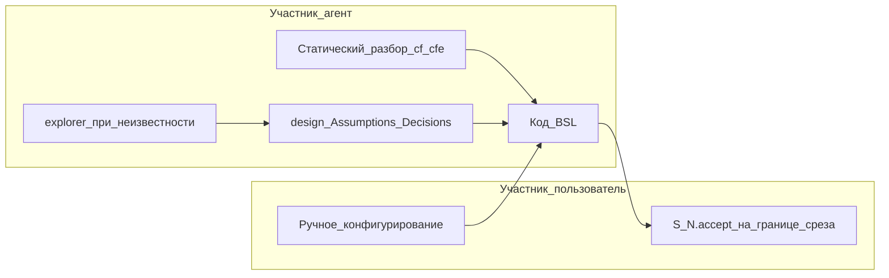

# User Task Contract в ff и verify

## Независимое ревью (2026-06-07)

### Вердикт: проблема подтверждена, план верный по направлению, требует уточнений

**Подтверждено по фактам:**

| Наблюдение | Доказательство |
|---|---|
| S1.2 — user-spike, не работа агента | `tasks.md` S1.2: «На тестовой ИБ верифицировать… зафиксировать в debug.md» — исполнитель = пользователь на стенде |
| Verify пропустил | `verification-2026-06-07-2.md`: Layer 2 **PASS** при живой S1.2; task-readiness GAP-1/2 про API, не про контракт участников |
| SSOT **учит** так планировать | `vertical-slices.mdc` стр. 31, 41, 173: «`S<N>.<M>` верифицировать на ИБ / по коду» как штатное место non-scenario |
| Repair map не покрывает | `opsx-output-style.md` §2.6 — нет класса user-spike |
| §6c **воспроизводит** дыру | `extend-change/SKILL.md` §6c: remediation `accept-bullets-missing-scenario` → задача «верифицировать на ИБ» |

**Сильные стороны исходного плана:** правильный принцип (конфиг + slice-gate accept); defense-in-depth (SSOT → ff → verify → repair); детерминированный repair без decision; smoke на текущей ЗНИ.

**Пробелы исходного плана (исправлены ниже):**

1. **Не разведены исполнитель и место задачи.** `S<N>.<M>` в apply выполняет агент (writer). Контракт запрещает не «любую верификацию», а **обязанность пользователя** на runtime (ИБ, консоль, отладчик). Статическое «верифицировать по коду» — **агент**, допустимо.
2. **Конфликтующих мест больше, чем rule 6.** Нужна синхронизация: QC критерий 1, extend §6c, architect slice-decomposition п.5/7, slice-aware п.10.1, verify QC prompt «1–6, 8–10».
3. **Grep-only на ff шаг 8 — недостаточен.** «верифицир» ловит и легитимное «по коду» → нужны ALLOW/DENY таблицы; семантика QC крит.11 обязательна.
4. **Slice Generation Gate в ff** — контракт не только в post-tasks, но и **до** tasks (design `## Slices`, Risks → Assumptions).
5. **Smoke verify на diadoc** — полный GO нереалистичен (открыта развилка `transaction-active-complex-bp`). Smoke A = detection + repair S1.2; GO — отдельно после закрытия decision.
6. **user-extend** — mechanical guard в §7 extend, не только repair-from-verify §6d.
7. **Два файла QC:** `.cursor/agents/openspec-quality-controller.md` **и** `.cursor/skills/1c-agent-patterns/quality-controller.md`.

---

## Принцип (формулировка для правил, без привязки к ЗНИ)

### User Task Contract (Participant Split)

**Исполнитель задачи важнее заголовка.** В `tasks.md`:

| Допустимо пользователю | Запрещено пользователю в `S<N>.<M>` |
|---|---|
| **Ручное конфигурирование** (маркеры: «Ручное конфигурирование», «Конфигуратор», adopt, «создать реквизит», «выгрузить») | Runtime-spike: «на тестовой ИБ», «на стенде верифицировать», «в консоли», «в отладчике», «вызвать API» без UX-proxy |
| **`S<N>.accept`** — black-box приёмка **на границе среза** (slice-gate) | «спайк», «runtime-verify», «зафиксировать в debug.md результат стенда» как обязанность пользователя |
| | Условные цепочки «При успешном verify S*.2» / «после стенда» — признак user-spike, repair снимает |

**Допустимо агенту в `S<N>.<M>`** (apply выполняет writer/explorer, не пользователь):

- Правка BSL, adopt-инструкции с последующим кодом агента.
- «Верифицировать **по коду**» / «по cf/cfe» / static analysis — **агент** (Read/Grep выгрузки).
- NFR «один запрос на прогон» — static review, не user IB.

**Неизвестное поведение внешнего API/ядра → агент:**

1. Статический разбор cf/cfe + `design.md` § Assumptions / § Decisions.
2. При недостатке фактов — explorer **в apply/ff**, не задача пользователю.
3. Наблюдаемый исход — **Primary или optional** в `S<N>.accept`, не отдельный user-spike посередине среза.

**Negative example (обобщённый):** BAD: `S<N>.<M>` На тестовой ИБ верифицировать вызов API с `Неопределено` и зафиксировать порядок в debug.md.

**Positive example:** OK: `S<N>.<M>` В `Module.bsl` cf проследить контракт `ЗаписатьСопоставление…` при пустом `Документ1С`; допущение зафиксировать в design § Assumptions; наблюдаемый сброс — Primary accept «`ДокументУчета` пуст после Прервать обработку».

---

## Маркеры для mechanical grep (ff шаг 8, verify 2.1a)

Применять только к строкам `^- \[[ x]\] S\d+\.\d+` (не accept, не Follow-up).

**DENY** (CRITICAL, если нет ALLOW-override в той же строке):

`тестовой ИБ`, `на ИБ вериф`, `на стенде`, `runtime-verify`, `спайк`, `в консоли`, `отладчик`, `эмулировать вызов`, `вызвать API` (без пути к файлу и без «по коду»)

**ALLOW-override** (строка не считается violation):

`Ручное конфигурирование`, `Конфигуратор`, adopt, `выгрузить`

**ALLOW-agent** (не DENY, даже при «верифицир»):

`верифицировать по коду`, `по cf`, `по cfe`, `static`, `Read/Grep`, `код-ревью`

**Дополнительно (repair grep):** `При успешном verify S`, `после verify S`, `после стенда` в теле задачи → снять условие, слить зависимые кодовые задачи.

QC критерий 11 — **семантика поверх grep** (перефразы без маркеров, смешанные формулировки).

---

## Почему verify пропустил S1.2

- `vertical-slices.mdc` правило 6 и QC критерий 1 **разрешают** user IB spike в `S<N>.<M>`.
- QC/task-readiness **не имеют** алерта `user-task-contract-violation`; task-readiness Out of scope трактуется как «не оценивать исполнимость accept сейчас», но S1.2 — **структурный дефект постановки**, не apply-gate.
- Repair map §2.6 не включает класс → verify не чинит автоматически.
- §6c extend при missing-scenario **генерирует** ту же анти-модель.

---

## Изменения по файлам

### 1. SSOT — [`vertical-slices.mdc`](.cursor/rules/vertical-slices.mdc)

**Новая секция `## User Task Contract (Participant Split)`** после определения среза — таблица участников (см. выше).

**Правило 6 — заменить строки:**

| Было | Стало |
|---|---|
| «`S<N>.<M>` верифицировать на ИБ / по коду» — non-scenario | Неизвестность runtime → `design.md` § Assumptions + static/explorer **агентом**; наблюдаемый исход → optional/Primary в `S<N>.accept` |
| NFR «верифицировать по коду / ТЖ» в `S<N>.<M>` | Без изменения смысла — **агент**, не пользователь |
| «Прогнать регресс на X» | Optional sub-bullet в `S<N>.accept` **или** agent static review; **не** user-spike `S<N>.<M>` |

**QC секция — критерий 11 `user-task-contract-violation`:**

- Severity: **CRITICAL** при `# Срез S<N>`.
- Алгоритм: mechanical grep (DENY/ALLOW) + семантика QC.
- Remediation: см. §6d extend.

**QC критерий 1 — синхронизировать:** coverage через `S<N>.<M>` только для **agent** verification («по коду»); IB/runtime — только через accept optional/Primary.

**Negative example** в SSOT — обобщённый BAD (без имён модулей ЗНИ).

### 2. FF — [`openspec-ff-change/SKILL.md`](.cursor/skills/openspec-ff-change/SKILL.md)

**Slice Generation Gate (5e.1):**

- В промпт slice-decomposition передать User Task Contract: Risks с «runtime-verify» → Assumptions + «проверка в Primary accept», не user-задача.
- QC quick check: критерии **1, 3, 5, 5b, 8–11** (добавить 11).
- Primary acceptance pre-check: в колонке Risks design не должно остаться «пользователь верифицирует на ИБ».

**Tasks artifact / Primary acceptance context (стр. ~169):**

- User Task Contract дословно в промпт slice-aware task decomposition.
- Правило: unknown API → Assumptions + кодовая задача writer; **не** «на тестовой ИБ».

**Post-tasks self-check — шаг 8 (mechanical):**

- Grep по DENY/ALLOW таблице выше.
- CRITICAL → **не** предлагать apply; в финале ff указать «нужен `/opsx:verify` или resume ff для авто-правки»; опционально inline-fix tasks до финала (удалить spike, обновить design Assumptions).

**Foundation Slice Guard (5e.6):** пункт про user-spike внутри среза (не только foundation+gate).

### 3. Verify — [`openspec-verify-change/SKILL.md`](.cursor/skills/openspec-verify-change/SKILL.md)

**Layer 2:**

- **2.1a Mechanical pre-check** перед QC: grep `tasks.md` (DENY/ALLOW); результат в промпт QC.
- QC prompt: критерии **1–6, 8–11** (было 8–10).
- **FAIL Layer 2:** добавить `user-task-contract-violation` в список CRITICAL (стр. ~181).

**Layer 5 task-readiness:**

- Новый **критерий 8 — User Task Contract:** user runtime-spike в `S<N>.<M>` → **GAP (блокирует GO)**.
- Явный **запрет** трактовать spike как «штатный apply-gate / не дефект постановки».
- Out of scope **не отменяет** structural spike (уточнить в architect prompt).

**Repair Loop:**

- Карта repair + extend §6d: `user-task-contract-violation`.

**Remediation (детерминированная):**

1. Удалить нарушающие `S<N>.<M>`.
2. Grep и снять условные зависимости («При успешном verify S*.2»).
3. Слить blocked кодовые задачи в одну без условия «после стенда».
4. `design.md`: перенести open question из spike → § Assumptions; § Risks — «runtime-подтверждение в Primary accept среза».
5. Перенумеровать `[ ]` задачи; **`[x]` не трогать** (номера выполненных могут остаться с gap).
6. Append `debug.md` § `## Verify repair — user task contract`.

### 4. Extend — [`openspec-extend-change/SKILL.md`](.cursor/skills/openspec-extend-change/SKILL.md)

**§6d. Repair-from-verify: user task contract** — алгоритм remediation (как выше).

**§6c — исправить `accept-bullets-missing-scenario`:**

| Было | Стало |
|---|---|
| optional sub-bullet **или** `S<N>.<M>` «верифицировать на ИБ» | optional sub-bullet в `S<N>.accept` **или** agent `S<N>.<M>` «верифицировать по коду» **или** explorer в apply; user IB spike **запрещён** |

**§7 Verification Gate (user-extend):** mechanical grep DENY на добавленные/изменённые `S<N>.<M>`; CRITICAL → не завершать extend без правки.

### 5. QC-агент

**[`.cursor/agents/openspec-quality-controller.md`](.cursor/agents/openspec-quality-controller.md):**

- Критерий **11** в checklist + ссылка на User Task Contract.
- Repairable: `user-task-contract-violation`.
- OUT OF SCOPE: уточнить — structural user-spike **in scope**; «нет тестовых данных» — out of scope.

**[`.cursor/skills/1c-agent-patterns/quality-controller.md`](.cursor/skills/1c-agent-patterns/quality-controller.md):** синхронизировать промпт Task (критерии 1–6, 8–11, pre-check evidence).

### 6. Шаблоны архитектора — [`architect.md`](.cursor/skills/1c-agent-patterns/architect.md)

| Шаблон | Изменение |
|---|---|
| **slice decomposition** | п.5/7: verification-task = agent static или accept; Risks runtime → Assumptions |
| **slice-aware task decomposition** | п.10.2 User Task Contract; BAD/OK примеры обобщённые; п.10.1 «или S<N>.<M>» — только agent verification |
| **task-readiness** | критерий 8 User Task Contract; Out of scope не покрывает structural spike |
| **slice-restructuring** (п.11) | «verification S<M>.<M>» — agent, не user IB |

### 7. Карта repair — [`opsx-output-style.md`](.cursor/docs/opsx-output-style.md) §2.6

Добавить в **Repair:** `user-task-contract-violation` → extend §6d.

---

## Ожидаемое поведение после внедрения

### Smoke A — текущая ЗНИ (`diadoc-interrupt-processing-unlink`)

`/opsx:verify` **без** ручных правок tasks:

1. Layer 2: CRITICAL `user-task-contract-violation` на S1.2 (grep + QC).
2. Internal Repair Loop: удаление S1.2; S1.3 без «При успешном verify S1.2»; перенумерация; design § Assumptions для H-1.
3. Re-verify: контракт **PASS**; **GO возможен только** если закрыты прочие блокеры (сейчас — decision `transaction-active-complex-bp`).

### Smoke B — новый ff

Change с риском «unknown API» → tasks **не** содержат user IB spike; Assumptions в design; observable — в Primary accept.

---

## Что сознательно не меняем

- [`openspec-explore/SKILL.md`](.cursor/skills/openspec-explore/SKILL.md) — follow-up (блок «Для /opsx:ff» без spike в Приёмке).
- [`openspec-apply-change/SKILL.md`](.cursor/skills/openspec-apply-change/SKILL.md) — belt-and-suspenders optional; verify+ff должны ловить до apply.
- Уже `[x]` S1.1 — repair сохраняет.
- Spec/proposal scope не меняется.

---

## Проверка (после реализации правил)

1. **Smoke A:** verify на `diadoc-interrupt-processing-unlink` — repair снимает S1.2; в отчёте нет user-spike; Layer 2 contract PASS.
2. **Smoke B:** новый ff с unknown API — grep ff шаг 8 чист.
3. Grep новых секций — нет имён `ДокументУчета`, `diadoc`, `S1.2` (только обобщённые BAD).
4. Grep `.cursor/` — ни одного «верифицировать на ИБ» в remediation/positive examples (кроме changelog/этого плана).
