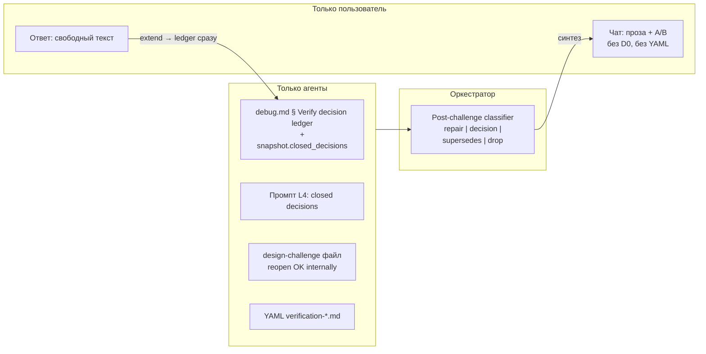
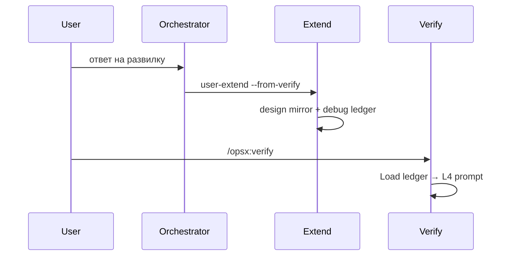
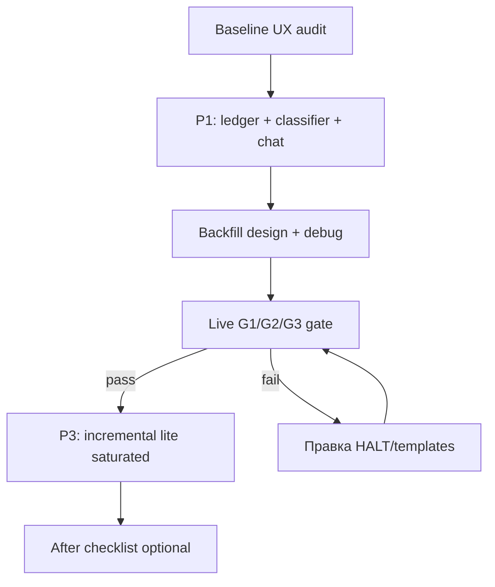

# Verify anti-fatigue: правила, UX и тестовый прогон

> **Статус:** объединён с независимым ревью (2026-06-07). Диагноз подтверждён на кейсе [`diadok-mchd-before-pack`](openspec/changes/diadok-mchd-before-pack/) (verify-2 → extend D3 → verify-3 REJECT с переоткрытием D0).

## Принцип разделения слоёв



**Жёсткое правило:** пользователь **никогда** не видит и не вводит `D0`, `D4a`, `closed_decisions`, `decision_round`, `GO-with-assumptions` как команды. В чате — только [`chat-summary.md`](.cursor/skills/openspec-verify-change/templates/chat-summary.md), [`card-decision.md`](.cursor/skills/openspec-verify-change/templates/card-decision.md).

**Adversarial Layer 4 не ослабляем:** architect **может** писать альтернативы, отменяющие closed decision, **в файл** отчёта. Фильтр и reclassify — **оркестратор** (см. §2.3), не запрет architect.

Парсинг ответа: оркестратор сопоставляет «B», «второй», «как в регламенте» с **внутренним** `decision_id` + вариантом; при неоднозначности — **один** уточняющий вопрос **прозой**, без кодов.

---

## Целевое поведение (кратко)

| Проблема сейчас | Механизм после правок |
|-----------------|----------------------|
| Переоткрытие D0/D3 | Ledger до L4 + classifier `drop reopen` / `supersedes` |
| Три SSOT расходятся | `debug.md` ledger + snapshot sync + `open_known_questions` cleanup |
| A/B путаются между раундами | Новая формулировка в чате; стабильный `decision_id` в YAML |
| Уточнение реализации = новая развилка | `implementation_invariant` → **Repair Loop**, не чат |
| Полный re-verify после каждого ответа | `verify_depth: incremental` после user decision (не после repair) |
| Бесконечные NO-GO | `decision_round` cap + GO-saturated **только** assumption/de-dupe |
| Decision fatigue | Блок «Уже зафиксировано» прозой (2 строки), без ID |

---

## Фаза 0 — Baseline UX-аудит (субагент, до правок)

**Цель:** зафиксировать эталон «как плохо» на реальном кейсе.

**Делегирование:** `Task(subagent_type=generalPurpose, readonly=true)`.

**Вход:**
- Отчёты [`openspec/changes/diadok-mchd-before-pack/reports/verification-2026-06-06*.md`](openspec/changes/diadok-mchd-before-pack/reports/)
- [`design-challenge-2026-06-06-6.md`](openspec/changes/diadok-mchd-before-pack/reports/design-challenge-2026-06-06-6.md) — reopen D0
- Критерии: [`ux-acceptance-isolated-chat.md`](.cursor/docs/ux-acceptance-isolated-chat.md) A–F + anti-patterns

**Выход:** `temp/reports/verify-ux-audit-2026-06-07-diadok-mchd-before-pack-baseline.md`

**Рубрика (0–2 балла × 6 пунктов = max 12):**
1. Самодостаточность без prior turns
2. Нет утечки agent-keys в чат (D0, Layer N, GO, design-challenge)
3. Одна развилка = один смысл (нет регресса закрытого выбора)
4. Триада problem / impact / variants
5. Ясный next step одной строкой
6. Нет token-heavy дублирования файла в чате

**Pass baseline (ожидание на текущем процессе):** score **≤4/12** по пунктам 2–3; зафиксировать фактические баллы в baseline.md.

---

## Фаза 1 — Decision Ledger (agent-only) + human mirror в design

### 1.1 Runtime SSOT: debug + snapshot

**Primary runtime SSOT между прогонами:** секция **`## Verify decision ledger`** в [`openspec/changes/<name>/debug.md`](openspec/changes/diadok-mchd-before-pack/debug.md):

```yaml
closed_decisions:
  - id: mount_context          # agent key, snake_case
    summary: "установка в ПакетДокументовДForОтправки"
    closed_at: "2026-06-06"
    source: "verify-user-answer"
open_decision_id: null
decision_round: 2
verify_depth: full             # full | incremental | lite
assumptions_accepted: []
```

**Зеркало в отчёте:** [`templates/report-header.md`](.cursor/skills/openspec-verify-change/templates/report-header.md) — те же поля в `snapshot` при Save report.

**Sync `open_known_questions`:** при закрытии decision — **удалить** соответствующую тему из `snapshot.open_known_questions` (verify-3 тащил «где гарантировать очистку» при закрытом D3).

### 1.2 Зеркало для людей в design.md (без дубля)

**Стратегия merge (принято):**
- **`## Решения verify (зафиксировано)`** — короткий UX-mirror (2–4 строки прозой), без `id:`.
- **`## Decisions` (D0, D3, …)** — технический SSOT для extend/repair и ссылок в tasks `(D0/D1)`; **не deprecate**.

Пример mirror:
- «Точка установки контекста — `ПакетДокументовДForОтправки` (verify 2026-06-06).»
- «Очистка — после отправки, как в регламенте (verify 2026-06-06).»

Backfill [`diadok-mchd-before-pack/design.md`](openspec/changes/diadok-mchd-before-pack/design.md): mirror из D0/D3 **без** копирования параграфов из `## Decisions`.

### 1.3 Extend после user decision — **ledger сразу, до re-verify**

[`openspec-extend-change/SKILL.md`](.cursor/skills/openspec-extend-change/SKILL.md): при user-extend `--from-verify` после decision:

1. Записать прозу в design § «Решения verify».
2. **Сразу** обновить `debug.md` § Verify decision ledger (`closed_decisions`, `decision_round++`).
3. Удалить закрытые темы из `open_known_questions`.
4. Hint пользователю: `/opsx:verify <name>`.

**Не ждать** «следующего verification YAML» — иначе L4 не видит closed decisions.



Verify Load artifacts (шаг 2 SKILL): читать `debug.md` § ledger **до** Novelty Check и Layer 4.

---

## Фаза 2 — Challenge filter, classifier, repair-классификация

### 2.1 Промпт design-challenge (SKILL + architect)

В [`SKILL.md`](.cursor/skills/openspec-verify-change/SKILL.md) § Layer 4 и [`.cursor/agents/onec-code-architect.md`](.cursor/agents/onec-code-architect.md) §design-challenge:

```markdown
## Closed decisions (mandatory context)
<paste debug ledger closed_decisions + design § Решения verify>

You MAY challenge closed decisions in the report file with verified code facts.
Tag reopening alternatives: reopen-blocked: <decision_id>.
Prefer implementation_invariant gaps over architectural forks when closed axis holds.
```

Architect **не** запрещается писать ≥2 альтернативы; mandate adversarial сохранён.

### 2.2 Карта repair vs decision

[`opsx-output-style.md`](.cursor/docs/opsx-output-style.md) §2.6 — расширить:

| Класс | Agent alert | User-facing |
|-------|-------------|-------------|
| `implementation_invariant` | `context-leak-on-exception`, `try-finally-cleanup` | **Repair Loop**, не в чат |
| `architectural_decision` | `context-lifecycle-fork` | Развилка в чате |
| `assumption_deferrable` | `load-bearing-unverified` | GO-saturated или defer S1.accept |
| `supersedes` | reopen + verified new fact | Одна эскалация прозой, не A/B с D0 |

Defensive filter оркестратора (уже есть для workflow) — добавить **reopen-closed-decision** и **reopen-blocked** tags.

### 2.3 Post-challenge classifier (оркестратор, новый шаг SKILL)

**После** получения `design-challenge-*.md`, **до** синтеза чата:

| Сигнал в отчёте | Действие |
|-----------------|----------|
| Gap закрывается правкой design/tasks **без** смены closed axis | **Repair Loop** (`implementation_invariant`) |
| Alternative отменяет closed `decision_id` **без** verified new fact | **Drop** — не в чат; log в info |
| Alternative + **verified new fact** (напр. единственный caller) | **`supersedes`**: «подтверждаете точку X, несмотря на Y?» — одна прозаичная эскалация |
| `assumption_deferrable` | GO-saturated или defer в S1.accept |
| Layer 4 **REJECT** + gap корректности/security | **Всегда NO-GO** — cap не применяется |

Это закрывает кейс verify-3: `Попытка/Исключение` в `ПакетДокументовДForОтправки` → repair; перенос в Skripty при closed D0 → drop/supersedes, не новая развилка A/B.

### 2.4 Чат: контекст итерации без ключей

[`chat-summary.md`](.cursor/skills/openspec-verify-change/templates/chat-summary.md) — блок **перед** «Что решить» (если `decision_round >= 1`):

```markdown
Уже зафиксировано: установка контекста в ПакетДокументовДForОтправки; очистка после отправки.
Новый вопрос: только гарантия очистки при ошибке сборки — прежние решения не пересматриваются.
```

Запрещено: «D0», «decision_round 2/2», «closed_decisions».

---

## Фаза 3 — Incremental re-verify и `--lite`

**Footnote к принципу 3 SKILL** («без скидок по объёму»): исключение только для `verify_depth` с guardrails ниже.

### 3.1 Триггеры глубины прогона

| `verify_depth` | Когда | Слои |
|----------------|-------|------|
| `full` | первый verify; менялись proposal/specs; `decision_round=0` | L1–L5 |
| `incremental` | design/tasks после **user decision** extend; `decision_round>0` | L1 diff + L4 targeted + L5 если tasks |
| `lite` | `/opsx:verify <name> --lite` **и** нет открытой развилки **и** `decision_round=0` | L2 + L5; L4 SKIPPED-lite |

**Guardrails:**
- `--lite` **запрещён** при открытой развилке или `decision_round > 0`.
- `incremental` — **только** после user-extend по decision, **не** после internal Repair Loop (repair → full re-verify как сейчас).

**`--lite` в чате:** «проверена исполнимость без повторного независимого аудита постановки» (без слова lite в HALT).

### 3.2 Layer 4 targeted prompt

При `incremental`: challenge только по delta design; closed decisions в промпте обязательны.

---

## Фаза 4 — Лимит decision_round и GO-saturated

### 4.1 Cap (с guardrails)

- `decision_round_max: 2` в SKILL.
- **GO-saturated применяется только если:**
  - L2/3/5 PASS, **и**
  - остаток L4 = `assumption_deferrable` **или** duplicate challenge по тому же `decision_id` (de-dupe), **и**
  - Layer 4 **не** REJECT с gap корректности/security/resource-leak.

- YAML: `verdict: GO`, `layer_4: CHALLENGE-saturated`
- Чат: «можно apply; остаточный риск … проверяется в S1.accept» — **без** «GO-with-assumptions».

**REJECT с утечкой контекста (verify-3) → всегда NO-GO**, cap не спасает.

### 4.2 Явный accept risk (опционально)

Фразы: «принимаю риск», «apply без further verify» → internal `assumptions_accepted` + GO; одна строка прозой в § Risks design.

---

## Фаза 5 — HALT и acceptance

### 5.1 Chat lexicon

[`chat-lexicon.md`](.cursor/docs/chat-lexicon.md) — слой agent-keys (запрет в чате):

`closed_decisions`, `decision_round`, `decision_id`, `D0`–`Dn`, `GO-with-assumptions`, `verify_depth`, `incremental`, `SKIPPED-novelty`, `supersedes`, `reopen-blocked`

### 5.2 verify-user-communication

[`verify-user-communication.mdc`](.cursor/rules/verify-user-communication.mdc):
- pre-send check #8: grep agent-keys
- после user answer: перефраз без ID

### 5.3 UX acceptance — сценарии G (multi-round)

[`ux-acceptance-isolated-chat.md`](.cursor/docs/ux-acceptance-isolated-chat.md):

| ID | Шаг | Pass |
|----|-----|------|
| **G1** | Новый чат: `/opsx:verify diadok-mchd-before-pack` после backfill | GO **или** одна развилка; **0** agent-keys; нет reopen mount/cleanup |
| **G2** | Ответ на развилку (если была) → extend hint | Handoff на языке эффекта; ledger в debug |
| **G3** | Повторный `/opsx:verify` в **той же** сессии | Блок «Уже зафиксировано»; **0** reopen закрытых решений |

**Hard gate:** только G1+G3 (или G1 GO без G2). Dry-run субагента — **не** gate.

---

## Фаза 6 — Post-change checklist + live gate

### 6.1 Субагент «после» (checklist, не gate)

`Task(generalPurpose, readonly)` после merge правил:

1. Прочитать обновлённые SKILL/templates.
2. Dry-run: этalon ожидаемого chat message для `diadok-mchd-before-pack`.
3. Score по рубрике; checklist agent-key leak.

**Выход:** `temp/reports/verify-ux-audit-2026-06-07-diadok-mchd-before-pack-after.md`

**Pass checklist:** ≥**10/12** по рубрике + 0 agent-key leaks + G1/G3 criteria met в этalon. **Не** «baseline +8».

### 6.2 Ручной isolated chat — **единственный hard gate**

Сценарии G1–G3 (см. §5.3). Результат в `after.md` § «Live run».

---

## Файлы для изменения (сводка)

| Файл | Изменение |
|------|-----------|
| [`.cursor/skills/openspec-verify-change/SKILL.md`](.cursor/skills/openspec-verify-change/SKILL.md) | ledger load, classifier, depths, cap guardrails, `--lite`, принцип 3 footnote |
| [`templates/report-header.md`](.cursor/skills/openspec-verify-change/templates/report-header.md) | snapshot fields + open_known_questions sync |
| [`templates/chat-summary.md`](.cursor/skills/openspec-verify-change/templates/chat-summary.md) | «Уже зафиксировано», GO-saturated |
| [`templates/card-decision.md`](.cursor/skills/openspec-verify-change/templates/card-decision.md) | decision_id file-only |
| [`templates/executive-summary.md`](.cursor/skills/openspec-verify-change/templates/executive-summary.md) | chat-mirror без D0/D3 |
| [`.cursor/agents/onec-code-architect.md`](.cursor/agents/onec-code-architect.md) | §design-challenge: closed decisions + reopen-blocked tag |
| [`.cursor/docs/opsx-output-style.md`](.cursor/docs/opsx-output-style.md) | repair map + supersedes |
| [`.cursor/rules/verify-user-communication.mdc`](.cursor/rules/verify-user-communication.mdc) | HALT agent-keys |
| [`.cursor/docs/chat-lexicon.md`](.cursor/docs/chat-lexicon.md) | agent-keys layer |
| [`.cursor/docs/ux-acceptance-isolated-chat.md`](.cursor/docs/ux-acceptance-isolated-chat.md) | G1/G2/G3 |
| [`.cursor/skills/openspec-extend-change/SKILL.md`](.cursor/skills/openspec-extend-change/SKILL.md) | ledger в debug сразу после decision |
| [`diadok-mchd-before-pack/design.md`](openspec/changes/diadok-mchd-before-pack/design.md) | § «Решения verify» mirror |
| [`diadok-mchd-before-pack/debug.md`](openspec/changes/diadok-mchd-before-pack/debug.md) | § Verify decision ledger (backfill) |

Опционально: [`AGENTS.md`](AGENTS.md) — одна строка про `--lite`.

---

## Порядок выполнения (приоритет)

**P1 (ядро anti-fatigue):**
1. Baseline audit
2. Ledger + extend timing + open_known_questions sync
3. Orchestrator classifier + implementation_invariant → repair
4. L4 prompt (SKILL + architect.md)
5. Chat «Уже зафиксировано» + HALT

**P2 (acceptance):**
6. Backfill design + debug ledger
7. G1/G2/G3 live gate

**P3 (оптимизация, после P1–P2):**
8. incremental / `--lite` / GO-saturated с guardrails
9. After checklist (субагент)



---

## Ревью (архив)

Независимое ревью 2026-06-07: диагноз подтверждён; ключевые правки влиты — ledger timing, orchestrator classifier, GO-saturated guardrails, decisions merge, G multi-round, dry-run → checklist.
