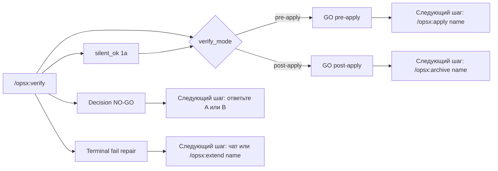

# Явный next step после `/opsx:verify`

## Ревью (независимая проверка)

**Вердикт: GO с доработками.** Диагноз и приоритет файлов верны. Без правок ниже применение создаст регрессию post-apply и оставит противоречие в §2.6 Правило 3.

| Аспект | Оценка |
|--------|--------|
| Диагноз (GO без команды) | ✓ Подтверждено: `chat-summary.md` 1a/2/2b без слота; `verify-user-communication.mdc` L25 «ничего» |
| Противоречие §2.6 Rule 2 vs Rule 3 | ✓ Реально: Rule 2 разрешает `/opsx:apply`, Rule 3 трактует GO как «ничего не требуется» |
| Охват terminal-исходов | △ Неполный: нет 1b-decision, supersedes; post-apply отложен как optional — **ошибка** |
| Apply handoff (§5.2) | ✓ Уместно в том же PR; gap подтверждён (short-cut есть, resume `/opsx:apply` — нет) |
| Лимит строк silent 1a | △ +1 строка → обновить `chat-output-budget.mdc` (≤5 → ≤6) и сценарий C |

---

## Проблема

GO-verify отвечает «можно запускать apply», но **не называет команду**. Противоречие:

- [`verify-user-communication.mdc`](.cursor/rules/verify-user-communication.mdc) L25 — слот GO = «ничего»
- [`opsx-output-style.md`](.cursor/docs/opsx-output-style.md) §2.6 Rule 2 — user-action команды **разрешены**
- §2.6 Rule 3 — «ничего не требуется» как единственный сигнал для GO (**конфликт**)
- Explore/ff/extend уже требуют явный «Дальше» / «Следующий шаг»

---

## Целевая модель terminal-исходов verify



**Единый слот в чате** (перед ссылкой на отчёт):

```markdown
**Следующий шаг:** `/opsx:<command> <change-name>`
```

Без флагов, без путей — как T-CONFIRM §5.5.

**Ветвление next step по `verify_mode`** (из snapshot / grep `tasks.md`):

| verify_mode | GO / silent_ok 1a | Первая строка вердикта (без изменений в этом PR) |
|-------------|-------------------|--------------------------------------------------|
| `pre-apply` | `/opsx:apply <name>` | «можно запускать apply» |
| `post-apply` | `/opsx:archive <name>` | «можно запускать apply» *(формулировка вердикта — отдельная тема; next step обязан быть archive)* |

---

## Изменения по файлам (порядок применения)

### 0. Снять корневое противоречие — §2.6 Правило 3 (**сначала**)

[`opsx-output-style.md`](.cursor/docs/opsx-output-style.md) §2.6 **Правило 3** — заменить триаду:

| Было | Станет |
|------|--------|
| «ничего не требуется» \| «выберите A или B» \| «подтвердите» | **user-action next step** (одна команда `/opsx:…`) \| **ответ в чате** (A/B, supersedes, terminal fail) \| **подтвердите** (explore / user-extend) |

Anti-pattern «ничего не требуется + Подтвердить?» — сохранить. Добавить anti-pattern: **GO без явной user-action команды в слоте «Следующий шаг»**.

**Self-check §2.6** — пункт 6: «GO verify содержит `**Следующий шаг:**` + корректную команду (apply или archive)?»

**Terminal outcomes** — строка verify: `«можно apply» + **Следующий шаг** (/opsx:apply \| /opsx:archive) \| decision + ответ в чате \| terminal fail + чат/extend`.

---

### 1. Шаблоны verify — SSOT для чата

[`chat-summary.md`](.cursor/skills/openspec-verify-change/templates/chat-summary.md)

| Вариант | Следующий шаг |
|---------|---------------|
| **1a** (silent_ok GO) | pre-apply → `/opsx:apply`; post-apply → `/opsx:archive` |
| **1b-decision** | `ответьте в чате (A или B)` — **без** `/opsx:extend --from-verify` |
| **2** (GO) | то же ветвление по verify_mode |
| **2b** (GO-saturated) | то же + остаточный риск в приёмке |
| **3a-decision** | `ответьте в чате (A или B). После фиксации — снова /opsx:verify <name>` |
| **3a-supersedes** | `ответьте в чате: подтверждаете …?` — END TURN |
| **4** (terminal fail) | `опишите в чате, как поступить, или /opsx:extend <name>` |

Порядок: вердикт → контекст (опц.) → **Следующий шаг** → ссылка на отчёт.

**Decision 3a:** слот «Следующий шаг» **заменяет** финальную строку «Напишите, какой вариант ближе…» (один CTA, не два).

[`verdict-card.md`](.cursor/skills/openspec-verify-change/templates/verdict-card.md)

- Примечание: GO **не завершает** сообщение — обязателен слот из `chat-summary.md`.
- В «Связь с дальнейшим сообщением» для Варианта 1: `+ **Следующий шаг**`.

[`executive-summary.md`](.cursor/skills/openspec-verify-change/templates/executive-summary.md)

- **Удалить** строку `Что нужно от вас: <ничего | …>` из шаблона «Резюме для разработчика».
- **Добавить** зеркало: `**Следующий шаг:** …` (тот же текст, что в чате).
- Action items в файле (§5.3) — первый пункт = та же команда, что в чате.

---

### 2. Правила и SKILL

[`verify-user-communication.mdc`](.cursor/rules/verify-user-communication.mdc)

| Исход | Было | Станет |
|-------|------|--------|
| GO pre-apply | «ничего» | handoff: `/opsx:apply` |
| GO post-apply | «ничего» | handoff: `/opsx:archive` |
| Decision | «выбрать A или B» | слот «ответ в чате»; hint `/opsx:verify` — **после** user-extend (уже есть L76) |
| Terminal fail | «см. отчёт» | чат **или** `/opsx:extend` |

Pre-send self-check #3: «один сигнал ответственности = слот **Следующий шаг**»; #9: «GO pre-apply содержит `/opsx:apply`? GO post-apply — `/opsx:archive`?»

[`SKILL.md`](.cursor/skills/openspec-verify-change/SKILL.md) — `Output to chat`

- HARD: GO / 2b / silent_ok 1a — **всегда** `**Следующий шаг:**` с командой по `verify_mode`.
- silent_ok: читать `verify_mode` из YAML snapshot последнего отчёта, **не** hardcode apply.
- Self-check: «можно действовать без файла» = видна **конкретная команда**.

[`opsx-verify.md`](.cursor/commands/opsx-verify.md)

- Контракт: `«можно apply» + Следующий шаг (/opsx:apply \| /opsx:archive)` \| decision + ответ в чате \| terminal fail \| silent 1a + next step.

[`chat-output-budget.mdc`](.cursor/rules/chat-output-budget.mdc)

- verify-строка: silent 1a **≤ 6 строк** (было ≤5); явно: обязателен слот «Следующий шаг».

---

### 3. Регрессия UX

[`ux-acceptance-isolated-chat.md`](.cursor/docs/ux-acceptance-isolated-chat.md)

| Сценарий | Дополнение pass |
|----------|-----------------|
| **A** | `**Следующий шаг:**` + `/opsx:apply` |
| **B** | `**Следующий шаг:**` + «ответьте» / A·B (END TURN сохраняется) |
| **C** | то же + `/opsx:apply`; ≤6 строк |
| **G1** | при GO — явная user-action команда |

Anti-pattern: GO без `**Следующий шаг:**` + команды.

*(Опционально post-apply fixture для archive-next-step — отдельный сценарий H, если есть change с `[x]` tasks.)*

---

### 4. Вторичные пробелы (минимальный diff)

[`opsx-output-style.md`](.cursor/docs/opsx-output-style.md) §5.2 thin chat `acceptance`:

- Добавить в чат: после проверки — `принято S<N>` **или** снова `/opsx:apply <name>`.

[`openspec-apply-change/SKILL.md`](.cursor/skills/openspec-apply-change/SKILL.md) Output style:

- Thin handoff acceptance **включает** строку «после проверки: `принято S<N>` или `/opsx:apply <name>`».

---

## Что не меняем

- Internal Repair Loop — 0 сообщений в чат.
- Decision END TURN — next step только «ответ в чате», **не** `/opsx:extend --from-verify` в чате.
- Формулировка первой строки «можно запускать apply» для post-apply — **вне scope** (next step = archive достаточно).
- ff/explore/extend/status — только grep на регрессию, без правок.

---

## Эталон (pre-apply GO)

```markdown
diadoc-intra-group-counterparty-match — можно запускать apply.

План добавляет fallback в `КД_Диадок` …

**Следующий шаг:** `/opsx:apply diadoc-intra-group-counterparty-match`

Полный отчёт: openspec/changes/diadoc-intra-group-counterparty-match/reports/verification-2026-06-08.md
```

## Эталон (post-apply GO)

```markdown
<change-name> — можно запускать apply.

**Следующий шаг:** `/opsx:archive <change-name>`

Полный отчёт: …
```

---

## Проверка после внесения правок

1. Мысленно A/B/C/G1 — GO содержит `**Следующий шаг:**` + команду.
2. post-apply fixture (все `[x]`) — next step = archive, не apply.
3. Grep `.cursor` на «ничего не требуется», «Что нужно от вас: ничего», «слот … ничего» в verify-контексте — 0 противоречий.
4. §2.6 Rule 3 и verify-user-communication согласованы (нет «ничего» для GO).
