# Чекпоинт и план: задачи при старте обработки

## Контекст задачи

**Расширение:** [src/ДО3/cfe/pav_ИсключениеУчастниковПоУсловию](src/ДО3/cfe/pav_ИсключениеУчастниковПоУсловию)

**Исходная проблема:** В типовой при старте обработки создаётся одна задача на первый этап; в расширении создавались задачи на оба этапа. После последней доработки **задачи не создаются вообще**.

**Цель:** Восстановить поведение: при старте обработки создаётся одна задача на первый этап (как в типовой).

---

## Чекпоинт: что уже сделано

### 1. Анализ трасс (onec-trace-analyst)

**Файлы трасс:**

- Текущая (сломано): [temp/Замеры/Старт обработки_TRACE_FULL.txt](temp/Замеры/Старт обработки_TRACE_FULL.txt)
- Типовая (эталон): [temp/Замеры/Старт обработки типовой_TRACE_FULL.txt](temp/Замеры/Старт обработки типовой_TRACE_FULL.txt)

**Вывод trace-analyst:**

- В сломанной трассе вызов `ОбработатьСозданиеЗадачДляЭлементаСхемыДействие` (#10191) возвращает **Истина**, из‑за чего `КомплексныйПроцесс` не создаёт задачу (ветка 2647–2672 не выполняется).
- Единственный ранний возврат Истина в обработчике — при **пустом Действие** (РаботаСПроцессамиПоОбработкамОбъектовСобытия, стр. 939–941).
- `Действие` берётся из `ДействиеПоИмениЭлементаСхемыОбработки(ИмяЭлемента, Обработка)`; при пустом результате — возврат Истина, задача не создаётся.

### 2. Исследование кода (onec-code-explorer)

**Цепочка до первого вызова обработчика:**

```
НачатьВыполнениеПроцессаПоСхемеОбработка (КомплексныйПроцесс)
  → ДобавитьНачальныеЭлементыДляОбработки
  → ДобавитьЭлементСтартаДляОбработкиПриНеобходимости
  → ВыполнитьОбработкуСхемыПроцесса
  → первый элемент типа «Действие» (после Старта)
  → ОбработатьЭлементСхемыДействие → СоздатьЗадачиОбработкиЭлементаСхемыДействие
  → ОбработатьСозданиеЗадачДляЭлементаСхемыДействие(ИмяЭлемента, ОбработчикСхемы, ЭтотОбъект)
```

**ИмяЭлемента** при первом вызове — имя первого после «Старт» элемента типа «Действие» из схемы процесса.

**Почему Действие пустое (два варианта):**

- **A.** В схеме обработки не заполнено `НастройкиЭлементов[ИмяЭлемента]` (ВидДействия) в ПараметрыСхемДляОбработокОбъектов.
- **B.** В `ТекущиеДействияПредмета(Владелец, ВидВладельца, ДатаСоздания)` нет действия с этим ВидДействия (действия не созданы к моменту старта или дата/вид не совпадают).

**Влияние расширения:** Не приводит к отсутствию действия. Нет переопределения `ТекущиеДействияПредмета` в ДействияСервер (Ext); подписки на поиск действия по имени элемента в расширении нет. Причина — в данных схемы и/или в наборе действий по предмету.

### 3. Ключевые файлы (для продолжения)


| Роль                    | Путь                                                                                                                                                                                                                                                                                   |
| ----------------------- | -------------------------------------------------------------------------------------------------------------------------------------------------------------------------------------------------------------------------------------------------------------------------------------- |
| КомплексныйПроцесс      | [src/ДО3/cf/BusinessProcesses/КомплексныйПроцесс/Ext/ObjectModule.bsl](src/ДО3/cf/BusinessProcesses/КомплексныйПроцесс/Ext/ObjectModule.bsl) — 2640–2648 (вызов обработчика), 2647–2672 (стандартное создание задачи)                                                                  |
| Обработчик события      | [src/ДО3/cf/CommonModules/РаботаСПроцессамиПоОбработкамОбъектовСобытия/Ext/Module.bsl](src/ДО3/cf/CommonModules/РаботаСПроцессамиПоОбработкамОбъектовСобытия/Ext/Module.bsl) — 921–942 (ОбработатьСозданиеЗадачДляЭлементаСхемыДействие), 936–942 (возврат Истина при пустом Действие) |
| Поиск действия          | [src/ДО3/cf/CommonModules/РаботаСПроцессамиПоОбработкамОбъектов/Ext/Module.bsl](src/ДО3/cf/CommonModules/РаботаСПроцессамиПоОбработкамОбъектов/Ext/Module.bsl) — 1014–1039 (ДействиеПоИмениЭлементаСхемыОбработки)                                                                     |
| Текущие действия        | [src/ДО3/cf/CommonModules/ДействияСервер/Ext/Module.bsl](src/ДО3/cf/CommonModules/ДействияСервер/Ext/Module.bsl) — 2782–2925 (ТекущиеДействияПредмета)                                                                                                                                 |
| Расширение (не причина) | [src/ДО3/cfe/pav_ИсключениеУчастниковПоУсловию/CommonModules/РаботаСПроцессамиПоДействиям/Ext/Module.bsl](src/ДО3/cfe/pav_ИсключениеУчастниковПоУсловию/CommonModules/РаботаСПроцессамиПоДействиям/Ext/Module.bsl), ДействияСервер (Ext), ПравилаОбработкиСервер (Ext)                 |


---

## План работ (порядок выполнения)

### Шаг 1. Верификация причины (гипотеза A или B)

**Без изменения кода (предпочтительно первым):**

- Проверить в карточке схемы обработки объекта: для первого после «Старт» элемента типа «Действие» в ПараметрыСхемДляОбработокОбъектов заполнена ли настройка (ВидДействия).
- Убедиться, что к моменту «Начать обработку» по предмету уже вызывался ЗаполнитьДействия (например, при открытии формы) и что в БД есть действие с тем же ВидДействия, что у первого элемента схемы, и с той же ДатаСоздания обработки.

**При необходимости — временное логирование (типовой код):**

- В [РаботаСПроцессамиПоОбработкамОбъектовСобытия](src/ДО3/cf/CommonModules/РаботаСПроцессамиПоОбработкамОбъектовСобытия/Ext/Module.bsl), процедура ОбработатьСозданиеЗадачДляЭлементаСхемыДействие, перед проверкой ЗначениеЗаполнено(Действие) (стр. 936–942): записать в журнал регистрации или отладочный вывод ИмяЭлемента, Обработка, результат ДействиеПоИмениЭлементаСхемыОбработки, ВидДействия из НастройкиЭлементов[ИмяЭлемента], количество записей в ТекущиеДействия и наличие среди них нужного ВидДействия. После верификации — убрать логирование.

### Шаг 2. Варианты исправления (onec-code-architect)

После однозначной верификации (A или B):

- Запустить **onec-code-architect** с входом: отчёт trace-analyst, вывод explorer, результат верификации.
- Задача архитектору: предложить варианты исправления — (1) обеспечить наличие действия для элемента при старте с учётом исключения участников, либо (2) при пустом Действие не трактовать как «обработку выполнил подписчик» и не пропускать создание задачи, с учётом рисков для типовой логики «пропуск элемента без действия». Указать рекомендуемый вариант и границы изменений (только расширение vs правка типового).

### Шаг 3. Реализация исправления

- По правилам проекта: делегировать написание/правку BSL агенту **onec-code-writer** (не править .bsl напрямую). Загрузить скилл [.cursor/skills/1c-feature-dev-enhanced/SKILL.md](.cursor/skills/1c-feature-dev-enhanced/SKILL.md).
- Передать writer: выбранный вариант из шага 2, пути к файлам, контекст (этот чекпоинт/план).
- Ограничение полномочий агентов: только правка существующих .bsl; при необходимости нового объекта/модуля — СТОП и сообщение пользователю.

### Шаг 4. Ревью и приёмка

- Запустить **onec-code-reviewer** по изменённым .bsl файлам.
- Critical/High без архитектурных изменений — авто-исправление через onec-code-writer (до 2 итераций), затем повторное ревью.
- Critical/High с архитектурными изменениями — СТОП, согласование с пользователем.
- Задача выполнена только после PASS ревью или явного одобрения пользователя.

### Шаг 5. Регрессионная проверка

- Повторить сценарий «старт обработки» по тому же предмету; убедиться, что создаётся одна задача на первый этап.
- При возможности — снять трассу и сравнить с типовой (наличие вызова СоздатьЗадачуОбработкиЭлементаСхемы и запись задачи).

---

## Краткая схема потока (напоминание)

```mermaid
flowchart LR
  subgraph start [Старт обработки]
    A[НачатьОбработку] --> B[ПриНачалеОбработкиОбъекта]
    B --> C[СоздатьПроцессПоОбработке]
    C --> D[ПроцессПоОбработке.Старт]
  end
  subgraph scheme [Схема процесса]
    D --> E[НачатьВыполнениеПроцессаПоСхемеОбработка]
    E --> F[ДобавитьНачальныеЭлементы]
    E --> G[ДобавитьЭлементСтарта]
    F --> H[ВыполнитьОбработкуСхемыПроцесса]
    G --> H
    H --> I[Первый элемент Действие]
    I --> J[СоздатьЗадачиОбработкиЭлементаСхемыДействие]
    J --> K[ОбработатьСозданиеЗадачДляЭлементаСхемыДействие]
  end
  subgraph decision [Решение]
    K --> L{Действие заполнено?}
    L -->|Нет| M[Возврат Истина]
    L -->|Да| N[Создать задачу / процесс]
    M --> O[КомплексныйПроцесс не создаёт задачу]
    N --> P[Задача создаётся]
  end
```




**Текущая поломка:** на первом вызове для элемента «Действие» в K приходит пустое Действие → возврат Истина → задача не создаётся.

---

## Зависимости и напоминания

- Правила BSL: [.cursor/rules/bsl-write-guard.mdc](.cursor/rules/bsl-write-guard.mdc), [AGENTS.md](AGENTS.md) — не править .bsl напрямую, делегировать onec-code-writer, обязательное ревью onec-code-reviewer.
- Гипотеза перед реализацией: [.cursor/rules/hypothesis-verification-gate.mdc](.cursor/rules/hypothesis-verification-gate.mdc) — реализацию не начинать по непроверенной гипотезе; шаг 1 (верификация) обязателен перед шагом 2–3.

