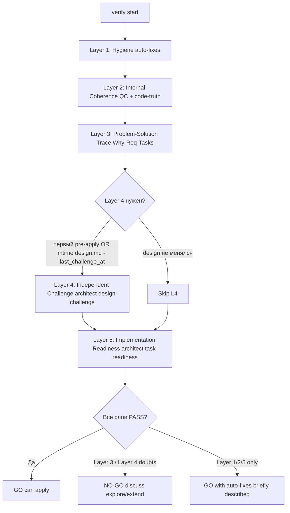

`/opsx:verify <name>` — независимое согласование ЗНИ перед `/opsx:apply`. Главный вопрос пользователя: «**могу ли я безопасно запустить apply?**» Ответ — бинарный (**GO** / **NO-GO**) и предъявлен в первой строке чата.

## Принципы

1. **Пять слоёв, в строгом порядке.** Каждый слой имеет единственную цель; пропуск/слияние слоёв запрещены, кроме явного триггера Layer 4.
2. **Бинарный вердикт.** Чат всегда даёт `GO` (можно apply) или `NO-GO` (на обсуждение). Не «WARNING/SUGGESTION», не «PASS/FAIL» в чат.
3. **Без скидок по объёму.** Глубина проверки одинакова для маленьких и больших ЗНИ — одна сломанная задача может остановить пользователя так же, как 25.
4. **Verify ничего не расширяет.** Текстовая постановка пользователя сверх «провести verify» уходит через `/opsx:explore` или `/opsx:extend` — verify не правит scope артефактов сам.
5. **Один файл отчёта в день.** Полный отчёт `reports/verification-YYYY-MM-DD.md` создаётся, только если что-то найдено или исправлено; «тихий» прогон по фильтру новизны новый файл не пишет.

## Архитектура (5 слоёв)



## Режимы

Только два значения `verify_mode` в YAML отчёта:

- **`pre-apply`** — есть хотя бы одна `[ ]` в `tasks.md` (включая `S<N>.accept` и legacy `S<N>.T<M>`). Сюда же относятся «узкий verify одного среза» и «verify после принятого среза» — это контекстные подсценарии pre-apply, выводимые из текста запроса пользователя и состояния `debug.md` / `reports/slice-acceptance-*`.
- **`post-apply`** — все задачи `[x]`.

Старые значения (`slice-pre`, `slice-post`, `slice-scoped`, `slice-transition`, `legacy-pre`, `legacy-mixed`, `legacy-post`) **удалены** — больше не использовать ни в YAML, ни в чате, ни в именах файлов.

## Шаги (последовательно)

### 1. Select change

1. Если в запросе указано имя — использовать.
2. Если нет — `openspec list --json`, выбрать активную ЗНИ. При >1 активной — AskQuestion.
3. Имя сохранить как `<change-name>`.

### 1b. Scope Gate

Verify не правит scope артефактов. Если в запросе пользователя помимо команды verify есть **новое требование** или содержательная правка постановки (новые сценарии, изменения design):

- AskQuestion: **«Хотите дополнить артефакты этим требованием перед verify? `/opsx:extend <name> --from-verify-prompt` / Запустить verify по текущим артефактам / Зафиксировать в TODO отчёта»**.
- При выборе extend — verify останавливается, оркестратор передаёт текст в `/opsx:extend`.
- При выборе «по текущим» — текст пользователя не учитывается в проверках, фиксируется в YAML отчёта `scope_gate_decision: ignore-extra` для аудита.
- При выборе «TODO» — записывается в info-секцию отчёта, на вердикт не влияет.

Если запрос — только имя ЗНИ — Scope Gate проходит молча.

### 2. Load artifacts

Прочитать (с фиксацией mtime для snapshot):

- `openspec/changes/<name>/proposal.md`
- `openspec/changes/<name>/design.md` (mtime → `design_mtime` для решения по Layer 4)
- `openspec/changes/<name>/tasks.md`
- `openspec/changes/<name>/specs/**/*.md`
- `openspec/changes/<name>/debug.md` (если есть)
- `openspec/changes/<name>/reports/_manifest.yaml` (если есть)
- `openspec/project.md`

### 3. Determine mode

Grep `tasks.md` на `^- \[[ ]\]` — если найдено хотя бы одно совпадение, `verify_mode = pre-apply`; иначе `post-apply`.

### 4. Novelty Check (фильтр повторных запусков)

1. Найти последний `reports/verification-*.md` (по дате в имени файла) и прочитать его YAML `snapshot`.
2. Сравнить с текущим состоянием:
   - `accepted_tasks` — список `[x]` в `tasks.md`. Если множество совпало → флаг `accepted_tasks: same`.
   - `artifacts_mtime` — каждый файл из `proposal/design/tasks/specs` имеет ту же ISO-метку, что в snapshot → флаг `artifacts: same`.
   - `last_challenge_at` ≥ `design_mtime` → флаг `challenge: actual`.
3. Если **все три** флага `same/actual` **И** в текущем запросе пользователя нет содержательных вопросов (был только триггер `/opsx:verify <name>`) — путь **`silent_ok`**:
   - **Не запускать слои 1–5.**
   - **Не создавать новый файл отчёта.**
   - В чат — «тихий» вариант шаблона `templates/chat-summary.md`. Закончить шаг.
4. Если хотя бы один флаг разошёлся — продолжить со слоя 1.

### Layer 1 — Гигиена артефактов (тихая, авто-исправление)

**Цель:** убрать механические дефекты формы (пустые чекбоксы, лишние пробелы, регистр маркеров), которые засоряют чат и вертикаль проверок. Никаких вопросов пользователю.

**Что проверяется (механически):**

| Проверка | Действие | Алерт |
|---|---|---|
| Чекбоксы `- [ ]` отсутствуют у задач | Добавить | `task-missing-checkbox` (auto-fix) |
| Закрывающий `<!-- slice-gate -->` отсутствует в срезе | Записать с заглушкой | `missing-slice-gate-marker` (auto-fix) |
| Пустые буллеты, лишние пробелы | Нормализовать | `whitespace-normalized` (auto-fix) |
| `<!-- phase-gate -->` (legacy маркер фазы) | Заменить на пометку `legacy-phase-gate-deprecated` в info-секции отчёта | `legacy-phase-gate` (info) |
| Незакрытые backtick-блоки в `design.md`/`tasks.md` | Закрыть | `unbalanced-fences` (auto-fix) |
| ID задачи без префикса среза, когда есть `# Срез` | Лог в info без правки | `task-without-slice-prefix` (info) |

**Если правок не было** — записать `layer_1_hygiene: PASS`. Если были — `AUTOFIXED` + список в `### Авто-исправлено (Layer 1)` отчёта (формат — `templates/phase-a-table.md`).

Layer 1 **никогда** не блокирует — только правит или сообщает в info.

### Layer 2 — Внутренняя согласованность плана

**Цель:** артефакты не противоречат друг другу.

**2.1. Slice Coherence (Quality Controller)** — делегировать **`openspec-quality-controller`** (Task **без** `model=`, по `model-selection.mdc`). Промпт: см. `1c-agent-patterns/quality-controller.md`. Получить `reports/quality-control-YYYY-MM-DD.md`.

QC оценивает критерии 1–6 из `vertical-slices.mdc` (Scenario Coverage, Slice Independence, Slice Completeness, Slice Dependency Graph, Slice Gate Integrity, Acceptance Checklist Coverage 5b, Rework Risk).

**2.2. Code-Truth (механический)** — для каждого технического имени в backticks из `design.md`/`tasks.md`/`debug.md`/`specs/**` запустить `Grep` по путям из `openspec/project.md`. См. `.cursor/rules/code-truth-gate.mdc`.

В `pre-apply` — `phantom-symbol` = WARNING; в `post-apply` — для `[x]` задач/принятых срезов CRITICAL (см. `code-truth-gate.mdc`).

**2.3. Spec ↔ Tasks ↔ Design coverage** — каждый `#### Scenario:` из `specs/**/spec.md` должен встречаться в `## Slices` design (строка «Scenarios из spec») И в чеклисте какого-то `S<N>.accept`. Иначе — алерт `scenario-orphan-design` или `scenario-orphan-accept`.

**Итоговый статус слоя:**

- `PASS` — все критерии OK / только INFO.
- `WARNING` — есть несущественные несостыковки (один scenario без покрытия в матрице, лишний legacy-маркер). На вердикт идёт как «не блокирует apply».
- `FAIL` — циклы зависимостей срезов, `accept-checklist-empty`, дублирование `S<N>.accept` в одном срезе, или CRITICAL `phantom-symbol` в post-apply.

`FAIL` в Layer 2 — это **NO-GO**.

### Layer 3 — Problem-Solution Trace

**Цель:** план реально решает проблему из `## Why`, а не похожую.

Проверки (детерминистические):

1. **Why → Requirements.** В `proposal.md` `## Why` есть пункты, не покрытые ни одним `### Requirement` в `specs/**/spec.md`? → `why-orphan-requirement` (FAIL).
2. **Requirements → Scenarios.** Каждый `### Requirement` имеет ≥1 `#### Scenario:`? Иначе → `requirement-orphan-scenario` (FAIL).
3. **Scenarios → Slices.** Каждый `#### Scenario:` упомянут в `## Slices` design.md? Иначе → `scenario-orphan-slice` (WARNING — может быть подобрано в Layer 2; FAIL только если несовпадение системное).
4. **Slices → Acceptance.** Каждый Scenario, заявленный в `**Связь со spec:**` среза, есть буллетом в чеклисте `S<N>.accept` этого среза? Иначе — алерт `accept-bullets-missing-scenario` (WARNING) от Layer 2 (5b QC); Layer 3 не дублирует.
5. **Slices → Tasks.** Для каждого среза есть рабочие задачи (`S<N>.<M>`) И ровно одна `S<N>.accept`. Срез без рабочих задач — алерт `slice-empty` (FAIL).

`FAIL` в Layer 3 — **NO-GO**.

### Layer 4 — Independent Challenge (архитектурный адверсариальный аудит)

**Цель:** независимое подтверждение, что выбранный design **решает** проблему **оптимальным** способом. Это не дублирует Architect Gate из ff/explore: ff даёт согласие на подход (auctorial), challenge даёт независимое подтверждение (adversarial). Подробности — `.cursor/rules/architect-gate.mdc` секция «INDEPENDENT CHALLENGE».

**Триггеры запуска (любой):**

- Это **первый** `/opsx:verify` по этой ЗНИ (нет ни одного `reports/verification-*.md` или ни в одном snapshot нет `last_challenge_at`).
- `mtime(design.md) > snapshot.last_challenge_at` (design менялся со времени последнего challenge — например, после `/opsx:extend`).

**Когда Layer 4 пропускается:**

- Триггеры не сработали (`mtime(design.md) ≤ last_challenge_at`) → `layer_status.layer_4_independent_challenge: SKIPPED-novelty`. Вердикт от прошлого challenge остаётся в силе.
- В корне change есть `.gate-override.yaml` с `gate: design-challenge` — пропуск с предупреждением в чат («Независимый аудит постановки пропущен по override от <дата>; повторите без override, если хотите проверить заново»). YAML: `layer_status.layer_4_independent_challenge: SKIPPED-override`.

**Запуск:**

1. Делегировать `onec-code-architect` с `mode=design-challenge` по таблице моделей (`model-selection.mdc`, цепочка для архитектора).
2. Промпт включает:
   - `proposal.md`, `design.md`, `specs/**/spec.md` — как первичные источники.
   - **Запрет** опираться на `reports/architecture-*.md` собственного авторства как на источник истины.
   - Инструкции по адверсариальной установке, Three-Question Challenge и формату отчёта (см. `.cursor/agents/onec-code-architect.md` секция «Режим `design-challenge`»).
3. Результат — `reports/design-challenge-YYYY-MM-DD.md` с YAML `verdict: APPROVE | CHALLENGE | REJECT`.

**Маппинг вердикта на статус слоя:**

- `APPROVE` → `layer_status.layer_4_independent_challenge: APPROVE` → не блокирует apply. Обновить `snapshot.last_challenge_at = mtime(design.md)`.
- `CHALLENGE` → `layer_status.layer_4_independent_challenge: CHALLENGE` → **NO-GO** в финальном вердикте. В отчёте verify — секция «Что обсудим» с одним разговорным блоком (`templates/card-decision.md`); рекомендуемый путь — `/opsx:explore <тема>` или `/opsx:extend <name> --from-verify <отчёт>`. `last_challenge_at` обновляется (challenge выполнен, просто требует обсуждения).
- `REJECT` → `layer_status.layer_4_independent_challenge: REJECT` → **NO-GO**. `last_challenge_at` **не обновляется** — следующий verify запустит challenge заново.

**Важно:** Layer 4 нельзя «обойти» прогоном `--skip-architect`, переданным в ff. Этот флаг закрывает только Architect Gate из ff. Layer 4 verify имеет собственный override-механизм через `.gate-override.yaml gate: design-challenge`.

### Layer 5 — Implementation Readiness (реализуемость)

**Цель:** задачи реально можно реализовать as-is. Это **не** пересмотр архитектурного подхода (это сделал Layer 4) — узкий фокус на исполнимости.

Делегировать `onec-code-architect` с `mode=task-readiness` (промпт см. `1c-agent-patterns/architect.md`). Архитектор оценивает:

1. Каждая задача `S<N>.<M>` имеет конкретные файл/процедуру/объект (по правилу `task-readability.mdc`)?
2. Контракты данных (`Свойство()`/`ТипЗнч()`/защитные проверки) — оправданы (Data Contract Gate)?
3. Есть ли в плане «фикс симптома» вместо корня (для bug-fix change — критерий из `verified-cause-gate.mdc` HALT 1/2)?
4. Чеклист `S<N>.accept` выполним пользователем — каждый буллет имеет шаги, которые видны в UI / читаемы из БД?
5. Порядок задач не создаёт «петлю» — нет ли задачи, которая ссылается на ещё не созданный объект?

Архитектор сохраняет `reports/architecture-task-readiness-YYYY-MM-DD.md`.

**Маппинг:**

- Нет GAP / минорные → `PASS`.
- WARNING-уровень GAP (нечёткие формулировки, недостающие ссылки) → `WARNING` (не блокирует).
- CRITICAL GAP (нереализуемая as-is задача) → `FAIL` → **NO-GO**.

### Финальный вердикт

```
verdict = GO  if and only if
  layer_1_hygiene ∈ {PASS, AUTOFIXED}
  AND layer_2_internal_coherence ∈ {PASS, WARNING}
  AND layer_3_problem_solution ∈ {PASS, WARNING}
  AND layer_4_independent_challenge ∈ {APPROVE, SKIPPED-novelty, SKIPPED-override}
  AND layer_5_implementation_readiness ∈ {PASS, WARNING}

verdict = NO-GO  otherwise
```

Любой `FAIL` в Layer 2/3/5 → NO-GO.
Layer 4 `CHALLENGE` или `REJECT` → NO-GO.

### Save report

Если хоть один слой не `PASS` либо были автоправки — сохранить `reports/verification-YYYY-MM-DD.md`:

- YAML front-matter — `templates/report-header.md`.
- `## Executive Summary` — `templates/executive-summary.md` (бинарный вердикт + статусы 5 слоёв).
- `### Авто-исправлено (Layer 1)` — `templates/phase-a-table.md`.
- `### К сведению` (info из любого слоя) — `templates/info-section.md`.
- `### Что обсудим` — один или несколько разговорных блоков `templates/card-decision.md`. Только при NO-GO.
- В конце файла — раздел «Источники», в который попадают технические коды алертов и пути дочерних отчётов (`quality-control-*.md`, `design-challenge-*.md`, `architecture-task-readiness-*.md`).

Если verify повторный в один день — суффикс `-2`, `-3` и т. д.

При `silent_ok` (шаг 4) — **новый файл не создаётся**, ссылка в чате идёт на последний `reports/verification-*.md`.

### Output to chat

Использовать `templates/chat-summary.md` и `templates/verdict-card.md`. Бинарный вердикт — первой строкой. Один разговорный блок (`templates/card-decision.md`) на каждое содержательное обсуждение (Layer 3 FAIL, Layer 4 CHALLENGE/REJECT, Layer 2/5 FAIL). Без кодов выбора, без счётчиков severity, без имён слоёв в стиле «Layer 4». Pre-send self-check — `chat-output-budget.mdc` §1b и `verify-user-communication.mdc`.

### Update snapshot

После сохранения отчёта обновить YAML `snapshot`:

- `accepted_tasks` — текущий список `[x]`.
- `artifacts_mtime` — текущие mtime каждого артефакта.
- `last_challenge_at` — обновить **только** если Layer 4 был запущен и вернул `APPROVE` или `CHALLENGE`. При `REJECT` или пропуске не трогать.
- `open_known_questions` — список тем `## Для /opsx:ff` / TODO из info-секции.

## Делегирование агентам

| Layer | Агент | Mode | Когда |
|---|---|---|---|
| 2 | `openspec-quality-controller` | — (без `model=`) | Всегда |
| 4 | `onec-code-architect` | `design-challenge` | По триггеру (см. Layer 4) |
| 5 | `onec-code-architect` | `task-readiness` | Всегда |

При сбое субагента — следовать **«Целостность цепочки Task»** в `.cursor/rules/model-selection.mdc`. Не подменять отчёт собственным текстом до исчерпания цепочки. Layer 4 при полностью исчерпанной цепочке без согласия пользователя на обход — **NO-GO** с пометкой «Не удалось выполнить независимый аудит — повторите позже либо явно обойдите через `.gate-override.yaml`».

## Фильтрация и приоритизация замечаний

В отчёт попадает то, что меняет вердикт или требует решения. Внутренние интерфейсные понятия (`Promotion Test`, `Implementation Impact`, `determinism`, `card-consolidation`) **остаются в логике скилла**, но **не появляются** в чате и не выводятся пользователю как ярлыки — все обсуждения идут на пользовательском языке.

Запрещено в чат: «PASS / FAIL / verdict: GO / Layer N / design-challenge / task-readiness / phantom-symbol / CRITICAL / WARNING / SUGGESTION». Эти технические коды — только в YAML отчёта и в строке `Источники: …` файла. Полный список запрещённых подстрок — `.cursor/rules/chat-output-budget.mdc` §7.

## Что НЕ делает verify

- **Не правит** артефакты (proposal/design/tasks/specs) — только Layer 1 авто-гигиена. Содержательные правки — через `/opsx:extend`.
- **Не генерирует** ТЗ — это путь `/opsx:doc-tz <name>` (`openspec-docs/SKILL.md`). Если в ЗНИ есть `proposal.md` метаданное `generate_tz: auto` и порог числа задач — verify в info-секцию отчёта добавляет рекомендацию запустить `/opsx:doc-tz`, не более.
- **Не мигрирует** в срезы и не объединяет `S<N>.T<M>` в `S<N>.accept` — это отдельные команды (`/opsx:migrate-slices`, `/opsx:migrate-acceptance` — последняя в плане).
- **Не выполняет** apply, не отмечает задачи `[x]`.

## Legacy compat (acceptance)

Активные ЗНИ, созданные до введения `S<N>.accept`, могут содержать множественные `S<N>.T<M>` per slice. Verify работает с ними без падений:

- Layer 2 (QC критерий 5) использует legacy-ветку (см. `vertical-slices.mdc`): один или несколько `S<N>.T<M>` без `S<N>.accept` не падают на CRITICAL `Slice Gate Integrity`; QC выдаёт `legacy-acceptance-format` (SUGGESTION) с предложением `/opsx:migrate-acceptance <name>`.
- Layer 2 5b — legacy-алерт `acceptance-without-scenario` (WARNING).
- Layer 3 — Scenario `**Связь со spec:**` matched либо в чеклист `S<N>.accept`, либо в legacy `S<N>.T<M>` (по хвостовой скобке `(Scenario: «…»)`).
- Layer 5 — архитектор оценивает выполнимость и старого, и нового формата.

В отчёте verify в info-секции — одна строка «Старая модель приёмки. Можно объединить в один `S<N>.accept` командой `/opsx:migrate-acceptance <name>` (если эта команда уже доступна).»

## Ссылки

- Слои, шаблоны, YAML, чат — `.cursor/skills/openspec-verify-change/templates/`.
- Коммуникация — `.cursor/rules/verify-user-communication.mdc`.
- Бюджет чата — `.cursor/rules/chat-output-budget.mdc`.
- Architect Gate / Layer 4 vs ff — `.cursor/rules/architect-gate.mdc`.
- Code-Truth — `.cursor/rules/code-truth-gate.mdc`.
- Verified Cause — `.cursor/rules/verified-cause-gate.mdc`.
- Vertical Slices / acceptance format — `.cursor/rules/vertical-slices.mdc`.
- Архитектор — `.cursor/agents/onec-code-architect.md` (режимы `design-challenge`, `task-readiness`).
- Quality Controller — `.cursor/agents/openspec-quality-controller.md`.
