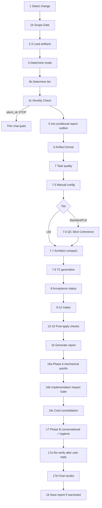

Universal quality gate for OpenSpec changes. Mode is determined automatically from tasks.md structure and completion status:
- **Pre-apply** (slice mode: `slice-pre`): artifact format, task quality, manual config checklist, **slice coherence (Quality Controller)** — **строго до** architect readiness review (шаг 7.7), **mandatory architect readiness review**, **TZ generation** (при пороге задач или явном запросе, шаг 7.8), Architect Gate, Design Review, TZ Review, project constraints
- **Post-apply** (slice mode: `slice-post`): implementation completeness per accepted slice, correctness, coherence; remaining slices получают pre-checks
- **Slice-scoped** (узкий охват одного среза): если в тексте запроса явно указан срез `S<N>` или есть свежий `reports/slice-acceptance-S<N>-*.md` / запись приёмки в `debug.md` и пользователь явно просит перепроверить этот срез после приёмки
- **Slice-transition**: только если текст запроса просит «проверить после принятого среза S<N>», «переход между срезами», или сообщение передано из `/opsx:apply` с пометкой `Mode: slice-transition` и `Accepted slice: S<N>`
- **Migrate**: только предложить `/opsx:migrate-slices <name>` (отдельная команда) при legacy с `<!-- phase-gate -->` или при запросе миграции в свободной форме; verify сам не режет задачи в срезы
- **Legacy**: tasks.md без `# Срез` — режим совместимости: mechanical checks работают, QC — в legacy-режиме (предупреждение `no-slices`)

**Output style:** полный артефакт — в файле `reports/verification-YYYY-MM-DD.md` **только если** шаги 16–18 зафиксировали содержание (найденные нестыдовки, авто-правки или разговорное обсуждение развилок). Если шаг **4c** дал раннее завершение `silent_ok` — **новый файл не создавать**. **Чат** всегда тонкий: шаблон `templates/chat-summary.md` (вариант «тихий» или «информативный»); развилки без кодов вида `<N>a` — параграфы по `templates/card-decision.md`. Бюджет — `.cursor/rules/chat-output-budget.mdc`. Перед отправкой — self-check `verify-user-communication.mdc`.

## Порядок шагов (обзор)



**Технические коды режима** (`slice-pre`, и т. п.) допустимы **только** в YAML frontmatter файла отчёта (см. `templates/report-header.md`) и строке «Источники» при необходимости — **не** в абзаце «Суть» и не как обязательная шапка в чате. Слова `Tier`, `Lite`, калька «когерентность» в сообщении пользователю не использовать (см. §3.1 `opsx-output-style.md`).

**Input:** необязательно имя ЗНИ в сообщении командой `/opsx:verify [<name>]`. Допустим один аргумент — имя каталога change. Намёки на режим («проверь S2 после приёмки») извлекаются из того же сообщения текста без специальных ключей. Если имя ЗНИ не ясно — `openspec list --json` и выбор пользователем.

**Steps**

1. **Select the change**

   If a name is provided, use it. Otherwise:
   - Infer from conversation context if the user mentioned a change
   - Auto-select if only one active change exists
   - If multiple active changes: run `openspec list --json`, show changes that have tasks artifact, include schema, mark incomplete as "(In Progress)", and use **AskUserQuestion tool** to let user select

   Always announce: "Using change: <name>" and how to override (e.g., `/opsx:verify <other>`).

1b. **Scope Gate — новое требование vs verify (read-only gate)**

   Если в сообщении пользователя **помимо** выбора change и команды `/opsx:verify` есть:
   - новое функциональное требование (формулировки вроде «нужно предусмотреть», «добавить», «учесть сценарий», «не забудь», «доработай постановку»);
   - явный запрос расширить scope change (новые задачи, требования, сценарии в свободной форме).

   **СТОП** до разрешения. Использовать **AskUserQuestion**:

   - Текст: «В запросе обнаружено новое требование: „<краткая формулировка>“. Verify — **quality gate** для существующих артефактов, он не редактирует их. Выберите вариант:»
   - **Вариант A (extend):** перейти к `/opsx:extend <name>` — команда покажет бриф, обновит артефакты, затем вернёт в verify.
   - **Вариант B (as-is):** Verify текущего scope как есть; новое требование оставить на будущее (`/opsx:extend <name>`, `/opsx:explore`, `/opsx:ff`).
   - **Вариант C (TODO в отчёте):** Verify текущего scope as-is; новое требование зафиксировать как TODO в отчёте verify (Executive Summary), без правки артефактов.
   - **Вариант C (расширить перед verify):** завершить verify без прогона; рекомендовать `/opsx:extend <name>` для контролируемого расширения, затем вернуться к `/opsx:verify`.

   **Поведение по выбору:**
   - **A:** Продолжить verify без правок; в конце отчёта — «Не включено в scope: <требование>. Рекомендация: `/opsx:extend`, `/opsx:explore` или `/opsx:ff`.»
   - **B:** Продолжить verify без правок; в Executive Summary — «TODO (не верифицировано в этом прогоне): <требование>.»
   - **C:** Завершить verify **до** выполнения проверок: вывести одну строку-предложение `/opsx:extend <name>` и остановиться. Не создавать отчёт verify для этого прогона.

   **Ранее существовавший «Вариант 1: внести правки → продолжить verify» удалён.** Verify не модифицирует артефакты; любое расширение scope — через отдельные команды (`/opsx:extend`, `/opsx:continue`, `/opsx:explore`).

   Если **только** `/opsx:verify` / `/opsx:verify <change>` без дополнительного текста требований — шаг 1b **пропустить**.

2. **Check status to understand the schema**
   ```bash
   openspec status --change "<name>" --json
   ```
   Parse the JSON to understand:
   - `schemaName`: The workflow being used (e.g., "spec-driven")
   - Which artifacts exist for this change

3. **Get the change directory and load artifacts**

   ```bash
   openspec instructions apply --change "<name>" --json
   ```

   This returns the change directory and context files. Read all available artifacts from `contextFiles`.
   Also read `openspec/project.md` for project-level constraints.

4. **Determine verification mode**

   **Контекст пользователя (без флагов):** до структурного анализа прочитать свободный текст запроса рядом с `/opsx:verify`:
   - Фразы вида «мигрируй в срезы», «нужна миграция задач» → зафиксировать намерение **migrate** → в конце сообщения порекомендовать `/opsx:migrate-slices <name>` (шаг 7.M); основной прогон verify не отменять автоматически.
   - Явное «срез S2», «после приёмки S3», «только S1» или «проверь один срез» → **slice-scoped** для указанного `S<N>` при условии совпадения с заголовком `# Срез S<N>` в `tasks.md`; иначе уточняющий вопрос пользователю.
   - «После правок в Slices / нарезке / графе срезов», «обновили мы план срезов» — при намерении не сужать до одного среза оставить режим по таблице ниже; шаг 7.6/7.7 всё равно зависят от **4c**.
   - Специальные строки CLI (`--slice`, `--verbose`, и т. п.) **игнорировать** как устаревшие; не требовать их от пользователя.

   **Структурный анализ tasks.md:**
   - Grep `tasks.md` на `^# Срез S\d+` — если найдено хотя бы одно вхождение → ЗНИ в **slice mode**. Иначе → **legacy mode**.
   - Grep `tasks.md` на `<!-- phase-gate -->` — если найдено в legacy mode → emit SUGGESTION `deprecated-phase-gate` и предложить `/opsx:migrate-slices <name>` (см. 7.M).
   - Count lines matching `- [ ]` (incomplete checkboxes)
   - Count lines matching `- [x]` (complete checkboxes)
   - Count lines matching `S<N>.T<M>` acceptance tests (total / `[x]` — принятые срезы / `[ ]` — ожидающие приёмки).

   **Mode decision (slice mode):**

   | `[x]` total | `[ ]` total | Принятых S<N>.T<M> | Mode |
   |---|---|---|---|
   | 0 | >0 | 0 | **slice-pre** (ЗНИ ещё не стартовала) |
   | >0 | >0 | 0 | **slice-pre** (идёт реализация первого среза, ни один не принят) |
   | >0 | >0 | ≥ 1, есть `[ ]` | **slice-post** (часть срезов принята, остальные ожидают) |
   | >0 | 0 | все S<N>.T<M> = `[x]` | **slice-post (final)** |

   **Mode decision (legacy mode):**

   | `[x]` count | `[ ]` count | Mode |
   |---|---|---|
   | 0 | >0 | **pre-apply (legacy)** |
   | >0 | >0 | **mixed (legacy)** |
   | >0 | 0 | **post-apply (legacy)** |

   **Slice-transition mode (explicit only):**

   Slice-transition activates **only** in these cases:
   1. Пользователь в свободном тексте запросил переход между срезами / проверку после принятого `S<N>` (например «проверь актуальность S2 после приёмки S1»).
   2. Сообщение передано из `/opsx:apply` на slice-gate с пометками `Mode: slice-transition` и `Accepted slice: S<N>`.

   **Auto-detect отключён:** без явного текста из п.1 или п.2 использовать `slice-post`, а не `slice-transition`.

   Сообщить режим **только в YAML** файла отчёта или в секции процесса внутри файла; в консультативный чат **не дублировать** техническое объявление «Режим: …».

4b. **Determine verification tier (внутренний расчёт)**

   Подсчитать задачи по чекбоксам в `tasks.md` и число срезов; выставить технический tier: Lite (≤5 задач), Standard (6–15), Full (≥16 задач или slice-transition). Поле `tier:` в YAML отчёта; **не** выводить в чат имена объёма.

   **Вызываемость тяжёлых подшагов:** шаги **7.6** (QC) и **7.7** (архитектор) выполняются **только если** шаг **4c** установил флаг `run_heavy_review = true` (см. ниже). В Lite-tier при `run_heavy_review = true`: 7.6 пропускается, архитектор выполняется в compact (как уже описано ниже для Lite).

   ТЗ (шаг 7.8) генерируется только при соблюдении порога и `generate_tz` — без изменений логики порога.

4c. **Novelty Check и ранний выход**

   Цель: не расходовать субагентов и не плодить пустые отчёты, если с прошлой проверки **ничего существенного не изменилось**.

   1. В каталоге `openspec/changes/<name>/reports/` найти файл, имя совпадает с `verification-*.md`, с **наибольшей** датой в имени (или по mtime — при равенстве брать более новый). Если нет ни одного — установить `novelty_signal = full_run`; `run_heavy_review = true`; перейти к шагу 5.
   2. Прочитать верхнюю секцию YAML (frontmatter) последнего отчёта. Извлечь блок **`snapshot`** с полями:
      - `accepted_tasks`: список идентификаторов выполненных задач (формат строки задачи после чекбокса, например `S2.1`, `S1.T1`, без пробелов).
      - `artifacts_mtime`: словарь путь → ISO-метка времени модификации на момент прошлого прогона (строками; сравнение строковое с тем, что считывается заново через файловые метаданные ОС после загрузки артефакта — достаточно единого формата RFC3339 или «как сохранено»).
      - При отсутствии `snapshot` в старых отчётах — трактовать как `full_run` + `run_heavy_review = true`.
   3. Снять **текущее** состояние:
      - множество `accepted_tasks_now` из всех строк `tasks.md` с `- [x]` и маркерами `S<number>.`, `S<number>.T<number>`, или `F<number>` для follow-up;
      - текущие mtime ключевых файлов `proposal.md`, `design.md`, `tasks.md` и каждого `specs/**/*.md`.
   4. **Правило `silent_ok`:** множества `accepted_tasks` и `accepted_tasks_now` равны **и** для каждого ключа из union snapshot/current mtime файл не стал новее сохранённого значения (`>=` недопустимо для «изменился» — строго **равно** числу/строкой как записано в snapshot): → вывести **тихий ответ** строго по `templates/chat-summary.md` («Тихий вариант»), указать путь к последнему отчёту; **не вызывать** шаги 6–18; **остановиться**.
   5. **Правило `progress_only`:** множества `accepted_tasks` и `accepted_tasks_now` **не** равны, только расширение (добавились выполненные задачи или приёмки), при этом текущее mtime каждого ключевого артефакта **совпадает** с snapshot **или** в snapshot этого ключа не было и текст файлов не считался изменённым вручную — установить `run_heavy_review = false`. В этом прогоне **пропустить** шаги **7.6** и **7.7**. Остальные шаги выполняются (включая post-apply / code-truth по новым `[x]`).
   6. Иначе: `novelty_signal = full_delta`; `run_heavy_review = true`. Если в текущих правках затронуты только разделы `design.md`: `## Slices`, `## Behavior Contract`, `## Decisions`, `## Goals / Non-Goals` — уже достаточно для `run_heavy_review = true` (Architect нужен для смысловых решений).

   После выполнения 4c записать переменную `novelty_signal` во внутренний контекст прогона для шага 18 (snapshot обновить).

5. **Initialize report structure (условно)**

   План отчёта — **черновой**: фактическая структура файла формируется на шаге 16; **включать только непустые разделы**. Пустые блоки («маркеров не найдено», N/A для режима) не писать. Минимально обязательное:
   - YAML frontmatter по `templates/report-header.md` (`verify_mode`, `verdict`, блок `snapshot` после прогона шага 18).
   - `## Executive Summary` по `templates/executive-summary.md`.
   - Далее — по наличию результатов: Формат артефактов, Качество задач, Ручная конфигурация (7.5), QC (только если выполнялся 7.6), Архитектор (только если выполнялся 7.7), ТЗ, Gates, Post-apply, Авто-исправлено (16a), Conversational / hygiene (17), Развёрнутые пояснения (если есть CRITICAL/WARNING/SUGGESTION).

   Если шаг 18 решает **не создавать** файл (`report_warranted = false` — нет находок, Phase A пуста, нет открытых развилок после Promotion Test) — структура остаётся только в черновике; пользователю достаточно тихого сообщения (см. шаг 17).

---

## Pre-apply checks (modes: slice-pre, slice-post (для непринятых срезов), slice-scoped, legacy pre-apply / mixed)

6. **Artifact Format Check**

   **6A. Task checkboxes:**
   - Every task line must have `- [ ]` or `- [x]` prefix
   - Scan for lines matching pattern `^- \d+\.\d+\s` (bare task without checkbox)
   - If bare tasks found:
     - Add CRITICAL: "Задачи без чекбоксов: N строк. apply/estimate/archive не смогут отслеживать прогресс"
     - Set `autofix_checkboxes = true` for step 17

   **6B. Task numbering (режим-зависимая проверка):**
   - **Slice mode** (есть `# Срез S<N>` в tasks.md): задачи должны иметь префикс `S<N>.<M>` (и `S<N>.T<M>` для acceptance-тестов) внутри своего среза. Несоответствие (плоская `N.M` нумерация внутри среза, дубли, пропуски) → WARNING `slice-numbering-inconsistent`.
   - **Legacy mode** (нет `# Срез`): задачи должны иметь префикс `N.M` внутри `## N. Group` секций. Отсутствие/несогласованность → WARNING `legacy-numbering-inconsistent`.
   - **Смешанная нумерация** (одновременно `N.M` и `S<N>.<M>` без явного slice-контекста) → CRITICAL `mixed-numbering` с рекомендацией `/opsx:migrate-slices`.

   **6C. Group / Slice headers:**
   - Slice mode: заголовки формата `# Срез S<N>: <Название>` с метаданными (см. `vertical-slices.mdc`). Отсутствие метаданных → WARNING.
   - Legacy mode: секции формата `## N. Название`. Отсутствие группировки → SUGGESTION.

7. **Task Quality Check**

   For each task line (matching `- [ ] N.M` or bare `- N.M`):

   **7A. Classify task type:**
   - **Code task**: mentions `.bsl`, `процедур`, `функци`, `реализовать`, `добавить`, `изменить`, `перехват`, `аннотаци`
   - **Metadata task**: mentions `создать в расширении`, `регистр`, `обработк`, `справочник`, `форм` without `.bsl` path
   - **Test task**: mentions `тест`, `проверить`, `убедиться`, `регрессия`
   - **Investigation task**: mentions `обследова`, `найти`, `проверить путь`, `зафиксировать`

   *(Примечание: проверки на наличие путей, критериев приёмки и размытых формулировок делегированы Quality Controller в критерий Task Readability).*

   **7A.1 Design Contract Split (D-CONTRACT-SPLIT):**
   - Если `design.md` существует и change содержит UX-значимые, UI/form, интеграционные задачи, перехваты (`&Перед`, `&После`, `&Вместо`, `&ИзменениеИКонтроль`) или перенос поведения между расширениями:
     - Отсутствует `## Behavior Contract` → WARNING `design-contract-missing`: design смешивает наблюдаемое поведение с рецептом реализации.
     - Отсутствует `## Implementation Options` → SUGGESTION `implementation-options-missing`: не зафиксированы альтернативы и критерий выбора простейшего исполнимого варианта.
   - Если `design.md` содержит конкретные имена новых процедур/функций в `## Behavior Contract`, но эти имена не найдены в коде и не помечены как стабильный контракт / пример → WARNING `recipe-leaked-into-contract`.

   **7B. Atomicity check:**
   If a single task line (before sub-items) contains 3+ distinct verbs of action (`создать`, `реализовать`, `добавить`, `обернуть`, `проверить`, etc.): WARNING "task may not be atomic — consider splitting".

   **7C. Repo Consistency:**
   For tasks containing «создать» + object type (`регистр`, `обработк`, `справочник`, `документ`, `форм`):
   - Extract the object name from the task description
   - Glob the repository for a directory or file matching that name (e.g., `**/InformationRegisters/<Name>`, `**/DataProcessors/<Name>`, `**/Catalogs/<Name>`)
   - If object **already exists**: WARNING — "Задача N.M говорит «создать X», но X уже существует в репозитории (`path`). Уточнить: «доработать» / «наполнить содержимым»?"
   - If object **does not exist**: OK (consistent with «создать»)

   **7D. Executability & Ordering Check:**

   Mechanical pre-check for all tasks (enriches data for QC step 7.6).

   **7F.1 Functional dependency extraction (all tasks):**
   For each task line, extract implied preconditions:
   - Tasks with verbs `заполнить`, `запустить`, `отправить`, `открыть`, `убедиться` + object name → map to tasks implementing that object (within the same or earlier slice).
   - Tasks referencing procedures/functions from other modules (pattern `МодульИмя.МетодИмя`) → map to tasks that create/modify those procedures.
   - Tasks referencing data attributes → map to tasks that create the object.
   - Acceptance task `S<N>.T<M>` → implicitly depends on **all** other tasks of `S<N>` (slice-internal).
   - Any task: Grep for `Зависимости:` or `Зависимость:` → explicit deps.

   For each found dependency (после Actionability Gate при финализации отчёта):
   - Dep task `[ ]` AND current task `[ ]`:
     - Если зависимость **явно указана** в тексте задачи (`Зависимости:` / `Зависимость:` с ID M.K) → **INFO**: "задача N.M зависит от M.K ([ ]); порядок обеспечен объявленными зависимостями / apply"
     - Если зависимость **выявлена только эвристикой**, но **не** отражена в `Зависимости:` → **WARNING**: "задача N.M предположительно зависит от M.K — добавить явные **Зависимости:** в tasks.md"
   - Dep task `[ ]` AND current task needs it for execution — то же правило: явная ссылка в tasks → INFO; нет явной ссылки → WARNING
   - Dep task `[x]` but line > current task line → SUGGESTION: "задача N.M расположена до зависимости M.K в файле"

   **7F.2 Execution order text validation:**
   Grep tasks.md for `Порядок выполнения|Порядок реализации|Последовательность`. If found:
   - Extract task IDs (pattern `\d+\.\d+`)
   - Check each ID exists in tasks.md and its status
   - Flag contradictions with file order

   **7F.3 Slice acceptance task check:**
   For each `# Срез S<N>` header:
   - Find the `S<N>.T<M>` acceptance task (must exist — см. QC criterion 5).
   - Extract task IDs referenced in the slice's `**Зависимости:**` line.
   - Check that all referenced slice dependencies exist as slices in tasks.md; flag stale refs as WARNING.
   - Check presence of `<!-- slice-gate: ... -->` marker at end of slice; missing → WARNING `missing-slice-gate-marker`.

   **7F.3b Acceptance-to-scenario mapping (Acceptance Scope Tightness, правило среза 6):**

   Mechanical pre-check, дополняет QC criterion 5b. Источник истины — `.cursor/rules/vertical-slices.mdc` (правило среза 6) и `.cursor/agents/openspec-quality-controller.md` (критерий 5b).

   Для каждого `# Срез S<N>`:
   1. Извлечь множество Scenarios из строки `**Связь со spec:**` (regex `«([^»]+)»` или имена после `Scenario:` / `сценарий:`). Normalise lowercase + trim.
   2. Найти все acceptance-задачи `- [ ] S<N>.T<M>` / `- [x] S<N>.T<M>` этого среза.
   3. Для каждого `T<M>` извлечь хвостовую ссылку `(Scenario: «…»)` или `(Scenarios: «…», «…»)`.
   4. Сравнить множества и зафиксировать mismatches:
      - `T<M>` без ссылки или с именем Scenario, отсутствующим во всех `**Связь со spec:**` документа → кандидат на `acceptance-without-scenario`.
      - `T<M>` ссылается на Scenario, заявленный в `**Связь со spec:**` **другого** среза (не текущего) → кандидат на `acceptance-scenario-duplication`.
      - `|T<M>| > 2 × |Scenarios(S<N>)|` → кандидат на `acceptance-overload`.
      - Scenario из `**Связь со spec:**` не упомянут ни одним `T<M>` данного среза → кандидат на `scenario-uncovered-by-acceptance`.
   5. Передать список mismatches в QC (шаг 7.6) отдельной строкой: «Acceptance mapping issues (verify 7F.3b): <перечень или "нет">». QC валидирует по критерию 5b и финализирует severity.
   6. Также передать этот же список в architect readiness review (шаг 7.7) как контекст — архитектор может рекомендовать перенос non-scenario проверок в `design.md#Assumptions` / обычные задачи / `## Follow-up` согласно таблице правила среза 6.

   В Lite tier (`no-slices` или единственный container slice) шаг 7F.3b **пропускается** — инвариант предполагает slice-структуру с заполненным `**Связь со spec:**`.

   **7F.4 Fix-slice sanity (defect placement invariant):**
   Для каждого заголовка `# Срез S<N>`, если выполняется **любое** из условий:
   - в заголовке или в первых строках метаданных среза есть подстроки **«Исправление»**, **«Fix»**, **«fix-срез»** (регистронезависимо); **или**
   - в блоке метаданных есть строка `**Зависимости:**` со ссылкой на другой срез `S<K>` (не «нет»),
   то трактовать срез как **кандидат в fix-срез** и выполнить:
   1. Извлечь из метаданных или заголовка идентификатор зависимого среза `S<K>` (если несколько — проверить каждый).
   2. Найти в `tasks.md` строку приёмки `S<K>.T<M>` этого `S<K>`.
   3. Если `S<K>.T<M>` = **`[ ]`** (срез S<K> **не** принят) **и** в метаданных кандидата **нет** строки `**Причина fix-среза:** cross-slice` → **CRITICAL** `fix-slice-on-unaccepted`:
      «Fix-срез `S<N>` указывает на непринятый `S<K>`. По `.cursor/rules/vertical-slices.mdc` (**ИНВАРИАНТ: Defect placement**) задачи фикса должны быть **внутри** `S<K>` перед `S<K>.T<M>`. Миграция: перенести задачи `S<N>.*` в `S<K>`, удалить заголовок `# Срез S<N>`, синхронизировать `design.md` `## Slices` и при необходимости `debug.md`.»
   4. Если `S<K>.T<M>` = **`[x]`** — допустимый fix-срез (frozen-slice); при отсутствии явной причины cross-slice в метаданных — **INFO** (не блокер).
   5. Если кандидат помечен `**Причина fix-среза:** cross-slice`, но зависимости не покрывают ≥2 среза по сценарию — **WARNING** `fix-slice-cross-slice-unsubstantiated`.

   **7F.5 Deprecated phase-gate detection:**
   Grep tasks.md for `<!-- phase-gate` markers. If found → SUGGESTION `deprecated-phase-gate`: "устаревший маркер фазового gate — рекомендуется `/opsx:migrate-slices <name>`".

   Pass all 7D results to Quality Controller (step 7.6) and Architect (step 7.7): "Executability issues (verify 7D): <list or 'замечаний нет'>".

   **Reference format** (for recommendations):
   ```
   - [ ] N.M Краткое описание
     - **Файл:** `path/to/file.bsl`
     - **Что делать:** конкретное действие
     - **Критерии приёмки:**
       * Проверка 1
       * Проверка 2
     - **Зависимости:** N.M, N.M
   ```

7.5. **Manual Configuration Sufficiency Check (structured checklist)**

   **7.5A. Find markers.** Grep tasks.md (case-insensitive) for manual configuration markers:
   `создать в расширении`, `добавить форму`, `создать обработку`, `создать регистр`, `добавить реквизит`, `создать справочник`, `создать документ`, `форму записи`, `форму списка`

   If no markers found → record "маркеров ручной конфигурации не найдено", skip to 7.6.

   **7.5B. Classify each marker** by object type: **Metadata**, **Form**, or **Attributes**.

   **7.5C. For each marker — build and fill a checklist table.** For every row, put a **literal quote** from design.md or `ОТСУТСТВУЕТ`. A business-scenario description (e.g. "выбор ящика → авторизация → запись") is NOT a form description — mark as `ОТСУТСТВУЕТ` for Form rows.

   Checklist by object type:

   **Metadata** (РС, справочник, документ, обработка):

   | Элемент | Требование | Цитата из design / статус |
   |---|---|---|
   | Имя объекта | Точное имя объекта метаданных | *цитата* или `ОТСУТСТВУЕТ` |
   | Реквизиты / измерения / ресурсы | Имя, тип, длина — для каждого | *цитата* или `ОТСУТСТВУЕТ` |
   | Подсистема | В какую подсистему включить | *цитата* или `ОТСУТСТВУЕТ` |

   **Form** (форма обработки, форма документа, форма РС):

   | Элемент | Требование | Цитата из design / статус |
   |---|---|---|
   | Группы | Перечень групп (шаги / страницы / закладки) с назначением | *цитата* или `ОТСУТСТВУЕТ` |
   | Поля | Перечень полей: имя, тип/привязка данных, видимость/доступность | *цитата* или `ОТСУТСТВУЕТ` |
   | Таблицы | Имя таблицы, перечень колонок | *цитата* или `ОТСУТСТВУЕТ` |
   | Команды / кнопки | Перечень с описанием действий | *цитата* или `ОТСУТСТВУЕТ` |
   | UX-сценарий | Пошаговое: что пользователь видит и делает на каждом шаге | *цитата* или `ОТСУТСТВУЕТ` |

   **Attributes** (реквизиты объекта):

   | Элемент | Требование | Цитата из design / статус |
   |---|---|---|
   | Имя | Точное имя реквизита | *цитата* или `ОТСУТСТВУЕТ` |
   | Тип | Тип данных, длина | *цитата* или `ОТСУТСТВУЕТ` |
   | Назначение | Зачем нужен | *цитата* или `ОТСУТСТВУЕТ` |

   **7.5D. Assessment (strict rule):**
   - Any cell = `ОТСУТСТВУЕТ` → **CRITICAL**: "Задача N.M требует ручной конфигурации (`маркер`), но в design.md нет: [перечень ОТСУТСТВУЕТ-элементов]. Рекомендация: дополнить design секцией с полным описанием."
   - All cells filled with quotes → OK

   **IMPORTANT:** The filled checklist table is the **proof** of this check. It MUST be included verbatim in the verification report (section "Полнота ручной конфигурации"). Writing "OK — design describes scenario" without the table is a verification failure.

7.6. **Quality Controller — Slice Coherence Review (Standard/Full tiers ONLY)**

   **Предусловие:** шаг **4c** установил `run_heavy_review = true` **и** tier не Lite. Если `run_heavy_review = false` — шаг **полностью пропустить**; в отчёте при необходимости одна строка `- [INFO] Контроль срезов пропущен: прогресс без изменения постановки (novelty progress_only).`

   **This step executes in Standard and Full tiers (skipped in Lite).** Domain-agnostic assessment of slice coherence, scenario coverage, slice independence, dependencies and rework risk. Complements the architect's realizability review (step 7.7).

   **Prepare repository state** (before calling the controller):
   For each task in tasks.md that mentions a file path or object name:
   - Glob the repository for the object/file
   - Record: exists / does not exist / exists but empty (e.g., Form.xml with only `<form>` root)
   - Record: if code file (`.bsl`) is non-empty while prerequisite tasks are still `- [ ]`

   **What to pass to the Quality Controller:**
   - Full text of: tasks.md (including `# Срез` headers и метаданные), design.md (including `## Slices`), proposal.md
   - Paths to specs/ files
   - Checklist table from step 7.5 (if manual config markers were found), or "маркеров ручной конфигурации не найдено"
   - List of issues from steps 7A-7C (if any), or "механических замечаний нет"
   - Executability issues from step 7D (if any), or "замечаний выполнимости нет"
   - Acceptance mapping issues (verify 7D.3b): per-slice list of mismatches between `**Связь со spec:**` Scenarios и `T<M>` Scenario-ссылок, or "замечаний по приёмке нет". QC использует это как вход критерия 5b.
   - Repository state (object/file existence and emptiness list)

   **Quality Controller prompt** (use agent file `.cursor/agents/openspec-quality-controller.md`; шаблон Task-вызова: `1c-agent-patterns/quality-controller.md`):

   > Before calling Task — **Task Pre-call Checklist** from `.cursor/rules/tool-name-guard.mdc` (subagent_type from the allowed list; do **not** pass `model`).

   Call via `Task(subagent_type="openspec-quality-controller")`. Agent file: `.cursor/agents/openspec-quality-controller.md` (`model: inherit`, readonly). The controller evaluates 6 criteria (slice mode) + 1 compat criterion:
   1. **Scenario Coverage** — каждый `#### Scenario:` из spec покрыт ≥1 срезом.
   2. **Slice Independence** — срезы принимаемы без следующих; нет циклов; нет forward-deps; нет coupling.
   3. **Slice Completeness** — в каждом срезе есть все слои, нужные для его приёмочного сценария.
   4. **Slice Dependency Graph** — объявленные зависимости корректны, implicit deps не пропущены, циклов нет.
   5. **Slice Gate Integrity** — в каждом срезе есть `S<N>.T<M>` и маркер `<!-- slice-gate -->`, тест конкретен.
   6. **Rework Risk** — срезы в работе до принятия зависимостей, overlap по Scenarios, hypothesis-deps.
   + **Legacy fallback**: если `# Срез` не найдены — эмитируется `no-slices` и остальные критерии пропускаются.

   **After receiving the controller's report:**
   1. Save full report to `reports/quality-control-YYYY-MM-DD.md`.
   2. Include verdict and slice summary + scenario coverage matrix in the verification report (section "Согласованность срезов (Quality Controller)").
   3. Map each alert to verification issues (затем **Actionability Gate**):
      - `scenario-uncovered` → WARNING (actionable: добавить срез или задачу в существующий).
      - `dependency-cycle`, `coupling-violation`, `missing-slice-test`, `backward-reference`, `fix-slice-on-unaccepted` → CRITICAL.
      - `stale-slice-dep`, `forward-slice-dep`, `undeclared-slice-dep`, `slice-incomplete`, `rework-risk-on-unaccepted`, `fix-slice-cross-slice-unsubstantiated` → WARNING.
      - `missing-slice-gate-marker`, `vague-slice-test`, `unaccepted-slice-in-progress`, `slice-overlap`, `hypothesis-dep` → SUGGESTION.
      - `no-slices`, `deprecated-phase-gate` → SUGGESTION с рекомендацией запустить `/opsx:migrate-slices <name>`.

7.6b. **Slice Transition Review (slice-transition mode ONLY)**

   **This step executes ONLY in slice-transition mode.** Assesses whether remaining slices are still valid after acceptance of the previous slice.

   **Context to collect:**
   - Accepted slice (current): tasks of the just-accepted `S<N>` (все `[x]`, включая `S<N>.T<M>` приёмочный тест)
   - Upcoming slices (next): tasks of `S<N+1>+`, all `[ ]`
   - debug.md (если есть), особенно секция `## Slice Gate Decisions` — что было принято / отклонено / переопределено в предыдущих gate
   - Recent architecture/exploration/review reports в `reports/`

   **Quality Controller call (enhanced):**
   Pass the same inputs as step 7.6, plus:
   - "Mode: slice-transition"
   - "Accepted slice: S<N> (all tasks `[x]`, S<N>.T<M> = `[x]`)"
   - "Upcoming slices: S<N+1>, S<N+2>, ..."
   - "Implementation notes (debug.md / Slice Gate Decisions): <content or 'none'>"
   QC проверяет все 6 критериев + специально оценивает Slice Independence и Rework Risk на оставшихся срезах в свете того, что выяснилось в S<N>.

   **Порядок:** enhanced QC (абзац выше) MUST завершиться **до** вызова Architect slice-transition (аналогично запрету параллели 7.6/7.7).

   **Architect call (slice-transition focus):**
   Use template from `1c-agent-patterns/architect.md`, section "Architect — slice transition review (verify шаг 7.6b)".
   Pass: tasks.md, design.md (включая `## Slices`), proposal.md, путь к debug.md, paths to recent reports, ID принятого среза.
   Focus: остаются ли upcoming срезы валидными в свете результатов S<N>? Есть ли design drift? Нужно ли пере-разрезать (rebrick) S<N+1>+?
   Save architect result to `reports/slice-transition-YYYY-MM-DD.md`.

7.7. **Task Readiness Architect Review (условно)**

   **Предусловие:** шаг **4c** установил `run_heavy_review = true`. Если `false` — шаг **полностью пропустить** (кроме Lite: см. ниже); в отчёте при необходимости INFO-строка с причиной.

   **Порядок выполнения (Standard/Full):** если 7.6 выполнялся — он MUST завершиться **до** 7.7. Архитектор получает результат QC как вход; **параллельный** запуск QC и Architect **запрещён**. Если 7.6 пропущен — в промпт передать «Quality Controller пропущен (novelty / Lite)».

   **В Lite tier:** при `run_heavy_review = true` шаг 7.6 не вызывается, архитектор выполняет compact-ревью. При `run_heavy_review = false` — архитектор также **не** вызывается.

   **This step is not remediation** — часть конвейера при полном охвате. При раннем `silent_ok` (4c) сюда не попадают.

   **Scope coherence — закрытие через extend audit.** Перед формированием промпта архитектора проверить наличие `reports/architecture-extend-coherence-*.md` в каталоге change. Если файл есть и его время модификации **новее** времени модификации `proposal.md` и `design.md` (или совпадает с последней правкой scope — оркестратор сравнивает mtime файлов), **и** в отчёте в секции `### Verdict` указано `coherent` или `drift-warning` (не `scope-violation`) — в промпт архитектора добавить явную инструкцию: «Раздел целостности scope закрыт audit-отчётом `<path>` из `/opsx:extend`; не дублировать полный scope-drift анализ — сфокусироваться на реализуемости по критериям task-readiness (п. 1, 1b, 2–7 ниже)». Если coherence-отчёта нет, coherence устарел (артефакты новее отчёта) или Verdict = `scope-violation` — полный объём task-readiness без сокращения scope-части.

   **What to pass to the architect:**
   - Full text of: tasks.md, design.md, proposal.md
   - Paths to specs/ files (architect reads them)
   - Checklist table from step 7.5 (if manual config markers were found), or "маркеров ручной конфигурации не найдено"
   - List of issues from steps 7A-7C (if any), or "механических замечаний нет"
   - Executability issues from step 7D (if any), or "замечаний выполнимости нет"
   - Acceptance mapping issues (verify 7D.3b): per-slice list of mismatches `T<M>` ↔ Scenario, or "замечаний по приёмке нет". Архитектор может рекомендовать перенос non-scenario проверок в `design.md#Assumptions` / обычные задачи / `## Follow-up` (таблица правила среза 6, `.cursor/rules/vertical-slices.mdc`).
   - Quality Controller result: slice summary, scenario coverage matrix, alerts from step 7.6 (or "Quality Controller пропущен (Lite tier)")

   **Architect prompt (Standard/Full tier)** (use template from `1c-agent-patterns/architect.md`, section "Architect — task readiness review (verify шаг 7.7)"):

   ```
   ## Задача

   Оцени готовность ЗНИ `<name>` к реализации. Не детали кода — целостная оценка:
   можно ли по этим артефактам реализовать ЗНИ силами агентов (writer, form-generator)
   и пользователя (ручная конфигурация) без возвратов на уточнение?

   ## Артефакты

   - proposal: <путь>
   - design: <путь>
   - tasks: <путь>
   - specs: <путь>
   - Чеклист ручной конфигурации (verify, шаг 7.5): <чеклист-таблица или «маркеров не найдено»>
   - Замечания механических проверок (verify, шаги 7A-7C): <список или «замечаний нет»>
   - Согласованность срезов (verify, шаг 7.6 Quality Controller): <slice summary + scenario coverage matrix + alerts или «замечаний нет»>

   ## Критерии оценки

   Для каждого критерия — вердикт (OK / GAP) и краткое обоснование:

   1. **Реализуемость кодовых задач.** Может ли writer (1С-разработчик по промпту)
      реализовать каждую задачу из tasks.md, имея только design.md + spec + текст задачи?
      Есть ли задачи, где непонятно ЧТО делать или ГДЕ делать?

      **1.b Читаемость формулировки (Task Readability).** Каждая задача (кроме
      приёмочных `S<N>.T<M>`) SHALL содержать файл/модуль/процедуру и бизнес-результат
      в первых 12 значимых словах заголовка. **GAP `task-opaque-title`**, если задача
      начинается с широкого глагола + голого идентификатора решения без контекста:
      - «Реализовать инвариант D<N>», «Обеспечить D<N>», «Закрыть OQ<N>»;
      - «Выполнить /opsx:verify» / «Запустить validate» без указания цели;
      - «Обновить» / «Проверить» / «Учесть сценарий» без объекта.

      При GAP предоставь готовый **сниппет-переформулировку** по шаблону:
      `<Глагол> <файл/процедура>: <что меняем> <бизнес-результат> [(D<N>/OQ<N>/ADR)]`.
      Используй детали из тела задачи + design.md. Исключения: `S<N>.T<M>`
      (приёмочные тесты — другой жанр), Follow-up задачи с явной ссылкой на ЗНИ,
      prerequisites с явным указанием артефакта (`Выгрузить BusinessProcesses/X.xml`).

      Каноническое правило: `.cursor/rules/task-readability.mdc`.

   2. **Реализуемость форм и метаданных.** Может ли form-generator построить каждую форму
      по описанию в design? Может ли пользователь создать каждый объект метаданных
      без дополнительных вопросов? Для форм: описаны ли элементы (группы, поля,
      таблицы, команды), UX-сценарий?

   3. **Разрешённость решений.** Все ли «или»/«/» разрешены? Есть ли неопределённые
      контракты возврата? Есть ли задачи с двумя путями реализации без выбора?

   4. **Полнота покрытия.** Покрывают ли задачи все requirements из spec?
      Есть ли пробелы — требование описано, но задачи на него нет?

   5. **Согласованность.** Нет ли противоречий между tasks и design? Между tasks и spec?
      Совпадают ли «создать/доработать» в tasks с реальным состоянием репозитория?

   6. **Качество фиксов (Fix Quality).** Для каждой задачи в tasks.md, помеченной как исправление
      (RCA, корневая причина, «исправление»): (a) Фикс направлен на корневую причину, а не на симптом?
      (b) Есть ли более «здоровые» альтернативы (меньше условий, одна точка изменения, без обходных флагов)?
      (c) Нет ли признаков заплатки (обход, дублирование, assumption-driven)? (d) Учтён ли UX-сценарий
      (что видит/делает пользователь после фикса)?

      **(e) Precedent Awareness.** Если задача — исправление или затрагивает те же объекты,
      что архивный change на ту же capability: есть ли в `design.md` секция `## Blast Radius`
      или отчёт `reports/architecture-precedent-coherence-*.md`, объясняющая осознанную отмену
      предыдущего контракта в терминах пользователя 1С?

   7. **Архитектурная эстетика (Design Smells).** Нет ли в проекте
      архитектурных запахов?
      - Over-engineering: переусложнение (например, новый регистр там, где хватит реквизита).
      - Invasiveness: высокая инвазивность (необоснованный &ИзменениеИКонтроль вместо &После или подписок).
      - Reinventing the wheel: игнорирование существующих механизмов или БСП.

   8. **Согласованность с прецедентами (Precedent Coherence).** Не противоречит ли текущий
      `design.md` целям и контрактам архивных changes по той же capability и пересекающимся
      файлам (см. также замечания verify 9b)? Если расширение без отмены — классифицировать как
      `extends`, не как `revokes`.

   ## Формат ответа

   ### Вердикт

   ГОТОВО / ГОТОВО С ЗАМЕЧАНИЯМИ / НЕ ГОТОВО

   ### Оценка по критериям

   | # | Критерий | Вердикт | Обоснование |
   |---|----------|---------|-------------|
   | 1 | Реализуемость кодовых задач | OK/GAP | ... |
   | 2 | Реализуемость форм и метаданных | OK/GAP | ... |
   | 3 | Разрешённость решений | OK/GAP | ... |
   | 4 | Полнота покрытия | OK/GAP | ... |
   | 5 | Согласованность | OK/GAP | ... |
   | 6 | Качество фиксов (Fix Quality) | OK/GAP | ... |
   | 7 | Архитектурная эстетика (Design Smells) | OK/SUBOPTIMAL | ... |
   | 8 | Согласованность с прецедентами (Precedent Coherence) | OK/GAP | ... |

   ### Пробелы (только при GAP или SUBOPTIMAL)

   Для каждого GAP:
   - Задача / артефакт
   - Что отсутствует / неоднозначно
   - Рекомендация (что дополнить, где)
   - Если GAP связан с отсутствием пути, подсистемы или пропущенной задачей из design, предоставь готовый сниппет (строку) для автоматической вставки в артефакт, чтобы оркестратор мог применить его в Phase A.

   НЕ НУЖНО: ревью архитектуры, оценка рисков, альтернативные подходы.
   Только: можно ли реализовать as-is.
   ```

   **Architect prompt (Lite tier compact review)**:
   Используй сокращённый промпт (см. критерии ниже; ориентир — срезы/legacy + реализуемость + precedent при наличии):

   ```
   ## Задача

   Оцени готовность малого ЗНИ `<name>` к реализации.

   ## Артефакты
   - proposal: <путь>
   - design: <путь>
   - tasks: <путь>
   - specs: <путь>
   - Замечания механических проверок (verify, шаги 7A-7C): <список или «замечаний нет»>
   - Проблемы выполнимости (verify, шаг 7F): <список или «замечаний нет»>
   - Precedent issues (verify 9b): <список или «нет / N/A»>

   ## Критерии оценки

   1. **Согласованность срезов.** Если в tasks.md есть `# Срез` — оцени корректность срезов (независимость, полнота, наличие S<N>.T<M>). Если срезов нет — отметь legacy-режим и проверь, нет ли false start (код есть, задача [ ]) или rework risk.
   2. **Реализуемость кодовых задач.** Понятно ли ЧТО и ГДЕ делать? **Task Readability (1.b):** задачи (кроме `T<M>`) содержат файл/процедуру и бизнес-результат в первых 12 словах? Формулировки вида «Реализовать инвариант D<N>», «Обеспечить D<N>» → GAP `task-opaque-title`, предоставь сниппет-переформулировку. См. `.cursor/rules/task-readability.mdc`.
   3. **Разрешённость решений.** Все ли альтернативы разрешены?
   4. **Согласованность.** Нет ли противоречий между tasks, design и spec?
   5. **Качество фиксов.** Направлен ли фикс на корневую причину?
   6. **Архитектурная эстетика (Design Smells).** Нет ли переусложнения, высокой инвазивности или изобретения велосипеда?
   7. **Precedent / Blast Radius.** Если verify уже сообщил «Precedent issues (verify 9b)» или есть конфликт с архивным change — есть ли в `design.md` секция `## Blast Radius` с бизнес-эффектом для пользователя?

   ## Формат ответа

   ### Вердикт
   ГОТОВО / ГОТОВО С ЗАМЕЧАНИЯМИ / НЕ ГОТОВО

   ### Срезы и риски (или Задачи и риски — в legacy)
   | Срез / Задача | Сценарий | Риски |
   |---|---|---|
   | ... | ... | ... |

   ### Оценка по критериям
   | # | Критерий | Вердикт | Обоснование |
   |---|----------|---------|-------------|
   | 1 | Согласованность срезов / legacy | OK/GAP | ... |
   | 2 | Реализуемость кодовых задач | OK/GAP | ... |
   | 3 | Разрешённость решений | OK/GAP | ... |
   | 4 | Согласованность | OK/GAP | ... |
   | 5 | Качество фиксов | OK/GAP | ... |
   | 6 | Архитектурная эстетика | OK/SUBOPTIMAL | ... |
   | 7 | Precedent / Blast Radius | OK/GAP | ... |

   ### Пробелы (только при GAP или SUBOPTIMAL)
   (Задача, что отсутствует, рекомендация. Если пропущен путь/подсистема/задача из design — дай сниппет для авто-вставки).
   ```

   **After receiving the architect's report:**
   1. Save full report to `reports/task-readiness-review-YYYY-MM-DD.md`.
   2. Include verdict and criteria table in the verification report (section "Готовность к реализации (архитектор)").
   3. Map each GAP or SUBOPTIMAL to verification issues:
      - GAP ("Не реализуемо без уточнения") → CRITICAL
      - GAP ("Можно реализовать, но неоднозначно") → WARNING
      - SUBOPTIMAL (Архитектурный запах / Design Smell) → WARNING

7.M. **Migrate to slices — делегирование на `/opsx:migrate-slices`**

   Миграция legacy/фазового `tasks.md` в вертикальные срезы **вынесена в отдельную команду** и скилл `.cursor/skills/openspec-migrate-slices/SKILL.md`. Verify не перестраивает артефакты самостоятельно.

   **Поведение verify:**
   - Если пользователь явно попросил миграцию в свободной форме (см. шаг 4) → сообщить порекомендовать **`/opsx:migrate-slices <name>`** в разделе conversational / «Что обсудим» и **продолжить** текущие проверки (не обнулять прогон без отдельной команды пользователя).
   - Если найдены `<!-- phase-gate -->` маркеры в legacy ЗНИ → SUGGESTION `deprecated-phase-gate` с рекомендацией `/opsx:migrate-slices <name>`. Verify продолжается в legacy-режиме.
   - Если QC выдал alert `no-slices` → в карточке решения (шаг 17) опция «Мигрировать в срезы» — команда предлагается к ручному запуску; verify не вызывает её автоматически.

   В отчёте verify секция `### Миграция в срезы`: status = `recommended` / `skipped` / `n/a`, со ссылкой на команду. Исполнение и отчёт `migrate-to-slices-YYYY-MM-DD.md` — ответственность скилла `openspec-migrate-slices`.

7.8. **TZ Generation (conditional in slice-pre / slice-post / legacy pre-apply / mixed)**

   Generates a human-readable technical specification (ТЗ) document from change artifacts. The TZ serves as a functional requirements artifact oriented at stakeholder review. Gaps in TZ generation reveal gaps in source artifacts.

   **Порог обязательности (для режимов slice-pre, slice-post (для непринятых срезов) и legacy pre-apply / mixed):**
   - Прочитать поле `generate_tz` из блока `## Metadata` в `proposal.md`.
   - Если `generate_tz: no` → ТЗ **не генерировать**. В отчёте verify: «ТЗ: не генерировалось (отключено пользователем).» Перейти к шагу 9.
   - Если `generate_tz: deferred` → ТЗ **не генерировать**. В отчёте verify: «ТЗ: отложено. При необходимости: `/opsx:doc-tz <name>`.» Перейти к шагу 9.
   - Если `generate_tz: auto` (или поле отсутствует):
     - Подсчитать в `tasks.md` строки с `- [ ]` и `- [x]` (каждая строка задачи с чекбоксом = одна задача).
     - **6 и более** задач → ТЗ **генерируется обязательно** (выполнить **Logic** ниже). Порог согласован с `sdd-workflow.mdc` (секция Scale thresholds).
     - **1–5** задач → ТЗ **не генерировать**, если пользователь **явно** не запросил ТЗ в том же сообщении (фразы вроде «с ТЗ», «сгенерируй ТЗ», «нужно ТЗ», «включи ТЗ») и не указывал отдельно `/opsx:doc-tz`. В отчёте verify: «ТЗ: не генерировалось (5 или менее задач по чекбоксам). При необходимости: `/opsx:doc-tz <name>`.» Перейти к шагу 9 без записи `ТЗ.md`.
     - **0** задач с чекбоксами (например, только bare-строки) → трактовать как «меньше порога»; ТЗ не генерировать, если нет явного запроса.
   - **Явный запрос ТЗ** в сообщении пользователя → генерировать **независимо** от количества задач и значения `generate_tz`.

   **Перезапись `ТЗ.md`:** если файл уже существует — **перезаписывать** только при фактической генерации в этом прогоне (порог выполнен или явный запрос). Если генерация **пропущена** по порогу — **сохранить** существующий `ТЗ.md` без изменений; в отчёте: «ТЗ: существующий файл сохранён (ниже порога обязательности / генерация не требовалась).»

   **Режимы slice-post (final), slice-transition, legacy post-apply:** при финальном post-apply (все задачи `[x]` или все срезы приняты) шаг 7.8 обычно не применяется; если verify запускается в **slice-post / mixed** с непринятыми срезами / задачами, использовать тот же подсчёт задач по всему `tasks.md`. В режиме `slice-scoped` ТЗ не генерируется.

   **Logic:** (выполнять только если генерация ТЗ обязательна или запрошена по правилам выше)
   1. Вызвать алгоритм из `.cursor/skills/openspec-docs/SKILL.md` (генерация ТЗ через `openspec-doc-writer` и опциональное ревью).
   2. Сохранить результат в `openspec/changes/<name>/ТЗ.md`.
   3. Добавить замечания по генерации (если были) в отчёт verify.

   **Report section:** `### ТЗ (функциональные требования)` — status (generated / generated with warnings / skipped threshold / skipped — user N/A), file path, list of gaps if any.

   Если шаг 7.8 пропущен по порогу — в отчёте указать статус **skipped (threshold)** и не выполнять пункты 4–5b Logic для ТЗ.

9. **Architect & Design Gate Check**

   Check triggers from `architect-gate.mdc`:

   **Objective markers:**
   - Glob `reports/trace-analysis-*.md` in change dir — trace-analyst was used?
   - Glob `reports/exploration-*.md` in change dir — explorer was used?
   - Grep design.md for bug fix markers: `исправь`, `ошибка`, `баг`, `fix`, `crash`, `не работает`, `падает`
   - Grep design.md for: `базовая процедура`, `платформа`, `повторная запись`, `перехват`, `после вызова базы`, `компенсация`
   - Grep design.md for new metadata: `новый регистр`, `создать регистр`, `новый документ`, `создать документ`, `новый справочник`, `создать справочник`, `новый БП`, `создать БП`

   **Semantic triggers:**
   - Grep design.md for: `&Вместо`, `&После`, `&Перед`, `&ИзменениеИКонтроль`
   - Check if design mentions alternative approaches without resolution
   - Grep design.md for missing `## Existing Mechanisms` when integration is described
   - Grep design.md for missing `## Design Rationale` when integration is described
   - Grep tasks.md for conditional branching: `При отрицательн`, `Если в п.`, `Альтернатив`, `workaround`, `Иначе →`, `Иначе —`
   - Grep design.md for `вероятно`, `возможно`, `скорее всего`, `гипотеза` without `## Hypotheses` section
   - Grep tasks.md for manual config markers + check design.md for exhaustive instructions (names, types, form elements). If tasks require manual config but design lacks full description → trigger fires

   **Structural triggers:**
   - Count distinct files in tasks.md — >1 file affected?
   - Estimate total lines of change — >10 lines?

   **Gate closure check:**
   - Glob `reports/architecture-*.md` in change dir and `temp/reports/`
   - Check for `.gate-override.yaml` in change dir.

   **Debug fix check (дополнительно):**
   - Grep tasks.md на маркеры: `(исправление)`, `RCA:`, `корневая причина`, `reports/trace-analysis`, `reports/exploration`
   - Если маркеры найдены И нет ни одного `reports/architecture-*.md` в change dir (в т.ч. `architecture-debug-*.md`):
     → CRITICAL: "В tasks.md есть задачи-исправления из explore/extend без архитектурного ревью. Рекомендация: запустить onec-code-architect или /opsx:explore (профиль bug) с Architect Gate."

   **Result:**
   - No triggers fired AND (no debug fix markers OR architecture-*.md exists) → `OK`
   - Triggers fired AND `architecture-*.md` exists (но не `selfreview`) → `OK (отчёт: <filename>)`
   - Triggers fired AND `architecture-ff-selfreview-*.md` exists → `OK (отчёт: <filename>)` + SUGGESTION: "Архитектурное ревью выполнено оркестратором (self-review fallback). Рекомендуется повторить ревью настоящим агентом до apply."
   - Triggers fired AND NO `architecture-*.md` AND `.gate-override.yaml` exists → 
     - Прочитать `timestamp` из `.gate-override.yaml`. Если прошло ≤ 7 дней → WARNING: "Architect Gate отложен пользователем (причина: <reason>). Отсрочка истекает через <N> дней."
     - Если прошло > 7 дней → CRITICAL: "Отсрочка Architect Gate истекла. Архитектурный анализ не найден. Рекомендация: запустить `/opsx:verify` с опцией устранения или onec-code-architect вручную."
   - Triggers fired AND NO `architecture-*.md` AND NO `.gate-override.yaml` → CRITICAL: "Сработали маркеры Architect Gate: [list]. Архитектурный анализ не найден. Рекомендация: запустить `/opsx:verify` с опцией устранения или onec-code-architect вручную."
   - Debug fix markers in tasks AND NO `architecture-*.md` → CRITICAL (см. Debug fix check выше)

9b. **Cross-Archive Regression Audit (Precedent Regression)**

   Выполняется в режимах **slice-pre**, **slice-post** (для непринятых срезов / незакрытых задач), **slice-scoped**, **legacy pre-apply**, **legacy mixed**. В **slice-post (final)** и **legacy post-apply** — **пропустить** (инвариант: постфактум приёмка не пересматривает регрессию дельты против архива; при необходимости — отдельный прогон с непринятыми задачами). Источник правил: `.cursor/rules/precedent-regression-gate.mdc`.

   **Цель:** обнаружить молчаливую отмену контракта, ранее зафиксированного в архивном change (`ADDED` в дельте spec) или в invariant KB / Load-Bearing ADR, без секции `## Blast Radius` в текущем `design.md`.

   **Алгоритм:**

   1. Если в change нет каталога `specs/` — перейти к подпункту **4 (file overlap)** и KB; если и там пусто — секция отчёта `### Регрессия предыдущих контрактов`: status `N/A (нет specs)`.
   2. Из всех `openspec/changes/<name>/specs/**/*.md` извлечь требования и сценарии с маркерами **MODIFIED** или **REMOVED** (дельта OpenSpec). Собрать множество имён capability из путей каталогов.
   3. Для каждого `<capability>` выполнить `Glob openspec/changes/archive/**/specs/<capability>/spec.md`. **Бюджет:** не более **10** уникальных каталогов архивных changes за прогон; при превышении — добавить INFO `precedent-audit-budget-exceeded` с рекомендацией повторить с узким scope или задокументировать ручной аудит.
   4. Для каждого найденного архивного `spec.md` извлечь требования/сценарии со статусом **ADDED**. Сопоставить с текущими MODIFIED/REMOVED по нормализованному заголовку **и** по тексту `WHEN`/`THEN` (если заголовок совпадает посимвольно, но тело сценария идентично — классифицировать как `precedent-restructure`, severity **INFO**, не CRITICAL).
   5. Для каждой пары «архивный ADDED ↔ текущий MODIFIED/REMOVED», где есть семантическое ослабление или отмена требования: прочитать `openspec/changes/archive/<dated-name>/proposal.md` и `design.md` (секции `## Goals`, `## Behavior Contract`, `## Decisions`) — зафиксировать «контракт прецедента» одной цитатой.
   6. Проверить наличие в текущем `design.md` секции `## Blast Radius` с заполненными строками: контракт / источник (путь archive или ADR-NNNN) / бизнес-эффект / альтернативы / обоснование. Поле бизнес-эффекта не должно состоять только из имён процедур и реквизитов.
   7. **Пересечение по файлам:** из `tasks.md` и `design.md` извлечь пути `src/...`; `Grep` по `openspec/changes/archive/**/proposal.md` на эти подстроки; взять до **3** наиболее релевантных архивных change для сравнения целей с текущим `design.md` при отсутствии specs-дельты.
   8. **Invariant KB:** Read `openspec/knowledge/_index.yaml`; для фактов с `invariant: true` (или из front-matter `.md`), чьи `anchor-paths` пересекаются с путями из текущего change, проверить: не противоречит ли текущий `design.md` тексту факта в `openspec/knowledge/**/KB-*.md`. При противоречии — CRITICAL `invariant-drift`.
   9. **Load-Bearing ADR:** Glob `openspec/adrs/ADR-*.md`; если в текущем change/design/spec упоминается **Supersedes** или замена ADR, у которого в файле **Load-bearing: yes** или статус **Load-Bearing**, проверить наличие `## Blast Radius` в новом ADR или в `design.md`. Иначе — CRITICAL `load-bearing-adr-bypass`.

   **Матрица severity:**

   | Условие | Severity | Код |
   |---------|----------|-----|
   | Пара ADDED→MODIFIED/REMOVED с отменой семантики, нет `## Blast Radius` | CRITICAL | `precedent-regression` |
   | Есть `## Blast Radius`, но не заполнено поле бизнес-эффекта или источник | WARNING | `blast-radius-incomplete` |
   | Прецедент явно закрыт Blast Radius или архивный контракт сохранён | INFO | `precedent-documented` |
   | Только переименование / структура spec без изменения WHEN/THEN | INFO | `precedent-restructure` |
   | Противоречие invariant KB | CRITICAL | `invariant-drift` |
   | Supersedes Load-Bearing ADR без Blast Radius в новом ADR/design | CRITICAL | `load-bearing-adr-bypass` |

   **Классификация для Issue Classification (шаг после Promotion Test):** замечания `precedent-regression`, `blast-radius-incomplete`, `invariant-drift`, `load-bearing-adr-bypass` → класс **`decision`** по умолчанию (не понижать в `artifact-hygiene`).

   **Секция отчёта verify:**

   ```
   ### Регрессия предыдущих контрактов (verify 9b)

   | Текущая дельта | Архивный источник | Контракт (цитата) | Blast Radius в design.md | Severity |
   |---|---|---|---|---|
   | ... | ... | ... | OK / ОТСУТСТВУЕТ / неполно | CRITICAL / WARNING / INFO |
   ```

   Передать краткий список находок в промпт архитектора шага **7.7** при повторном запуске (если выполняется remediation): строка «Precedent issues (verify 9b): …».

11. **TZ Review Check**

    - Если шаг 7.8 был **пропущен по порогу** — статус `N/A` (ТЗ не генерировалось); не добавлять SUGGESTION «ТЗ создано, но ревью не проводилось».
    - Glob `ТЗ.md` in change dir
    - If not found → `N/A` (skip)
    - If found:
      - **Lexicon check**: read Grep patterns from `.cursor/docs/tz-lexicon-dictionary.md`. Grep `ТЗ.md` for matches.
        - Matches found → WARNING: "В ТЗ обнаружены нарушения лексики: [words]. Рекомендация: `/opsx:doc-tz <name>` или ручная правка."
        - No matches → OK (lexicon)
      - Glob `reports/tz-review-*.md` in change dir
      - If no review report → SUGGESTION: "ТЗ создано, но ревью не проводилось"
      - If review report exists:
        - Grep report for severity markers: `критично`, `обязательно`, `CRITICAL`, `HIGH`
        - If high-severity remarks found → WARNING: "ТЗ содержит неустранённые замечания уровня [severity]"
        - If no high-severity → `OK`

12. **Project Constraints Check**

    Read `openspec/project.md` and extract allowed directories (e.g., `cfe/` only, not `cf/`).
    For each task in tasks.md that mentions a file path:
    - Check if path is within allowed directories
    - If path is outside → CRITICAL: "Задача N.M ссылается на `<path>`, что за пределами разрешённых директорий (project.md). Переписать задачу на расширение (cfe/)?"

---

## Post-apply checks (modes: slice-post, slice-post (final), slice-transition, legacy post-apply / mixed)

В **slice-post** post-apply checks применяются **только к принятым срезам** (где `S<N>.T<M>` = `[x]`); для непринятых срезов — pre-apply checks.
В legacy **mixed** mode, post-apply checks apply **only to tasks marked `[x]`**.

13. **Verify Completeness**

    **Task Completion**:
    - Parse checkboxes: `- [ ]` (incomplete) vs `- [x]` (complete)
    - Count complete vs total tasks
    - **Slice mode** — оценивать по срезам:
      - Для каждого среза S<N> определить статус: «принят» (`S<N>.T<M>` = `[x]` и все задачи среза `[x]`), «в работе» (часть задач `[x]`), «ожидает» (все `[ ]`).
      - Принятый срез — нормально, входит в Slice Acceptance Status.
      - Срез «в работе» с **пропущенными** задачами при `S<N>.T<M>` = `[x]` → **CRITICAL** `slice-accepted-with-unfinished-tasks`.
      - Срез «ожидает» — **INFO** «срез S<N> ожидает реализации».
    - **Legacy mode**:
      - **post-apply (все задачи должны быть закрыты):** Add CRITICAL issue for each incomplete task; Recommendation: "Complete task: <description>" or "Mark as done if already implemented"
      - **mixed mode:** незавершённые `[ ]` задачи — **не** CRITICAL/WARNING. Добавить **INFO**: «N задач с `[ ]` ожидают реализации через `/opsx:apply`» (Actionability Gate: следствие режима, не дефект верификации)

    **Spec Coverage**:
    - If delta specs exist in `openspec/changes/<name>/specs/`:
      - Extract all requirements (marked with "### Requirement:") и сценарии (`#### Scenario:`).
      - **Slice mode:** для каждого принятого среза — все Scenarios, заявленные в его метаданных (`**Связь со spec:**`), должны быть реализованы в коде. Не найдены → CRITICAL «scenario not implemented in accepted slice». Для непринятых срезов — INFO.
      - **Legacy mixed:** проверять покрытие **только** для требований, которые **целиком** относятся к уже выполненным `[x]` задачам (по смысловому сопоставлению tasks ↔ spec). Требования, относящиеся к невыполненным задачам — **INFO**: «M requirements ожидают реализации (связанные задачи `[ ]`)»
      - **Legacy post-apply:** для каждого requirement — поиск в коде; если не реализовано → CRITICAL: "Requirement not found: <requirement name>"
      - Для **mixed**, если requirement относится к `[x]`-задачам, но реализация не найдена → **WARNING** (расхождение: задача отмечена выполненной, код/spec не сходятся)

    **Symbol Existence Check (Code-Truth Gate):**
    - Выполнить механический gate из `.cursor/rules/code-truth-gate.mdc` для `design.md`, `tasks.md`, `debug.md`, `specs/**`.
    - Извлечь технические якоря (`pav_*`, `lvv_*`, имена процедур/функций в backticks, `&Перед/&После/&Вместо/&ИзменениеИКонтроль(...)`, стабильные имена элементов формы) и проверить `Grep`/`rg` по путям из `openspec/project.md` и явно затронутым файлам.
    - Для каждого ненайденного символа добавить `phantom-symbol`:
      - **pre-apply**: WARNING (код ещё может не существовать, но рецепт слишком конкретен);
      - **mixed/post-apply**: WARNING для незавершённых задач; CRITICAL для `[x]` задач или принятых срезов.
    - Рекомендация: если код верен, выполнить `/opsx:extend <name> --code-sync`; если артефакт верен, вернуть задачу в apply/rework.

14. **Verify Correctness**

    **Requirement Implementation Mapping**:
    - **Slice mode:** выполнять **только** для требований, относящихся к **принятым** срезам (S<N>.T<M> = `[x]`). Для непринятых — INFO/skip.
    - **Legacy mixed:** выполнять **только** для требований/частей spec, отнесённых к задачам с `[x]`. Для остальных — не выдавать WARNING «не реализовано»; при необходимости одна **INFO**-строка в духе «сценарии невыполненных задач не проверялись в коде»
    - For each requirement (slice-mode: связанный с принятым срезом; legacy post-apply: все; legacy mixed: связанные с `[x]`):
      - Search codebase for implementation evidence
      - If found, note file paths and line ranges
      - Assess if implementation matches requirement intent
      - If divergence detected:
        - Add WARNING: "Implementation may diverge from spec: <details>"
        - Recommendation: "Review <file>:<lines> against requirement X"

    **Scenario Coverage**:
    - **Slice mode:** для каждого принятого среза — все Scenarios из его метаданных должны быть покрыты тестами/кодом. Не покрыты → WARNING.
    - **Legacy mixed:** для сценариев, относящихся к **невыполненным** задачам — **INFO** или пропуск, не WARNING
    - For each scenario (slice-mode: из принятого среза; legacy post-apply: все; legacy mixed: только `[x]`-контекста):
      - Check if conditions are handled in code
      - Check if tests exist covering the scenario
      - If scenario appears uncovered **и** задачи для него уже `[x]` (или срез принят):
        - Add WARNING: "Scenario not covered: <scenario name>"
        - Recommendation: "Add test or implementation for scenario: <description>"

15. **Verify Coherence**

    **Architect Simplicity Check (pre-apply / task readiness context)**:
    - If change has `reports/architecture-*.md` relevant to current scope, inspect the freshest relevant report.
    - If it does not contain `## Simplicity Check` and the change is not Light/Mechanical Mode: add WARNING `architect-simplicity-missing` — "Архитектурный отчёт не зафиксировал сравнение простейших исполнимых альтернатив".
    - If `## Simplicity Check` exists but `Complexity budget` is absent for a UI/form/integration design: add SUGGESTION `complexity-budget-missing`.

    **Design Adherence**:
    - If design.md exists in contextFiles:
      - Extract key decisions (look for sections like "Decision:", "Approach:", "Architecture:")
      - Verify implementation follows those decisions
      - If contradiction detected:
        - Add WARNING: "Design decision not followed: <decision>"
        - Recommendation: "Update implementation or revise design.md to match reality"
    - If no design.md: Skip design adherence check, note "No design.md to verify against"

    **Code Pattern Consistency**:
    - Review new code for consistency with project patterns
    - Check file naming, directory structure, coding style
    - If significant deviations found:
      - Add SUGGESTION: "Code pattern deviation: <details>"
      - Recommendation: "Consider following project pattern: <example>"

---

## Promotion Test (перед записью замечаний в отчёт)

Применяется **ко всем** замечаниям перед финальным присвоением severity в отчёте verify (после сбора результатов шагов 6–15, 7.6, 7.7 и т.д.).

**Цель:** пользователь, запускающий verify, видит **WARNING/CRITICAL** только там, где нужно **решение или правка артефакта до apply**; всё остальное — контекст, а не «угроза». Бремя доказательства лежит на повышении severity.

**Уровень INFO** (контекст):

- Не входит в счётчики вердикта (N CRITICAL / M WARNING / K SUGGESTION).
- **Не** триггерит предложение remediation (шаг 17).
- В сообщении пользователю — **компактно** (bullet-строки в секции «К сведению»), **без** карточек решений.
- Формат в отчёте: `- [INFO] <краткий текст>`.

**Promotion Test (для каждого замечания):**

Замечание начинает как INFO. Повышается, если:

| Шаг | Вопрос | Если да → |
|-----|--------|-----------|
| P1 | Пользователь ОБЯЗАН править артефакт (иначе apply выдаст ошибку / код не соберётся / результат заведомо неверен)? | CRITICAL |
| P2 | Пользователь ДОЛЖЕН принять решение из 2+ несовместимых вариантов (**разный код / поведение / приёмка** при apply)? | WARNING |
| P3a | Правка артефакта **нужна** (артефакты несогласованы), но допустимая формулировка одна или сводится к выбору «применять / отложить»; **код / поведение / приёмка не меняются**? | WARNING (далее в Implementation Impact Gate 16b → класс `artifact-hygiene`) |
| P3b | Исправление улучшает качество, но apply возможен и без него; артефакты согласованы? | SUGGESTION |
| - | Ни один тест не пройден | Остаётся INFO |

**Различие P2 / P3a (важно):**

- P2 → класс `decision`: разные варианты приведут к **разному** BSL/XML, поведению или приёмочным шагам. Карточка решения в Phase B (шаг 17, Блок 2).
- P3a → класс `artifact-hygiene`: правка только текста артефактов (Связь со spec, заголовки сценариев, мелкая согласованность); apply при любом ответе пользователя породит **тот же** код. Однострочный hygiene-блок в Phase B (шаг 17, Блок 2b).

**Implementation Impact Gate (шаг 16b)** — финальный фильтр между WARNING-`decision` и WARNING-`artifact-hygiene`. Если P2 поднял замечание в WARNING-`decision`, но Gate показал, что ни один вариант не меняет код / поведение / приёмку — оркестратор переклассифицирует в `artifact-hygiene`.

**Склеивание:** если после Promotion Test не осталось CRITICAL и WARNING, но есть SUGGESTION — статус «Готов. Предложения к сведению». Если нет ни CRITICAL, ни WARNING, ни SUGGESTION — «Все проверки пройдены. Готов к apply/archive». При наличии INFO добавить в Executive Summary строку: `**Контекст (INFO):** K пометок — см. секцию в отчёте` (только если K > 0).

## Determinism Test (между Promotion Test и Issue Classification)

Для каждого замечания, классифицированного по таблице ниже как `decision` или `artifact-hygiene`:

1. Существует ли **ровно одно** допустимое исправление?
   (добавить зависимость X→Y; изменить «создать» на «доработать»;
   зафиксировать N/A-критерий для опциональной задачи)
   *Оговорка: Исправление считается детерминированным (mechanical), если оно однозначно выводится из утвержденного `design.md`, `project.md` или структуры репозитория, даже если требует генерации новых строк в `tasks.md` (например, перенос утвержденного решения из design в tasks, добавление очевидного пути к файлу или подсистемы).*
2. Это исправление **не меняет** scope, подход или архитектуру?
3. Исправление **обратимо** (git revert)?

Если все три = да → переклассифицировать в **mechanical**.
Зафиксировать в отчёте: «Reclassified: <исходный тип> → mechanical
(determinism test: единственное допустимое исправление)».

**Соотношение с Implementation Impact Gate (шаг 16b):**

- Determinism Test → может опустить `decision` / `artifact-hygiene` в `mechanical` (одна допустимая правка, можно применить без вопроса).
- Implementation Impact Gate (16b) → может опустить `decision` в `artifact-hygiene` (правка нужна, выбор за пользователем, но код не меняется).
- Двух фильтров достаточно: после них замечание в одном из четырёх классов (mechanical / artifact-hygiene / decision / INFO/SUGGESTION).

## Issue Classification (mechanical / artifact-hygiene / decision / INFO)

После Promotion Test каждое замечание с severity CRITICAL / WARNING / SUGGESTION дополнительно классифицируется для маршрутизации:

- **`mechanical`** → Phase A (авто-исправление, шаг 16a). Без вопроса пользователю.
- **`artifact-hygiene`** → Phase B Блок 2b (однострочный hygiene-пункт, шаг 17). Пользователь выбирает «применить / отложить» среди допустимых формулировок; код / поведение / приёмка не меняются.
- **`decision`** → Phase B Блок 2 (карточка с блоком «Влияние», шаг 17). Разные варианты дают разный код / поведение / приёмку.
- **`INFO`** → секция «К сведению» (шаг 17 Блок 3). Не блокирует, не требует решения.

**Критерии:**

- **mechanical** — исправление детерминировано (однозначная замена), не меняет scope / логику / порядок задач, обратимо через git.
- **artifact-hygiene** — правка артефакта **нужна** (несогласованность видна), но допустимая формулировка одна или сводится к выбору «применять / отложить»; **ни один** вариант не меняет код / поведение / приёмку (проверяется Implementation Impact Gate, шаг 16b).
- **decision** — правка меняет scope, порядок, подход, архитектуру или контракт; **хотя бы один** вариант приводит к разному коду / поведению / приёмке (хотя бы один «да» по Implementation Impact Gate).
- **INFO** — контекст; не входит в счётчики, не требует remediation.

**Маппинг по умолчанию** (финальный класс — после Implementation Impact Gate шаг 16b):

| Тип замечания | Класс по умолчанию | Обоснование |
|---|---|---|
| Missing checkboxes (6A) | mechanical | Формат, не меняет содержание |
| TZ lexicon violation (7.8 / 11) | mechanical | Замена слов по реестру, детерминировано |
| Repo Consistency wording (7E) | mechanical | `создать X` → `доработать X` при доказанном существовании объекта |
| Missing slice-gate marker (QC `missing-slice-gate-marker`) | mechanical | Добавить `<!-- slice-gate: ... -->` в конец среза по тексту S<N>.T<M> |
| Stale slice dependency (QC `stale-slice-dep`) | mechanical | Удалить ссылку на несуществующий срез из `**Зависимости:**` |
| `deprecated-phase-gate` (legacy) | mechanical | Удалить устаревший маркер; миграция — отдельный режим (`/opsx:migrate-slices`) |
| Опциональная задача без явного N/A-критерия | mechanical | Добавить «N/A если не воспроизведено» — детерминировано |
| Неверная метка типа задачи (BSL code вместо manual) | mechanical | Замена слова, не меняет содержание |
| Missing paths/subsystems | mechanical | Если путь или подсистему можно однозначно найти в `project.md` или репозитории |
| Design/Tasks textual divergence (устаревший текст) | mechanical | Синхронизация описания с утверждёнными `tasks.md` |
| Design/Tasks divergence (пропущенная задача из утверждённого design) | mechanical | Если решение уже утверждено в `design.md` (D4, D5), авто-добавление задачи — синхронизация |
| `scenario-uncovered` (QC 7.6) | **artifact-hygiene** | Согласовать `**Связь со spec:**` / scope дельта-spec; код среза от ответа не меняется (повышается в `decision`, если расширение scope добавляет новые задачи реализации) |
| `acceptance-scenario-duplication` (QC 5b) | **artifact-hygiene** | Решение «где живёт `T<M>`»; код приёмки тот же |
| `acceptance-without-scenario` (QC 5b) | **artifact-hygiene** | Перенос non-scenario проверки между разделами артефактов; код от ответа не меняется (повышается в `decision`, если требует добавить Scenario в spec и связанную задачу) |
| `scenario-uncovered-by-acceptance` (QC 5b) | **artifact-hygiene** | Согласовать `**Связь со spec:**` (повышается в `decision`, если добавление `S<N>.T<M>` меняет план приёмки) |
| `recipe-leaked-into-contract` (verify 7A.1) | **artifact-hygiene** | Очистить `## Behavior Contract` от конкретных имён процедур; код S<N>.<M> от формулировки не меняется |
| `slice-numbering-inconsistent` (verify 6B) | **artifact-hygiene** | Привести нумерацию к одному виду; код задач не меняется |
| `acceptance-overload` (QC 5b / verify 7D.3b) | INFO | Признак раздутой приёмки; показать «К сведению», не блокировать |
| Task quality — ambiguity, missing details (QC Task Readability) | decision | Architect может переформулировать scope, разные формулировки → разный код |
| Architect & Design Gate not closed (9) | decision | Архитектурный отчёт может изменить подход (разный код) |
| `dependency-cycle`, `coupling-violation`, `forward-slice-dep`, `backward-reference` (QC) | decision | Требует перестройки графа срезов; меняет порядок реализации |
| `slice-incomplete`, `missing-slice-test` (QC) | decision | Нужно либо добавить недостающие задачи (новый код), либо переразрезать |
| `task-opaque-acceptance` (QC 7) | decision | Переформулировка `T<M>` меняет приёмочные шаги |
| `rework-risk-on-unaccepted`, `unaccepted-slice-in-progress` (QC) | decision | Решение «ждать или начинать сейчас» → разный риск переделки кода |
| Executability issues (7D) | decision | Зависимости влияют на порядок реализации (apply поведёт себя иначе) |
| `no-slices` (QC) | **artifact-hygiene** | Миграция в срезы (либо принять legacy); код задач от ответа не меняется напрямую |
| Project constraints violation (12) | decision | Меняет целевые каталоги (cf vs cfe — разный код / выгрузка) |
| Suboptimal architecture / Design Smell (7.7) | decision | Требует перепроектирования (изменение подхода — разный код) |
| TZ generation gaps (7.8) | INFO | ТЗ — документ для заказчика, не для apply |
| TZ review remarks (11) | INFO | Не влияет на реализацию |
| Incomplete tasks / срезы «ожидает» (slice-post / legacy 13) | INFO | Рекомендация `/opsx:apply` |
| Spec/design divergence (post-apply, 15) | INFO | Информационное расхождение |
    | `hypothesis-dep` — гипотеза в Open Questions, fallback безопасен (design) | INFO | Информация о риске, не требует правки артефакта |
    | `precedent-regression` (verify 9b) | **decision** | Отмена архивного контракта без объяснения в бизнес-терминах; всегда карточка с блоком Blast Radius |
    | `blast-radius-incomplete` (verify 9b) | **decision** | Частично заполненная секция `## Blast Radius`; не понижать в hygiene |
    | `invariant-drift` (verify 9b / KB) | **decision** | Противоречие invariant KB текущему design/spec |
    | `load-bearing-adr-bypass` (verify 9b / ADR) | **decision** | Замена Load-Bearing ADR без Blast Radius |

**Повышение в decision (через Implementation Impact Gate 16b):** `artifact-hygiene` повышается в `decision`, если хотя бы один вариант **меняет** код / поведение / приёмку. Пример: `scenario-uncovered` → `artifact-hygiene` по умолчанию (правка только текста `**Связь со spec:**`), но → `decision`, если расширение scope подразумевает новые задачи реализации `S<N>.<M>` или новый `S<N>.T<M>`.

**Класс INFO:** замечания, не влияющие на ход реализации. Показываются пользователю в секции «К сведению» (одна строка каждое) — не как карточка решения и не как авто-исправление.

---

## Report and remediation

**Output style:** **файл** — только непустые разделы (см. шаг 5); полный технический текст, таблицы, ссылки на вложенные отчёты. **Чат** — строго `templates/chat-summary.md` («тихий» или «информативный»); без кодов выбора, без блока «Как ответить». Перед чатом — §7 стайл-гайда и `chat-output-budget.mdc`.

16. **Generate Verification Report**

    **Executive Summary (`## Executive Summary`):** только шаблон `templates/executive-summary.md` — абзац **«Суть»** и опционально **«Что в работе»**. Строк вида «Этап / Объём / Готовность / Подробности» в тексте секции **не** использовать (вердикты и режим — в YAML frontmatter, см. шаг 18).

    YAML frontmatter — `templates/report-header.md` (`verify_mode`, `verdict`, `tier`, при необходимости счётчики; блок `snapshot` добавляется на шаге 18).

    Примеры и запрет жаргона для «Сути» — в `verify-user-communication.mdc` и §3.1 `opsx-output-style.md`.

    **Slice Acceptance:** в тексте использовать формулировки вида «Срез S<N>: «<название из H1 tasks.md>»», не голый `S1`.

    **Условный scorecard** (после Executive Summary, только где есть содержание):
    ```
    ## Verification Report: <change-name>
    ### Режим: slice-pre | slice-post | slice-post (final) | slice-transition | slice-scoped (S<N>) | migrate-to-slices | legacy pre-apply | legacy mixed | legacy post-apply

    ### Формат артефактов
    | Проверка | Статус |
    |---|---|
    | Чекбоксы `- [ ]` | OK / CRITICAL (N строк без чекбоксов) |
    | Нумерация N.M | OK / WARNING |
    | Заголовки групп | OK / SUGGESTION |

    ### Качество задач
    - [CRITICAL] N.M — нет пути к файлу, нет критериев приёмки
      Источник: `task-no-path-or-acceptance` (verify 7A)
    - [WARNING] N.M — формулировка размытая: «или аналог», непонятно что именно делать
      Источник: `task-ambiguous` (QC Task Readability)
    - [WARNING] N.M — «создать X», но X уже существует в репозитории — переформулировать как «доработать X»
      Источник: `repo-consistency` (verify 7C); файл: `<path>`
    - [SUGGESTION] N.M — рекомендуется разбить на 2 задачи (3+ глаголов действия)
      Источник: `task-not-atomic` (verify 7B)
    ...

    Правила оформления пунктов (обязательно):
    - В тексте пункта — формулировка проблемы для человека, без процитированных кодов категорий и без HTML-фрагментов разметки (`<!-- … -->`, `**Связь со spec:**` в кавычках и т. п.).
    - В конце пункта — отдельная строка `Источник: <код-алерта>` (опционально с указанием файла/среза); туда же выносятся имена агентов и шагов verify.
    - Имена движка (`Architect Gate`, `Precedent Regression Gate`, `Code-Truth Gate`, `Implementation Impact Gate`, `Promotion Test`) в текст пункта не попадают — только в строку «Источник:» или в файл отчёта (см. §3.1 `opsx-output-style.md`).

    ### Выполнимость и порядок задач (verify 7F, QC 5d)
    - [INFO] порядок N.M → M.K обеспечен явными зависимостями в tasks (не требует действий пользователя до apply)
      Источник: `executability-explicit-deps` (verify 7F.1)
    - [WARNING] N.M — нет явной зависимости от M.K при выявленной потребности — дополнить tasks.md
      Источник: `executability-implicit-dep` (verify 7F.1)
    - [SUGGESTION] N.M — расположен до зависимости M.K в файле (при этом граф может быть OK)
      Источник: `executability-line-order` (verify 7F.1)
    - [WARNING] задача N.M `[ ]` помечена как зависимость приёмочного теста среза S<N>: «<название>», но самого теста S<N>.T<M> нет
      Источник: `slice-gate-missing-test` (verify 7F.3)
    - [SUGGESTION] «Порядок выполнения» не покрывает задачи: [list]
      Источник: `execution-order-incomplete` (verify 7F.2)
    (или: замечаний выполнимости нет)

    ### Контекст (INFO)

    Список всех INFO-строк (после Actionability Gate). Без развёрнутых абзацев и без процитированных кодов категорий в тексте пункта. Каждая строка — одна формулировка в бизнес-языке для пользователя 1С. Если нужен технический контекст (имя агента / гейта / код алерта / путь файла) — отдельной строкой `Подробности — в reports/<file>.md` (или встроенной ссылкой на отчёт).

    Запрещено в тексте пункта: имена агентов (`onec-code-architect`, `openspec-quality-controller` и пр.), имена гейтов (`Architect Gate`, `Precedent Regression Gate`, `Code-Truth Gate`, `Implementation Impact Gate`), коды алертов (`precedent-regression`, `slice-gate-misplaced`, `phantom-symbol` и пр.), идентификаторы движка (`capability`, `spec-delta`). Их место — в файле отчёта `reports/verification-*.md` или в строке «Подробности».

    Примеры (бизнес-формулировка):

    - [INFO] 6 задач ещё не реализованы — для продолжения: `/opsx:apply <name>`.
    - [INFO] Цепочка зависимостей задач 4.1 → 4.2 объявлена в плане; реализация уважает порядок.
    - [INFO] Сравнили эту ЗНИ с ранее зафиксированными требованиями той же области — конфликтов нет. Подробности — в `reports/verification-<mode>-YYYY-MM-DD.md`.
    - [INFO] Архитектурное ревью готовности задач закрыто. Подробности — в `reports/task-readiness-review-YYYY-MM-DD.md`.
    - [INFO] Основной архитектурный агент в этой сессии был недоступен; ревью выполнено резервным агентом, итог — «готово с пометкой о низкой уверенности». Подробности — в `reports/task-readiness-review-YYYY-MM-DD.md`.

    ### Полнота ручной конфигурации (чеклист шага 7.5)

    **Задача N.M** — маркер: `создать обработку` — тип: Metadata

    | Элемент | Требование | Цитата из design / статус |
    |---|---|---|
    | Имя объекта | Точное имя | «КД_НастройкаМЧД» |
    | Реквизиты | Имя, тип, длина | ... или `ОТСУТСТВУЕТ` |
    | Подсистема | Куда включить | ... или `ОТСУТСТВУЕТ` |

    **Задача N.M** — маркер: `добавить форму` — тип: Form

    | Элемент | Требование | Цитата из design / статус |
    |---|---|---|
    | Группы | Перечень групп | ... или `ОТСУТСТВУЕТ` |
    | Поля | Имя, тип, привязка | ... или `ОТСУТСТВУЕТ` |
    | Таблицы | Имя, колонки | ... или `ОТСУТСТВУЕТ` |
    | Команды/кнопки | Перечень, действия | ... или `ОТСУТСТВУЕТ` |
    | UX-сценарий | Шаги пользователя | ... или `ОТСУТСТВУЕТ` |

    (повторить для каждого маркера; при отсутствии маркеров — «маркеров не найдено»)

    ### Согласованность срезов (Quality Controller)

    **Вердикт:** OK / WARNING / CRITICAL
    **Полный отчёт:** reports/quality-control-YYYY-MM-DD.md

    **Slice Summary**

    | Срез | Сценарий | Статус | Зависит от | Acceptance test |
    |------|----------|--------|-----------|-----------------|
    | S1   | <scenario> | принят | -         | S1.T9 [x] |
    | S2   | <scenario> | в работе | S1      | S2.T6 [ ] |
    | S3   | <scenario> | ожидает | S2       | S3.T7 [ ] |

    **Scenario Coverage Matrix**

    | Scenario (spec) | Срез |
    |-----------------|------|
    | Базовая печать  | S1   |
    | Контроль прав   | S2   |

    Alerts:
    - [CRITICAL] dependency-cycle: S2 → S3 → S2
    - [WARNING] scenario-uncovered: «Печать с подписью» не покрыт ни одним срезом
    - [SUGGESTION] vague-slice-test: S<N>.T<M> «работает корректно» — переформулировать
    ...

    ### Slice Transition Review (slice-transition only)

    **Принятый срез:** S<N>
    **Следующие срезы:** S<N+1>, S<N+2>, ...

    | Проверка | Статус |
    |---|---|
    | Актуальность задач следующих срезов | OK / WARNING |
    | Design drift по `## Slices` | OK / WARNING |
    | Необходимость пере-разреза (rebrick) | Нет / Да (рекомендация) |

    Детали: см. reports/slice-transition-YYYY-MM-DD.md и quality-control (Slice Independence + Rework Risk).

    ### Готовность к реализации (архитектор)

    **Вердикт:** ГОТОВО / ГОТОВО С ЗАМЕЧАНИЯМИ / НЕ ГОТОВО
    **Полный отчёт:** reports/task-readiness-review-YYYY-MM-DD.md

    | # | Критерий | Вердикт |
    |---|----------|---------|
    | 1 | Реализуемость кодовых задач | OK / GAP |
    | 2 | Реализуемость форм и метаданных | OK / GAP |
    | 3 | Разрешённость решений | OK / GAP |
    | 4 | Полнота покрытия | OK / GAP |
    | 5 | Согласованность | OK / GAP |
    | 6 | Качество фиксов | OK / GAP |
    | 7 | Архитектурная эстетика | OK / SUBOPTIMAL |
    | 8 | Согласованность с прецедентами | OK / GAP |

    Пробелы:
    - [CRITICAL/WARNING] ...

    ### ТЗ (функциональные требования)

    **Статус:** сгенерировано / сгенерировано с замечаниями / пропущено (порог задач) / пропущено (явный запрос не был)
    **Файл:** ТЗ.md (или «не создавался»)

    | Проверка | Статус |
    |---|---|
    | Лексика ТЗ | OK / WARNING (N нарушений) |

    Замечания (при наличии):
    - [WARNING] proposal.md не содержит обоснования (секция Why)
    - [WARNING] spec не содержит сценариев для критериев приёмки
    ...

    ### Gates
    | Gate | Статус | Детали |
    |---|---|---|
    | Architect Gate | OK / CRITICAL | триггеры: [...] |
    | Precedent Regression (verify 9b) | OK / WARNING / CRITICAL / N/A | архивные отмены контрактов / invariant KB / Load-Bearing ADR |
    | Design Review | OK / WARNING | триггеры: [...] |
    | ТЗ Review | OK / N/A / WARNING | |
    | Project Constraints | OK / CRITICAL | |

    ### Полнота реализации (post-apply)
    | Проверка | Статус |
    |---|---|
    | Задачи | X/Y выполнено |
    | Требования spec | M/N покрыто |

    ### Корректность (post-apply)
    - [WARNING] ...

    ### Согласованность (post-apply)
    - [WARNING] ...
    - [SUGGESTION] ...

    ### Авто-исправлено (Phase A)
    См. шаблон `templates/phase-a-table.md`.

    ### Итог
    N CRITICAL, M WARNING, K SUGGESTION (INFO в счётчик не входят; при необходимости отдельно: «INFO: R»).

    **Compact report (Lite tier only):**

    Файл отчёта содержит только:
    1. Executive Summary (как обычно)
    2. Секции с non-OK статусом (CRITICAL / WARNING / SUGGESTION)
    3. Контекст (INFO) — если есть
    4. Авто-исправлено (Phase A) — если были
    5. Развёрнутые объяснения замечаний — если есть
    6. Итог

    Секции «N/A — режим pre-apply», пустые таблицы,
    строки «маркеров не найдено» — опускаются.

    ### Развёрнутые объяснения замечаний

    **Обязательно** в **файле** отчёта, если есть **хотя бы одно** замечание (CRITICAL / WARNING / SUGGESTION). Если таких нет — секция: «Замечаний нет (INFO см. выше / в секции Контекст).»

    **INFO** в эту секцию **не** включаются развёрнуто — только перечень в «Контекст (INFO)».

    Формат (нумерация сквозная по всем severity, сначала CRITICAL, затем WARNING, затем SUGGESTION): заголовки уровня 4 `#### CRITICAL N — …`, `#### WARNING N — …`, `#### SUGGESTION N — …`; под каждым — абзац (для CRITICAL/WARNING 3–5 предложений; для SUGGESTION 1–2 предложения).

    ```

    **Связь с сообщением пользователю:** файл отчёта — развёрнутые абзацы (полная запись); сообщение пользователю после шага **16a** формируется по шагу **17** через `templates/chat-summary.md`: «Что нашли», «Что обсудим» (блок по `templates/card-decision.md` на развилку), без кодов выбора.

    См. `.cursor/rules/verify-user-communication.mdc`.

16a. **Phase A — Mechanical auto-fix (silent)**

    Выполняется **сразу после** генерации отчёта, **до** показа результатов пользователю. Без вопросов и подтверждений.

    **Правило:** применяются **только** замечания с классом `mechanical` (см. Issue Classification).

    **Действия:**

    | Замечание | Действие |
    |---|---|
    | Missing checkboxes (6A) | StrReplace: `- N.M` → `- [ ] N.M` для каждой строки без чекбокса |
    | TZ lexicon violation (7.8 / 11) | StrReplace запрещённых слов в `ТЗ.md` по `.cursor/docs/tz-lexicon-dictionary.md` |
    | Repo Consistency wording (7E) | StrReplace: `создать X` → `доработать X` / `наполнить содержимым` в tasks.md |
    | Missing paths/subsystems | Использовать инструменты `Read`, `Glob`, `Grep` для поиска нужных путей и подсистем в репозитории или `openspec/project.md`, затем применить `StrReplace` или `Write` для обогащения `tasks.md` и `design.md` найденными данными |
    | Design/Tasks textual divergence (устаревший текст) | При получении алерта `design-tasks-divergence` от QC (текст отстаёт от задач/решений), самостоятельно переписать устаревший абзац в `design.md` через `StrReplace`, чтобы он соответствовал `tasks.md` или статусу `Open Questions` |
    | Design/Tasks divergence (пропущенная задача) | При выявлении пропущенных задач, описанных в `design.md` (напр. D4, D5), самостоятельно сгенерировать формулировку задачи (или использовать сниппет от архитектора) и вставить в соответствующий раздел `tasks.md` через `StrReplace` или `Write` |

    **Ре-верификация Phase A:**
    После всех mechanical-исправлений перезапустить **только** затронутые проверки (шаги 6–7E) на изменённых файлах. QC и Architect **не** перезапускаются на Phase A (механические правки не меняют scope).

    Результат Phase A записать в отчёт: секция `### Авто-исправлено (Phase A)` с таблицей Before/After.

16b. **Implementation Impact Gate (mandatory before card creation)**

    Выполняется **сразу после Phase A**, **до** Card consolidation (16c) и Phase B (17). Цель — отделить замечания, влияющие на код / поведение / приёмку, от замечаний об артефактной гигиене (правка артефакта без runtime-эффекта). Анти-паттерн: decision-карточка с расплывчатым «Влиянием на реализацию», описывающая процессные эффекты («повторный verify», «вопросы при archive», «возможна доработка scope») вместо runtime-эффектов на BSL/XML/поведение/приёмку.

    **Алгоритм.** Для каждого замечания, классифицированного как `decision` (по таблице Issue Classification), оркестратор отвечает «да» / «нет» на 3 вопроса:

    1. Хотя бы один вариант приводит к **разному BSL/XML/коду** при `/opsx:apply` (другая процедура, другой блок логики, другая XML-метаданные)?
    2. Хотя бы один вариант меняет **наблюдаемое поведение** для пользователя 1С (разные UX-шаги, разный результат, разные сообщения)?
    3. Хотя бы один вариант меняет **состав или формулировку приёмочных шагов** (`S<N>.T<M>`, ручные тесты, регрессии)?

    **Маршрутизация:**

    - Хотя бы один ответ «да» → остаётся `decision`. Идёт в Phase B карточкой по шаблону шага 17.
    - Все три «нет» → переклассифицировать:
      - **`artifact-hygiene`** — если правка артефакта **нужна**, но допустимая формулировка **одна** (правка детерминирована или сводится к выбору «применить / отложить»). Идёт в Phase B как однострочный hygiene-блок (формат — шаг 17, Блок 2b).
      - **`SUGGESTION`** — если правка опциональна (улучшение качества артефакта без сценария блокировки). Идёт в «К сведению» (Блок 3).

    **Запрет.** Decision-карточка в Phase B без блока «Влияние» из 4 строк (Код / Поведение / Приёмка / Процесс) и без хотя бы одного «да» по Implementation Impact Gate — **запрещена** (см. self-check шага 17).

    Зафиксировать в отчёте: секция `### Implementation Impact Gate` — таблица «замечание → decision/hygiene/suggestion после Gate» с указанием, какие из трёх вопросов дали «да».

16c. **Card consolidation (dedup before Phase B)**

    Выполняется **после Implementation Impact Gate (16b)**, **до** Phase B (17). Цель — свернуть разные алерты, описывающие **одну суть конфликта**, в одну карточку или одну hygiene-строку, чтобы не нагружать пользователя дубликатами.

    **Эвристика свёртки.** Два или более замечаний сворачиваются, если выполнены оба условия:

    1. **Совпадает набор затронутых артефактов** (одни и те же файлы / срезы / Scenarios).
    2. **Совпадает суть конфликта** (одна и та же тема: scope spec, согласование acceptance ↔ Scenario, граф зависимостей, и т. п.) — независимо от источника (QC vs Architect vs механический шаг).

    **Что не свёртывать.** Замечания с разными артефактами, разной сутью или разным Severity после Gate — оставить отдельными карточками.

    **Формат после свёртки:** в карточке (или hygiene-строке) указать источники: `источники: QC <код-алерта>, Architect <критерий>, verify <шаг>`.

    Зафиксировать в отчёте: секция `### Card consolidation` — список свёрнутых пар «исходные алерты → итоговая карточка/строка» (или «дубликатов не обнаружено»).

17. **Phase B — Сообщение пользователю (conversational)**

    Перед сборкой сообщения — **§3a** `.cursor/rules/chat-output-budget.mdc` (non-events в чат не выводятся).

    **Где был тихий выход.** Если шаг **4c** вернул `silent_ok`, шаг **17 не выполняется** (ответ уже отправлен там).

    **Информативный выход.** Чат следует **`templates/chat-summary.md` (вариант «Информативный»).** По смыслу:
    - **Что нашли** — каждая строка новая находка после фильтра плана (см. self-check ниже и шаг **4c**); не повторять из прошлого `snapshot.open_known_questions`, если они помечены `planned_in` и задача всё ещё в очереди.
    - **Сама поправила** — краткий перечень результата **16a**, со ссылками на файлы (`templates/phase-a-table.md` в теле отчёта — полнее).
    - **Что обсудим** — по **развёрнутым** блокам **`templates/card-decision.md`** (один блок на каждое judgment-замечание после **16c**). В чате — **пересказ** шаблоном (параграфы, альтернативы строками-буллетами без буквенных суффиксов). Hygiene после **16b** — в файл по **`templates/card-hygiene.md`**; если нужно согласие пользователя по тексту — мягкая формулировка здесь («можем поправить вручную сейчас / отложить»).
    - **По плану** — строки вида «открытый вопрос X — закроется в `S<M>.`…», если в постановке есть owner-задача; это **не** развилка.
    - **Подробности** — путь к файлу только если файл создан на шаге **18**; иначе ссылаться на последний существующий `reports/verification-*.md`, как в шаблоне тихого варианта (если применимо к сценарию).

    **Запреты для чата:** заголовков «Решение N», «Как ответить», любых кодов выбора; шапки «Этап / Объём / Готовность / Подробности» как пользовательское сообщение; отсылка «ответьте в файле» вместо краткой развилки в чате.

    **`INFO` / footnote** — блок «К сведению» в конце сообщения только при содержании: одна строка на пункт.

    **Развёрнутые развилки для исполнения:** любое изменение `tasks/design/spec/proposal`, меняющее код или приёмку, оформляется как предложение `/opsx:extend <name> --from-verify <путь-к-этому-отчёту>` (прямые правки оркестратором только для класса hygiene по §8 `opsx-output-style.md`). В чате объяснять эффект бизнес-языком; технические коды — в строке источников **внутри файла**.

    **Справа решения после Implementation Impact Gate (16b) — памятка содержания (не формат меню):** для типов замечаний из таблицы Issue Classification сохранять **смысл**: что за риск, что изменится для пользователя 1С, предпочитаемый путь через `/opsx:extend ... --from-verify`, опция принять текущее состояние с явным риском — без буквенных меток во встроенном чат-примере оставить указание «таблица Issue Classification».

    **Self-check перед отправкой (чат):**
    - Нет подстрок `Решение N`, паттернов «`<N>a`», «ответьте 1a».
    - Каждый пункт «Что нашли» — новый относительно прошлого отчёта **или** явное противоречие актуальных артефактов **или** пользователь в запросе попросил перепроверить тему (см. план фильтра 4c-дополнение).
    - Для блоков прецедентов отмены: в тексте пользователю — бизнес-эффект, источник обещания, альтернативы; коды только в файл.
    - **Срезы с названием** — см. §10 `opsx-output-style.md`.

    **17a. Re-verify после свободного ответа пользователя**

    Пользователь отвечает **простым текстом** («первый вариант», «отложим», «сделай extend и …»). Оркестратор **интерпретирует намерение** без парсинга буквенных кодов. После любых действий по развилкам или ручной правке артефакта оркестратором при hygiene:

    1. Перезапустить **только затронутые** механические проверки (**6–7F**) по изменённым файлам.
    2. Если меняли `tasks.md` и в исходном прогоне выполняли **7.6** — повторить **7.6** с тем же режимом и новым `tasks.md`; новые алерты включить в обновление отчёта.
    3. **7.7** — повторять только если менялись состав задач, их зависимости или содержание, влияющее на realizability Architect (как в старой логике 17a).
    4. Дополнить файл отчёта секцией `### Re-verification after remediation`.

    Mechanical **16a** отдельно **17a** не раскручивает (достаточно встроенной ре-проверки 16a).

    **17b. Финал после remediation**

    Краткое сообщение в чат простым языком: что изменилось, готовность, одна следующая команда (`/opsx:apply`, `/opsx:extend`, `/opsx:verify` или ожидание). Табличный «принятие рисков» **не обязательно**; при осознанном «оставляем как есть» достаточно 1–2 предложений с названием темы и риском — без вторичной процедурной сетки в чате.

    Коммуникация и жаргон: `.cursor/rules/verify-user-communication.mdc`

18. **Save verification report**

    **Имя файла:** только `reports/verification-YYYY-MM-DD.md`. Поле режима **`verify_mode`** хранится **внутри YAML** (значение как раньше: `slice-pre`, `slice-post`, `legacy-pre`, …). При коллизии имён за тот же день — добавить суффикс `-2`, `-3` и т. д.

    **Когда записывать:** `report_warranted = true`, если хотя бы одно:
    - после **4c** выполнялись проверки **6–17** и есть **ненулевые** находки после Actionability Gate (CRITICAL/WARNING/SUGGESTION), **или**
    - сработали **решения пользователя / hygiene** после **17**, **или**
    - **Phase A** (16a) изменила файл(ы).

    Если **нет** material для отличия от тихого сценария — **новый файл не создавать** (уже покрывает **4c** `silent_ok`).

    **`snapshot` в YAML (обязателен в каждом новом сохранении):**

    ```yaml
    snapshot:
      accepted_tasks:
        - S2.1
        - "S3.T1"
      open_known_questions:
        - id: <латиница-kebab-case>
          where: "design.md — кратко где описан вопрос"
          planned_in: "tasks.md — S<N>.<M>"   # только если есть owner; иначе поле omit или null
      artifacts_mtime:
        proposal.md: "2026-05-14T10:15:30"
        design.md: "2026-05-14T09:05:12"
        tasks.md: "2026-05-14T08:58:01"
        specs/<capability-имя-каталога>/spec.md: "2026-05-13T12:00:00"
    ```

    Правила:
    - `accepted_tasks` — полный упорядоченный список идентификаторов строк `tasks.md` с `- [x]` (форматы `S<N>.<M>`, `S<N>.T<M>`, `F<k>`).
    - `artifacts_mtime` — ISO-8601 строка **до секунды** для `proposal.md`, `design.md`, `tasks.md` и **каждого** файла под `openspec/changes/<name>/specs/**/*.md`; при отсутствии файла ключ не включать или значение указать явно как отсутствующее только если так задумано процессом.
    - `open_known_questions` — только элементы без удовлетворительного closure **и** которые verify **упоминает** как активные; записи помеченные как «решится в задаче …» включаются **только** для стабильного diff (опционально) или omit — см. фильтр в шаг **17**.
    После сохранения `snapshot` используется **4c** следующего запуска.

---

**Verification Heuristics**

- **Task Quality**: mechanical checks (Grep for markers, presence of sections) first; semantic assessment only for ambiguity
- **Completeness**: focus on objective checklist items (checkboxes, requirements list)
- **Correctness**: use keyword search, file path analysis, reasonable inference — don't require perfect certainty
- **Coherence**: look for glaring inconsistencies, don't nitpick style
- **False Positives**: when uncertain, prefer SUGGESTION over WARNING, WARNING over CRITICAL
- **Actionability**: every **CRITICAL / WARNING / SUGGESTION** must answer: «что пользователь меняет в артефактах или решает до apply?» Иначе → **INFO** (см. Actionability Gate). INFO допускаются без «рекомендации устранить» в стиле remediation
- **Remediation pipeline**: mechanical исправление → автоматический **Phase A** (16a); далее фильтры **Implementation Impact** (16b) и consolidation (16c); в чате — разговорные блоки (**17**) без кодов меню; в файле полные блоки **`card-decision` / `card-hygiene`**. См. Issue Classification.
- **INFO**: контекст режима и автоматики; не дублировать как WARNING только потому что задачи ещё `[ ]` или зависимости корректно объявлены.

**Graceful Degradation**

- If only tasks.md exists: run format + quality checks; skip spec/design/gates checks
- If tasks + design exist: add gate checks
- If tasks + design + specs: full pre-apply + post-apply checks
- TZ is generated by verify (step 7.8) when task-count threshold or explicit user request is met; otherwise skipped; TZ Review gate (step 11) checks for prior ТЗ review reports when `ТЗ.md` exists
- Always note which checks were skipped and why

**Output Format**

Use clear markdown with:

- Tables for summary scorecards
- Grouped lists for issues (CRITICAL/WARNING/SUGGESTION); отдельный блок bullets для **INFO**
- Полные блоки **`card-decision` / `card-hygiene` в файле** отчёта; чат без «menu-меток»
- Code references in format: `file.bsl:123`
- Конкретные рекомендации

Коммуникация с пользователем: `.cursor/rules/verify-user-communication.mdc` — Executive Summary, conversational развилки, запрет машиночитаемых кодов ответа в чате.
