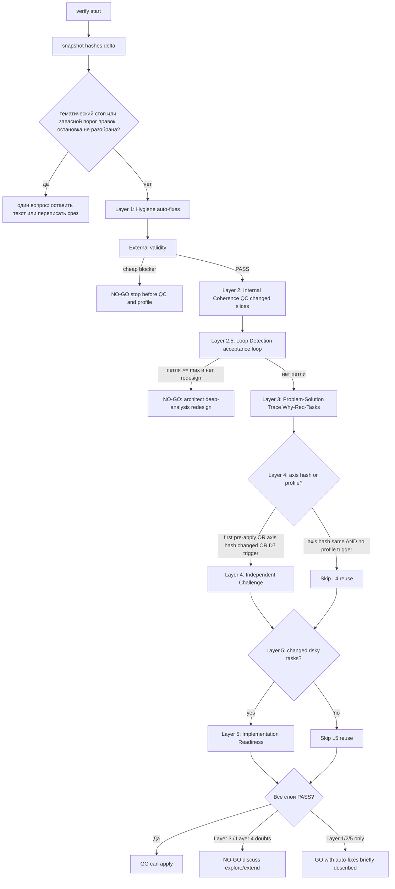

`/opsx:verify <name>` — независимое согласование ЗНИ перед `/opsx:apply`. Главный вопрос пользователя: «**могу ли я безопасно запустить apply?**» Первая строка чата — шаблон `.cursor/skills/openspec-verify-change/templates/verdict-card.md` («можно apply» / «до старта нужен ваш выбор» / terminal repair). Имена `GO` / `NO-GO` / `Layer N` / `PASS` / `FAIL` — **только** в `reports/*.md` и internal ledger; в чат — `.cursor/rules/verify-user-communication.mdc` + §7 `chat-output-budget.mdc`.

## Принципы

1. **Пять слоёв, в строгом порядке.** Каждый слой имеет единственную цель; слияние слоёв запрещено. Пропуск — только по каскаду: дешёвый блокер завершает прогон до не относящейся к нему эскалации; Layer 4 / Layer 5 — только по профильному триггеру или смене хэша оси.
2. **Бинарный вердикт (internal → chat).** Internal ledger: `GO` / `NO-GO`. В чат — формулировки verdict-card (не сырые `GO`/`NO-GO`, не «WARNING/SUGGESTION», не «PASS/FAIL»).
3. **Без скидок по объёму.** Глубина проверки одинакова для маленьких и больших ЗНИ — одна сломанная задача может остановить пользователя так же, как 25. **Исключение:** режимы `verify_depth` (`incremental`, `lite`) с guardrails — см. § «Verify depth» ниже; не ослабляют adversarial Layer 4 на первом прогоне.
4. **Verify чинит repair-класс сам.** Содержательные правки scope — через user `/opsx:extend`. Детерминированные пробелы постановки (карта repair в §2.6 `opsx-output-style.md`) — **internal Repair Loop** внутри verify, без user-facing extend и без «Подтвердить?».
5. **Один файл отчёта в день.** Полный отчёт `reports/verification-YYYY-MM-DD.md` создаётся, только если что-то найдено или исправлено; «тихий» прогон по фильтру новизны новый файл не пишет.
6. **Verify оценивает постановку, не приёмку на ИБ.** Приёмочные тесты, тестовые данные, эталоны ИБ, smoke-проверки — это apply/archive (срез либо принят, либо нет). Verify не задаёт вопросов про тесты и не блокирует apply из-за **отсутствия тестовых данных** (transient). **Исключение:** структурная недостижимость Primary внутри среза (QC 8b `slice-accept-not-self-achievable`) — дефект постановки; Layer 2 **FAIL** → NO-GO.

## Архитектура (5 слоёв)

Каскад (строго): снимок и хэши → детерминированная дельта → **обе метрики петли (шаг 4b, до любой карточки)** → гигиена → внешняя валидность → детерминированные связи затронутого scope → QC только изменившихся срезов → петля приёмки → трассировка Why при cache miss → профильный challenge / readiness **только** по триггеру. Дешёвый блокер (гигиена не блокирует; внешняя валидность и детерминированный FAIL) **завершает прогон** до QC и профильной эскалации. Обычный повтор: ноль или один профильный вызов. Тематический стоп и запасной счёт правок читаются в начале прохода, сразу после дельты и **до** сборки карточки нового продуктового вопроса: при срабатывании любой из метрик и неразобранной остановке продуктовая карточка в этом проходе не собирается.


```mermaid
flowchart TD
  start[verify start] --> Snap[snapshot hashes delta]
  Snap --> PatchStop{тематический стоп или запасной порог правок, остановка не разобрана?}
  PatchStop -->|да| OnlyQ[один вопрос: оставить текст или переписать срез]
  PatchStop -->|нет| L1[Layer 1: Hygiene auto-fixes]
  L1 --> ExtVal[External validity]
  ExtVal -->|cheap blocker| Stop[NO-GO stop before QC and profile]
  ExtVal -->|PASS| L2[Layer 2: Internal Coherence QC changed slices]
  L2 --> L25[Layer 2.5: Loop Detection acceptance loop]
  L25 -->|петля >= max и нет redesign| LoopNoGo[NO-GO: architect deep-analysis redesign]
  L25 -->|нет петли| L3[Layer 3: Problem-Solution Trace Why-Req-Tasks]
  L3 --> Trigger{Layer 4: axis hash or profile?}
  Trigger -->|first pre-apply OR axis hash changed OR D7 trigger| L4[Layer 4: Independent Challenge]
  Trigger -->|axis hash same AND no profile trigger| SkipL4[Skip L4 reuse]
  L4 --> L5trig{Layer 5: changed risky tasks?}
  SkipL4 --> L5trig
  L5trig -->|yes| L5[Layer 5: Implementation Readiness]
  L5trig -->|no| SkipL5[Skip L5 reuse]
  L5 --> Verdict{Все слои PASS?}
  SkipL5 --> Verdict
  Verdict -->|Да| GO[GO can apply]
  Verdict -->|Layer 3 / Layer 4 doubts| NoGo[NO-GO discuss explore/extend]
  Verdict -->|Layer 1/2/5 only| Hygiene[GO with auto-fixes briefly described]
```

## Режимы

Только два значения `verify_mode` в YAML отчёта:

- **`pre-apply`** — есть хотя бы одна `[ ]` в `tasks.md` (включая `S<N>.accept` и legacy `S<N>.T<M>`). Сюда же относятся «узкий verify одного среза» и «verify после принятого среза» — это контекстные подсценарии pre-apply, выводимые из текста запроса пользователя и состояния `debug.md` / `reports/slice-acceptance-*`.
- **`post-apply`** — все задачи `[x]`.

Старые значения (`slice-pre`, `slice-post`, `slice-scoped`, `slice-transition`, `legacy-pre`, `legacy-mixed`, `legacy-post`) **удалены** — больше не использовать ни в YAML, ни в чате, ни в именах файлов.

## Шаги (последовательно)

### 1. Select change

1. Если в запросе указано имя — использовать.
2. Если нет — `openspec list --json`, выбрать активную ЗНИ. При >1 активной — AskQuestion.
3. Имя сохранить как `<change-name>`.

### 1b. Scope Gate

Verify не правит scope артефактов. Если в запросе пользователя помимо команды verify есть **новое требование** или содержательная правка постановки (новые сценарии, изменения design):

- Слот **Варианты** (brief-card B2) с русскими ярлыками; ответ **номером**:
  1. «Сначала дополнить постановку» → остановить verify, передать текст в `/opsx:extend <name>`
  2. «Проверить как есть» → текст пользователя не учитывать в проверках; YAML `scope_gate_decision: ignore-extra`
  3. «Отложить в заметки отчёта» → info-секция отчёта, на вердикт не влияет
- Не смешивать в одном сообщении с развилкой decision-block (A/B); один вопрос выбора за ход.

Если запрос — только имя ЗНИ — Scope Gate проходит молча.

### 1c. Verify depth (внутренняя таблица; без ключа в палитре)

Оркестратор выбирает `verify_depth` по состоянию change (пользователю ключи не предлагать):

| Условие | `verify_depth` | Слои |
|---------|----------------|------|
| Первый проход / `decision_round=0` / смена выбранного подхода или контракта поведения (хэш оси) / новый сценарий / новое продуктовое событие / ответ заказчика, меняющий правило (не действует для класса «замена значения») / REJECT security·correctness / неизвестная граница дельты | `full` | все контроли заново; кэш игнорируется; независимый разбор запускается |
| Повторный verify, входы совпали, нет открытой темы высокого авторитета | `lite` | действующие guardrails; независимый аудит постановки переиспользуется (`SKIPPED-lite`) |
| После успешной автоматической дописки, которая только уточнила уже названную тему при том же наблюдаемом правиле | не полный независимый разбор | гигиена, продуктовая сверка, связи артефактов, опора на прошлый контроль среза; уже названную тему не поднимать как новый разрыв |
| Дополнение только фиксирует ответ заказчика внутри выбранного подхода (зеркало записанных решений и реестр контрактов изменились, ось Decisions / Behavior Contract и варианты реализации — нет) | точечный | полный независимый разбор не запускается; проверяются только затронутые темы; в отчёте видно, что прогон точечный |
| Все изменения с прошлого снимка объяснены записями § Extend класса «замена значения» | точечный | сверяется, что новое значение записано согласованно, старое не осталось в proposal, design, specs и тексте невыполненных задач, условия класса по-прежнему выполнены, включая обратную подстановку при нескольких записях (правило класса ниже, второе не задаётся); при неоднозначной подстановке или найденном старом значении проход называет место или причину и не даёт вердикт «можно реализовывать»; контроль срезов, независимый разбор и оценка готовности задач не запускаются; строка срабатывает по дельте, кто бы ни вызвал проверку — пользователь, применение на границе среза или архив |
| Правка выбранного подхода, контракта поведения или вариантов реализации | `full` | полный независимый разбор |
| После **user-extend** по decision (`decision_round>0`) или дельта с доказанной локальностью, кроме строчки «только ответ внутри подхода» выше | `incremental` | пересчёт `invalidation_map`; остальное из `check_cache` |
| **Между срезами** (после приёмки `S<N>.accept` / slice-gate из apply; ключ `tasks.md` для этого выбора — `tasks.md#normalized`) **и** хэш архитектурной оси не менялся | `incremental` | invalidated scope текущего среза; L4 только по профильному триггеру |

**Класс «замена значения».** Дополнение и проверка применяют одно правило. Класс присваивается, только если выполнены все условия:

0. Первая полная проверка уже пройдена: в последнем отчёте с `verify_depth: full` независимый разбор выполнен, вердикт — можно реализовывать, `open_decision_id` пуст. Без этого класс не присваивается.
1. Меняется значение одного наблюдаемого атрибута внутри правила, уже записанного в постановке, и по оценке воздействия замена меняет только то, что заказчик видит или получает: не состав данных, попадающих под правило, не формулу, момент или порядок шагов, не условия сценариев и не контракты с другими объектами. Закрытого перечня атрибутов нет.
2. Названия сценариев и условия «когда» не меняются; в ожидаемом результате меняется только это значение. Новое значение не участвует в условиях сценариев и не занято в той же ЗНИ другим состоянием.
3. Места правки — те же элементы, реквизиты и процедуры, что уже записаны в design и tasks. Новые задачи и срезы допускаются только по таблице состояний дополнения.
4. Тема внешнего контракта не открывается и не меняется, кроме записи этого же указания заказчика. Повторная замена того же значения до приёмки среза класс не присваивает.
5. Ось не меняется по обратной подстановке: в текущем нормализованном тексте Decisions и Behavior Contract старое значение возвращается на место нового, и хэш совпадает с хэшем оси из последнего снимка.

**Несколько записей § Extend с прошлого снимка.** Если записей класса «замена значения» больше одной, обратная подстановка идёт по каждой в обратном хронологическом порядке (сначала последняя замена). Подстановка неоднозначна и класс не присваивается, когда новое значение одной записи встречается в тексте оси вне мест, которые эта запись заменила, или когда пары «было → стало» пересекаются (новое одной записи равно старому другой).

Числовые пороги и константы условий в класс не входят. Не выполнено хотя бы одно условие — это не «замена значения»; действует остальная таблица, для дополнения исход — нужна проверка.

**Сопоставление с кэшем:** `full` — пересчитать все `check_id`, `check_cache` не читать. `incremental` — пересчитать ключи из `invalidation_map`, совпавшие ключи `check_cache` переиспользовать. `lite` — как incremental плюс пропуск независимого аудита постановки. `точечный` по строке класса «замена значения» — в существующем поле `verify_depth` пишется `точечный`; в существующем `invalidation_map` перечислены только пересчитанные сверки значения (согласованность нового, отсутствие старого в нормативном тексте, условия класса). Контроли срезов, независимого разбора и готовности задач в этот список не входят. Новый раздел отчёта не вводится. Прежний тихий путь (`silent_ok`) = **полное совпадение** `artifact_hashes` + `external_contract_digest` + `rules_versions` + `decision_fingerprints`.

**Guardrails `lite` (авто):** недоступен при `open_decision_id != null` (хотя бы одна открытая тема высокого авторитета), `decision_round > 0`, открытой развилке в последнем отчёте или открытом опровержении предпосылки (запись в `refuted_premises[]` без ответа заказчика новее `detected_at`). В чате: «проверена исполнимость без повторного независимого аудита постановки».

**Guardrails `incremental`:** после user-extend по decision, на границе среза (slice-gate) **или** когда дельта локализована картой инвалидации. После internal Repair Loop, который только уточнил уже названную тему при том же наблюдаемом правиле, следующий проход **не** назначает полный независимый разбор и **не** поднимает эту тему как новый разрыв. Полный проход остаётся для первого прохода, смены выбранного подхода или контракта поведения, нового сценария, нового продуктового события и ответа, меняющего правило. Автоматическая дописка, которая меняет наблюдаемый исход, по-прежнему даёт `verify_depth: full`. Если хэш архитектурной оси (нормализованный `design.md` § Decisions / Behavior Contract, не голый `mtime`) изменился относительно `last_challenge_at` — incremental на границе среза недоступен, нужен `full` (L4 обязателен). После успешного точечного прохода класса «замена значения» текущий хэш оси — база снимка без нового разбора, поэтому следующая граница среза не уходит в полный проход из-за этой замены. Ключ `tasks.md` в строке «Между срезами» этим правилом не меняется. `/opsx:apply` на slice-gate ссылается на этот режим вместо полного прогона. Недоказанная локальность → расширить до затронутого среза; неизвестная граница → `full`.

**Та же тема (узкий повтор).** Тема, которую прошлый проход уже назвал и которая не меняет наблюдаемое правило. Уточнение формулировки при том же исходе — узкий путь: следующий проход не назначает полный независимый разбор и не называет тему новым разрывом. Смена формулы, момента второго файла, порядка шагов или иного наблюдаемого исхода — не «та же тема»: полный проход, даже без переименования заголовка.

**Стык глубины.** Первый проход полный. Смена выбранного подхода или контракта поведения — полный проход. Новый сценарий или новое продуктовое событие — полный проход. Ответ заказчика, меняющий правило, — полный проход. Для класса «замена значения» это утверждение не действует: срабатывает строка таблицы «все изменения с прошлого снимка объяснены записями § Extend класса „замена значения“» — точечный проход, не полный. Открытая тема высокого авторитета не даёт лёгкий проход. Лёгкий проход при полном совпадении входов сохраняется. Точечный проход после дополнения, которое только фиксирует ответ заказчика внутри выбранного подхода, сохраняется: полный независимый разбор не запускается. Меняется одно: после автоматической дописки, которая только уточнила уже названную тему при том же наблюдаемом правиле, следующий проход не назначает полный независимый разбор. Классификация выводов разбора действует внутри разбора, когда он легитимно запущен, и не подменяет лёгкий проход.

**Ось архитектуры (лаконичность, D5):** полный независимый аудит (L4 full) обязателен при **смене оси** (новый архитектурный рычаг / REJECT security·correctness / явный redesign / изменившийся хэш оси), а **не** при каждом `mtime(design.md)` после APPROVE закрытой оси. После GO + закрытая развилка + ось не менялась → default `lite` / `incremental` (см. таблицу). **Не ужимать:** первый full по ЗНИ; петля приёмки среза; аудит при смене оси или REJECT.

**Repair-класс:** точечный re-check слоёв согласованности/готовности без полного пакета независимых аудитов «с нуля». Жёстче насыщение развилок (`decision_round_max` / earlier saturated) — не разгонять форум гипотез через серию full verify.

**Контекст агентов verify:** в промпт — delta design + сводка `closed_decisions`, не полный `debug.md` каждый раз.

**Research ≠ verify:** цикл «замер → вывод» → `/opsx:explore` + при необходимости `/opsx:extend`; verify = исполнимость зафиксированного плана. Граница с triage: triage выбирает маршрут цикла; verify не заменяет research.

Записать выбранный `verify_depth` в snapshot отчёта.

### 2. Load artifacts

Прочитать (mtime — только признак «нужно ли пересчитать хэш»; решение по слоям — по `artifact_hashes` и карте инвалидации):

- `openspec/changes/<name>/proposal.md`
- `openspec/changes/<name>/design.md` (хэш нормализованного содержимого / оси Decisions·Behavior Contract → Layer 4; не голый mtime)
- `openspec/changes/<name>/tasks.md`
- `openspec/changes/<name>/specs/**/*.md`
- `openspec/changes/<name>/debug.md` (если есть) — секция `## Verify decision ledger` (runtime SSOT closed decisions); секция `## External Contract Ledger` — **если есть** (не создавать при отсутствии)
- `openspec/changes/<name>/reports/_manifest.yaml` (если есть)
- `openspec/project.md`

**Decision ledger (agent-only):** если в `debug.md` есть `## Verify decision ledger`, прочитать YAML-блок (`closed_decisions`, `decision_round`, `open_decision_id`, `assumptions_accepted`). Если секции нет — инициализировать пустой ledger в памяти оркестратора; при Save report синхронизировать в snapshot. Также прочитать design § «Решения verify (зафиксировано)» — UX-mirror для промпта L4 и блока «Уже зафиксировано» в чате.

**External Contract Ledger (schema, SSOT записи):** если секции `## External Contract Ledger` **нет** и нет нового структурированного события из закрытого перечня § External validity — сохранить прежний полный прогон: **не** создавать секцию, **не** поднимать блокер, вопрос или информационное сообщение. `donor` и `internal` сами по себе **не** блокируют.

Если секция есть — прочитать YAML `external_contract:` и валидировать каждую запись по фиксированному контракту (поля из design D1; свободная проза не дополняет схему):

- **id:** `EC-*` (стабилен внутри ЗНИ; `open_decision_id` пишет тот же идентификатор).
- **Идентичность темы:** `topic.capability + topic.anchor + topic.axis + topic.reference`. Автообъединение по текстовой близости **запрещено**.
- **axis:** стартовый словарь `actor` | `trigger` | `timing` | `visible-result` | `absence` | `side-effect` | `error-recovery` либо `custom:<slug>`. Предметные оси конкретного проекта в движок не вносить.
- **source:** `path#anchor` **или** `entry-point:<command>@<ISO>` (ISO с часовым поясом). Для `entry-point:*` команда-источник обязана оставить зеркало в `debug.md`; проверка читает зеркало, не историю чата.
- **authority:** `customer-direct` | `accepted-reference` | `donor` | `internal`.
- **decision.parity:** `matches` | `diverges` | `not-applicable` | `unclassified`.
- **confirmation:** `open` | `confirmed` | `waived` | `superseded`. Для `confirmed` / `waived` обязательны `confirmed_at` и `confirmed_by`. Для `customer-direct` и объявленной оси `accepted-reference` допустимо только `confirmed_by: user`.
- **signals[]:** `id`, `kind` (`customer-return` | `customer-correction` | `reference-evidence` | `policy-change`), `primary_event_id`, `primary_event_at`, `source_fingerprint`. Отпечаток канонически: SHA-256 от `id|kind|primary_event_id|primary_event_at` (разделитель `|`, без хвостовых пробелов). Пересказ с тем же `primary_event_id` — не новый сигнал.

Невалидная запись (нет id / authority / axis / source / идентичности темы) → не угадывать поля; трактовать как незарегистрированное структурированное событие § External validity, если источник входит в закрытый перечень.

### 3. Determine mode

Grep `tasks.md` на `^- \[[ ]\]` — если найдено хотя бы одно совпадение, `verify_mode = pre-apply`; иначе `post-apply`.

### 4. Novelty Check (детерминированная дельта)

1. Найти последний `reports/verification-*.md` (по дате в имени файла) и прочитать YAML `snapshot`. Нет `artifact_hashes` / `check_cache` → cache miss, дальше как с пустым кэшем.
2. Для каждого входного артефакта: если `mtime` не изменился — переиспользовать сохранённый хэш; если изменился — пересчитать SHA-256 нормализованного содержимого (рецепт — `templates/report-header.md`). Не считать новизну по одному `mtime`.
3. Построить дельту: изменившиеся `artifact_hashes`, `external_contract_digest`, `decision_fingerprints`, `rules_versions`. Заполнить `invalidation_map` по канонической таблице того же шаблона.
3a. **Сверка предпосылок (до быстрого пути).** Собрать файлы `reports/`, появившиеся после прошлого снимка. Исключить собственные отчёты проверки (`verification-*` и отчёты её слоёв: `quality-control-*`, `design-challenge-*`, `architecture-task-readiness-*`, `architecture-loop-redesign-*`) и файл следов `reports/quality-traces.md`. Если в журнале нет решений с полем `premise` или новых отчётов нет — сверку не делать, кэш и быстрый путь не трогать. Записи без поля `premise` и записи с `premise: none` пропускать молча. Если решения с `premise: {claim, anchor}` есть и новые отчёты есть — точечная сверка, остальное по кэшу; быстрый путь в этом проходе не отдавать, пока сверка не закончена.
   - Опровержение брать из секции `## Premise conflicts`: `decision_id`, `refuting_anchor`, строка «решение опиралось на», строка «код показывает».
   - Секции нет — читать отчёт только если в нём упомянут путь из `premise.anchor` или `decision_id`. Иначе отчёт не читать.
   - Совпадение — дописать запись в `refuted_premises[]` (см. правила владения ниже). Поля ответа заказчика не менять.
4. Если **все** хэши входов, дайджест внешнего контракта, отпечатки решений и версии правил совпали **И** в запросе нет содержательных вопросов (только `/opsx:verify <name>`) **И** сверка предпосылок (п. 3a) не нашла открытого опровержения и не была обязана читать новые отчёты — сравнить текущий режим проверки (шаг 3, `pre-apply` / `post-apply`) с `verify_mode` в снимке. Совпали входы и режим — путь **`silent_ok`** (полное совпадение входов и режима). Режим разошёлся — быстрый путь не отдаёт совет из прошлого снимка: тихий итог не подменяет новый отчёт, глубина берётся из §1c, следующий шаг — по текущему режиму. Открытое опровержение предпосылки быстрый путь запрещает. При совпадении:
   - **Не запускать слои 1–5.**
   - **Не создавать новый файл отчёта.**
   - Прочитать тело последнего `reports/verification-*.md` (не только YAML).
   - **Не опираться на историю чата** — только YAML `snapshot`, хэши и тело последнего отчёта.
   - В чат — «тихий» вариант `.cursor/skills/openspec-verify-change/templates/chat-summary.md`: **1a**, если прошлый вердикт «можно apply»; **1b-decision**, если есть открытая развилка; **1b-repair**, если только repair-блокеры — запустить **Repair Loop** (без сообщения в чат), затем один финальный ответ.
5. Если разошлось — `verify_depth` из §1c: `full` игнорирует кэш; `incremental` пересчитывает только invalidated `check_id` и переиспользует остальное `check_cache`; недоказанная локальность → затронутый срез; неизвестная граница → `full`.

Записать `artifact_hashes`, `invalidation_map` и попадания кэша в snapshot нового отчёта.

### 4b. Порог правок до продуктовой карточки

Сразу после дельты, до гигиены и до любой карточки вопроса заказчику, прочитать обе метрики петли по SSOT `.cursor/rules/vertical-slices.mdc` § ДЕТЕКТОР ПЕТЛИ ПРИЁМКИ: тематическую (`TopicReopen` ≥ 2 — второе переоткрытие одной идентифицированной темы) и запасной счёт правок (`PatchRounds` против `acceptance_loop_max`, по умолчанию 3) для тем без идентичности. Момент проверки — начало прохода, не после сбора карточки.

Возврат решения по опровергнутой предпосылке в `TopicReopen` не входит и насыщением `decision_round_max` не гасится: вместо «оставить текст или переписать срез» заказчик получает вопрос о подтверждении выбора. Пока такой пункт открыт, этот шаг его не подменяет.

Если сработала любая из двух метрик и остановка ещё не разобрана (нет `reports/architecture-loop-redesign-*.md` новее последней `awaiting-acceptance` этого среза и нет ответа человека «оставить текст» или «переписать срез»):

- Единственный вопрос этого прохода — «оставить текст или переписать срез».
- Продуктовая карточка в этом проходе не собирается, даже если продуктовое расхождение уже найдено: расхождение фиксируется в отчёте и в чат не выносится.
- Открытые ответы заказчика не стираются и не закрываются. Не менять `closed_decisions`, `open_decision_id`, `confirmation` и записи журнала с ответом человека из-за этой остановки.
- Дальше — карточка этого одного вопроса. Слои, которые ищут новые продуктовые развилки, в чат не выводятся.

Если остановка уже разобрана — проход идёт обычным каскадом. После ответа «оставить текст» следующий проход может задать продуктовые вопросы.

### Layer 1 — Гигиена артефактов (тихая, авто-исправление)

**Цель:** убрать механические дефекты формы (пустые чекбоксы, лишние пробелы, регистр маркеров), которые засоряют чат и вертикаль проверок. Никаких вопросов пользователю.

**Что проверяется (механически):**

| Проверка | Действие | Алерт |
|---|---|---|
| Чекбоксы `- [ ]` отсутствуют у задач | Добавить | `task-missing-checkbox` (auto-fix) |
| Закрывающий `<!-- slice-gate -->` отсутствует в срезе | Записать с заглушкой | `missing-slice-gate-marker` (auto-fix) |
| Пустые буллеты, лишние пробелы | Нормализовать | `whitespace-normalized` (auto-fix) |
| `<!-- phase-gate -->` (legacy маркер фазы) | Заменить на пометку `legacy-phase-gate-deprecated` в info-секции отчёта | `legacy-phase-gate` (info) |
| Незакрытые backtick-блоки в `design.md`/`tasks.md` | Закрыть | `unbalanced-fences` (auto-fix) |
| ID задачи без префикса среза, когда есть `# Срез` | Лог в info без правки | `task-without-slice-prefix` (info) |
| Задачи на управляемую форму (Form.xml / «форма»+compile) без секции `## Forms mode` (или legacy `## Forms & layouts mode`) / без `form_mode`/`forms:` и без lone legacy `artifact_mode` | Info + ссылка на `forms-mxl-mode-gate.mdc`; **не** авто-выбирать `assisted` | `missing-form-mode` (info) |
| Задача на конкретную форму при пустом/`n/a` режиме этой формы (и без валидного lone legacy `artifact_mode`) | Info / repair-кандидат: STOP/extend на apply | `empty-form-mode` (info) |
| `form_mode`/`forms:`/`artifact_mode: bsl-only` при задачах compile Form.xml | Info / repair-кандидат согласованности | `bsl-only-vs-xml-task` (info) |
| `form_mode`/`forms:`/`artifact_mode: assisted` + Form.xml при отсутствии skill `1c-forms/compile`\|`edit` | Info: ожидаем HALT→manual на apply | `assisted-form-without-skill` (info) |
| Отсутствие Mode Gate макета / поля `layout_mode` в proposal при задачах Template/MXL | **Не** дефект этой политики; макет — manual default + permission on apply | `layout-mode-gate-absent` (info, non-blocking) |
| Legacy lone `artifact_mode` при отсутствии `form_mode`/`forms:` | Info: readers трактуют как гомогенный `form_mode` на form-scope | `legacy-artifact-mode-fallback` (info) |

**Если правок не было** — записать `layer_1_hygiene: PASS`. Если были — `AUTOFIXED` + список в `### Авто-исправлено (Layer 1)` отчёта в техническом формате (файл, строка, что изменено); каркас таблицы — `.cursor/skills/openspec-verify-change/templates/layer-1-hygiene-table.md`.

Layer 1 **никогда** не блокирует — только правит или сообщает в info.

### Layer 2 — Внутренняя согласованность плана

**Цель:** артефакты не противоречат друг другу.

**2.0. External validity (ранняя остановка, до QC и профильной эскалации)** — дешёвый детерминированный контроль. Блокер входит в `layer_2_internal_coherence: FAIL` с классом **decision**; отдельный статус слоя **не** вводится. `decision_round_max` / GO-saturated этот блокер **не** снимают. Запрет `lite` при `open_decision_id != null` — тот же существующий guardrail §1c, второй механизм не добавлять.

Закрытый перечень структурированных источников (даты сравнивать; авторитет по свободной прозе **не** угадывать). Записи `## Verify decision ledger` учитывать **только** при наличии и `authority`, и `external_contract_id`:

1. `debug.md` § `Slice Gate Decisions`: `не принят`, `inside-slice rework` или `стоп`;
2. `debug.md` § `Extend —`: источник и изменение, явно переданные пользователем;
3. `debug.md` § `Verify decision ledger`: новый ответ пользователя только с `authority: customer-direct | accepted-reference` и `external_contract_id: EC-*`;
4. `reports/slice-acceptance-S<N>-*.md`: `Primary acceptance: fail`;
5. `design.md` § «Решения verify (зафиксировано)»: только зеркало с тем же `external_contract_id`.

Тела прочих отчётов, `_manifest.yaml`, свободная проза proposal/design и семантическое сходство **не** входы.

**Блокеры** (каждый указывает тему, ось и источник; чат — прозой по `decision-block.md`, не сырыми кодами):

| Условие | Алерт | Что нужно |
|---|---|---|
| Открытая запись `customer-direct` или открытая объявленная ось `accepted-reference` (`confirmation: open` либо исключение старше последнего уникального сигнала) | `external-contract-open` | Решение заказчика по этой теме |
| Заявленная ось `accepted-reference` с `parity: unclassified` | `external-contract-unclassified-axis` | Классифицировать ось (`matches` / `diverges` / `not-applicable`) и свежее подтверждение |
| Новое событие из перечня выше, которого нет в реестре (новее последней связанной записи) | `external-contract-unregistered` | Занести темой **или** отклонить с причиной (`authority: internal`, `parity: not-applicable`, `confirmation: waived`, отпечаток первичного события) |
| Второй уникальный `source_fingerprint` по тому же `EC-*` | `external-contract-second-signal` | Новое подтверждение или исключение **после** второго сигнала |
| `customer-direct` / ось `accepted-reference` закрыты или понижены до `donor`/`internal` без парной записи пользователя | `external-contract-internal-close` | Внутреннего согласования недостаточно |

**Парная синхронизация журналов.** Пока есть хотя бы одна открытая тема высокого авторитета, `open_decision_id` = самый ранний такой `EC-*`; после закрытия — следующий либо `null`. Закрытие высокого авторитета действительно только при `closed_decisions[]` с тем же `EC-*`, `source: verify-user-answer`, `confirmed_by: user` и `closed_at` не ранее более позднего из двух моментов: `primary_event_at` последнего уникального сигнала и `detected_at` открытого опровержения предпосылки этого решения (если опровержение есть). Тема высокого авторитета открыта, если `closed_at` раньше этого более позднего момента. Саму запись внешнего контракта, перечень видов сигналов и дайджест не переписывать. Рассинхронизация журналов сохраняет блокер.

**Владение полями журнала решений.** Ответ заказчика (`closed_decisions`, `confirmed_by`, `source: verify-user-answer`, `open_decision_id` по ответу) пишет только user-path extend. Проверка при опровержении предпосылки только дописывает `refuted_premises[]`: `decision_id`, `refuting_anchor` (путь и строка для показа), `report`, `detected_at`, `fingerprint = SHA-256(decision_id|путь файла без строки|текст опровержения)`. Поля ответа заказчика не менять. Тема решения открыта, пока нет записи ответа по тому же `decision_id` с `closed_at` позже `detected_at`. После такого ответа тот же `fingerprint` не эскалировать. Подтверждение прежнего выбора (та же `premise`) даёт следующий прогон точечным. Смена выбора (новая `premise`) — смена подхода, следующий прогон полный.

При любом алерте таблицы — **не** запускать новый полный независимый разбор этого прогона «из-за» блокера. Синтез отчёта и одна чат-карточка — сразу. Карточка перечисляет все открытые темы, известные к концу прогона, а не только самую раннюю: продуктовые расхождения этого прохода, остаток независимого разбора (пользовательские развилки последнего отчёта разбора, которые ещё не закрыты текстом), открытые темы журнала. Служебный указатель `open_decision_id` остаётся самым ранним открытым `EC-*` высокого авторитета и карточку не ограничивает. Формулировка «дописать вместе с ответом, не отдельным вопросом» не снимает с листа тему, уже известную к концу прогона: обе темы остаются нумерованными вопросами одной карточки. Пустой/отсутствующий реестр **и** нет события из перечня → контроль PASS без шума. Дешёвый блокер внешней валидности **всегда** раньше нового полного разбора: не запускать QC/L4/L5 «на всякий случай» параллельно с уже найденным блокером.

**2.1a. User Task Contract (mechanical pre-check)** — до QC: grep `tasks.md` по строкам `^- \[[ x]\] S\d+\.\d+` (не accept, не Follow-up) с таблицей DENY/ALLOW из `vertical-slices.mdc` § User Task Contract. Дополнительно: `При успешном verify S`, `после verify S`, `после стенда` в теле задачи → violation. Результат (список нарушений или «none») передать в промпт QC как **User Task Contract pre-check evidence**.

**2.1. Slice Coherence (Quality Controller)** — только **изменившиеся срезы** и связанные сценарии из `invalidation_map`. Контроль среза **не** запускать повторно, если прошлый контроль этого среза в порядке, упорядоченный набор названий сценариев среза тот же, что был на входе того контроля, и нормализованный текст обязательного пункта приёмки (Primary) не изменился. Опциональные буллеты приёмки остаются по названиям сценариев: правка формулировки внутри опционального буллета контроль не сбрасывает. В техническом аудите — отметка «опора на прошлый контроль среза» (прошлый `quality-control-*.md` взят как результат, новый полный контроль с нуля не создаётся). Детерминированные сверки покрытия (`scenario-coverage` и связанные grep) считаются как раньше и при опоре не пропускаются. Нет прошлого отчёта, прошлый контроль не в порядке, появился или исчез заголовок сценария, либо изменился текст обязательного пункта приёмки — контроль целиком. Первый прогон без прошлого контроля в порядке — полный текущий контроль (новый обязательный агентский вызов не добавляется).

Иначе делегировать **`openspec-quality-controller`** (Task **без** `model=`, по `model-selection.mdc`). Промпт: см. `1c-agent-patterns/quality-controller.md` — передать changed slices, linked scenarios, deterministic results, affected `EC-*`, reused checks. Получить `reports/quality-control-YYYY-MM-DD.md`.

**Режим запуска:** `run_in_background: false` (sync, последовательно). Карточка Task не показывается в чате как отдельное сообщение — `tool_result` идёт во внутренний контекст оркестратора. В промпт обязательно включить блок **Final message constraint** из секции «Запуск агентов verify» ниже и блок **User Task Contract pre-check evidence** из 2.1a.

QC оценивает критерии 1–6, 8, **8b**, 9–11 из `vertical-slices.mdc` (Scenario Coverage, Slice Independence, Slice Completeness, Slice Dependency Graph, Slice Gate Integrity, Acceptance Checklist Coverage 5b amended, Rework Risk, Slice Verticality, **Self-Achievable Acceptance**, Foundation slice with gate, Acceptance Simplicity, User Task Contract) **только для invalidated scope**; совпавшие матрицы не перестраивать.

**2.2. Code-Truth (механический)** — для каждого технического имени в backticks из `design.md`/`tasks.md`/`debug.md`/`specs/**` запустить `Grep` по путям из `openspec/project.md`. См. `.cursor/rules/code-truth-gate.mdc`.

Тяжесть — раздел SEVERITY в `.cursor/rules/code-truth-gate.mdc`. Проверка до разработки не понижает имя на закрытой задаче до предупреждения. Своей шкалы здесь нет.

**2.3. Spec ↔ Tasks ↔ Design coverage** — каждый `#### Scenario:` из `specs/**/spec.md` должен быть назван в `## Slices` design (строка «Scenarios из spec»). Иначе — `scenario-orphan-design`. Отдельный буллет приёмки на каждый сценарий не требуется: сценарий, закрытый задачей среза, не сирота приёмки (правило покрытия в `.cursor/rules/vertical-slices.mdc`).

**2.4. Cross-Archive Regression Audit (precedent regression)** — защита от молчаливой отмены ранее принятого контракта. **SSOT (триггеры, алгоритм, матрица severity, бюджет ≤10 архивов):** `.cursor/rules/precedent-regression-gate.mdc`, секция «АЛГОРИТМ VERIFY LAYER 2.4» — Read и выполнить, здесь не дублируется. Выполняется в `pre-apply`; в `post-apply` для непринятых задач/срезов; пропускается, когда все задачи `[x]` (постфактум приёмка не пересматривает регрессию дельты). CRITICAL `precedent-regression` / `invariant-drift` / `load-bearing-adr-bypass` → класс **decision** в Repair Loop.

**Итоговый статус слоя:**

- `PASS` — все критерии OK / только INFO.
- `WARNING` — есть несущественные несостыковки (один scenario без покрытия в матрице, лишний legacy-маркер). На вердикт идёт как «не блокирует apply».
- `FAIL` — циклы зависимостей срезов, `accept-checklist-empty`, `primary-acceptance-missing`, `acceptance-simplicity-overload`, `slice-not-vertical`, **`slice-accept-not-self-achievable`**, `slice-foundation-with-gate`, `user-task-contract-violation`, дублирование `S<N>.accept` в одном срезе, CRITICAL `phantom-symbol` по разделу тяжести `.cursor/rules/code-truth-gate.mdc` (в том числе имя на закрытой задаче в проверке до разработки), CRITICAL precedent-regression (`precedent-regression` / `invariant-drift` / `load-bearing-adr-bypass`), или блокер § External validity (`external-contract-open` / `external-contract-unclassified-axis` / `external-contract-unregistered` / `external-contract-second-signal` / `external-contract-internal-close`).

`FAIL` в Layer 2 — это **NO-GO**.

### Layer 2.5 — Loop Detection (петля приёмки)

**Цель:** поймать «хождение по кругу» — один срез многократно патчится / уходит на приёмку без подписания (`S<N>.accept` = `[ ]`). Каждый патч-раунд по отдельности исполним (Layer 5 PASS), поэтому петлю видит только метрика **поверх раундов**.

**Метрика и порог** — SSOT `.cursor/rules/vertical-slices.mdc` § ДЕТЕКТОР ПЕТЛИ ПРИЁМКИ (тематический `TopicReopen`, запасной `PatchRounds`, `acceptance_loop_max` default 3). Обе метрики читаются на шаге 4b, в начале прохода и до карточки нового продуктового вопроса. Этот слой не переносит вопрос на конец прохода и не собирает продуктовую карточку. Если шаг 4b уже остановил проход, слой фиксирует ту же остановку и второго вопроса не добавляет. Повтор темы `EC-*` (topic-loop внешнего контракта) — **не** этот слой: см. тот же раздел «Две петли не смешивать» и § External validity.

**Выполняется во всех `verify_depth`** — детект дешёвый (grep по уже загруженному `debug.md`); запуск архитектора — **только** при фактическом срабатывании.

**Алгоритм:**

1. Срабатывание читать из детектора `.cursor/rules/vertical-slices.mdc` § ДЕТЕКТОР ПЕТЛИ ПРИЁМКИ, не из своей формулы. Второе переоткрытие одной темы останавливает проверку так же, как дописывание и правило архитектора. Три передачи на приёмку без переоткрытия темы стоп не дают.
2. Детектор не сработал → `layer_2_5_loop_detection: PASS`, идти на Layer 3.
3. Детектор сработал для среза `S<N>`:
   - **Override:** в корне change есть `.gate-override.yaml` с `gate: acceptance-loop` — прочитать `timestamp`: ≤7 дней → `SKIPPED-override` (одна строка в чат: «Разбор петли приёмки отложен по вашему решению от <дата>; отсрочка истекает через <N> дней»), идти на Layer 3; >7 дней → override истёк (`gate-override-expired` в info), продолжить как срабатывание.
   - **Закрытие:** существует `reports/architecture-loop-redesign-*.md`, датированный **позже** последней `awaiting-acceptance` среза `S<N>` → петля уже разобрана архитектором → `layer_2_5_loop_detection: PASS`, идти на Layer 3.
   - Иначе — **запустить редизайн-аудит:** `Task(onec-code-architect, mode=deep-analysis)` по таблице шагов в `model-selection.mdc` (раздел «Закрытая эскалация Fable»; заголовок раздела не переименовывать). Второй перечень моделей здесь не держать. С loop-контекстом: история раундов `S<N>` (записи Slice Gate Decisions + Extend —), ссылки на трассы/отчёты/`debug.md`, явный вопрос «корень один или это N независимых дефектов; предложить consolidation vs минимум». Запуск — `run_in_background: true`, блок **Final message constraint** (как Layer 4). Сохранить `reports/architecture-loop-redesign-YYYY-MM-DD.md`. Append `debug.md` § Loop Detection (формат — `vertical-slices.mdc`).
   - Статус слоя `acceptance-loop-detected` → **FAIL → NO-GO**. Decision-card в чат (по `.cursor/docs/templates/decision-block.md`): суть петли (срез, сколько раз вернулся без приёмки) + рекомендация архитектора (consolidation / минимум) прозой; **Следующий шаг:** `/opsx:extend <name> --from-architecture <redesign-report>`.

**Порядок и cap.** Layer 2.5 идёт **до** Layer 4; его FAIL — всегда NO-GO. Decision-fatigue cap (GO-saturated) гасит только остаточный Layer 4 challenge и петлю подавить **не может**.

`FAIL` в Layer 2.5 — это **NO-GO**.

### Layer 3 — Problem-Solution Trace

**Цель:** план реально решает проблему из `## Why`, а не похожую.

Проверки (детерминистические):

1. **Why → Requirements.** В `proposal.md` `## Why` есть пункты, не покрытые ни одним `### Requirement` в `specs/**/spec.md`? → `why-orphan-requirement` (FAIL).
2. **Requirements → Scenarios.** Каждый `### Requirement` имеет ≥1 `#### Scenario:`? Иначе → `requirement-orphan-scenario` (FAIL).
3. **Scenarios → Slices.** Каждый `#### Scenario:` упомянут в `## Slices` design.md? Иначе → `scenario-orphan-slice` (WARNING — может быть подобрано в Layer 2; FAIL только если несовпадение системное).
4. **Slices → Acceptance.** Сценарий, закрытый задачей среза, не сирота приёмки — правило покрытия в `.cursor/rules/vertical-slices.mdc`. Проверка, что сценарий назван в разделе срезов решения, остаётся в пункте 3. Своей проверки «сценарий обязан быть буллетом приёмки» здесь нет.
5. **Slices → Tasks.** Для каждого среза есть рабочие задачи (`S<N>.<M>`) И ровно одна `S<N>.accept`. Срез без рабочих задач — алерт `slice-empty` (FAIL).
6. **Scenario observability (`scenario-implementation-leak`).** Grep `specs/**/spec.md`: для каждого `#### Scenario:` проверить `- **THEN**` на маркеры implementation-leak (см. `.cursor/rules/openspec-specs-gate.mdc` секция «НАБЛЮДАЕМОСТЬ СЦЕНАРИЕВ»). При совпадении — **WARNING** `scenario-implementation-leak`; рекомендация: переписать THEN наблюдаемо, детали — в design.md. Не эскалирует в FAIL Layer 3, но включается в отчёт verify.
7. **Metadata domain_label (`process-only-marker-suffix`).** Read `proposal.md` § `## Metadata (comment markers)` (dual-parser: yaml или list). Baseline запреты — `.cursor/docs/marker-canon.md` ⊕ project overlay. Если `comment_suffix` match → **WARNING** `process-only-marker-suffix`; рекомендация: переписать suffix или `/opsx:extend` перед apply. Не FAIL Layer 3.

`FAIL` в Layer 3 — **NO-GO**.

### Layer 4 — Independent Challenge (архитектурный адверсариальный аудит)

**Цель:** независимое подтверждение, что выбранный design **решает** проблему **оптимальным** способом. Это не дублирует Architect Gate из new/explore: new даёт согласие на подход (auctorial), challenge даёт независимое подтверждение (adversarial). Подробности — `.cursor/rules/architect-gate.mdc` секция «INDEPENDENT CHALLENGE».

**Триггеры запуска (любой; не `mtime` без смены хэша):**

- Это **первый** `/opsx:verify` по этой ЗНИ (нет ни одного `reports/verification-*.md` или ни в одном snapshot нет `last_challenge_at`) — рискованная архитектурная ось проверяется впервые.
- Хэш архитектурной оси (`design.md` § Decisions / Behavior Contract, иначе нормализованный `design.md`) **отличается** от хэша в snapshot последнего успешного Layer 4. Один изменившийся `mtime` при том же хэше **не** запускает вызов.
- Профильный триггер D7: внешний контракт конфликтует с design; две жизнеспособные альтернативы; риск безопасности / ресурсов / прецедента.
- `verify_depth = incremental` **и** `invalidation_map` содержит `design-challenge` — Layer 4 **targeted** (delta design + closed decisions + affected `EC-*`), не полный adversarial re-run всех альтернатив.
- Неизвестная граница дельты → `verify_depth: full`, scope явно расширен.

**Когда Layer 4 пропускается:**

- `verify_depth = lite` → `layer_status.layer_4_independent_challenge: SKIPPED-lite`.
- Триггеры не сработали (хэш оси совпал, профильного триггера нет) → `SKIPPED-novelty`; переиспользовать прошлый `design-challenge-*.md`.
- В корне change есть `.gate-override.yaml` с `gate: design-challenge` — прочитать поле `timestamp`:
  - **≤ 7 дней** — пропуск с предупреждением в чат («Независимый аудит постановки отложен по вашему решению от <дата> (причина: <reason>); отсрочка истекает через <N> дней»). YAML: `layer_status.layer_4_independent_challenge: SKIPPED-override`.
  - **> 7 дней** — отсрочка истекла: **override игнорируется**, Layer 4 запускается как обычно. В info-секцию отчёта — `gate-override-expired`. Не давать молчаливый бессрочный обход.

**Запуск:**

1. Делегировать `onec-code-architect` с `mode=design-challenge` по таблице шагов в `model-selection.mdc` (раздел «Закрытая эскалация Fable»; заголовок раздела не переименовывать). Второй перечень моделей здесь не держать.
2. **Режим запуска:** `run_in_background: true` (параллельно с sync-агентами Layer 2/5). Самый длинный шаг verify; параллелизм нужен, иначе verify становится в 2.5x длиннее. В чате остаётся **одна короткая карточка** (одна строка пути к файлу) — это допустимо как фоновый прогресс-маркер и не нагружает внимание. В промпт обязательно включить блок **Final message constraint** (секция «Запуск агентов verify» ниже).
3. Промпт включает:
   - `proposal.md`, `design.md`, `specs/**/spec.md` — как первичные источники.
   - **Обязательный блок Closed decisions** (из `debug.md` § Verify decision ledger + design § «Решения verify (зафиксировано)»):
     ```markdown
     ## Closed decisions (mandatory context)
     <paste closed_decisions summaries + design mirror prose>

     You MAY challenge closed decisions in the report file with verified code facts.
     Tag reopening alternatives: reopen-blocked: <decision_id>.
     Prefer implementation_invariant gaps over architectural forks when closed axis holds.
     Решение с открытым опровержением помечать: «основание опровергнуто — не довод против альтернатив».
     Если разбор и так запущен — проверить доказательства предпосылок решений, закрытых после его прошлого запуска: ведёт ли ссылка к месту возникновения значения. Новым триггером запуска это не является.
     ```
   - **Леджер прошлых разрывов** (из последнего `reports/design-challenge-*.md` и журнала; если отчёта нет — пустой список). Это утверждения для перепроверки по текущему тексту, не вердикт и не запрет на новый вывод:
     ```markdown
     ## Gap ledger (recheck, not a verdict)
     - G<N> — закрыт текстом | открыт — <утверждение прошлого разбора>
     ```
     Классификация новый / повтор / сужение и наследование номера — в контракте режима `design-challenge`. Если текущий текст не подтверждает «закрыт текстом», разбор открывает тему заново.
   - При `verify_depth = incremental`: ограничить scope — «проверь только delta design с прошлого challenge, trigger reason, affected EC-* и инварианты очистки/контекста; не переоткрывай closed decisions без verified new fact; не повторяй детерминированные графы».
   - Неизвестная граница: явно написать «scope расширен до полного».
   - **Запрет** опираться на `reports/architecture-*.md` собственного авторства как на источник истины.
   - Инструкции по адверсариальной установке, Three-Question Challenge и формату отчёта (см. `.cursor/agents/onec-code-architect.md` секция «Режим `design-challenge`»).
4. Результат — `reports/design-challenge-YYYY-MM-DD.md` с YAML `verdict: APPROVE | CHALLENGE | REJECT`.

### Post-challenge classifier (оркестратор, после Layer 4, до синтеза чата)

**Цель:** adversarial Layer 4 не ослабляется; фильтр и reclassify — на оркестраторе. Пользователь **не** видит agent-keys (`decision_id`, `reopen-blocked`).

| Сигнал в design-challenge | Действие |
|---------------------------|----------|
| Gap закрывается правкой design/tasks **без** смены closed axis | **Repair Loop** (`implementation_invariant`) |
| Alternative отменяет closed `decision_id` **без** verified new fact в отчёте | **Drop** — не в чат; log в info «reopen-closed-decision filtered» |
| Alternative + **verified new fact** (код, единственный caller) | **`supersedes`**: одна прозаичная эскалация «подтверждаете X, несмотря на Y?» — не A/B с отменой closed |
| `assumption_deferrable` / load-bearing без блокера | Кандидат **GO-saturated** (см. § GO-saturated) |
| Layer 4 **REJECT** + gap корректности / security / resource-leak | **Всегда NO-GO** — cap не применяется |

**Маппинг вердикта на статус слоя и чат:**

- `APPROVE` → `layer_status.layer_4_independent_challenge: APPROVE` → не блокирует apply. Обновить `snapshot.last_challenge_at` (ISO момента успешного challenge) и `artifact_hashes` оси design.
- `CHALLENGE` → после **Post-challenge classifier**: если только `implementation_invariant` → Repair Loop; если `drop reopen` → не NO-GO; если `supersedes` → одна эскалация в чат; иначе **NO-GO** с одной карточкой всех открытых тем прогона (не только самой ранней). `last_challenge_at` обновляется при CHALLENGE, прошедшем в чат или repair.
  - **Defensive filter:** workflow-формулировки — как раньше.
  - **Defensive filter reopen:** альтернатива с тегом `reopen-blocked: <id>`, противоречащая `closed_decisions` без verified new fact — **не** в чат.
- `REJECT` → после classifier: если gap = `implementation_invariant` only → Repair; иначе **NO-GO**. `last_challenge_at` **не обновляется** при REJECT, блокирующем apply.

**Важно:** Layer 4 нельзя «обойти» прогоном `--skip-architect`, переданным в new. Этот флаг закрывает только Architect Gate из new. Layer 4 verify имеет собственный override-механизм через `.gate-override.yaml gate: design-challenge`.

### Layer 5 — Implementation Readiness (реализуемость)

**Цель:** задачи реально можно реализовать as-is. Это **не** пересмотр архитектурного подхода (это сделал Layer 4) — узкий фокус на исполнимости.

**Триггер запуска (D7):** изменившиеся задачи содержат неизвестную композицию перехватов, ручную конфигурацию, неизвестную сигнатуру или контракт данных, новую межмодульную связь либо неподтверждённый API; либо `invalidation_map` содержит `task-readiness`. Изменение только отметки `[x]`/`[ ]` **не** запускает новый вызов. Хэш текста задач совпал → переиспользовать прошлый `architecture-task-readiness-*.md`, статус слоя скопировать, в техническом аудите — reused. Без триггера режим не требуется.

Иначе делегировать `onec-code-architect` с `mode=task-readiness` **без** `model=` по таблице шагов в `.cursor/rules/model-selection.mdc` (раздел «Закрытая эскалация Fable»). Второй перечень моделей здесь не держать. Промпт см. `1c-agent-patterns/architect.md`: trigger reason, changed tasks, affected `EC-*`, reused evidence; не полный `debug.md`. **Режим запуска:** `run_in_background: false` (sync). Карточка Task не отображается в чате. В промпт обязательно включить блок **Final message constraint** (секция «Запуск агентов verify» ниже). Неизвестная граница → явно расширенный scope. Архитектор оценивает:

1. Каждая задача `S<N>.<M>` имеет конкретные файл/процедуру/объект (по правилу `task-readability.mdc`)?
2. Контракты данных (`Свойство()`/`ТипЗнч()`/защитные проверки) — оправданы (Data Contract Gate)?
3. Есть ли в плане «фикс симптома» вместо корня (для bug-fix change — критерий из `verified-cause-gate.mdc` HALT 1/2)?
4. Порядок задач не создаёт «петлю» — нет ли задачи, которая ссылается на ещё не созданный объект?

**8. User Task Contract** — user runtime-spike в `S<N>.<M>` (ИБ, консоль, отладчик, эмуляция API без UX-proxy) → **GAP (блокирует GO)**. **Запрещено** трактовать spike как «штатный apply-gate / не дефект постановки». Out of scope (нет тестовых данных) **не отменяет** structural user-spike. См. `vertical-slices.mdc` § User Task Contract.

**5.1. Manual Configuration Sufficiency (механический, до архитектора).** Grep `tasks.md` (case-insensitive) на маркеры ручной конфигурации: «вручную», «в Конфигураторе», «создать реквизит», «добавить измерение», «настроить роль», «элемент формы», «реквизит формы». Если маркеры найдены — в `design.md` должна быть **дословная таблица-доказательство**: конкретные имена объектов/реквизитов, типы, элементы формы, которые пользователь создаёт руками. Нет полной таблицы (есть требование ручной настройки, но в design только общая фраза без имён/типов) → `manual-config-incomplete` (CRITICAL) → **NO-GO**. Это страховка: без точных имён разработчик не выполнит ручную часть, и apply встанет. Если маркеров нет — записать «маркеров ручной конфигурации не найдено» в info, без правок.

Архитектор сохраняет `reports/architecture-task-readiness-YYYY-MM-DD.md`.

**Сверка предпосылок текущего прогона.** После отчётов независимого разбора и готовности этого прогона прогнать ту же сверку, что в п. 3a, по этим отчётам (`design-challenge-*`, `architecture-task-readiness-*` текущего прогона). Опровержение из них дописывается в `refuted_premises[]` и попадает в ту же карточку. Отчёты слоёв, уже учтённые в снимке прошлого прогона, здесь заново не читаются.

**Маппинг:**

- Нет GAP / минорные → `PASS`.
- WARNING-уровень GAP (нечёткие формулировки, недостающие ссылки) → `WARNING` (не блокирует).
- CRITICAL GAP (нереализуемая as-is задача) **или** `manual-config-incomplete` (5.1) → `FAIL` → **NO-GO**.
- Сбой состоявшегося единственного вызова (вызов ушёл и вернулся ошибкой) → шаг не пройден; прошлый отчёт не подставляется как результат этого запуска. Переиспользование прошлого отчёта, когда вызов не запускался (триггер не сработал или хэш текста задач совпал), сохраняется. Пользователю предлагается повторить команду или явно продолжить без отчёта. Явное продолжение без отчёта нового статуса не вводит: слой остаётся `WARNING`, риск пишется в `assumptions_accepted`. Пока нет одного из этих двух решений, слой не закрывать как `PASS` и не синтезировать итог по прошлому отчёту.

**Сигнал упрощения (критерий 7).** Критерий 7 со значением `SUBOPTIMAL` или замечание об избыточности в пробелах, не учтённое в постановке, даёт пункт внутреннего ремонта того же прогона. Это верно и когда вердикт слоя «можно реализовывать» (`PASS` / `WARNING`), и когда отчёт готовности переиспользован при том же хэше задач. Итог для пользователя этот ремонт не меняет.

В промпт следующей готовности передать список «уже учтено»: строки причин с источником `отчёт#пункт` и правки задач, уже сделанные этим ремонтом. При переиспользовании отчёта учтённое заново не поднимать.

**Контроль простоты (детерминированный, неблокирующий).** Для отчётов архитектора, у которых в шапке `mode` одно из `design`, `plan-review`, `fix-quality`, `slice-decomposition`, `task-decomposition`, `deep-analysis`, выдать строку «к сведению», если нет `## Simplicity Check` с двумя вариантами или с «Only one viable option» и обоснованием, либо «Why not simpler» не ссылается на `EC-*`, `ADR-NNNN`, `путь:строка`, требование спецификации, пункт `proposal.md` или отчёт с проверенным поведением. По отчёту готовности задач (`task-readiness`) строку не выдавать. Строка пересчитывается из файлов на каждом прогоне, в постановку не пишется, из кэша не берётся.

### Финальный вердикт

```
verdict = GO  if and only if
  layer_1_hygiene ∈ {PASS, AUTOFIXED}
  AND layer_2_internal_coherence ∈ {PASS, WARNING}
  AND layer_2_5_loop_detection ∈ {PASS, SKIPPED-override}
  AND layer_3_problem_solution ∈ {PASS, WARNING}
  AND layer_4_independent_challenge ∈ {APPROVE, SKIPPED-novelty, SKIPPED-override, SKIPPED-lite, CHALLENGE-saturated}
  AND layer_5_implementation_readiness ∈ {PASS, WARNING}

verdict = NO-GO  otherwise
```

### GO-saturated (decision fatigue cap)

Применяется **только если** одновременно:

- `decision_round >= decision_round_max` (default 2), **и**
- L2/2.5/3/5 = PASS или WARNING без FAIL, **и**
- остаток L4 после classifier = `assumption_deferrable` **или** duplicate challenge по тому же closed axis (de-dupe), **и**
- Layer 4 **не** REJECT с gap корректности / security / resource-leak.

Тогда: `verdict: GO`, `layer_4: CHALLENGE-saturated`. В чат (вариант 2): «можно apply; остаточный риск … проверяется в S1.accept» — **без** agent-keys.

**Не применяется** при открытой теме высокого авторитета / блокере § External validity / открытом опровержении предпосылки: насыщение раундов этот вопрос о подтверждении не снимает и переоткрытием темы не считает.

**REJECT с утечкой контекста / security → всегда NO-GO**, cap не спасает.

Явный accept risk пользователя («принимаю риск», «apply без further verify») → `assumptions_accepted` в ledger + GO; одна строка прозой в design § Risks.

Любой `FAIL` в Layer 2/2.5/3/5 → NO-GO. `acceptance-loop-detected` (Layer 2.5) cap **не** снимает.
Layer 4 `CHALLENGE` или `REJECT` → NO-GO **кроме** CHALLENGE-saturated и случаев, когда classifier перевёл всё в repair/drop.

### Save report

Если хоть один слой не `PASS` либо были автоправки — сохранить `reports/verification-YYYY-MM-DD.md` строго в следующем порядке (полный шаблон — `.cursor/skills/openspec-verify-change/templates/executive-summary.md` и `.cursor/skills/openspec-verify-change/templates/report-header.md`):

1. **YAML front-matter** — `.cursor/skills/openspec-verify-change/templates/report-header.md`. Внутреннее состояние (verdict, layer_status, snapshot) для движка и фильтра новизны.
2. **`## Резюме для разработчика`** — первый видимый раздел. Зеркало финального сообщения чата + 1–2 абзаца контекста (модули, процедуры, директивы). На языке кода 1С, без жаргона движка.
3. **`## Решения до apply`** — только при NO-GO. Развёрнутые развилки прозой; каждая `###` с конкретными именами `Функция/Процедура/Модуль/Реквизит`. Внутренние коды развилок — НЕ здесь.
4. **`## Что меняется в постановке`** — карточка изменений для разработчика: путь в `src/`, точки изменения, что НЕ меняется, связанные ADR/KB/архив.
5. **`### Подправил в постановке`** — авто-правки гигиены простыми словами (если были); список правок в техническом формате уходит в `## Технический аудит`.
6. **`### К сведению`** — мелочи, не блокирующие apply.
7. **`## Технический аудит (для движка OpenSpec)`** — статусы пяти слоёв, технический формат. **Только здесь** допустимы имена `Layer 1..5`, `PASS/FAIL`, `CHALLENGE/APPROVE/REJECT`, `design-challenge`, `task-readiness`, `phantom-symbol`, `slice coherence`.
8. **`## Источники`** — пути к дочерним отчётам (`quality-control-*.md`, `design-challenge-*.md`, `architecture-task-readiness-*.md`), технические коды алертов.

Для прогона с `verify_depth` не `full` состав другой, полный прогон — список выше без изменений. В начале — ссылка на предыдущий отчёт (`parent_verification`). Дальше изменившиеся входы, пересчитанные и переиспользованные контроли, вердикт. Не писать список принятых задач, журнал решений и раздел «Что меняется в постановке». Вместо него — «Что изменилось с прошлого прогона» (`templates/executive-summary.md`).

Если verify повторный в один день — суффикс `-2`, `-3` и т. д.

При `silent_ok` (шаг 4) — **новый файл не создаётся**. Если прошлый вердикт «до apply нужно решение» — в чат выводятся развилки из последнего отчёта (Вариант 1b); иначе — тихий вариант 1a. Ссылка в конце — на последний `reports/verification-*.md`.

### Output to chat

Использовать `.cursor/skills/openspec-verify-change/templates/chat-summary.md`. Первая строка — `.cursor/skills/openspec-verify-change/templates/verdict-card.md`. Pre-send — `.cursor/rules/verify-user-communication.mdc` + Chat Surface Contract (§2.6 `opsx-output-style.md`). HALT — `.cursor/rules/chat-output-budget.mdc` §7. Тон — архитектор разработчику, на языке кода 1С.

**HARD — слот «Следующий шаг»:** при GO / GO-saturated / silent_ok 1a — **всегда** строка `**Следующий шаг:**` с user-action командой:

- `verify_mode = pre-apply` → `/opsx:apply <change-name>`
- `verify_mode = post-apply` → `/opsx:archive <change-name>`

Для silent_ok брать `verify_mode` из текущего состояния ЗНИ (шаг 3, grep `tasks.md`), **не** из снимка прошлого отчёта и **не** hardcode apply.

При decision — `**Следующий шаг:** ответьте в чате (A или B)…`; при terminal fail — чат или `/opsx:extend <name>`.

Self-check: «можно действовать без файла» = пользователь видит **конкретную команду** или явное приглашение ответить в чате.

**HARD — закрытие команды (фоновый разбор):** платформенное уведомление «фоновый разбор постановки завершён» / «отчёт сохранён» — **слот синтеза**, если карточка вердикта с **`**Следующий шаг:**`** **ещё не** ушла пользователю **в этом запуске** `/opsx:verify`. На этом ходе — **сразу** финальное сообщение по `chat-summary.md` (вариант 2 / 1a / 3a / 4), **не** служебная строка.

**Запрещено** закрывать verify фразами «дополнительных действий нет», «отчёт уже учтён», «follow-up не нужен» и аналогами **без** слота **`**Следующий шаг:**`**. Текст платформы про «no further action» **не** отменяет карточку проверки.

Если карточка **уже** была в чате этого запуска — на уведомление о фоне **молчать** (предпочтительно). Если платформа требует ответ — компактный повтор того же варианта (1a/2/3a), **не** «действий нет».

**Одна команда `/opsx:verify` → одно финальное сообщение в чат** (допустим progress marker при длинном Repair Loop). **Исключение:** канон лимита «дорогие модели недоступны — дальше на модели чата» и «Разбор постановки (Fable)» / «Разбор постановки (Opus 5)» не ждут карточки вердикта. Ход уведомления о завершении фона **до** карточки — **не** non-event и **не** «одна строка без решения» (`chat-output-budget-full.mdc` §5a). Английский progress не изобретать. Допустимые русские строки — из бюджета чата и `model-selection.mdc` (канон лимита, «Разбор постановки (Fable)», «Разбор постановки (Opus 5)», «Дописываю постановку…»).

### Repair Loop (internal, max 2 attempts)

**Ремонт сигнала упрощения** (правила живут здесь, не в `openspec-extend-change`). Пункт критерия 7 `SUBOPTIMAL` или замечание об избыточности, не учтённое в постановке, исполняется тем же вызовом repair-from-verify, без сообщения в чат и без смены итога прогона.

- Правка задачи без лишней защиты — только если пункт несёт рецепт «убрать» и ссылку `путь:строка`.
- Иначе строка причины в `design.md` `## Risks / Trade-offs`: «замечание без рецепта, оставлено», источник `отчёт#пункт`.
- Избыточность, предписанная закрытым решением, не удалять; причина ссылается на `decision_id`.
- Запись причины и правки задач делает уже существующий repair-from-verify по remediation из отчёта проверки: `openspec-extend-change` §6 п.3 (`design.md` § Risks) и п.4 (`tasks.md`). Отдельной правки extend для этого ремонта нет.

Классификация остального отчёта — как ниже.

Если шаг 4b уже остановил проход, Repair Loop продуктовую карточку не собирает: единственный вопрос — «оставить текст или переписать срез»; открытые ответы заказчика не стираются и не закрываются.

После NO-GO классифицировать блокеры по карте repair/decision (§2.6 `opsx-output-style.md`, `layer_status` и коды алертов отчёта):

1. **Decision blockers** (CHALLENGE/REJECT с A/B **после classifier**, `scope-violation`, FAIL с продуктовым выбором, Why ↔ plan, `supersedes`, **`slice-accept-not-self-achievable`**, блокеры § External validity) → chat **3a-decision**, **END TURN**. Repair не запускать без ответа пользователя.

   Для блокера внешнего контракта: агент **MAY** предложить `parity: diverges` и `reason`, но **SHALL NOT** ставить `confirmed_by: user`, менять `open_decision_id` / `decision_round` / `closed_decisions[]` с `source: verify-user-answer` и снимать блокер. Ответ заказчика на эту развилку получает `authority` и `external_contract_id` и передаётся в **user-path** `/opsx:extend --from-verify` (не в repair-from-verify). Парное закрытие — только после этого ответа: `closed_decisions[]` с тем же `EC-*`, `source: verify-user-answer`, `confirmed_by: user`, `closed_at` не ранее последнего сигнала; затем пересчитать `open_decision_id` и увеличить `decision_round`.

   Для **`slice-accept-not-self-achievable`:** развилка на человеческом языке по `.cursor/docs/templates/decision-block.md` — **объединить срезы** (рекомендуется) **или** переписать Primary проблемного среза на исход, достижимый его собственными задачами. **Запрещено** как разрешение блокера: «процедурно не подписывать `S<N>.accept` до завершения более позднего среза без правки `tasks.md` / `design.md`» (вариант C из QC — создаёт пустую формальность).
2. **Repair only** (включая `implementation_invariant` от classifier) + `repair_attempt < 2`:
   - Вызвать `apply_repairs_from_report()` — internal `/opsx:extend <name> --from-verify <отчёт>` в режиме **repair-from-verify** (без брифа, без сообщений в чат; порядок правок — extend §6).
   - **Не END TURN** → полный re-verify (слои 1–5) с `repair_attempt + 1`.
   - **0 промежуточных сообщений** в чат; допустима одна строка progress marker (§6 `chat-output-budget.mdc`): «Дописываю постановку…». **Исключение:** канон лимита и «Разбор постановки (Fable)» / «Разбор постановки (Opus 5)» не ждут финальной карточки.
3. **Decision всплыл на attempt 2** (repair открыл скрытую развилку) → chat **3a-decision**, **END TURN**. **Не** считать terminal fail.
4. **Repair всё ещё нужен после attempt 2** → terminal: «не удалось дочинить автоматически за 2 итерации» + краткая суть на языке эффекта + ссылка на отчёт. **Не** молчать и **не** ping-pong extend→verify в чате.
5. **GO** на любой итерации → один chat-summary (вариант 2).

**Смешанный отчёт (repair + decision):** decision имеет приоритет → сначала 3a-decision; repair после ответа пользователя через user-extend `--from-verify`.

**Self-check перед финалом repair-path:** ответ самодостаточен для пользователя **без prior turns** и **без открытия файлов**?

### Update snapshot

После сохранения отчёта обновить YAML `snapshot` **и** синхронизировать `debug.md` § Verify decision ledger:

- `accepted_tasks` — текущий список `[x]`.
- `artifacts_mtime` — текущие mtime каждого артефакта (служебные; новизна — по хэшам).
- `artifact_hashes`, `external_contract_digest`, `decision_fingerprints`, `rules_versions`, `check_cache`, `invalidation_map` — по рецепту `templates/report-header.md`.
- `closed_decisions`, `decision_round`, `open_decision_id`, `verify_depth`, `assumptions_accepted` — из runtime ledger.
- `last_challenge_at` — обновить **только** если Layer 4 был запущен и вернул `APPROVE` или `CHALLENGE` (в т.ч. saturated). При `REJECT`, блокирующем apply — не трогать.
- `open_known_questions` — список открытых тем; **удалить** темы, закрытые через `closed_decisions` (sync с ledger).

При `verify_depth` не `full` снимок пишется по составу из `templates/report-header.md`: без `accepted_tasks` и `closed_decisions`, с `parent_verification`. Читатели снимка (применение, архив, статус, проверка) не меняются. Нет `parent_verification` в старом отчёте — промах кэша, не ошибка.
- **Пересчёт `open_decision_id`:** самый ранний открытый `EC-*` высокого авторитета либо `null`. Поля `confirmed_by: user`, `source: verify-user-answer`, `external_contract_id` и `open_decision_id` **не** менять из internal Repair Loop / auto-fix: их пишет только ответ заказчика через user-path extend.

### Universal policy self-check

Статическая самопроверка движка **до** синтеза чата (каждый прогон, в том числе при пустом реестре). Опора только на schema записи, `authority`, `axis`, `EC-*` и placeholders (`<capability>`, `path#anchor`, `entry-point:<command>@<ISO>`, `custom:<slug>`).

Отклонить и не поднимать как обязательный внешний контракт:

- абсолютные проектные пути и непараметризованные предметные идентификаторы в правиле или в выводе контроля;
- обязательность реестра для ЗНИ без секции и без события из закрытого перечня § External validity;
- понижение `customer-direct` / объявленной оси `accepted-reference` без решения пользователя;
- угадывание авторитета по списку слов исследовательского кейса или по свободной прозе.

Закрытый перечень источников — только пять пунктов § External validity. Нарушение self-check → не создавать блокер «нужен реестр»; исправить применение правила. Пустой реестр без нового структурированного события остаётся проходом без вопроса и информационного шума.

## Запуск агентов verify (гибридный режим)

### Таблица

| Layer | Агент | Mode | `run_in_background` | Когда |
|---|---|---|---|---|
| 2 | `openspec-quality-controller` | — (без `model=`) | **false** (sync) | Invalidated срезы; skip если все slice-контроли reused |
| 2.5 | `onec-code-architect` | `deep-analysis` | **true** (background) | **Только** при срабатывании петли приёмки (см. Layer 2.5) |
| 4 | `onec-code-architect` | `design-challenge` | **true** (background) | По триггеру (см. Layer 4): хэш оси или D7, не голый mtime |
| 5 | `onec-code-architect` | `task-readiness` | **false** (sync) | По триггеру изменившихся рискованных задач (см. Layer 5). Вызов без `model=` по таблице шагов в `.cursor/rules/model-selection.mdc` |

### Порядок (минимум видимых карточек, без удвоения времени)

1. **Запустить design-challenge в background** (если триггер Layer 4 сработал) — `run_in_background: true`. Карточка Task в чате будет, но свёрнутая до одной строки благодаря Final message constraint. Без триггера — не запускать.
2. **Запустить QC sync** — только если invalidated slice scope не покрыт кэшем. `run_in_background: false`. Дождаться результата. Карточки в чате нет.
3. **Запустить task-readiness sync** — только по триггеру Layer 5. `run_in_background: false`. Дождаться результата. Карточки в чате нет.
4. **Дождаться завершения design-challenge** (если ещё не завершён). Если sync-агенты завершились раньше фона — **END TURN** допустим; **синтез обязателен** на **следующем** ходе по платформенному уведомлению о завершении фона (см. «HARD — закрытие команды» в Output to chat).
5. **Синтез** — оркестратор пишет **одно** финальное сообщение пользователю по `.cursor/skills/openspec-verify-change/templates/chat-summary.md` с обязательным **`**Следующий шаг:**`**. Если остановка — с вопросами заказчику и шаг 4b её не перехватил, сообщение — одна карточка всех открытых тем, известных к концу прогона (продуктовые расхождения, остаток независимого разбора, открытые темы журнала, открытые опровержения предпосылок). Открытое опровержение — нумерованный пункт: «прежний выбор опирался на X; код показывает Y (`путь:строка`); подтверждаете выбор?». Пункт повторяется в каждой карточке, пока нет ответа новее `detected_at`; тот же `fingerprint` после ответа не эскалируется. Пока пункт открыт, лёгкий проход запрещён. Шаг 4b этот пункт не подменяет вопросом «оставить текст или переписать срез». Формат пакета — `.cursor/docs/templates/decision-block.md` § «Пакет развилок» и `templates/chat-summary.md`. Служебный `open_decision_id` (самая ранняя тема) карточку не ограничивает. Формулировка «дописать вместе с ответом, не отдельным вопросом» не снимает с листа тему, уже известную к концу прогона: обе темы остаются нумерованными вопросами одной карточки. После пакета ответов, записанных одним дополнением, следующий прогон эти темы повторно не задаёт. Промежуточные карточки Task **не цитируются** и **не упоминаются**. Уведомление о фоне без уже отправленной карточки = шаг 5, не «учтено / действий нет».

### Final message constraint (HARD — обязательно в каждом промпте)

В **каждый** промпт Task (QC, design-challenge, task-readiness) включить блок дословно:

```
## Final message to chat (HARD CONSTRAINT)

Your final assistant message in this turn is a single line:
"Отчёт сохранён: <full path to file>".

Do NOT include verdict, severity, slice coherence summary, layer name,
simplicity check, three-question challenge, recommendations, or any other
analysis в финальном сообщении. Full analysis goes ONLY to the saved
markdown file.

Reason: the user does NOT read your final message. The orchestrator reads
the file and synthesizes a single message for the user. Anything you put
в финальный assistant message becomes user-visible chat noise.
```

Без этого блока промпт verify считается некорректным — карточка Task
протекает в чат с внутренним языком модели.

### Сбой субагента

При сбое субагента — следовать **«Целостность цепочки Task»** в `.cursor/rules/model-selection.mdc`. Не подменять отчёт собственным текстом до исчерпания цепочки. Layer 4 при полностью исчерпанной цепочке без согласия пользователя на обход — **NO-GO** с пометкой «Не удалось выполнить независимый аудит — повторите позже либо явно обойдите через `.gate-override.yaml`».

## Фильтрация и приоритизация замечаний

В отчёт попадает то, что меняет вердикт или требует решения. Внутренние интерфейсные понятия (`Promotion Test`, `Implementation Impact`, `determinism`, `card-consolidation`) **остаются в логике скилла**, но **не появляются** в чате и не выводятся пользователю как ярлыки — все обсуждения идут на пользовательском языке.

Технические коды движка в чат не выводить (YAML отчёта и строка `Источники: …` файла). Словарь — `.cursor/docs/chat-lexicon.md` Слой 1; полнота — тест понятности (`chat-output-budget-full.mdc` §1c).

## Что НЕ делает verify

- **Не правит scope** (proposal/design/tasks/specs) через user-facing extend — только Layer 1 авто-гигиена и **internal Repair Loop** для repair-класса.
- **Не мигрирует** legacy tasks в срезы автоматически — рекомендует `/opsx:extend <name>` или ручную правку; не объединяет `S<N>.T<M>` в `S<N>.accept` без правки артефакта.
- **Не выполняет** apply, не отмечает задачи `[x]`.
- **Не оценивает** выполнимость приёмочных тестов пользователем на ИБ (нет тестовых данных, нет выгрузки) — **transient**.
- **Оценивает** структурную недостижимость Primary внутри среза (QC 8b) — **дефект постановки**, Layer 2 FAIL.
- **Не требует** тестовые данные или эталоны ИБ (это зона ответственности apply/archive для transient-пробелов).

## Legacy compat (acceptance)

Активные ЗНИ, созданные до введения `S<N>.accept`, могут содержать множественные `S<N>.T<M>` per slice. Verify работает с ними без падений:

- Layer 2 (QC критерий 5) использует legacy-ветку (см. `vertical-slices.mdc`): один или несколько `S<N>.T<M>` без `S<N>.accept` не падают на CRITICAL `Slice Gate Integrity`; QC выдаёт `legacy-acceptance-format` (SUGGESTION) с предложением объединить `T<M>` в один `S<N>.accept` вручную.
- Layer 2 5b — legacy-алерт `acceptance-without-scenario` (WARNING).
- Layer 3 — Scenario `**Связь со spec:**` matched либо в чеклист `S<N>.accept`, либо в legacy `S<N>.T<M>` (по хвостовой скобке `(Scenario: «…»)`).
- Layer 5 — архитектор оценивает выполнимость и старого, и нового формата.

В отчёте verify в info-секции — одна строка «Старая модель приёмки. Можно вручную объединить `S<N>.T<M>` в один `S<N>.accept` с чеклистом сценариев.»

## Ссылки

- Слои, шаблоны, YAML, чат — `.cursor/skills/openspec-verify-change/templates/`.
- Коммуникация — `.cursor/rules/verify-user-communication.mdc`.
- Бюджет чата — `.cursor/rules/chat-output-budget.mdc`.
- Architect Gate / Layer 4 vs new — `.cursor/rules/architect-gate.mdc`.
- Code-Truth — `.cursor/rules/code-truth-gate.mdc`.
- Verified Cause — `.cursor/rules/verified-cause-gate.mdc`.
- Vertical Slices / acceptance format — `.cursor/rules/vertical-slices.mdc`.
- Архитектор — `.cursor/agents/onec-code-architect.md` (режимы `design-challenge`, `task-readiness`).
- Quality Controller — `.cursor/agents/openspec-quality-controller.md`.
