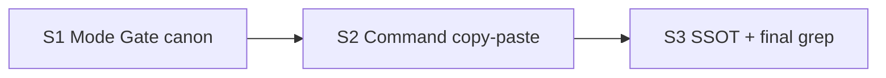

# Quality Control — Slice Coherence

**Change:** `chat-surface-clarity`  
**Date:** 2026-08-01  
**Mode:** slice (`# Срез S1`…`S3`)  
**Artifacts:** `tasks.md`, `design.md`, `proposal.md`, `specs/chat-surface-clarity/spec.md`

### Verdict

`WARNING`

### Slice Summary

| Slice | Scenario | Tasks | Acceptance | Dependencies | Gate |
|---|---|---|---|---|---|
| S1 Канон Mode Gate и зеркала | Mode Gate / эталоны / faq / без преамбулы | S1.1–S1.5 (5) | S1.accept (Primary + 1 optional; 4/4 scenarios covered) | — | `<!-- slice-gate -->` yes |
| S2 Copy-paste команд P0 | AskQuestion/handoff без Gate/Schema/slug | S2.1–S2.5 (5) | S2.accept (Primary + 1 optional; 3/3 scenarios covered) | S1 | `<!-- slice-gate -->` yes |
| S3 SSOT-конфликты и приёмка | opsx KB/агенты + финальный grep | S3.1–S3.4 (4) | S3.accept (Primary + 1 optional; 2/2 scenarios covered) | S2 | `<!-- slice-gate -->` yes |

### Scenario Coverage

| Scenario | Covered by | Status |
|---|---|---|
| Mode Gate question is product language | S1 Primary; S1.1 | OK |
| Good examples do not teach jargon | S1 Primary; S1.2 | OK |
| FAQ matches form-only Mode Gate | S1 Primary; S1.3 | OK |
| Mode question has no process preamble | S1.5; S1.accept optional | OK |
| Slice acceptance prompt without gate names | S2 Primary; S2.2 | OK |
| Review fix prompt without agent slugs | S2 Primary; S2.4 | OK |
| Status and handoff separate chat from file | S2 Primary; S2.1–S2.3, S2.5; S2.accept optional | OK |
| Entry brief excludes KB list | S3 Primary; S3.1 | OK |
| Agent names banned uniformly | S3 Primary; S3.1; S3.accept optional | OK |

Все 9 `#### Scenario:` из `specs/chat-surface-clarity/spec.md` покрыты Primary, optional accept или задачей `S<N>.<M>`.

### Dependency Graph

- Циклов нет.
- Зависимости только назад; объявлены в metadata (`S2→S1`, `S3→S2`).
- Forward acceptance dependency / дубль Primary между срезами — не обнаружены.
- Каждый срез имеет самостоятельный Primary (канон Mode Gate → шаблоны команд → SSOT+grep), согласован с `design.md` § Slices.

### Checklist evaluation (compact)

| # | Criterion | Result |
|---|---|---|
| 1 | Scenario Coverage | OK |
| 2 | Slice Independence | OK |
| 3 | Slice Completeness | OK (kit meta-change; слои 1С не требуются) |
| 4 | Slice Dependency Graph | OK |
| 5 | Slice Gate Integrity | OK (ровно один `S<N>.accept` + marker на срез) |
| 5b | Acceptance Checklist Coverage | OK (`**Primary acceptance:**` + mandatory Primary sub-bullet во всех срезах) |
| 6 | Rework Risk | WARNING — см. Alerts |
| 8 | Slice Verticality | OK (Primary — наблюдаемое отсутствие жаргона в chat-facing текстах kit; не programmatic-only API-ревью) |
| 8b | Self-Achievable Acceptance | OK |
| 9 | Foundation slice with gate | OK (S1/S2 не foundation-only: у каждого свой user-facing outcome) |
| 10 | Acceptance Simplicity | OK (один mandatory Primary на срез) |
| 11 | User Task Contract | OK (DENY-паттернов в `S<N>.<M>` нет; «вручную» в S1.1 — текст канона Mode Gate) |
| — | Task Readability | WARNING — см. Alerts |

Pre-checks from prompt (manual config / mechanical / User Task Contract grep): согласованы с оценкой; отдельных CRITICAL по ним нет.

### Alerts

#### 1. `rework-risk` — WARNING

- **Affected:** S3.4 (воздействие на файлы S1/S2)
- **Evidence:** S3.4 — «Прогнать grep-приёмку по `.cursor/**` chat-facing зонам …; исправить остатки». После slice-gate S1/S2 те же зоны (Mode Gate, apply/new AskQuestion и т.д.) могут снова правиться в S3, что обесценивает уже зафиксированную приёмку предыдущих срезов.
- **Recommendation:** сузить S3.4 до зон, не закрытых Primary S1/S2 (opsx, casebooks, gaps AskQuestion), **либо** явно зафиксировать в `design.md` / metadata S3, что финальный grep — кумулятивная приёмка change и правки «остатков» в файлах S1/S2 допустимы только как inside-change closure без повторного gate S1/S2; **либо** перенести финальный grep в optional Follow-up / в Primary каждого среза как локальную проверку своих файлов.

#### 2. `task-opaque-title` — WARNING

- **Affected:** S3.2
- **Evidence:** «Привязать AskQuestion drift/explore/verify new-req (и смежные) к decision-block…» — нет путей к конкретным SKILL/файлам; «и смежные» несамодостаточно для исполнителя.
- **Recommendation:** перечислить целевые файлы (как в `design.md`: пути AskQuestion в extend/explore/verify) и ожидаемый формат вариантов (decision-block A/B или brief-card B2).

#### 3. `slice-gate-criterion-thin` — SUGGESTION

- **Affected:** S1, S2, S3 markers `<!-- slice-gate: acceptance -->`
- **Evidence:** канон просит одно предложение критерия приёмки; сейчас общее слово `acceptance`.
- **Recommendation:** заменить на краткий критерий из Primary (например: `<!-- slice-gate: канон Mode Gate и эталоны без skill/compile в chat-facing -->`).

### Remediation (auto-repair)

### Remediation (auto-repair)
- alert: task-opaque-title
- target: tasks.md + slice S3 (S3.2)
- action: Заменить заголовок S3.2 на формулировку с явными путями, например: «В `.cursor/skills/openspec-extend-change/SKILL.md`, `.cursor/skills/openspec-explore/SKILL.md`, `.cursor/skills/openspec-verify-change/SKILL.md` (и смежные AskQuestion new-req): привязать вопросы к decision-block или brief-card B2 с русскими вариантами (Behavior Contract SSOT)».

### Remediation (auto-repair)
- alert: slice-gate-criterion-thin
- target: tasks.md + slices S1, S2, S3
- action: В каждом `<!-- slice-gate: … -->` подставить одно предложение из Primary acceptance соответствующего среза.

### Remediation (auto-repair)
- alert: rework-risk
- target: tasks.md + slice S3 (S3.4) и/или design.md § Risks
- action: Либо сузить scope S3.4 до файлов S3 (opsx, casebooks, ux-acceptance); либо добавить в тело S3.4 / design явное правило «остатки в файлах S1/S2 — только точечный grep-fix без повторного slice-gate»; либо вынести кумулятивный grep в `## Follow-up` и оставить в S3.accept только SSOT opsx/KB/агенты.

**Decision-required:** нет (`slice-accept-not-self-achievable` / merge срезов не требуется).

### Recommendations

**Automatic fix**

1. Уточнить S3.2 путями файлов (см. remediation `task-opaque-title`).
2. Расширить текст `<!-- slice-gate -->` до однострочного критерия Primary.
3. Сузить или явно ограничить S3.4 относительно файлов S1/S2 (см. remediation `rework-risk`).

**Decision required**

- Нет. Три среза с независимыми outcomes оправданы для Standard/Full kit meta-change; объединение не требуется для закрытия CRITICAL.
