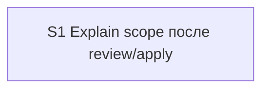

# Quality Control — explain-after-review-apply-scope

Date: 2026-08-09  
Report: `quality-control-2026-08-09-2.md` (re-run; does not overwrite `quality-control-2026-08-09.md`)  
Mode: slice (detected `# Срез S1`)  
Scope: slice coherence, scenario coverage, independence, gates, rework risk, verticality, self-achievable acceptance, foundation+gate, acceptance simplicity, User Task Contract, task readability  
Out of scope: IB executability now, test data, baseline snapshots

Manual config checklist (verify 7.5): none (kit meta-change; no Configurator markers)  
Mechanical hygiene (verify 7A–7E): consistent with prompt (checkboxes, one slice-gate, fences OK; `form_mode: n/a`)  
User Task Contract pre-check (verify 2.1a): no DENY hits in S1.1–S1.9; S1.9 ALLOW-agent

## Verdict

`OK`

## Slice Summary

| Slice | Scenario | Tasks | Acceptance | Dependencies | Gate |
|---|---|---|---|---|---|
| S1 Explain scope после review/apply | After review/apply kit offers `/opsx:explain` and B-explain shows processed-code scope before map | S1.1–S1.9 (9) | S1.accept (Primary + 3 optional; all 10 spec scenarios covered via Primary / optional / S1.\<M\> → 10/10) | нет | `<!-- slice-gate -->` present |

Notes: Standard size (9 impl + accept); single-slice default matches design `## Slices` and thresholds (6–15 → 1 slice unless independent outcomes). `**Режим apply:** mechanical`. Product BSL/Form/XML not required.

## Scenario Coverage

| Scenario | Covered by | Status |
|---|---|---|
| Review report has Explain scope | S1.1; Связь со spec | OK |
| Apply artifacts have Explain scope | S1.2; Связь со spec | OK |
| Review offers explain | S1.3; optional accept (paraphrased «Review/Apply offer explain») | OK |
| Apply offers explain | S1.4; optional accept (same paraphrased bullet) | OK |
| Trivial review skips default propose | S1.3; optional «Trivial skip» (name paraphrase) | OK |
| Prefill Охват from review | Primary; S1.6–S1.7 | OK |
| Huge release uses Варианты | Primary («или Варианты»); S1.6 | OK |
| No mass Read before confirm | Primary (карта до «да»); S1.6 (Read ≤3) | OK |
| Compact paths allowed | S1.7 (HALT / entry-brief) | OK |
| Explore still suggests explain | S1.9; optional accept (literal name) | OK |

## Dependency Graph

- Cycles: none  
- Forward acceptance dependencies: none (single slice)  
- Undeclared dependencies: none (`**Зависимости:** нет`)  
- Parallel change `independent-review-disposition`: out of scope per proposal (no cross-slice dependency declared or required)

## Checklist Results

| # | Criterion | Result |
|---|---|---|
| 1 | Scenario Coverage | Pass — all 10 `#### Scenario:` covered by Primary, optional accept, and/or agent `S1.<M>` (static «по коду kit» for explore/HALT paths) |
| 2 | Slice Independence | Pass — sole slice; acceptance does not require a later slice |
| 3 | Slice Completeness | Pass — kit skills/commands/docs layers sufficient for Primary (no product metadata/BSL/Form layer missing) |
| 4 | Slice Dependency Graph | Pass |
| 5 | Slice Gate Integrity | Pass — exactly one `S1.accept` + one `<!-- slice-gate -->` |
| 5b | Acceptance Checklist Coverage | Pass — `**Primary acceptance:**` present; mandatory `**Primary (обязательно):**` present; no foreign-slice Scenario; no uncovered Scenario (coverage via `S1.<M>` counts) |
| 6 | Rework Risk | Pass — no duplicate Primary across slices; no undeclared reliance on unaccepted predecessor |
| 8 | Slice Verticality | Pass — mandatory Primary is observable kit protocol (invoke `/opsx:explain` on artifact with `## Explain scope` → B-explain Охват/Варианты + Контекст → confirm before map), not programmatic-only API/diff accept |
| 8b | Self-Achievable Acceptance | Pass — Primary reachable via S1.1–S1.9 alone (handoff section + prefill + propose paths) |
| 9 | Foundation slice with gate | N/A — single slice |
| 10 | Acceptance Simplicity | Pass — one mandatory black-box journey; three optional bullets |
| 11 | User Task Contract | Pass — no DENY runtime-spike phrasing in S1.1–S1.9; S1.9 ALLOW-agent («Верифицировать по коду kit»); accept header «без обязательной ИБ продукта» is boundary accept metadata, not a mid-slice user spike; no «после verify/стенда» chains |

## Alerts

None at CRITICAL or WARNING.

### SUGGESTION — optional accept Scenario names vs literal spec titles

- **affected:** S1.accept optional bullets  
- **alert type:** `accept-scenario-name-alignment` (informational; not a 5b coverage miss)  
- **severity:** SUGGESTION  
- **evidence:** Spec titles are `Review offers explain`, `Apply offers explain`, `Trivial review skips default propose`. Accept uses `Scenario «Review/Apply offer explain»` and `Scenario «Trivial skip»`. Coverage remains OK via S1.3 / S1.4 / S1.3.  
- **recommendation:** Rename optional bullets to literal Scenario titles (split Review/Apply into two lines) or drop paraphrased optionals and rely on S1.3–S1.4 + Primary.

### SUGGESTION — task readability (soft)

- **affected:** S1.3, S1.5  
- **alert type:** `task-opaque-title` (soft)  
- **severity:** SUGGESTION  
- **evidence:** S1.3 leads with «В финале review/release-review…» without naming both skill files in the first clause; S1.5 is short but names `review.md`, `release-review.md`, `review-guide.md` and the outcome («когда звать explain»). Not below the 8-word floor in a harmful way.  
- **recommendation:** Optional tighten: «В `review/SKILL.md` / release-review финале: …»; leave S1.5 as-is or expand «добавить одну строку условия propose».

## Recommendations

### Automatic fix (optional, non-blocking)

- Align optional accept Scenario names with literal `#### Scenario:` titles (or remove paraphrased optionals).  
- Optional readability polish on S1.3 title.

### Decision required

- None. Slice structure is coherent; no merge, no Primary rewrite, no User Task Contract repair.

### Remediation (auto-repair)

None — no CRITICAL/WARNING repairable alerts emitted.
