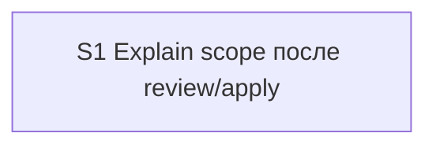

# Quality Control — explain-after-review-apply-scope

Date: 2026-08-09  
Mode: slice (detected `# Срез S1`)  
Scope: slice coherence, scenario coverage, independence, gates, rework risk, verticality, self-achievable acceptance, foundation+gate, acceptance simplicity, User Task Contract, task readability  
Out of scope: IB executability now, test data, baseline snapshots

## Verdict

`OK`

## Slice Summary

| Slice | Scenario | Tasks | Acceptance | Dependencies | Gate |
|---|---|---|---|---|---|
| S1 Explain scope после review/apply | Post-review/apply → `/opsx:explain` с Охватом из `## Explain scope` | S1.1–S1.9 (9) | S1.accept (Primary + 3 optional; spec scenarios covered via Primary / S1.\<M\> / optional ≈ 10/10) | нет | `<!-- slice-gate -->` present |

Notes: Standard tier (9 impl + accept); single-slice default correct. `**Режим apply:** mechanical`. `form_mode: n/a` (kit meta-change).

## Scenario Coverage

| Scenario | Covered by | Status |
|---|---|---|
| Review report has Explain scope | S1.1; Связь со spec | OK |
| Apply artifacts have Explain scope | S1.2; Связь со spec | OK |
| Review offers explain | S1.3; optional accept (paraphrased name) | OK |
| Apply offers explain | S1.4; optional accept (paraphrased name) | OK |
| Trivial review skips default propose | S1.3; optional «Trivial skip» (name paraphrase) | OK |
| Prefill Охват from review | Primary; S1.6–S1.7 | OK |
| Huge release uses Варианты | Primary («или Варианты»); S1.6 | OK |
| No mass Read before confirm | Primary (карта до «да»); S1.6 (Read ≤3) | OK |
| Compact paths allowed | S1.7 | OK |
| Explore still suggests explain | S1.9; optional accept (literal name) | OK |

## Dependency Graph

- Cycles: none  
- Forward acceptance dependencies: none (single slice)  
- Undeclared dependencies: none (`**Зависимости:** нет`)

## Checklist Results

| # | Criterion | Result |
|---|---|---|
| 1 | Scenario Coverage | Pass — all 10 `#### Scenario:` covered by Primary, optional accept, and/or `S1.<M>` (agent static path for explore/propose/HALT) |
| 2 | Slice Independence | Pass — sole slice; acceptance does not require a later slice |
| 3 | Slice Completeness | Pass — kit skills/commands/docs layers sufficient for Primary (no product BSL/Form/XML required) |
| 4 | Slice Dependency Graph | Pass |
| 5 | Slice Gate Integrity | Pass — exactly one `S1.accept` + one `<!-- slice-gate -->` |
| 5b | Acceptance Checklist Coverage | Pass — `**Primary acceptance:**` present; mandatory `**Primary (обязательно):**` present; no foreign-slice Scenario; no uncovered Scenario |
| 6 | Rework Risk | Pass — no duplicate Primary across slices; no undeclared reliance on unaccepted predecessor |
| 8 | Slice Verticality | Pass — mandatory Primary is black-box kit protocol (invoke explain → see B-explain Охват/Варианты + Контекст → confirm before map), not programmatic-only |
| 8b | Self-Achievable Acceptance | Pass — Primary reachable via S1.1–S1.9 alone |
| 9 | Foundation slice with gate | N/A — single slice |
| 10 | Acceptance Simplicity | Pass — one mandatory black-box journey; rest optional |
| 11 | User Task Contract | Pass — no DENY markers in S1.1–S1.9; S1.9 ALLOW-agent («верифицировать по коду kit»); no conditional «после verify/стенда»; user runtime only at `S1.accept` boundary |

Mechanical pre-check (verify 7A–7E / 2.1a): consistent with artifacts (checkboxes, slice-gate, form_mode n/a, no user-spike).

## Alerts

None at CRITICAL or WARNING.

### SUGGESTION — optional accept Scenario names vs literal spec titles

- **affected:** S1.accept optional bullets  
- **alert type:** `accept-scenario-name-alignment` (informational; not a blocking 5b miss)  
- **severity:** SUGGESTION  
- **evidence:** Spec has `#### Scenario: Review offers explain`, `Apply offers explain`, `Trivial review skips default propose`. Accept uses `Scenario «Review/Apply offer explain»` and `Scenario «Trivial skip»` (not literal). Coverage remains OK via S1.3 / S1.4.  
- **recommendation:** Rename optional bullets to literal Scenario titles (split Review/Apply into two lines) or drop paraphrased optional bullets and rely on S1.3–S1.4 + Primary.

### SUGGESTION — task readability (S1.5)

- **affected:** S1.5  
- **alert type:** `task-opaque-title` (soft)  
- **severity:** SUGGESTION  
- **evidence:** Title opens with «Одна строка в…» without a clear action verb; files and purpose are present.  
- **recommendation:** e.g. `Добавить в команды review/release-review и review-guide.md одну строку: когда предлагать /opsx:explain после ревью`.

## Recommendations

### Automatic fix

- Optional: rename S1.accept optional Scenario lines to match `#### Scenario:` literally; rephrase S1.5 with leading verb + files + outcome.

### Decision required

- None.

## Remediation (auto-repair)

No CRITICAL/WARNING alerts requiring remediation blocks.
