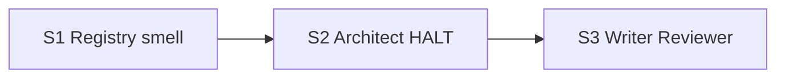

# Quality Control — Slice Coherence

**Change:** `hardcode-justification-gate`  
**Date:** 2026-08-08  
**Report:** `quality-control-2026-08-08-2.md`  
**Mode:** slice (`# Срез S1`…`S3` in `tasks.md`)  
**Context:** re-verify after repair-from-verify (S1.1b, S3.6; Primary S1/S3 expanded)  
**Lens:** kit evolution (`.cursor/` rules/agents/docs/skills) — sandbox acceptance = независимо принимаемая capability kit (чтение канона), не 1C UX/ИБ  
**Out of scope:** исполняемость приёмки на ИБ; наличие тестовых данных

---

### Verdict

**OK**

Критических и предупреждающих алертов по критериям 1–6, 8, 8b, 9–11 и task readability нет. Срезы согласованы со spec, Primary самодостижимы внутри среза после repair (S1.1b → docs-карточка AP-055; S3.6 → зеркало Phase 2.6 в `review/SKILL.md`).

---

### Slice Summary

| Slice | Scenario | Tasks | Acceptance | Dependencies | Gate |
|-------|----------|-------|------------|--------------|------|
| S1 Реестр и запах | Registry + Protocol literals + Smell Scope-as-literals | S1.1, S1.1b, S1.2, S1.3, S1.4 (5) | S1.accept (Primary + 2 optional; Registry/Smell в Primary; Protocol optional) ≈ 3/3 | нет | `<!-- slice-gate -->` present |
| S2 Architect HALT | Thin allow-list not Chosen | S2.1, S2.2, S2.3 (3) | S2.accept (1/1 + optional echo) | S1 | present |
| S3 Writer + Reviewer | Writer G21 + Completeness + Contradiction | S3.1–S3.6 (6) | S3.accept (Primary covers G21/writer; 2 optional named; Allow-list blocks writer via Primary) ≈ 3/3 | S2 | present |

**Tier:** Standard (14 agent tasks + 3 accept; Follow-up вне срезов). Три среза оправданы независимыми kit-outcomes (реестр/запах → architect HALT → writer/reviewer).

---

### Scenario Coverage

| Scenario | Covered by | Status |
|----------|------------|--------|
| Registry describes identity-filter class | S1 Primary (`S1.accept` + S1.1 / S1.1b) | OK |
| Protocol literals are out of class by default | S1.2 + S1.accept optional | OK |
| Thin allow-list is not Chosen without answers | S2 Primary + S2.accept optional | OK |
| Allow-list without design section blocks writer | S3 Primary (G21) + S3.1 / S3.2 | OK |
| Completeness matches literal count | S3 Primary + S3.accept optional + S3.3–S3.6 | OK |
| Contradiction with no-hardcode goal is blocking | S3 Primary + S3.accept optional + S3.3–S3.5 | OK |
| Smell is documented next to mechanism hierarchy | S1 Primary (Scope-as-literals + SSOT) + S1.3 / S1.4 + S1.accept optional | OK |

**Coverage:** 7/7 `#### Scenario:` из `specs/hardcode-justification-gate/spec.md`.

Agent verification path: не требуется отдельно — все Scenario закрыты Primary/optional accept или задачами правки канона (kit sandbox; не implementation-only 1C).

---

### Dependency Graph

- Циклов нет.
- Зависимости только назад (`S2 ← S1`, `S3 ← S2`); объявлены в metadata и существуют.
- Forward acceptance dependency не обнаружена: Primary каждого среза достижим задачами **этого** среза (после объявленного предыдущего gate).
- Undeclared deps: нет (S2 ссылается на AP-055 / шаблон Hardcode Justification из S1 — покрыто `**Зависимости:** S1`).

---

### Checklist evaluation

#### 1. Scenario Coverage — PASS

Все семь Scenario покрыты Primary, optional accept или `S<N>.<M>`.

#### 2. Slice Independence — PASS

Каждый срез принимаем без следующих. Зависимости только «назад».

#### 3. Slice Completeness — PASS

| Slice | Слои для Primary (kit) | Задачи | Status |
|-------|------------------------|--------|--------|
| S1 | `bsl-antipatterns.mdc` + `docs/antipatterns/bsl-antipatterns.md` + `existing-mechanism-priority.mdc` | S1.1, S1.1b, S1.2, S1.3, S1.4 | OK |
| S2 | `onec-code-architect.md` + `architect-gate.mdc` | S2.1–S2.3 | OK |
| S3 | writer + `writer.md` + reviewer + `reviewer-checks.md` + `review/SKILL.md` | S3.1–S3.6 | OK |

Repair закрыл прежние пробелы: S1.1b (полная карточка docs для Primary S1); S3.6 (`review/SKILL.md` для Primary S3).

#### 4. Slice Dependency Graph — PASS

См. граф выше. Объявления согласованы с фактическими ссылками задач.

#### 5. Slice Gate Integrity — PASS

Ровно один `S<N>.accept` и один `<!-- slice-gate -->` на срез. Legacy `S<N>.T<M>` нет.

#### 5b. Acceptance Checklist Coverage — PASS

| Check | S1 | S2 | S3 |
|-------|----|----|-----|
| `**Primary acceptance:**` metadata | yes | yes | yes |
| `**Primary (обязательно):**` in accept | yes | yes | yes |
| Spec scenarios covered | yes | yes | yes |
| Foreign scenario in accept | no | no | no |

#### 6. Rework Risk — PASS

Повторяющихся Primary-journey между срезами нет. S2/S3 опираются на предыдущие только через объявленные зависимости.

#### 8. Slice Verticality — PASS

Mandatory Primary всех срезов — black-box для kit-потребителя: открыть канон → увидеть AP-055 / Gate / G21+Phase 2.6. Не programmatic-only (не «вызвать функцию / проверить тип»).

#### 8b. Self-Achievable Acceptance — PASS

| Slice | Primary outcome | Enabling tasks in-slice | Status |
|-------|-----------------|-------------------------|--------|
| S1 | AP-055 в mdc+docs; Scope-as-literals + SSOT шаблона | S1.1, S1.1b, S1.2, S1.3, S1.4 | OK |
| S2 | Identity Filter Gate (3 вопроса); allow-list ≠ Chosen без секции | S2.1–S2.3 | OK |
| S3 | G21; Phase 2.6 N=N в reviewer + checks + review SKILL; MUST_FIX contradiction | S3.1–S3.6 | OK |

Дубля Primary S1↔S2 / S2↔S3 нет. Слой docs/`review/SKILL` больше не «только в следующем срезе».

#### 9. Foundation slice with gate — PASS

S1 имеет наблюдаемый kit-outcome (реестр + запах), не пустой foundation API. Условие «S1.accept programmatic-only + S2 UX» не выполняется.

#### 10. Acceptance Simplicity — PASS

В каждом `S<N>.accept` ровно один mandatory Primary; остальные Scenario — optional или покрыты Primary одним journey.

#### 11. User Task Contract — PASS

В `S<N>.<M>` нет DENY-маркеров (ИБ / стенд / консоль / отладчик / runtime-spike / условных «после verify»). Задачи — правка kit-файлов агентом. Приёмка на границе среза — чтение канона (допустимо для kit-sandbox). Manual config markers: не найдены (ожидаемо, `form_mode: n/a`).

#### Task Readability — PASS

Формулировки `S<N>.<M>` следуют «глагол + путь файла + изменение + зачем» с опорными ссылками (design Decision / Behavior Contract / Requirement). Opaque titles / too-short не обнаружены. Заголовки `S<N>.accept` содержат бизнес-результат среза.

---

### Alerts

*(нет)*

---

### Recommendations

**Automatic fix:** не требуется.

**Decision required:** не требуется.

**Optional hygiene (не алерт):** для сканируемости чеклиста можно явно добавить optional-буллет `Scenario «Registry describes identity-filter class»` в S1.accept и `Scenario «Allow-list without design section blocks writer»` в S3.accept — покрытие уже есть через Primary (критерий 5b OK).

---

### Mechanical pre-check (from prompt)

| Check | Result |
|-------|--------|
| Checkboxes / slice-gate | present |
| Manual config checklist markers | none |
| User Task Contract DENY in `S<N>.<M>` | none |
| Repository targets exist (antipatterns docs, review SKILL, writer.md) | assumed present per prompt |
