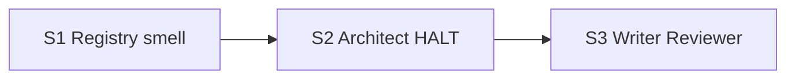

# Quality Control — Slice Coherence

**Change:** `hardcode-justification-gate`  
**Date:** 2026-08-08  
**Mode:** slice (`# Срез S1`…`S3` in `tasks.md`)  
**Lens:** kit evolution (`.cursor/` rules/agents/docs) — приёмка = независимо наблюдаемая capability kit (чтение/grep канона), не 1C UX на ИБ  
**Artifacts:** `tasks.md`, `design.md`, `proposal.md`, `specs/hardcode-justification-gate/spec.md`  
**Pre-checks (orchestrator):** User Task Contract DENY — none; mechanical checkboxes/gates — OK; form_mode: n/a; manual config markers — none

---

### Verdict

`OK`

Критических алертов нет. Все семь `#### Scenario:` из spec покрыты. Срезы независимы при приёмке, зависимости только назад, Primary достижим внутри каждого среза, User Task Contract соблюдён.

---

### Slice Summary

| Slice | Scenario | Tasks | Acceptance | Dependencies | Gate |
|-------|----------|-------|------------|--------------|------|
| S1 Реестр и запах | AP-055 + Scope-as-literals + шаблон Hardcode Justification | S1.1–S1.4 (4) | `S1.accept` (3/3: Primary + 2 optional Scenario) | нет | `<!-- slice-gate -->` yes |
| S2 Architect HALT | Identity Filter Gate до Chosen allow-list | S2.1–S2.3 (3) | `S2.accept` (2/1: Primary + optional того же Scenario) | S1 | yes |
| S3 Writer + Reviewer | G21 + Phase 2.6 completeness + MUST_FIX contradiction | S3.1–S3.5 (5) | `S3.accept` (3/3: Primary + 2 optional Scenario) | S2 | yes |

**Notes:** Follow-up вне срезов (опциональный grep post-apply) — корректно. Ровно один `S<N>.accept` и один `<!-- slice-gate -->` на срез.

---

### Scenario Coverage

| Scenario | Covered by | Status |
|----------|------------|--------|
| Registry describes identity-filter class | S1 Primary + S1.1 | OK |
| Protocol literals are out of class by default | S1.accept optional + S1.2 | OK |
| Thin allow-list is not Chosen without answers | S2 Primary + S2.1 (+ optional в S2.accept) | OK |
| Allow-list without design section blocks writer | S3 Primary + S3.1 | OK |
| Completeness matches literal count | S3.accept optional + S3.4 | OK |
| Contradiction with no-hardcode goal is blocking | S3.accept optional + S3.3 | OK |
| Smell is documented next to mechanism hierarchy | S1.accept optional + S1.3 | OK |

**Coverage:** 7/7. Пробел design-stage QC по «Protocol literals…» закрыт задачами S1.2 и optional accept.

---

### Dependency Graph

- Циклов нет.
- Объявленные зависимости существуют (`S2 → S1`, `S3 → S2`).
- Forward acceptance dependency нет: Primary каждого среза не дублирует journey следующего и не требует файлов/задач более позднего среза.
- Undeclared deps: нет (S2 ссылается на AP-055/шаблон из S1 — совпадает с объявленной зависимостью).

---

### Checklist evaluation

#### 1. Scenario Coverage

Все Scenario из `specs/**/spec.md` покрыты Primary, optional accept или `S<N>.<M>`. Implementation-only Scenario с отдельным accept без самостоятельного outcome — нет. User IB/runtime spike для verification — нет (kit: чтение канона / agent static).

#### 2. Slice Independence

Каждый срез принимаем без следующих. Цепочка S1→S2→S3 — допустимые зависимости «назад».

#### 3. Slice Completeness

Для kit-sandbox слои = целевые файлы:

| Slice | Нужно для Primary | Задачи | Status |
|-------|-------------------|--------|--------|
| S1 | `bsl-antipatterns.mdc`, `existing-mechanism-priority.mdc` (+ шаблон секции) | S1.1–S1.4 | OK |
| S2 | `onec-code-architect.md`, `architect-gate.mdc` | S2.1–S2.3 | OK |
| S3 | `onec-code-writer.md`, `onec-code-reviewer.md`, `reviewer-checks.md` | S3.1–S3.5 | OK |

#### 4. Slice Dependency Graph

Метаданные `**Зависимости:**` согласованы с графом. Циклов и ссылок на несуществующие срезы нет.

#### 5. Slice Gate Integrity

| Slice | `S<N>.accept` count | `<!-- slice-gate -->` | Status |
|-------|---------------------|----------------------|--------|
| S1 | 1 | 1 | OK |
| S2 | 1 | 1 | OK |
| S3 | 1 | 1 | OK |

Legacy `S<N>.T<M>` — нет.

#### 5b. Acceptance Checklist Coverage

- `**Primary acceptance:**` в metadata S1/S2/S3 — есть → нет `primary-acceptance-missing`.
- Mandatory `**Primary (обязательно):**` в теле каждого accept — есть → нет `accept-checklist-empty`.
- Все Scenario spec покрыты → нет `accept-bullets-missing-scenario`.
- Чужих Scenario в accept нет → нет `accept-bullet-foreign-scenario`.
- Blocking для `[x]` — один Primary на срез; optional помечены «(опционально)».

#### 6. Rework Risk

Низкий. Срезы опираются только на объявленных предшественников. Дублирования Scenario между срезами как Primary нет. S2 optional уточняет ссылку на AP-055/Hardcode Justification из S1 — ожидаемо при `Зависимости: S1`.

#### 8. Slice Verticality / Acceptance Observability

Семантическая оценка (kit lens): Primary описывает наблюдаемый исход для потребителя kit — открыть поставленный артефакт и увидеть норму / HALT / gate / completeness, а не вызов API / тип возврата / код-ревью контракта как единственную приёмку.

| Slice | Mandatory Primary | Black-box kit capability? |
|-------|-------------------|---------------------------|
| S1 | Реестр AP-055 + запах/отсылка Hardcode Justification в rules | Да |
| S2 | Identity Filter Gate (3 вопроса); allow-list без секции ≠ Chosen | Да |
| S3 | G21 в writer; Phase 2.6 + completeness; contradiction → MUST_FIX | Да |

**`slice-not-vertical` — не срабатывает.**

#### 8b. Self-Achievable Acceptance

- S1 Primary достижим S1.1–S1.4 (оба целевых rules-файла в срезе).
- S2 Primary достижим S2.1–S2.3 (architect agent + architect-gate); не заимствует Primary S3.
- S3 Primary достижим S3.1–S3.5; не требует задач S4+.
- Дубля Primary между соседними срезами нет.

**`slice-accept-not-self-achievable` — не срабатывает.**

#### 9. Foundation slice with gate

Структурно: S2 depends S1, S3 depends S2 — да.  
Семантически: S1.accept — самостоятельная нормативная capability (реестр + запах), не programmatic-only foundation под UX S2. S2/S3 — следующие process capabilities каркаса, не единственный «видимый» исход поверх пустого API S1.

**`slice-foundation-with-gate` — не срабатывает.** Merge срезов не требуется.

#### 10. Acceptance Simplicity

В каждом `S<N>.accept` ровно один mandatory Primary sub-bullet (составные проверки через «и» внутри одного journey). Остальные Scenario — optional или agent `S<N>.<M>`.

**`acceptance-simplicity-overload` — не срабатывает.**

#### 11. User Task Contract

Строки `S<N>.<M>`: правки `.cursor` rules/agents/docs агентом; DENY-маркеры (ИБ/стенд/консоль/отладчик/API-spike) и repair-цепочки «после verify/стенда» — отсутствуют. Приёмка — `S<N>.accept` (чтение канона). Follow-up — вне срезов.

**`user-task-contract-violation` — не срабатывает.**

---

### Task Readability

Паттерн «глагол + файл + изменение + зачем + (опорная ссылка)» соблюдён для S1.1–S1.4, S2.1–S2.3, S3.1–S3.5. Заголовки accept содержат бизнес-результат среза. Opaque titles / too-short / bare Decision IDs — не найдены.

**SUGGESTION (cosmetic):** в S2.accept optional Scenario совпадает с Primary того же Scenario — избыточно, но не нарушает покрытие и не блокирует.

---

### Alerts

Нет CRITICAL / WARNING.

#### SUGGESTION

1. **`accept-optional-redundant`** (cosmetic, S2)  
   - **Affected:** `S2.accept` optional bullet Scenario «Thin allow-list is not Chosen without answers»  
   - **Evidence:** тот же Scenario уже закрыт mandatory Primary  
   - **Recommendation:** оставить как уточнение HALT↔AP-055 или свернуть optional в одну строку Primary; не обязательно

---

### Recommendations

| Class | Action |
|-------|--------|
| **Automatic fix** | Не требуется |
| **Decision required** | Нет — объединение срезов не нужно |
| **Apply** | Можно идти по срезам S1 → gate → S2 → gate → S3 |

**One-line recommendation:** accept slices as-is; proceed to apply.

---

### Remediation (auto-repair)

Нет repairable CRITICAL/WARNING алертов — блок remediation пуст.
