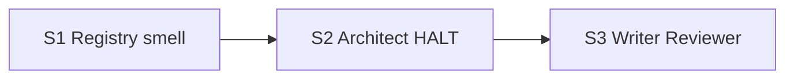

# Quality Control — Slice Coherence (Quick / Slice Generation Gate)

**Change:** `hardcode-justification-gate`  
**Date:** 2026-08-08  
**Mode:** design-stage (`## Slices` in `design.md`; `tasks.md` отсутствует)  
**Scope:** criteria 1, 3, 5, 5b, 8, 8b, 9–11 only  
**Lens:** kit evolution (`.cursor/` rules/agents/docs) — sandbox acceptance = независимо принимаемая capability kit, не 1C UX-journey  
**Criterion 8:** semantic judgment only (no keyword grep)

---

### Verdict

**PASS**

Критических алертов `slice-foundation-with-gate`, `slice-not-vertical`, `slice-accept-not-self-achievable`, `acceptance-simplicity-overload`, `user-task-contract-violation`, `primary-acceptance-missing`, `accept-checklist-empty` нет.  
`scenario-implementation-leak` в `THEN` spec — не найден.

---

### Slice Summary

| Slice | Scenario (design) | Tasks | Acceptance (planned) | Dependencies | Gate |
|-------|-------------------|-------|----------------------|--------------|------|
| S1 Реестр и запах | AP-055 + Scope-as-literals | n/a (pre-tasks) | Primary: реестр AP-055 + запах/отсылка в existing-mechanism | — | planned (tasks gen) |
| S2 Architect HALT | Identity Filter Gate / Chosen | n/a | Primary: HALT из 3 вопросов; allow-list без секции ≠ Chosen | S1 | planned |
| S3 Writer + Reviewer | G21 + Phase 2.6 + contradiction | n/a | Primary: G21 + Phase 2.6 N=N + MUST_FIX contradiction | S2 | planned |

**Note (criterion 5):** при отсутствии `# Срез` / `S<N>.accept` / `<!-- slice-gate -->` в `tasks.md` целостность gate оценивается по плану в `## Slices`: у каждого среза есть заполненный **Primary acceptance** → OK для Slice Generation Gate. Механическая проверка одного `accept` + маркера — после генерации `tasks.md`.

---

### Scenario Coverage

| Scenario (spec) | Covered by (design matrix / Primary) | Status |
|-----------------|--------------------------------------|--------|
| Registry describes identity-filter class | S1 Primary | OK |
| Protocol literals are out of class by default | — | WARNING — не в матрице `## Slices` |
| Thin allow-list is not Chosen without answers | S2 Primary | OK |
| Allow-list without design section blocks writer | S3 Primary | OK |
| Completeness matches literal count | S3 Primary | OK |
| Contradiction with no-hardcode goal is blocking | S3 Primary | OK |
| Smell is documented next to mechanism hierarchy | S1 Primary | OK |

**Coverage:** 6/7 явных; 1 Scenario без строки в матрице (см. Alerts).

---

### Dependency Graph



- Циклов нет.
- Зависимости только назад (S2←S1, S3←S2).
- Forward acceptance dependency не обнаружена: Primary каждого среза достижим артефактами своего среза.

---

### Checklist evaluation (requested criteria)

#### 1. Scenario Coverage

Шесть из семи `#### Scenario:` привязаны к срезу через матрицу / Primary.  
Пробел: **Protocol literals are out of class by default** — относится к Requirement реестра (S1), но в матрице и тексте Primary S1 не назван. По смыслу AP-055 должен провести границу «не путать с протоколом» (см. design Risks), но QC фиксирует отсутствие явного покрытия.

#### 3. Slice Completeness

Для kit-sandbox приёмки слои = целевые файлы kit:

| Slice | Нужные артефакты для Primary | В design «Файлы (ядро)» | Status |
|-------|------------------------------|-------------------------|--------|
| S1 | `bsl-antipatterns`, `existing-mechanism-priority` (+ шаблон/отсылка) | да | OK |
| S2 | `onec-code-architect`, `architect-gate` | да | OK |
| S3 | `onec-code-writer`, `onec-code-reviewer`, `reviewer-checks` | да | OK |

Пропусков слоёв, без которых Primary недостижим, нет.

#### 5. Slice Gate Integrity

`tasks.md` нет → маркеры `S<N>.accept` / `<!-- slice-gate -->` не проверяются.  
План: 3 среза × 1 Primary → при генерации tasks ожидается ровно один accept + gate на срез. **Не CRITICAL** на этапе design.

#### 5b. Acceptance Checklist Coverage

- `**Primary acceptance:**` для S1/S2/S3 в таблице `## Slices` — есть → нет `primary-acceptance-missing`.
- Тела `S<N>.accept` ещё нет → `accept-checklist-empty` N/A (hint для tasks: mandatory Primary sub-bullet).
- `accept-bullets-missing-scenario`: WARNING по Protocol literals (нигде в матрице / Primary).
- Foreign scenarios между срезами — нет.

#### 8. Slice Verticality / Acceptance Observability (semantic, kit lens)

Приёмка kit = открыть поставленные `.cursor` артефакты / прогнать агентский контракт в sandbox и увидеть норму/HALT/полноту аудита.

| Slice | Primary (essence) | Black-box kit capability? |
|-------|-------------------|---------------------------|
| S1 | В реестре есть AP-055; в existing-mechanism — Scope-as-literals и отсылка к обоснованию | Да — независимо наблюдаемый нормативный слой kit |
| S2 | В agent/rules есть Identity Filter Gate (3 вопроса); allow-list без секции не Chosen | Да — наблюдаемый запрет Chosen без justification |
| S3 | G21 у writer; Phase 2.6 с completeness; contradiction → MUST_FIX | Да — наблюдаемый apply-time enforcement |

Нет среза, у которого единственный mandatory Primary — programmatic-only («вызвать функцию / тип возврата / код-ревью контракта API» без наблюдаемого kit-эффекта).  
**`slice-not-vertical` — не срабатывает** (при kit/sandbox lens, как задано в запросе).

#### 8b. Self-Achievable Acceptance

- S1 Primary не заимствует journey S2/S3.
- S2 Primary (HALT architect) ≠ Primary S3 (writer/reviewer).
- Слой файлов для каждого Primary лежит в задачах того же среза (по design).
- **`slice-accept-not-self-achievable` — не срабатывает.**

#### 9. Foundation slice with gate

Структурно: S2 depends S1, S3 depends S2 — да.  
Семантически (kit): S1.accept — не «пустой foundation без capability», а самостоятельная норма (реестр + запах), принимаемая без S2/S3. S2/S3 — следующие независимые process capabilities, не единственный UX поверх API S1.  
Классический антипаттерн foundation (API без UX → gate → consumer UX) **не применим** к этой декомпозиции при заявленном kit lens.  
**`slice-foundation-with-gate` — не срабатывает.**

#### 10. Acceptance Simplicity

В колонке Primary acceptance — **одна** строка-journey на срез (составные проверки через «и», не несколько mandatory journeys).  
Матрица помечает несколько Scenario как «Primary» у S1 (2) и S3 (3) — риск при генерации tasks превратить все в mandatory sub-bullets.  
**CRITICAL overload сейчас нет**; WARNING-hint для tasks: один blocking Primary, остальные — optional / `S<N>.<M>`.

#### 11. User Task Contract

User-spike в Risks / Slices нет («на ИБ», «в консоли», условные «после стенда»). Runtime-spike задач `S<N>.<M>` — N/A без tasks.  
**OK.**

#### scenario-implementation-leak (Foundation Slice Guard companion)

Проверка `- **THEN**` в spec на маркеры openspec-specs-gate (`функция возвращает`, `метод вызывает`, `возвращает структуру`, …): **совпадений нет.**

THEN описывают наблюдаемые исходы kit-процесса (норма в реестре, Chosen заблокирован, writer не продолжает, строки таблицы ревью, MUST_FIX) — допустимо для эволюции kit.

---

### Alerts

#### WARNING

1. **`accept-bullets-missing-scenario` / scenario coverage gap** (criteria 1, 5b)  
   - **Affected:** Scenario «Protocol literals are out of class by default»; целевой срез S1  
   - **Evidence:** есть в `specs/.../spec.md`; отсутствует в матрице `## Slices` и в тексте Primary S1  
   - **Recommendation:** добавить в матрицу S1 (optional или agent `S1.<M>` «верифицировать по тексту AP-055 границу протокола») и/или одну фразу в Primary/optional accept S1

2. **`acceptance-simplicity` pre-hint** (criterion 10, tasks generation)  
   - **Affected:** S1 (2 Scenario как Primary в матрице), S3 (3)  
   - **Evidence:** матрица vs одна строка Primary acceptance  
   - **Recommendation:** при генерации `tasks.md` — один mandatory Primary sub-bullet; остальные Scenario — `(опционально)` или static `S<N>.<M>`

#### SUGGESTION

3. **Criterion 5 deferred** — после генерации `tasks.md` повторно проверить ровно один `S<N>.accept` + `<!-- slice-gate -->` на срез.

---

### Recommendations

| Class | Action |
|-------|--------|
| **Automatic / minor tweak** | Дописать Scenario «Protocol literals…» в матрицу S1 (и optional/agent coverage). |
| **Tasks generation** | Один mandatory Primary на срез; не размножать blocking journeys по числу Primary-ячеек матрицы. |
| **Decision required** | Нет — merge срезов не требуется. |

**One-line recommendation:** **accept slices as-is** (опционально minor design tweak: Protocol literals → S1 coverage).

---

### Remediation (auto-repair)

```markdown
### Remediation (auto-repair)
- alert: accept-bullets-missing-scenario
- target: design.md ## Slices (S1) + future tasks.md S1.accept / S1.<M>
- action: В матрицу приёмки добавить строку «Protocol literals are out of class by default | S1 (optional или S1.M static)»; в AP-055 / Primary S1 явно зафиксировать границу «литералы протокола/enum вне класса по умолчанию».
```
