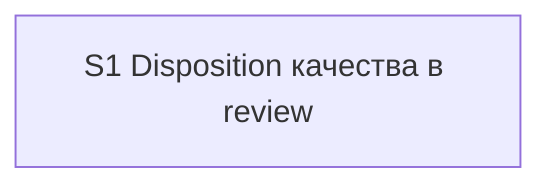

# Quality Control — Slice Coherence

**Change:** `independent-review-disposition`  
**Date:** 2026-08-09  
**Pass:** verify Layer 2 (re-run; file `quality-control-2026-08-09-2.md`)  
**Mode:** slice (`# Срез S1`)  
**Domain note:** kit meta-change (docs/skills/agents/commands); критерии слоёв метаданных/форм/BSL продукта не применялись. Product cf/cfe не затрагивается.

### Verdict

`OK`

### Slice Summary

| Slice | Scenario | Tasks | Acceptance | Dependencies | Gate |
|---|---|---|---|---|---|
| S1 Disposition качества в review | Primary: weak + disposition UX на `/review`; optional: prerelease protocol, guide, apply carve-out | S1.1–S1.11 (11) + S1.accept; все `[ ]` | S1.accept (1 Primary + 3 optional; named Scenario bullets 3; Primary covers ≥3 journeys) | нет | `<!-- slice-gate -->` present |

Tier: Standard (12 чекбоксов включая accept) → один срез по умолчанию — согласовано с порогом.

### Scenario Coverage

| Scenario | Covered by | Status |
|---|---|---|
| Design endorses weak pattern | Primary; S1.1, S1.2 | OK |
| Design-prescribed anti-pattern | S1.1, S1.3 (agent; не в accept) | OK |
| Prompt framing | S1.2, S1.5 | OK |
| Ordinary review disposition | Primary; S1.5 | OK |
| Prerelease same protocol | S1.accept optional; S1.5, S1.7 | OK |
| As-designed recorded | Primary; S1.6 | OK |
| Queue-fix routed | S1.5 (шаг 6), S1.6, S1.10 | OK |
| Release-hygiene remains | S1.7 | OK |
| Guide updated | S1.accept optional; S1.8 | OK |
| Apply speed preserved | S1.accept optional (combined bullet); S1.9 | OK |
| Weak not silently waived in apply | S1.accept optional (combined bullet); S1.9 | OK |

Все 11 `#### Scenario:` из `specs/review-quality-disposition/spec.md` покрыты Primary, optional accept и/или `S1.<M>` (в т.ч. static «верифицировать по коду kit» — S1.4, S1.11). Пропусков покрытия нет.

### Dependency Graph

- Один срез; `**Зависимости:** нет`.
- Циклов, forward-зависимостей приёмки и необъявленных slice-to-slice связей нет.
- Внутри среза порядок групп 1→2→3 (контракт ревьюера → skill disposition → памятка/стыки) — линейный apply-порядок, не отдельные gates.

**Замечание к design (не CRITICAL):** `design.md` § Migration Plan формулирует «Сначала S1 … затем S2 … затем S3», тогда как `## Slices` и `tasks.md` содержат **только** срез S1 (волны = группы задач внутри одного среза). Это не нарушение достижимости приёмки и не missing S2/S3 — см. Alerts SUGGESTION.

### Checklist evaluation (compact)

| # | Criterion | Result |
|---|---|---|
| 1 | Scenario Coverage | PASS — 11/11 |
| 2 | Slice Independence | PASS — один срез |
| 3 | Slice Completeness | PASS — для kit: агент, шаблоны, checks, skill, команды, guide, delegation, extend; product BSL/forms/n/a |
| 4 | Dependency Graph | PASS |
| 5 | Slice Gate Integrity | PASS — ровно один `S1.accept` + `<!-- slice-gate -->` |
| 5b | Acceptance Checklist Coverage | PASS — Primary metadata + mandatory Primary sub-bullet; rule 6 соблюдён |
| 6 | Rework Risk | PASS (см. SUGGESTION по Migration Plan naming) |
| 8 | Slice Verticality | PASS — Primary = наблюдаемый протокол `/review` (black-box для kit UX), не programmatic-only accept |
| 8b | Self-Achievable Acceptance | PASS — Primary достижим силами S1.1–S1.11; второго среза нет |
| 9 | Foundation + gate | N/A — нет зависимого consumer-среза |
| 10 | Acceptance Simplicity | PASS — один mandatory Primary; остальное optional |
| 11 | User Task Contract | PASS — DENY-маркеров в S1.1–S1.11 нет; S1.4/S1.11 ALLOW-agent; runtime-приёмка только в `S1.accept` |

Mechanical pre-checks (verify 7A–7E / 2.1a / 7.5): согласованы с артефактами — без расхождений. Маркеров ручной конфигурации Конфигуратора нет; `form_mode: n/a`.

### Alerts

#### SUGGESTION — design-migration-slice-naming

- **Affected:** `design.md` § Migration Plan vs `tasks.md` / `design.md` § Slices  
- **Severity:** SUGGESTION  
- **Evidence:** Migration Plan: «Сначала S1 (агент+шаблоны+checks), затем S2 (skill), затем S3 (docs/стыки)»; в tasks только `# Срез S1` с группами `## 1`–`## 3`.  
- **Recommendation:** переименовать волны Migration Plan в «волна A/B/C» или «группы 1–3 внутри S1», чтобы не провоцировать ложную декомпозицию на отдельные срезы с gates.

#### SUGGESTION — task-opaque-title (S1.6)

- **Affected:** `tasks.md` S1.6  
- **Severity:** SUGGESTION  
- **Evidence:** «Описать формат секции Disposition в main report…» — глагол без явного пути файла skill в заголовке.  
- **Recommendation:** уточнить: `В review/SKILL.md: описать формат секции Disposition в main report и опциональный review-queue-*.md …`.

#### SUGGESTION — accept-optional-scenario-name

- **Affected:** `tasks.md` S1.accept optional bullet  
- **Severity:** SUGGESTION  
- **Evidence:** optional `Scenario «Apply speed / weak not waived»` объединяет два имени; в spec буквально: `Apply speed preserved` и `Weak not silently waived in apply`. Покрытие сценариев есть (S1.9 + этот optional), foreign-scenario нет.  
- **Recommendation:** при желании точности — два optional-буллета с буквальными именами из spec либо оставить coverage только через S1.9 без комбинированного имени.

### Recommendations

**Automatic fix (опционально, не блокирует):**

- Переименовать волны в `design.md` Migration Plan (S2/S3 → группы внутри S1).
- Дописать путь `review/SKILL.md` в заголовок S1.6.
- (опц.) Развести optional accept на буквальные имена Scenario из spec.

**Decision required:**

- Нет.

### Remediation (auto-repair)

CRITICAL/WARNING с auto-repair remediation не эмитированы — блок не применяется.

### Diff vs prior QC (`quality-control-2026-08-09.md`)

Повторный прогон на тех же артефактах: verdict `OK` подтверждён; новых CRITICAL/WARNING нет. Добавлен SUGGESTION по имени комбинированного optional-буллета в accept (покрытие сценариев по-прежнему OK).
