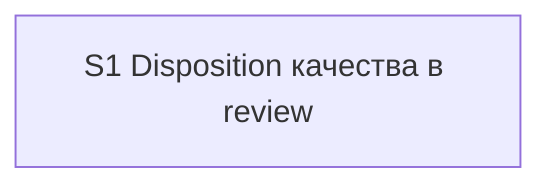

# Quality Control — Slice Coherence

- change: `independent-review-disposition`
- date: 2026-08-09
- mode: slice
- artifacts: `tasks.md`, `design.md`, `proposal.md`, `specs/review-quality-disposition/spec.md`
- context: after verify-repair (D8/D9 in design; Migration Plan = waves inside S1)

## Verdict

`OK`

## Slice Summary

| Slice | Scenario | Tasks | Acceptance | Dependencies | Gate |
|---|---|---|---|---|---|
| S1 Disposition качества в review | Independent quality flag + as-designed / queue-fix on `/review` (all scenarios of `review-quality-disposition`) | S1.1–S1.11 (11) | S1.accept (Primary + 3 optional; scenarios covered via Primary / optional / S1.\<M\>) | нет | `<!-- slice-gate -->` present |

Tier: Standard (12 checklist items incl. accept) → one slice by default; design Migration Plan keeps waves inside S1 (no false S2/S3). Aligns with thresholds.

## Scenario Coverage

| Scenario | Covered by | Status |
|---|---|---|
| Design endorses weak pattern | Primary (metadata + S1.accept); S1.1, S1.3, S1.11 | OK |
| Design-prescribed anti-pattern | S1.1, S1.3, S1.11 | OK |
| Prompt framing | S1.2, S1.5 | OK |
| Ordinary review disposition | Primary; S1.5 | OK |
| Prerelease same protocol | S1.accept optional; S1.7 | OK |
| As-designed recorded | Primary; S1.5, S1.6 | OK |
| Queue-fix routed | S1.5, S1.6, S1.10 | OK |
| Release-hygiene remains | S1.7 | OK |
| Guide updated | S1.accept optional; S1.8 | OK |
| Apply speed preserved | S1.9; S1.accept optional (paraphrase) | OK |
| Weak not silently waived in apply | S1.9; S1.accept optional (paraphrase) | OK |

All 11 `#### Scenario:` from spec are covered in at least one of Primary / optional accept / `S1.<M>`.

## Dependency Graph

- Single slice; `**Зависимости:** нет`.
- No cycles, no forward acceptance dependency, no undeclared cross-slice edges.
- Internal task order (groups 1→2→3) matches design Migration Plan waves; not slice-to-slice deps.

## Checklist Evaluation

| # | Criterion | Result |
|---|---|---|
| 1 | Scenario Coverage | Pass — all scenarios covered |
| 2 | Slice Independence | Pass — single slice, acceptible without later slices |
| 3 | Slice Completeness | Pass — kit meta-change layers (agent, templates, skill, commands, guide, delegation/extend) present for Primary |
| 4 | Slice Dependency Graph | Pass — declared none; consistent |
| 5 | Slice Gate Integrity | Pass — exactly one `S1.accept` + `<!-- slice-gate -->` |
| 5b | Acceptance Checklist Coverage | Pass — `**Primary acceptance:**` present; mandatory Primary sub-bullet present; no foreign-slice bullets |
| 6 | Rework Risk | Low — waves inside S1; no competing slice outcomes |
| 8 | Slice Verticality | Pass — Primary is black-box protocol journey (`/review` → disposition UX → as-designed skips writer) |
| 8b | Self-Achievable Acceptance | Pass — Primary achievable by S1.1–S1.11 alone; no S2 |
| 9 | Foundation slice with gate | N/A — no dependent consumer slice |
| 10 | Acceptance Simplicity | Pass — one mandatory Primary; others marked optional |
| 11 | User Task Contract | Pass — no DENY runtime-spike in `S1.<M>`; S1.4/S1.11 are agent «верифицировать по коду»; mechanical DENY grep clean |

## Task Readability

| Task | Assessment |
|---|---|
| S1.1–S1.6, S1.8, S1.10–S1.11 | Verb + file/path + outcome + design refs (D2/D8/D9) — OK |
| S1.7 | Outcome clear; verb slightly implicit («одна строка-указатель») — acceptable |
| S1.9 | Starts with adverb «Точечно» rather than action verb — minor; object and carve-out intent clear |
| S1.accept | Business outcome in title; Primary mandatory; optional bullets present |

No `task-opaque-title` / `task-too-short` at WARNING level.

## Alerts

None at CRITICAL or WARNING.

### SUGGESTION (non-blocking)

1. **accept-optional-scenario-name** — S1.accept optional bullet `Scenario «Apply speed / weak not waived»` does not literally match spec titles `Apply speed preserved` and `Weak not silently waived in apply`. Coverage already OK via S1.9; rename/split for literal match or drop the optional bullet.
2. **metadata-scenario-list** — `**Связь со spec:**` names some scenarios explicitly and others only by Requirement. Optional polish: list all 11 Scenario titles for navigability (not a coverage defect).

## Recommendations

### Automatic fix

- None required for CRITICAL/WARNING.
- Optional: rename S1.accept optional bullet to literal Scenario names (alert SUGGESTION 1).

### Decision required

- None. Single-slice decomposition matches design Slices + Migration Plan (waves inside S1). Keep as-is for apply.

## Remediation (auto-repair)

_Not applicable — no CRITICAL/WARNING repairable alerts._
