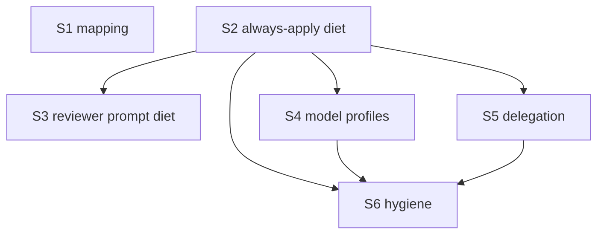

# Quality Controller — Slice Coherence (re-check)

- Change: `kit-evolution-models-economy-profiles`
- Date: 2026-08-16
- Report: `quality-control-2026-08-16-2.md` (second pass after extend)
- Mode: slice (`# Срез S1`…`# Срез S6` present)
- Domain: kit metaproject (Cursor rules/skills/agents; no 1C IB). Primaries observed in a Cursor session are treated as black-box.
- Prior pass: `reports/quality-control-2026-08-16.md` (WARNING: undeclared S1→S4). This pass re-checks independence after S4 Primary was narrowed.

## Verdict

`OK`

Previous WARNING `undeclared-dependency` (S4 Primary named the live architect slug written only in S1) is **closed**. S4 mandatory journey is now Grok-session + three constitutional conflicts; it does not require a live `Task` with the Opus 5 slug. No critical gate, verticality, self-achievable, foundation, simplicity, or user-spike defects. All **35** spec scenarios are covered (Primary, optional accept, or an in-slice task).

## Slice Summary

| Slice | Scenario | Tasks | Acceptance | Dependencies | Gate |
|---|---|---|---|---|---|
| S1 Живой мэппинг моделей | Делегирование на живые модели; Fable только закрытая эскалация | 11 + accept | S1.accept (7 named / 9 in «Связь со spec»; 2 via S1.9, S1.10) | нет | `<!-- slice-gate -->` present |
| S2 Диета always-apply | Постоянный контекст дешевле; гейты срабатывают | 19 + accept | S2.accept (4 named / 6 in «Связь со spec»; 2 via S2.10, S2.17) | нет | `<!-- slice-gate -->` present |
| S3 Диета промпта reviewer | Ревью дешевле при том же покрытии чек-листов | 7 + accept | S3.accept (2/2) | S2 | `<!-- slice-gate -->` present |
| S4 Профили моделей | Чат на Grok 4; субагенты Fable/GPT/Opus; гейты не ослабляются | 12 + accept | S4.accept (5 bullets; 7/7 — 3 conflicts inside Primary) | S2 only (S1 no longer required for Primary) | `<!-- slice-gate -->` present |
| S5 Усиление делегирования | Обследование 1С → проектный explorer; intent-брифы | 8 + accept | S5.accept (5 named / 7 in «Связь со spec»; 3 via S5.5, S5.6, S5.8) | S2 | `<!-- slice-gate -->` present |
| S6 Гигиена свода | Самоописание on-demand; пол безопасности; рудименты убраны | 10 + accept | S6.accept (4/4; Primary = Scenario «Правка контракта Экспорт-процедуры в Light Mode») | S2, S4, S5 | `<!-- slice-gate -->` present |

Notes:

- `form_mode: n/a`. Manual Configurator / form-attribute markers: none. Completeness does not require metadata/form/BSL layers.
- S3 has no own delta spec (design: extends `always-apply-context-budget`). Intentional.
- `openspec/glossary.md` exists (D12). `openspec/project.md` absent in kit-repo — tasked in S2.15–S2.16, not a slice-plan defect.
- New profile files and the reviewer fixture are created by tasks (recipe, not a pre-apply plan defect).
- Count: 67 implementation tasks + 6 accept = Full tier; six independent user-visible outcomes — split is justified.

## Scenario Coverage

Coverage rule used: a `#### Scenario:` is covered if it appears in Primary, an optional accept bullet, or an in-slice `S<N>.<M>` (criterion 5b). Named accept bullet is not required when a task already owns the scenario.

Total `#### Scenario:` in `specs/**/spec.md`: **35** (prior pass counted 34 and omitted «Якорь apply-reviewer после выноса процедуры» from the coverage table; that scenario is in spec and in S2 «Связь со spec»).

### subagent-model-mapping → S1 (9)

| Scenario | Covered by | Status |
|---|---|---|
| Вызов архитектора без ошибки enum | S1 Primary | OK |
| Команда на Grok 4 без смены чата | S1.accept optional | OK |
| Рантайм свободен от мёртвых слагов | S1.9 (search; not a named accept bullet) | OK (task path) |
| Слаг таблицы отсутствует в enum сборки | S1.accept optional | OK |
| Сбой Primary | S1.accept optional | OK |
| Согласованность описаний цепочки | S1.10 (search + align; not a named accept bullet) | OK (task path) |
| Декомпозиция срезов не идёт на Fable | S1.accept optional | OK |
| Независимый разбор постановки идёт на Fable | S1.accept optional | OK |
| Сбой Opus не включает Fable | S1.accept optional | OK |

### always-apply-context-budget → S2, S3, S5 (9)

| Scenario | Covered by | Status |
|---|---|---|
| Замер после диеты | S2.19 + S2.accept optional | OK |
| Контрольный замер после дописывания delegation | S5.8 (placed in S5 by D6; in S5 «Связь со spec», not in S5.accept) | OK (task path) |
| Обязательство-diff без непокрытых строк | S2.18 + S2.accept optional | OK |
| Поведенческий smoke в чистом окне | S2 Primary | OK |
| Якорь apply-reviewer после выноса процедуры | S2.10 (дословный минимум carve-out в delegation; not a named accept bullet) | OK (task path) |
| Потребители ссылаются на нового владельца | S2.12 + S2.accept optional | OK |
| Полнота чек-листов после диеты | S3.7 + S3.accept optional | OK |
| Evidence-строка в отчёте | S3 Primary | OK |
| Порог целостности поставки актуален | S2.17 (not a named accept bullet) | OK (task path) |

### chat-model-profiles → S4 (7)

| Scenario | Covered by | Status |
|---|---|---|
| Профиль активен для известной модели | S4.accept optional | OK |
| Бриф субагента учитывает профиль его модели | S4.accept optional | OK |
| Неизвестная модель | S4.accept optional | OK |
| Конфликт «длина ответа против лимитов» | S4 Primary (три конфликтных запроса) | OK |
| Конфликт «не перепроверяй себя против предписанных проверок» | S4 Primary | OK |
| Конфликт «lean context против стаб-полное тело» | S4 Primary | OK |
| Профиль против overlay | S4.accept optional | OK |

### delegation-safeguards → S5 (6) + control measurement from always-apply

| Scenario | Covered by | Status |
|---|---|---|
| Обследование BSL при недоступном кастомном агенте | S5.accept optional | OK |
| Не-1С файлы | S5.accept optional | OK |
| Бриф writer в intent-формате | S5.accept optional | OK |
| Два неудачных прохода | S5.6 (not a named accept bullet) | OK (task path) |
| Профиль не запускает проверяющего субагента | S5.accept optional | OK |
| Полное ревью с фильтром в отчёте | S5.5 (not a named accept bullet) | OK (task path) |

S5 Primary is the happy-path of explorer dispatch (custom explorer + intent brief). Spec names the failure path («при недоступном кастомном агенте») separately as optional. Not a coverage hole.

### rules-hygiene → S6 (4)

| Scenario | Covered by | Status |
|---|---|---|
| Правило читается изолированно | S6.accept optional | OK |
| Типовая задача | S6.accept optional | OK |
| Правка контракта Экспорт-процедуры в Light Mode | S6 Primary | OK |
| Ссылки после удаления | S6.9 + S6.accept optional | OK |

**Orphans:** none under criterion 1 / 5b.

**Mechanical 7A–7E disposition (not 5b failures):** missing *named* accept bullets for:

- «Рантайм свободен от мёртвых слагов» → S1.9
- «Согласованность описаний цепочки» → S1.10
- «Якорь apply-reviewer после выноса процедуры» → S2.10
- «Порог целостности поставки актуален» → S2.17
- «Два неудачных прохода» → S5.6
- «Полное ревью с фильтром в отчёте» → S5.5
- «Контрольный замер после дописывания delegation» → S5.8

Each has an in-slice working task. Do **not** emit `accept-bullets-missing-scenario`.

**Design table:** `## Slices` now includes `**Scenarios из spec:**` with literal titles (prior SUGGESTION `scenario-orphan-design` **closed**). Binding also exists in each slice’s `**Связь со spec:**`.

## Dependency Graph

- Cycles: none.
- Forward acceptance (later slice required to sign an earlier Primary): none.
- Declared edges exist; all named parents exist (S2, S4, S5).
- **Prior undeclared S1→S4:** S4 Primary no longer names a live architect `Task` / Opus 5 slug. Optional S4 bullet «Бриф субагента учитывает профиль его модели» mentions Primary Opus 5 as the *content* of an intent brief (MAY opus5). That slug is already in design/spec; the check is brief text, not a successful mapping call. Not a blocking parent. **Do not re-emit `undeclared-dependency`.**

S1 ∥ S2 remain independent. S3 / S4 / S5 fan out from S2 (file-order: `review/SKILL.md`, compressed `AGENTS.md`, compressed delegation). S6 is last (headers + SSOT map on the final file set). Extra backward edges (S6→S2/S4/S5, S5→S2) are sequencing to avoid rewrite, not a false gate.

S5 does not declare S4. S5.7 writes the “profile must not spawn a checker subagent” constraint into delegation; S4 writes the same MUST NOT into profile files. Complementary, parallel after S2 — acceptable.

## Criteria

1. **Scenario Coverage** — 35/35 covered. Implementation-only items (dead-slug search, chain-text alignment, byte measurements, checklist inventory, remnant link search, apply-reviewer anchor text, delivery-integrity threshold) live in agent tasks, not as user IB spikes. Agent verification path («проверить поиском» / «сверить инвентарь» / «замерить сумму байт») is used; no user runtime-spike.

2. **Slice Independence** — each slice is acceptable without later slices. **Re-check S4:** mandatory journey (Grok chat stays; three conflict replies favor the base ruleset) is produced by S4.1–S4.12 (router + four profiles + AGENTS stub). Signing S4 does not require S1.1’s role table. Signing S1 does not require S4. Residual shared *theme* (recommend Grok as orchestrator chat) is split across files (`model-selection.mdc` in S1 vs `AGENTS.md` stub in S4) and is not a forward gate.

3. **Slice Completeness** — for a kit change, required files/rules for each Primary are tasked inside the same slice. No missing form/metadata layer (`n/a`). S3 fixture path is named in S3.1 (two documented sources). S4 optional brief-MAY check does not need S1 files.

4. **Slice Dependency Graph** — declared parents exist; no cycles; no undeclared blocking edge after the S4 Primary narrow.

5. **Slice Gate Integrity** — exactly one `S<N>.accept` and one `<!-- slice-gate -->` per slice. No legacy `S<N>.T<M>`. No `<!-- phase-gate -->`.

5b. **Acceptance Checklist Coverage** — all six slices have `**Primary acceptance:**` and `**Primary (обязательно):**`. No empty accept. No foreign named Scenario bullets. Missing named bullets are task-covered (OK).

6. **Rework Risk** — mild residual: S1 optional «Команда на Grok 4 без смены чата» and the *lead-in* of S4 Primary both say the workflow command stays on Grok. Distinctive S4 payload is the three-conflict battery (no longer includes architect-Opus-5). Shared files (`AGENTS.md`, delegation, `review/SKILL.md`) are ordered S2 → S4/S5 → S6. Budget ≤ 34 КБ is measured in S2.19 (diet) and S5.8 (after delegation writes) — intentional D6, not a duplicate Primary. Not a duplicate gate.

8. **Verticality** — every mandatory Primary is observable in a Cursor session (successful Task call, four trigger smokes, reviewer report line, conflict answers, explorer dispatch, Light-Mode promotion). Not debugger/API-type checks. Kit session = product surface. S1 Primary’s second clause (policy text about Fable vs Opus) is file-backed but the same bullet includes the live architect call — not programmatic-only.

8b. **Self-achievable** — each mandatory Primary is reachable by that slice’s own `S<N>.<M>`. Adjacent Primaries are different journeys (mapping call ≠ four smokes ≠ reviewer evidence line ≠ Grok+conflicts ≠ explorer dispatch ≠ Export promotion). No duplicate Primary with the next slice. S4 no longer borrows S1’s architect-call journey. Not `slice-accept-not-self-achievable`.

9. **Foundation + gate** — no slice has programmatic-only accept while a dependent slice holds the only user journey. S2 smoke is itself a user journey. S3’s dependency on S2 is file-order (`review/SKILL.md`), not “S2 is API-only foundation”.

10. **Acceptance simplicity** — one mandatory bullet per accept; remaining bullets marked optional. S2 four smokes = one spec scenario «Поведенческий smoke в чистом окне». S4 packs three conflict scenarios into one Primary battery (one mandatory bullet — not overload by construction).

11. **User Task Contract** — mechanical grep on `S<N>.<M>` bodies: no DENY markers (`тестовой ИБ`, `на стенде`, `runtime-verify`, `спайк`, `в консоли`, `отладчик`, `эмулировать вызов`, `вызвать API`, `При успешном verify S`, `после verify S`, `после стенда`). «Без информационной базы 1С» only in slice metadata / accept. S3.1 / S2.18–S2.19 / S5.8 are apply-agent work (Task, reports, byte sum), not a user runtime spike. Semantic paraphrases: none.

## Task readability

Pattern «verb + file + change + why + (D…)» holds for implementation tasks. Accept titles state a business result.

| ID | Note |
|---|---|
| S3.1 | Prior opacity closed: names `.cursor/docs/standard/std-06-code-modules.md` or `.cursor/docs/proportional-surface.md`. Two sources remain; apply must pick one and reuse it in accept. Not opaque. |
| S6.1 | «топ-10 on-demand» resolved at apply by size/frequency; spec allows this. |
| S1.accept / S4.accept | Primary text is dense (Fable sentence in S1; three conflicts in S4). Still one mandatory bullet. |

No `task-opaque-title`, `task-too-short`, `task-opaque-acceptance`, `accept-checklist-empty`.

## Alerts

None at CRITICAL or WARNING.

### Closed from prior pass (`quality-control-2026-08-16.md`)

| Prior alert | Status | Evidence |
|---|---|---|
| `undeclared-dependency` (S4 Primary → S1 slug) | **Closed** | S4 `**Primary acceptance:**` / S4.accept Primary: session Grok 4 extra high → chat stays on Grok; three conflict requests favor the base ruleset. No «архитектор вызывается с Primary Opus 5». Metadata still `**Зависимости:** S2.` — now consistent. |
| `scenario-orphan-design` | **Closed** | `design.md` § Slices now has `**Scenarios из spec:**` with literal titles per slice. |
| `task-opaque-title` on S3.1 | **Closed** | Fixture sources are named paths. |

### 1. `slice-rework-risk` (residual Grok lead-in)

- **Affected:** S4 Primary lead-in vs S1 Scenario «Команда на Grok 4 без смены чата»
- **Type:** `slice-rework-risk`
- **Severity:** SUGGESTION
- **Evidence:** S1 optional accept already checks that a workflow command in Grok 4 extra high does not require switching chat. S4 Primary still *starts* with «чат остаётся на Grok», then adds the distinctive three-conflict battery. After the extend, the Opus-5 mapping clause is gone, so this is setup overlap, not a second mapping gate.
- **Recommendation:** optional polish only — keep conflicts as S4 Primary; treat «чат остаётся на Grok» as session precondition, not a second copy of S1’s mapping outcome. No metadata change required.

### 2. Named-bullet polish (not 5b)

- **Affected:** S1.accept, S2.accept, S5.accept vs their «Связь со spec:»
- **Type:** checklist hygiene (do not use `accept-bullets-missing-scenario`)
- **Severity:** SUGGESTION
- **Evidence:** seven scenarios listed in «Связь со spec» lack a named accept bullet but are owned by working tasks (see Scenario Coverage disposition).
- **Recommendation:** optional — add optional named bullets, or leave as task path. Criterion 5b is satisfied either way.

## Recommendations

### Automatic fix

- None required to reach a coherent plan. Prior auto-repair (narrow S4 Primary) is already applied.

### Optional polish

- Residual Grok lead-in (alert 1) — wording only.
- Named optional accept bullets for the seven task-covered scenarios (alert 2).
- Pick one of the two S3.1 fixture sources as the canonical baseline file so accept cannot drift.

### Decision required

- None for merge/split. Do not merge S2+S3 (separate outcomes: always-apply smoke vs reviewer prompt). Do not merge S4+S5+S6 (three independent user-visible outcomes). Do not add S1 as a parent of S4 unless Primary is widened again to a live mapping call.

### Explicit non-alerts

- `accept-bullets-missing-scenario` — not emitted (task coverage).
- `accept-bullet-foreign-scenario` — not emitted.
- `primary-acceptance-missing` / `accept-checklist-empty` — not emitted.
- `undeclared-dependency` — not re-emitted (S4 Primary narrowed).
- `slice-not-vertical` / `slice-foundation-with-gate` / `slice-accept-not-self-achievable` / `acceptance-simplicity-overload` / `user-task-contract-violation` — not emitted.
- Absence of 1C IB / smoke on a stand — out of scope (kit session acceptance).
- S3 without own spec file — by design.
- Files not yet created (`model-*.mdc`, `temp/fixtures/reviewer-diet-baseline.bsl`) — expected pre-apply; not a plan defect.
- Remnants still present (`opsx-ff.md`, `opsx-continue.md`, `openspec-sessions.mdc`) — tasked in S6.6–S6.8.
