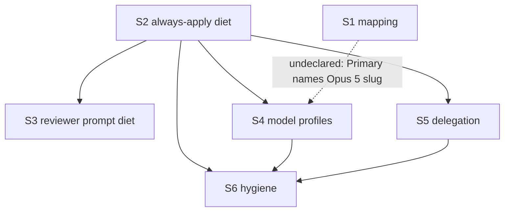

# Quality Controller — Slice Coherence

- Change: `kit-evolution-models-economy-profiles`
- Date: 2026-08-16
- Mode: slice (`# Срез S1`…`# Срез S6` present)
- Domain: kit metaproject (Cursor rules/skills/agents; no 1C IB). Primaries observed in a Cursor session are treated as black-box.

## Verdict

`WARNING`

One declared-vs-actual dependency mismatch (fourth slice Primary names the live architect slug that only the first slice writes). No critical gate, verticality, or user-spike defects. All 34 spec scenarios are covered (Primary, optional accept, or an in-slice task).

## Slice Summary

| Slice | Scenario | Tasks | Acceptance | Dependencies | Gate |
|---|---|---|---|---|---|
| S1 Живой мэппинг моделей | Делегирование на живые модели; Fable только закрытая эскалация | 11 + accept | S1.accept (7 named / 9 in «Связь со spec»; 2 via S1.9, S1.10) | нет | `<!-- slice-gate -->` |
| S2 Диета always-apply | Постоянный контекст дешевле; гейты срабатывают | 19 + accept | S2.accept (4 named / 5 in «Связь со spec»; 1 via S2.17) | нет | `<!-- slice-gate -->` |
| S3 Диета промпта reviewer | Ревью дешевле при том же покрытии чек-листов | 7 + accept | S3.accept (2/2) | S2 | `<!-- slice-gate -->` |
| S4 Профили моделей | Чат на Grok 4; субагенты Fable/GPT/Opus; гейты не ослабляются | 12 + accept | S4.accept (5 bullets; 7/7 scenarios — 3 conflicts inside Primary) | S2 (фактически ещё S1 — см. Alerts) | `<!-- slice-gate -->` |
| S5 Усиление делегирования | Обследование 1С → проектный explorer; intent-брифы | 8 + accept | S5.accept (5 named / 7 in «Связь со spec»; 3 via S5.5, S5.6, S5.8) | S2 | `<!-- slice-gate -->` |
| S6 Гигиена свода | Самоописание on-demand; пол безопасности; рудименты убраны | 10 + accept | S6.accept (4/4; Primary = Scenario «Правка контракта Экспорт-процедуры в Light Mode») | S2, S4, S5 | `<!-- slice-gate -->` |

Notes:

- `form_mode: n/a`. Manual Configurator / form-attribute markers: none. Completeness does not require metadata/form/BSL layers.
- S3 has no own delta spec (design: extends `always-apply-context-budget`). Intentional.
- `openspec/glossary.md` exists (D12). `openspec/project.md` absent in kit-repo — tasked in S2.15–S2.16, not a slice-plan defect.

## Scenario Coverage

Coverage rule used: a `#### Scenario:` is covered if it appears in Primary, an optional accept bullet, or an in-slice `S<N>.<M>` (criterion 5b). Named accept bullet is not required when a task already owns the scenario.

### subagent-model-mapping → S1

| Scenario | Covered by | Status |
|---|---|---|
| Вызов архитектора без ошибки enum | S1 Primary | OK |
| Команда на Grok 4 без смены чата | S1.accept optional | OK |
| Рантайм свободен от мёртвых слагов | S1.9 (search; not a named accept bullet) | OK (task path) |
| Слаг таблицы отсутствует в enum сборки | S1.accept optional | OK |
| Сбой Primary | S1.accept optional | OK |
| Согласованность описаний цепочки | S1.10 (search + align; not a named accept bullet) | OK (task path) |
| Декомпозиция срезов не идёт на Fable | S1.accept optional | OK |
| Независимый разбор постановки идёт на Fable | S1.accept optional | OK |
| Сбой Opus не включает Fable | S1.accept optional | OK |

### always-apply-context-budget → S2, S3, S5

| Scenario | Covered by | Status |
|---|---|---|
| Замер после диеты | S2.19 + S2.accept optional | OK |
| Контрольный замер после дописывания delegation | S5.8 (placed in S5 by D6; not in S2/S5 accept) | OK (task path) |
| Обязательство-diff без непокрытых строк | S2.18 + S2.accept optional | OK |
| Поведенческий smoke в чистом окне | S2 Primary | OK |
| Потребители ссылаются на нового владельца | S2.12 + S2.accept optional | OK |
| Полнота чек-листов после диеты | S3.7 + S3.accept optional | OK |
| Evidence-строка в отчёте | S3 Primary | OK |
| Порог целостности поставки актуален | S2.17 (not a named accept bullet) | OK (task path) |

### chat-model-profiles → S4

| Scenario | Covered by | Status |
|---|---|---|
| Профиль активен для известной модели | S4.accept optional | OK |
| Бриф субагента учитывает профиль его модели | S4.accept optional | OK |
| Неизвестная модель | S4.accept optional | OK |
| Конфликт «длина ответа против лимитов» | S4 Primary (три конфликтных запроса) | OK |
| Конфликт «не перепроверяй себя против предписанных проверок» | S4 Primary | OK |
| Конфликт «lean context против стаб-полное тело» | S4 Primary | OK |
| Профиль против overlay | S4.accept optional | OK |

### delegation-safeguards → S5

| Scenario | Covered by | Status |
|---|---|---|
| Обследование BSL при недоступном кастомном агенте | S5.accept optional | OK |
| Не-1С файлы | S5.accept optional | OK |
| Бриф writer в intent-формате | S5.accept optional | OK |
| Два неудачных прохода | S5.6 (not a named accept bullet) | OK (task path) |
| Профиль не запускает проверяющего субагента | S5.accept optional | OK |
| Полное ревью с фильтром в отчёте | S5.5 (not a named accept bullet) | OK (task path) |

### rules-hygiene → S6

| Scenario | Covered by | Status |
|---|---|---|
| Правило читается изолированно | S6.accept optional | OK |
| Типовая задача | S6.accept optional | OK |
| Правка контракта Экспорт-процедуры в Light Mode | S6 Primary | OK |
| Ссылки после удаления | S6.9 + S6.accept optional | OK |

**Orphans:** none under criterion 1 / 5b.

**Mechanical 7A–7E disposition (not 5b failures):** missing named accept bullets for «Рантайм свободен от мёртвых слагов», «Согласованность описаний цепочки», «Порог целостности поставки актуален», «Два неудачных прохода», «Полное ревью с фильтром в отчёте», «Контрольный замер после дописывания delegation» — each has an in-slice task. Do not emit `accept-bullets-missing-scenario`.

**Design table:** `## Slices` maps capabilities (S1→`subagent-model-mapping`, …), not a column/row «Scenarios из spec» with `#### Scenario:` names. See Suggestions.

## Dependency Graph

- Cycles: none.
- Forward acceptance (later slice required to sign an earlier Primary): none.
- Declared edges exist: S2, S4, S5 as named parents.
- Undeclared: S4 Primary requires the live architect slug written only in S1.1; S4 metadata lists only S2.

S1 ∥ S2 are independent. S3 / S4 / S5 fan out from S2. S6 is last (headers + SSOT map on the final file set). Extra backward edges (S6→S2/S4/S5, S5→S2) are sequencing to avoid rewrite of `AGENTS.md` / delegation, not a false gate.

## Criteria

1. **Scenario Coverage** — 34/34 covered. Implementation-only items (dead-slug search, chain-text alignment, byte measurements, checklist inventory, remnant link search) live in agent tasks, not as user IB spikes.
2. **Slice Independence** — each slice is acceptable without later slices. S4 is not acceptable without S1 work unless Primary is narrowed (see alert).
3. **Slice Completeness** — for a kit change, required files/rules for each Primary are tasked inside the same slice (except S4’s Opus slug — S1). No missing form/metadata layer (n/a).
4. **Slice Dependency Graph** — declared parents exist; one undeclared S1→S4.
5. **Slice Gate Integrity** — exactly one `S<N>.accept` and one `<!-- slice-gate -->` per slice. No legacy `S<N>.T<M>`. No `<!-- phase-gate -->`.
5b. **Acceptance Checklist Coverage** — all six slices have `**Primary acceptance:**` and `**Primary (обязательно):**`. No empty accept. No foreign named Scenario bullets. Missing named bullets are task-covered (OK).
6. **Rework Risk** — S4 Primary repeats “chat stays on Grok / architect on Opus 5”, which is already S1’s «Команда на Grok 4 без смены чата» + S1 Primary. Shared files (`AGENTS.md`, delegation) are ordered S2 → S4 → S5 → S6. Mild overlap, not a duplicate gate.
8. **Verticality** — every mandatory Primary is observable in a Cursor session (successful Task call, four trigger smokes, reviewer report line, conflict answers, explorer dispatch, Light-Mode promotion). Not debugger/API-type checks. Kit session = product surface.
8b. **Self-achievable** — S1–S3, S5, S6 Primaries are reachable by that slice’s tasks. S4’s “architect called with Opus 5” is not produced by S4.1–S4.12 (profiles/router only). This is a **backward** hole, not a later-slice gate → not `slice-accept-not-self-achievable` (that alert is forward/duplicate-with-next). Tracked as undeclared dependency.
9. **Foundation + gate** — no slice has programmatic-only accept while a dependent slice holds the only user journey. S2 smoke is itself a user journey.
10. **Acceptance simplicity** — one mandatory bullet per accept; remaining bullets marked optional. S2 four smokes = one spec scenario. S4 packs three conflict scenarios into one Primary battery (one mandatory bullet — not overload by construction).
11. **User Task Contract** — no DENY markers in `S<N>.<M>` (`тестовой ИБ`, `на стенде`, `в консоли`, `отладчик`, `эмулировать вызов`, `При успешном verify S`, `после verify S`, `после стенда`). «Без информационной базы 1С» only in slice metadata / accept. S3.1 / S2.18–S2.19 / S5.8 are apply-agent work (Task, reports, byte sum), not a user runtime spike.

## Task readability

Pattern «verb + file + change + why + (D…)» holds for implementation tasks. Accept titles state a business result.

| ID | Note |
|---|---|
| S3.1 | «эталонный фрагмент BSL из документации kit» — path not named; apply must pick a file. SUGGESTION only. |
| S6.1 | «топ-10 on-demand» resolved at apply by size/frequency; spec allows this. |
| S1.accept / S4.accept | Primary text is dense (Fable sentence in S1; Opus slug + three conflicts in S4). Still one mandatory bullet. |

No `task-opaque-title`, `task-too-short`, `task-opaque-acceptance`, `accept-checklist-empty`.

## Alerts

### 1. `undeclared-dependency`

- **Affected:** S4 (Primary; metadata `**Зависимости:** S2`)
- **Type:** `undeclared-dependency`
- **Severity:** WARNING
- **Evidence:** S4 Primary: «архитектор вызывается с Primary Opus 5». That slug is introduced in S1.1 (`model-selection.mdc` table). S4 tasks create `model-adaptation.mdc` and four profile files only. Design graph: «S4 — после S2», S1 independent of S2; S1 is not listed as a parent of S4.
- **Recommendation:** either (A) set S4 `**Зависимости:** S1, S2` and mirror in design «Зависимости срезов», or (B) drop the Opus-5 clause from S4 Primary / accept (leave live mapping to S1; keep S4 Primary = Grok chat + three constitutional conflicts). Prefer (B) if S1 must stay independently acceptable in parallel with S4; prefer (A) if apply should refuse S4 until S1 is signed.

### Remediation (auto-repair)

- alert: `undeclared-dependency`
- target: `openspec/changes/kit-evolution-models-economy-profiles/tasks.md` slice S4; `design.md` § Slices dependency paragraph
- action: Default edit (A): in S4 metadata replace `**Зависимости:** S2.` with `**Зависимости:** S1, S2.` In design.md sentence «S4 — после S2 …» add «и после S1 (живой слаг архитектора в таблице ролей)». Alternative (B): in S4 `**Primary acceptance:**` and S4.accept Primary, delete «архитектор вызывается с Primary Opus 5» / «архитектор идёт с Primary Opus 5»; keep «чат остаётся на Grok» and the three conflict requests. Do not invent a procedural “don’t sign S4 until S1” without updating metadata.

---

### 2. `scenario-orphan-design`

- **Affected:** `design.md` § Slices (all six rows)
- **Type:** `scenario-orphan-design`
- **Severity:** SUGGESTION
- **Evidence:** Table columns are Срез / Имя / Сценарий (outcome) / Файлы / Primary acceptance. Footer is a capability matrix (`subagent-model-mapping` → S1, …). No «Scenarios из spec» listing of `#### Scenario:` names. Binding exists in each slice’s `**Связь со spec:**` in `tasks.md`.
- **Recommendation:** add a column or a bullet list under each slice with the literal Scenario titles from `specs/**/spec.md`. Does not block apply; reduces drift vs verify step 2.3.

### Remediation (auto-repair)

- alert: `scenario-orphan-design`
- target: `openspec/changes/kit-evolution-models-economy-profiles/design.md` § Slices
- action: For each slice row, add field «Scenarios из spec:» copying the Scenario names already listed in that slice’s `**Связь со spec:**` in `tasks.md` (S1: nine names; S2: five; S3: two; S4: seven; S5: seven including «Контрольный замер после дописывания delegation»; S6: four).

---

### 3. `slice-rework-risk` (Primary overlap)

- **Affected:** S4 Primary vs S1 Scenario «Команда на Grok 4 без смены чата»
- **Type:** `slice-rework-risk`
- **Severity:** SUGGESTION
- **Evidence:** S1 optional accept already checks: workflow command in Grok 4 extra high does not require switching chat; ordinary architect uses Opus 5. S4 Primary repeats chat-stays-Grok + architect-Opus-5, then adds the distinctive three-conflict battery.
- **Recommendation:** keep conflicts as S4 Primary; rely on S1 for mapping/chat-switch. Same edit as alert 1 option (B).

---

### 4. `task-opaque-title` (mild)

- **Affected:** S3.1
- **Type:** `task-opaque-title`
- **Severity:** SUGGESTION
- **Evidence:** «Прогнать `onec-code-reviewer` на эталонном фрагменте BSL из документации kit» — no path. S3.accept depends on “the same fragment”.
- **Recommendation:** name the file (e.g. a documented sample under `.cursor/docs/`) in S3.1 so baseline and accept cannot drift.

## Recommendations

### Automatic fix

- Declare S1 as a parent of S4 **or** narrow S4 Primary (alert 1).
- Add «Scenarios из spec» names to design § Slices (alert 2).
- Optionally add named optional accept bullets for task-covered scenarios (S1.9, S1.10, S2.17, S5.5, S5.6, S5.8) — polish only; not required by criterion 5b.
- Name the S3.1 reference fragment path (alert 4).

### Decision required

- None for merge/split. Do not merge S2+S3 (separate outcomes: always-apply smoke vs reviewer prompt). Do not merge S4+S5+S6 (three independent user-visible outcomes). Do not treat S4’s Opus-slug hole as `slice-accept-not-self-achievable` (not a forward gate).

### Explicit non-alerts

- `accept-bullets-missing-scenario` — not emitted (task coverage).
- `accept-bullet-foreign-scenario` — not emitted.
- `primary-acceptance-missing` / `accept-checklist-empty` — not emitted.
- `slice-not-vertical` / `slice-foundation-with-gate` / `slice-accept-not-self-achievable` / `acceptance-simplicity-overload` / `user-task-contract-violation` — not emitted.
- Absence of 1C IB / smoke on a stand — out of scope (kit session acceptance).
- S3 without own spec file — by design.
- Files not yet created (`model-*.mdc`) — expected pre-apply; not a plan defect.
- Remnants still present (`opsx-ff.md`, `opsx-continue.md`, `openspec-sessions.mdc`) — tasked in S6.6–S6.8.
