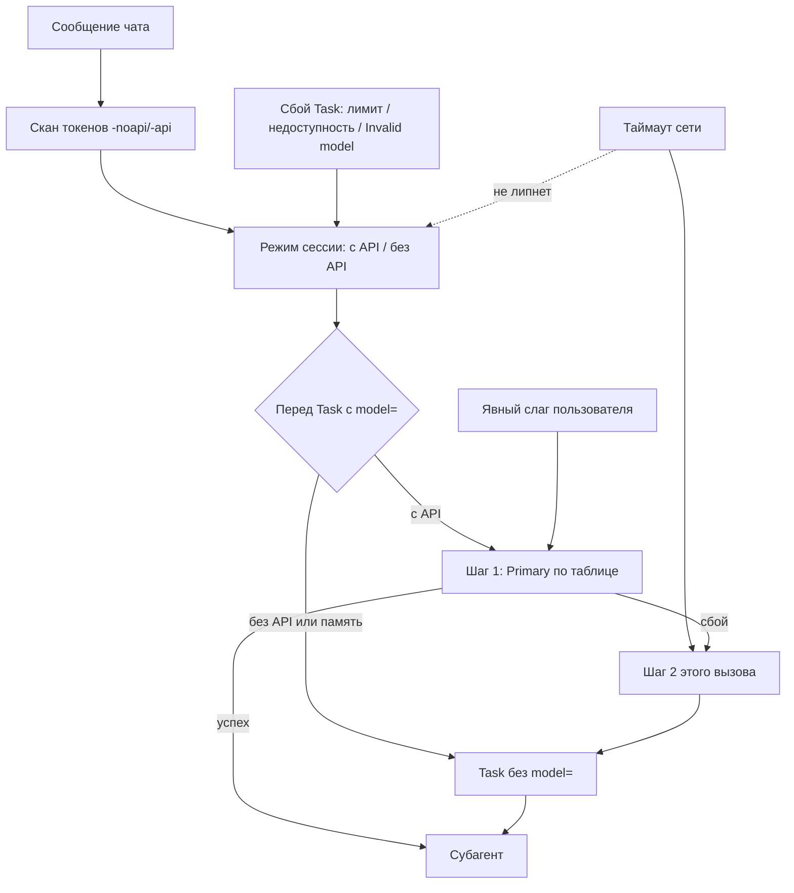
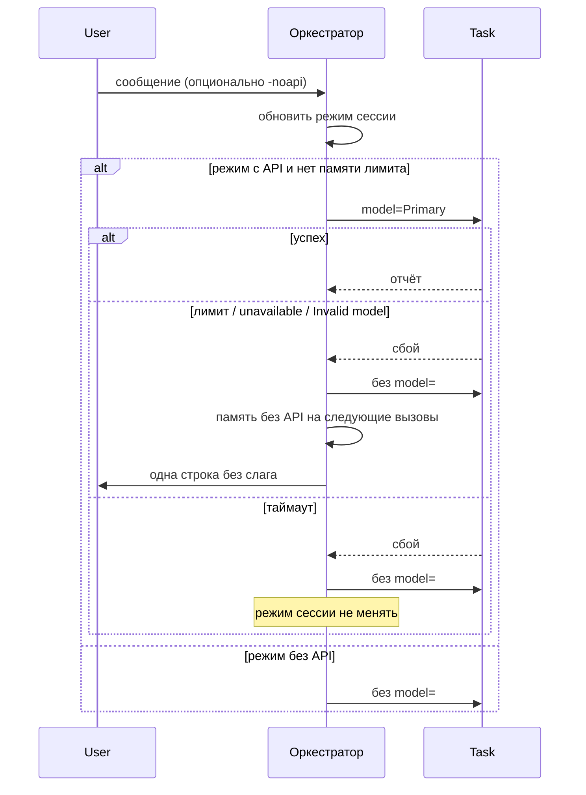

# Architecture: kit-session-api-mode

## KB references

- Discovery выполнен, совпадений нет — **not relevant**: входной блок `## Existing Knowledge` не содержит KB-ID; конфликтов нет, секция `## Knowledge conflicts` не требуется.

## Вердикт по design.md

**Принять с правками.** Ось верная: слой поверх двухшаговой цепочки, не новая таблица ролей и не признак в `project.md`. Пропуск шага 1 **не ломает** целостность цепочки, если явно зафиксировать (сейчас это только намёк в D3): первый сбой Primary по-прежнему обязан сделать шаг 2 **того же** вызова; память и `-noapi` влияют только на **следующие** вызовы. Двух срезов достаточно, foundation-среза нет. Перед генерацией spec/tasks внести вставки ниже — это уточнение инвариантов, не развилка кода.

Живой симптом этой сессии (2026-08-18): первый `Task` архитектора с Primary вернул лимит API; отработал шаг 2 — вызов без `model=` (модель чата). Без этой ЗНИ следующий дорогой вызов снова ударит в Primary.

## Task

Оркестратор держит в одном чате два режима — жечь лимиты API или нет — по токенам `-noapi`/`-api` (и с двумя дефисами) и по памяти после сбоя лимита. Признак репозитория не вводится. Таблица ролей, inherit через отсутствие параметра, запрет Fable как запаса и самосверка enum не меняются.

## Complexity

**Medium.** Три правила + FAQ + палитра команд; нет объектов 1С, нет нового хранилища, нет перехвата. Сложность — стык с прецедентом цепочки, не объём кода.

## Chosen Approach

**Approach:** Minimal changes — один сессионный флаг оркестратора поверх существующей цепочки Primary → без `model=`.

**Rationale:**

- Точка правки — момент «сейчас звать `Task` с конкретной моделью», не вход каждой команды (иначе смысл разъедется со `--skip-architect`).
- Пользователь уже закрыл ось: не `project.md`, не probe, не файл между чатами.
- Прецедент `kit-evolution-models-economy-profiles` (D1–D3, D1a) остаётся; эта ЗНИ **extends**, не revoke.

## Simplicity Check

- **Viable alternatives:**
  1. **Признак в `openspec/project.md` + ключи + память** — шире; для «сегодня нет лимита» лишний файл. Пользователь отклонил 2026-08-17. В kit файла нет по D12 прецедента; путать отсутствие init с «без API» нельзя.
  2. **Только память после сбоя, без токенов** — меньше определённости: пока первый Primary не упал, чат снова жжёт квоту; нельзя заранее сказать «сегодня без API».
  3. **Режим оркестратора + токены в чате + память после лимита** (выбран) — совпадает с Why и с закрытым выбором пользователя.
  4. **Probe квоты до `Task`** (не в `## Implementation Options`) — отдельного API usage/credits нет (exploration-command-flags, MCP-поиск пуст). Probe = пустой платный/падающий вызов и конфликт с «первый tool call = Read SKILL».
  5. **Кэш по каждому Primary-слагу** (не в Options) — точнее (Opus мёртв, Gemini жив), но отдельная карта слагов, больше ветвлений; design уже принимает грубую политику.
  6. **Ключ как флаг каждой команды** (парсер скилла, как `--slice`) — 20+ файлов, дрейф со `--skip-architect`; команды без дорогих вызовов получат шум.
  7. **Кэш в `temp/session-notes.md`** — прецедент уже отверг файл-состояние профиля; session-notes = handoff между чатами, не квота.

- **Selected simplest viable design:** вариант 3. Один boolean сессии, один SSOT (`model-selection.mdc`), cue в двух правилах, подсказка только у команд с дорогими `Task`.

- **Why not simpler:** вариант 2 не закрывает Why «нужны два явных режима» (без ключа пользователь не может включить экономию до первого удара). Вариант 1 отвергнут заказчиком и ломает «состояние чата, не репозитория». Убрать память и оставить только ключи — не лечит живой симптом: после лимита следующий вызов снова бьётся в Primary, пока человек не вспомнит написать `-noapi`.

- **Complexity budget:**
  - Files touched: 10 в постановке + 1 рекомендуемый (`release-review.md`); объектов метаданных 1С: 0
  - Hooks/intercepts: 0
  - New procedures/functions (BSL): 0; новая проверка оркестратора: 1 (режим сессии перед `Task` с `model=`)
  - Conditional branches / feature flags: режим ∈ {с API, без API}; два множества сбоев (цепочка vs липкая память); скан токенов; разовый override слага. Репозиторных feature flags: 0

Only one viable option **для закрытой оси пользователя** (не project.md, не probe): вариант 3. Остальные либо отвергнуты явно, либо не покрывают Why.

## Existing Mechanisms

Обследовано по коду правил и по трём разборам explore (kit, не конфигурация 1С). Новых механизмов хранения нет.

| # | Механизм | Где | Как использовать | Не делать |
|---|---|---|---|---|
| 1 | Двухшаговая цепочка Primary → без `model=` | `model-selection.mdc:30`, `:100-104`; spec `subagent-model-mapping` Scenario «Сбой Primary» | Оставить как есть. Режим «без API» = **не начинать шаг 1** на новых вызовах; шаг 2 текущего вызова после сбоя Primary обязателен | Не удалять шаг 2; не вводить третий шаг; не считать пропуск шага 1 «исчерпанием делегирования» |
| 2 | «Первый раз за сессию» | `model-selection.mdc:34` — самосверка enum, не квота | Соседний флаг режима сессии в памяти оркестратора, тот же срок жизни (чат), не новый файл | Не подменять самосверку probe квоты; в режиме без API вызовов с `model=` нет — сверка откладывается до первого такого вызова (`-api` или новый чат) |
| 3 | Что считать сбоем | `model-selection.mdc:96-98` | Fallback **этого** вызова — все API-ошибки, включая таймаут | Не делать таймаут липким на весь чат (D3) |
| 4 | Cue перед `Task` | `tool-name-guard.mdc:17-25`, `:61-74` | Одна строка: проверить режим сессии до передачи `model=` | Не дублировать таблицу ролей |
| 5 | Persistence команды | `session-discipline.mdc:21-23` | Follow-up не сбрасывает режим API | Не класть SSOT токенов в always-apply файл (бюджет прецедента D6) |
| 6 | Разбор `--ключей` в скиллах | apply `--slice`/`--batch`; new `--skip-architect`; review `--full` | Не SSOT для режима моделей. Ключ про API — не режим протокола команды | Не делать `-noapi` флагом Architect Gate |
| 7 | Overlay `project.md` | D4/D12 прецедента; канон init **без** секции моделей | Сознательно не используем (решение пользователя) | Не трактовать отсутствие `project.md` в kit как noapi |
| 8 | `temp/session-notes.md` | skill session-save | Handoff между чатами | Не кэш квоты |
| 9 | Закрытая эскалация Fable | D1a; `model-selection.mdc:63-81` | В режиме без API не вызывать Fable/Primary, пока пользователь явно не попросил слаг | Не превращать Fable в запас после лимита (это был бы revoke D1a) |
| 10 | ADR-0001 | chat-facing vs agent-facing | Сообщение «дорогие модели недоступны — дальше на модели чата» без слага и без имени агента | Не светить Opus/Gemini/Fable в чат |

**Уровень:** расширить существующий механизм выбора модели, не строить параллельный маршрутизатор и не копировать ключ в сорок команд.

## Precedent (extends, не revoke)

Архив: `openspec/changes/kit-evolution-models-economy-profiles` (D1–D3, D1a; specs/subagent-model-mapping). Capability в `openspec/specs/` ещё нет — эта ЗНИ добавляет `session-api-mode`, не REMOVED/MODIFIED таблицы ролей.

| Контракт прецедента | Эта ЗНИ | Класс |
|---|---|---|
| Таблица ролей → Primary (D1) | Таблица не редактируется | extends (слой «когда не звать шаг 1») |
| Два шага: Primary → без `model=` (D2) | Шаг 2 остаётся финальным; пропуск только шага 1 на *следующих* вызовах | extends |
| Целостность: после сбоя шага 1 обязан шаг 2 того же `subagent_type` | Явно сохранить; см. вставку D6 | extends |
| Самосверка enum, no family guessing (D3) | Без изменений | не трогаем |
| Fable не запас после сбоя Opus (D1a) | В noapi Fable тоже не зовём, кроме явного «на Fable» | extends (ещё одна причина не звать, не «Fable после Opus») |
| `inherit` = отсутствие `model=` | Без изменений | не трогаем |
| Нет файла-состояния профиля (D4) | Нет файла-состояния API-режима | extends |
| Профили чата ≠ выбор Task.model | `model-adaptation.mdc` не в scope | не трогаем |

**Не путать с `--skip-architect`:** флаг `/opsx:new` обходит Architect Gate как шаг протокола и пишет `.gate-override.yaml`. `-noapi` разбор **оставляет**, меняет только модель вызова. Layer 4 verify этим флагом new не обходится (`openspec-verify-change/SKILL.md:280`) — и `-noapi` его тоже не обходит.

## Blast Radius

| Контракт | Архивный источник | Бизнес-эффект (пользователь kit) | Альтернативы | Обоснование |
|---|---|---|---|---|
| Двухшаговая цепочка | design D2; spec Scenario «Сбой Primary»; `model-selection.mdc:100-104` | После лимита нет пачки бесполезных падений Primary; **первый** удар в лимит всё ещё отрабатывает работу на модели чата | Всегда пробовать Primary на каждом вызове (статус-кво); probe | Слой «пропустить шаг 1», не отмена шага 2 |
| Таблица ролей | D1; spec «Мэппинг ролей» | Те же роли и те же Primary, когда режим «с API» | Переписать таблицу на inherit | Не revoke |
| Fable не fallback | D1a; spec «Сбой Opus не включает Fable» | В режиме экономии самая дорогая модель не вызывается «на всякий случай» | Звать Fable для независимого разбора даже при `-noapi` | Противоречило бы Why; явный «на Fable» остаётся разовым override |
| Нет файла-состояния | D4 Existing Mechanisms | Новый чат снова «с API»; смягчение — сразу написать `-noapi` | `project.md` / session-notes | Решение пользователя + прецедент |
| Chat-facing без слагов | ADR-0001 | Одна строка без имён моделей | Показать слаг упавшей модели | Не revoke ADR |

В целевой `design.md` секция `## Blast Radius` уже есть; усилить строкой про D1a и явным «не REMOVED scenario Сбой Primary» (вставка ниже).

## Проверка: пропуск шага 1 vs целостность цепочки

Текущий запрет (`model-selection.mdc:111`, `:102-103`): нельзя пропускать **финальный** шаг (без `model=`) после сбоя Primary и нельзя подменять отчёт субагента, пока этот шаг не сделан.

Два пути:

1. **Память после лимита.** Первый вызов сессии идёт шагом 1. Сбой лимита → **обязателен шаг 2 этого же вызова** (живой пример этой сессии). Флаг «без API» ставится после этого и действует на последующие `Task`. Цепочка не сломана.
2. **Явный `-noapi`.** Шаг 1 не начинается: вызов сразу без `model=`. Это не «цепочка оборвана», а явный выбор «только финальный шаг». Если этот вызов тоже упал — СТОП пользователю, как после полного исчерпания. Подмена отчёта по-прежнему запрещена.

Опасная путаница, которую design должен закрыть текстом: «режим без API» ≠ «можно не вызывать субагента» и ≠ «после падения Primary можно не делать шаг 2».

Два множества сбоев (сейчас в D3 смешаны со списком «что считать сбоем» в SSOT):

- **Сбой цепочки** (как сейчас): недоступность, таймаут, лимиты/credits, `Invalid model selection`, иные ошибки API → шаг 2 **этого** вызова.
- **Липкая память:** только лимит/credits, недоступность модели, ошибка выбора модели. Таймаут шаг 2 делает, режим сессии не включает.

## Срезы: два достаточно, foundation нет

| Вопрос | Ответ |
|---|---|
| Foundation-срез с gate? | **Нет.** S1 Primary — наблюдаемый исход чата (написал `-noapi` / после лимита следующие дорогие вызовы не падают повторно). Это не «API без UX». S2 — другой исход: подсказка в FAQ/палитре. |
| Self-achievable? | S1 достижим файлами правил без FAQ. S2 достижим FAQ+commands без повторной смены семантики цепочки. |
| Слишком мелко? | Не сливать. Два независимых outcome: поведение vs обнаруживаемость. Standard-декомпозиция (два outcome) уместна. |
| Слишком крупно? | Не дробить S1 на «токены» и «память»: один boolean, одни файлы; раздельные срезы дали бы правку одних и тех же правил дважды. |
| Зависимость S2 после S1 | Документационная (текст ссылается на поведение). Не runtime-фундамент. |

Рекомендация: в S2 добавить `.cursor/commands/release-review.md` (жжёт Primary reviewer). Поведение всё равно из SSOT; без строки ключ невидим на предрелизе. Это не третий срез.

## Found Patterns

### Pattern 1: Двухшаговая цепочка роли

- **Where:** `.cursor/rules/model-selection.mdc:30`, `:44-50`, `:100-104`
- **Usage:** Primary (если задан) → при сбое тот же `subagent_type` без `model=`
- **Evidence:** spec Scenario «Сбой Primary»; живой прогон 2026-08-18 (лимит API → шаг 2)
- **Confidence:** high
- **Applicability:** не переписывать; добавить gate «начинать ли шаг 1»

### Pattern 2: Соседний сессионный флаг, не файл

- **Where:** `model-selection.mdc:34` («перед первым в сессии вызовом с `model=`»)
- **Usage:** память оркестратора на чат
- **Evidence:** exploration-model-economy-precedent.md § «Что происходит при исчерпании лимита»
- **Confidence:** high
- **Applicability:** второй флаг рядом: режим API сессии

### Pattern 3: `--skip-architect` — другая ось

- **Where:** `.cursor/commands/opsx-new.md:17`; `architect-gate.mdc`; new SKILL Design Gate
- **Usage:** обход gate + `.gate-override.yaml`
- **Evidence:** exploration-command-flags.md риск 2; verify SKILL:280
- **Confidence:** high
- **Applicability:** в FAQ и D2 явно развести; не парсить `-noapi` в скилле new как skip gate

### Pattern 4: Нет общего парсера флагов

- **Where:** каждый SKILL «Parse флаги»; нет `flags.md`
- **Evidence:** exploration-command-flags.md
- **Confidence:** high
- **Applicability:** токены API читает оркестратор по SSOT моделей, не Entry Protocol каждой команды

### Pattern 5: Сообщение одной строкой без слага

- **Where:** ADR-0001; D1a «одна строка, что разбор идёт на самой дорогой модели»
- **Confidence:** high
- **Applicability:** то же для «дорогие модели недоступны»

## Assumptions

- **A1.** Оркестратор удерживает boolean на follow-up того же чата так же, как «первая сверка enum». **Confidence:** high. **Verification:** тот же механизм persistence; cue в `session-discipline.mdc`.
- **A2.** Текст ошибки `Task` позволяет отличить лимит/credits и Invalid model от таймаута. **Confidence:** medium. **Verification:** в SSOT дать примеры формулировок «лимит/credits/unavailable/Invalid model»; при сомнении — не липнуть (безопаснее ложный повтор Primary, чем ложный sticky от сети).
- **A3.** Скан «отдельное слово» достаточен, чтобы не спутать `--api` с `--api-key`. **Confidence:** high при правиле word boundary. **Verification:** негативный пример в spec.

## Open Questions

Нет блокирующих. Ниже предписано, не спрашивается: оба токена в одном сообщении — последний по тексту побеждает; явный слаг пользователя — разовый override без сброса режима.

## Clarifications

### Decision 1: Не project.md

- **Question:** Куда писать признак «без API»?
- **Answer:** Только сессия оркестратора. Пользователь 2026-08-17.
- **Impact:** init-project, capture-to-project, overlay — вне scope.

### Decision 2: Токены в любом сообщении, не флаг скилла

- **Question:** Парсить как `--slice` в каждой команде?
- **Answer:** Нет. SSOT — `model-selection.mdc`. Палитра — одна строка у дорогих команд.
- **Impact:** `/opsx:status` ключ игнорирует внешне.

### Decision 3: Память после лимита, не probe

- **Question:** Проверять квоту до вызова?
- **Answer:** Нет API. Первый реальный сбой — сигнал.
- **Impact:** новый чат один раз может ударить в лимит; смягчение `-noapi`.

## Architecture

### Components



#### Component 1: SSOT режима

- **Path:** `.cursor/rules/model-selection.mdc`
- **Responsibility:** секция режима сессии; precedence; два множества сбоев; целостность цепочки при пропуске шага 1; Fable в noapi
- **Dependencies:** таблица ролей (без правок строк Primary)
- **Evidence:** файл существует; таблицы D1 не менять
- **Interface:** оркестратор читает до каждого `Task` с потенциальным `model=`

#### Component 2: Cue вызова

- **Path:** `.cursor/rules/tool-name-guard.mdc`
- **Responsibility:** пункт чеклиста: если режим без API — не передавать `model=` (кроме разового override)
- **Evidence:** чеклист из 3 пунктов уже есть — расширить пункт 2, не плодить четвёртый SSOT

#### Component 3: Persistence cue

- **Path:** `.cursor/rules/session-discipline.mdc`
- **Responsibility:** 2–4 строки: follow-up и смена команды внутри чата не сбрасывают режим; новый чат — «с API»
- **Evidence:** always-apply; не копировать таблицу токенов (бюджет D6 прецедента)

#### Component 4: Обнаруживаемость

- **Path:** `.cursor/docs/faq-kit.md` + listed commands + `release-review.md`
- **Responsibility:** как включить/выключить; одна строка «ключ можно написать в любом сообщении чата»; не объявлять ключ флагом протокола
- **Evidence:** faq сейчас молчит про noapi (grep пуст)

### Data Flow



**Flow description:**

1. Скан токенов в пользовательском тексте (word boundary, регистр не важен).
2. Перед `Task` с Primary: если без API — сразу без `model=`.
3. Если с API — шаг 1; при сбое цепочки — шаг 2 того же типа; липкая память только для подмножества ошибок.
4. Writer/explorer/trace/QC уже без `model=` — поведение не меняется.
5. Новый чат: режим «с API», память пуста.

### Implementation Map

**Create:** нет объектов 1С, нет новых `.bsl`, нет XML метаданных.

**Modify (kit):**

- `.cursor/rules/model-selection.mdc` — секция режима; D6/D7/precedence; два множества сбоев; антипаттерн «пропустить шаг 2» оставить; добавить разрешённый пропуск шага 1
- `.cursor/rules/tool-name-guard.mdc` — cue в чеклисте пункта `model`
- `.cursor/rules/session-discipline.mdc` — короткий cue persistence
- `.cursor/docs/faq-kit.md` — Q&A включить/выключить; отличие от пропуска архитектора
- `.cursor/commands/opsx-new.md`, `opsx-verify.md`, `opsx-apply.md`, `opsx-extend.md`, `opsx-explore.md`, `review.md`, **`release-review.md`** — одна строка
- Не трогать: таблицу ролей, `model-adaptation.mdc`, `openspec/project.md`, `temp/session-notes.md`, ADR-0001 (только соблюдать)

**Delta spec:** `specs/session-api-mode/spec.md` (ADDED only). Не MODIFIED `subagent-model-mapping` в этой ЗНИ: capability в main specs нет; контракт цепочки остаётся, добавляется условие «когда шаг 1 не начинать».

## Implementation Phases

### Phase 1 / S1: Режим сессии

- [ ] Секция в `model-selection.mdc` + cue в `tool-name-guard.mdc` и `session-discipline.mdc`
  - Files: три правила из S1
  - Criteria: `-noapi` → следующий дорогой вызов без `model=`; после лимита шаг 2 текущего вызова выполнен, следующие Primary не зовутся; `-api` возвращает таблицу; таймаут не липнет; таблица ролей байт-в-байт Primary не менялась
  - Dependencies: none

### Phase 2 / S2: Подсказка

- [ ] FAQ + одна строка в палитре дорогих команд, включая `/release-review`
  - Files: faq-kit.md, commands listed
  - Criteria: в FAQ есть включить/выключить и отличие от пропуска архитектора; у `/opsx:status` своего ключа нет
  - Dependencies: S1 (текст описывает уже заданное поведение)

## Test Scenarios

Имена совпадают с черновиком design + уточнения:

1. **Ключ без API** — в сообщении `-noapi` / `--noapi` → следующий architect/reviewer/simplifier без `model=`
2. **Ключ с API** — `-api` сбрасывает память и режим
3. **Память после лимита** — первый Primary упал по лимиту → шаг 2 этого вызова → следующие дорогие без `model=`
4. **Таймаут не липнет** — таймаут → шаг 2 этого вызова → следующий вызов снова с Primary
5. **Новый чат сбрасывает**
6. **Команда без дорогих вызовов молчит** — `/opsx:status` не ошибка и не справка по ключу
7. **Не путать с пропуском архитектора** — `-noapi` не создаёт `.gate-override.yaml` и не отменяет Layer 4
8. **Подсказка в палитре**
9. **Целостность первого сбоя** — нельзя пропустить шаг 2 вызова, который уже ушёл с Primary
10. **Fable в noapi** — нет вызова Fable/Primary, пока нет явного «на Fable»
11. **Оба токена в одном сообщении** — последний по тексту
12. **Ложное слово** — `--api-key` не включает `-api`

## Critical Details

### Error Handling

```yaml
Strategy:
  - Сбой шага 1 с Primary: всегда шаг 2 того же subagent_type (неотменяемый инвариант прецедента)
  - Липкая память: только лимит/credits, unavailable, Invalid model selection
  - Таймаут и нераспознанная сеть: шаг 2 да, sticky нет
  - Содержательный отказ агента: не сбой модели, режим не менять
  - Сообщение пользователю: одна строка, ADR-0001, без слага
  - Полное исчерпание (упал и вызов без model=): СТОП, не подмена отчёта
```

### Parameter Contracts

Не применимо: нет `&После`/`&Перед`, нет структур параметров 1С.

Разовый override: явный слаг в тексте пользователя на **этот** `Task` не сбрасывает режим сессии. Сброс — только `-api` / новый чат.

### Identity Filter / Data Contract Gate

Не применимо (нет allow-list форм, нет guards Свойство/ТипЗнч).

### Access Rights / Security / Performance

Не применимо к конфигурации 1С. Риск kit: грубая политика «все Primary → чат» (уже принят в Risks design).

### Testing

Ручная приёмка по сценариям spec (нет YaXUnit для правил Cursor). Не spy runtime пользователя (User Task Contract): приёмка — текст правил + контрольный вызов в сессии apply/verify, не «проверь квоту в UI Cursor».

## Technical Debt

Нет обязательного долга. Сознательно грубый кэш «все дорогие модели» — Non-Goal этой ЗНИ (тонкий кэш по слагу — отдельный change при потребности).

## Gaps for design.md (конкретные вставки)

Оркестратор вносит в `design.md`; этот агент файлы постановки не переписывает.

### 1. После D3 — уточнение двух множеств (правка D3)

В конец абзаца D3 добавить:

```markdown
Два множества (не смешивать со списком «Что считать сбоем» в SSOT):
- Сбой **цепочки этого вызова** — как сейчас: недоступность, таймаут, лимиты/credits, `Invalid model selection`, иные ошибки API → шаг 2 того же `subagent_type`.
- **Липкая память сессии** — только лимит/credits, недоступность модели, ошибка выбора модели. Таймаут и нераспознанная сеть шаг 2 делают, режим не переключают. При сомнении в классе ошибки — не липнуть.
```

### 2. Новый D6 — целостность цепочки

После D5:

```markdown
**D6. Пропуск шага 1 не отменяет шаг 2 текущего вызова.** Режим «без API» (токен или память) разрешает **не начинать** шаг 1 на **новых** вызовах `Task`. Если вызов **уже** ушёл с Primary и вернул сбой — шаг 2 без `model=` обязателен. Память выставляется после этого шага 2 и действует только дальше. Не вызывать субагента вовсе и не подменять его отчёт — по-прежнему запрещено. Явный `-noapi` = сразу финальный шаг (без `model=`), не обход делегирования.
```

### 3. Новый D7 — Fable и override

```markdown
**D7. В режиме «без API» закрытая эскалация Fable и Primary не вызываются.** Пока сессия в «без API», оркестратор не передаёт слаг Fable и не передаёт Primary Opus/Gemini/Composer: роли — без `model=`. Это расширяет D1a (Fable и так не запас после Opus), а не отменяет список режимов: `-api` или новый чат возвращают D1a как было. Явный запрос «на Fable» / конкретный слаг — разовый override на этот вызов (существующая секция Override в SSOT), режим сессии не сбрасывает. Сброс режима — только `-api` / `--api`.
```

### 4. В D4 или отдельным абзацем после D7 — precedence и коллизия токенов

```markdown
**Порядок (слоя project.md нет):** (1) разовый явный слаг пользователя на этот вызов; (2) токены `-noapi`/`-api` в сообщении; (3) память после липкого сбоя; (4) таблица ролей. Если в одном сообщении и `-noapi`, и `-api` — побеждает последний по тексту слева направо. В `session-discipline.mdc` — cue 2–4 строк (follow-up не сбрасывает режим). Таблицу токенов и классификацию сбоев туда не копировать: always-apply бюджет прецедента; SSOT — `model-selection.mdc`.
```

### 5. Секция `## Simplicity Check` (в design сейчас только Implementation Options)

Вставить после `## Implementation Options`:

```markdown
## Simplicity Check

- **Viable alternatives:** (1) признак в project.md; (2) только память без ключей; (3) режим оркестратора + токены + память (выбран); (4) probe квоты; (5) кэш по каждому Primary-слагу; (6) ключ как флаг каждой команды; (7) кэш в session-notes.
- **Selected simplest viable design:** (3) — один boolean сессии, SSOT в model-selection.mdc.
- **Why not simpler:** (2) не даёт явный режим до первого удара; (1) отвергнут пользователем; без памяти не лечится повторный удар после лимита.
- **Complexity budget:** ~10 файлов kit, 0 метаданных 1С, 0 хуков, 1 проверка перед Task с model=, 0 репозиторных feature flags.
```

### 6. `## Blast Radius` — усилить

Добавить буллет:

```markdown
- **Контракт D1a:** в режиме без API Fable/Primary не зовутся, кроме разового явного слага; список режимов эскалации не удаляется. Не REMOVED у scenario «Сбой Primary» / «Сбой Opus не включает Fable».
```

### 7. `## Slices` — S2 файлы

В ячейку файлов S2 добавить `` `.cursor/commands/release-review.md` ``.

В Behavior Contract — одну строку: «`-noapi` не заменяет `--skip-architect` и не пишет `.gate-override.yaml`».

### 8. Spec (когда появится) — ADDED only

Требования: ключи; память; таймаут; новый чат; молчание дешёвых команд; отличие от skip-architect; **целостность первого сбоя**; Fable/Primary в noapi; коллизия токенов; word boundary. Не MODIFIED capability `subagent-model-mapping` в этой ЗНИ.

## Next Steps

1. Оркестратор вносит вставки 1–7 в `design.md` (и при наличии — proposal Impact: `release-review.md`).
2. Delta spec + tasks по срезам S1 → S2.
3. Apply не начинать, пока вставки D6/D7/precedence не в тексте design (иначе writer размажет «пропуск шага 1» на шаг 2).

## Источники

- proposal.md — Why (повторный удар в лимит); What Changes 1–4; Non-Goals: не project.md, не probe, не таблица ролей
- design.md — D1–D5, Existing Mechanisms, Slices S1–S2, Blast Radius (черновик)
- `.cursor/rules/model-selection.mdc:30,34,63-81,96-104,111`
- `.cursor/rules/tool-name-guard.mdc:17-25,61-74`
- `.cursor/rules/session-discipline.mdc:21-23`
- ADR-0001 — chat-facing без слагов
- Прецедент: `kit-evolution-models-economy-profiles/design.md` D1–D3, D1a, D4, D12; `specs/subagent-model-mapping/spec.md`
- `temp/reports/exploration-2026-08-17-model-economy-precedent.md`
- `temp/reports/exploration-2026-08-17-command-flags.md`
- `temp/reports/exploration-2026-08-17-project-noapi-marker.md`
- Живой факт сессии 2026-08-18: Primary architect → лимит API → шаг 2 без `model=`
