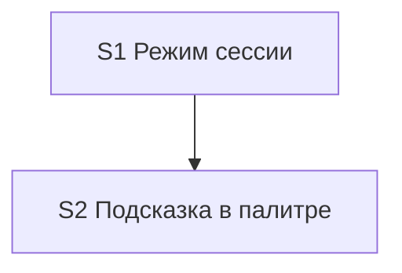

# Quality Controller — Slice Coherence

- Change: `kit-session-api-mode`
- Date: 2026-08-17
- Mode: slice-generation (`tasks.md` ещё нет; оценка `design.md` § `## Slices` против `specs/session-api-mode/spec.md`)
- Domain: kit-метапроект (правила/команды/FAQ; информационной базы 1С нет). Наблюдаемость Primary — сессия Cursor, не отладчик 1С.
- Scope gate: критерии 1, 3, 5, 5b, 8, 8b, 9–11. Архитектуру выбора моделей не оценивал.

## Verdict

`CRITICAL`

Оба предложенных среза вертикальные, foundation-среза нет, Primary каждого среза достижим своими файлами. Блокер генерации `tasks.md`: в колонке **Primary acceptance** у S1 и у S2 записаны **три** независимых user-journey через точку с запятой — `acceptance-simplicity-overload`. Критерий 5 (`S<N>.accept` / `<!-- slice-gate -->`) — ещё не создан; не CRITICAL (срезы в design вертикальные).

## Slice Summary

| Slice | Scenario | Tasks | Acceptance | Dependencies | Gate |
|---|---|---|---|---|---|
| S1 Режим сессии | Ключи `-noapi`/`-api` и память после лимита управляют дорогими вызовами | ещё нет | `S1.accept` ещё не создан; в design Primary = 3 journey (перегруз) | нет | ещё не создан |
| S2 Подсказка в палитре | Пользователь видит ключ в FAQ и в палитре команд, без ключа у дешёвых команд | ещё нет | `S2.accept` ещё не создан; в design Primary = 3 journey (перегруз) | S1 | ещё не создан |

Notes:

- `form_mode: n/a`. Слои метаданных/форм/BSL для completeness не требуются.
- Матрица design: `session-api-mode` → S1 + S2 (capability, не поимённый список `#### Scenario:` на срез).
- Список «Scenarios из spec» в design — 13 пунктов парафразом, без привязки к S1/S2.

## Scenario Coverage

Правило: `#### Scenario:` покрыт, если его можно положить в Primary, optional accept или агентскую `S<N>.<M>` предложенного среза. `tasks.md` нет — покрытие **предлагаемое**, не фактическое.

Привязка по смыслу среза (не написана в design явно):

### session-api-mode → S1 (поведение сессии)

| Scenario | Covered by (proposed) | Status |
|---|---|---|
| Ключ без API | S1 Primary (1 из 3 journey) | OK (proposed) |
| Ключ с API | S1 Primary (1 из 3 journey) | OK (proposed) |
| Оба токена в одном сообщении | S1 (optional / `S1.<M>`) | OK (proposed) |
| Ложное слово не включает режим | S1 (optional / `S1.<M>`) | OK (proposed) |
| Новый чат сбрасывает | S1 (optional / `S1.<M>`) | OK (proposed) |
| Память после лимита | S1 Primary (1 из 3 journey) | OK (proposed) |
| Таймаут не липнет | S1 (optional / `S1.<M>`) | OK (proposed) |
| Целостность первого сбоя | S1 (optional / `S1.<M>` static) | OK (proposed) |
| Не путать с пропуском архитектора | S1 (optional / `S1.<M>`) | OK (proposed) |
| Эскалация в режиме без API | S1 (optional / `S1.<M>`) | OK (proposed) |

### session-api-mode → S2 (обнаруживаемость)

| Scenario | Covered by (proposed) | Status |
|---|---|---|
| Подсказка в палитре | S2 Primary (1 из 3 journey) | OK (proposed) |
| Команда без дорогих вызовов молчит | S2 Primary (1 из 3 journey) | OK (proposed) |
| FAQ включает и выключает | S2 Primary (1 из 3 journey) | OK (proposed) |

**Orphans:** нет (13/13 есть куда положить). `accept-bullets-missing-scenario` не эмитирован: чеклиста accept ещё нет.

Implementation-only кандидаты на агентский путь «верифицировать по коду» (не user-spike): «Целостность первого сбоя», «Ложное слово не включает режим», «Оба токена в одном сообщении».

## Dependency Graph

- Cycles: нет.
- Forward acceptance (приёмка S1 требует S2): нет.
- Объявленная дуга S2 после S1 существует; родителей-призраков нет.
- S1 принимаем без S2 (режим работает без FAQ). S2 — документационная зависимость, не runtime-фундамент.

## Criteria

1. **Scenario Coverage** — 13/13 предлагаемо покрыты (S1: 10 поведения; S2: 3 подсказки). Поимённой колонки «Связь со spec» на срез в design нет (см. Suggestions).
3. **Slice Completeness** — для kit: файлы S1 (`model-selection.mdc`, `tool-name-guard.mdc`, `session-discipline.mdc`) достаточны для суженного Primary «написал `-noapi`». Файлы S2 (FAQ + команды с дорогими вызовами) достаточны для суженного Primary «FAQ включает и выключает». `opsx-status.md` в колонке файлов S2 нет — нужен только если молчание `/opsx:status` останется в blocking Primary; после сужения — задача `S2.<M>` static.
5. **Slice Gate Integrity** — `S<N>.accept` и `<!-- slice-gate -->` **ещё не созданы** (`tasks.md` отсутствует). Не CRITICAL: оба среза в design вертикальные (критерий 8).
5b. **Acceptance Checklist Coverage** — колонка `Primary acceptance` в design заполнена для S1 и S2. Sub-bullet `**Primary (обязательно):**` в `S<N>.accept` ещё не создан; не CRITICAL. Пустого accept нет (accept нет). Foreign-scenario в accept проверить нельзя.
8. **Verticality** — mandatory Primary обоих срезов описывает наблюдаемое в чате Cursor: токен → следующий дорогой вызов без платной попытки; текст FAQ/палитры. Не вызов функции в отладчике. `slice-not-vertical` не срабатывает.
8b. **Self-achievable** — S1 Primary достижим правилами S1 без файлов S2. S2 Primary достижим FAQ/командами без повторной смены семантики цепочки. Дубля user-journey S1↔S2 нет (поведение vs текст справки). `slice-accept-not-self-achievable` не срабатывает.
9. **Foundation + gate** — S1 не programmatic-only; у него свой UX-исход. S2 — другой исход (обнаруживаемость). Условия `slice-foundation-with-gate` не выполнены все сразу.
10. **Acceptance simplicity** — **нарушено** в design: S1 и S2 Primary — по три независимых Given→When→Then в одной ячейке. Это станет тремя blocking journey, если скопировать в один `**Primary (обязательно):**` или в несколько mandatory sub-bullets.
11. **User Task Contract** — `S<N>.<M>` нет. Mechanical pre-check: none. Не эмитирован.

## Task readability

`tasks.md` ещё нет. Критерий 7 не применяется. При генерации: глагол + файл + результат; в `S<N>.accept` — буквальные имена `#### Scenario:`.

## Alerts

### 1. `acceptance-simplicity-overload`

- **Affected:** S1 (design.md § Slices, колонка Primary acceptance)
- **Type:** `acceptance-simplicity-overload`
- **Severity:** CRITICAL
- **Evidence:** ячейка S1: «Написал `-noapi` — следующий дорогой вызов на модели чата; после сбоя лимита следующие вызовы в этом чате не повторяют падение; `-api` снова включает таблицу». Три разных setup (токен; живой сбой лимита; сброс `-api`), не шаги одного Given→When→Then. Соответствуют Scenario «Ключ без API», «Память после лимита», «Ключ с API».
- **Recommendation:** один blocking Primary = Scenario «Ключ без API» (действие пользователя без ожидания живого лимита). Остальное — optional в будущем `S1.accept` или `S1.<M>` (static для целостности/границ слова).

### Remediation (auto-repair)

- alert: `acceptance-simplicity-overload`
- target: `openspec/changes/kit-session-api-mode/design.md` § Slices, строка S1
- action: Заменить Primary acceptance S1 на одно предложение: «Написал `-noapi` или `--noapi` → следующий дорогой вызов идёт на модели чата, без попытки платной модели.» В `tasks.md` (когда будет): `**Primary acceptance:**` тот же текст; в `S1.accept` ровно один sub-bullet `**Primary (обязательно):**` с этим текстом. Optional: Scenario «Ключ с API», «Память после лимита», «Новый чат сбрасывает», «Таймаут не липнет», «Не путать с пропуском архитектора», «Эскалация в режиме без API». Agent `S1.<M>`: «Оба токена в одном сообщении», «Ложное слово не включает режим», «Целостность первого сбоя».

---

### 2. `acceptance-simplicity-overload`

- **Affected:** S2 (design.md § Slices, колонка Primary acceptance)
- **Type:** `acceptance-simplicity-overload`
- **Severity:** CRITICAL
- **Evidence:** ячейка S2: «В FAQ есть как включить и выключить режим; у перечисленных команд — одна строка про ключ; у `/opsx:status` своего ключа нет». Три поверхности (FAQ, палитра, status) = три Scenario («FAQ включает и выключает», «Подсказка в палитре», «Команда без дорогих вызовов молчит»).
- **Recommendation:** один blocking Primary = Scenario «FAQ включает и выключает». Палитра и молчание `/opsx:status` — optional или `S2.<M>` static.

### Remediation (auto-repair)

- alert: `acceptance-simplicity-overload`
- target: `openspec/changes/kit-session-api-mode/design.md` § Slices, строка S2
- action: Заменить Primary acceptance S2 на: «В FAQ kit есть как включить режим ключом в чате, как выключить, и чем это не является пропуском архитектора.» В будущем `S2.accept`: один `**Primary (обязательно):**` с этим текстом. Optional: Scenario «Подсказка в палитре». `S2.<M>`: открыть `.cursor/commands/opsx-status.md` и убедиться, что ключ не объявлен флагом команды (Scenario «Команда без дорогих вызовов молчит»). При необходимости добавить `opsx-status.md` в колонку файлов S2.

---

### 3. `scenario-orphan-design`

- **Affected:** `design.md` § Slices (строки S1 и S2)
- **Type:** `scenario-orphan-design`
- **Severity:** SUGGESTION
- **Evidence:** футер «Scenarios из spec» перечисляет 13 пунктов парафразом одним абзацем; нет поля «Связь со spec» с буквальными `#### Scenario:` на каждый срез.
- **Recommendation:** под таблицей два списка с точными именами из spec.md (S1: десять; S2: три). Снижает риск пропустить имя при генерации `**Связь со spec:**`.

### Remediation (auto-repair)

- alert: `scenario-orphan-design`
- target: `openspec/changes/kit-session-api-mode/design.md` § Slices
- action: Заменить абзац «Scenarios из spec:» на два буллета. S1: «Ключ без API», «Ключ с API», «Оба токена в одном сообщении», «Ложное слово не включает режим», «Новый чат сбрасывает», «Память после лимита», «Таймаут не липнет», «Целостность первого сбоя», «Не путать с пропуском архитектора», «Эскалация в режиме без API». S2: «Подсказка в палитре», «Команда без дорогих вызовов молчит», «FAQ включает и выключает».

## Recommendations

### Automatic fix

- Сузить Primary S1 и S2 в `design.md` § Slices (алерты 1–2) **до** генерации `tasks.md`.
- Проставить буквальные имена Scenario на срез (алерт 3).
- В `tasks.md`: ровно один `S<N>.accept` + `<!-- slice-gate -->` на срез; один mandatory Primary; остальные Scenario — optional или `S<N>.<M>`.

### Decision required

- Нет. Срезы **не** объединять: S1 — режим в чате, S2 — обнаруживаемость справки; оба исхода самостоятельны; 8b/9 чистые. Не дробить S1 на «токены» vs «память» (одни файлы, ложный foundation). Не откладывать подпись S1 до S2.

### Explicit non-alerts

- `slice-not-vertical` — не эмитирован (оба Primary black-box в сессии Cursor).
- `slice-foundation-with-gate` — не эмитирован.
- `slice-accept-not-self-achievable` — не эмитирован.
- `primary-acceptance-missing` / `accept-checklist-empty` — не эмитированы (колонка Primary есть; тело accept ещё не создано — не CRITICAL на этом gate).
- `accept-bullets-missing-scenario` / `accept-bullet-foreign-scenario` — не эмитированы (`tasks.md` нет).
- `user-task-contract-violation` — не эмитирован (`S<N>.<M>` нет; pre-check none).
- `no-slices` — не эмитирован (есть `## Slices`; это generation gate, не legacy tasks).
- Отсутствие тестовых данных / «исполнимо на ИБ прямо сейчас» — out of scope (kit; transient).
