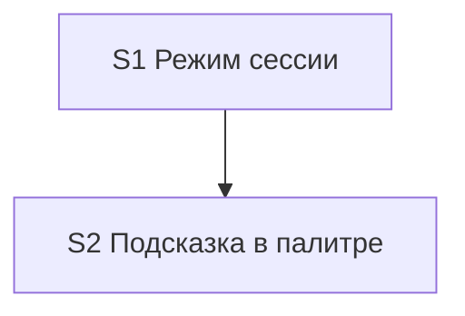

# Quality Controller — Slice Coherence

- Change: `kit-session-api-mode`
- Date: 2026-08-18
- Mode: slice (`# Срез S1`, `# Срез S2` в `tasks.md`)
- Domain: kit-метапроект (правила / команды / FAQ; информационной базы 1С нет). Наблюдаемость Primary — сессия Cursor, не отладчик 1С.
- Scope: `proposal.md`, `design.md`, `tasks.md`, `specs/session-api-mode/spec.md`. Критерии 1–6, 8, 8b, 9–11 + читаемость задач.
- Prior: `reports/quality-control-2026-08-17.md` (generation-gate по `design.md` § Slices, `tasks.md` ещё не было). CRITICAL `acceptance-simplicity-overload` на обоих срезах — в текущих артефактах закрыт.

## Verdict

`OK`

Два среза с самостоятельными исходами: S1 — режим сессии по ключу в чате; S2 — обнаруживаемость в FAQ и палитре. Primary каждого среза один, наблюдаемый, достижим своими задачами. 13/13 Scenario покрыты. Foundation-среза нет. User-spike в `S<N>.<M>` нет.

## Slice Summary

| Slice | Scenario | Tasks | Acceptance | Dependencies | Gate |
|---|---|---|---|---|---|
| S1 Режим сессии | В чате `-noapi` / `-api` и память после лимита управляют дорогими вызовами; таблица ролей не ломается | S1.1–S1.11 (11) | `S1.accept` (7/10; 3 в S1.8–S1.10) | нет | да `<!-- slice-gate -->` |
| S2 Подсказка в палитре | Пользователь видит, что ключ можно написать в чате, не ища его у каждой команды | S2.1–S2.9 (9); `Режим apply: mechanical` | `S2.accept` (2/3; 1 в S2.9) | S1 | да `<!-- slice-gate -->` |

Notes:

- `form_mode: n/a`. Слои метаданных / форм / BSL для completeness не требуются.
- Размер: 20 рабочих задач + 2 accept (≥16, Full). Второй срез оправдан отдельным пользовательским исходом (справка), не числом задач.
- Primary S1 и S2 в `tasks.md` совпадают с колонкой `design.md` § Slices (после сужения отчёта 2026-08-17).
- Имя Scenario «Ключ без API» в теле `S1.accept` не дублируется отдельным буллетом: это и есть mandatory Primary (канон формата).

## Scenario Coverage

Правило: `#### Scenario:` покрыт Primary, optional-буллетом `S<N>.accept` или агентской `S<N>.<M>` (static). User IB/runtime — только через accept.

### session-api-mode → S1 (поведение сессии)

| Scenario | Covered by | Status |
|---|---|---|
| Ключ без API | S1 Primary / `S1.accept` **Primary (обязательно)** | OK |
| Ключ с API | `S1.accept` optional | OK |
| Оба токена в одном сообщении | S1.8 (верифицировать по тексту) | OK |
| Ложное слово не включает режим | S1.9 (верифицировать по тексту) | OK |
| Новый чат сбрасывает | `S1.accept` optional | OK |
| Память после лимита | `S1.accept` optional | OK |
| Таймаут не липнет | `S1.accept` optional | OK |
| Целостность первого сбоя | S1.10 (верифицировать по тексту) | OK |
| Не путать с пропуском архитектора | `S1.accept` optional; слой S1.5 | OK |
| Эскалация в режиме без API | `S1.accept` optional; слой S1.4 | OK |

### session-api-mode → S2 (обнаруживаемость)

| Scenario | Covered by | Status |
|---|---|---|
| FAQ включает и выключает | S2 Primary / `S2.accept` **Primary (обязательно)**; слой S2.1 | OK |
| Подсказка в палитре | `S2.accept` optional; слои S2.2–S2.8 | OK |
| Команда без дорогих вызовов молчит | S2.9 (верифицировать по тексту `opsx-status.md`) | OK |

**Orphans:** нет (13/13). `accept-bullets-missing-scenario` не эмитирован: три S1-сценария и один S2 покрыты только `S<N>.<M>` — это допустимо (критерий 5b).

Implementation-only (агент static, не user-spike): «Оба токена в одном сообщении», «Ложное слово не включает режим», «Целостность первого сбоя», «Команда без дорогих вызовов молчит».

## Dependency Graph

- Cycles: нет.
- Forward acceptance (приёмка S1 требует S2): нет. Primary S1 не ссылается на FAQ/палитру.
- Объявленная дуга: S2 `**Зависимости:** S1`; родитель существует.
- Незаявленных рёбер нет. S1 принимаем без S2 (режим работает без справки). S2 — документационная зависимость, не runtime-фундамент.
- Внутрисрезовые рёбра: S1.8–S1.11 после правок S1.1–S1.7; S2.9 после палитры. Циклов задач нет.

## Criteria

1. **Scenario Coverage** — 13/13. S1: 10 поведения (Primary + 6 optional + 3 static). S2: 3 подсказки (Primary + 1 optional + 1 static). Поимённые `**Связь со spec:**` в `tasks.md` совпадают с `#### Scenario:` spec и со списками `design.md` § Slices.

2. **Slice Independence** — S1 без зависимостей вперёд. S2 зависит только назад (S1). Принятие S1 не требует S2. Исходы различны: поведение оркестратора vs текст FAQ/палитры.

3. **Slice Completeness** — для kit: файлы S1 (`model-selection.mdc`, `tool-name-guard.mdc`, `session-discipline.mdc`) достаточны для Primary «написал `-noapi`». Файлы S2 (`faq-kit.md` + команды с дорогими вызовами) достаточны для Primary «FAQ включает и выключает». `opsx-status.md` — задача S2.9 static, не blocking Primary. Метаданные 1С / формы / BSL не нужны (`form_mode: n/a`).

4. **Slice Dependency Graph** — см. выше. Объявления совпадают с `design.md` («S1 независим. S2 после S1»).

5. **Slice Gate Integrity** — ровно один `S1.accept` и один `S2.accept`; по одному `<!-- slice-gate -->` на срез; дублей и legacy `S<N>.T<M>` нет. Текст маркера совпадает с Primary.

5b. **Acceptance Checklist Coverage** — у обоих срезов есть `**Primary acceptance:**` в metadata и `**Primary (обязательно):**` в accept. Пустого accept нет. Чужих Scenario в чеклистах нет (S1 не содержит FAQ/палитру; S2 не содержит токены/память как Scenario).

6. **Rework Risk** — низкий. S2 не стартует без объявленной зависимости от S1. Одинаковых `#### Scenario:` на двух срезах нет. Факт «не пропуск архитектора» живёт в S1 как поведение (Scenario «Не путать…») и в S2 как текст FAQ (Scenario «FAQ включает и выключает») — разные сценарии spec, ожидаемая связка docs-follows-behavior.

8. **Verticality** — mandatory Primary S1: пользователь пишет ключ в чате → следующий дорогой вызов на модели чата (чёрный ящик сессии Cursor, не вызов функции в отладчике). Mandatory Primary S2: в FAQ видно включение / выключение / отличие от пропуска архитектора (чтение пользовательской справки). `slice-not-vertical` не срабатывает. Поле `**Приёмка:**` S1 допускает чтение правил плюс контрольный ход — supporting method, не замена Primary.

8b. **Self-achievable** — S1 Primary достижим правилами S1.1–S1.7 без файлов S2. S2 Primary достижим S2.1 без повторной смены семантики цепочки. Дубля user-journey S1↔S2 нет. Слоя, нужного Primary S1, в S2 нет (и наоборот). `slice-accept-not-self-achievable` не срабатывает. Исполнимость «прямо сейчас» в текущем чате / без перечитывания правил — transient, вне scope.

9. **Foundation + gate** — условие «S1.accept programmatic-only, а S2 — единственный UX» ложно: у S1 свой наблюдаемый исход. `slice-foundation-with-gate` не срабатывает (нужны все три условия сразу; третье не выполнено).

10. **Acceptance simplicity** — в каждом `S<N>.accept` ровно один mandatory black-box journey. Optional-буллеты помечены «(опционально)». Перегруз 2026-08-17 (три journey через «;» в design) в текущих `design.md` и `tasks.md` снят.

11. **User Task Contract** — mechanical pre-check (verify 2.1a): строки `S1.1–S1.11`, `S2.1–S2.9`; DENY-подстрок нет; repair-grep нет. Семантика: S1.8–S1.11 и S2.9 — агент «верифицировать по тексту» (ALLOW-agent static). Runtime-ход «написать `-noapi`» — только в `S1.accept` / metadata приёмки (граница среза, разрешено). Условных цепочек «после verify S / после стенда» нет.

## Task readability

Паттерн «глагол + файл + результат + (D/ADR)» выдержан на рабочих задачах. Опорные ссылки D1–D7 / ADR-0001 на месте, кроме регресса таблицы ролей S1.11 (цель ясна без голого идентификатора).

- `task-opaque-title` — не эмитирован.
- `task-too-short` — не эмитирован (все `S<N>.<M>` длиннее 8 слов, с путём файла).
- Заголовки `S1.accept` / `S2.accept` содержат бизнес-результат среза, не голое «проверить».
- Имена Scenario в optional-буллетах буквально совпадают с `#### Scenario:` spec.
- `Верифицировать по тексту` — агентский static-путь (аналог «по коду» для markdown-правил), не opaque-title.

## Alerts

Нет CRITICAL / WARNING / SUGGESTION.

## Recommendations

### Automatic fix

Нет.

### Decision required

Нет. Срезы **не** объединять: S1 — режим в чате, S2 — обнаруживаемость справки; оба исхода самостоятельны; 8b/9 чистые. Не дробить S1 на «токены» vs «память» (одни файлы, ложный foundation). Не откладывать подпись `S1.accept` до S2.

### Explicit non-alerts

- `acceptance-simplicity-overload` — закрыт относительно 2026-08-17: Primary S1 = Scenario «Ключ без API»; Primary S2 = Scenario «FAQ включает и выключает».
- `slice-not-vertical` — не эмитирован.
- `slice-foundation-with-gate` — не эмитирован.
- `slice-accept-not-self-achievable` — не эмитирован.
- `primary-acceptance-missing` / `accept-checklist-empty` — не эмитированы.
- `accept-bullets-missing-scenario` / `accept-bullet-foreign-scenario` — не эмитированы.
- `user-task-contract-violation` — не эмитирован (pre-check none + семантика).
- `legacy-acceptance-format` / `deprecated-phase-gate` / `no-slices` — не эмитированы.
- `scenario-orphan-design` (SUGGESTION 2026-08-17) — закрыт: в `design.md` § Slices два поимённых списка; в `tasks.md` поле `**Связь со spec:**` на каждый срез.
- Отсутствие тестовых данных / «исполнимо на ИБ прямо сейчас» — out of scope (kit; transient).
