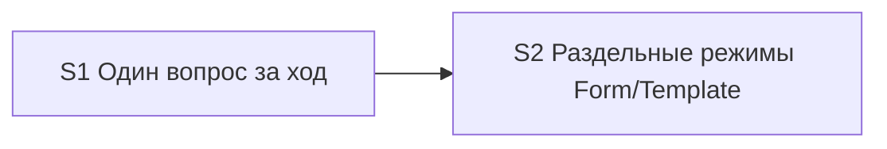

# Quality Control — sequential-ui-mode-questions (re-run 3)

**Date:** 2026-07-31  
**Mode:** slice  
**Context:** repair 2 — Empty includes `n/a`; Pair overrides legacy; 7 scenarios in `split-form-layout-modes` (+ 3 sequential)  
**Artifacts:** `tasks.md`, `design.md`, `proposal.md`, `specs/sequential-gate-questions/spec.md`, `specs/split-form-layout-modes/spec.md`  
**Manual config checklist:** none  
**Mechanical check issues:** none  
**User Task Contract pre-check evidence:** none  
**Repository state:** `.cursor/**` targets exist; `project.md` отсутствует (допустимо по design § Assumptions)

## Verdict

`OK`

## Slice Summary

| Slice | Scenario | Tasks | Acceptance | Dependencies | Gate |
|---|---|---|---|---|---|
| S1 Один вопрос за ход | One selection question per orchestrator turn (3 scenarios) | S1.1–S1.3 | S1.accept (Primary + 1 optional; 3/3) | нет | yes `<!-- slice-gate -->` |
| S2 Раздельные режимы Form/Template | Separate form and layout delivery modes (7 scenarios) | S2.1–S2.5 | S2.accept (Primary + 4 optional; 7/7 via Primary/optional/tasks) | S1 | yes `<!-- slice-gate -->` |

Follow-up F1–F2 вне срезов — не входят в gate.

## Scenario Coverage

| Scenario | Covered by | Status |
|---|---|---|
| Metadata question without Mode Gate in same message | S1 Primary; S1.1, S1.2 | OK |
| Second gate only after answer | S1 Primary; S1.1 | OK |
| Dual selection questions blocked | S1.accept optional; S1.3 | OK |
| Form-only change asks only about form | S2.2; S2.accept optional (paraphrase «Form-only / Layout-only») | OK |
| Layout-only change asks only about layout | S2.2; S2.accept optional (paraphrase «Form-only / Layout-only») | OK |
| Mixed modes for form and layout | S2 Primary; S2.1–S2.3 | OK |
| Legacy single artifact_mode still readable | S2 Primary; S2.1, S2.3, S2.4 | OK |
| Pair fields override legacy artifact_mode | S2.accept optional (literal); S2.1, S2.3, S2.4 | OK |
| Kit evolution without UI modes | S2.2; S2.accept optional (paraphrase «Kit evolution») | OK |
| Empty mode blocks apply for in-scope artifact | S2.accept optional (literal); S2.1, S2.3, S2.4 (empty/`n/a`) | OK |

Всего `#### Scenario:` в specs: **10** (3 + 7). Пропусков нет.

## Dependency Graph



- Cycles: none  
- Forward acceptance dependency: none (S2 зависит от S1 только назад)  
- Undeclared dependencies: none (`**Зависимости:** S1` совпадает с design `## Slices`)

## Checklist evaluation

| # | Criterion | Result |
|---|---|---|
| 1 | Scenario Coverage | Pass — все 10 `#### Scenario:` покрыты Primary / optional accept / `S<N>.<M>` |
| 2 | Slice Independence | Pass — S1 принимаем без S2; S2 объявляет зависимость от S1 |
| 3 | Slice Completeness | Pass — kit-meta: слои = skills/rules/templates; нужные файлы в задачах S1/S2 |
| 4 | Slice Dependency Graph | Pass |
| 5 | Slice Gate Integrity | Pass — ровно один `S<N>.accept` + `<!-- slice-gate -->` на срез |
| 5b | Acceptance Checklist Coverage | Pass — Primary metadata + mandatory Primary sub-bullet в обоих срезах; Pair и Empty покрыты optional + tasks |
| 6 | Rework Risk | Low — сценарии не дублируются между срезами; зависимость явная |
| 8 | Slice Verticality | Pass — оба Primary: наблюдаемый протокол `/opsx:new` / proposal+apply (black-box для автора ЗНИ) |
| 8b | Self-Achievable Acceptance | Pass — Primary S1 достижим S1.1–S1.3; Primary S2 достижим S2.1–S2.5 (pair override, empty/`n/a` STOP) без слоя из более позднего среза |
| 9 | Foundation slice with gate | Pass — S1 Primary не programmatic-only; не foundation+consumer double-gate |
| 10 | Acceptance Simplicity | Pass — по одному mandatory Primary sub-bullet на срез |
| 11 | User Task Contract | Pass — в `S<N>.<M>` нет runtime-spike / ИБ / консоль / отладчик; DENY-подстрок нет. Приёмка «учебный прогон» только в `S<N>.accept` |

## Task readability

| Task | Assessment |
|---|---|
| S1.1, S1.2 | Verb + file + change + (Decision) — OK |
| S1.3 | Verb + target (self-check new) + HALT rule — OK |
| S2.1 | Verb + file + split modes + pair/legacy + empty/`n/a` STOP + (Decision) — OK |
| S2.2 | Verb + file + sequence/resume/extend + (Decision) — OK |
| S2.3–S2.4 | Verb + file + pair-over-legacy + empty/`n/a` STOP — OK |
| S2.5 | Verb + file list + term sync — OK |
| S1.accept / S2.accept | Business result in title; Primary mandatory present — OK |

Алертов `task-opaque-title` / `task-too-short` / `accept-checklist-empty` нет.

## Alerts

*(none CRITICAL / WARNING)*

### SUGGESTION — accept Scenario titles (literal match)

- **affected:** S2.accept optional bullets; S2 `**Связь со spec:**`  
- **type:** naming hygiene (not `accept-bullets-missing-scenario` — coverage exists)  
- **severity:** SUGGESTION  
- **evidence:** Spec titles are `Form-only change asks only about form`, `Layout-only change asks only about layout`, `Kit evolution without UI modes`; accept uses `«Form-only / Layout-only»` and `«Kit evolution»`. Metadata `**Связь со spec:**` abbreviates with ellipsis and omits explicit listing of Scenario «Pair fields override legacy artifact_mode» and «Empty mode blocks apply for in-scope artifact» (оба покрыты в accept/tasks). Pair и Empty в optional bullets уже literal.  
- **recommendation:** При желании выровнять оставшиеся paraphrases и полный перечень в `**Связь со spec:**` с `#### Scenario:` буквально; на покрытие и вердикт не влияет.

## Recommendations

### Automatic fix

*(none required for CRITICAL/WARNING)*

Optional hygiene (manual):

```markdown
### Remediation (auto-repair)
- alert: naming-hygiene-scenario-titles (SUGGESTION)
- target: tasks.md + slice S2
- action: В S2.accept заменить «Form-only / Layout-only» и «Kit evolution» на literal Scenario names; в **Связь со spec:** перечислить все 7 Scenario буквально, включая Pair и Empty
```

### Decision required

*(none)*

## Delta vs previous QC (`quality-control-2026-07-31-2.md`)

| Item | Previous (QC-2) | This run (QC-3) |
|---|---|---|
| S2 Scenario count | 6 (+ Empty; Pair absent from coverage table) | **7** (+ Pair fields override legacy) |
| Pair coverage | not listed | OK (optional accept literal + S2.1/S2.3/S2.4) |
| Empty / `n/a` | Empty present; `n/a` in tasks | Pass — empty/`n/a` explicit in S2.1–S2.4 and Empty Scenario |
| Verdict | OK | OK |
