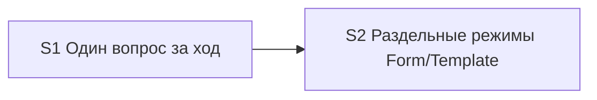

# Quality Control — sequential-ui-mode-questions

**Date:** 2026-07-31  
**Mode:** slice  
**Artifacts:** `tasks.md`, `design.md`, `proposal.md`, `specs/sequential-gate-questions/spec.md`, `specs/split-form-layout-modes/spec.md`

## Verdict

`OK`

## Slice Summary

| Slice | Scenario | Tasks | Acceptance | Dependencies | Gate |
|---|---|---|---|---|---|
| S1 Один вопрос за ход | One selection question per orchestrator turn (3 scenarios) | S1.1–S1.3 | S1.accept (Primary + 1 optional; 3/3 via Primary/optional/tasks) | нет | yes `<!-- slice-gate -->` |
| S2 Раздельные режимы Form/Template | Separate form and layout delivery modes (5 scenarios) | S2.1–S2.5 | S2.accept (Primary + 2 optional; 5/5 via Primary/optional/tasks) | S1 | yes `<!-- slice-gate -->` |

Follow-up F1–F2 вне срезов — не входят в gate.

## Scenario Coverage

| Scenario | Covered by | Status |
|---|---|---|
| Metadata question without Mode Gate in same message | S1 Primary; S1.1, S1.2 | OK |
| Second gate only after answer | S1 Primary; S1.1 | OK |
| Dual selection questions blocked | S1.accept optional; S1.3 | OK |
| Form-only change asks only about form | S2.2; S2.accept optional (paraphrase) | OK |
| Layout-only change asks only about layout | S2.2; S2.accept optional (paraphrase) | OK |
| Mixed modes for form and layout | S2 Primary; S2.1–S2.3 | OK |
| Legacy single artifact_mode still readable | S2 Primary; S2.1, S2.3, S2.4 | OK |
| Kit evolution without UI modes | S2.2; S2.accept optional (paraphrase) | OK |

## Dependency Graph

- Cycles: none  
- Forward acceptance dependency: none (S2 depends on S1 backward only)  
- Undeclared dependencies: none (`**Зависимости:** S1` matches design `## Slices`)

## Checklist evaluation

| # | Criterion | Result |
|---|---|---|
| 1 | Scenario Coverage | Pass — all 8 `#### Scenario:` covered |
| 2 | Slice Independence | Pass — S1 принимаем без S2; S2 объявляет зависимость от S1 |
| 3 | Slice Completeness | Pass — kit-meta: слои = skills/rules/templates; все нужные файлы в задачах |
| 4 | Slice Dependency Graph | Pass |
| 5 | Slice Gate Integrity | Pass — ровно один `S<N>.accept` + `<!-- slice-gate -->` на срез |
| 5b | Acceptance Checklist Coverage | Pass — Primary metadata + mandatory Primary sub-bullet в обоих срезах |
| 6 | Rework Risk | Low — сценарии не дублируются между срезами; зависимость явная |
| 8 | Slice Verticality | Pass — оба Primary: наблюдаемый протокол `/opsx:new` / proposal+apply (black-box для автора ЗНИ) |
| 8b | Self-Achievable Acceptance | Pass — Primary S1 достижим S1.1–S1.3; Primary S2 достижим S2.1–S2.5 без слоя из более позднего среза |
| 9 | Foundation slice with gate | Pass — S1 Primary не programmatic-only; не foundation+consumer double-gate |
| 10 | Acceptance Simplicity | Pass — по одному mandatory Primary sub-bullet на срез |
| 11 | User Task Contract | Pass — в `S<N>.<M>` нет runtime-spike / ИБ / консоль / отладчик; DENY-подстрок нет. Приёмка «учебный прогон» только в `S<N>.accept` |

## Task readability

| Task | Assessment |
|---|---|
| S1.1, S1.2 | Verb + file + change + (Decision) — OK |
| S1.3 | Verb + target (self-check new) + HALT rule — OK; путь к SKILL подразумевается контекстом среза |
| S2.1–S2.5 | Verb + file(s) + outcome + Decision where needed — OK |
| S1.accept / S2.accept | Business result in title; Primary mandatory present — OK |

## Alerts

*(none CRITICAL / WARNING)*

### SUGGESTION — accept Scenario titles (literal match)

- **affected:** S2.accept optional bullets  
- **type:** naming hygiene (not `accept-bullets-missing-scenario` — coverage exists)  
- **severity:** SUGGESTION  
- **evidence:** Spec titles are `Form-only change asks only about form`, `Layout-only change asks only about layout`, `Kit evolution without UI modes`; accept uses `«Form-only / Layout-only»` and `«Kit evolution»`.  
- **recommendation:** При желании выровнять имена в optional bullets (и в `**Связь со spec:**`) с `#### Scenario:` буквально; на покрытие и вердикт не влияет.

### SUGGESTION — named Scenario lines in S1.accept

- **affected:** S1.accept  
- **type:** readability (coverage already via Primary)  
- **severity:** SUGGESTION  
- **evidence:** Scenarios «Metadata question without Mode Gate in same message» and «Second gate only after answer» folded into Primary without `Scenario «…»` lines; Dual named as optional.  
- **recommendation:** Опционально добавить два optional `Scenario «…»` с точными именами из spec для зеркальности чеклиста.

## Recommendations

### Automatic fix

- Нет обязательных auto-repair (нет CRITICAL/WARNING с remediation block).

### Decision required

- Нет. Декомпозиция S1→S2 согласована с design `## Slices` и даёт два независимых outcome (последовательность вопросов vs раздельные режимы Form/Template).

## Notes (out of scope acknowledged)

- Исполнимость учебного прогона на конкретной ИБ / наличие тестовых данных — не оценивались (transient).  
- Manual config markers / phase-gate / User Task Contract pre-check evidence — по входному брифу verify: замечаний нет; подтверждено повторным просмотром `tasks.md`.
