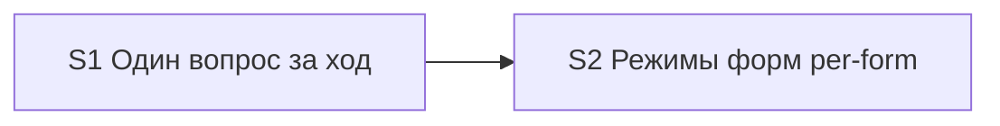

# Quality Control — sequential-ui-mode-questions

**Date:** 2026-08-01  
**Mode:** slice  
**Context:** verify Layer 2 — Slice Coherence (criteria 1–6, 8, 8b, 9–11); после user-extend forms-only / per-form (`decision_round=1`); capabilities: `sequential-gate-questions`, `split-form-layout-modes`  
**Artifacts:** `tasks.md`, `design.md`, `proposal.md`, `specs/sequential-gate-questions/spec.md`, `specs/split-form-layout-modes/spec.md`  
**Manual config checklist (verify 7.5):** маркеров ручной конфигурации реквизитов/элементов формы не найдено; «вручную» только в Primary accept S2 как политика макета  
**Mechanical check issues (7A–7E):** none — checkboxes OK; slice-gate markers present; Forms mode section (`## Forms mode`, `form_mode: n/a`) present; no phase-gate; no unbalanced fences  
**User Task Contract pre-check evidence (2.1a):** none  
**Repository state:** kit meta-change — правки только `.cursor/**`; прикладной BSL/Form.xml в задачах отсутствуют; `openspec/project.md` может отсутствовать (допущение design)

## Verdict

`OK`

## Slice Summary

| Slice | Scenario | Tasks | Acceptance | Dependencies | Gate |
|---|---|---|---|---|---|
| S1 Один вопрос за ход | One selection question per orchestrator turn (3 scenarios) | S1.1–S1.3 | S1.accept (Primary + 1 optional; 3/3 via Primary/optional/tasks) | нет | yes `<!-- slice-gate -->` |
| S2 Режимы форм (per-form) | Per-form delivery modes for managed forms (7 scenarios) | S2.1–S2.5 | S2.accept (Primary + 5 optional; 7/7 via Primary/optional/tasks) | S1 | yes `<!-- slice-gate -->` |

Follow-up F1–F2 вне срезов — не входят в gate.  
**Режим apply:** mechanical на обоих срезах (migration/docs kit).

## Scenario Coverage

| Scenario | Covered by | Status |
|---|---|---|
| Metadata question without Mode Gate in same message | S1 Primary; S1.1, S1.2 | OK |
| Second gate only after answer | S1 Primary; S1.1 | OK |
| Dual selection questions blocked | S1.accept optional (literal); S1.3 | OK |
| Form Mode question on design for in-scope form | S2 Primary; S2.1, S2.2 | OK |
| Multiple forms get sequential Mode questions | S2.accept optional (literal); S2 Primary; S2.2 | OK |
| No layout Mode question in new | S2 Primary; S2.1, S2.2 | OK |
| Layout stays manual unless apply permission | S2.accept optional (literal); S2 Primary; S2.1, S2.3, S2.5 | OK |
| Legacy single artifact_mode maps to form_mode | S2.accept optional (literal); S2.2, S2.3, S2.4 | OK |
| Kit evolution without form modes | S2.accept optional (literal); S2.2 | OK |
| Empty form mode blocks apply for in-scope form | S2.accept optional (literal); S2.3, S2.4 | OK |

Всего `#### Scenario:` в specs: **10** (3 + 7). Пропусков нет. Agent-path «верифицировать по коду» не требуется: покрытие через Primary / optional accept / задачи-правки skills/rules.

## Dependency Graph

- Cycles: none  
- Forward acceptance dependency: none (S2 ← S1 только назад; Primary S1 — инвариант END TURN после Metadata, не требует слоя S2)  
- Undeclared dependencies: none (`**Зависимости:** S1` совпадает с design `## Slices`)  
- Duplicate Primary journeys: none (S1 — последовательность вопросов; S2 — per-form `form_mode` + политика макета)

## Checklist evaluation

| # | Criterion | Result |
|---|---|---|
| 1 | Scenario Coverage | Pass — все 10 `#### Scenario:` покрыты Primary / optional accept / `S<N>.<M>` |
| 2 | Slice Independence | Pass — S1 принимаем без S2; S2 объявляет зависимость от S1 |
| 3 | Slice Completeness | Pass — kit-meta: слои = skills/rules/templates/docs; нужные файлы в задачах S1/S2 |
| 4 | Slice Dependency Graph | Pass |
| 5 | Slice Gate Integrity | Pass — ровно один `S<N>.accept` + `<!-- slice-gate -->` на срез |
| 5b | Acceptance Checklist Coverage | Pass — `**Primary acceptance:**` + mandatory Primary sub-bullet в обоих срезах; foreign Scenario в accept нет |
| 6 | Rework Risk | Low — outcomes различны (последовательность vs per-form modes); зависимость явная |
| 8 | Slice Verticality | Pass — оба Primary: наблюдаемый протокол `/opsx:new` / proposal+apply (black-box для автора ЗНИ), не programmatic-only |
| 8b | Self-Achievable Acceptance | Pass — Primary S1 достижим S1.1–S1.3; Primary S2 достижим S2.1–S2.5 без слоя более позднего среза; дубля Primary нет |
| 9 | Foundation slice with gate | Pass — S1 Primary не programmatic-only; не foundation+consumer double-gate |
| 10 | Acceptance Simplicity | Pass — по одному mandatory Primary sub-bullet на срез (многоклаузальный Then в одном Primary S2 — один journey учебного прогона, не второй mandatory bullet) |
| 11 | User Task Contract | Pass — в `S<N>.<M>` нет runtime-spike / ИБ / консоль / отладчик; DENY-подстрок нет. «Учебный прогон» только в `S<N>.accept` / metadata приёмки; «вручную» в Primary S2 — политика макета, не задача создать метаданные |

## Task readability

| Task | Assessment |
|---|---|
| S1.1, S1.2 | Verb + file + change + (Decision) — OK |
| S1.3 | Verb + target (self-check `/opsx:new`) + HALT rule — OK |
| S2.1 | Verb + file + form-only Mode Gate + `form_mode` + layout policy + (Decision) — OK |
| S2.2 | Verb + file + design-stage cycle / resume / extend / legacy — OK |
| S2.3, S2.4 | Verb + file + per-form readers + empty/`n/a` + layout default — OK |
| S2.5 | Verb + file list + term sync + 1c-mxl policy — OK (длинно, но самодостаточно) |
| S1.accept / S2.accept | Бизнес-результат в заголовке; Primary + named optional Scenario — OK |
| F1, F2 | Follow-up prefix — OK (исключение readability) |

Alerts readability: none.

## Alerts

(none)

## Recommendations

### Automatic fix

(none)

### Decision required

(none)

## Notes

- Два среза при ~10 задачах оправданы независимыми outcomes (порог Standard): S1 — UX последовательности гейтов; S2 — per-form `form_mode` и политика макета вне Mode Gate.
- Имя capability `split-form-layout-modes` историческое; содержание specs/tasks — forms-only / per-form; расхождение имени не влияет на Scenario Coverage.
- Предыдущий отчёт `quality-control-2026-08-01.md` относился к dual-channel постановке (12 Scenario); этот прогон — post-extend forms-only (10 Scenario).
