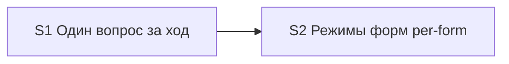

# Quality Control — sequential-ui-mode-questions

**Date:** 2026-08-01  
**Mode:** slice  
**Context:** re-verify after repair-from-verify (design-challenge-2026-08-01-2 — `implementation_invariant` gaps closed); new Scenario «Layout non-manual requires recorded apply permission»; capabilities: `sequential-gate-questions`, `split-form-layout-modes`  
**Artifacts:** `tasks.md`, `design.md`, `proposal.md`, `specs/sequential-gate-questions/spec.md`, `specs/split-form-layout-modes/spec.md`  
**Manual config checklist:** маркеров создания реквизитов/элементов не найдено  
**Mechanical check issues:** none expected  
**User Task Contract pre-check evidence:** none  
**Repository state:** kit meta-change — правки только `.cursor/**`; прикладной BSL/Form.xml в задачах отсутствуют

## Verdict

`OK`

## Slice Summary

| Slice | Scenario | Tasks | Acceptance | Dependencies | Gate |
|---|---|---|---|---|---|
| S1 Один вопрос за ход | One selection question per orchestrator turn (3 scenarios) | S1.1–S1.3 | S1.accept (Primary + 1 optional; 3/3 via Primary/optional/tasks) | нет | yes `<!-- slice-gate -->` |
| S2 Режимы форм (per-form) | Per-form delivery modes for managed forms (8 scenarios) | S2.1–S2.5 | S2.accept (Primary + 6 optional; 8/8 via Primary/optional/tasks) | S1 | yes `<!-- slice-gate -->` |

Follow-up F1–F2 вне срезов — не входят в gate.  
**Режим apply:** mechanical на обоих срезах (migration/docs kit).

## Scenario Coverage

| Scenario | Covered by | Status |
|---|---|---|
| Metadata question without Mode Gate in same message | S1 Primary; S1.1, S1.2 | OK |
| Second gate only after answer | S1 Primary; S1.1 | OK |
| Dual selection questions blocked | S1.accept optional (literal); S1.3 | OK |
| Form Mode question on design for in-scope form | S2 Primary; S2.1, S2.2 | OK |
| Multiple forms get sequential Mode questions | S2.accept optional (literal); S2 Primary; S2.2 | OK |
| No layout Mode question in new | S2 Primary; S2.1, S2.2 | OK |
| Layout stays manual unless apply permission | S2.accept optional (literal); S2 Primary; S2.1, S2.3, S2.5 | OK |
| Legacy single artifact_mode maps to form_mode | S2.accept optional (literal); S2.2, S2.3, S2.4 | OK |
| Kit evolution without form modes | S2.accept optional (literal); S2.2 | OK |
| Empty form mode blocks apply for in-scope form | S2.accept optional (literal); S2.3, S2.4 | OK |
| Layout non-manual requires recorded apply permission | S2.accept optional (literal); S2.1 (Decision 9); S2.3, S2.5 | OK |

Всего `#### Scenario:` в specs: **11** (3 + 8). Пропусков нет. Agent-path «верифицировать по коду» не требуется: покрытие через Primary / optional accept / задачии правки skills/rules. Новый Scenario «Layout non-manual requires recorded apply permission» закрыт optional-буллетом в `S2.accept` (буквальное имя) и задачами S2.1 / S2.3 / S2.5 (норма разрешения + запись в `debug.md` § Apply permissions / `[mxl:…]`).

## Dependency Graph

- Cycles: none  
- Forward acceptance dependency: none (S2 ← S1 только назад; Primary S1 — инвариант END TURN после Metadata, не требует слоя S2)  
- Undeclared dependencies: none (`**Зависимости:** S1` совпадает с design `## Slices`)  
- Duplicate Primary journeys: none (S1 — последовательность вопросов; S2 — per-form `form_mode` + политика макета / recorded permission)

## Checklist evaluation

| # | Criterion | Result |
|---|---|---|
| 1 | Scenario Coverage | Pass — все 11 `#### Scenario:` покрыты Primary / optional accept / `S<N>.<M>` |
| 2 | Slice Independence | Pass — S1 принимаем без S2; S2 объявляет зависимость от S1 |
| 3 | Slice Completeness | Pass — kit-meta: слои = skills/rules/templates/docs; нужные файлы в задачах S1/S2 |
| 4 | Slice Dependency Graph | Pass |
| 5 | Slice Gate Integrity | Pass — ровно один `S<N>.accept` + `<!-- slice-gate -->` на срез |
| 5b | Acceptance Checklist Coverage | Pass — `**Primary acceptance:**` + mandatory Primary sub-bullet в обоих срезах; foreign Scenario в accept нет; новый layout-permission Scenario в optional S2 |
| 6 | Rework Risk | Low — outcomes различны (последовательность vs per-form modes + layout permission); зависимость явная |
| 8 | Slice Verticality | Pass — оба Primary: наблюдаемый протокол `/opsx:new` / proposal+apply (black-box для автора ЗНИ), не programmatic-only |
| 8b | Self-Achievable Acceptance | Pass — Primary S1 достижим S1.1–S1.3; Primary S2 достижим S2.1–S2.5 без слоя более позднего среза; дубля Primary нет |
| 9 | Foundation slice with gate | Pass — S1 Primary не programmatic-only; не foundation+consumer double-gate |
| 10 | Acceptance Simplicity | Pass — по одному mandatory Primary sub-bullet на срез (многоклаузальный Then в одном Primary S2 — один journey учебного прогона, не второй mandatory bullet) |
| 11 | User Task Contract | Pass — в `S<N>.<M>` нет runtime-spike / ИБ / консоль / отладчик; DENY-подстрок нет. «Учебный прогон» только в `S<N>.accept` / metadata приёмки; «вручную» в Primary S2 — политика макета, не задача создать метаданные |

## Task readability

| Task | Assessment |
|---|---|
| S1.1, S1.2 | Verb + file + change + (Decision) — OK |
| S1.3 | Verb + target (self-check `/opsx:new`) + HALT rule — OK |
| S2.1 | Verb + file + form-only Mode Gate + `form_mode` + layout policy / Decision 9 + (Decision) — OK |
| S2.2 | Verb + file + design-stage cycle / resume / extend / legacy — OK |
| S2.3, S2.4 | Verb + file + per-form readers + empty/`n/a` + layout default / recorded permission — OK |
| S2.5 | Verb + file list + term sync + `1c-mxl` permission policy — OK (длинный список файлов допустим для sync-задачи) |
| S1.accept / S2.accept | Заголовок с бизнес-результатом; Primary + optional Scenario с буквальными именами — OK |
| F1, F2 | Follow-up exception — OK |

Алерты readability: нет (`task-opaque-title`, `task-too-short`, `accept-bullets-missing-scenario`, `accept-checklist-empty`, `accept-bullet-foreign-scenario` не сработали).

## Alerts

Нет алертов CRITICAL / WARNING / SUGGESTION.

## Recommendations

### Automatic fix

Нет.

### Decision required

Нет. Структура срезов и покрытие после repair (новый Scenario layout permission) согласованы; apply mechanical допустим по slice-gate.
