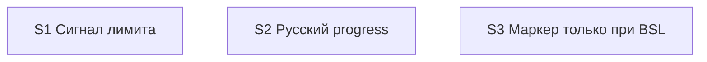

# Quality Controller — Slice Coherence

- Change: `kit-session-noapi-visibility-and-ru-progress`
- Date: 2026-08-19
- Run: третий прогон (`quality-control-2026-08-19-3`); не перезаписывает `quality-control-2026-08-19.md` и `quality-control-2026-08-19-2.md`
- Mode: slice (`# Срез S1`, `# Срез S2`, `# Срез S3` в `tasks.md`)
- Domain: kit-метапроект (правила / команды / FAQ; информационной базы 1С нет). Наблюдаемость Primary — чтение правил kit и FAQ / поведение оркестратора в сессии Cursor, не отладчик 1С.
- Scope: `proposal.md`, `design.md`, `tasks.md`, `debug.md`, `specs/session-api-mode/spec.md`, `specs/chat-surface-clarity/spec.md`, `specs/chat-model-profiles/spec.md`, `specs/sequential-gate-questions/spec.md`, `specs/subagent-model-mapping/spec.md`. Критерии 1–6, 8, 8b, 9–11 + читаемость задач.
- Constraints: не оценивать исполнимость приёмки «прямо сейчас»; structural user-spike в `S<N>.<M>` — in scope. Ручных маркеров конфигурации нет. Mechanical User Task Contract pre-check: none. Кода 1С в scope нет. `openspec/project.md` отсутствует (норма kit).
- Delta vs `quality-control-2026-08-19-2.md`: в scope добавлена дельта `subagent-model-mapping` (MODIFIED чатовой строки); в S1 — задачи S1.4/S1.15 и два optional-сценария про строку «Модель архитектора: Opus 5» / независимый разбор; покрытие 13/13 (было 11/11 без этой дельты).

## Verdict

`OK`

Три среза с самостоятельными исходами: S1 — после лимита в чате канон, без печати токена, плюс отдельная чатовая строка при отсутствии слага сильной модели; S2 — progress `/opsx:*` только русский; S3 — вопрос маркера автора только если будет BSL, поздний BSL — вопрос на apply. Primary каждого среза один, наблюдаемый на поверхности kit, достижим своими задачами. 13/13 Scenario покрыты. Foundation-среза нет. User-spike в `S<N>.<M>` нет. Общие файлы бюджета у S1 и S2 **не ломают независимость приёмки** (см. критерий 2). Объединение срезов не требуется.

## Slice Summary

| Slice | Scenario | Tasks | Acceptance | Dependencies | Gate |
|---|---|---|---|---|---|
| S1 Сигнал лимита | После лимита в чате канон; токен не печатается; дальше модель чата | S1.1, S1.14, S1.2–S1.13, S1.15 (15 рабочих) | `S1.accept` (7/7; 1 Primary закрывает «Канон в том же ходе» + «Токен не печатается»; 5 optional; static S1.8–S1.13, S1.15) | нет | да `<!-- slice-gate -->` |
| S2 Русский progress | Progress `/opsx:*` только по-русски; профиль не отменяет язык | S2.1–S2.10 (10); `Режим apply: mechanical` | `S2.accept` (3/3; Primary «Progress на русском» + язык профиля; 2 optional; static S2.8–S2.10) | нет | да `<!-- slice-gate -->` |
| S3 Маркер только при BSL | `/opsx:new` без BSL не спрашивает маркер; с BSL — как сейчас; поздний BSL — вопрос на apply | S3.1, S3.2, S3.6, S3.3–S3.5 (6); `Режим apply: mechanical` | `S3.accept` (3/3; Primary «Нет BSL — нет вопроса маркера»; 2 optional; static S3.3–S3.5) | нет | да `<!-- slice-gate -->` |

Notes:

- `form_mode: n/a`. Слои метаданных / форм / BSL для completeness не требуются.
- Размер: 31 рабочая задача + 3 accept (≥16, Full). Три среза оправданы тремя независимыми пользовательскими исходами, не числом задач.
- ID S1.14 / S1.15 и S3.6 вставлены внутри среза (след extend). Нумерация не сплошная — на coherence не влияет.
- Поле `**Primary acceptance:**` S1 совпадает с `**Приёмка:**` «чтение правил kit» и с задачей S1.14 (триггер в §5). Чатовая строка Opus 5 — optional, не второй mandatory journey.
- Колонка `design.md` § Slices для S3 шире (включает поздний BSL в строку Primary); в `tasks.md` поздний BSL — optional. Исполняемый контракт — `tasks.md`.
- Имена Scenario в `**Связь со spec:**` буквально совпадают с `#### Scenario:` пяти дельт и со списками `design.md` § Slices (включая «Нет слага сильной модели — строка про Opus 5», «Независимый разбор постановки идёт на Fable», «Поздний BSL — вопрос на apply»).
- Матрица `design.md`: `session-api-mode` + `subagent-model-mapping` → S1; `chat-surface-clarity` + `chat-model-profiles` → S2; `sequential-gate-questions` → S3. Совпадает с `tasks.md`. `subagent-model-mapping` — MODIFIED; остальные дельты — ADDED.

## Scenario Coverage

Правило: `#### Scenario:` покрыт Primary, optional-буллетом `S<N>.accept` или агентской `S<N>.<M>` (static / «верифицировать по тексту»). User IB/runtime — только через accept. Для kit static = чтение markdown-правил агентом.

### session-api-mode → S1

| Scenario | Covered by | Status |
|---|---|---|
| Канон в том же ходе | S1 Primary / `S1.accept` **Primary (обязательно)**; слой S1.14 (§5 бюджета) + S1.1; static S1.8 | OK |
| Токен не печатается | S1 Primary / `S1.accept` **Primary (обязательно)**; слой S1.1; static S1.9 | OK |
| Фон не отменяется | `S1.accept` optional; слой S1.2; static S1.10 | OK |
| Токен не требует канона лимита | `S1.accept` optional; слой S1.3; static S1.11 | OK |
| FAQ токен и память | `S1.accept` optional; слой S1.7; static S1.12 | OK |

### subagent-model-mapping → S1

| Scenario | Covered by | Status |
|---|---|---|
| Нет слага сильной модели — строка про Opus 5 | `S1.accept` optional; слой S1.4 (`model-selection.mdc` + `architect.md`); static S1.15 | OK |
| Независимый разбор постановки идёт на Fable | `S1.accept` optional; слой S1.4 (ветка «нет слага → Opus 5 + строка в чат»). Spec явно: наблюдаемая приёмка — текст правил, не успешный `Task` со слагом | OK |

### chat-surface-clarity → S2

| Scenario | Covered by | Status |
|---|---|---|
| Progress на русском | S2 Primary / `S2.accept` **Primary (обязательно)**; слои S2.1–S2.3; static S2.8 | OK |
| Verify без английского progress | `S2.accept` optional; слой S2.7; static S2.9 | OK |

### chat-model-profiles → S2

| Scenario | Covered by | Status |
|---|---|---|
| Профиль не меняет язык | `S2.accept` optional; слои S2.4–S2.6; static S2.10. Часть Primary S2 («в профиле Grok — запрет менять язык команды») | OK |

### sequential-gate-questions → S3

| Scenario | Covered by | Status |
|---|---|---|
| Нет BSL — нет вопроса маркера | S3 Primary / `S3.accept` **Primary (обязательно)**; слои S3.1–S3.2; static S3.3 | OK |
| Есть BSL — вопрос маркера как сейчас | `S3.accept` optional; слои S3.1–S3.2; static S3.4 | OK |
| Поздний BSL — вопрос на apply | `S3.accept` optional; слой S3.6 (`openspec-apply-change` Metadata Prep); static S3.5 | OK |

**Orphans:** нет (13/13). `accept-bullets-missing-scenario` не эмитирован: все Scenario есть в Primary или optional accept. Имена Primary-сценариев не дублируются отдельным буллетом — канон формата. Scenario «Независимый разбор постановки идёт на Fable» не назван в static S1.15 — покрытие optional accept + слой S1.4 достаточно (критерий 5b: покрытие в accept OK).

Implementation-only (агент static, не user-spike): S1.8–S1.13, S1.15, S2.8–S2.10, S3.3–S3.5. S1.13 — регресс таблицы ролей (не Scenario spec); место в `S<N>.<M>` по правилу среза 6. S1.14, S1.4 и S3.6 — агентские правки markdown, не user-spike.

Смежные, но не дубли: «Канон в том же ходе» (S1 — обязанность и триггер в §5) vs «Профиль не меняет язык» (S2 — MAY профиля не отменяет канон и язык). «Нет слага сильной модели — строка про Opus 5» (S1 — норма в правиле выбора моделей) vs «Verify без английского progress» (S2 — допустимые русские фразы verify, среди них та же строка). Разные `#### Scenario:` разных spec.

## Dependency Graph

Три изолированных узла. Объявлено: все `**Зависимости:** нет` — согласовано с `design.md` («Зависимости срезов: нет. Каждый самодостаточен»).

- Cycles: нет.
- Forward acceptance: нет. Primary S1 не ссылается на progress/маркер. Primary S2 не требует текста триггера §5 из задач S1. Primary S3 не зависит от S1/S2.
- Незаявленных рёбер, необходимых для Primary, нет.
- Общие файлы `chat-output-budget.mdc` / `chat-output-budget-full.mdc`: **не ребро графа приёмки** (см. критерий 2 и 6).
- Мягкая связка содержимого (не ребро): S1.4 пишет русскую строку «Модель архитектора: Opus 5»; S2.7/S2.9 ссылаются на неё как на допустимую фразу verify. S2.2 добавляет пункт §1b «язык и канон» (self-check «канон сказан») — напоминание перед отправкой, не триггер §5 и не Scenario S1 в accept S2. S2.5–S2.6 — MUST NOT «не отменять канон лимита» в профиле, самодостаточная правка файлов S2.
- Внутрисрезовые рёбра: S1.14 до static S1.8; S1.4 до static S1.15; S3.6 до static S3.5; static после записей. Циклов задач нет.

## Criteria

1. **Scenario Coverage** — 13/13. S1: 7 (Primary закрывает 2 из `session-api-mode` + 3 optional той же дельты + 2 optional `subagent-model-mapping` + static). S2: 3 (Primary + 2 optional + static). S3: 3 (Primary + 2 optional + static). Поимённые `**Связь со spec:**` совпадают с `#### Scenario:` пяти дельт.

2. **Slice Independence** — каждый срез принимаем без следующих. Циклов нет. `slice-accept-not-self-achievable` по независимости не срабатывает (см. 8b).

   **Пересечение файлов бюджета S1 ∩ S2.** S1.14 правит `chat-output-budget.mdc` и `chat-output-budget-full.mdc` **§5** (триггер канона в разборе сбоя). S2.1–S2.3 правят те же два файла в **§6 и §1b** (русский progress, пункт self-check). `design.md` § Risks фиксирует владельцев секций: «S1 владеет §5, S2 — §6 и §1b; на apply не смешивать абзацы».

   Это **не** нарушение независимости срезов:
   - Приёмка S1 = «в §5 есть триггер; нет печати `-noapi`; нет цитаты платформы». Не требует §6 / русского progress / профиля Grok.
   - Приёмка S2 = «progress `/opsx:*` только русский; профиль не меняет язык». Не требует, чтобы §5 уже содержал триггер S1.14: норма языка живёт в §6, запрет профиля — в `model-grok4.mdc`.
   - Apply по умолчанию идёт срез за срезом: правки §5 и §6/§1b не обязаны смешиваться в одном ходе.
   - Дубля Primary / одного user-journey на двух срезах нет. Чатовая строка Opus 5 — optional S1, не Primary S2.

   Вывод: общее имя файла ≠ зависимость приёмки. Алерт по критерию 2 не эмитируется.

3. **Slice Completeness** — для kit: S1 содержит слой бюджета §5 (S1.14), `model-selection.mdc`, `architect.md` (S1.4, чатовая строка MODIFIED), cue, FAQ. S2: stub+full §6/§1b, стиль, профиль, verify SKILL. S3: `openspec-new-change/SKILL.md`, `brief-card.md` для Primary; `openspec-apply-change/SKILL.md` (S3.6) для Scenario «Поздний BSL». `command-session-persistence.mdc` намеренно не в срезе (D10). Метаданные 1С / формы / BSL не нужны. Таблица ролей не переписывается (S1.13 — регресс).

4. **Slice Dependency Graph** — см. выше. Объявления совпадают с `design.md`. Несуществующих родителей нет. Пересечение файлов не требует объявить `S2 → S1` или `S1 → S2`. Ссылка S2.7 на фразу из `model-selection.mdc` — указатель источника нормы verify, не `**Зависимости:** S1`.

5. **Slice Gate Integrity** — ровно один `S1.accept`, `S2.accept`, `S3.accept`; по одному `<!-- slice-gate -->` на срез; дублей и legacy `S<N>.T<M>` нет; `<!-- phase-gate -->` нет. Текст маркера совпадает с Primary среза (S3 gate не включает поздний BSL — верно, gate = Primary; S1 gate не включает строку Opus 5 — верно, optional).

5b. **Acceptance Checklist Coverage** — у всех трёх есть `**Primary acceptance:**` в metadata и `**Primary (обязательно):**` в accept. Пустого accept нет. Чужих Scenario в чеклистах нет: S1 не содержит progress/маркер как `Scenario «…»`; S2 не содержит FAQ/токен/Fable/поздний BSL как имя Scenario; S3 не содержит канон/progress. Новые Scenario дельты `subagent-model-mapping` — optional в S1.accept, имена буквально как в spec. `primary-acceptance-missing` / `accept-checklist-empty` / `accept-bullets-missing-scenario` / `accept-bullet-foreign-scenario` не срабатывают.

6. **Rework Risk** — низкий. Срезы не стартуют с опоры на непринятый соседний. Одинаковых `#### Scenario:` на двух срезах нет. Мягкая связка S1.4 ↔ optional S2.9 и §1b «язык и канон» (S2.2) не блокируют приёмку S2. Последовательный apply S1 затем S2 (или наоборот) при раздельных секциях не заставляет переписывать Primary соседнего среза. Риск смешать абзацы при правке одного файла — операционный, закрыт инструкцией design; не WARNING coherence.

8. **Verticality** — mandatory Primary описывает наблюдаемое поведение продукта kit, не вызов функции в отладчике. S1: триггер канона в том же ходе виден в бюджете §5; оркестратор не печатает `-noapi`; платформа не цитируется. S2: progress `/opsx:*` только русский; профиль не меняет язык. S3: на ЗНИ без `.bsl` вопроса маркера нет. `**Приёмка:**` = чтение правил/FAQ — метод kit-поверхности. Spec `subagent-model-mapping` сам фиксирует: приёмка — текст правил, не живой `Task`. `slice-not-vertical` не срабатывает.

8b. **Self-achievable** — S1 Primary достижим S1.14 (§5) + S1.1 (запрет печати токена) без файлов S2/S3. Optional Opus 5 / Fable достижимы S1.4 внутри того же среза. S2 Primary достижим S2.1–S2.5 без повторной смены семантики канона S1. S3 Primary достижим S3.1–S3.2; Scenario позднего BSL не входит в mandatory Primary и достижим S3.6 внутри того же среза. Дубля user-journey между соседними срезами нет. `slice-accept-not-self-achievable` не срабатывает. Исполнимость «прямо сейчас» в текущем чате — transient, вне scope. Объединение срезов не показано.

9. **Foundation + gate** — структурный признак «`S<K+1>` с `**Зависимости:** S<K>`» ложен (все «нет»). Ни один accept не является programmatic-only фундаментом под UX следующего. S1.4 — слой того же среза для optional Scenario MODIFIED-дельты, не foundation под S2. S3.6 — слой того же среза для optional Scenario, не foundation под S4. Критерий 9 условие 3 (S<K>.accept programmatic-only при UX у следующего) ложно: все три Primary — наблюдаемая поверхность kit. `slice-foundation-with-gate` не срабатывает.

10. **Acceptance simplicity** — в каждом `S<N>.accept` ровно один mandatory black-box journey. Optional помечены «(опционально)». S1 Primary — один момент «после лимита» (триггер + не печатать токен + не цитировать платформу), не два mandatory буллета; строка Opus 5 optional. S2 — один исход «язык `/opsx:*`». S3 — один исход «без BSL нет вопроса»; поздний BSL optional.

11. **User Task Contract** — mechanical pre-check оркестратора: none. DENY-подстрок в строках `S<N>.<M>` нет. Repair-grep нет. Семантика: S1.8–S1.13, S1.15, S2.8–S2.10, S3.3–S3.5 — агент «верифицировать по тексту» (ALLOW-agent static). S1.4, S1.14 и S3.6 — агент дописывает markdown правил/скилла, не runtime пользователя. Наблюдаемое чтение правил / FAQ — только в `S<N>.accept` и metadata `**Приёмка:**`. `user-task-contract-violation` не срабатывает.

## Task readability

Паттерн «глагол + файл + результат + (D)» выдержан на рабочих задачах, включая слой MODIFIED-дельты:

- S1.4: «Записать» + `model-selection.mdc` / `architect.md` + канон «Модель архитектора: Opus 5» (D7).
- S1.14: «Добавить» + оба файла бюджета + §5 триггер канона в том же ходе (D2).
- S1.15: «Верифицировать по тексту» + те же файлы + Scenario «Нет слага сильной модели — строка про Opus 5» (D7).
- S3.6: «Дописать» + `openspec-apply-change/SKILL.md` + Metadata Prep для `n/a` (D8, Scenario «Поздний BSL — вопрос на apply»).

- `task-opaque-title` — не эмитирован.
- `task-too-short` — не эмитирован.
- Заголовки `S1.accept` / `S2.accept` / `S3.accept` содержат бизнес-результат среза.
- Имена Scenario в optional-буллетах буквально совпадают с `#### Scenario:` spec.
- `Верифицировать по тексту` — агентский static-путь для kit-правил, не opaque-title.

## Alerts

Нет CRITICAL / WARNING / SUGGESTION.

## Recommendations

### Automatic fix

Нет.

### Decision required

Нет. Объединение срезов не показано: три независимых пользовательских исхода; Primary каждого среза самодостаточен. Общие файлы бюджета S1/S2 при раздельных секциях не создают forward-зависимость приёмки. Дельта `subagent-model-mapping` корректно сидит в S1 (тот же файл выбора моделей, optional к Primary «сигнал лимита»), отдельный четвёртый срез не показан.

### Optional polish (не алерт)

- ID S1.14 / S1.15 / S3.6 не в числовом порядке отображения — нормально для вставки extend; перенумеровать не требуется.
- Static S1.15 называет только «Нет слага сильной модели — строка про Opus 5»; соседний Scenario «Независимый разбор постановки идёт на Fable» закрыт optional accept + S1.4. Дописывать имя во S1.15 не обязательно.
- В `design.md` § Slices строка Primary S3 упоминает поздний BSL; в `tasks.md` это optional. Исполняемый контракт — tasks; при желании сузить строку таблицы design до Primary «без BSL нет вопроса».
