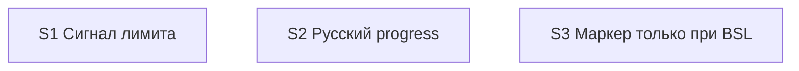

# Quality Controller — Slice Coherence

- Change: `kit-session-noapi-visibility-and-ru-progress`
- Date: 2026-08-19
- Mode: slice (`# Срез S1`, `# Срез S2`, `# Срез S3` в `tasks.md`)
- Domain: kit-метапроект (правила / команды / FAQ; информационной базы 1С нет). Наблюдаемость Primary — чтение правил kit и FAQ / поведение оркестратора в сессии Cursor, не отладчик 1С.
- Scope: `proposal.md`, `design.md`, `tasks.md`, `specs/session-api-mode/spec.md`, `specs/chat-surface-clarity/spec.md`, `specs/chat-model-profiles/spec.md`, `specs/sequential-gate-questions/spec.md`. Критерии 1–6, 8, 8b, 9–11 + читаемость задач.
- Constraints: не оценивать исполнимость приёмки «прямо сейчас»; structural user-spike в `S<N>.<M>` — in scope. Ручных маркеров конфигурации нет. Mechanical User Task Contract pre-check: none. Кода 1С в scope нет.

## Verdict

`OK`

Три среза с самостоятельными исходами: S1 — после лимита в чате канон, без печати токена; S2 — progress `/opsx:*` только русский; S3 — вопрос маркера автора только если будет BSL. Primary каждого среза один, наблюдаемый на поверхности kit, достижим своими задачами. 10/10 Scenario покрыты. Foundation-среза нет. User-spike в `S<N>.<M>` нет. Объединение срезов не требуется.

## Slice Summary

| Slice | Scenario | Tasks | Acceptance | Dependencies | Gate |
|---|---|---|---|---|---|
| S1 Сигнал лимита | После лимита в чате канон; токен не печатается; дальше модель чата | S1.1–S1.13 (13) | `S1.accept` (5/5; 1 Primary закрывает «Канон в том же ходе» + «Токен не печатается»; 3 optional; дубли static S1.8–S1.12) | нет | да `<!-- slice-gate -->` |
| S2 Русский progress | Progress `/opsx:*` только по-русски; профиль не отменяет язык | S2.1–S2.10 (10); `Режим apply: mechanical` | `S2.accept` (3/3; Primary «Progress на русском» + язык профиля; 2 optional; static S2.8–S2.10) | нет | да `<!-- slice-gate -->` |
| S3 Маркер только при BSL | `/opsx:new` без BSL не спрашивает маркер; с BSL — как сейчас | S3.1–S3.4 (4); `Режим apply: mechanical` | `S3.accept` (2/2; Primary «Нет BSL — нет вопроса маркера»; 1 optional; static S3.3–S3.4) | нет | да `<!-- slice-gate -->` |

Notes:

- `form_mode: n/a`. Слои метаданных / форм / BSL для completeness не требуются.
- Размер: 27 рабочих задач + 3 accept (≥16, Full). Три среза оправданы тремя независимыми пользовательскими исходами, не числом задач. Порог «второй срез только при самостоятельном outcome» выполнен.
- Поле `**Primary acceptance:**` в `tasks.md` для S1 сформулировано как инспекция правила (совпадает с `**Приёмка:**` «чтение правил kit»). Колонка `design.md` § Slices для S1 ближе к смоделированному лимиту в чате. Исход тот же (канон в ходе, без `-noapi`, без цитаты платформы); расхождение формулировки не ломает вертикальность и не требует объединения.
- Имена Scenario в `**Связь со spec:**` буквально совпадают с `#### Scenario:` дельт и со списками `design.md` § Slices.
- Матрица `design.md`: `session-api-mode` → S1; `chat-surface-clarity` + `chat-model-profiles` → S2; `sequential-gate-questions` → S3. Совпадает с `tasks.md`.

## Scenario Coverage

Правило: `#### Scenario:` покрыт Primary, optional-буллетом `S<N>.accept` или агентской `S<N>.<M>` (static / «верифицировать по тексту»). User IB/runtime — только через accept. Для kit static = чтение markdown-правил агентом.

### session-api-mode → S1

| Scenario | Covered by | Status |
|---|---|---|
| Канон в том же ходе | S1 Primary / `S1.accept` **Primary (обязательно)**; слой S1.1–S1.2; static S1.8 | OK |
| Токен не печатается | S1 Primary / `S1.accept` **Primary (обязательно)**; слой S1.1; static S1.9 | OK |
| Фон не отменяется | `S1.accept` optional; слой S1.2; static S1.10 | OK |
| Токен не требует канона лимита | `S1.accept` optional; слой S1.3; static S1.11 | OK |
| FAQ токен и память | `S1.accept` optional; слой S1.7; static S1.12 | OK |

### chat-surface-clarity → S2

| Scenario | Covered by | Status |
|---|---|---|
| Progress на русском | S2 Primary / `S2.accept` **Primary (обязательно)**; слои S2.1–S2.3; static S2.8 | OK |
| Verify без английского progress | `S2.accept` optional; слой S2.7; static S2.9 | OK |

### chat-model-profiles → S2

| Scenario | Covered by | Status |
|---|---|---|
| Профиль не меняет язык | `S2.accept` optional; слои S2.4–S2.6; static S2.10. Часть Primary S2 («в профиле Grok — запрет менять язык команды») | OK |

### sequential-gate-questions → S3

| Scenario | Covered by | Status |
|---|---|---|
| Нет BSL — нет вопроса маркера | S3 Primary / `S3.accept` **Primary (обязательно)**; слои S3.1–S3.2; static S3.3 | OK |
| Есть BSL — вопрос маркера как сейчас | `S3.accept` optional; слои S3.1–S3.2; static S3.4 | OK |

**Orphans:** нет (10/10). `accept-bullets-missing-scenario` не эмитирован: покрытие только в `S<N>.<M>` нигде не единственное; все Scenario есть в Primary или optional accept. Имена Primary-сценариев не дублируются отдельным буллетом — канон формата.

Implementation-only (агент static, не user-spike): S1.8–S1.13, S2.8–S2.10, S3.3–S3.4. S1.13 — регресс таблицы ролей (не Scenario spec); место в `S<N>.<M>` по правилу среза 6.

Смежные, но не дубли: «Канон в том же ходе» (S1 — обязанность сказать канон) vs «Профиль не меняет язык» (S2 — MAY профиля не отменяет канон и язык). Разные `#### Scenario:` разных spec.

## Dependency Graph

- Cycles: нет.
- Forward acceptance (приёмка `S<N>` требует `S<N+1>`): нет. Primary S1 не ссылается на progress/маркер. Primary S2 не требует текста канона из задач S1. Primary S3 не зависит от S1/S2.
- Объявленные дуги: все три `**Зависимости:** нет`. Родителей нет — объявления согласованы с `design.md` («Зависимости срезов: нет. Каждый самодостаточен»).
- Незаявленных рёбер, необходимых для Primary, нет.
- Мягкая связка содержимого (не ребро графа): S1.4 пишет русскую строку эскалации в `model-selection.mdc`; S2.7/S2.9 ссылаются на русские каноны (лимит / эскалация) как допустимые фразы verify. Optional Scenario S2, не blocking Primary. S2.5–S2.6 добавляют MUST NOT «не отменять канон лимита» в профиль — самодостаточная правка файлов S2.
- Внутрисрезовые рёбра: static S1.8–S1.13 после записей S1.1–S1.7; S2.8–S2.10 после S2.1–S2.7; S3.3–S3.4 после S3.1–S3.2. Циклов задач нет.

## Criteria

1. **Scenario Coverage** — 10/10. S1: 5 (Primary закрывает 2 + 3 optional + static). S2: 3 (Primary + 2 optional + static). S3: 2 (Primary + 1 optional + static). Поимённые `**Связь со spec:**` совпадают с `#### Scenario:` четырёх дельт.

2. **Slice Independence** — зависимости только «назад» отсутствуют вовсе. Каждый срез принимаем без следующих. Исходы различны: видимость режима после лимита vs язык progress vs условие вопроса маркера. Циклов нет. `slice-accept-not-self-achievable` по независимости не срабатывает (см. 8b).

3. **Slice Completeness** — для kit: файлы S1 (`model-selection.mdc`, `tool-name-guard.mdc`, `session-discipline.mdc`, `faq-kit.md`) достаточны для Primary «канон в том же ходе, без печати `-noapi`». Файлы S2 (budget stub+full, `opsx-output-style.md`, `model-grok4.mdc`, `model-adaptation.mdc`, verify SKILL) достаточны для Primary «русский progress + запрет профиля менять язык». Файлы S3 (`openspec-new-change/SKILL.md`, `brief-card.md`) достаточны для Primary «без BSL нет вопроса маркера». `command-session-persistence.mdc` намеренно не в срезе (D10). Метаданные 1С / формы / BSL не нужны.

4. **Slice Dependency Graph** — см. выше. Объявления совпадают с `design.md`. Несуществующих родителей нет.

5. **Slice Gate Integrity** — ровно один `S1.accept`, `S2.accept`, `S3.accept`; по одному `<!-- slice-gate -->` на срез; дублей и legacy `S<N>.T<M>` нет; `<!-- phase-gate -->` нет. Текст маркера совпадает с Primary среза.

5b. **Acceptance Checklist Coverage** — у всех трёх есть `**Primary acceptance:**` в metadata и `**Primary (обязательно):**` в accept. Пустого accept нет (`accept-checklist-empty` не срабатывает). Чужих Scenario в чеклистах нет: S1 не содержит progress/маркер как `Scenario «…»`; S2 не содержит FAQ/токен как имя Scenario; S3 не содержит канон/progress. `primary-acceptance-missing` / `accept-bullet-foreign-scenario` не срабатывают.

6. **Rework Risk** — низкий. Срезы не стартуют с опорой на непринятый соседний. Одинаковых `#### Scenario:` на двух срезах нет. Мягкая связка эскалации S1.4 ↔ optional S2.9 не блокирует приёмку S2. S1.13 (регресс таблицы ролей) внутри S1, не выносит приёмку в другой срез.

8. **Verticality** — mandatory Primary описывает наблюдаемое поведение продукта kit, не вызов функции в отладчике и не тип возвращаемого значения. S1: канон в том же ходе, оркестратор не печатает `-noapi`, платформа не цитируется. S2: progress `/opsx:*` только русский; профиль не меняет язык команды. S3: на ЗНИ без `.bsl` вопроса маркера нет. `**Приёмка:**` = чтение правил/FAQ — метод kit-поверхности, не замена Primary programmatic-only пунктом. `slice-not-vertical` не срабатывает.

8b. **Self-achievable** — S1 Primary достижим S1.1–S1.3 (видимость в `model-selection.mdc`) без файлов S2/S3. S2 Primary достижим S2.1–S2.5 без повторной смены семантики канона S1. S3 Primary достижим S3.1–S3.2. Дубля user-journey между соседними срезами нет (не «тот же экран/тот же Given-When-Then»). Слоя, нужного Primary S1, в S2/S3 нет (и наоборот). `slice-accept-not-self-achievable` не срабатывает. Исполнимость «прямо сейчас» в текущем чате — transient, вне scope. Объединение срезов не показано.

9. **Foundation + gate** — структурный признак «`S<K+1>` с `**Зависимости:** S<K>`» ложен (все «нет»). Семантика: ни один accept не является programmatic-only фундаментом под UX следующего. `slice-foundation-with-gate` не срабатывает (нужны все три условия сразу; второе и третье не выполнены).

10. **Acceptance simplicity** — в каждом `S<N>.accept` ровно один mandatory black-box journey. Optional помечены «(опционально)». S1 Primary складывает два близких Scenario одного момента «после лимита» в один ход (канон + не печатать токен) — это один journey, не два mandatory буллета. S2 Primary — один исход «язык `/opsx:*`», не два gate.

11. **User Task Contract** — mechanical pre-check оркестратора: none. DENY-подстрок (`тестовой ИБ`, `на стенде`, `runtime-verify`, `спайк`, `в консоли`, `отладчик`, `эмулировать вызов`, `вызвать API` без «по коду») в строках `S<N>.<M>` нет. Repair-grep (`При успешном verify S`, `после verify S`, `после стенда`) нет. Семантика: S1.8–S1.13, S2.8–S2.10, S3.3–S3.4 — агент «верифицировать по тексту» (ALLOW-agent static). Наблюдаемое чтение правил / FAQ — только в `S<N>.accept` и metadata `**Приёмка:**` (граница среза, разрешено). `user-task-contract-violation` не срабатывает.

## Task readability

Паттерн «глагол + файл + результат + (D)» выдержан на рабочих задачах. Опорные ссылки D1–D10 на месте.

- `task-opaque-title` — не эмитирован. S1.4 («Вынести рядом русскую одну строку про эскалацию…») не голый идентификатор D7: суть понятна без `design.md`. Путь файла в заголовке не повторён (в отличие от S1.1–S1.3); контекст группы «Правило выбора моделей» достаточен, отдельный алерт не ставится.
- `task-too-short` — не эмитирован (все `S<N>.<M>` длиннее 8 слов; у всех кроме S1.4 путь файла в строке задачи).
- Заголовки `S1.accept` / `S2.accept` / `S3.accept` содержат бизнес-результат среза, не голое «проверить».
- Имена Scenario в optional-буллетах буквально совпадают с `#### Scenario:` spec (включая тире в «Нет BSL — нет вопроса маркера» / «Есть BSL — вопрос маркера как сейчас»).
- `Верифицировать по тексту` — агентский static-путь для kit-правил, не opaque-title.

## Alerts

Нет CRITICAL / WARNING / SUGGESTION.

## Recommendations

### Automatic fix

Нет.

### Decision required

Нет. Объединение срезов не показано: три независимых пользовательских исхода; Primary каждого среза самодостаточен.

### Optional polish (не алерт)

- S1.4: для единообразия с S1.1–S1.3 можно явно указать `.cursor/rules/model-selection.mdc` в заголовке. На покрытие Scenario и gate не влияет.
