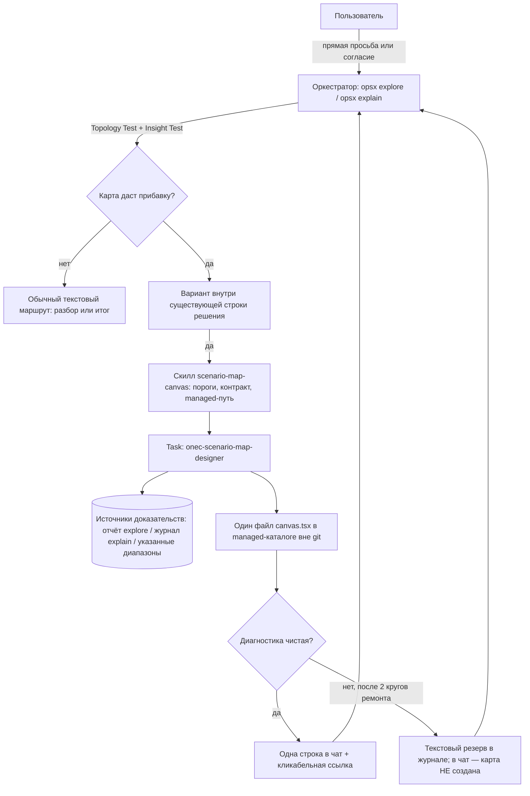
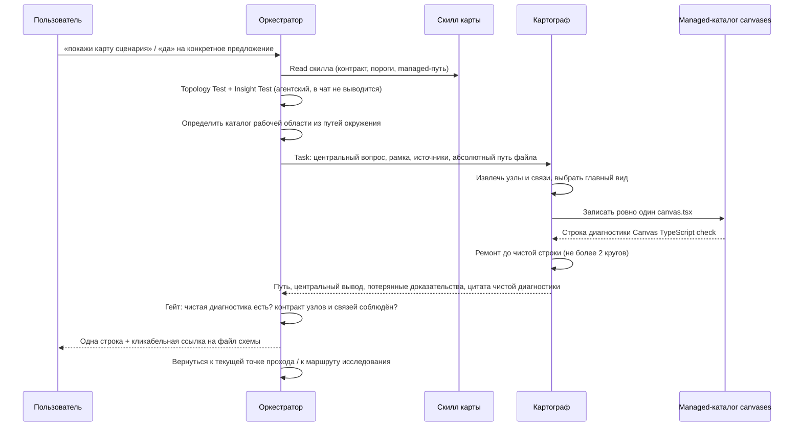

# Architecture: перестройка карты сценария (kit)

**Исход: карту нужно перестроить внутри действующей ЗНИ `scenario-map-canvas` через `/opsx:extend` двумя новыми срезами — S2 (причинный контракт «узлы + связи + слои», создание Canvas с нуля в managed-каталоге, отдельный субагент-картограф `onec-scenario-map-designer`) и S3 (предложение карты из исследования и из разбора по топологии, без замеров времени); срез S1 не отменяется целиком, но пять его требований уходят в MODIFIED, а один Scenario — в REMOVED.**

Причина трёх провалов — не исполнение, а три предписания текущего контракта, каждое из которых по отдельности выглядит осторожным, а вместе они делают карту недостижимой: (1) слот «Дальше» исследования закреплён за пошаговым разбором и намёк карты там прямо запрещён; (2) намёк на выходе разбора привязан к замерам времени, которых в причинных задачах не бывает; (3) панель считается доступной только если пользователь уже открыл её или сам назвал файл — для ещё не созданного managed-файла это замкнутый круг, и единственный разрешённый выход ведёт в плоский Markdown, который контракт при этом называет картой. Четвёртая, тихая причина — контракт узла `step/name/effect/evidence` и эталон-fixture в виде нумерованного списка: формально корректная реализация обязана получиться аккордеоном, потому что в контракте нет ни связей, ни слоёв, ни состояний.

---

## KB references

Discovery выполнен, совпадений нет: в kit отсутствует `openspec/knowledge/_index.yaml`, таксономия KB не развёрнута, KB Discovery пропущен. Идентификаторов `KB-NNNN` во входном промпте не было, повторно открываемых фактов нет, секция `## Knowledge conflicts` не требуется.

---

## Task

Перестроить контракт карты сценария в kit-репозитории так, чтобы панель рядом с чатом показывала причинность и слои, а не дублировала чат, и чтобы три сценария (исследование сложной топологии, разбор без замеров времени, прямая просьба «покажи карту сценария» при отсутствии панели) заканчивались настоящей визуализацией.

Ограничения задачи: kit-only (`.cursor/**`, `openspec/**`, агенты); `src/**` и продуктовый BSL не проектируются и не меняются; защита BSL/XML не ослабляется; модель субагента во frontmatter не фиксируется; отдельной команды карты не появляется; managed Canvas не коммитится.

Контрольный (золотой) сценарий — механизм визуализации штампа электронной подписи: два независимых кэша (`ОтметкаЭП` — PNG из макета; `ВизуализацияЭП` — копия файла с наложением), удаление только второго слоя приводит к повторному наложению **старой** PNG на оригинал. Топология подтверждена отчётом обследования (`temp/reports/exploration-2026-08-28-vizualizaciya-shtampa-ep.md`, разделы «Layers», «Что делает штамп устаревшим», «Риски массового удаления»), замеров времени в нём нет.

---

## Complexity

**Complex.** 17–19 файлов кита в трёх независимых контурах: контракт панели (скилл + fixtures), маршрутизация субагента (агент + 5 файлов правил и указателей), точки вызова в двух командах (`explore`, `explain` + три шаблона). Плюс пересмотр уже реализованного среза S1 той же capability — это добавляет обязательный Blast Radius и работу с открытой приёмкой, но не поднимает задачу до Critical: нет объектов метаданных 1С, нет перехвата типового кода, нет отката поведения в продуктовой базе, откат каждого контура делается выключением одной строки.

---

## Chosen Approach

**Approach:** Pragmatic balance — расширить существующий скилл-контракт до причинной модели и вынести генерацию визуального макета в отдельного субагента; точки вызова добавлять только как **вариант внутри уже существующей строки решения**, не как новый вопрос и не как новую команду.

**Rationale:**

- Молчание по умолчанию, отсутствие отдельной команды и обязательность доказательства у узла — это работающая часть S1, она снимает исходную боль «панель рисуется вне правил кита». Её сохраняем: атакуется не осторожность, а её реализация через непроходимые предикаты.
- Причинность и слои нельзя дописать поверх контракта `step/name/effect/evidence` — плоский контракт сам порождает аккордеон. Поэтому контракт заменяется, а не дополняется.
- Визуальную грамматику (какой вид схемы отвечает на вопрос и как разложить слои) нельзя оставить оркестратору посреди прохода разбора: это генерация 300–600 строк TSX в том же контексте, где идёт пошаговый разбор кода, плюс требование другой рабочей модели. Отсюда — субагент.
- Предложение карты обязано конкурировать с уже существующим единственным «Дальше», а не открывать второй слот. Отсюда — правило приоритета в исследовании и вариант внутри строки подтверждения в разборе.

### C1. Дополнять действующую ЗНИ через `/opsx:extend`, не заводить новую

**Chosen:** `/opsx:extend scenario-map-canvas` (профиль `user-extend`), два новых среза S2 и S3, плюс поправка к S1.

Обоснование:

1. Требования капабилити `scenario-map-canvas` живут **только** в дельте активной ЗНИ (`openspec/changes/scenario-map-canvas/specs/scenario-map-canvas/spec.md`) и ещё не перенесены в `openspec/specs/`. Новая ЗНИ не может корректно оформить `## MODIFIED Requirements` против дельты другой активной ЗНИ — MODIFIED/REMOVED адресуют главные specs. Две активные дельты на одну capability дают расхождение, которое verify обязан поймать как конфликт.
2. Это не дефект реализации S1 (код кита соответствует своей постановке), а изменение объёма той же capability. Placement по `vertical-slices`: изменение требований при непринятом срезе — новый срез в той же ЗНИ, с явной поправкой к формулировке приёмки существующего среза.
3. Ветка `origin/cursor/verify-scenario-map-canvas-0bf4` в расчёт не берётся: она не предок `develop`, задачи не отмечены, карты правок и отчёта приёмки нет. Второй постановкой не считается, merge не предлагается.

**Что делаем с открытой `S1.accept`:** приёмка S1 **сужается**, а не закрывается задним числом. В `tasks.md` у `S1.accept` остаётся Primary «без просьбы панели нет; по просьбе приходят узлы с эффектом и доказательством» и те optional-сценарии, которые S2/S3 не отменяют. Три optional-сценария помечаются как снятые с приёмки S1 и перенесённые в S2/S3: «Панель недоступна — узлы в журнале», «Намёк на выходе explain при условиях», «Просьба при числе узлов ниже порога». Так `S1.accept` можно закрыть по факту уже сделанного, не подписываясь под поведением, которое расширение отменяет.

### C2. Отдельный субагент-картограф

**Chosen:** новый агент `.cursor/agents/onec-scenario-map-designer.md`, класс — **1С-агент** (`onec-*`), frontmatter `model: inherit`.

Разделение ответственности жёсткое: **скилл `scenario-map-canvas` остаётся SSOT «когда рисуем и что должно быть на карте», картограф — исполнитель «как это выглядит»**. Скилл не переезжает в агента, агент не переопределяет пороги скилла.

Три конкретных ограничения, которых не закрыть расширением скилла (это уровень 4 Preference Hierarchy, обоснование ниже в Simplicity Check):

1. **Рабочая модель.** Рабочая модель задаётся только параметром `Task.model`. Без субагента нельзя выполнить требование «макет проектирует модель `gpt-5.6-sol-xhigh`», не переводя весь чат на эту модель.
2. **Изоляция контекста.** Генерация одного `.canvas.tsx` — это сотни строк TSX плюс чтение декларации SDK. В сессии `/opsx:explain` оркестратор обязан после карты **вернуться к текущей точке прохода**; забив контекст макетом, он ломает и бюджет чата, и walk loop.
3. **Дисциплина доказательств.** Картограф получает закрытый список источников (отчёт/журнал + точечные диапазоны) и не имеет права обследовать код. Это делает нарушение видимым: узел без переданного доказательства не может появиться, потому что агенту нечем его подтвердить.

**Почему `onec-*`, а не generic:** контент — 1С-механизм (модули, регистры, макеты, `file:line` из `src/**`). `tool-name-guard.mdc` NEGATIVE GUARD запрещает `explore` / `generalPurpose` на таком контенте; ставить карту исключением означало бы прорезать дыру в guard. Имя `onec-scenario-map-designer` держит маршрут внутри 1С-группы.

### C3. Критерий «предложить карту» — топология, а не число шагов и не замеры

**Chosen: Topology Test** — три условия, все обязательны:

1. **≥4 доказанные сущности** — узлы, у каждого есть `evidence` (диапазон кода из отчёта/журнала или путь отчёта). Сущность — не «шаг рассказа», а участник механизма: источник, кэш, преобразование, хранилище, событие инвалидации, результат у пользователя.
2. **≥1 топологический признак** из закрытого списка:
   - два и более слоя / кэша / хранилища, где один питает другой;
   - ветвление сценария с последующим схождением;
   - жизненный цикл со состояниями (создано / используется / устарело / сброшено / пересоздано);
   - причинная петля или повторное использование устаревшего результата;
   - один исходный объект порождает несколько производных представлений;
   - разные форматы идут разными техническими путями;
   - из плоского списка не видно, почему действие над одним объектом не даёт ожидаемого результата.
3. **Тест вывода (Insight Test).** Агент обязан написать одну конкретную фразу: «пользователь увидит из расположения и стрелок, что ___, а из списка это не видно», с именами реальных сущностей. Если фраза не пишется без общих слов — карта не предлагается.

**Замеры времени** перестают быть предикатом. Время остаётся признаком **одного вида** карты (`timeline`) и никогда — условием предложения.

**Когда НЕ предлагать (закрытый список отказа):**

- линейная цепочка без ветвлений, слоёв и состояний (в том числе семь линейных шагов);
- точечный вопрос к одной строке или одной функции;
- набор независимых фактов без связей между ними;
- сущностей с доказательством меньше четырёх;
- Insight Test не проходит;
- пользователь уже отказался от карты в этой сессии («без карты») — до выхода повторно не предлагать;
- отчёт/журнал ещё не собран (нечего доказывать).

**Число шагов само по себе не является основанием** — это прямая отмена предиката «≥5 точек» как достаточного.

### C4. Создание панели с нуля в managed-каталоге

**Chosen:** предикат «пользователь уже открыл панель или сам назвал файл» **удаляется**. Панель создаётся по правилам глобального Canvas-скилла:

1. Определить каталог рабочей области из абсолютных путей, уже присутствующих в окружении сессии (каталог терминалов, транскрипты, недавно открытые файлы) → `<...>/.cursor/projects/<workspace>/canvases/`.
2. Если каталог рабочей области так не определяется — вывести список `~/.cursor/projects/` и выбрать по имени; **не угадывать**.
3. Не создавать каталог (`mkdir` запрещён — каталог предоставлен IDE), не проверять его существование перед записью.
4. Сформировать описательное kebab-case имя `<тема>.canvas.tsx` (аббревиатуры сохраняют регистр).
5. Передать **полный абсолютный путь** картографу; ровно один файл на карту.
6. Принять результат только при чистой диагностике (см. «Технический гейт» ниже).
7. Отдать пользователю кликабельную markdown-ссылку на файл.

**Fallback в текст остаётся только техническим отказом** — три причины, других нет:

- Canvas-функциональность в этой среде недоступна;
- каталог рабочей области не определился даже после шага 2;
- запись или компиляция Canvas упала, и разрешённая цепочка ремонта (2 круга) исчерпана.

Отсутствие открытой панели, «пользователь не назвал файл», «первая карта в проекте» — **не** причины fallback.

Fallback **не называется картой на панели**: узлы уходят в журнал `explain-*.md` в секцию «Схема (текстовый резерв)», а в чат идёт одна строка, где прямо сказано, что интерактивная схема не создана и почему.

### C5. Семантический контракт карты

**Chosen:** контракт `header + nodes + edges + views`; свести обратно к `step/name/effect/evidence` запрещено. Полная схема — в разделе Architecture ниже. Ключевые инварианты публикации:

- у каждого узла есть `id`, `kind`, `layer`, `effect`, `evidence`;
- **каждый опубликованный узел инцидентен минимум одной связи** (узлы без рёбер = не карта);
- каждая связь имеет `relation` из перечня и человекочитаемую `label`;
- есть **либо ≥2 слоя, либо ≥1 ветвление** — иначе схема вырождается в столбик;
- в шапке есть `question` (центральный вопрос) и `insight` (главный причинный вывод);
- у карты один главный `view`, вспомогательных — не больше двух.

### C6. Что остаётся от S1 без изменений

| Требование S1 | Статус |
|---|---|
| Молчание по умолчанию; системное требование канваса — не основание рисовать | **Сохранено** (добавлен третий законный вход: принятое конкретное предложение) |
| Отдельной команды `/opsx:*` для карты нет | **Сохранено** |
| Автозапуск панели на каждый отчёт / разбор запрещён | **Сохранено** (усилено Topology Test и запретом повторного предложения после отказа) |
| Узел без доказательства не публикуется | **Сохранено** и распространено на связи |
| Код, SQL и блок «на что смотреть» — не основное содержимое панели | **Сохранено** |
| Статусов прохода («сейчас разбираем») на панели нет | **Сохранено** |
| Два имени: карта точек (чат) ≠ карта сценария (панель) | **Сохранено**, добавлено третье различение: текстовый резерв ≠ карта |
| Абсолютный путь `.canvas.tsx` в постановку / design / spec / приёмку не писать | **Сохранено** (ссылка живёт в чате, не в артефактах ЗНИ) |
| Managed Canvas не коммитится в git | **Сохранено** |
| Узлы — только из пройденных точек, журнала или указанного пользователем отчёта | **Сохранено** |

### C7. Модель картографа — подтверждаю политику как Chosen

**Chosen:** frontmatter агента — `model: inherit`; в `.cursor/rules/model-selection.mdc` в таблицу «Роли и `Task.model`» добавляется строка `onec-scenario-map-designer | gpt-5.6-sol-xhigh`; цепочка стандартная двухшаговая: Primary → вызов **без** `model=`. **Роль картографа подчиняется режиму сессии «с API / без API» ровно так же, как reviewer и simplifier — исключения для неё нет.**

Правила (без сокращений, это часть Chosen):

1. **Frontmatter — только `model: inherit`.** Слаг рабочей модели в файле агента не фиксируется никогда.
2. **`Task.model` из таблицы передаётся только в режиме «с API».** В режиме «без API» — вход через токен сообщения (`-noapi` / `--noapi`) или через память сессии после липкого сбоя — Primary картографа **не** передаётся: сразу шаг 2, вызов `Task` **без** параметра `model` (модель чата).
3. **Липкий сбой** — лимит / credits, недоступность модели, ошибка выбора модели. После первого такого сбоя память сессии = «без API»; следующие ещё не начатые вызовы картографа идут сразу без `model=`. Таймаут и нераспознанная сеть режим сессии не включают — только шаг 2 текущего вызова.
4. **Двухшаговая цепочка роли:** шаг 1 — Primary из таблицы; при сбое шага 1 — шаг 2 тем же `subagent_type` **без** `model=`. Пропустить шаг 2 у вызова, который уже ушёл с платной моделью, нельзя — ни по токену, ни по памяти сессии.
5. **Уже ушедший вызов не отменяется.** Канон бюджета чата про недоступность дорогих моделей печатается первой строкой того же хода и при повторных пропусках шага 1 в том же чате не дублируется.
6. **Подстановка «похожей» модели запрещена.** Если слага нет в перечне допустимых значений `Task.model` текущей сборки — вызов без `model=` плюс одна строка пользователю с предложением обновить таблицу; выбирать модель по семейству или мажорной версии нельзя.
7. **Исключение для картографа запрещено.** Формулировки вида «картограф всегда на `gpt-5.6-sol-xhigh`, даже без API» в файл агента, в скилл карты и в таблицу ролей не попадают. Отсутствие платного вызова означает карту на модели чата, а не отказ строить карту.
8. **Разовый явный слаг пользователя** на этот вызов действует поверх режима и режим не сбрасывает; сброс — только `-api` / `--api` или новый чат.
9. Слаг `gpt-5.6-sol-xhigh` присутствует в перечне допустимых значений `Task.model` текущей сборки — самосверка выполнена на этом вызове.
10. Закрытая эскалация Fable роль картографа **не** затрагивает; Fable не является запасным шагом при сбое Primary картографа.

**Проще не требуется:** новых механизмов ноль, это буквально контракт reviewer / simplifier, применённый к новой роли. Единственная правка SSOT — одна строка в таблице ролей; текст политики режима сессии в `model-selection.mdc` не дублируется и не переписывается.

**Деградация качества при работе на модели чата** фиксируется в отчёте картографа (`confidence` и пометка, что макет собран без Primary), а не в чате: пользователю по-прежнему уходит одна строка со ссылкой на схему.

### C8. Секция `## Blast Radius` в будущем `design.md` — обязательна

Да. Расширение отменяет пять требований и один Scenario действующей дельты той же capability; без явной таблицы это молчаливая отмена контракта, которую `precedent-regression-gate` обязан поймать. Готовая таблица — ниже, её содержимое переносится в `design.md` при `/opsx:extend`.

---

## Simplicity Check

**Viable alternatives:**

1. **Option A — только расширить скилл, панель рисует оркестратор.** Файлов: ~9 (скилл + fixtures + 3 шаблона explain + explain SKILL + explore SKILL + диспетчер + словарь). Ни одного нового агента, ни одной правки таблицы моделей. Минус: макет генерирует оркестратор в том же контексте, где идёт проход разбора; требование «рабочая модель `gpt-5.6-sol-xhigh`» невыполнимо в принципе (рабочая модель задаётся только параметром `Task.model`, то есть только у субагента и только в режиме «с API»; перевести на неё весь чат — не то же самое и режимом сессии не управляется); дисциплина «только переданные доказательства» не проверяема — оркестратор видит весь чат и может собрать узел из воздуха.
2. **Option B (выбран) — скилл + отдельный субагент-картограф.** Файлов: ~19. Скилл держит пороги и контракт, агент — визуальную грамматику и TSX.
3. **Option C — расширить `onec-code-explorer` режимом `mode=canvas`.** Файлов: ~11. Минус: контракт explorer — «полный отчёт в markdown», Primary «без `model=`»; добавление второго типа выхода размывает роль, а модель под макет всё равно требует отдельной строки в таблице ролей, то есть выгода в файлах мнимая.
4. **Option D — только исправить пороги S1 (снять время, снять предикат доступности), контракт узла не менять.** Файлов: ~6. Самый дешёвый. Минус: не закрывает главный симптом — аккордеон. Плоский контракт `step/name/effect/evidence` и fixture-список сами воспроизводят провал №3; исправив вход, мы гарантированно получаем ту же панель.
5. **Option E — новая ЗНИ вместо расширения.** Отклонён в C1: вторая активная дельта на ту же capability.

**Selected simplest viable design:** Option B.

**Why not simpler:** Option D дешевле на 13 файлов и отклонён по доказательству, а не по вкусу: провал №3 воспроизводится при полностью корректном исполнении действующего контракта узла, потому что в контракте нет рёбер, слоёв и состояний, а эталон в скилле — нумерованный список (`.cursor/skills/scenario-map-canvas/SKILL.md`, секция «Эталон узлов (fixture)»). Option A дешевле на 10 файлов и отклонён по трём проверяемым ограничениям (рабочая модель задаётся только параметром `Task.model` у субагента и только в режиме «с API»; walk loop обязан вернуться к текущей точке; закрытый список источников доказательств). Option C не даёт экономии, но ломает роль explorer.

**Стоимость решения не фиксируется дорогой моделью.** Роль картографа встроена в общий режим сессии: в «с API» работает Primary из таблицы, в «без API» — тот же субагент на модели чата. Это не отдельный контур оплаты и не отдельная политика: цена решения — одна строка в таблице ролей, а не постоянный платный вызов на каждую карту.

**Уровень Preference Hierarchy:** для контракта панели — **уровень 2** (расширяем существующий скилл и существующие строки решения в командах). Для генерации макета — **уровень 4** (новая роль), обоснование: три ограничения выше, каждое — не «так чище», а «иначе не работает».

**Complexity budget:**

| Показатель | Значение |
|---|---|
| Файлов затронуто | 19 (14 правок + 5 новых: агент, intent-шаблон, 2 fixtures, — новых команд нет) |
| Новых команд `/opsx:*` | 0 |
| Новых точек вызова (мест решения в чате) | 3 (слот «Дальше» исследования; строка подтверждения карты точек; строка «Следующий шаг» выхода) — все внутри **уже существующих** строк |
| Новых вопросов пользователю | 0 (`AskQuestion` не добавляется) |
| Новых субагентов | 1 |
| Новых артефактов на диске в git | 0 (Canvas — вне репозитория) |
| Условных ветвлений / флагов | 1 (Topology Test как единый предикат) + 1 правило приоритета в explore |
| Откат | покомпонентный: снять строку в `exit-card.md` / в `inventory-card.md` / правило приоритета в explore; скилл по прямой просьбе продолжает работать |

**Проверка «нет лишнего»:** отдельная команда карты не вводится; отдельный вопрос пользователю не вводится; второй адресат вывода (кроме панели и текстового резерва) не вводится; параллельного хранилища узлов нет — источник остаётся отчёт/журнал; отдельного «чат-файла карты» нет.

---

## Existing Mechanisms

### Найденные механизмы

| Механизм | Где | Контракт | Можно использовать? |
|---|---|---|---|
| Скилл `scenario-map-canvas` | `.cursor/skills/scenario-map-canvas/SKILL.md` | Единственный контракт панели в `/opsx:*`: молчание, пороги, контракт узла, fallback | **Да, ядро правки** — расширяем до nodes+edges+layers, предикат доступности удаляем |
| Глобальный Canvas-скилл | `~/.cursor/skills-cursor/canvas/SKILL.md` | Managed-каталог `<projects>/<workspace>/canvases/`, ровно один `.canvas.tsx`, импорт только из `cursor/canvas`, без `fetch()`, цвета из `useHostTheme()`, запрет пустых состояний, строка `Canvas TypeScript check` как авторитетная диагностика | **Да, носитель** — kit не переопределяет его правила, только добавляет предметный контракт содержимого |
| Canvas SDK | `~/.cursor/skills-cursor/canvas/sdk/` | `computeDAGLayout` (ранги, якоря рёбер, флаг back-edge) — `dag-layout.d.ts`; `useCanvasAction()` + `dispatch({type:"openFile", path, selection})` — `hooks.d.ts:126`; `useHostTheme()` — `hooks.d.ts:68`; `CollapsibleSection`, `Callout`, `Pill`, `Table`, `Grid`, `Row`, `Stack` — `index.d.ts` | **Да** — причинный граф со слоями строится штатно, кликабельное доказательство узла есть, самодельный движок раскладки не нужен |
| Карта точек разбора | `.cursor/skills/openspec-explain/templates/inventory-card.md` | ≤12 строк, без кода, финальная строка «Подтвердить список? — «да» / что убрать или добавить» | **Да** — в эту строку добавляется вариант «сразу карту»; список имён не заменяется |
| Выход разбора | `.cursor/skills/openspec-explain/templates/exit-card.md` | Строка «Следующий шаг» есть в ветке «кандидатов нет» (шаг A) и на шаге B; при вопросе анализа её нет | **Да** — вариант карты остаётся в этой строке; условие «замеры времени» снимается |
| Журнал разбора | `.cursor/skills/openspec-explain/templates/explain-report.md` | Каркас с необязательной секцией «Карта сценария»; перезапись на выходе секцию сохраняет | **Да** — секция переименовывается в «Схема (текстовый резерв)», механика сохранения остаётся |
| Слот «Дальше» исследования | `.cursor/skills/openspec-explore/SKILL.md` §«Синтез» | Ровно одно действие; при цепочке точек предпочтительно `/opsx:explain` | **Да, но только с правилом приоритета** — слот остаётся эксклюзивным, меняется правило выбора |
| Диспетчер гейтов | `.cursor/rules/gate-dispatcher.mdc` | Always-apply строка «триггер → Read скилла» | **Да** — строка карты переписывается под новые входы |
| Маршруты субагентов | `model-selection.mdc`, `tool-name-guard.mdc`, `1c-agent-delegation.mdc`, `1c-agent-patterns/SKILL.md` | `model: inherit` во frontmatter; `Task.model` по таблице **только в режиме «с API»**; режим «без API» (токен или память после липкого сбоя) → сразу шаг 2 без `model=`; двухшаговая цепочка Primary → без `model=`; запрет подстановки похожей модели; NEGATIVE GUARD против generic-агентов на 1С-контенте | **Да** — добавляется одна роль во все четыре источника + `AGENTS.md` + журнал агентов; политика режима сессии **не** переписывается и не дублируется, картограф в неё просто попадает |
| Бюджет чата | `chat-output-budget.mdc` | Один «Следующий шаг» на сообщение; развилка ≤12 строк; прогресс по-русски | **Да** — предложение карты живёт внутри существующей строки, второй строки решения не появляется |
| `preserve-subagent-reports.mdc` | правило | Полный отчёт аналитического субагента сохраняется целиком | **Да** — отчёт картографа (вывод + доказательства) идёт в `reports/`, если карта строится внутри ЗНИ |

### Выбранный уровень Preference Hierarchy

**Уровень 2** для контракта и точек вызова; **уровень 4** для роли картографа. Обоснование — в Simplicity Check.

---

## Architecture

### Components



### Обязанности: оркестратор vs картограф

| Шаг | Оркестратор | Картограф |
|---|---|---|
| Решить, даст ли карта прибавку (Topology Test + Insight Test) | **Да** | Нет |
| Получить согласие пользователя, если карта не запрошена прямо | **Да** (вариант в существующей строке) | Нет |
| Сформулировать центральный вопрос и рамку карты | **Да** (из слота «Вопрос» брифа / `user-goal`) | Нет |
| Определить managed-каталог и имя файла | **Да** | Нет |
| Собрать список разрешённых источников доказательств | **Да** | Нет |
| Извлечь сущности **и отношения** между ними | Нет | **Да** |
| Выбрать визуальную грамматику под тип вопроса | Нет | **Да** |
| Создать / обновить ровно один `.canvas.tsx` по переданному пути | Нет | **Да** |
| Довести диагностику до чистой строки | Нет | **Да** (и цитирует её в отчёте) |
| Проверить отчёт картографа и опубликовать ссылку | **Да** | Нет |
| Вернуться к текущей точке прохода / к маршруту исследования | **Да** | Нет |
| Правки `src/**`, BSL, XML, артефактов OpenSpec | Запрещено обоим в этом сценарии | Запрещено |

**Запреты картографа (в файл агента):** не читать `src/**` шире переданных диапазонов; не обследовать код; не создавать вспомогательные файлы (ни `.ts`, ни `.css`, ни второй канвас); не править `openspec/**`; не писать абсолютный путь панели в артефакты ЗНИ; не выдумывать узел без доказательства; не подменять отсутствующее доказательство «предположительно».

### Точки вызова

Все четыре входа — **внутри уже существующих мест решения**. Ни один не добавляет вопроса и не меняет команду сессии.

| № | Где | Условие | Форма |
|---|---|---|---|
| 1 | `/opsx:explore`, слот «Дальше» после отчёта | Topology Test пройден | Слот эксклюзивен: при пройденном тесте «Дальше» = показать карту; иначе — как сейчас, `/opsx:explain`. После карты следующим шагом можно предложить пошаговый разбор |
| 2 | `/opsx:explain`, строка «Подтвердить список?» карты точек | Topology Test пройден по подтверждённому списку и уже известным связям | Третий вариант в существующей строке: «да» / что убрать или добавить / «сразу карту — <что станет видно>» |
| 3 | `/opsx:explain`, строка «Следующий шаг» на выходе (шаг A без кандидатов, шаг B после сводки) | Topology Test пройден по пройденным точкам; **замеры времени не требуются** | Вариант в существующей строке. При вопросе про доп. анализ строки нет — намёка нет (следствие, не отдельное условие) |
| 4 | Прямая просьба «покажи карту сценария» — в любой момент, включая середину прохода и вне разбора | Порог сущностей и наличие источника | Подтверждение **запрещено**: сразу построение. При провале порога — одна строка отказа с указанием, чего не хватает |

**Правило приоритета для входа 1 (закрывает открытый вопрос 4 действующего `design.md`):**

1. Topology Test пройден → «Дальше» = карта. Обоснование в одну фразу: что именно станет видно.
2. Topology Test не пройден, в отчёте есть цепочка точек → «Дальше» = `/opsx:explain` (как сейчас).
3. Ни то, ни другое → «Дальше» по общему правилу исследования.
4. Карта и разбор **никогда не предлагаются в одном сообщении**: слот один.

**Формулировка предложения (chat-facing, ADR-0001).** Обязательно называет сущности и вывод; общая формулировка запрещена.

- Годится: «Здесь два независимых кэша: старая картинка штампа снова накладывается на копию документа. На схеме будет видно, почему удаления одной визуализации недостаточно. Показать?»
- Не годится: «Хотите карту сценария?»

**Ответы пользователя на входах 1–3:** «да» → построение; «без карты» → продолжить маршрут, **до выхода повторно не предлагать**; уточнение → скорректировать фокус карты (`header.question`) и построить.

**Вопрос про риски на выходе не вытесняет карту навсегда:** если карта ни разу не предлагалась, на выходе сначала идёт более полезный для понимания шаг, анализ рисков предлагается после просмотра схемы.

### Проверка полезности визуализации

Порядок (агентский, в чат не выводится):

```
1. Собрать сущности с доказательством из отчёта / журнала / указанных диапазонов.
2. Сущностей с evidence < 4  → отказ.
3. Ни одного топологического признака → отказ.
4. Insight Test: написать фразу «видно из расположения и стрелок, что ___».
   Фраза не пишется конкретно → отказ.
5. Пользователь уже сказал «без карты» в этой сессии → отказ до выхода.
6. Иначе → предложить (или сразу строить, если это прямая просьба).
```

Отказ на входах 1–3 — **non-event**: в чат не выводится, «карту не предлагаю, потому что…» не печатается. Отказ печатается одной строкой **только** на входе 4 (прямая просьба), потому что там пользователь ждёт ответа.

### Семантический контракт карты

```yaml
header:
  question: "Почему после смены формата штампа недостаточно удалить только готовую визуализацию документа?"
  insight: "Кэш картинки живёт отдельно от кэша копии: пока PNG не снят, новая копия снова получает старый формат."
  sources:
    - "temp/reports/exploration-2026-08-28-vizualizaciya-shtampa-ep.md"
  view_primary: "causal-flow"

nodes:
  - id: "signed-original"
    name: "Подписанный оригинал файла"
    kind: "protected-original"
    layer: "Оригинал"
    state: "valid"
    effect: "Исходный файл с электронной подписью. Штамп в него никогда не пишется — визуализация всегда отдельная копия."
    evidence:
      path: "src/ДО2 Корп/cf/CommonModules/РаботаСФайламиВызовСервера/Ext/Module.bsl"
      start: 3848
      end: 3864

  - id: "cache-stamp-png"
    name: "ОтметкаЭП (картинка штампа)"
    kind: "cache"
    layer: "Слой 1 — картинка"
    state: "stale"
    effect: "PNG штампа, нарисованная из макета. Пока файл существует и не помечен на удаление, картинка считается актуальной — признака версии формата в коде нет."
    evidence:
      path: "src/ДО2 Корп/cf/CommonModules/РаботаСФайламиВызовСервера/Ext/Module.bsl"
      start: 9540
      end: 9565

  - id: "overlay"
    name: "Наложение по формату"
    kind: "transform"
    layer: "Слой 2 — копия"
    effect: "Картинка накладывается на копию исходного файла: для docx/odt — вставкой в документ, для pdf — через внешние утилиты или средствами платформы."
    evidence:
      path: "src/ДО2 Корп/cf/CommonModules/РаботаСФайламиВызовСервера/Ext/Module.bsl"
      start: 3831
      end: 3936

  - id: "cache-visual-copy"
    name: "ВизуализацияЭП (копия со штампом)"
    kind: "cache"
    layer: "Слой 2 — копия"
    state: "cleared"
    effect: "Служебная копия документа со штампом. Именно её отдают пользователю при открытии. Удалили только её — механизм соберёт копию заново."
    evidence:
      path: "src/ДО2 Корп/cf/InformationRegisters/СлужебныеФайлыДокументов/Ext/ManagerModule.bsl"
      start: 43
      end: 73

  - id: "user-sees"
    name: "Пользователь открывает файл со штампом"
    kind: "user-result"
    layer: "Результат"
    effect: "При открытии подменяются двоичные данные: пользователь видит копию со штампом, оригинал остаётся нетронутым."
    evidence:
      path: "src/ДО2 Корп/cf/CommonModules/РаботаСФайламиВызовСервера/Ext/Module.bsl"
      start: 3437
      end: 3441

  - id: "invalidate-on-sign"
    name: "Запись подписей сбрасывает копию"
    kind: "invalidation"
    layer: "События"
    effect: "При изменении состава подписей копия удаляется всегда, а картинка перерисовывается только при смене набора подписей. Смена макета таким событием не является."
    evidence:
      path: "src/ДО2 Корп/cf/CommonModules/РаботаСЭП/Ext/Module.bsl"
      start: 1445
      end: 1476

edges:
  - from: "signed-original"
    to: "overlay"
    relation: "reads"
    label: "копия делается из оригинала, подпись не портится"
  - from: "cache-stamp-png"
    to: "overlay"
    relation: "feeds"
    label: "берётся уже готовая PNG"
  - from: "overlay"
    to: "cache-visual-copy"
    relation: "writes"
    label: "результат сохраняется как служебный файл"
  - from: "cache-visual-copy"
    to: "user-sees"
    relation: "feeds"
    label: "подмена данных при открытии"
  - from: "cache-visual-copy"
    to: "overlay"
    relation: "reuses"
    label: "копии нет → сборка повторяется со старой картинкой"
  - from: "invalidate-on-sign"
    to: "cache-visual-copy"
    relation: "invalidates"
    label: "смена состава подписей сносит копию"
  - from: "signed-original"
    to: "user-sees"
    relation: "protects"
    label: "оригинал и его версии удалять нельзя"

views:
  - type: "causal-flow"
    focus: "Почему удаления только копии недостаточно при смене формата"
  - type: "invalidation"
    controls:
      - "Изменился макет штампа"
      - "Изменилось только положение в PDF"
      - "Изменился состав подписей"
```

**Перечень `kind` (минимум):** `trigger`, `condition`, `source`, `cache`, `transform`, `storage`, `user-result`, `invalidation`, `protected-original`, `external-system`.

**Перечень `relation` (минимум):** `calls`, `reads`, `writes`, `feeds`, `transforms`, `reuses`, `invalidates`, `protects`, `branches-to`, `converges-to`.

**Перечень `view.type`:** `flow`, `causal-flow`, `layers`, `lifecycle`, `invalidation`, `comparison`, `timeline`.

**Инварианты публикации (Self-check скилла):**

1. ≥4 узла, у каждого `evidence` с путём и диапазоном (или путь отчёта/журнала).
2. Каждый узел инцидентен ≥1 связи.
3. Каждая связь имеет `relation` из перечня и человекочитаемую `label`.
4. ≥2 различных `layer` **или** ≥1 связь `branches-to` с последующей `converges-to`.
5. Ровно один главный `view`; вспомогательных ≤2.
6. `header.question` и `header.insight` заполнены; `insight` — причинная фраза, не пересказ темы.
7. Ни один узел не содержит фрагмент кода или SQL как основное содержимое.
8. Нет статусов прохода, нет классов точек разбора, нет пустых состояний.

### Выбор визуальной грамматики

| Тип вопроса пользователя | Главный вид |
|---|---|
| «что за чем вызывается» | `flow` |
| «почему результат остаётся старым» | `causal-flow` |
| «где живут данные» | `layers` (дорожки) |
| «когда создаётся и сбрасывается» | `lifecycle` / `invalidation` |
| «чем отличаются режимы / форматы» | `comparison` |
| «где узкое место по времени» | `timeline` (единственный вид, где замеры обязательны) |

Комбинированная карта допускается при одном главном виде и одном-двух вспомогательных. Складывать все виды без иерархии запрещено.

### Создание Canvas: последовательность



**Технический гейт приёмки макета (обязанность оркестратора):**

1. В отчёте картографа есть **дословная** строка чистой диагностики Canvas — иначе ссылку не публиковать.
2. Файл — ровно один, лежит в managed-каталоге, вне git.
3. Инварианты 1–8 контракта выполнены (проверяется по отчёту картографа, не по чтению всего TSX).
4. Не выполнено → один круг ремонта тем же субагентом (всего ≤2), затем технический fallback.
5. Оркестратор **может** получить собственный сигнал диагностики минимальной идемпотентной правкой файла панели; это разрешение, не обязанность.

**Прогресс:** одна короткая русская строка при делегировании (ADR-0006), например «Рисую схему рядом с чатом».

### Критерий качества: «карта не аккордеон»

**Обязательно на панели:**

1. Вверху — центральный вопрос и краткий ответ (одна-две строки).
2. Главная причинная или структурная схема со стрелками и **подписанными** связями.
3. Пространственное разделение слоёв / дорожек / состояний.
4. Явное визуальное различие оригинала и производной копии.
5. Кликабельное доказательство у значимых узлов (`openFile` с диапазоном).
6. Интерактивность только там, где она меняет интерпретацию (например переключатель типа изменения, подсвечивающий, какие слои надо снять).
7. Цвета только из `useHostTheme()`; без градиентов, теней, декоративных эмодзи и жёстко заданных цветов.
8. Ровно один `.canvas.tsx`; импорт только из `cursor/canvas`; без сетевых вызовов.

**Отклонить как плоскую (любой пункт — отказ):**

1. Основной вид — вертикальный список или аккордеон из пунктов.
2. Есть узлы, но нет рёбер.
3. Рёбра не подписаны или не выражают причинность.
4. Панель повторяет текст журнала.
5. Центральный вопрос нельзя закрыть, не прочитав все абзацы.
6. Стена одинаковых карточек без иерархии.
7. Таблица шагов без связей как главный вид.

`CollapsibleSection` из SDK допустим как **вспомогательный** приём (детали узла под схемой), но не как главный вид — именно эта подмена дала провал №3.

### Fallback (только технический отказ)

| Причина | Действие | Что в чат |
|---|---|---|
| Canvas недоступен в среде | Узлы и связи разметкой в журнал, секция «Схема (текстовый резерв)» | Одна строка: интерактивная схема не создана (среда без панели), текст в журнале, путь |
| Каталог рабочей области не определился после проверки | То же | Одна строка: не удалось определить каталог панелей |
| Запись/компиляция упала, 2 круга ремонта исчерпаны | То же | Одна строка: схему собрать не удалось, текст в журнале |

Если журнала ещё нет (просьба в середине прохода) — создаётся по каркасу `explain-report.md` с этой секцией; штатная запись журнала на выходе секцию **сохраняет**. Третьего адресата нет. Текстовый резерв **не** называется картой на панели.

### Контракт вызова картографа

**Вход (intent-бриф в `Task`; поля обязательны):**

| Поле | Содержание |
|---|---|
| **Цель** | центральный вопрос пользователя (`header.question`) + гипотеза главного вывода |
| **Ограничения** | ровно один `.canvas.tsx` по переданному пути; импорт только из `cursor/canvas`; без сетевых вызовов; цвета из `useHostTheme()`; запрет градиентов/теней/эмодзи; запрет аккордеона как главного вида; каждый узел с доказательством и ≥1 связью; подписи связей и весь текст панели — по-русски; правки `src/**`, `openspec/**`, продуктового кода запрещены |
| **Scope** | абсолютный managed-путь файла; закрытый список источников доказательств (пути отчётов/журнала + разрешённые диапазоны кода); утверждённая рамка сценария |
| **Критерий готовности** | файл создан; диагностика чистая (дословная строка в отчёте); инварианты 1–8 контракта выполнены; центральный вопрос читается сверху; ≥2 слоя или ветвление; у значимых узлов кликабельное доказательство |
| **`## Existing Knowledge`** | если KB Discovery дал совпадения (в kit сейчас — нет) |

**Выход (отчёт картографа):**

```markdown
- Путь панели: <абсолютный путь>
- Центральный вывод: <одна фраза>
- Связь, которую нельзя потерять: <одна фраза>
- Главный вид: <тип> ; вспомогательные: <типы или «нет»>
- Узлов: N (все с доказательством) ; связей: M (все подписаны) ; слоёв: K
- Диагностика: <дословная строка проверки Canvas>
- Доказательства, которых не хватило: <список или «нет»>
```

Отчёт сохраняется целиком (`preserve-subagent-reports.mdc`): внутри ЗНИ — в `openspec/changes/<name>/reports/`, вне — в `temp/reports/`. Абсолютный путь панели в артефакты постановки, design, spec и приёмку **не** переносится.

**Если доказательств не хватило** — картограф возвращает список пробелов и **не** выдумывает узлы; оркестратор либо делегирует обследование (`onec-code-explorer`), либо строит карту без этих узлов, если порог всё ещё соблюдён.

### Контракты параметров

Раздел BSL-контрактов параметров (`&Перед` / `&После` / `&ИзменениеИКонтроль`) для этой ЗНИ **не применим**: правки идут только по `.cursor/**`, `openspec/**` и `AGENTS.md`, перехвата типовых процедур нет. Аналог контракта — «Контракт вызова картографа» выше.

**Data Contract Gate:** не применим — в дизайне нет предписаний `Свойство()` / `ТипЗнч()` / `ЗначениеЗаполнено()`; кода 1С не проектируется.

**Identity Filter Gate:** не применим — Chosen не содержит списка имён форм или объектов метаданных как фильтра охвата. Перечни `kind` / `relation` / `view.type` — словарь семантики карты, а не отбор области действия; расширяются добавлением значения без правки логики.

---

## Blast Radius

Относительно действующего среза **S1** (дельта `openspec/changes/scenario-map-canvas/specs/scenario-map-canvas/spec.md`, реализована задачами S1.1–S1.13, приёмка `S1.accept` открыта).

| Контракт | Архивный источник | Бизнес-эффект (язык пользователя 1С) | Альтернативы | Обоснование |
|---|---|---|---|---|
| **Hint only on the existing next-step line of explain** — намёк только при ≥5 точках **и** замерах времени → **MODIFIED** | S1 spec, Requirement «Hint only…»; `design.md` D1; `exit-card.md` шаги A и B; задача S1.10 | Разбор из семи связанных шагов без замеров больше не заканчивается молчанием: разработчик получает предложение схемы там, где раньше его не было | (а) оставить время как один из двух альтернативных признаков — отклонено: время не связано с причинностью и создаёт ложный предикат; (б) убрать намёк совсем, оставив прямую просьбу — отклонено: пользователь не знает, что схема возможна | Замеры были прокси-признаком «механизм сложный». Прямой признак — топология; он проверяем по отчёту и не зависит от того, мерил ли кто-то время |
| **Hint MUST NOT добавляться в «Дальше» исследования** → **REMOVED**, заменено правилом приоритета | S1 spec, Requirement «Hint only…» (последнее предложение); Scenario «Исследование по-прежнему предлагает разбор»; `design.md` Non-Goals; открытый вопрос 4 | Исследование, увидевшее два кэша и отдельную инвалидацию, предлагает сразу схему, а не обязательный пошаговый разбор; разбор остаётся доступным следующим шагом | (а) предлагать и карту, и разбор в одном сообщении — отклонено: слот «Дальше» эксклюзивен, две команды нарушают бюджет чата; (б) требовать сначала `/opsx:explain` всегда — отклонено, это и есть провал №1 | Архивное условие возврата выполнено: правило приоритета сформулировано явно (карта при пройденном тесте, иначе разбор), последствия перечислены в этой таблице |
| **Direct request draws the scenario map** — панель доступна только если пользователь уже открыл её или назвал файл → **MODIFIED** (предикат удалён, добавлено создание с нуля) | S1 spec, Requirement «Direct request…»; `design.md` D7; задача S1.1a; скилл, шаг 3 «Проверить доступность носителя» | Просьба «покажи карту сценария» впервые в проекте даёт схему, а не текст в журнале; пользователю больше не нужно заранее открывать или называть файл | (а) спрашивать у пользователя имя файла — отклонено: пользователь не знает managed-каталог и не должен знать; (б) заводить файл панели в репозитории — отклонено: managed Canvas не коммитится | Замкнутый круг: назвать ещё не созданный файл невозможно. Глобальный Canvas-контракт задаёт каталог однозначно и запрещает его создавать вручную |
| **Scenario «Панель недоступна — узлы в журнале»** как штатный путь → **MODIFIED** (сужено до трёх технических причин) + запрет называть резерв картой | S1 spec, тот же Requirement; `design.md` D7 пункты 1–5; задача S1.6 | Разработчик больше не получает плоский текст под именем «карта»: если схемы нет, ему прямо сказано, что интерактивная визуализация не создана и почему | (а) оставить fallback равноправным выходом — отклонено: именно это дало провал №3 (сначала Markdown, потом аккордеон); (б) убрать fallback совсем — отклонено: среда без Canvas и падение компиляции реальны | Резерв нужен как страховка, но он не эквивалент карты; смешение имён обесценивает и то, и другое |
| **Node contract forbids empty or code-primary nodes** — узел = `step/name/effect/evidence` → **MODIFIED** (nodes + edges + layers + states + views) | S1 spec, Requirement «Node contract…»; `design.md` D3; задачи S1.2, S1.5 | На панели видно, какой слой питает следующий, что является оригиналом, а что производной копией, и что нужно снять при конкретном типе изменения — вместо столбика описаний шагов | (а) добавить рёбра как необязательное поле — отклонено: необязательные рёбра не появятся, аккордеон воспроизведётся; (б) оставить контракт и запретить аккордеон текстом — отклонено: запрет без модели данных неисполним | Плоский контракт — корневая причина провала №3, а не его симптом |
| **Scenario «Эталон узлов в скилле»** — fixture в виде нумерованного списка узлов → **MODIFIED** (эталон «хорошо» = граф; добавлен эталон «плохо» = аккордеон) | S1 spec, Requirement «Two map names stay distinct», Scenario «Эталон узлов в скилле»; `design.md` D6; задача S1.7 | Автор кита сверяет живую панель с образцом, который сам является схемой, а не списком; ошибка «список вместо карты» ловится до публикации | (а) оставить один эталон «хорошо» — отклонено: отрицательный образец нужен, провал уже случился; (б) вынести эталоны в отдельную ЗНИ — отклонено: без эталона контракт не проверяем | Эталон-список был вторым источником провала: он легализовал нумерованный вывод |
| **Silence unless asked or hinted** → **MODIFIED мягко** (третий законный вход: принятое конкретное предложение) | S1 spec, Requirement «Silence unless asked or hinted»; `design.md` D5; задачи S1.3, S1.8 | Панель по-прежнему не появляется сама; она появляется только после прямой просьбы или явного «да» на конкретное предложение | (а) оставить два входа (просьба + намёк на выходе) — отклонено: предложения появляются в трёх местах, их надо назвать; (б) разрешить автостарт — отклонено, прямое нарушение архивного прецедента | Формулировка расширяется, суть сохраняется: системное требование канваса основанием не становится |
| **No dedicated map command** | S1 spec; архивный прецедент «без новой команды и без автостарта» | Без изменений: список команд не растёт, разбор не прерывается | — | Прецедент сохраняется намеренно |
| **Two map names stay distinct** | S1 spec; `design.md` D2 | Без изменений по сути; в словарь добавляется третье различение (текстовый резерв ≠ карта) | — | Расширение словаря, не отмена |

### ADR

| ADR | Статус после Chosen | Почему |
|---|---|---|
| ADR-0001 chat-facing vs agent-facing | **Соблюдён, не отменяется** | Предложение и итог — продуктовые формулировки без имён агентов, слагов моделей и имён гейтов. Кликабельная ссылка на файл панели — путь файла в чате, не жаргон движка; запрет абсолютных путей относится к артефактам ЗНИ (постановка, design, spec, приёмка) и сохраняется |
| ADR-0002 explain-scope handoff | **Соблюдён** | Карта не подмешивается в бриф Охвата разбора; предложение появляется только после подтверждения списка точек или на выходе |
| ADR-0006 opsx-progress-russian | **Соблюдён** | Строка прогресса при делегировании картографу — по-русски |

**Supersedes: нет.** Ни один ADR не отменяется и не переписывается.

---

## Implementation Phases

Ориентир для `/opsx:extend` (не готовый `tasks.md`). Каждая фаза завершается в одну сессию и имеет проверяемый критерий.

### Срез S2 — «Карта создаётся с нуля и показывает причинность»

Пользовательский сценарий: разработчик впервые просит «покажи карту сценария» по механизму с двумя кэшами и получает схему рядом с чатом, где видно, почему удаления одного слоя недостаточно.

#### Фаза 2.0 — Поправка к приёмке S1

- [ ] Сузить `S1.accept`: оставить Primary и не отменённые optional; три отменённых Scenario пометить как снятые и перенесённые в S2/S3
- Файлы: `openspec/changes/scenario-map-canvas/tasks.md`
- Критерий: в `tasks.md` нет optional-сценариев, противоречащих новой дельте; `S1.accept` закрываем по факту сделанного
- Зависимости: нет

#### Фаза 2.1 — Семантический контракт и два эталона

- [ ] Заменить в скилле «Контракт узла» на `header + nodes + edges + views`, перечни `kind` / `relation` / `view.type`, инварианты 1–8
- [ ] Создать эталон «хорошо» — причинный граф золотого сценария (штамп ЭП) и эталон «плохо» — аккордеон из семи пунктов с разбором, почему он отклонён
- Файлы: `.cursor/skills/scenario-map-canvas/SKILL.md`; `.cursor/skills/scenario-map-canvas/fixtures/map-good-causal.md`; `.cursor/skills/scenario-map-canvas/fixtures/map-bad-accordion.md`
- Критерий: контракт в скилле содержит рёбра и слои; в скилле нет нумерованного списка узлов как эталона; отрицательный эталон присутствует
- Зависимости: нет

#### Фаза 2.2 — Субагент-картограф и его регистрация

- [ ] Создать `.cursor/agents/onec-scenario-map-designer.md`: роль, `model: inherit`, вход/выход по контракту, запреты (не `src/**`, не `openspec/**`, ровно один файл, без вспомогательных файлов)
- [ ] Добавить роль в таблицу `model-selection.mdc` (Primary `gpt-5.6-sol-xhigh`, двухшаговая цепочка Primary → без `model=`) — **одной строкой в существующую таблицу**, без собственного раздела политики и без исключения из режима сессии «с API / без API»; в допустимые `subagent_type` в `tool-name-guard.mdc`, в таблицу типов задач `1c-agent-delegation.mdc`, в навигатор `1c-agent-patterns/SKILL.md`
- [ ] Создать intent-шаблон `1c-agent-patterns/scenario-map-designer.md`
- Файлы: перечислены выше + `AGENTS.md`, `.cursor/docs/agents-CHANGELOG.md`
- Критерий: `grep` по имени роли даёт совпадения во всех пяти источниках маршрутизации; frontmatter содержит `model: inherit` и не содержит слага модели; в файле агента, в скилле карты и в таблице ролей **нет** формулировки «всегда на этой модели» / «независимо от режима»; в журнале агентов есть запись
- Зависимости: 2.1 (контракт, на который ссылается агент)

#### Фаза 2.3 — Вход и создание панели в скилле

- [ ] Переписать Entry Protocol: три законных входа (прямая просьба; принятое конкретное предложение; иначе молчание)
- [ ] Удалить предикат «панель доступна, только если открыта или названа»; описать разрешение managed-каталога, kebab-case имя, запрет `mkdir`, передачу полного пути картографу
- [ ] Описать технический гейт диагностики (≤2 круга ремонта) и публикацию кликабельной ссылки
- [ ] Сузить fallback до трёх технических причин; переименовать секцию журнала в «Схема (текстовый резерв)»; запретить называть резерв картой
- Файлы: `.cursor/skills/scenario-map-canvas/SKILL.md`; `.cursor/skills/openspec-explain/templates/explain-report.md`; `.cursor/rules/gate-dispatcher.mdc`
- Критерий: прямая просьба в чистом проекте приводит к созданию файла панели; в скилле нет условия про «уже открытую» панель; fallback описан только как технический отказ
- Зависимости: 2.1, 2.2

#### Фаза 2.4 — Золотой сценарий как приёмка среза

- [ ] Провести контрольный кейс штампа ЭП: прямая просьба → схема с двумя слоями, подписанными связями, различением оригинала и копии, переключателем типа изменения
- Файлы: артефактов кита не меняет; результат — отчёт приёмки в `reports/`
- Критерий: центральный вопрос читается сверху; видно, что при смене макета надо снять оба слоя, а при смене положения — только копию; оригинал и подписи помечены как неудаляемые; диагностика чистая
- Зависимости: 2.1–2.3

### Срез S3 — «Команды сами предлагают схему, когда топология сложная»

Пользовательский сценарий: исследование и разбор сами замечают причинную топологию и предлагают схему одной понятной фразой, без ссылки на замеры времени; на линейных задачах молчат.

#### Фаза 3.1 — Проверка полезности как общий контракт

- [ ] Описать Topology Test и Insight Test в скилле карты (SSOT), включая закрытый список признаков и закрытый список отказов; зафиксировать, что число шагов основанием не является
- Файлы: `.cursor/skills/scenario-map-canvas/SKILL.md`
- Критерий: обе команды ссылаются на один контракт проверки, не дублируют список признаков
- Зависимости: S2

#### Фаза 3.2 — Точки вызова в разборе

- [ ] Добавить вариант «сразу карту — <что станет видно>» в строку подтверждения карты точек
- [ ] Снять условие «есть замеры времени» из строки «Следующий шаг» на шагах A и B; заменить на Topology Test
- [ ] Описать в скилле разбора обе точки, обработку ответов («да» / «без карты» / уточнение фокуса) и возврат к текущей точке прохода
- Файлы: `.cursor/skills/openspec-explain/templates/inventory-card.md`; `.cursor/skills/openspec-explain/templates/exit-card.md`; `.cursor/skills/openspec-explain/SKILL.md`
- Критерий: в шаблонах нет слова про замеры времени как условия карты; ни в одном сообщении не появляется второй вопрос и второй «Следующий шаг»
- Зависимости: 3.1

#### Фаза 3.3 — Точка вызова в исследовании и правило приоритета

- [ ] В синтезе «Итог / Вердикт / Дальше» добавить проверку топологии и правило приоритета: карта при пройденном тесте, иначе `/opsx:explain`; карта и разбор не в одном сообщении
- [ ] Зафиксировать требование к формулировке предложения: называть сущности и вывод
- Файлы: `.cursor/skills/openspec-explore/SKILL.md`
- Критерий: слот «Дальше» остаётся эксклюзивным; на линейном отчёте предложение карты не печатается; отказ не выводится в чат
- Зависимости: 3.1

#### Фаза 3.4 — Словарь, указатели, сверка

- [ ] Развести в словаре три имени: карта точек (чат), карта сценария (панель), текстовый резерв (журнал)
- [ ] Обновить указатель карты в `AGENTS.md`; записать изменение в журнал агентов
- [ ] Сверка по коду кита: отдельной команды карты нет; в шаблонах нет предиката времени; в скилле нет предиката «уже открытая панель»; `src/**` не изменён
- Файлы: `.cursor/docs/chat-lexicon.md`; `openspec/glossary.md`; `AGENTS.md`; `.cursor/docs/agents-CHANGELOG.md`
- Критерий: `grep` подтверждает отсутствие снятых предикатов и наличие трёх имён
- Зависимости: 3.2, 3.3

### Граф зависимостей

- S2 → нет (внутри: 2.0 ∥ 2.1 → 2.2 → 2.3 → 2.4)
- S3 → S2 (внутри: 3.1 → 3.2 ∥ 3.3 → 3.4)

---

## Test Scenarios

### 1. Карту предлагают без замеров времени

- **Actor:** разработчик 1С в `/opsx:explain`
- **Action:** подтверждает карту точек из семи связанных шагов по механизму с двумя кэшами; замеров времени ни в брифе, ни в карточках, ни в журнале нет
- **Expected:** в строке подтверждения (или в «Следующем шаге» на выходе) есть вариант получить схему; формулировка называет два кэша и повторное использование старой картинки; слова про замеры времени нет; второго вопроса нет

### 2. На линейных двух шагах карту не предлагают

- **Actor:** разработчик в `/opsx:explain`
- **Action:** проходит два линейных шага без ветвлений, слоёв и состояний
- **Expected:** предложения схемы нет ни после карты точек, ни на выходе; в чате **нет** строки «карту не предлагаю, потому что…» (это non-event)

### 3. Прямая просьба создаёт панель с нуля

- **Actor:** разработчик, ни одной панели в проекте ещё не создавалось, файл он не называл
- **Action:** говорит «покажи карту сценария»
- **Expected:** подтверждения не запрашивают; файл `.canvas.tsx` создан в managed-каталоге вне репозитория; в чате одна строка и кликабельная ссылка; в git ничего не добавлено; абсолютный путь в артефакты ЗНИ не попал

### 4. Аккордеон отклонён

- **Actor:** автор кита (сверка по эталонам скилла)
- **Action:** картограф вернул панель, где главный вид — семь раскрывающихся текстовых пунктов, рёбер нет
- **Expected:** карта не публикуется; срабатывает круг ремонта; при повторной плоской панели — технический отказ с честной строкой; отрицательный эталон в скилле описывает именно этот случай

### 5. Золотой сценарий: два кэша штампа ЭП

- **Actor:** разработчик, вопрос «почему после смены формата штампа недостаточно удалить только готовую визуализацию»
- **Action:** соглашается на схему
- **Expected:** на панели вверху вопрос и краткий ответ; видно два слоя (картинка штампа → наложение → копия документа); подписанная связь «копии нет → сборка повторяется со старой картинкой»; оригинал и подписи визуально отделены как неудаляемые; переключение типа изменения (макет / положение в PDF / состав подписей) меняет набор слоёв к снятию; у значимых узлов кликабельное доказательство

### 6. Исследование предлагает схему вместо обязательного разбора

- **Actor:** разработчик в `/opsx:explore`
- **Action:** отчёт обследования содержит два кэша, связь «слой 1 питает слой 2» и отдельное событие инвалидации; замеров времени нет
- **Expected:** в «Дальше» ровно одно действие — схема, с фразой о том, что станет видно; предложения `/opsx:explain` в том же сообщении нет; после схемы пошаговый разбор можно предложить следующим шагом

### 7. Отказ от карты не повторяется

- **Actor:** разработчик
- **Action:** на предложение после карты точек отвечает «без карты»
- **Expected:** проход продолжается; до выхода предложение не повторяется; на выходе допускается один раз

### 8. Молчание без просьбы и без принятого предложения

- **Actor:** разработчик, короткий разбор
- **Action:** ничего не просит
- **Expected:** панель не создаётся; системное требование канваса основанием не становится

### 9. Резерв не называется картой

- **Actor:** разработчик в среде без панели
- **Action:** просит схему
- **Expected:** узлы и связи в журнале в секции «Схема (текстовый резерв)»; в чате прямо сказано, что интерактивная схема не создана и почему; слово «карта на панели» не употреблено

### 10. Порог сущностей на прямой просьбе

- **Actor:** разработчик после двух-трёх шагов
- **Action:** просит схему
- **Expected:** панели нет; одна строка в чате — чего не хватает (сколько доказанных сущностей и какой связи)

### 11. Цепочка модели картографа

- **Actor:** оркестратор
- **Action:** вызов картографа, Primary-модель недоступна (лимит или ошибка выбора модели)
- **Expected:** второй шаг — тот же субагент **без** параметра модели; похожая модель не подставляется; в чат — канон бюджета первой строкой этого хода; карта всё равно строится, отказа от карты нет; при отсутствии слага в перечне сборки — предложение обновить таблицу

### 11a. Картограф в режиме «без API»

- **Actor:** оркестратор
- **Action:** в сессии уже был липкий сбой (или пользователь передал токен режима «без API»), затем приходит просьба показать схему
- **Expected:** вызов картографа идёт сразу **без** параметра модели, Primary из таблицы не передаётся; повторной строки про недоступность дорогих моделей в этом чате нет; схема создаётся на модели чата; в отчёте картографа отмечено, что макет собран без Primary. Вызов, который уже ушёл с платной моделью, всё равно проходит второй шаг без модели

### 12. Отдельной команды не появилось

- **Actor:** разработчик смотрит список команд
- **Action:** читает `AGENTS.md` и `.cursor/commands/`
- **Expected:** отдельной команды карты нет; разбор не нужно прерывать, чтобы получить схему

### 13. Границы правок

- **Actor:** приёмка расширения
- **Action:** сверка diff
- **Expected:** `src/**` не изменён; объекты метаданных 1С не созданы; защита BSL/XML не ослаблена; managed Canvas в git отсутствует

---

## Critical Details

### Обработка отказов

| Ситуация | Поведение |
|---|---|
| Картограф вернул отчёт без дословной строки чистой диагностики | Ссылку не публиковать; один круг ремонта; затем технический fallback |
| Картограф создал больше одного файла или вспомогательные файлы | Нарушение контракта: круг ремонта с явным указанием; при повторе — fallback и запись в отчёт |
| Не хватило доказательств для узла | Узел не публикуется; пробел — в отчёт; при падении ниже порога — отказ одной строкой, при необходимости делегировать обследование |
| Цепочка `Task` исчерпана (оба шага сбойные) | СТОП, сообщить пользователю; отчёт картографа не подменять текстом оркестратора |
| Пользователь просит карту там, где нет источника (нет отчёта и нет журнала) | Одна строка: карта строится из отчёта или журнала; предложить сначала исследование или разбор |

### Бюджет чата

- Предложение карты — **вариант внутри существующей строки решения**; второй «Следующий шаг» в сообщении не появляется.
- Итог построения — одна строка + кликабельная ссылка; дампа узлов в чат нет.
- Отказ Topology Test на входах 1–3 — non-event, в чат не выводится.
- Первая панель в проекте: допускается одна поясняющая фраза, что это за поверхность (продуктовым языком).

### Производительность и стоимость

- Один вызов картографа на карту; повторный — только круг ремонта (≤2 всего).
- Картограф не обследует код: он получает готовые доказательства, поэтому не тратит проходы на чтение `src/**`.
- Порог и Insight Test отсекают дешёвые случаи до делегирования.

### Права и безопасность

Продуктовых прав доступа задача не касается. Технические границы: панель пишется вне репозитория (в git не попадает); картограф не имеет права на запись в `src/**` и `openspec/**`; guard BSL/XML не ослабляется; правки кита идут обычным путём kit-репозитория.

---

## Technical Debt

1. **Диагностика Canvas у оркестратора — косвенная.** Авторитетная строка приходит в результат правки файла, то есть тому, кто пишет файл. Оркестратор полагается на дословную цитату в отчёте картографа (плюс возможная своя идемпотентная правка). План: если появится способ получить диагностику без правки, заменить цитату прямой проверкой.
2. **Проверка «не аккордеон» — по отчёту, не по разметке.** Оркестратор не читает весь TSX. Пока опора на инварианты в отчёте и отрицательный эталон. План: при первом провале добавить обязательную самопроверку в отчёт картографа с перечислением рёбер по именам.
3. **Kill-критерии карты** остаются follow-up из S1 (событийный триггер: предложение показали и ни разу не приняли; расхождение панели с пройденными точками). Расширение их не закрывает.
4. **Три имени в словаре.** «Карта точек», «карта сценария», «текстовый резерв» — граница между вторым и третьим держится текстом словаря; риск смешения остаётся, снимается эталонами.

---

## Open Questions

Все неблокирующие: apply расширения не останавливают.

1. **Имя секции журнала для резерва.** Рекомендация — «Схема (текстовый резерв)» вместо «Карта сценария». Кому: пользователю при `/opsx:extend`. Блокер: нет — при отказе остаётся текущее имя плюс обязательная строка в чате «интерактивная схема не создана».
2. **Обязательность интерактивных режимов.** Переключатель типа изменения (`views.controls`) в S2 предлагается как MAY. Кому: решается после золотого сценария. Блокер: нет.
3. **Другие поверхности для картографа** (`/review`, `/opsx:verify`). Сейчас вне scope. Кому: отдельная ЗНИ при спросе. Блокер: нет.
4. **Порог сущностей.** Оставлен равным четырём (как в S1), но считается по сущностям механизма, а не по шагам рассказа. Кому: пересмотр после нескольких карт. Блокер: нет.

---

## Next Steps

1. `/opsx:extend scenario-map-canvas` — перенести в `proposal.md` новый Why (три провала как предписания контракта), в `design.md` — Chosen C1–C8, эту таблицу Blast Radius целиком и правило приоритета для слота «Дальше» исследования.
2. Переписать дельту `specs/scenario-map-canvas/spec.md`: пять требований — по новым формулировкам, Scenario «Панель недоступна — узлы в журнале» — в узкий технический вариант, запрет намёка в исследовании — удалить, добавить Requirement про причинный контракт и Requirement про проверку полезности.
3. Внести поправку к `S1.accept` (фаза 2.0) и закрыть приёмку S1 по факту сделанного.
4. Реализовать S2 (фазы 2.1–2.4), приёмка — золотой сценарий штампа ЭП.
5. Реализовать S3 (фазы 3.1–3.4), приёмка — сценарии 1, 2, 6, 7 из Test Scenarios.
6. `/opsx:verify` перед apply: Blast Radius и правило приоритета обязаны присутствовать в `design.md`, иначе precedent-regression поймает молчаливую отмену контракта S1.
