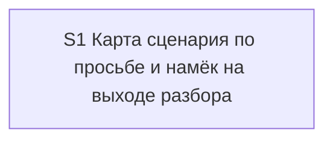

# Quality Control — scenario-map-canvas (re-check 3)

Date: 2026-08-27  
Report: `quality-control-2026-08-27-3.md`  
Mode: slice (detected `# Срез S1`)  
Scope: slice coherence, scenario coverage, independence, gates, rework risk, verticality, self-achievable acceptance, foundation+gate, acceptance simplicity, User Task Contract, task readability  
Out of scope: IB executability now, test data, baseline snapshots

Context (prompt): повторная сверка после второй правки постановки (не смена срезов). Kit-мета-ЗНИ. Новое относительно `quality-control-2026-08-27-2.md`: S1.10a — секция «Карта сценария» в каркасе журнала разбора и оговорка «запись на выходе не затирает секцию» (тот же смысл в скилле разбора §4 и в разделе «Артефакт журнала» шаблона выхода). Срезы не дробились и не сливались.

Manual config checklist: none found  
Mechanical hygiene (prompt): Layer 1 PASS; S1.10a checkbox present; slice-gate present; User Task Contract 2.1a none  
User Task Contract pre-check evidence: none provided; QC mechanical+semantic check below

## Verdict

`OK`

## Slice Summary

| Slice | Scenario | Tasks | Acceptance | Dependencies | Gate |
|---|---|---|---|---|---|
| S1 Карта сценария по просьбе и намёк на выходе разбора | После разбора панель молчит, пока её не попросили; по просьбе «покажи карту сценария» приходят узлы с эффектом шага и доказательством (панель или те же узлы в журнале); на длинном разборе с замерами карту можно попросить из уже существующей строки «Следующий шаг» | S1.1, S1.1a, S1.2–S1.10, S1.10a, S1.11–S1.13 (15 impl) + S1.accept + Follow-up (вне среза) | S1.accept (Primary + 9 optional named; all 15 spec scenarios covered via Primary / optional / S1.\<M\> → 15/15) | нет | `<!-- slice-gate -->` present |

Notes: Standard/Full threshold: 15 implementation checkboxes + accept. Even if counted as Full (≥16 with accept), one slice remains correct — there is a single independent user outcome; groups `## 1.`–`## 5.` already exist. `**Режим apply:** mechanical`. Product BSL/Form/XML not required. Follow-up kill-criteria is outside the slice and is not a blocker.

Delta vs QC-2: +S1.10a (journal skeleton section + exit-write preserve caveat in three files). Coverage, gate, Primary journey, and slice boundaries unchanged. This is the inside-slice payment of the journal-fallback path that design D7 / S1.6 already named.

## Scenario Coverage

| Scenario | Covered by | Status |
|---|---|---|
| Молчание по умолчанию | Primary (semantic: without a request the panel does not appear); S1.3 | OK — covered-by-Primary, not orphan |
| Системный MUST canvas не действует на opsx | S1.3 (skill: system canvas MUST is not a reason to draw in `/opsx:*`); S1.8 (dispatcher always-apply: same ban visible without opening the skill) | OK — covered-by-task |
| Прямая просьба рисует карту | Primary (semantic: «покажи карту сценария» → nodes with effect and evidence); S1.1, S1.1a, S1.2, S1.8, S1.9 | OK — covered-by-Primary |
| Карта во время прохода из уже пройденных точек | optional accept (literal name); S1.5; S1.1a | OK |
| Просьба при числе узлов ниже порога | optional accept (literal name); S1.3; S1.1a | OK |
| Панель недоступна — узлы в журнале | optional accept (literal name); S1.6; S1.1a; **S1.10a** (skeleton section + exit must keep the section) | OK — S1.10a closes the layer that writes/preserves the journal section named in S1.6 |
| Узел без доказательства не публикуется | optional accept (literal name); S1.2 | OK |
| Панель без статусов прохода | optional accept (literal name); S1.4 | OK |
| Код остаётся в чате | optional accept (literal name); S1.4 | OK |
| Нет отдельной команды карты | S1.13 (agent static: grep `.cursor/commands/` and AGENTS.md command list) | OK — covered-by-task, not orphan |
| Карта точек и карта сценария различимы | optional accept (literal name); S1.11, S1.12 | OK |
| Эталон узлов в скилле | S1.7 (add four-node fixture in the skill) | OK — covered-by-task, not orphan |
| Намёк на выходе explain при условиях | optional accept (literal name); S1.10 | OK |
| Нет намёка, если уже вопрос анализа | optional accept (literal name); S1.10 | OK |
| Исследование по-прежнему предлагает разбор | S1.13 (agent static: explore «Дальше» still offers `/opsx:explain`; explore file not edited) | OK — covered-by-task, not orphan |

Exact-name bullets absent in `S1.accept` for: «Молчание по умолчанию», «Системный MUST canvas не действует на opsx», «Прямая просьба рисует карту», «Нет отдельной команды карты», «Эталон узлов в скилле», «Исследование по-прежнему предлагает разбор». First and third are the Primary journey. The other four are implementation-only / static kit checks and are covered by S1.3, S1.7, S1.8, S1.13. **Do not emit `accept-bullets-missing-scenario`.**

## Dependency Graph

- Cycles: none
- Forward acceptance dependencies: none (single slice)
- Undeclared dependencies: none (`**Зависимости:** нет`)
- Intra-slice: S1.1 creates the skill; S1.1a writes request-handling order; S1.2–S1.7 complete the skill contract (S1.1a cites S1.6 — same slice, same file); S1.8–S1.10 wire suppression + request + hint; **S1.10a** patches the walkthrough journal skeleton and exit-write rules so the S1.6 fallback section survives the mandatory exit `Write`; S1.11–S1.12 dictionary/index; S1.13 static verify. All inside S1. S1.10a sits in group «Точки вызова карты» before `S1.accept` — inside-slice insert, accept still `[ ]`.

## Checklist Results

| # | Criterion | Result |
|---|---|---|
| 1 | Scenario Coverage | Pass — all 15 `#### Scenario:` covered by Primary, optional accept, and/or agent `S1.<M>` (static «по коду кита» for command-absence and explore slot; skill + dispatcher for MUST-canvas; fixture task for the skill example; S1.6 + S1.10a for journal fallback) |
| 2 | Slice Independence | Pass — sole slice; acceptance does not require a later slice |
| 3 | Slice Completeness | Pass — kit skill / dispatcher / explain skill / exit-card / **explain-report skeleton** / lexicon / glossary / AGENTS.md layers sufficient for Primary including the journal fallback. Design `## Slices` already listed explain-report; S1.10a is the matching task. No product metadata/BSL/Form layer missing |
| 4 | Slice Dependency Graph | Pass |
| 5 | Slice Gate Integrity | Pass — exactly one `S1.accept` + one `<!-- slice-gate -->`; no legacy `S1.T<M>`; no `<!-- phase-gate -->` |
| 5b | Acceptance Checklist Coverage | Pass — `**Primary acceptance:**` present; mandatory `**Primary (обязательно):**` present; no foreign-slice Scenario; no uncovered Scenario (coverage via `S1.<M>` counts). Not `accept-checklist-empty`. Not `primary-acceptance-missing` |
| 6 | Rework Risk | Pass — no duplicate Primary across slices; no undeclared reliance on an unaccepted predecessor; Follow-up kill-criteria is outside the slice. S1.10a vs S1.6 overlap is complementary (skeleton + exit preserve vs skill fallback body), not a second gate. Inside-slice insert before unsigned accept matches defect-placement default |
| 8 | Slice Verticality | Pass — mandatory Primary is observable kit protocol (run a walkthrough → no panel without a request → ask for the scenario map → nodes with step effect and evidence on the panel or in the walkthrough journal), not programmatic-only API/diff accept |
| 8b | Self-Achievable Acceptance | Pass — Primary reachable via this slice’s tasks alone. The blocking journey’s journal branch is no longer skill-text-only: S1.10a adds the section to `explain-report.md` and requires exit `Write` in SKILL §4 and `exit-card.md` to keep that section. Hint and dictionary scenarios remain optional/task-covered. No later slice to borrow a journey from |
| 9 | Foundation slice with gate | N/A — single slice |
| 10 | Acceptance Simplicity | Pass — one mandatory black-box journey (silence-then-request); nine optional bullets. Two WHEN clauses in the same Primary are one sequential journey, not two mandatory accept bullets |
| 11 | User Task Contract | Pass — mechanical DENY grep on `S1.1`–`S1.13` including S1.10a empty (`тестовой ИБ`, `на стенде`, `runtime-verify`, `спайк`, `в консоли`, `отладчик`, `эмулировать вызов`, `вызвать API`, `после verify` / `после стенда`). S1.13 ALLOW-agent («Верифицировать по коду кита»). S1.10a is agent file edits (skeleton + assembly/exit caveat), not a mid-slice user runtime spike. S1.1a «пользователь уже открыл панель / назвал файл» remains skill-contract text the agent writes. Accept metadata «сессия разбора (реальная или смоделированная) … без ИБ продукта» is boundary accept. No «после verify/стенда» chains |

## Task Readability

| Task | Pattern check | Notes |
|---|---|---|
| S1.1 | Pass | Verb + file (new skill path) + purpose (one panel contract vs system canvas) + (D2, D4) |
| S1.1a | Pass | Verb + same skill file + request action order + (D7, D4) |
| S1.2 | Pass | Verb + skill file + node contract / no-evidence halt + (D3) |
| S1.3 | Pass | Verb + skill file + silence, four-node threshold, MUST-canvas exception + (D3, D5) |
| S1.4 | Pass | Verb + skill file + panel content bans + (D3, D2) |
| S1.5 | Pass | Verb + skill file + node source before/after journal and outside walkthrough + (D3) |
| S1.6 | Pass | Verb + skill file + no-panel fallback to journal section; exit keeps the section; no third addressee + (D7, D4) |
| S1.7 | Pass | Verb + skill file + four-node fixture + (D6) |
| S1.8 | Pass | Verb + `gate-dispatcher.mdc` + dual duty (suppression **and** load on request) + (D4, D5) |
| S1.9 | Pass | Verb + explain skill §3 / Guardrails + mid-walkthrough request without session switch + (D4) |
| S1.10 | Pass | Verb + `exit-card.md` + hint inside existing next-step line + (D1) |
| S1.10a | Pass | Verb + `explain-report.md` (optional section «Карта сценария») + assembly-rule caveat + same caveat in explain SKILL §4 and `exit-card.md` «Артефакт журнала» + purpose (nodes that went to the journal instead of the panel survive until the walkthrough ends) + (D7). Not a recipe-only title: the observable outcome is named. Letter suffix is an inside-slice insert after S1.10 |
| S1.11 | Pass | Verb + lexicon Слой 2 and glossary + two map names + (D2) |
| S1.12 | Pass | Verb + AGENTS.md SSOT pointer + (D2, D4) |
| S1.13 | Pass | Agent static verify («по коду кита») + grep targets; not opaque D-only title |
| S1.accept | Pass (accept exception) | Business result in title; Primary mandatory bullet present; optional bullets use literal spec titles |
| Follow-up | Pass (Follow-up exception) | Prefix `Follow-up:` + kill-criteria substance; outside slice |

No `task-opaque-title` / `task-too-short` / `accept-checklist-empty` / `accept-bullets-missing-scenario` / `task-opaque-acceptance` emitted.

S1.10a uses a letter suffix (`S1.10a`) as an inside-slice insert after S1.10. Mechanical checkbox grep still matches `S\d+\.\d+`. Not an alert (same pattern as S1.1a, already accepted in QC-2).

## Alerts

None at CRITICAL, WARNING, or SUGGESTION.

Criterion 5b / rule 6 on the six titles without exact-name accept bullets: **covered, not orphan.** Primary text covers silence-by-default and direct-request-draws-map. Agent tasks S1.3 / S1.7 / S1.8 / S1.13 cover system-MUST-not-draw, no dedicated command, node fixture in skill, and explore still offering a walkthrough. Emitting `accept-bullets-missing-scenario` would contradict amended 5b («coverage only in `S<N>.<M>` is OK»).

S1.10a does not add a new spec Scenario; it supplies the missing journal-template / exit-write layer for an already-covered Scenario («Панель недоступна — узлы в журнале») and for the Primary fallback branch («те же узлы в журнале разбора»).

### Remediation (auto-repair)

None — no repairable CRITICAL/WARNING alerts.

## Recommendations

### Automatic / low-risk polish

- None required. Optional named accept bullets for the four task-covered scenarios would be cosmetic only and are not required for apply.
- S1.10a letter-id is acceptable as an inside-slice insert; renumbering to a purely numeric id is not required.

### Decision required

- None. Single-slice plan still matches design `## Slices`. The second wording fix added a task inside S1 without changing slice boundaries, Primary, or spec. No merge/split.

## Summary for verify Layer 2

Slice Coherence: **OK**. One vertical slice, one gate, one blocking user journey (panel silent until asked, then nodes with evidence on the panel or in the journal). All 15 spec scenarios are covered (Primary, optional accept, or agent static/implementation tasks). S1.10a closes the journal-skeleton and exit-preserve layer for the no-panel path; it does not introduce a user-spike, a second mandatory journey, or a foundation gate. No User Task Contract violation. No self-achievable gap.
