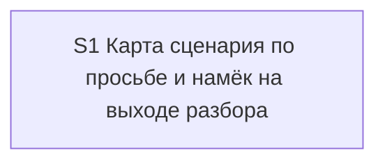

# Quality Control — scenario-map-canvas

Date: 2026-08-27  
Report: `quality-control-2026-08-27.md`  
Mode: slice (detected `# Срез S1`)  
Scope: slice coherence, scenario coverage, independence, gates, rework risk, verticality, self-achievable acceptance, foundation+gate, acceptance simplicity, User Task Contract, task readability  
Out of scope: IB executability now, test data, baseline snapshots

Context (prompt): kit meta-change (markdown skills, not BSL). Skill `.cursor/skills/scenario-map-canvas/SKILL.md` is created by the first implementation task. Dispatcher, explain skill/templates, explore skill, AGENTS.md, glossary, lexicon exist. No dedicated map command. `form_mode: n/a`. `project.md` absent (kit). `debug.md` absent (ledger empty).

Manual config checklist (verify 7.5): none (grep «вручную» / «Конфигуратор» / «создать реквизит» / «элемент формы» empty)  
Mechanical hygiene (verify 7A–7E): checkboxes present, one slice-gate closed, fences balanced. Follow-up without slice prefix (outside slice, expected).  
User Task Contract pre-check (verify 2.1a): none provided; QC mechanical+semantic check below — no DENY hits in S1.1–S1.13.

Layer 2.3 candidate (orphan vs covered-by-task): six spec titles have no exact `Scenario «…»` bullet in `S1.accept`. Mapping below — not orphans. Coverage via Primary text or agent `S1.<M>` is OK under amended rule 6 / criterion 5b.

## Verdict

`OK`

## Slice Summary

| Slice | Scenario | Tasks | Acceptance | Dependencies | Gate |
|---|---|---|---|---|---|
| S1 Карта сценария по просьбе и намёк на выходе разбора | After a walkthrough the side panel stays empty until asked; a direct «покажи карту сценария» request yields step-effect nodes with evidence; on a long timed walkthrough the existing next-step line may hint at the map | S1.1–S1.13 (13) + Follow-up (outside slice) | S1.accept (Primary + 9 optional named; all 15 spec scenarios covered via Primary / optional / S1.\<M\> → 15/15) | нет | `<!-- slice-gate -->` present |

Notes: Standard size (13 impl + accept); single-slice default matches design `## Slices` and thresholds (6–15 → 1 slice unless independent outcomes). `**Режим apply:** mechanical`. Product BSL/Form/XML not required. Follow-up kill-criteria is outside the slice and is not a blocker.

## Scenario Coverage

| Scenario | Covered by | Status |
|---|---|---|
| Молчание по умолчанию | Primary (semantic: without a request the panel does not appear); S1.3 | OK — covered-by-Primary, not orphan |
| Системный MUST canvas не действует на opsx | S1.3 (skill: system canvas MUST is not a reason to draw in `/opsx:*`) | OK — covered-by-task, not orphan |
| Прямая просьба рисует карту | Primary (semantic: «покажи карту сценария» → nodes with effect and evidence); S1.1, S1.2, S1.8, S1.9 | OK — covered-by-Primary, not orphan |
| Карта во время прохода из уже пройденных точек | optional accept (literal name); S1.5 | OK |
| Просьба при числе узлов ниже порога | optional accept (literal name); S1.3 | OK |
| Панель недоступна — узлы в журнале | optional accept (literal name); S1.6 | OK |
| Узел без доказательства не публикуется | optional accept (literal name); S1.2 | OK |
| Панель без статусов прохода | optional accept (literal name); S1.4 | OK |
| Код остаётся в чате | optional accept (literal name); S1.4 | OK |
| Нет отдельной команды карты | S1.13 (agent static: grep `.cursor/commands/` and AGENTS.md command list) | OK — covered-by-task, not orphan |
| Карта точек и карта сценария различимы | optional accept (literal name); S1.11, S1.12 | OK |
| Эталон узлов в скилле | S1.7 (add four-node fixture in the skill) | OK — covered-by-task, not orphan |
| Намёк на выходе explain при условиях | optional accept (literal name); S1.10 | OK |
| Нет намёка, если уже вопрос анализа | optional accept (literal name); S1.10 | OK |
| Исследование по-прежнему предлагает разбор | S1.13 (agent static: explore «Дальше» still offers `/opsx:explain`; explore file not edited) | OK — covered-by-task, not orphan |

Exact-name bullets absent in `S1.accept` for: «Молчание по умолчанию», «Системный MUST canvas не действует на opsx», «Прямая просьба рисует карту», «Нет отдельной команды карты», «Эталон узлов в скилле», «Исследование по-прежнему предлагает разбор». First and third are the Primary journey. The other four are implementation-only / static kit checks and are covered by S1.3, S1.7, S1.13. **Do not emit `accept-bullets-missing-scenario`.**

## Dependency Graph

- Cycles: none  
- Forward acceptance dependencies: none (single slice)  
- Undeclared dependencies: none (`**Зависимости:** нет`)  
- Intra-slice: S1.1–S1.7 create the skill; S1.8–S1.10 wire request/hint; S1.11–S1.12 dictionary/index; S1.13 static verify. Linear and all inside the same slice.

## Checklist Results

| # | Criterion | Result |
|---|---|---|
| 1 | Scenario Coverage | Pass — all 15 `#### Scenario:` covered by Primary, optional accept, and/or agent `S1.<M>` (static «по коду кита» for command-absence and explore slot; skill text for MUST-canvas and fixture) |
| 2 | Slice Independence | Pass — sole slice; acceptance does not require a later slice |
| 3 | Slice Completeness | Pass — kit skill / dispatcher / explain templates / lexicon / glossary / AGENTS.md layers sufficient for Primary; no product metadata/BSL/Form layer missing; skill file is created inside the slice |
| 4 | Slice Dependency Graph | Pass |
| 5 | Slice Gate Integrity | Pass — exactly one `S1.accept` + one `<!-- slice-gate -->`; no legacy `S1.T<M>`; no `<!-- phase-gate -->` |
| 5b | Acceptance Checklist Coverage | Pass — `**Primary acceptance:**` present; mandatory `**Primary (обязательно):**` present; no foreign-slice Scenario; no uncovered Scenario (coverage via `S1.<M>` counts). Not `accept-checklist-empty`. |
| 6 | Rework Risk | Pass — no duplicate Primary across slices; no undeclared reliance on unaccepted predecessor; Follow-up kill-criteria is outside the slice |
| 8 | Slice Verticality | Pass — mandatory Primary is observable kit protocol (run a walkthrough → no panel without a request → ask for the scenario map → nodes with step effect and evidence on the panel or in the walkthrough journal), not programmatic-only API/diff accept |
| 8b | Self-Achievable Acceptance | Pass — Primary reachable via S1.1–S1.13 alone (skill contract + dispatcher trigger + explain mid-walkthrough request + journal fallback). Hint and dictionary scenarios are optional/task-covered, not required for the blocking journey |
| 9 | Foundation slice with gate | N/A — single slice |
| 10 | Acceptance Simplicity | Pass — one mandatory black-box journey (silence-then-request); nine optional bullets |
| 11 | User Task Contract | Pass — no DENY runtime-spike phrasing in S1.1–S1.13; S1.13 ALLOW-agent («Верифицировать по коду кита»); accept metadata «сессия разбора (реальная или смоделированная) … без ИБ продукта» is boundary accept, not mid-slice user spike; no «после verify/стенда» chains |

## Task Readability

| Task | Pattern check | Notes |
|---|---|---|
| S1.1 | Pass | Verb + file (new skill path) + purpose (one panel contract vs system canvas) + (D2, D4) |
| S1.2 | Pass | Verb + skill file + node contract / no-evidence halt + (D3) |
| S1.3 | Pass | Verb + skill file + silence, four-node threshold, MUST-canvas exception + (D3, D5) |
| S1.4 | Pass | Verb + skill file + panel content bans + (D3, D2) |
| S1.5 | Pass | Verb + skill file + node source before/after journal + (D3) |
| S1.6 | Pass | Verb + skill file + no-panel fallback to journal + (D7, D4) |
| S1.7 | Pass | Verb + skill file + four-node fixture + (D6) |
| S1.8 | Pass | Verb + `gate-dispatcher.mdc` + request trigger + (D4) |
| S1.9 | Pass | Verb + explain skill §3 / Guardrails + mid-walkthrough request without session switch + (D4) |
| S1.10 | Pass | Verb + `exit-card.md` + hint inside existing next-step line + (D1) |
| S1.11 | Pass | Verb + lexicon Слой 2 and glossary + two map names + (D2) |
| S1.12 | Pass | Verb + AGENTS.md SSOT pointer + (D2, D4) |
| S1.13 | Pass | Agent static verify («по коду кита») + grep targets; not opaque D-only title |
| S1.accept | Pass (accept exception) | Business result in title; Primary mandatory bullet present; optional bullets use literal spec titles |
| Follow-up | Pass (Follow-up exception) | Prefix `Follow-up:` + kill-criteria substance; outside slice |

No `task-opaque-title` / `task-too-short` / `accept-checklist-empty` / `accept-bullets-missing-scenario` emitted.

## Alerts

None at CRITICAL, WARNING, or SUGGESTION.

Criterion 5b / rule 6 on the six titles without exact-name accept bullets: **covered, not orphan.** Primary text covers silence-by-default and direct-request-draws-map. Agent tasks S1.3 / S1.7 / S1.13 cover system-MUST-not-draw, no dedicated command, node fixture in skill, and explore still offering a walkthrough. Emitting `accept-bullets-missing-scenario` would contradict amended 5b («coverage only in `S<N>.<M>` is OK»).

### Remediation (auto-repair)

None — no repairable CRITICAL/WARNING alerts.

## Recommendations

### Automatic / low-risk polish

- None required. Optional named accept bullets for the four task-covered scenarios would be cosmetic only and are not required for apply.

### Decision required

- None. Single-slice plan matches design `## Slices`. No merge/split.

## Summary for verify Layer 2

Slice Coherence: **OK**. One vertical slice, one gate, one blocking user journey (panel silent until asked, then nodes with evidence). All 15 spec scenarios are covered (Primary, optional accept, or agent static/implementation tasks). No User Task Contract violation. No foundation-with-gate. No self-achievable gap.
