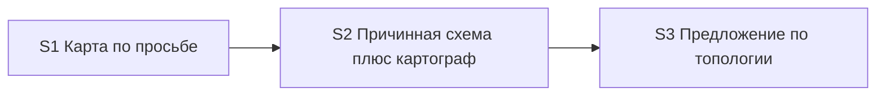

# Quality Control — scenario-map-canvas

Date: 2026-08-28  
Report: `quality-control-2026-08-28-3.md`  
Mode: slice (detected `# Срез S1`, `# Срез S2`, `# Срез S3`)  
Scope: slice coherence (criteria 1–6, 8, 8b, 9–11), scenario coverage, independence, gates, rework risk, verticality, self-achievable acceptance, foundation+gate, acceptance simplicity, User Task Contract, task readability  
Out of scope: IB executability now, test data, baseline snapshots; kit acceptance is session/text check (no product IB)

Context (prompt): confirm that the spec Scenario added after the prior run — «Согласие до первой карточки разбора запоминает фокус» — is covered in the third slice Связь and accept checklist, and that CRITICAL findings did not return. S1 work tasks `[x]`, `S1.accept` still `[ ]`. S2 and S3 work tasks `[ ]`. Declared deps: S2 → S1, S3 → S2. Kit-change (skills/rules), not product BSL. `form_mode: n/a`. Mechanical: Follow-up without slice prefix (info, not a defect); checkboxes present; `<!-- slice-gate -->` closed on three slices. User Task Contract pre-check: none. Manual config checklist: none.

Prior report `quality-control-2026-08-28-2.md` Verdict OK (29 Scenarios). This run: 30 Scenarios after the new consent-before-first-card case.

## Verdict

`OK`

## Slice Summary

| Slice | Scenario | Tasks | Acceptance | Dependencies | Gate |
|---|---|---|---|---|---|
| S1 Карта сценария по просьбе и намёк на выходе разбора | Без просьбы панели нет; по просьбе — узлы с эффектом и доказательством (панель или журнал) | S1.1, S1.1a, S1.2–S1.10, S1.10a, S1.11–S1.13 (15 impl, all `[x]`) + S1.accept `[ ]` | S1.accept (Primary + 6 optional named; 8/8 Связь via Primary / optional / S1.\<M\>) | нет | `<!-- slice-gate -->` present |
| S2 Карта показывает причинность | Первая просьба даёт схему со подписанными связями, не список; резерв не называется картой; картограф — слой внутри того же среза | S2.1, S2.1a, S2.2, S2.3, S2.3a, S2.4–S2.12 (14 impl, all `[ ]`) + S2.accept `[ ]` | S2.accept (Primary + 5 optional named; 12/12 Связь via Primary / optional / S2.\<M\>) | S1 | `<!-- slice-gate -->` present |
| S3 Команды предлагают схему по топологии | Исследование и разбор предлагают схему по топологии без замеров и без темы; линейный случай молчит; согласие до первой карточки запоминает фокус | S3.1–S3.7 (7 impl, all `[ ]`) + S3.accept `[ ]` | S3.accept (Primary + 6 optional named; 11/11 Связь via Primary / optional / S3.\<M\>) | S2 | `<!-- slice-gate -->` present |

Notes: Follow-up kill-criteria sits under `## Follow-up` outside slices (expected; mechanical «no slice prefix» is info). `**Режим apply:** mechanical` on all three. Product BSL/Form/XML not required. Design `## Slices` graph matches tasks.md (S1 none; S2 → S1; S3 → S2). Design slice table for S3 already lists «согласие до первой карточки запоминает фокус».

Delta vs prior QC file: S3 Связь 10 → 11; S3.accept optional named 5 → 6. The added named bullet is the new spec Scenario, literal title match.

## Scenario Coverage

30 `#### Scenario:` in `specs/scenario-map-canvas/spec.md`.

| Scenario | Covered by | Status |
|---|---|---|
| Молчание по умолчанию | S1 Primary (без просьбы панели нет); S1.3 | OK — covered-by-Primary |
| Системный MUST canvas не действует на opsx | S1.3; S1.8 | OK — covered-by-task |
| Прямая просьба рисует карту | S2 Primary (схема со подписанными связями); S2.1, S2.4 | OK — covered-by-Primary |
| Карта во время прохода из уже пройденных точек | S1.accept optional (literal); S1.5; S1.1a | OK |
| Прямая просьба после выхода разбора | S2.7 (проверить по скиллу) | OK — covered-by-task |
| Просьба при числе сущностей ниже порога | S2.accept optional (literal); S2.1a; S2.7 | OK |
| Первая просьба в проекте без открытой панели | S2 Primary; S2.4 | OK — covered-by-Primary |
| Просьба при линейной цепочке | S2.accept optional (literal); S2.1 | OK |
| Согласие на предложение рисует карту | S3.accept optional (literal); S3.4 | OK |
| Согласие до первой карточки разбора запоминает фокус | S3 Связь (literal, under Direct request); S3.accept optional (literal); S3.2 (inventory-card: запомнить фокус, панель только при ≥4 доказанных связанных сущностях, без повторного вопроса, команда сессии не меняется); design D1 / open question 5 | OK — **new since prior report; covered** |
| Среда без панели — резерв в журнале | S2.accept optional (literal); S2.5 | OK |
| Запись журнала сохраняет резерв | S1.10a (preserve); S2.5 (rename section, keep preserve wording) | OK — covered-by-task |
| Узел без доказательства не публикуется | S1.accept optional (literal); S1.2 | OK |
| Панель без статусов прохода | S1.accept optional (literal); S1.4 | OK |
| Код остаётся в чате | S1.accept optional (literal); S1.4 | OK |
| Список без связей не публикуется как карта | S2.accept optional (literal); S2.3 | OK |
| Слои или ветвление видны на панели | S2 Primary («уровни или ветки — если есть»); S2.2 | OK — covered-by-Primary |
| Семь линейных шагов не обязаны давать карту | S2.1a (порог по сущностям, не по шагам рассказа); S3.1 (топология — единственный контракт предложения); listed in both S2 and S3 `**Связь со spec:**` | OK — covered-by-task; dual listing is SUGGESTION only |
| Исследование предлагает схему при топологии без замеров | S3 Primary; S3.5 | OK — covered-by-Primary |
| Разбор предлагает схему без замеров времени | S3 Primary; S3.2, S3.3, S3.4 | OK — covered-by-Primary |
| На линейных двух шагах схему не предлагают | S3 Primary (negative branch of the same offer policy) | OK — covered-by-Primary |
| Предложение не зависит от темы механизма | S3.accept optional (literal); S3.1; S3.7 | OK |
| Нет отдельной команды карты | S1.accept optional (literal); S1.13; S3.7 | OK |
| Карта точек и карта сценария различимы | S1.accept optional (literal); S1.11; S3.6 (третье имя: текстовый резерв) | OK |
| Эталон карты в скилле — граф, не список | S2.2; S2.3; S2.3a (in S2 Связь) | OK — covered-by-task |
| Намёк на выходе разбора при топологии | S3 Primary («на выходе разбора»); S3.3; S3.4 | OK — covered-by-Primary |
| Нет намёка, если уже вопрос анализа | S3.accept optional (literal); S3.4 | OK |
| Исследование не предлагает карту и разбор сразу | S3.accept optional (literal); S3.5 | OK |
| Нет предложения в финале исследования с постановкой | S3.accept optional (literal); S3.5 | OK |
| Вне разбора без источника — отказ | S2.accept optional (literal); S2.7 | OK |

**New-scenario check (prompt):** spec `#### Scenario: Согласие до первой карточки разбора запоминает фокус` is cited in third-slice `**Связь со spec:**` next to «Согласие на предложение рисует карту», has a matching optional sub-bullet in `S3.accept`, and is implemented by `S3.2`. Not an orphan. Not a foreign bullet (the Scenario is owned by S3 Связь). Then-clause «команда сессии не меняется» lives in `S3.2` (accept bullet covers focus / no panel / no repeat question). Amended 5b: task coverage counts — do not emit `accept-bullets-missing-scenario`.

Exact-name bullets absent where coverage is still OK (amended 5b: `S<N>.<M>` counts): S1 «Молчание по умолчанию» / «Системный MUST…» (Primary / S1.3+S1.8); S2 «Прямая просьба рисует карту» / «Первая просьба…» / «Слои или ветвление…» (Primary), «Прямая просьба после выхода разбора» (S2.7), «Запись журнала сохраняет резерв» (S1.10a/S2.5), «Эталон карты в скилле — граф, не список» (S2.2/S2.3/S2.3a), «Семь линейных шагов…» (S2.1a/S3.1); S3 offer/hint titles packed into Primary. **Do not emit `accept-bullets-missing-scenario` for those.**

No `accept-bullet-foreign-scenario`: named accept bullets match the citing slice’s `**Связь со spec:**`. The new consent-before-first-card bullet is S3-owned (offer surface / inventory-card), not a copy of S2’s first-request journey.

## Dependency Graph

- Cycles: none
- Forward acceptance dependencies: none. S1 does not need S2 to sign (journal branch of narrowed Primary is already implemented). S2 does not need S3 (first request draws a scheme; offers are a later outcome). S3 Primary is the offer line, not the drawing. Optional S3 «Согласие на предложение рисует карту» uses S2 as a **backward** predecessor.
- New Scenario does not add a forward edge: remembering focus and withholding the panel until four proven entities is done by S3.2 inside S3; publishing later still uses S2’s create-from-scratch path already declared as S3 → S2.
- Declared predecessors exist: S2 → S1, S3 → S2. Matches design `## Slices`.
- Intra-slice S2: contract+threshold+fixtures (S2.1–S2.3a) → create-from-scratch/fallback/dispatcher (S2.4–S2.7) → cartographer files and grep (S2.8–S2.12) before accept.
- Intra-slice S3: SSOT topology check (S3.1) → explain templates/skill including inventory-card deferred build (S3.2–S3.4) → explore (S3.5) → lexicon+static (S3.6–S3.7)

## Checklist Results

| # | Criterion | Result |
|---|---|---|
| 1 | Scenario Coverage | **Pass** — 30/30 spec Scenarios covered by Primary, optional accept, and/or `S<N>.<M>`. New Scenario «Согласие до первой карточки разбора запоминает фокус» is on S3 Связь, S3.accept optional, and S3.2 |
| 2 | Slice Independence | **Pass** — no slice requires a **later** slice to accept. S1/S2/S3 each have a standalone observable kit outcome |
| 3 | Slice Completeness | **Pass** — kit layers for each Primary are present. S1: skill, dispatcher, explain templates, lexicon, static verify. S2: causal contract, fixtures, create-from-scratch, fallback rename, dispatcher, cartographer agent + role pointers + grep. S3: topology SSOT, inventory-card (including deferred focus), exit-card, explain/explore skills, lexicon, static verify. No product metadata/BSL/Form layer required |
| 4 | Slice Dependency Graph | **Pass** — acyclic; declared predecessors exist; S2 names S1; S3 names S2. No undeclared forward edges |
| 5 | Slice Gate Integrity | **Pass** — exactly one `S<N>.accept` + one `<!-- slice-gate -->` per slice; no legacy `S<N>.T<M>`; no `<!-- phase-gate -->`. Three gates, three user outcomes |
| 5b | Acceptance Checklist Coverage | **Pass** — `**Primary acceptance:**` + mandatory `**Primary (обязательно):**` on all three (not `primary-acceptance-missing` / `accept-checklist-empty`). No foreign Scenario in accept bodies. No uncovered spec Scenario. New Scenario is a named optional bullet on the slice that cites it |
| 6 | Rework Risk | **Pass (SUGGESTION only)** — S2 declares S1. Slice user-journeys do not repeat (S1 Then = evidence nodes, journal allowed; S2 Then = scheme with edges, file created; S3 Then = offer on an existing decision line; deferred-focus is optional on S3, not a second S2 drawing journey). Residual: spec Scenario «Семь линейных шагов…» is cited in both S2 and S3 Связь (documentation overlap, not two blocking journeys). Apply still stops at unsigned S1.accept before S2 — intended upgrade gate, not a defect |
| 8 | Slice Verticality | **Pass** — all three mandatory Primaries are black-box kit protocol. S1: walkthrough → silence → request → nodes with evidence (panel or journal). S2: first request → scheme with signed edges beside chat, file not in git. S3: topology report → one concrete offer; two linear steps → no offer. Deferred-focus is optional, still black-box (no panel, no repeat question). Cartographer registration is not a Primary |
| 8b | Self-Achievable Acceptance | **Pass** — S1 Primary reachable by already `[x]` S1.1–S1.13 (journal branch S1.6+S1.10a; panel-from-scratch is **not** required because Primary is OR). S2 Primary reachable by S2.1–S2.12 in this slice. S3 offer-Primary reachable by S3.1–S3.7 without drawing a panel; optional consent-draws and deferred-focus use S2 as a **backward** predecessor. S1 vs S2 Then clauses still differ — not a duplicate visible result. No «do not sign accept until the next slice» workaround. New Scenario does not make S3 Primary wait on a later slice |
| 9 | Foundation slice with gate | **Pass** — no pair where S\<K\> accept is programmatic-only and S\<K+1\> accept is a user-journey. S1.accept **is** a user-journey; S2 depends on S1 — not this antipattern. S2.accept **is** a user-journey; S3 depends on S2 — not this antipattern. Adding the deferred-focus Scenario did not create a new gated foundation slice |
| 10 | Acceptance Simplicity | **Pass** — one mandatory Primary bullet per slice. S3 still one offer policy (speak / stay silent). The new Scenario is marked «(опционально)» — not a second mandatory journey (`acceptance-simplicity-overload` does not fire) |
| 11 | User Task Contract | **Pass** — mechanical DENY grep on `S<N>.<M>` empty (orchestrator pre-check none). S1.13 / S2.12 / S3.7 ALLOW-agent («Верифицировать по коду кита»). S2.7 «Проверить по скиллу» is agent static of skill text. S3.2 assigns **agent** template/skill work (добавить вариант, описать запоминание фокуса), not user IB/console/runtime. No «после verify/стенда» chains. Runtime/session checks live only in `S*.accept`. Kit «без ИБ продукта» on accept metadata is boundary accept, not a mid-slice user-spike |

**CRITICAL regression check:** none of `primary-acceptance-missing`, `accept-checklist-empty`, slice-gate missing/duplicate, `slice-not-vertical`, `slice-accept-not-self-achievable`, `slice-foundation-with-gate`, `acceptance-simplicity-overload`, `user-task-contract-violation` is present. Prior merge-cleared findings stay cleared.

## Task Readability

| Task | Pattern check | Notes |
|---|---|---|
| S1.1–S1.13 | Pass | Historical `[x]` work; verb + file + purpose + D-refs. Letter suffixes S1.1a / S1.10a remain inside-slice inserts |
| S1.accept | Pass (accept exception) | Business result in title; Primary mandatory; optional bullets use literal spec titles from S1 Связь |
| S2.1–S2.12 | Pass | Unchanged vs prior QC: verb + file + purpose + D-refs. S2.7 / S2.12 agent static |
| S2.accept | Pass (accept exception) | Business result in title; Primary + five literal optional names |
| S3.1 | Pass | Verb + SKILL.md + topology/output check as sole offer contract (D1, D9) |
| S3.2 | Pass | Verb + `inventory-card.md` + third option, do not replace карта точек; consent remembers focus; panel only at ≥4 proven related entities; no repeat question (D1, deferred build). Covers the new Scenario without an opaque D-only title |
| S3.3 | Pass | Verb + `exit-card.md` + drop time-measurement condition (D1) |
| S3.4 | Pass | Verb + explain SKILL.md + both offer points and answers (D1) |
| S3.5 | Pass | Verb + explore SKILL.md + exclusive «Дальше» priority (D1) |
| S3.6 | Pass | Verb + lexicon and glossary + three names (D2) |
| S3.7 | Pass | Agent static «по коду кита» + grep targets (D4, D9) |
| S3.accept | Pass (accept exception) | Business result in title; Primary + **six** literal optional names including «Согласие до первой карточки разбора запоминает фокус» (exact spec heading) |
| Follow-up | Pass (Follow-up exception) | Prefix `Follow-up:` + kill-criteria; outside slices |

No `task-opaque-title` / `task-too-short` / `accept-checklist-empty` / `task-opaque-acceptance` / `accept-bullet-foreign-scenario` / `accept-bullets-missing-scenario` emitted.

## Alerts

None at CRITICAL or WARNING.

### SUGGESTION 1. Dual Связь listing — «Семь линейных шагов не обязаны давать карту»

- Affected: S2 and S3 metadata `**Связь со spec:**` (not in either accept body)
- Type: documentation overlap (criterion 6, low sharpness)
- Severity: **SUGGESTION**
- Evidence: the same spec Scenario is listed on two slices. Coverage exists: S2.1a (do not publish because of step count) and S3.1 (do not offer because of step count). Blocking journeys remain distinct. Unchanged vs prior report.
- Recommendation: keep one owner in Связь — prefer S3 (offer/silence without request). Leave S2.1a as the publish-side implementation without citing the Scenario on S2. Cosmetic; does not block apply.

### SUGGESTION 2. S1 heading still names the hint that S3 now owns

- Affected: `# Срез S1: Карта сценария по просьбе и намёк на выходе разбора`
- Type: stale heading vs narrowed Связь
- Severity: **SUGGESTION**
- Evidence: S1 Связь no longer includes hint-at-exit Scenarios; those live on S3. The heading still says «намёк на выходе разбора». Metadata scenario and Primary are already the narrowed silence+evidence journey. Unchanged vs prior report.
- Recommendation: rename the S1 heading to match the narrowed accept (optional polish). Do not reopen S1.1–S1.13.

## Remediation (auto-repair)

No CRITICAL/WARNING alerts. No mandatory auto-repair.

Optional polish (not required to keep Verdict OK):

### Remediation (optional)

- alert: dual Связь listing
- target: `openspec/changes/scenario-map-canvas/tasks.md` slice S2 metadata
- action: Remove Scenario «Семь линейных шагов не обязаны давать карту» from S2 `**Связь со spec:**`. Keep it on S3. Do not add it to S2.accept.

### Remediation (optional)

- alert: stale S1 heading
- target: `openspec/changes/scenario-map-canvas/tasks.md` slice S1 heading
- action: Rename to `# Срез S1: Карта сценария по просьбе` (or equivalent without «намёк на выходе»). Leave tasks and accept body unchanged.

## Recommendations

### Automatic / low-risk polish

- Drop «Семь линейных шагов…» from S2 Связь (keep on S3).
- Shorten the S1 heading so it matches the narrowed accept.
- Optional: add «команда сессии не меняется» to the S3.accept optional bullet for the new Scenario (already in S3.2; cosmetic Then completeness).

### Decision required

- None. The new Scenario is correctly placed on S3 (inventory-card / offer surface), not on S2. Do **not** split a fourth slice for deferred focus. Do **not** leave S2.accept unsigned until S3 as a substitute for structure.
- S1 vs S2 stay two slices: sign S1 against the **current** (pre-S2) skill on the narrowed silence+evidence checklist, then apply S2. Merging S1+S2 is **not** required (Then clauses differ; S1 work is already `[x]`).

## Summary for verify Layer 2

Slice Coherence: **OK**. Three slices, three gates; each blocking Primary is an observable kit journey. All 30 spec Scenarios are covered. New Scenario «Согласие до первой карточки разбора запоминает фокус» is in third-slice Связь, in `S3.accept` as a literal optional bullet, and in `S3.2`. Dependencies S2→S1 and S3→S2 are declared; no cycles; no forward accept dependency. No CRITICAL returned vs `quality-control-2026-08-28-2.md`. User Task Contract clean. Task readability clean. Two cosmetic SUGGESTIONs only (dual Связь listing; stale S1 heading) — same as prior run.
