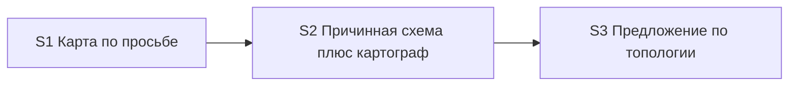

# Quality Control — scenario-map-canvas

Date: 2026-08-28  
Report: `quality-control-2026-08-28-6.md`  
Mode: slice (detected `# Срез S1`, `# Срез S2`, `# Срез S3`)  
Scope: slice coherence (criteria 1–6, 8, 8b, 9–11), scenario coverage, independence, gates, rework risk, verticality, self-achievable acceptance, foundation+gate, acceptance simplicity, User Task Contract, task readability  
Out of scope: IB executability now, test data, baseline snapshots; kit acceptance is session/text check (no product IB)

Context (prompt): kit-change (skills/rules/agent), not product BSL; `form_mode: n/a`; kit has no `openspec/project.md`. Mechanical notes: Follow-up without slice prefix (info, outside slices, expected); checkboxes present; `<!-- slice-gate -->` closed on three slices; User Task Contract pre-check: none; Manual config checklist: none. First slice work `[x]`, accept unsigned (`debug.md`: awaiting-acceptance). Second and third work `[ ]`. Declared deps: second on first, third on second. Repository: skill + dispatcher + explain/explore skills exist; fixtures, cartographer agent file, role template not yet created (open second-slice tasks).

Prior report `quality-control-2026-08-28-5.md` Verdict OK (34 Scenarios). This run: **37** Scenarios after verify repair (deferred publish / offer split): walkthrough offer split into list-confirm vs exit; plus «Согласие было, порог до выхода не набрался» and «Согласие при неподтвердившейся топологии даёт цепочку». Tasks: new `S2.4a` (layout-role handoff on the request path).

## Verdict

`OK`

## Slice Summary

| Slice | Scenario | Tasks | Acceptance | Dependencies | Gate |
|---|---|---|---|---|---|
| S1 Карта сценария по просьбе и намёк на выходе разбора | Без просьбы панели нет; по просьбе — узлы с эффектом и доказательством (панель или журнал); намёк без ответа панель не собирает | S1.1, S1.1a, S1.2–S1.10, S1.10a, S1.11–S1.13 (15 impl, all `[x]`) + S1.accept `[ ]` | S1.accept (Primary + 7 optional named; 9/9 Связь via Primary / optional / S1.\<M\>) | нет | `<!-- slice-gate -->` present |
| S2 Карта показывает причинность | Первая просьба даёт схему со подписанными связями, не список; резерв не называется картой; картограф — слой внутри того же среза; рёбра не выдумываются; сборку файла панели на пути просьбы отдаёт исполнитель макета | S2.1, S2.1a, S2.2, S2.3, S2.3a, S2.4, **S2.4a**, S2.5–S2.12 (15 impl, all `[ ]`) + S2.accept `[ ]` | S2.accept (Primary + 7 optional named; 14/14 Связь via Primary / optional / S2.\<M\>) | S1 | `<!-- slice-gate -->` present |
| S3 Команды предлагают схему по топологии | Исследование и разбор предлагают схему по топологии без замеров и без темы; линейный случай молчит; согласие без порога к выходу — честная строка; неподтвердившаяся топология — цепочка | S3.1–S3.7 (7 impl, all `[ ]`) + S3.accept `[ ]` | S3.accept (Primary + 11 optional named; 15/15 Связь via Primary / optional / S3.\<M\>) | S2 | `<!-- slice-gate -->` present |

Notes: Follow-up kill-criteria sits under `## Follow-up` outside slices (expected; mechanical «no slice prefix» is info). `**Режим apply:** mechanical` on all three. Product BSL/Form/XML not required (`form_mode: n/a`). Design `## Slices` graph matches tasks.md (S1 none; S2 → S1; S3 → S2). Cartographer file and fixtures absent on disk is **transient** apply state, not a structural completeness gap: S2.2, S2.3, S2.8 exist as open tasks. `S2.4a` is an inside-slice insert **before** `S2.accept` (S2.accept remains `[ ]` — defect-placement default, not a new heading).

Delta vs prior QC file: spec 34 → 37 Scenarios. S3 Связь 12 → 15 and S3.accept optional named 7 → 11 (split offer titles + two new consent cases, all literal `#### Scenario:` headings). S2 impl 14 → 15 (`S2.4a`). S1 Связь / accept and S2 Связь / accept scenario counts unchanged.

## Scenario Coverage

37 `#### Scenario:` in `specs/scenario-map-canvas/spec.md`.

| Scenario | Covered by | Status |
|---|---|---|
| Молчание по умолчанию | S1 Primary (без просьбы панели нет); S1.3 | OK — covered-by-Primary |
| Намёк не рисует панель | S1 Связь (literal, under Silence); S1.accept optional (literal); S1.10; S2.4 (печать варианта, не сборка) | OK |
| Системный MUST canvas не действует на opsx | S1.3; S1.8 | OK — covered-by-task |
| Прямая просьба рисует карту | S2 Primary (схема со подписанными связями); S2.1, S2.4, S2.4a | OK — covered-by-Primary |
| Карта во время прохода из уже пройденных точек | S1.accept optional (literal); S1.5; S1.1a | OK |
| Прямая просьба после выхода разбора | S2.7 (проверить по скиллу) | OK — covered-by-task |
| Просьба при числе сущностей ниже порога | S2.accept optional (literal); S2.1a; S2.7 | OK |
| Первая просьба в проекте без открытой панели | S2 Primary; S2.4 | OK — covered-by-Primary |
| Просьба при линейной цепочке | S2.accept optional (literal); S2.1 | OK |
| Согласие на предложение рисует карту | S3 Связь (literal); S3.accept optional (literal); S3.4 | OK |
| Согласие до первой карточки разбора запоминает фокус | S3 Связь (literal); S3.accept optional (literal); S3.2 | OK |
| Отложенное согласие публикует карту без повторного вопроса | S3 Связь (literal); S3.accept optional (literal); S3.2; S3.4 | OK |
| Согласие было, порог до выхода не набрался | S3 Связь (literal, under Direct request); S3.accept optional (literal); S3.2; S3.4 | OK — **new since prior report; covered** |
| Согласие при неподтвердившейся топологии даёт цепочку | S3 Связь (literal, under Direct request); S3.accept optional (literal); S3.4 | OK — **new since prior report; covered** |
| Среда без панели — резерв в журнале | S2.accept optional (literal); S2.5; S2.4a (исчерпанный ремонт — третья причина резерва) | OK |
| Запись журнала сохраняет резерв | S1.10a (preserve); S2.5 (rename section, keep preserve wording) | OK — covered-by-task |
| Узел без доказательства не публикуется | S1.accept optional (literal); S1.2 | OK |
| Панель без статусов прохода | S1.accept optional (literal); S1.4 | OK |
| Код остаётся в чате | S1.accept optional (literal); S1.4 | OK |
| Список без связей не публикуется как карта | S2.accept optional (literal); S2.3 | OK |
| Связь без видимого отношения не выдумывается | S2 Связь (literal); S2.accept optional (literal); S2.1; S2.1a; S2.8; S2.4a (исход «публиковать нельзя») | OK |
| Слои или ветвление видны на панели | S2 Primary («уровни или ветки — если есть»); S2.2 | OK — covered-by-Primary |
| Семь линейных шагов не обязаны давать карту | S2.1a (порог по сущностям, не по шагам рассказа); S3.1 (топология — единственный контракт предложения); listed in both S2 and S3 `**Связь со spec:**` | OK — covered-by-task; dual listing is SUGGESTION only |
| Исследование предлагает схему при топологии без замеров | S3 Primary; S3.5 | OK — covered-by-Primary |
| Разбор предлагает схему на подтверждении списка без порога публикации | S3 Связь (literal); S3.accept optional (literal); S3.2 | OK — **split since prior report; covered** |
| Разбор предлагает схему на выходе без замеров времени | S3 Связь (literal); S3.accept optional (literal); S3.3; S3.4 | OK — **split since prior report; covered** |
| На линейных двух шагах схему не предлагают | S3 Primary (negative branch of the same offer policy) | OK — covered-by-Primary |
| Предложение не зависит от темы механизма | S3.accept optional (literal); S3.1; S3.7 | OK |
| Нет отдельной команды карты | S1.accept optional (literal); S1.13; S3.7 | OK |
| Карта точек и карта сценария различимы | S1.accept optional (literal); S1.11; S3.6 (третье имя: текстовый резерв) | OK |
| Эталон карты в скилле — граф, не список | S2.2; S2.3; S2.3a (in S2 Связь) | OK — covered-by-task |
| Намёк на выходе разбора при топологии | S3 Primary («на выходе разбора»); S3.3; S3.4 | OK — covered-by-Primary |
| Нет намёка, если уже вопрос анализа | S3.accept optional (literal); S3.4 | OK |
| Исследование не предлагает карту и разбор сразу | S3.accept optional (literal); S3.5 | OK |
| Нет предложения в финале исследования с постановкой | S3.accept optional (literal); S3.5 | OK |
| Вне разбора без источника — отказ | S2.accept optional (literal); S2.7 | OK |
| Просьба в исследовании берёт текущий отчёт | S2.accept optional (literal); S2.7 | OK |

**New-scenario check (prompt / deferred-publish / offer-split repair):**

1. `#### Scenario: Разбор предлагает схему на подтверждении списка без порога публикации` — cited in third-slice `**Связь со spec:**` under Offer; matching optional sub-bullet in `S3.accept` (на строке списка вариант схемы есть, панели ещё нет). Implementation: S3.2 (inventory-card variant, no ≥4-now bar, panel not published on that step). Not an orphan. Not a foreign bullet.

2. `#### Scenario: Разбор предлагает схему на выходе без замеров времени` — cited in third-slice `**Связь со spec:**` under Offer; matching optional sub-bullet in `S3.accept` (на выходе с топологией и четырьмя сущностями вариант схемы есть, слов про замеры нет). Implementation: S3.3 (exit-card, drop time-measurement condition), S3.4. Not an orphan. Distinct from (1): list-confirm MAY without publish-threshold vs exit MUST with four publishable entities. Old combined title «Разбор предлагает схему без замеров времени» is gone from spec and tasks — no leftover orphan name.

3. `#### Scenario: Согласие было, порог до выхода не набрался` — cited in third-slice `**Связь со spec:**` under Direct request; matching optional sub-bullet in `S3.accept` (к выходу сущностей меньше четырёх — панели нет, в строке выхода одна честная фраза). Implementation: S3.2, S3.4. Observable without drawing a panel. Distinct from «Отложенное согласие публикует…» (threshold reached vs not reached by exit). Distinct from «Просьба при числе сущностей ниже порога» (request-time refusal on S2 vs remembered consent that never hits the bar).

4. `#### Scenario: Согласие при неподтвердившейся топологии даёт цепочку` — cited in third-slice `**Связь со spec:**` under Direct request; matching optional sub-bullet in `S3.accept` (согласие по предсказанной топологии, в проходе только цепочка — панель-цепочка, не отказ). Implementation: S3.4 (consent inherits request layout: unconfirmed topology → chain, not refusal). Layout capability already in S2.1 (chain with labels on request); S3 owns the When (consent to a predicted-topology offer). Not foreign: S2 Связь does **not** list this Scenario. Distinct from S2 «Просьба при линейной цепочке» (request vs consent When). Optional on S3 uses S2 as a **backward** predecessor for the draw — not a forward accept dependency of S3 Primary.

**S2.4a check (prompt):** `- [ ] S2.4a` sits in slice S2 section «2. Создание панели и резерв», after S2.4 and **before** `S2.accept`. It does not add a spec Scenario (implementation of D7/D8: on the request path, the layout role builds the file; I/O = source path + ranges in, file path + panel-check outcome + repair-round out; link only after a clean check; cannot-publish → one chat line; exhausted repair is a fallback reason). Complements S2.8 (agent file) and S2.12 (static grep that the skill delegates on the request path). Not a fourth slice. Not a user-spike.

Exact-name bullets absent where coverage is still OK (amended 5b: `S<N>.<M>` counts): S1 «Молчание по умолчанию» / «Системный MUST…» (Primary / S1.3+S1.8); S2 «Прямая просьба рисует карту» / «Первая просьба…» / «Слои или ветвление…» (Primary), «Прямая просьба после выхода разбора» (S2.7), «Запись журнала сохраняет резерв» (S1.10a/S2.5), «Эталон карты в скилле — граф, не список» (S2.2/S2.3/S2.3a), «Семь линейных шагов…» (S2.1a/S3.1); S3 «Исследование предлагает…» / «На линейных двух шагах…» / «Намёк на выходе разбора при топологии» packed into Primary. **Do not emit `accept-bullets-missing-scenario` for those.** The four repair Scenarios **do** have literal named optional bullets on the citing slice.

No `accept-bullet-foreign-scenario`: named accept bullets match the citing slice’s `**Связь со spec:**`. All four repair titles sit on S3 Связь and S3.accept.

## Dependency Graph

- Cycles: none
- Forward acceptance dependencies: none. S1 does not need S2 to sign (journal branch of narrowed Primary is already implemented). S2 does not need S3 (first request draws a scheme; offers are a later outcome). S3 Primary is the offer line, not the drawing. Optional S3 consent-draws, deferred-publish, unconfirmed-topology-chain, and honest-exit-without-threshold use S2 as a **backward** predecessor.
- Repair items do not add a forward edge: `S2.4a` is request-path layout handoff inside S2, before S2.accept. Offer-split and the two new consent cases live on S3. Unconfirmed-topology chain is a consent When on S3; the chain layout already exists as S2 work.
- Declared predecessors exist: S2 → S1, S3 → S2. Matches design `## Slices`.
- Intra-slice S2: contract+threshold+fixtures (S2.1–S2.3a) → create-from-scratch + **layout-role handoff on request path (S2.4a)** + fallback/dispatcher (S2.4–S2.7) → cartographer files and grep (S2.8–S2.12) before accept.
- Intra-slice S3: SSOT topology check (S3.1) → explain templates/skill including inventory-card deferred build, honest exit without threshold, unconfirmed-topology chain (S3.2–S3.4) → explore (S3.5) → lexicon+static (S3.6–S3.7)

## Checklist Results

| # | Criterion | Result |
|---|---|---|
| 1 | Scenario Coverage | **Pass** — 37/37 spec Scenarios covered by Primary, optional accept, and/or `S<N>.<M>`. Four repair titles are on the citing slice’s Связь, as literal optional accept bullets, and in S3.2 / S3.3 / S3.4 |
| 2 | Slice Independence | **Pass** — no slice requires a **later** slice to accept. S1/S2/S3 each have a standalone observable kit outcome |
| 3 | Slice Completeness | **Pass** — kit layers for each Primary are present. S1: skill, dispatcher, explain templates, lexicon, static verify. S2: causal contract, fixtures, create-from-scratch, **request-path layout handoff (S2.4a)**, fallback rename, dispatcher, cartographer agent + role pointers + grep. S3: topology SSOT, inventory-card (list offer without publish bar), exit-card (no time bar), explain/explore skills (deferred publish, honest exit, chain on unconfirmed topology), lexicon, static verify. No product metadata/BSL/Form layer required. Missing cartographer/fixtures on disk = open S2 tasks, not a missing layer in the plan |
| 4 | Slice Dependency Graph | **Pass** — acyclic; declared predecessors exist; S2 names S1; S3 names S2. No undeclared forward edges. S2.4a does not create a fourth node |
| 5 | Slice Gate Integrity | **Pass** — exactly one `S<N>.accept` + one `<!-- slice-gate -->` per slice; no legacy `S<N>.T<M>`; no `<!-- phase-gate -->`. Three gates, three user outcomes |
| 5b | Acceptance Checklist Coverage | **Pass** — `**Primary acceptance:**` + mandatory `**Primary (обязательно):**` on all three (not `primary-acceptance-missing` / `accept-checklist-empty`). No foreign Scenario in accept bodies. No uncovered spec Scenario. Four repair titles are named optional bullets on the slice that cites them |
| 6 | Rework Risk | **Pass (SUGGESTION only)** — S2 declares S1. Slice user-journeys do not repeat (S1 Then = evidence nodes, journal allowed; S2 Then = scheme with edges, file created; S3 Then = offer on an existing decision line). Repair cases do not duplicate a blocking journey: list-confirm offer ≠ exit offer; honest-exit-without-threshold ≠ request-time under-threshold; unconfirmed-topology chain ≠ request-time linear chain. Residual: spec Scenario «Семь линейных шагов…» is cited in both S2 and S3 Связь (documentation overlap, not two blocking journeys). Apply still stops at unsigned S1.accept before S2 — intended upgrade gate, not a defect. Historical `[x]` S1.1a/S1.2/S1.7 describing the old availability predicate and flat node is **done-slice text**; S2.1/S2.4/S2.4a rewrite those files — not rework-without-dependency. S2.4a vs S2.8 vs S2.12 is complementary (skill protocol / agent file / static grep), not duplicate work |
| 8 | Slice Verticality | **Pass** — all three mandatory Primaries are black-box kit protocol. S1: walkthrough → silence → request → nodes with evidence (panel or journal). S2: first request → scheme with signed edges beside chat, file not in git. S3: topology report → one concrete offer; two linear steps → no offer. Cartographer registration and S2.4a are not Primaries. New S3 optionals remain black-box (honest exit phrase; chain panel vs refusal) |
| 8b | Self-Achievable Acceptance | **Pass** — S1 Primary reachable by already `[x]` S1.1–S1.13 (journal branch S1.6+S1.10a; panel-from-scratch is **not** required because Primary is OR). S2 Primary reachable by S2.1–S2.12 **including S2.4a** in this slice (request-path file build is handed to the layout role before accept). S3 offer-Primary reachable by S3.1–S3.7 without drawing a panel; optional consent-draws / unconfirmed-topology chain use S2 as a **backward** predecessor. Honest-exit-without-threshold is fully inside S3 (no panel). S1 vs S2 Then clauses still differ — not a duplicate visible result. No «do not sign accept until the next slice» workaround. Repair items do not make any Primary wait on a later slice |
| 9 | Foundation slice with gate | **Pass** — no pair where S\<K\> accept is programmatic-only and S\<K+1\> accept is a user-journey. S1.accept **is** a user-journey; S2 depends on S1 — not this antipattern. S2.accept **is** a user-journey; S3 depends on S2 — not this antipattern. Cartographer remains inside S2 (prior merge). S2.4a did not split a gated foundation slice. Offer-split did not add a fourth gate |
| 10 | Acceptance Simplicity | **Pass** — **one mandatory Primary bullet per slice**. S3 still one offer policy (speak / stay silent) in the single `**Primary (обязательно):**` line. All four repair titles are marked «(опционально)» — not a second mandatory journey (`acceptance-simplicity-overload` does not fire). S2.accept unchanged: one Primary + seven optional |
| 11 | User Task Contract | **Pass** — mechanical DENY grep on `S<N>.<M>` empty (orchestrator pre-check none; this run confirmed no DENY phrases). S1.13 / S2.12 / S3.7 ALLOW-agent («Верифицировать по коду кита»). S2.7 «Проверить по скиллу» is agent static of skill text. S2.4a assigns **agent** skill-file work (document layout-role I/O and cannot-publish / exhausted-repair behaviour), not user IB/console/runtime. S3.2 / S3.4 assign **agent** template/skill edits. No «после verify/стенда» chains. Runtime/session checks live only in `S*.accept`. Kit «без ИБ продукта» on accept metadata is boundary accept, not a mid-slice user-spike |

**CRITICAL regression check:** none of `primary-acceptance-missing`, `accept-checklist-empty`, slice-gate missing/duplicate, `slice-not-vertical`, `slice-accept-not-self-achievable`, `slice-foundation-with-gate`, `acceptance-simplicity-overload`, `user-task-contract-violation` is present. Prior merge-cleared findings stay cleared. Repair (37 Scenarios + S2.4a) did not reintroduce CRITICAL.

## Task Readability

| Task | Pattern check | Notes |
|---|---|---|
| S1.1–S1.13 | Pass | Historical `[x]` work; verb + file + purpose + D-refs. Letter suffixes S1.1a / S1.10a remain inside-slice inserts. Old availability predicate / flat node in these titles is expected done-slice wording |
| S1.accept | Pass (accept exception) | Business result in title; Primary mandatory; optional bullets use literal spec titles from S1 Связь |
| S2.1 | Pass | Verb + SKILL.md + replace node contract with header/nodes/edges/kinds; closed dictionaries; linear chain MAY; inventing edges forbidden (D3, D9) |
| S2.1a | Pass | Verb + SKILL.md + threshold after both filters; do not invent arrows; continue walkthrough/explore allowed (D3) |
| S2.2–S2.4, S2.5–S2.7 | Pass | Verb + file + purpose + D-refs. S2.7 agent static including explore-current-report |
| S2.4a | Pass | Verb «Дописать» + `.cursor/skills/scenario-map-canvas/SKILL.md` + publication steps on the request path: layout-role I/O, link after clean check, cannot-publish line, exhausted repair as fallback reason (D7, D8). Not an opaque D-only title. Letter suffix matches existing inside-slice insert pattern |
| S2.8 | Pass | Verb + `onec-scenario-map-designer.md` + I/O, no `src/**`/`openspec/**`, no invented edges; insufficient proven edges → cannot-publish (D8) |
| S2.9–S2.12 | Pass | Verb + file + purpose + D-refs. S2.12 agent static includes «в скилле карты на пути просьбы сборку панели отдаёт эта роль» (pairs with S2.4a) |
| S2.accept | Pass (accept exception) | Business result in title; Primary + seven literal optional names (unchanged vs prior report) |
| S3.1–S3.7 | Pass | Verb + file + purpose + D-refs. S3.2 covers list-confirm MAY without publish bar, remembered focus, same-message link at threshold. S3.4 covers both offer points, consent answers, unconfirmed-topology → chain, honest exit without threshold |
| S3.accept | Pass (accept exception) | Business result in title; Primary + **eleven** literal optional names including the four repair titles (exact spec headings) |
| Follow-up | Pass (Follow-up exception) | Prefix `Follow-up:` + kill-criteria; outside slices |

No `task-opaque-title` / `task-too-short` / `accept-checklist-empty` / `task-opaque-acceptance` / `accept-bullet-foreign-scenario` / `accept-bullets-missing-scenario` emitted.

## Alerts

None at CRITICAL or WARNING.

### SUGGESTION 1. Dual Связь listing — «Семь линейных шагов не обязаны давать карту»

- Affected: S2 and S3 metadata `**Связь со spec:**` (not in either accept body)
- Type: documentation overlap (criterion 6, low sharpness)
- Severity: **SUGGESTION**
- Evidence: the same spec Scenario is listed on two slices. Coverage exists: S2.1a (do not publish because of step count) and S3.1 (do not offer because of step count). Blocking journeys remain distinct. Unchanged vs prior report. The four repair Scenarios are **not** dual-listed (S3 only).
- Recommendation: keep one owner in Связь — prefer S3 (offer/silence without request). Leave S2.1a as the publish-side implementation without citing the Scenario on S2. Cosmetic; does not block apply.

### SUGGESTION 2. S1 heading still names the exit hint that S3 owns

- Affected: `# Срез S1: Карта сценария по просьбе и намёк на выходе разбора`
- Type: stale heading vs slice split
- Severity: **SUGGESTION**
- Evidence: S1 owns «Намёк не рисует панель» (unanswered variant must not assemble a panel). S3 owns «Намёк на выходе разбора при топологии» (when the variant is printed). The heading phrase «намёк на выходе разбора» still reads as S3’s offer surface, not as S1’s silence invariant. Metadata scenario and Primary remain the narrowed silence+evidence journey. Unchanged vs prior report.
- Recommendation: rename the S1 heading to match the narrowed accept (e.g. «Карта сценария по просьбе» or «по просьбе, намёк сам не рисует»). Do not reopen S1.1–S1.13.

## Remediation (auto-repair)

No CRITICAL/WARNING alerts. No mandatory auto-repair.

Optional polish (not required to keep Verdict OK):

### Remediation (optional)

- alert: dual Связь listing
- target: `openspec/changes/scenario-map-canvas/tasks.md` slice S2 metadata
- action: Remove Scenario «Семь линейных шагов не обязаны давать карту» from S2 `**Связь со spec:**`. Keep it on S3. Do not add it to S2.accept. Do not move the four repair titles off S3. Do not move S2.4a out of S2.

### Remediation (optional)

- alert: stale S1 heading
- target: `openspec/changes/scenario-map-canvas/tasks.md` slice S1 heading
- action: Rename to `# Срез S1: Карта сценария по просьбе` (or equivalent without «намёк на выходе»). Leave tasks and accept body unchanged.

## Recommendations

### Automatic / low-risk polish

- Drop «Семь линейных шагов…» from S2 Связь (keep on S3).
- Shorten the S1 heading so it does not read as S3’s exit-hint outcome.

### Decision required

- None. Placement of the repair is correct:
  - Offer split + two new consent cases: third-slice Связь **and** S3.accept optional checklist (literal titles).
  - `S2.4a`: inside the second slice, before `S2.accept` (request-path layout handoff; not a new Scenario, not a fourth slice).
  - One mandatory Primary per slice; new bullets are optional.
- Do **not** split a fourth slice. Do **not** leave S2.accept unsigned until S3 as a substitute for structure. Do **not** merge S2+S3: Then clauses differ (scheme with edges vs offer on a decision line). Do **not** move unconfirmed-topology chain onto S2: the When is consent to an offer (S3); S2 already owns chain-as-layout on request.
- S1 vs S2 stay two slices: sign S1 against the **current** (pre-S2) skill on the narrowed silence+evidence checklist, then apply S2. Merging S1+S2 is **not** required (Then clauses differ; S1 work is already `[x]`). Historical S1 task text (old availability predicate, flat node) is not a checkbox defect — S2 rewrites those files.

## Summary for verify Layer 2

Slice Coherence: **OK**. Three slices, three gates; each blocking Primary is an observable kit journey; **one mandatory Primary per slice**. All 37 spec Scenarios are covered. Repair: four titles on S3 Связь + S3.accept optional (split walkthrough offer; consent without threshold to exit; consent with unconfirmed topology → chain). `S2.4a` is inside S2 before accept (layout-role handoff on the request path). Dependencies S2→S1 and S3→S2 are declared; no cycles; no forward accept dependency. No CRITICAL returned vs `quality-control-2026-08-28-5.md`. User Task Contract clean. Task readability clean. Two cosmetic SUGGESTIONs only (dual Связь listing; S1 heading vs exit-hint wording).
