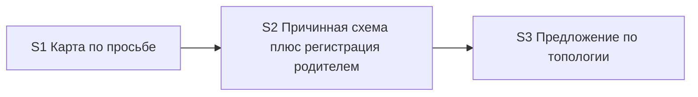

# Quality Control — scenario-map-canvas

Date: 2026-08-28  
Report: `quality-control-2026-08-28-7.md`  
Mode: slice (detected `# Срез S1`, `# Срез S2`, `# Срез S3`)  
Scope: slice coherence (criteria 1–6, 8, 8b, 9–11), scenario coverage, independence, gates, rework risk, verticality, self-achievable acceptance, foundation+gate, acceptance simplicity, User Task Contract, task readability  
Out of scope: IB executability now, test data, baseline snapshots; kit acceptance is session/text check (no product IB)

Context (prompt): **post-apply verify** after user-extend of the publication channel. Kit markdown only; no `src/**` / `.bsl`. Runtime files exist: skill, fixtures, cartographer agent. All `S1.accept` / `S2.accept` / `S3.accept` are `[x]`. Follow-up has **no checkbox**. Mechanical 7A–7E: none. User Task Contract pre-check (2.1a): none. Manual config checklist: none. Focus: criterion **8b** (native environment button, parent-side registration) and leftover Follow-up checkbox absence.

Prior report `quality-control-2026-08-28-6.md` Verdict OK (37 Scenarios; accept still unsigned; S2 impl 15 including `S2.4a`). This run: **40** `#### Scenario:` after publication-channel extend (native button, node-click evidence, walk-order vs causality). S2 impl 15 → **19** (`S2.1b`, `S2.4b`, `S2.8a`, `S2.13`). All three accepts `[x]`.

## Verdict

`OK`

## Slice Summary

| Slice | Scenario | Tasks | Acceptance | Dependencies | Gate |
|---|---|---|---|---|---|
| S1 Карта сценария по просьбе и намёк на выходе разбора | Без просьбы панели нет | S1.1, S1.1a, S1.2–S1.10, S1.10a, S1.11–S1.13 (15 impl, all `[x]`) + S1.accept `[x]` | S1.accept (Primary + 7 optional named; 8/8 Связь via Primary / optional / S1.\<M\>) | нет | `<!-- slice-gate -->` present |
| S2 Карта показывает причинность | Первая просьба даёт схему со подписанными связями; схема открывается штатной кнопкой среды; файл регистрирует родитель | S2.1, S2.1b, S2.1a, S2.2, S2.3, S2.3a, S2.4, S2.4a, S2.4b, S2.5–S2.13 (19 impl, all `[x]`) + S2.accept `[x]` | S2.accept (Primary + 12 optional named; 16/16 Связь via Primary / optional / S2.\<M\>; +1 optional not listed in Связь) | S1 | `<!-- slice-gate -->` present |
| S3 Команды предлагают схему по топологии | Исследование и разбор предлагают схему по топологии без замеров и без темы; линейный случай молчит | S3.1–S3.7 (7 impl, all `[x]`) + S3.accept `[x]` | S3.accept (Primary + 13 optional named; 15/15 Связь via Primary / optional / S3.\<M\>) | S2 | `<!-- slice-gate -->` present |

Notes:

- `## Follow-up` is **outside slices**, prefix `Follow-up:`, **no** `- [ ]` / `- [x]` checkbox. Kill-criteria remain a non-blocker (design open question 4). No leftover checkbox that would keep post-apply verify in pre-apply. Expected placement per rule 6 (architectural follow-up).
- `**Режим apply:** mechanical` on all three. Product BSL/Form/XML not required (`form_mode: n/a`).
- Design `## Slices` graph matches tasks.md (S1 none; S2 → S1; S3 → S2).
- Dual Связь listing of «Семь линейных шагов не обязаны давать карту» from prior QC is **cleared**: S3 Связь + S3.accept optional only; S2 Связь no longer cites it.

Delta vs `quality-control-2026-08-28-6.md`: spec 37 → 40 Scenarios. S2 Связь 14 → 16 (native button; node-click / no new chat; walk-order vs causality — last already present as «Порядок прохода…» in extend). S2.accept optional named 7 → 12. S2 impl 15 → 19. All accepts `[x]`. Follow-up still uncheckboxed.

## Scenario Coverage

40 `#### Scenario:` in `specs/scenario-map-canvas/spec.md`.

| Scenario | Covered by | Status |
|---|---|---|
| Молчание по умолчанию | S1 Primary (без просьбы панели нет); S1.3 | OK — covered-by-Primary |
| Намёк не рисует панель | S1 Связь (literal); S1.accept optional (literal); S1.10; S2.4 | OK |
| Системный MUST canvas не действует на opsx | S1.3; S1.8 | OK — covered-by-task |
| Прямая просьба рисует карту | S2 Primary (схема со подписанными связями + штатная кнопка); S2.1, S2.4, S2.4b | OK — covered-by-Primary |
| Карта во время прохода из уже пройденных точек | S2.accept optional (literal); S1.5 (источник узлов до журнала) | OK — **not in any Связь**; covered by optional accept (see SUGGESTION 2) |
| Прямая просьба после выхода разбора | S2 Связь; S2.accept optional (literal); S2.7 | OK |
| Просьба при числе сущностей ниже порога | S2.accept optional (literal); S2.1a; S2.7 | OK |
| Первая просьба в проекте без открытой панели | S2 Primary; S2.4; S2.4b | OK — covered-by-Primary |
| Панель открывается штатной кнопкой среды | S2 Связь (literal); S2 Primary; S2.accept optional (literal); S2.4b; S2.12 | OK — **new since prior report; covered inside S2** |
| С узла открывается доказательство, новый чат с панели не запускается | S2 Связь (literal); S2.accept optional (literal); S2.13 | OK — **new since prior report; covered** |
| Порядок прохода не выдаётся за причинность | S2 Связь (literal); S2.accept optional (literal); S2.1b | OK — **new since prior report; covered** |
| Просьба при линейной цепочке | S2.accept optional (literal); S2.1 | OK |
| Согласие на предложение рисует карту | S3 Связь (literal); S3.accept optional (literal); S3.4 | OK |
| Согласие до первой карточки разбора запоминает фокус | S3 Связь (literal); S3.accept optional (literal); S3.2 | OK |
| Отложенное согласие публикует карту без повторного вопроса | S3 Связь (literal); S3.accept optional (literal); S3.2; S3.4 | OK |
| Согласие было, порог до выхода не набрался | S3 Связь (literal); S3.accept optional (literal); S3.2; S3.4 | OK |
| Согласие при неподтвердившейся топологии даёт цепочку | S3 Связь (literal); S3.accept optional (literal); S3.4 | OK |
| Среда без панели — резерв в журнале | S2.accept optional (literal); S2.5; S2.4a | OK |
| Запись журнала сохраняет резерв | S1.10a; S2.5 | OK — covered-by-task |
| Узел без доказательства не публикуется | S1.accept optional (literal); S1.2 | OK |
| Панель без статусов прохода | S1.accept optional (literal); S1.4 | OK |
| Код остаётся в чате | S1.accept optional (literal); S1.4 | OK |
| Список без связей не публикуется как карта | S2.accept optional (literal); S2.3 | OK |
| Связь без видимого отношения не выдумывается | S2.accept optional (literal); S2.1; S2.1a; S2.1b; S2.8 | OK |
| Слои или ветвление видны на панели | S2 Primary («уровни или ветки — если есть»); S2.2 | OK — covered-by-Primary |
| Семь линейных шагов не обязаны давать карту | S3 Связь (literal); S3.accept optional (literal); S3.1; S2.1a (publish-side, no Связь cite) | OK — dual Связь **cleared** |
| Исследование предлагает схему при топологии без замеров | S3 Primary; S3.5 | OK — covered-by-Primary |
| Разбор предлагает схему на подтверждении списка без порога публикации | S3 Связь (literal); S3.accept optional (literal); S3.2 | OK |
| Разбор предлагает схему на выходе без замеров времени | S3 Связь (literal); S3.accept optional (literal); S3.3; S3.4 | OK |
| На линейных двух шагах схему не предлагают | S3 Primary; S3.accept optional (literal) | OK |
| Предложение не зависит от темы механизма | S3.accept optional (literal); S3.1; S3.7 | OK |
| Нет отдельной команды карты | S1.accept optional (literal); S1.13; S3.7 | OK |
| Карта точек и карта сценария различимы | S1.accept optional (literal); S1.11; S3.6 | OK |
| Эталон карты в скилле — граф, не список | S2.2; S2.3; S2.3a (in S2 Связь) | OK — covered-by-task |
| Намёк на выходе разбора при топологии | S3 Primary («на выходе разбора»); S3.3; S3.4 | OK — covered-by-Primary |
| Нет намёка, если уже вопрос анализа | S3.accept optional (literal); S3.4 | OK |
| Исследование не предлагает карту и разбор сразу | S3.accept optional (literal); S3.5 | OK |
| Нет предложения в финале исследования с постановкой | S3.accept optional (literal); S3.5 | OK |
| Вне разбора без источника — отказ | S2.accept optional (literal); S2.7 | OK |
| Просьба в исследовании берёт текущий отчёт | S2.accept optional (literal); S2.7 | OK |

**Publication-channel extend check (prompt / 8b):**

1. `#### Scenario: Панель открывается штатной кнопкой среды` — cited in S2 `**Связь со spec:**` under Direct request; packed into S2 Primary (Then: схема открывается штатной кнопкой среды); matching optional sub-bullet in `S2.accept` (после регистрации файла родителем кнопка среды видна, ссылка в чате не нужна). Implementation **inside S2**: S2.4b (parent resolves catalog, writes file from fixture + cartographer manifest, parent-side panel check), S2.8a (cartographer MUST NOT write the panel file), S2.12 (static: parent registers; link is not success). Not on S3. Not a Follow-up checkbox. Not an orphan. Not foreign.

2. `#### Scenario: С узла открывается доказательство, новый чат с панели не запускается` — S2 Связь; S2.accept optional (literal); S2.13 (fixture template: click opens evidence; new chat forbidden). Inside S2.

3. `#### Scenario: Порядок прохода не выдаётся за причинность` — S2 Связь; S2.accept optional (literal); S2.1b (`follows` only for walk order). Inside S2.

Exact-name bullets absent where coverage is still OK (amended 5b: `S<N>.<M>` counts): S1 «Молчание по умолчанию» / «Системный MUST…» (Primary / S1.3+S1.8); S2 «Прямая просьба рисует карту» / «Первая просьба…» / «Слои или ветвление…» (Primary), «Запись журнала сохраняет резерв» (S1.10a/S2.5), «Эталон карты в скилле — граф, не список» (S2.2/S2.3/S2.3a); S3 «Исследование предлагает…» / «Намёк на выходе разбора при топологии» packed into Primary. **Do not emit `accept-bullets-missing-scenario` for those.**

No `accept-bullet-foreign-scenario`: named accept bullets match the citing slice’s `**Связь со spec:**`, except «Карта во время прохода…» which is on S2.accept and **not** listed on S1 or S3 Связь (not foreign; metadata omission — SUGGESTION).

## Dependency Graph

- Cycles: none.
- Forward acceptance dependencies: **none**.
  - S1 Then = silence (no panel without request). Does **not** need native button or parent registration from S2.
  - S2 Then = first request → scheme beside chat via **native environment button**, signed edges, file not in git. Native-button / parent-registration layer is **S2.4b + S2.8a + S2.12 + S2.13**, not S3.
  - S3 Then = one concrete offer on an existing decision line. Optional consent-draws use S2 as a **backward** predecessor.
- Declared predecessors exist: S2 → S1, S3 → S2. Matches design `## Slices`.
- Intra-slice S2 (publication channel): contract + `follows` (S2.1 / S2.1b / S2.1a) → fixtures (S2.2–S2.3a) → create-from-scratch (S2.4) → layout-role handoff superseded by parent write (S2.4a → **S2.4b / S2.8a**) → fallback/dispatcher (S2.5–S2.7) → cartographer files, role pointers, grep, panel fixture (S2.8–S2.13) before accept.
- Intra-slice S3 unchanged in structure: topology SSOT → explain templates → explore → lexicon/static.
- Follow-up kill-criteria is **not** a graph node (no checkbox, outside slices).

## Checklist Results

| # | Criterion | Result |
|---|---|---|
| 1 | Scenario Coverage | **Pass** — 40/40 spec Scenarios covered by Primary, optional accept, and/or `S<N>.<M>`. Three publication-channel titles sit on S2 Связь + S2.accept / S2.\<M\> |
| 2 | Slice Independence | **Pass** — no slice requires a **later** slice to accept. Signing S2 does not wait on S3. Signing S1 does not wait on S2’s native button |
| 3 | Slice Completeness | **Pass** — kit layers for each Primary are present. S1: skill, dispatcher, explain templates, lexicon, static. S2: causal contract, `follows`, fixtures, create-from-scratch, **parent registration (S2.4b)**, cartographer manifest-only (S2.8a), panel fixture (S2.13), role pointers, grep. S3: topology SSOT, inventory/exit cards, explain/explore, lexicon, static. No product metadata/BSL/Form layer required. Whether the live IDE button appears **right now** is transient (out of scope); the **including layer** (parent writes file, cartographer does not) is in the S2 plan |
| 4 | Slice Dependency Graph | **Pass** — acyclic; declared predecessors exist. Publication-channel tasks did not add a fourth node or a forward edge |
| 5 | Slice Gate Integrity | **Pass** — exactly one `S<N>.accept` + one `<!-- slice-gate -->` per slice; no legacy `S<N>.T<M>`; no `<!-- phase-gate -->`. Three gates, three user outcomes. Follow-up has **no** extra checkbox/gate |
| 5b | Acceptance Checklist Coverage | **Pass** — `**Primary acceptance:**` + mandatory `**Primary (обязательно):**` on all three (not `primary-acceptance-missing` / `accept-checklist-empty`). No foreign Scenario in accept bodies. No uncovered spec Scenario. New native-button / node-click / walk-order titles are named on S2 |
| 6 | Rework Risk | **Pass (SUGGESTION only)** — S2 declares S1. Journeys do not repeat (S1 Then = silence; S2 Then = scheme + native button; S3 Then = offer). Historical `[x]` S1.1a / S1.2 / S1.7 / S2.4a describe superseded predicates (availability; flat node; cartographer writes file) — **done-slice text**; S2.4 / S2.4b / S2.1 / S2.8a rewrite those files **inside S2** with declared S2→S1. Not rework-without-dependency. Dual Связь «Семь линейных шагов…» cleared |
| 8 | Slice Verticality | **Pass** — all three mandatory Primaries are black-box kit protocol. S1: walkthrough → no request → no panel. S2: first request → scheme **opens beside chat via native environment button** with signed edges, file not in git. S3: topology report → one concrete offer. Parent registration and cartographer I/O are `S2.<M>`, not Primary. Optional native-button bullet restates the same Then, still black-box |
| 8b | Self-Achievable Acceptance | **Pass** — see dedicated section below. Native button + parent registration are reachable by S2 tasks alone. No duplicate Primary journey. No «do not sign accept until the next slice» |
| 9 | Foundation slice with gate | **Pass** — no pair where S\<K\> accept is programmatic-only and S\<K+1\> is a user-journey. S1.accept **is** a user-journey (silence). S2.accept **is** a user-journey (native button + scheme). Cartographer + parent write remain **inside S2** (not a gated foundation slice). Extend did not split a fourth gate |
| 10 | Acceptance Simplicity | **Pass** — **one mandatory Primary bullet per slice**. Native button is packed into the **same** first-request Then as signed edges (one journey, not two blocking journeys). Optional «Панель открывается штатной кнопкой среды» is marked «(опционально)» — restates Primary, does not fire `acceptance-simplicity-overload`. S3 still one offer policy |
| 11 | User Task Contract | **Pass** — mechanical DENY grep on `S<N>.<M>` empty (orchestrator pre-check none; this run confirmed no DENY phrases). S1.13 / S2.12 / S3.7 ALLOW-agent («Верифицировать по коду кита»). S2.7 «Проверить по скиллу» is agent static. S2.4b / S2.8a / S2.13 assign **agent** skill/agent/fixture work, not user IB/console/runtime. No «после verify/стенда» chains. Session checks live only in `S*.accept`. Kit «без ИБ продукта» on accept metadata is boundary accept, not a mid-slice user-spike. Follow-up is outside `S<N>.<M>` and has no checkbox |

**CRITICAL regression check:** none of `primary-acceptance-missing`, `accept-checklist-empty`, slice-gate missing/duplicate, `slice-not-vertical`, `slice-accept-not-self-achievable`, `slice-foundation-with-gate`, `acceptance-simplicity-overload`, `user-task-contract-violation` is present. Prior merge-cleared findings stay cleared. Publication-channel extend did **not** reintroduce CRITICAL: the native-button Then was placed on S2 together with parent-registration tasks.

### Criterion 8b — native button and parent registration (prompt focus)

Algorithm on pairs:

**S1 / S2**

- Mechanical Primary compare: S1 «When пользователь ничего не просил — панели нет» vs S2 «When покажи карту сценария → Then схема открывается штатной кнопкой среды со подписанными связями, файл вне git». **Not** the same user-journey (silence vs first request + native button).
- Layer check: S1 Primary does **not** require parent registration or native button. Journal branch (S1.6 / S1.10a) remains an S1 implementation of fallback wording; S2.5 renames the section. S1 Then is reachable by already `[x]` S1.1–S1.13.

**S2 / S3**

- Mechanical Primary compare: S2 first-request **native button + signed edges** vs S3 «When Дальше / выход разбора → Then одно конкретное предложение схемы». **Not** a duplicate Then.
- Layer check: the including layer for S2 Then is **in S2**, not in S3:
  - S2.4b — parent resolves canvas catalog and **writes** the file from fixture + cartographer manifest; gate = parent-side panel check; chat line without path; link is not success.
  - S2.8a — cartographer OUTPUT is a **data manifest**; writing the panel file is forbidden.
  - S2.12 — static grep that on the request path the layout role returns a manifest and **parent registers** the file.
  - S2.13 — panel-file fixture (click opens evidence).
  - S2.4a historical text (layout role returns file path) is marked **Вытеснено S2.4b / S2.8a** — same slice, not a later slice.
- S3 tasks (S3.1–S3.7) are offer templates / topology SSOT. They do not supply the native-button layer. Optional S3 consent-draws use S2 as **backward** predecessor — allowed.

**Semantic:** S2 Primary is observable (scheme beside chat via native button) **and** obtainable by S2 tasks alone. Placing parent registration in Follow-up or in S3 would have been `slice-accept-not-self-achievable` (CRITICAL). That did **not** happen.

**Follow-up checkbox:** `## Follow-up` has no `- [ ]`. Kill-criteria stay a non-blocker outside slices. A leftover Follow-up checkbox would have been a structural post-apply leak (unsigned work outside slice-gate); **absent** — pass, no alert.

## Task Readability

| Task | Pattern check | Notes |
|---|---|---|
| S1.1–S1.13 | Pass | Historical `[x]`; verb + file + purpose + D-refs. Supersession notes (S2.4b, S2.1b, S3.3) are expected done-slice wording |
| S1.accept | Pass (accept exception) | Business result in title; Primary mandatory; optional bullets use literal spec titles from S1 Связь |
| S2.1 / S2.1a | Pass | Verb + SKILL.md + contract / threshold + D-refs |
| S2.1b | Pass | Verb «Дополнить» + SKILL.md + эталоны: `name`, `evidence_ref`, `follows`; walk order not labelled as causality (D3) |
| S2.2–S2.4, S2.5–S2.7 | Pass | Verb + file + purpose + D-refs |
| S2.4a | Pass | Historical handoff text; marked superseded by S2.4b / S2.8a |
| S2.4b | Pass | Verb «Переписать» + SKILL.md steps 5–8: parent resolves catalog, writes file, parent-side check, no path in chat (D7, D10). This is the **including layer** for native-button Primary |
| S2.8 | Pass | Verb + agent file + I/O |
| S2.8a | Pass | Verb «Переписать» + OUTPUT + template: manifest only; writing panel file forbidden (D8, D10) |
| S2.9–S2.12 | Pass | Verb + file + purpose. S2.12 static includes parent registration |
| S2.13 | Pass | Verb «Добавить» + fixtures path + click-opens-evidence; new chat forbidden (D10). Outcome-oriented, not an opaque D-only title |
| S2.accept | Pass (accept exception) | Business result includes native button; Primary + twelve literal optional names including the three extend titles |
| S3.1–S3.7 | Pass | Verb + file + purpose + D-refs |
| S3.accept | Pass (accept exception) | Business result in title; Primary + thirteen literal optional names |
| Follow-up | Pass (Follow-up exception) | Prefix `Follow-up:` + kill-criteria; **no checkbox**; outside slices |

No `task-opaque-title` / `task-too-short` / `accept-checklist-empty` / `task-opaque-acceptance` / `accept-bullet-foreign-scenario` / `accept-bullets-missing-scenario` emitted.

## Alerts

None at CRITICAL or WARNING.

### SUGGESTION 1. S1 heading still names the exit hint that S3 owns

- Affected: `# Срез S1: Карта сценария по просьбе и намёк на выходе разбора`
- Type: stale heading vs slice split
- Severity: **SUGGESTION**
- Evidence: S1 owns «Намёк не рисует панель». S3 owns «Намёк на выходе разбора при топологии». Accept title already says «Карта сценария по просьбе». Unchanged vs prior QC.
- Recommendation: rename the S1 heading to match the narrowed accept. Do not reopen S1.1–S1.13. Do not uncheck S1.accept.

### SUGGESTION 2. «Карта во время прохода…» on S2.accept but not in S2 Связь

- Affected: S2.accept optional bullet; S2 metadata `**Связь со spec:**`
- Type: documentation omission (coverage still OK via optional accept + S1.5)
- Severity: **SUGGESTION**
- Evidence: spec Scenario exists; design `## Slices` lists it on S2; S2.accept has a literal optional bullet; neither S1 nor S2 nor S3 `**Связь со spec:**` cites it. Not `accept-bullet-foreign-scenario` (no other slice claims it). Not `accept-bullets-missing-scenario` (covered).
- Recommendation: add Scenario «Карта во время прохода из уже пройденных точек» to S2 `**Связь со spec:**` under Direct request. Keep the optional accept bullet. Do not move it onto S1.

## Remediation (auto-repair)

No CRITICAL/WARNING alerts. No mandatory auto-repair.

Optional polish (not required to keep Verdict OK):

### Remediation (optional)

- alert: stale S1 heading
- target: `openspec/changes/scenario-map-canvas/tasks.md` slice S1 heading
- action: Rename to `# Срез S1: Карта сценария по просьбе`. Leave tasks and accept body / `[x]` unchanged.

### Remediation (optional)

- alert: Связь omission for walkthrough-map Scenario
- target: `openspec/changes/scenario-map-canvas/tasks.md` slice S2 metadata
- action: Add Scenario «Карта во время прохода из уже пройденных точек» to S2 `**Связь со spec:**` (Direct request). Do not add a second mandatory Primary. Do not create a Follow-up checkbox.

## Recommendations

### Automatic / low-risk polish

- Shorten the S1 heading so it does not read as S3’s exit-hint outcome.
- Cite «Карта во время прохода…» on S2 Связь to match design Slices and the existing optional accept bullet.

### Decision required

- None. Publication-channel placement is correct for 8b:
  - Native button + parent registration: **S2** Primary and **S2.\<M\>** (S2.4b, S2.8a, S2.12, S2.13), not S3, not Follow-up.
  - Cartographer does not write the panel file (S2.8a); parent does (S2.4b) — same slice as the Then that needs that layer.
  - Follow-up remains uncheckboxed kill-criteria outside slices.
- Do **not** split a fourth slice. Do **not** leave S2.accept unsigned until S3 as a substitute for structure. Do **not** merge S2+S3: Then clauses differ (native-button scheme vs offer on a decision line). Do **not** add a Follow-up checkbox (would re-open post-apply as unsigned work).
- S1 vs S2 stay two slices: Then clauses differ (silence vs first request + native button). Merging is **not** required.

## Summary for verify Layer 2

Slice Coherence: **OK**. Three slices, three gates; all `S*.accept` `[x]`; Follow-up has **no checkbox**. Each blocking Primary is an observable kit journey; **one mandatory Primary per slice**. All 40 spec Scenarios are covered. Publication-channel extend: native button, parent registration, node-click, and walk-order-vs-causality live on **S2** with including tasks in the same slice — criterion **8b Pass** (`slice-accept-not-self-achievable` does not fire). Dependencies S2→S1 and S3→S2 declared; no cycles; no forward accept dependency. User Task Contract clean. Task readability clean. Two cosmetic SUGGESTIONs only (stale S1 heading; Связь omission for walkthrough-map Scenario). Dual Связь listing from prior QC is cleared.
