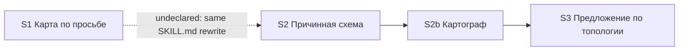

# Quality Control — scenario-map-canvas

Date: 2026-08-28  
Report: `quality-control-2026-08-28.md`  
Mode: slice (detected `# Срез S1`, `# Срез S2`, `# Срез S2b`, `# Срез S3`)  
Scope: slice coherence (criteria 1–6, 8, 8b, 9–11), scenario coverage, independence, gates, rework risk, verticality, self-achievable acceptance, foundation+gate, acceptance simplicity, User Task Contract, task readability  
Out of scope: IB executability now, test data, baseline snapshots; kit acceptance is session/text check (no product IB)

Context (prompt): post-extend 2026-08-28 (user-extend). S1 work tasks `[x]`, `S1.accept` still `[ ]` (`debug.md`: awaiting-acceptance 2026-08-27). Not a slice-transition. S2 / S2b / S3 added; S1 accept checklist narrowed. Historical `[x]` S1 tasks describe the old availability predicate and flat node contract — treated as completed work, not defects; rewrite is in S2. `form_mode: n/a`. Mechanical 7A–7E: none. User Task Contract 2.1a: none (DENY grep empty; «Верифицировать по коду кита» ALLOW-agent).

Manual config checklist: none found  
User Task Contract pre-check evidence: none (orchestrator grep clean)

## Verdict

`CRITICAL`

## Slice Summary

| Slice | Scenario | Tasks | Acceptance | Dependencies | Gate |
|---|---|---|---|---|---|
| S1 Карта сценария по просьбе и намёк на выходе разбора | Без просьбы панели нет; по просьбе — узлы с эффектом и доказательством (панель или журнал) | S1.1, S1.1a, S1.2–S1.10, S1.10a, S1.11–S1.13 (15 impl, all `[x]`) + S1.accept `[ ]` | S1.accept (Primary + 6 optional named; 8/8 Связь covered via Primary / optional / S1.\<M\>) | нет | `<!-- slice-gate -->` present |
| S2 Карта показывает причинность | Первая просьба даёт схему со слоями и связями, не список; резерв не называется картой | S2.1–S2.7 (7 impl, all `[ ]`) + S2.accept `[ ]` | S2.accept (Primary + 3 optional named; 9/10 Связь covered; 1 spec Scenario orphan — see alerts) | нет (undeclared reliance on S1 artifacts) | `<!-- slice-gate -->` present |
| S2b Картограф как роль кита | Регистрация роли + политика модели (verification по коду, не user-сценарий) | S2b.1–S2b.4 (4 impl, all `[ ]`) + S2b.accept `[ ]` | S2b.accept (Primary only; 0 named Scenario bullets; Связь cites S1 Scenario, covered elsewhere) | S2 | `<!-- slice-gate -->` present |
| S3 Команды предлагают схему по топологии | Исследование и разбор предлагают схему по топологии без замеров и без темы; линейный случай молчит | S3.1–S3.7 (7 impl, all `[ ]`) + S3.accept `[ ]` | S3.accept (Primary + 3 optional named; 8/8 Связь covered via Primary / optional / S3.\<M\>) | S2b | `<!-- slice-gate -->` present |

Notes: Follow-up kill-criteria is outside slices (expected, not a blocker). `**Режим apply:** mechanical` on all four. Product BSL/Form/XML not required. S2b is a verification-only slice with its own accept + gate — this is the CRITICAL finding (criteria 8 and 9). Design `## Slices` graph matches tasks.md declarations (S1 none; S2 none; S2b → S2; S3 → S2b).

## Scenario Coverage

26 `#### Scenario:` in `specs/scenario-map-canvas/spec.md`.

| Scenario | Covered by | Status |
|---|---|---|
| Молчание по умолчанию | S1 Primary (без просьбы панели нет); S1.3 | OK — covered-by-Primary |
| Системный MUST canvas не действует на opsx | S1.3; S1.8 | OK — covered-by-task |
| Прямая просьба рисует карту | S2 Primary (схема со связями и слоями); S2.1, S2.4 | OK — covered-by-Primary (S2 Then, not S1 journal-OK Then) |
| Карта во время прохода из уже пройденных точек | S1.accept optional (literal); S1.5; S1.1a | OK |
| Прямая просьба после выхода разбора | S2.7 (проверить по скиллу) | OK — covered-by-task |
| Просьба при числе сущностей ниже порога | Listed in S2 `**Связь со spec:**`; not in S2.accept; S2.1/S2.4 do not name the below-threshold one-liner; S1.3 covers the **old** four-**node** threshold that S2 supersedes | **WARNING** — `accept-bullets-missing-scenario` |
| Первая просьба в проекте без открытой панели | S2 Primary; S2.4 | OK — covered-by-Primary |
| Среда без панели — резерв в журнале | S2.accept optional (literal); S2.5 | OK |
| Запись журнала сохраняет резерв | S1.10a (section + exit preserve); S2.5 (rename section in same journal skeleton) | OK — covered-by-task |
| Узел без доказательства не публикуется | S1.accept optional (literal); S1.2 | OK |
| Панель без статусов прохода | S1.accept optional (literal); S1.4 | OK |
| Код остаётся в чате | S1.accept optional (literal); S1.4 | OK |
| Список без связей не публикуется как карта | S2.accept optional (literal); S2.3 | OK |
| Слои или ветвление видны на панели | S2 Primary («связями и слоями»); S2.1, S2.2 | OK — covered-by-Primary |
| Семь линейных шагов не обязаны давать карту | S3.1 (topology as sole offer contract); S2.1 (D3: step count is not a publish reason); S3 Primary negative branch (linear → no offer) | OK — covered-by-task / Primary |
| Исследование предлагает схему при топологии без замеров | S3 Primary; S3.5 | OK — covered-by-Primary |
| Разбор предлагает схему без замеров времени | S3 Primary; S3.2, S3.3, S3.4 | OK — covered-by-Primary |
| На линейных двух шагах схему не предлагают | S3 Primary (second Then in the same blocking bullet) | OK — covered-by-Primary |
| Предложение не зависит от темы механизма | S3.accept optional (literal); S3.1; S3.7 | OK |
| Нет отдельной команды карты | S1.accept optional (literal); S1.13; S3.7 | OK |
| Карта точек и карта сценария различимы | S1.accept optional (literal); S1.11; S3.6 (third name: текстовый резерв) | OK |
| Эталон карты в скилле — граф, не список | S2.2; S2.3 (not in any slice `**Связь со spec:**`) | OK — covered-by-task |
| Намёк на выходе разбора при топологии | S3 Primary («на выходе разбора»); S3.3; S3.4 | OK — covered-by-Primary |
| Нет намёка, если уже вопрос анализа | S3.accept optional (literal); S3.4 | OK |
| Исследование не предлагает карту и разбор сразу | S3.accept optional (literal); S3.5 | OK |
| Вне разбора без источника — отказ | S2.accept optional (literal); S2.7 | OK |

Exact-name bullets absent where coverage is still OK (amended 5b: `S<N>.<M>` counts): S1 «Молчание по умолчанию» / «Системный MUST…» (Primary / S1.3+S1.8); S2 «Прямая просьба рисует карту» / «Первая просьба…» / «Слои или ветвление…» (Primary), «Прямая просьба после выхода разбора» (S2.7), «Запись журнала сохраняет резерв» (S1.10a/S2.5), «Семь линейных шагов…» (S3.1/S2.1); S3 offer/hint titles packed into Primary; «Эталон карты в скилле — граф, не список» (S2.2/S2.3). **Do not emit `accept-bullets-missing-scenario` for those.**

S2b `**Связь со spec:**` cites Scenario «Нет отдельной команды карты» as justification («роль не команда»). That Scenario is not in `S2b.accept` (would have been foreign). Coverage remains S1/S3.7. Not `accept-bullet-foreign-scenario`.

## Dependency Graph

- Cycles: none
- Forward acceptance dependencies: none declared (`S2` does not depend on `S2b`/`S3`; `S2b` does not depend on `S3`)
- Declared predecessors exist: S2b → S2, S3 → S2b
- Undeclared: S2 `**Зависимости:** нет` while S2.1/S2.4/S2.5 rewrite S1’s unaccepted skill, dispatcher, and journal section (see criterion 6)
- Over-declared: S3 Primary (offer text in explore/explain templates) does not need the cartographer role; actual predecessor for S3’s blocking journey is S2’s entity/topology contract. S3 → S2b exists only because S2b is a separate gated slice
- Intra-slice: S2.1–S2.3 contract+fixtures then S2.4–S2.7 entry/fallback/dispatcher; S2b.1–S2b.4 files then grep-accept; S3.1 SSOT then explain (S3.2–S3.4) then explore (S3.5) then lexicon+static (S3.6–S3.7)

## Checklist Results

| # | Criterion | Result |
|---|---|---|
| 1 | Scenario Coverage | **Fail (WARNING)** — 25/26 spec Scenarios covered by Primary, optional accept, and/or `S<N>.<M>`. Orphan: «Просьба при числе сущностей ниже порога» |
| 2 | Slice Independence | Pass — no slice requires a **later** slice to accept. S1/S2/S2b/S3 can each be signed without S\<N+1\>. (S2b being *independently* signable is the false gate — scored under 8/9, not here) |
| 3 | Slice Completeness | Pass **relative to each slice’s own accept**. Kit layers for S1/S2/S3 Primary are present (skill, dispatcher, explain/explore templates, fixtures, lexicon). S2b files match its grep-Primary. No product metadata/BSL/Form layer missing. Completeness does not excuse S2b’s non-vertical accept |
| 4 | Slice Dependency Graph | **Fail (WARNING)** — declared graph is acyclic and predecessors exist, but S2 omits S1 (artifact rewrite of an unaccepted slice) and S3 names S2b while S3 Primary is template-only |
| 5 | Slice Gate Integrity | Pass — exactly one `S<N>.accept` + one `<!-- slice-gate -->` per slice; no legacy `S<N>.T<M>`; no `<!-- phase-gate -->`. Four gates is structurally valid; S2b’s gate is the criterion 8/9 problem, not a missing/duplicate marker |
| 5b | Acceptance Checklist Coverage | **Fail (WARNING)** — `**Primary acceptance:**` + mandatory `**Primary (обязательно):**` present on all four slices (not `primary-acceptance-missing` / `accept-checklist-empty`). No foreign Scenario in accept bodies. One spec Scenario uncovered anywhere: «Просьба при числе сущностей ниже порога» |
| 6 | Rework Risk | **Fail (WARNING)** — S2 mutates S1 skill/dispatcher/journal with `**Зависимости:** нет` while `S1.accept` is `[ ]`. S1 Primary Then (узлы на панели **или в журнале**) is the happy path that spec Requirement «Direct request» / S2 Primary supersede (first request MUST create a panel; journal is technical fallback only). Same When («покажи карту сценария»), different Then — not 8b duplicate-journey CRITICAL, but signing S1 against journal-as-success then applying S2 is an upgrade gate, not two independent outcomes |
| 8 | Slice Verticality | **Fail (CRITICAL)** — S1 Primary is observable kit protocol (walkthrough → silence → request → nodes with evidence). S2 Primary is observable (first request → scheme with edges/layers beside chat, file not in git). S3 Primary is observable (topology report → one offer on an existing decision line; linear two steps → no offer). **S2b Primary is programmatic-only**: open agent file and kit role pointers, assert `model: inherit`, no model slug, no «always this model». That is code-review / grep, not a black-box user journey. Design table already labels S2b «verification по коду кита, не user IB». Rule 2 forbids a separate slice whose accept is «ревью контракта» / «ручная сверка» |
| 8b | Self-Achievable Acceptance | Pass — S1 Primary reachable by S1.1–S1.13 (already `[x]`; journal branch is S1.6+S1.10a). S2 Primary reachable by S2.1–S2.7 without S2b (skill tells the orchestrator to create the file from scratch; cartographer is a later extraction). S2b grep-Primary reachable by S2b.1–S2b.4. S3 offer-Primary reachable by S3.1–S3.7 without drawing a panel. S1 vs S2 Then clauses differ (journal OK vs scheme required) — not a mechanical 8b dup of the same visible result. **Forbidden remediation** «do not sign S2b.accept until S3» was not used in tasks.md; the defect is the extra gate, not a forward-blocked Primary |
| 9 | Foundation slice with gate | **Fail (CRITICAL)** — all three conditions hold for K = S2b: (1) `S2b.accept` + `<!-- slice-gate -->` present; (2) S3 has `**Зависимости:** S2b`; (3) S3.accept is a user-journey (offer in «Дальше» / explain exit), S2b.accept is programmatic-only. Implementation-only role registration belongs inside the slice whose Primary observes the map (S2) or the offer (S3) as `S<N>.<M>` static verify, not as its own gated slice. S1→S2 is **not** this antipattern: S2 has `**Зависимости:** нет`, and S1.accept **is** a user-journey |
| 10 | Acceptance Simplicity | Pass — one mandatory Primary bullet per slice. S1 two WHENs = one sequential silence-then-request journey. S3 positive+negative in one bullet = one offer policy, not two mandatory accept bullets. Optional bullets marked «(опционально)». S2b has one mandatory bullet (programmatic — scored under 8, not overload) |
| 11 | User Task Contract | Pass — mechanical DENY grep on `S<N>.<M>` (including S2b.1–S2b.4) empty. S1.13 / S3.7 ALLOW-agent («Верифицировать по коду кита»). S2.7 «Проверить по скиллу» is agent static of skill text, not user IB/console. No «после verify/стенда» chains. Runtime/session checks live only in `S*.accept`. Kit «без ИБ продукта» on accept metadata is boundary accept, not a mid-slice user-spike |

## Task Readability

| Task | Pattern check | Notes |
|---|---|---|
| S1.1–S1.13 | Pass | Unchanged historical `[x]` work; verb + file + purpose + D-refs. Letter suffixes S1.1a / S1.10a remain inside-slice inserts. Not re-scored as defects for old predicate wording (prompt: rewrite is S2) |
| S1.accept | Pass (accept exception) | Business result in title; Primary mandatory; optional bullets use literal spec titles from S1 Связь |
| S2.1 | Pass | Verb + SKILL.md + replace node contract with header/nodes/edges/views + (D3) |
| S2.2 | Pass | Verb + `fixtures/map-good-causal.md` + causal fixture + (D6) |
| S2.3 | Pass | Verb + `fixtures/map-bad-accordion.md` + negative fixture + (D6) |
| S2.4 | Pass | Verb + SKILL.md + three legal entries, create file from scratch + (D5, D7) |
| S2.5 | Pass | Verb + SKILL.md and explain-report.md + technical fallback, rename journal section + (D7) |
| S2.6 | Pass | Verb + `gate-dispatcher.mdc` + three entries + (D5) |
| S2.7 | Pass | Agent static («Проверить по скиллу») + two behaviours + (D7). Not opaque D-only; file implied (skill). Threshold-below-four is **not** in this task |
| S2.accept | Pass (accept exception) | Business result in title; Primary + three literal optional names |
| S2b.1 | Pass | Verb + `.cursor/agents/onec-scenario-map-designer.md` + inherit / no src\|openspec edits + (D8) |
| S2b.2 | Pass | Verb + `model-selection.mdc` + one role row, no extra policy section + (D8) |
| S2b.3 | Pass | Verb + four pointer files + 1C content must not go to generic explore + (D8) |
| S2b.4 | Pass | Verb + AGENTS.md and agents-CHANGELOG.md + (D8) |
| S2b.accept | Pass (accept exception, title only) | Kit-internal result in title. Body has Primary but **no** Scenario «…» line — acceptable only because the cited spec Scenario is covered in S1. The accept itself fails criterion 8 (not a readability title failure) |
| S3.1 | Pass | Verb + SKILL.md + topology/output check as sole offer contract + (D1, D9) |
| S3.2 | Pass | Verb + `inventory-card.md` + third option, do not replace карта точек + (D1, D2) |
| S3.3 | Pass | Verb + `exit-card.md` + drop time-measurement condition + (D1) |
| S3.4 | Pass | Verb + explain SKILL.md + both offer points and answers + (D1) |
| S3.5 | Pass | Verb + explore SKILL.md + exclusive «Дальше» priority + (D1) |
| S3.6 | Pass | Verb + lexicon and glossary + three names + (D2) |
| S3.7 | Pass | Agent static «по коду кита» + grep targets (D4, D9) |
| S3.accept | Pass (accept exception) | Business result in title; Primary + three literal optional names |
| Follow-up | Pass (Follow-up exception) | Prefix `Follow-up:` + kill-criteria; outside slices |

No `task-opaque-title` / `task-too-short` / `accept-checklist-empty` / `task-opaque-acceptance` / `accept-bullet-foreign-scenario` emitted.

## Alerts

### 1. `slice-not-vertical` — S2b

- Affected: `# Срез S2b`, `S2b.accept`, metadata `**Primary acceptance:**`
- Type: `slice-not-vertical`
- Severity: **CRITICAL**
- Evidence: Mandatory Primary is «открыть файл агента и указатели ролей кита → роль картографа есть, во frontmatter нет слага модели, нет оговорки „всегда на одной модели“». `**Приёмка:** сверка по коду кита (grep)`. Design `## Slices` row: «(verification по коду кита, не user-сценарий)». No mandatory bullet describes black-box interaction (request map / see scheme / see offer).
- Recommendation: remove `S2b.accept` and the S2b slice-gate. Keep S2b.1–S2b.4 as implementation tasks inside S2 (preferred) or S3. Add one agent task «Верифицировать по коду кита» for the grep of pointers / `model: inherit`.

### 2. `slice-foundation-with-gate` — S2b → S3

- Affected: S2b (foundation) + S3 (consumer)
- Type: `slice-foundation-with-gate`
- Severity: **CRITICAL**
- Evidence: S2b has accept + `<!-- slice-gate -->`; S3 `**Зависимости:** S2b`; S3.accept is a user-journey (topology → one concrete offer); S2b.accept is not. Cartographer (D8) is preparatory routing for drawing the S2 map / serving an accepted S3 offer, not a standalone user outcome.
- Recommendation: merge S2b into S2 (default here: cartographer writes the file that S2 Primary observes). Alternative per rule text «свернуть S\<K\> в S\<K+1\>»: merge into S3. Either way, one less gate. Update S3 `**Зависимости:**` to `S2`. **Do not** «procedurally leave S2b.accept unsigned until S3».

### 3. `accept-bullets-missing-scenario` — «Просьба при числе сущностей ниже порога»

- Affected: spec Scenario; S2 `**Связь со spec:**` lists it; no Primary / optional accept / `S2.<M>` text implements «\<4 entities → no panel, one chat line»
- Type: `accept-bullets-missing-scenario`
- Severity: **WARNING**
- Evidence: S2.1 replaces node shape (header/nodes/edges/views) citing D3 but the task purpose is layers vs accordion, not the threshold one-liner. S2.4 is the positive first-request path. S1.3 is `[x]` four-**nodes-with-effect** (superseded unit). Spec Requirement «Direct request» Scenario uses **entities**, not walkthrough steps/nodes.
- Recommendation: add an optional S2.accept bullet with the literal Scenario name **and** a clause on S2.1 or S2.4 (or a new S2.\<M\> before accept) that the skill states the entity threshold and the one-line refusal.

### 4. `rework-risk-unaccepted-predecessor` — S2 vs unsigned S1

- Affected: S2 metadata `**Зависимости:** нет`; `S1.accept` `[ ]`; S2.1, S2.4, S2.5, S2.6
- Type: `rework-risk-unaccepted-predecessor` (criterion 6)
- Severity: **WARNING**
- Evidence: apply order still hits `S1.accept` first (first open checkbox). S2 claims no predecessor while rewriting the same SKILL.md / dispatcher / journal section. S1 Primary still treats journal nodes as a passing Then; current spec + S2 Primary do not. Not 8b (Then differs; S2 does not declare `Зависимости: S1`, so the «layer only in S\<N+1\>» mechanical 8b trigger does not apply).
- Recommendation: set S2 `**Зависимости:** S1`. Keep S1 accept as the narrowed silence+evidence journey on **current** (pre-S2) skill; do not rewrite historical `[x]` S1.1–S1.13. After S1 is signed, S2 upgrades the request path. Optional polish: drop journal-as-equal-success from S1 Primary wording in metadata if stakeholders will run S1 accept after S2 apply (would then fail 8b / contradict spec) — only needed if apply order is skipped.

## Remediation (auto-repair)

### Remediation (auto-repair)

- alert: `slice-not-vertical`
- target: `openspec/changes/scenario-map-canvas/tasks.md` slice S2b
- action: Delete heading `# Срез S2b`, its metadata block, `S2b.accept`, and `<!-- slice-gate: роль картографа… -->`. Move S2b.1–S2b.4 into `# Срез S2` as S2.8–S2.11 **before** `S2.accept` (preferred home: D8 cartographer is the layout executor for the S2 panel). Add `- [ ] S2.12 Верифицировать по коду кита: роль картографа есть в файле агента, `model-selection.mdc`, `tool-name-guard.mdc`, `1c-agent-delegation.mdc`, `1c-agent-patterns/SKILL.md`, `AGENTS.md`; во frontmatter `model: inherit`, нет слага модели и нет оговорки «всегда на одной модели» (D8)`. Do not keep a second accept for the grep.

### Remediation (auto-repair)

- alert: `slice-foundation-with-gate`
- target: `openspec/changes/scenario-map-canvas/tasks.md` slices S2b + S3; `design.md` `## Slices`
- action: Same merge as above (S2b tasks into S2). Change S3 `**Зависимости:** S2b` → `**Зависимости:** S2`. Align design graph: remove the S2b row; `S3 → S2`; if alert 4 is applied, `S2 → S1`. Alternative merge target S3 (rule’s S\<K+1\>) is allowed if the user prefers offer-slice ownership; then S3 depends on S2 and S2 stays without cartographer tasks (S2 Primary must remain self-achievable via orchestrator-follows-skill).

### Remediation (auto-repair)

- alert: `accept-bullets-missing-scenario`
- target: `openspec/changes/scenario-map-canvas/tasks.md` slice S2
- action: In `S2.accept`, add `- Scenario «Просьба при числе сущностей ниже порога» (опционально): доказанных сущностей меньше четырёх — панели нет, в чате одна строка — чего не хватает`. In S2.1 or S2.4 body (or new S2.\<M\> before accept), require the skill to state the **entity** threshold (not «четыре узла с эффектом») and the one-line refusal.

### Remediation (auto-repair)

- alert: `rework-risk-unaccepted-predecessor`
- target: `openspec/changes/scenario-map-canvas/tasks.md` slice S2; `design.md` graph
- action: Set S2 `**Зависимости:** S1`. Do not merge S1+S2: S1 Then (silence + evidence nodes, journal allowed) is still self-achievable on current skill and is the narrowed unsigned gate. Do not reopen S1.1–S1.13.

## Recommendations

### Automatic / low-risk polish

- Merge S2b into S2 as S2.8–S2.12 (grep as agent task, not accept) — repairs alerts 1 and 2 together.
- Add S2 optional accept bullet + skill clause for «Просьба при числе сущностей ниже порога».
- Declare S2 `**Зависимости:** S1`.
- Optional named S2.accept bullet for «Запись журнала сохраняет резерв» (already covered by S1.10a/S2.5 — cosmetic).
- Optional named S2.accept bullet for «Прямая просьба после выхода разбора» (already S2.7 — cosmetic).
- After merge, S3 `**Зависимости:** S2` only.

### Decision required

- **Merge home for cartographer tasks:** S2 (recommended: same Primary that must show a scheme beside chat) vs S3 (mechanical K+1). Either is a slice-structure change; picking S3 while leaving S2 to draw without the role is coherent only if S2 Primary stays orchestrator-drawn.
- **Do not** invent a unique black-box Primary for a remaining S2b («map still appears in no-paid-API mode») — that duplicates S2’s «map appears» journey and would fire 8b.
- **Do not** leave `S2b.accept` unsigned until S3 as a substitute for merge.
- S1 vs S2 stay two slices if S1 accept is signed **before** S2 apply, against the narrowed silence+evidence checklist. Merging S1+S2 is **not** required (Then clauses differ; S1 is already implemented).

## Summary for verify Layer 2

Slice Coherence: **CRITICAL**. Four slices, four gates; S1/S2/S3 each have one blocking observable kit journey. S2b is a foundation slice with a grep-only Primary and a gate, consumed by S3 — `slice-not-vertical` + `slice-foundation-with-gate`. One spec Scenario («Просьба при числе сущностей ниже порога») is listed on S2 but not covered in accept or S2 tasks. S2 should declare dependence on unaccepted S1. User Task Contract clean. S1/S2/S3 Primary journeys are self-achievable inside their own tasks. No acceptance-simplicity overload. No User Task Contract violation.
