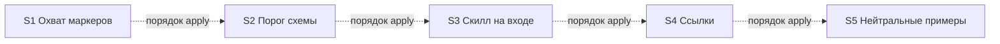

# Quality Control — kit-review-hygiene

Date: 2026-08-30  
Report: `quality-control-2026-08-30.md`  
Mode: **proposed-slice** (`design.md` `## Slices`; `tasks.md` **не существует**)  
Scope (prompt): criteria **1, 3, 5, 5b, 8, 8b, 9, 10, 11** from `.cursor/rules/vertical-slices.mdc` QUALITY CONTROLLER — SLICE COHERENCE; quick check постановки срезов  
Also filled (output format): independence, dependency graph, rework, task readability (N/A)  
Out of scope: исполнимость приёмки «прямо сейчас» на ИБ; тестовые данные; эталоны ИБ; качество кода и выбор варианта A; **не** grep списков слов для критерия 8

Context: kit-only change (markdown в `.cursor/**`). Продуктовый `src/**` / `.bsl` не требуется. `form_mode: n/a`. `**Режим apply:** mechanical` на все срезы. Приёмка — сверка текста и Grep поставки, не прогон чата на чужой ИБ (design `## Assumptions` п.3). **`no-slices` not emitted as a blocker:** оценивается предложенная декомпозиция в `## Slices`. Пользователь принял пять срезов в плане работ. Критерий 8 — смысловое суждение. Критерий 8b: Primary S5 «Grep утечки = 0» — наблюдаемый исход копирования `.cursor/`, **не** foundation, если задачи S5 включают дочистку остатка.

Sources: `proposal.md`, `design.md` (`## Slices`, матрица приёмки, граф, покрытие Scenarios), `specs/**/spec.md` (33 `#### Scenario:`), `.cursor/rules/vertical-slices.mdc`, `.cursor/rules/task-readability.mdc`. Cross-check: `reports/architecture-new-2026-08-30.md` (not a second SoT).

Mechanical pre-check (prompt): none. Manual config checklist: none. User Task Contract pre-check: none.

Repository (prompt): kit-only markdown in `.cursor/**`; no `src/`.

## Verdict

`WARNING`

Пять предложенных срезов вертикальны, с независимыми исходами; S5 не foundation и не ложная граница (дочистка остатка в задачах S5). Primary у всех пяти заданы. В таблице покрытия `## Slices` явно размещены **10 имён**; по смыслу матрицы закрыты **17 из 33** Scenario дельты. Не размещены: новый Scenario «Карточка проекта не подменяет охват ЗНИ»; Scenario «Стайл-гайд по цитате»; шесть унаследованных last-slice (ответы и входы развилки, слот проверки постановки); восемь Scenario карты (слоты исследования/разбора и три регресса описания).

## Slice Summary

| Slice | Scenario | Tasks | Acceptance | Dependencies | Gate |
|---|---|---|---|---|---|
| S1: Охват маркеров без чужих путей | После «принято» на kit-only — архив без `ревью`; фильтр охвата без путей чужой выгрузки | ещё нет (`tasks.md` отсутствует); слои по design: скилл реализации, статус, глоссарий, чеклист поставки | S1.accept предложен (1 mandatory Primary + optional «три слова»); **6/14** Scenario среза размещены (kit 4/5 + chat 3/9; «карточка проекта» и 6 last-slice — нет) | нет | предложен один accept на границе среза; маркер `<!-- slice-gate -->` в design нет (формат `tasks.md`; см. критерий 5) |
| S2: Порог схемы после описания | Описание с табличным отчётом из четырёх доказанных строк без рёбер — намёк есть, если средство таблица | ещё нет; слои: скилл описания | S2.accept предложен (1 Primary + optional «нет соседней ЗНИ»); **3/11** Scenario карты размещены | нет | предложен один accept; маркер — в `tasks.md` |
| S3: Скилл на входе сессии | Follow-up той же команды без повторного Read всего скилла; «покажи схему» — строка-указатель | ещё нет; слои: правило сессии, диспетчер | S3.accept предложен (1 Primary + optional cue; замер бюджета — задача агента); **3/3** | нет | предложен один accept; маркер — в `tasks.md` |
| S4: Ссылки и запасные инструменты | Ссылка контролёра открывается; нет `explore/fast`; fallback Grep/Glob | ещё нет; слои: скилл постановки, план анализа, агент картографа, CHANGELOG, budget stub | S4.accept предложен (1 Primary + optional); **4/5** (нет «Стайл-гайд по цитате») | нет | предложен один accept; маркер — в `tasks.md` |
| S5: Нейтральные примеры | Grep списка утечки в `.cursor/**` = 0 | ещё нет; слои: команды, скиллы, fixtures, docs; **дочистка остатка по дереву** | S5.accept предложен (1 Primary + optional смысл эталонов); **2/5 kit-neutrality**, оба Scenario требования «Examples…» | нет (порядок apply после S1–S4; не blocking для приёмки S1–S4) | предложен один accept; маркер — в `tasks.md` |

Notes:

- Порог: Full по объёму файлов (архитектор: десятки markdown в `.cursor/**`). По `vertical-slices.mdc` § ТРИГГЕРЫ — минимум 2 среза при 2+ независимых исходах; **пять** исходов приняты пользователем. Второй и последующие срезы обоснованы: каждый даёт самостоятельный результат без следующего.
- `form_mode: n/a`. Продуктовый BSL / Form / XML не требуется.
- Отдельный срез «чеклист поставки» отвергнут — пункт чеклиста входит в S1 (фильтр/сегменты, не список утечки). Согласовано с критериями 8b и 9.
- Колонка «Scenarios из spec» в первой таблице Slices — сжатые ярлыки; буквальные имена — в таблице покрытия ниже. При генерации `tasks.md` поле `**Связь со spec:**` SHALL перечислить имена `#### Scenario:` буквально (SUGGESTION).
- S2 в таблице покрытия: «Описание предлагает схему при пороге средства» — **парафраз**, в spec имя «Описание предлагает схему при топологии в отчётах».

## Scenario Coverage

33 `#### Scenario:` в `openspec/changes/kit-review-hygiene/specs/`.

| Capability | Файл | Число | Тип блока |
|---|---|---|---|
| kit-project-neutrality | `specs/kit-project-neutrality/spec.md` | 5 | ADDED |
| chat-surface-clarity | `specs/chat-surface-clarity/spec.md` | 9 | MODIFIED (extends last-slice: тот же смысл развилки, другой детектор) |
| scenario-map-canvas | `specs/scenario-map-canvas/spec.md` | 11 | MODIFIED (порог описания по средству; слоты исследования/разбора в том же требовании) |
| always-apply-context-budget | `specs/always-apply-context-budget/spec.md` | 3 | ADDED |
| delegation-safeguards | `specs/delegation-safeguards/spec.md` | 5 | ADDED |

Правило покрытия: Primary, optional в матрице/`S<N>.accept`, или заявленная `S<N>.<M>` (в т.ч. «верифицировать по тексту»). User IB/runtime spike не заявлен. Покрытие только в `S<N>.<M>` — OK.

### kit-project-neutrality (5)

| Scenario | Covered by (proposed) | Status |
|---|---|---|
| Фильтр без путей заказчика | S1 Primary («в скилле нет путей ЭДО») | OK — covered-by-Primary |
| Kit-only — архив без ревью | S1 Primary | OK — covered-by-Primary |
| Карточка проекта не подменяет охват ЗНИ | **нигде в `## Slices`** (нет в таблице покрытия, нет optional, нет заявленной `S1.<M>`). BC1 в design уже фиксирует: `project.md` не источник `marker_scope` | **GAP** — `accept-bullets-missing-scenario` |
| Примеры без имён проектов | S5 Primary | OK — covered-by-Primary |
| Смысл эталона сохраняется | S5 optional («смысл эталонов сохранён») | OK — covered-by-optional |

### chat-surface-clarity (9)

Новый смысл этой ЗНИ: детектор по сегменту пути и ярлык `cf`. Смысл развилки не переписывается (Decision 1). Дельта всё равно содержит полный набор Scenario требования (MODIFIED). Скилл реализации правится — регресс неизменных WHEN/THEN in scope (optional или агент «по тексту»).

| Scenario | Covered by (proposed) | Status |
|---|---|---|
| Последний срез — развилка из трёх слов | S1 optional («ЗНИ с cfe в tasks — три слова») | OK — covered-by-optional |
| Ответ ревью даёт команду предрелиза | нет имени в покрытии / матрице | **GAP** (унаследованный last-slice) |
| Ответ архив без изменений | нет | **GAP** |
| Ответ стоп без изменений | нет | **GAP** |
| Без кода расширения слова ревью нет | S1 Primary + строка покрытия | OK — covered-by-Primary |
| Возврат в сессию — та же развилка | нет | **GAP** |
| Карточка завершения — та же развилка | нет | **GAP** |
| Проверка постановки после apply не меняется | нет | **GAP** |
| Детектор смотрит сегмент пути, не имя выгрузки | S1 optional (cfe без путей ЭДО → три слова) + Primary фильтра | OK — covered-by-optional |

Имя «Без кода расширения слова ревью нет» и «Kit-only — архив без ревью» — один Then (нет слова `ревью`); Given kit-only закрывает часть WHEN. Путь «только база `cf`» — тот же Then; не второй mandatory (критерий 10).

### scenario-map-canvas (11)

Эта ЗНИ правит скилл **описания** (порог по средству, один отчёт, фраза про соседа). Слоты исследования и разбора в том же MODIFIED-требовании; скилл карты в колонке файлов S2 не назван.

| Scenario | Covered by (proposed) | Status |
|---|---|---|
| Исследование предлагает схему при топологии без замеров | нет | **GAP** (унаследованный слот) |
| Разбор предлагает схему на подтверждении списка без порога публикации | нет | **GAP** |
| Разбор предлагает схему на выходе без замеров времени | нет | **GAP** |
| На линейных двух шагах схему не предлагают | нет | **GAP** |
| Предложение не зависит от темы механизма | нет | **GAP** |
| Описание предлагает схему при топологии в отчётах | S2 таблица покрытия (парафраз «при пороге средства») | OK — covered-by-slice; имя не буквальное |
| Описание с таблицей без рёбер | S2 Primary | OK — covered-by-Primary |
| Описание без отчётов схему не предлагает | нет | **GAP** (регресс описания) |
| Плоский набор без формы связей в описании не даёт намёка | нет | **GAP** |
| Отказ без карты в описании не повторяется | нет | **GAP** |
| Согласие описания отдаёт тот же один отчёт | S2 покрытие + optional «фраза про соседнюю ЗНИ отсутствует» | OK — covered-by-optional |

S2 SHALL «условия „вывод“ и „признак“ остаются» — намерение регресса, **не** заявка `S2.<M>` и не optional-буллет с именем Scenario.

### always-apply-context-budget (3)

| Scenario | Covered by (proposed) | Status |
|---|---|---|
| Скилл читается на входе | S3 Primary + таблица покрытия | OK — covered-by-Primary |
| Follow-up без повторного чтения скилла | S3 Primary («Read только первый ход») | OK — covered-by-Primary (шаг того же пути) |
| Cue «покажи схему» | S3 optional + таблица покрытия | OK — covered-by-optional |

### delegation-safeguards (5)

| Scenario | Covered by (proposed) | Status |
|---|---|---|
| Ссылка контролёра открывается | S4 Primary | OK — covered-by-Primary |
| Fallback поиска | таблица покрытия S4; файлы: план анализа | OK — covered-by-slice (заявить `S4.<M>` / optional) |
| План анализа без режима fast | S4 optional + SHALL | OK — covered-by-optional |
| Картограф без полного чтения скилла карты | S4 SHALL + файлы «агент картографа»; **нет** в таблице покрытия и матрице | OK — covered-by-SHALL; SUGGESTION: optional или `S4.<M>` |
| Стайл-гайд по цитате | **нигде**: нет в таблице покрытия, SHALL, матрице, колонке файлов S4 | **GAP** — `accept-bullets-missing-scenario` |

Итого размещено по смыслу: **17/33**. Пропуски: **16** (1 новый kit + 1 delegation + 6 last-slice + 8 карты).

Non-scenario в матрице (не штрафуются как Scenario): пункт чеклиста поставки в S1; замер бюджета always-apply (S3 агент); шапка CHANGELOG (S4).

## Dependency Graph

- Cycles: нет.
- Forward acceptance: нет. Приёмка S1–S4 **не** требует S5. Primary S1 не дублирует Primary S5 (фильтр/развилка vs Grep дерева).
- Undeclared predecessors: в графе design у S1–S4 «нет»; у S5 нет `**Зависимости:** S1–S4` как blocking. Практический порядок apply S1→S5 — не граф приёмки. Соответствует правилу 4 (зависимости только «назад», если есть) и оговорке архитектора.
- Intra-slice (projected): слои каждого среза → `S<N>.accept`. Цикла нет.

## Criterion 8b — Primary достижим силами этого среза

Пары соседних срезов: S1/S2, S2/S3, S3/S4, S4/S5. Существенного совпадения user-journey **нет** (развилка last-slice ≠ намёк описания ≠ Read на входе ≠ ссылка контролёра ≠ Grep утечки).

| Срез | Элемент Primary | Слой того же среза | Достижимость |
|---|---|---|---|
| S1 | Kit-only после «принято» — архив без `ревью` | скилл реализации (ветка last-slice) | да |
| S1 | В скилле нет путей ЭДО как фильтра | тот же скилл, классификатор по сегментам | да (это фильтр, не Grep всего `.cursor/`) |
| S2 | Таблица, четыре доказанные строки без рёбер, средство table — намёк | скилл описания | да |
| S3 | Read скилла только первый ход | правило сессии | да |
| S4 | Ссылка `.cursor/skills/1c-agent-patterns/quality-controller.md` открывается | скилл постановки ЗНИ | да |
| S5 | Grep списка утечки в `.cursor/**` = 0 | задачи S5: дочистка остатка по дереву + доказательство Grep | да, **если** `S5.<M>` включают дочистку, а не только «файлы кроме S1–S4» |

S5 не заимствует Then у S1–S4. Литералы в файлах S1–S4 правятся **в той же задаче, что протокол**; S5 закрывает остаток и даёт наблюдаемый исход копирования. «Процедурно не подписывать S5.accept до S1–S4» **не** требуется и **запрещено** как лечение 8b.

Нужда прогнать живую сессию apply на чужой ИБ — **transient**, не structural 8b.

`slice-accept-not-self-achievable` **не** эмитируется. Объединение срезов не требуется.

## Criterion 10 — один обязательный осмотр

| Срез | Mandatory в матрице | Оценка |
|---|---|---|
| S1 | одно предложение: kit-only → архив без `ревью` **и** «в скилле нет путей ЭДО» | риск двух journey: чат vs статическая сверка фильтра. Сейчас одно поле Primary. При генерации: **один** mandatory = kit-only архив без `ревью`. Фильтр — `S1.<M>` «по тексту скилла». Optional: cfe → три слова. **Не** делать второй mandatory из «нет путей ЭДО» и не тащить шесть last-slice в обязательные буллеты |
| S2 | одно: таблица без рёбер → намёк; вывод и признак не снимаются | один осмотр. Optional: нет фразы про соседнюю ЗНИ. SHALL не копировать вторым mandatory |
| S3 | одно: Read только первый ход | Follow-up и вход — шаги одного пути. Cue и бюджет не blocking |
| S4 | одно: ссылка открывается | optional: `explore/fast`, CHANGELOG; картограф — не второй mandatory |
| S5 | одно: Grep = 0 | optional: смысл эталонов |

`acceptance-simplicity-overload` **не** эмитируется (тел `S<N>.accept` ещё нет). Разворачивать 14+11 имён в несколько обязательных буллетов **запрещено**.

## Checklist Results

| # | Criterion | Result |
|---|---|---|
| 1 | Scenario Coverage | **Fail (WARNING)** — 17/33. Размещены: kit 4/5, chat 3/9, canvas 3/11, always-apply 3/3, delegation 4/5. Пропуски см. Alerts. User runtime только на границе accept (projected) |
| 2 | Slice Independence | **Pass** (информативно) — каждый срез принимаем без следующих. S1–S4 не ждут S5 |
| 3 | Slice Completeness | **Pass** для Primary: слои kit названы (S1 — скилл реализации; S2 — скилл описания; S3 — правило сессии; S4 — скилл постановки; S5 — дерево `.cursor/**` + дочистка). Метаданных/форм 1С нет и не требуется. Дыра слоя для **непокрытого** Scenario «Стайл-гайд по цитате»: колонка файлов S4 не называет стайл-гайд / цитируемый раздел — это покрытие (критерий 1/5b), не дыра Primary S4. Budget stub в файлах S4 при замере в S3 — SUGGESTION размещения, не fail Primary |
| 4 | Slice Dependency Graph | **Pass** — циклов нет; объявленные деды не ссылаются на несуществующие срезы; порядок apply не выдан за blocking `**Зависимости:**` |
| 5 | Slice Gate Integrity | **Pass (projected)** — по одному `S<N>.accept` на срез в матрице, дубля нет. Маркер `<!-- slice-gate -->` — артефакт `tasks.md`; **не** CRITICAL (нет `# Срез` в tasks). `legacy-acceptance-format` N/A |
| 5b | Acceptance Checklist Coverage | **Fail (WARNING)** — `**Primary acceptance:**` в таблице Slices есть у S1–S5 → `primary-acceptance-missing` не срабатывает. Тел accept нет → `accept-checklist-empty` N/A. `accept-bullet-foreign-scenario` нет (S1 не ставит Grep утечки blocking; чеклист поставки — фильтр, не список утечки). `accept-bullets-missing-scenario` — да (16 имён, группы ниже) |
| 6 | Rework Risk | **Pass** (информативно) — сценарии срезов не повторяют Then друг друга. Риск: S1 Primary «нет путей ЭДО» пересекается с S5 Grep; design разводит (фильтр vs дерево). SUGGESTION: не класть Grep=0 в S1 |
| 8 | Slice Verticality | **Pass** — смысловая оценка, без grep слов. S1: после «принято» на kit-only в чате вопрос архива без `ревью` (чёрный ящик чата kit). S2: после описания намёк в строке шага. S3: поставленный протокол сессии (вход без повторного Read) — наблюдаемое поведение оркестратора, не вызов API в отладчике. S4: путь открывается, файл на месте. S5: копия `.cursor/` без имён из списка утечки (исход поставки). Programmatic (сверка скилла, замер бюджета, CHANGELOG) вынесены из mandatory Then в optional / задачу агента — верно. Ни один срез не имеет **только** код-ревью контракта как единственный Primary |
| 8b | Self-Achievable Acceptance | **Pass** — нет дубля journey с соседом; S5 самодостаточен при дочистке в `S5.<M>`. Не foundation |
| 9 | Foundation slice with gate | **Pass** — нет пары «S_k programmatic-only + зависимый S_k+1 с UX». S1–S4: `**Зависимости:** нет`. S5: наблюдаемый исход поставки, не API без UX. Черновик «чеклист поставки» как отдельный срез отвергнут |
| 10 | Acceptance Simplicity | **Pass (projected)** — по одному mandatory на срез в матрице. Риск S1: два Then в одном предложении (чат + фильтр) → при двух буллетах без «опционально» сработает overload (SUGGESTION) |
| 11 | User Task Contract | **Pass (projected)** — строк `S<N>.<M>` нет, DENY-grep не к чему. Prompt: pre-check none. Grep утечки и сверка текста — на границе `S<N>.accept` или агент «по коду/тексту». Замер бюджета — задача агента, не user-spike. CRITICAL не ставить до запрещённых формулировок в tasks |

Task readability: **N/A** — нет `- [ ] S<N>.<M>`. Критерий 7 не в запросе; при генерации действует `.cursor/rules/task-readability.mdc`.

## Alerts

**CRITICAL:** нет.

### 1. `accept-bullets-missing-scenario` — Карточка проекта

- affected: S1 / `kit-project-neutrality` Scenario «Карточка проекта не подменяет охват ЗНИ»
- alert type: `accept-bullets-missing-scenario`
- severity: `WARNING`
- evidence: `specs/kit-project-neutrality/spec.md` Requirement «Filter without customer dump paths». Таблица «Покрытие Scenarios» имя не содержит. BC1 design: карточка не источник `marker_scope`. Архитектор: kit-only в проекте с расширениями не должен получать три слова.
- recommendation: optional `S1.accept` или `S1.<M>` «по тексту»: в карточке есть корень расширения, в задачах текущей ЗНИ нет `.bsl` → охват не `mixed`, слова `ревью` нет. **Не** второй mandatory (критерий 10). Имя в `**Связь со spec:**` S1 буквально.

### Remediation (auto-repair)

- alert: `accept-bullets-missing-scenario`
- target: `design.md` `## Slices` (таблица покрытия + матрица S1) и будущий `tasks.md` срез S1
- action: (1) Строка покрытия: «Карточка проекта не подменяет охват ЗНИ» → S1 optional / `S1.<M>`. (2) В `S1.accept` — optional-буллет с буквальным именем **или** задача сверки BC1. (3) Не включать этот Given в mandatory Primary (Primary остаётся kit-only архив без `ревью`).

### 2. `accept-bullets-missing-scenario` — унаследованный last-slice

- affected: S1 / 6 Scenario в `specs/chat-surface-clarity/spec.md`: «Ответ ревью даёт команду предрелиза», «Ответ архив без изменений», «Ответ стоп без изменений», «Возврат в сессию — та же развилка», «Карточка завершения — та же развилка», «Проверка постановки после apply не меняется»
- alert type: `accept-bullets-missing-scenario`
- severity: `WARNING`
- evidence: MODIFIED-требование переписывает last-slice целиком; Decision 1 — смысл не меняется, правится детектор и ярлык. Скилл реализации в файлах S1. Таблица покрытия называет только «Без кода расширения…» (плюс kit-only из другого spec).
- recommendation: **одна** `S1.<M>` «верифицировать по тексту скилла реализации»: формулировка трёх слов; разбор `ревью` / `архив` / `стоп` без смены Then; возврат и карточка — та же развилка; слот проверки постановки после apply по-прежнему команда архива. Покрытие только в задаче — OK. **Не** шесть mandatory буллетов и **не** второй срез.

### Remediation (auto-repair)

- alert: `accept-bullets-missing-scenario`
- target: `design.md` `## Slices` (таблица покрытия) и будущий `tasks.md` срез S1
- action: (1) Одна строка покрытия: «унаследованные Scenario last-slice (ответы, возврат, карточка, слот проверки постановки)» → S1 задача сверки скилла. (2) В теле задачи — шесть имён буквально. (3) Не включать в mandatory Primary.

### 3. `accept-bullets-missing-scenario` — карта (слоты + регресс описания)

- affected: S2 / 8 Scenario в `specs/scenario-map-canvas/spec.md`
- alert type: `accept-bullets-missing-scenario`
- severity: `WARNING`
- evidence: дельта MODIFIED содержит слоты исследования/разбора и три Scenario описания, которых нет в таблице покрытия S2. Файлы S2 — скилл описания. SHALL S2 «вывод и признак остаются» не заменяет имена Scenario.
- recommendation: (A) Три регресса описания — optional `S2.accept` или одна `S2.<M>`: «Описание без отчётов…», «Плоский набор…», «Отказ без карты…». (B) Пять слотов исследования/разбора — **одна** агентская `S2.<M>` «по тексту скилла карты / описания: слоты „Дальше“ / список / выход разбора, линейные два шага, независимость от темы не меняются этой ЗНИ». Не тащить 8 имён в mandatory. Не делать срез «только слоты исследования».

### Remediation (auto-repair)

- alert: `accept-bullets-missing-scenario`
- target: `design.md` `## Slices` (таблица покрытия S2) и будущий `tasks.md` срез S2
- action: (1) Добавить строки покрытия на восемь имён → S2 optional и/или `S2.<M>`. (2) Primary оставить «Описание с таблицей без рёбер». (3) В `**Связь со spec:**` — буквальные имена, не «при пороге средства».

### 4. `accept-bullets-missing-scenario` — Стайл-гайд по цитате

- affected: S4 / `delegation-safeguards` Scenario «Стайл-гайд по цитате»
- alert type: `accept-bullets-missing-scenario`
- severity: `WARNING`
- evidence: spec Requirement «Style guide is read by cited section»; proposal What Changes п.4. Колонка файлов S4: new SKILL, context-strategy, картограф, CHANGELOG, budget stub — без стайл-гайда. SHALL S4 имя не содержит.
- recommendation: `S4.<M>` «по тексту»: скилл реализации ссылается на раздел карточки завершения → читается этот раздел, не весь файл стайл-гайда. Optional в `S4.accept` допустим. Имя в `**Связь со spec:**` S4. Не mandatory (критерий 10).

### Remediation (auto-repair)

- alert: `accept-bullets-missing-scenario`
- target: `design.md` `## Slices` (S4 файлы + покрытие) и будущий `tasks.md` срез S4
- action: (1) Строка покрытия «Стайл-гайд по цитате» → S4. (2) Задача сверки цитируемого раздела (файл стайл-гайда / скилл, который на него ссылается). (3) Не второй Primary S4.

### 5. `slice-gate-pending-tasks`

- affected: S1–S5 (generation of `tasks.md`)
- alert type: (informational for criterion 5)
- severity: `SUGGESTION`
- evidence: матрица задаёт по одному accept; HTML-маркер в design не пишется.
- recommendation: пять заголовков `# Срез S<N>`, блок метаданных с `**Primary acceptance:**` из таблицы, ровно один `- [ ] S<N>.accept` с `**Primary (обязательно):**`, затем `<!-- slice-gate: … -->` на срез. `**Режим apply:** mechanical`.

### 6. `acceptance-simplicity-guard`

- affected: projected `S1.accept` (и осторожно S2/S4 SHALL)
- alert type: профилактика критерия 10
- severity: `SUGGESTION`
- evidence: Primary S1 склеивает чат kit-only и «нет путей ЭДО». SHALL S2/S4 перечисляют несколько исходов.
- recommendation: один mandatory на срез. S1: kit-only → «принято» → архив/`стоп`, слова `ревью` нет. Фильтр — задача агента. S2: только таблица без рёбер → намёк. S4: только ссылка открывается.

### 7. `user-task-contract-guard`

- affected: будущие `S<N>.<M>`
- alert type: профилактика критерия 11
- severity: `SUGGESTION`
- evidence: колонки «Приёмка» = сверка текста + Grep; Assumptions п.3. DENY-маркеров в design нет.
- recommendation: живой прогон чата (если будет) только в `S<N>.accept`. Правки markdown и Grep/Read — агент. Не писать в `S<N>.<M>` «на стенде», «на тестовой ИБ», «runtime-verify», «в консоли», «после verify».

### 8. `spec-link-literal-names` + размещение картографа / fallback / бюджета

- affected: metadata будущих срезов
- alert type: профилактика 5b / критерия 3
- severity: `SUGGESTION`
- evidence: парафраз S2; картограф и fallback есть в SHALL/файлах, но не в матрице; budget stub в файлах S4 при замере в S3.
- recommendation: буквальные имена в `**Связь со spec:**`. Картограф и fallback — optional или `S4.<M>`. Замер размера always-apply — `S3.<M>`, не только колонка S4.

### 9. S5 tasks include leftover cleanup

- affected: S5 `S5.<M>`
- alert type: профилактика 8b (условие Pass)
- severity: `SUGGESTION`
- evidence: граф design: «S5 — дочистка остатка по дереву + доказательство Grep». Prompt: не foundation, если задачи включают дочистку.
- recommendation: в `tasks.md` хотя бы одна `S5.<M>` на остаток литералов по `.cursor/**` (не «всё кроме файлов S1–S4») + задача Grep списка утечки = 0. `**Зависимости:** нет`. Не подписывать S1.accept Grep=0.

**Не эмитировано:** `no-slices`; `primary-acceptance-missing`; `accept-checklist-empty`; `accept-bullet-foreign-scenario`; `slice-not-vertical`; `slice-accept-not-self-achievable`; `slice-foundation-with-gate`; `acceptance-simplicity-overload`; `user-task-contract-violation`; `legacy-acceptance-format`; `deprecated-phase-gate`.

## Recommendations

**Automatic fix**

До генерации `tasks.md` — дописать покрытие в `design.md` `## Slices` (четыре WARNING выше). Это не смена числа срезов и не Chosen A.

**Tasks generation**

1. Пять `# Срез S<N>`, по одному `S<N>.accept` и `<!-- slice-gate -->`, `mechanical`.
2. Один mandatory Primary на срез из матрицы (S1 — только kit-only архив без `ревью`).
3. Закрыть 16 пропусков optional / `S<N>.<M>` «по тексту» (ремонты 1–4).
4. S5: дочистка остатка + Grep=0; не foundation; S1–S4 принимаются без S5.
5. Глагол + файл + результат в `S<N>.<M>` (`.cursor/rules/task-readability.mdc`).

**Decision required**

Нет. Критерий 8b / объединение срезов не требуется. Переписывать Primary S5 на другой путь не нужно. Запрещённое «не подписывать accept до следующего среза» не предлагается.

**Do not**

- Не выделять чеклист поставки или «только памятка фильтра» отдельным срезом.
- Не ставить Grep утечки blocking в S1 (украдёт Primary S5).
- Не сливать S5 в S1 из-за литералов в тех же файлах — разные исходы; литералы протокола чистить в задаче протокола, остаток — в S5.
- Не ставить два+ mandatory black-box journey в одном `S<N>.accept`.
- Не класть живой прогон ИБ/стенда в `S<N>.<M>`.
