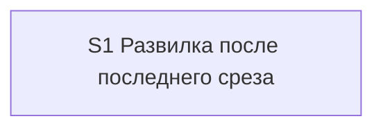

# Quality Control — last-slice-review-or-archive

Date: 2026-08-30  
Report: `quality-control-2026-08-30-2.md`  
Mode: **slice** (`# Срез S1` in `tasks.md`)  
Scope: criteria 1–6, 8, 8b, 9–11 from `.cursor/rules/vertical-slices.mdc` QUALITY CONTROLLER — SLICE COHERENCE + task readability  
Prior report: `quality-control-2026-08-30.md` — режим **proposed-slice**, `tasks.md` тогда не существовал. Этот файл — **новый** прогон по существующему `tasks.md`, вердикт прошлого файла не копировался.  
Out of scope: исполнимость приёмки «прямо сейчас» на живой сессии / ИБ; тестовые данные; эталоны ИБ; качество кода и выбор варианта реализации.

Context: kit-only change (скилл реализации, памятка ревью, шаблон проверки постановки — только сверка без правки, дельта `chat-surface-clarity`). Продуктовый `src/**` / `.bsl` не требуется. `form_mode: n/a`. Приёмка — чат kit, не прикладная конфигурация. **Режим apply:** mechanical. В spec **8** `#### Scenario:`. Все рабочие чекбоксы и приёмочный открыты (`[ ]`).

Sources: `tasks.md`, `design.md` (`## Slices`), `proposal.md`, `specs/chat-surface-clarity/spec.md` (8 `#### Scenario:`), `.cursor/rules/vertical-slices.mdc`, `.cursor/rules/task-readability.mdc`.

Mechanical pre-check (prompt / this run): чекбоксы на месте; ровно один `S1.accept`; закрывающий `<!-- slice-gate -->` есть; `<!-- phase-gate -->` нет; пустых буллетов нет; ID задач с префиксом среза. Нумерация рабочих задач: `S1.1`–`S1.8` подряд, затем `S1.accept`. Пометка порядка: `S1.8` «выполняется последней в срезе, после S1.1–S1.7». User Task Contract DENY-grep по строкам `^- \[[ x]\] S\d+\.\d+` (не accept): none. Маркеров ручной конфигурации нет. Repair-grep (`При успешном verify S` / `после verify S` / `после стенда`): none.

Repository (prompt): `.cursor/skills/openspec-apply-change/SKILL.md`, `.cursor/docs/review-guide.md`, `.cursor/skills/openspec-verify-change/templates/chat-summary.md` — существуют и непусты.

## Verdict

`OK`

Один срез в `tasks.md`, одна приёмка, один маркер границы. Все восемь сценариев дельты покрыты (два имени — шаги одного обязательного пути в чате; пять — optional в той же приёмке; один — сверка текста шаблона агентом). Обязательный осмотр — **один**: принять последний срез ЗНИ с кодом расширения → увидеть три слова, каталог на месте → ответить `ревью` → увидеть одну команду предрелиза. Этот путь достижим задачами того же среза (формулировка развилки, условие показа, разбор ответа). Второго среза нет и не требуется. Живой прогон чата — только на границе среза, не в рабочих задачах.

## Slice Summary

| Slice | Scenario | Tasks | Acceptance | Dependencies | Gate |
|---|---|---|---|---|---|
| S1: Развилка после последнего среза | Разработчик принимает последний срез ЗНИ с кодом расширения и в чате получает один вопрос с тремя словами; `ревью` даёт команду предрелиза, ЗНИ остаётся активной | 8 агентских (`S1.1`–`S1.8`) + `S1.accept`; группы `## 1`–`## 5`. Все открыты | `S1.accept` (6 буллетов: 1 Primary с 2 именами + 5 optional; **8/8** Scenario покрыты, восьмой через `S1.7`) | нет | да (`<!-- slice-gate -->`) |

Notes:

- Порог: 8 рабочих задач — Standard (6–15). По `vertical-slices.mdc` § ТРИГГЕРЫ — **1 срез по умолчанию**. Второй срез не обоснован: один самостоятельный исход (развилка в чате после приёмки последнего среза). Согласовано с `design.md` `## Slices`: отдельный срез «памятка» без развилки в чате не принимается самостоятельно.
- `form_mode: n/a`. Продуктовый BSL / Form / XML не требуется.
- `**Режим apply:** mechanical` — допустим для правки markdown скиллов/памятки; не дефект среза.
- Поле `**Связь со spec:**` перечисляет все восемь имён буквально, как в `#### Scenario:`.
- Пометка «после S1.1–S1.7» на `S1.8` — внутрисрезовый порядок apply (сверка после правок), не межсрезовая зависимость и не user-spike.
- Три точки скилла реализации (`S1.1`–`S1.5`) + строка памятки (`S1.6`) + сверка неизменяемого шаблона (`S1.7`) + сводная сверка формулировки (`S1.8`) — группы внутри одного среза, не отдельные точки приёмки.

## Scenario Coverage

8 `#### Scenario:` в `openspec/changes/last-slice-review-or-archive/specs/chat-surface-clarity/spec.md`. Capability: `chat-surface-clarity` (ADDED, одно требование). Имена в ёлочках чеклиста и `S1.7` совпадают с заголовками spec буквально.

| Scenario | Covered by | Status |
|---|---|---|
| Последний срез — развилка из трёх слов | Primary `S1.accept` + `S1.1` (формулировка развилки), `S1.2` (условие показа) | OK — covered-by-Primary |
| Ответ ревью даёт команду предрелиза | Primary `S1.accept` + `S1.3` (разбор ответа `ревью`) | OK — covered-by-Primary |
| Ответ архив без изменений | optional `S1.accept` + `S1.3` (поведение `архив` сохранить) | OK — covered-by-optional |
| Ответ стоп без изменений | optional `S1.accept` + `S1.3` (поведение `стоп` сохранить) | OK — covered-by-optional |
| Без кода расширения слова ревью нет | optional `S1.accept` + `S1.2` (пустой `marker_scope` и `cf-ea`) | OK — covered-by-optional |
| Возврат в сессию — та же развилка | optional `S1.accept` + `S1.4` | OK — covered-by-optional |
| Карточка завершения — та же развилка | optional `S1.accept` + `S1.5` | OK — covered-by-optional |
| Проверка постановки после apply не меняется | `S1.7` (агент: верифицировать по тексту шаблона проверки постановки) | OK — covered-by-task (implementation-only / инвариант «не менять»; не отдельный accept) |

Пропусков нет. `accept-bullets-missing-scenario` **не** эмитируется: восьмой Scenario покрыт задачей агента — это допустимо правилом 6 / критерием 5b (покрытие только в `S<N>.<M>` — OK).

Implementation-only путь для «Проверка постановки после apply не меняется» согласован с Non-Goals п.1, Behavior Contract п.7 и proposal Out of scope: слот не правится, агент сверяет шаблон. User IB/runtime spike в середине среза нет.

Два spec-сценария в Primary («развилка из трёх слов» и «ответ ревью») — **шаги одного** user-journey (принять → увидеть три слова → ответить `ревью` → увидеть команду), не два blocking-прохода. См. критерий 10.

`S1.6` (строка в памятке ревью) и `S1.8` (сводка: одна формулировка, нет второй команды, нет новых команд/файлов/детекторов) — не отдельные Scenario spec; NFR / сверка инвариантов в `S<N>.<M>` по карте правила 6. Верно.

## Dependency Graph

- Cycles: none.
- Forward acceptance dependencies: none (единственный срез; критерий 8b не срабатывает механикой пары S1/S2).
- Undeclared slice predecessors: none (`**Зависимости:** нет`). Соседние ЗНИ про карту сценария в граф не входят (proposal Out of scope).
- Intra-slice (порядок файла и явные ссылки): формулировка развилки и условие показа (`S1.1`–`S1.2`) → разбор трёх ответов (`S1.3`; ссылается на развилку из `S1.1`) → возврат в сессию (`S1.4`; та же развилка) → карточка завершения (`S1.5`; та же развилка) → строка памятки (`S1.6`) → сверка шаблона проверки постановки без правки (`S1.7`) → сводная сверка текстов (`S1.8`, явно последняя) → `S1.accept`. Цикла нет. Явная межсрезовая зависимость не нужна.

## Criterion 8b — Primary достижим силами этого среза

Пары соседних срезов нет. Семантика: каждый элемент обязательного осмотра имеет включающий слой в `S1.<M>` того же среза.

| Элемент Primary | Задачи того же среза | Достижимость |
|---|---|---|
| Принять последний срез фразой «принято» | `S1.1` (хук ручной приёмки, шаг 6 блока shortcut) | да, тот же S1 |
| В чате три слова, ничего не заархивировано | `S1.1` (формулировка развилки; ход без автоархива) + `S1.2` (показа `ревью` при `marker_scope` = `cfe`/`mixed`) | да |
| Ответить `ревью` | `S1.3` (разбор трёх ответов, шаг 7) | да |
| Одна команда предрелиза, каталог ЗНИ на месте | `S1.3` (печать `/release-review <имя>`; сессия реализации завершается без запуска предрелиза и без второго вопроса) | да |

Наблюдаемый исход не заимствован у более позднего среза. Памятка ревью (`S1.6`) **не** входит в Then Primary: строка проверяется вместе с чатом (явный отказ от отдельного среза в `## Slices`). Возврат в сессию (`S1.4`) и карточка завершения (`S1.5`) — другие входы в **ту же** развилку; вынос в следующий срез дал бы дубль journey → ложная граница. Сейчас оба в optional того же S1. Верно.

Нужда в «чужой» ЗНИ с кодом расширения как фикстуре прогона — **transient** (среда приёмки), не structural unreachability внутри среза. Не эмитируется как 8b.

`slice-accept-not-self-achievable` **не** эмитируется. Объединение срезов не требуется: декомпозиция уже один срез. Запрещённое «процедурно не подписывать accept до следующего среза» не предлагается.

## Criterion 10 — один обязательный осмотр или несколько?

В теле `S1.accept` **один** mandatory-буллет без пометки «опционально». Остальные пять помечены «(опционально)».

Сплетение «три слова + ответ ревью» — **один осмотр одной сессии реализации**, не два обязательных прохода:

1. Given: ЗНИ с кодом расширения, последний срез.
2. When: принять фразой «принято», затем ответить `ревью`.
3. Then (тот же ход/сессия): в чате были три слова, каталог не уехал в архив; после `ревью` — одна команда предрелиза.

Это не несколько journey: нет второго экрана, нет второго Given «другая ЗНИ» в mandatory Then. Имена двух Scenario в одном Then — покрытие связанных сценариев одним путём (как «включить флаг → сохранить → переоткрыть»).

`acceptance-simplicity-overload` **не** эмитируется. Разворачивать восемь имён в восемь обязательных буллетов **запрещено** remediation критерия 10.

## Checklist Results

| # | Criterion | Result |
|---|---|---|
| 1 | Scenario Coverage | **Pass** — 8/8. Primary (2 имени как шаги одного пути) / optional (5) / agent-сверка шаблона (`S1.7`) (1). User runtime только на границе `S1.accept`. Путь «верифицировать по тексту» для kit = static agent path критерия 1 |
| 2 | Slice Independence | **Pass** — принимать S1 можно без несуществующего следующего среза |
| 3 | Slice Completeness | **Pass** — слои kit для Primary: скилл реализации — формулировка развилки (`S1.1`), условие показа (`S1.2`), разбор `ревью` (`S1.3`). Optional-входы того же события: возврат (`S1.4`), карточка (`S1.5`). Памятка (`S1.6`) в том же срезе, не отдельная приёмка. Шаблон проверки постановки — сверка без правки (`S1.7`), не пропуск слоя. Сводка инвариантов (`S1.8`) — NFR в `S<N>.<M>`. Метаданных/форм 1С нет и не требуется. Целевые файлы в репозитории есть |
| 4 | Slice Dependency Graph | **Pass** — S1 → нет. Внутрисрезовый порядок `S1.8` объявлен явно. Циклов и необъявленных предшественников нет |
| 5 | Slice Gate Integrity | **Pass** — ровно один `S1.accept`, ровно один `<!-- slice-gate -->`. Legacy `S1.T<M>` нет. Фаз / `phase-gate` нет. `legacy-acceptance-format` N/A |
| 5b | Acceptance Checklist Coverage | **Pass** — есть `**Primary acceptance:**` в metadata и `**Primary (обязательно):**` в теле accept. Чеклист не пуст. Чужих сценариев нет (один срез). Все 8 Scenario spec где-то покрыты. `primary-acceptance-missing` / `accept-checklist-empty` / `accept-bullets-missing-scenario` / `accept-bullet-foreign-scenario` не срабатывают |
| 6 | Rework Risk | **Pass** — нет опоры на непринятый предыдущий срез; сценарии не дублируются между срезами (среза один). Три входа в одну формулировку намеренно в одном срезе; не rework между срезами. `S1.8` после `S1.1`–`S1.7` — обычная финальная сверка внутри среза |
| 8 | Slice Verticality | **Pass** — mandatory Primary: принять последний срез в чате реализации → увидеть три слова, ЗНИ не в архиве → ответить `ревью` → увидеть одну команду предрелиза. Это black-box (чат kit как продукт), не вызов функции в отладчике / код-ревью контракта API. Programmatic (сверка скилла, памятки, шаблона проверки постановки) вынесены из Primary в `S1.7`/`S1.8` — верно |
| 8b | Self-Achievable Acceptance | **Pass** — см. секцию выше. Нет пары S1/S2. Все включающие слои Primary лежат в задачах этого же среза |
| 9 | Foundation slice with gate | **Pass** — нет foundation-среза с programmatic accept и зависимого UX-среза. Подготовка формулировки, условия показа, разбора ответов, памятки и сверки — внутри того же S1 с наблюдаемой приёмкой в чате. Условие критерия 9 (существует S_k+1 с зависимостью от S_k) не выполняется |
| 10 | Acceptance Simplicity | **Pass** — **один** mandatory black-box journey. Три слова + ответ `ревью` = один осмотр (см. секцию критерия 10). Optional помечены «(опционально)» |
| 11 | User Task Contract | **Pass** — DENY-grep по `S1.<M>` пуст. Repair-grep пуст. Семантика: рабочие задачи — правки markdown / сверка по тексту (агент, ALLOW-agent: «Верифицировать по тексту», «Сверить по тексту»). Живой прогон реализации (фраза «принято», ответы `ревью`/`архив`/`стоп`, возврат, карточка, ЗНИ без кода расширения) — только в `S1.accept`. «После S1.1–S1.7» на `S1.8` — порядок агентских задач, не обязанность пользователя после стенда. Assumptions design п.3 (ручной прогон чата) = граница приёмки |

## Task Readability

Применяется ко всем `S1.1`–`S1.8` кроме `S1.accept`. `S1.accept` — по исключению (бизнес-результат в заголовке + чеклист).

| Check | Result |
|---|---|
| Глагол + файл/объект + зачем + опора | **Pass** — зачины «В `<путь>`, шаг …: заменить/описать/вести/печатать/добавить»; `S1.7`/`S1.8` — «Верифицировать / Сверить по тексту» + путь файла; опоры Decisions, Behavior Contract, Non-Goals, Migration Plan, имена Scenario |
| Антипаттерн «голый идентификатор решения» | нет — нет заголовков вида «Реализовать инвариант D7» |
| Антипаттерн «глагол без объекта» | нет — у каждой рабочей задачи назван файл (скилл реализации, памятка, шаблон проверки постановки) |
| Антипаттерн «глагол + команда без контекста» | нет |
| Описание < 8 слов | нет |
| `S1.accept` заголовок с бизнес-результатом | **Pass** — «после последнего среза чат предлагает ревью или архив одним вопросом» |
| Имена Scenario в ёлочках | **Pass** — буквальное совпадение с `#### Scenario:` spec; 7 имён в чеклисте accept + 1 имя в `S1.7` |
| Recipe vs outcome | **Pass** — правки скилла **и есть** наблюдаемый контракт чата (развилка, разбор слов). Имена шагов скилла (шаг 6 shortcut, шаг 7, ветка «Принят», вариант `final` T-HANDOFF) — существующие якоря файла, не самовольный рецепт вместо Then. `marker_scope` — уже вычисляемый признак (Existing Mechanisms п.4 / Decisions п.3), не выдуманная процедура |

Алерты читаемости не эмитируются. `S1.1`–`S1.5` трогают один файл скилла разными якорями — формулировки самодостаточны, дробить на отдельные срезы не требуется. Пометка «(выполняется последней…)» на `S1.8` не делает заголовок непрозрачным: объект (два файла) и результат (одна формулировка, прежнее поведение `архив`/`стоп`, один следующий шаг на `ревью`) остаются в той же строке.

`task-opaque-title` / `task-too-short` / `task-opaque-acceptance` **не** эмитируются. Legacy `T<M>` нет.

## Alerts

**CRITICAL / WARNING / SUGGESTION:** нет.

**Не эмитировано:** `no-slices`; `deprecated-phase-gate`; `primary-acceptance-missing`; `accept-checklist-empty`; `accept-bullets-missing-scenario`; `accept-bullet-foreign-scenario`; `slice-not-vertical`; `slice-accept-not-self-achievable`; `slice-foundation-with-gate`; `acceptance-simplicity-overload`; `user-task-contract-violation`; `legacy-acceptance-format`; `task-opaque-title`; `task-too-short`; `task-opaque-acceptance`.

Профилактические SUGGESTION прошлого отчёта (`slice-gate-pending-tasks`, `acceptance-simplicity-guard`, `user-task-contract-guard`, completeness слоёв, `spec-link-literal-names`) **сняты**: в `tasks.md` они уже выполнены (один срез, один mandatory Primary, optional/agent для остальных, живой прогон только в accept, восемь имён в `**Связь со spec:**`).

## Recommendations

**Automatic fix**

Нет. Repairable-алертов нет.

**Decision required**

Нет. Критерий 8b / объединение срезов не требуется: декомпозиция уже один срез. Переписывать Primary на другой путь не нужно.

**Do not**

- Не вводить второй срез «памятка», «возврат в сессию» или «карточка завершения» (критерии 8b и 9: тот же исход, другие входы).
- Не ставить два+ mandatory black-box journey в `S1.accept`.
- Не откладывать `S1.accept` «пока не будет следующего среза».
- Не класть живой прогон чата в `S1.1`–`S1.8` как обязанность пользователя.
- Не разворачивать восьмой Scenario («Проверка постановки после apply не меняется») в mandatory-буллет accept: это инвариант «не менять», место — `S1.7`.
