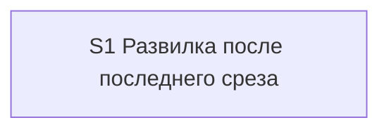
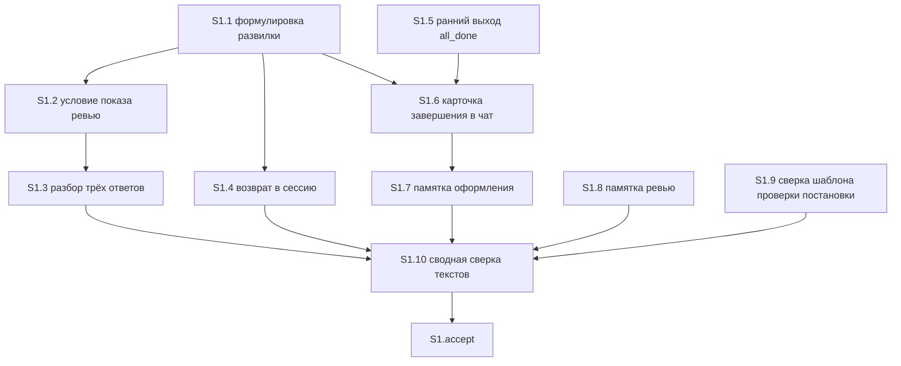

# Quality Control — last-slice-review-or-archive

Date: 2026-08-30  
Report: `quality-control-2026-08-30-3.md`  
Mode: **slice** (`^# Срез S1` в `tasks.md`)  
Scope: критерии 1–6, 8, 8b, 9–11 (Slice Coherence) + читаемость формулировок задач после repair постановки.  
Change: `last-slice-review-or-archive` (kit-метапроект; один срез).  
Out of scope: исполнимость приёмки «прямо сейчас»; тестовые данные; эталоны ИБ; качество кода и выбор варианта реализации.

Context: kit-only (скилл реализации, памятка ревью, памятка оформления финала, шаблон проверки постановки — только сверка без правки). Продуктовый `src/**` / `.bsl` не требуется. `form_mode: n/a`. Приёмка — чат kit. **Режим apply:** mechanical. В spec **8** `#### Scenario:`. Рабочие чекбоксы `S1.1`–`S1.10` и приёмочный открыты (`[ ]`).

Sources: актуальный `tasks.md` (S1.1–S1.10 + accept), `design.md` (`## Slices`), `proposal.md`, `specs/chat-surface-clarity/spec.md`, `.cursor/rules/vertical-slices.mdc`, `.cursor/rules/task-readability.mdc`.

Mechanical pre-check (повторно): DENY-фразы User Task Contract в строках `^- \[[ x]\] S\d+\.\d+` — **нет совпадений**. Repair-grep (`При успешном verify S` / `после verify S` / `после стенда`) — **нет**. Маркеры ручного конфигурирования — **не найдены** (ожидаемо: правки markdown).  
User Task Contract pre-check (prompt): новые задачи S1.5–S1.7 — правка markdown; S1.9 «Верифицировать по тексту» — ALLOW-agent. Подтверждено перечитыванием.

Repository (prompt, существуют): `.cursor/skills/openspec-apply-change/SKILL.md`, `.cursor/docs/review-guide.md`, `.cursor/docs/opsx-output-style.md`, `.cursor/skills/openspec-verify-change/templates/chat-summary.md`.

Этот прогон оценивает **текущий** `tasks.md` после repair. Вердикт предыдущих файлов `quality-control-2026-08-30.md` / `quality-control-2026-08-30-2.md` не копируется.

## Verdict

`OK`

Один срез, вертикальный, самодостаточный. Обязательный осмотр — наблюдаемый чат после «принято» на последнем срезе ЗНИ с кодом расширения: три слова, затем `ревью` даёт одну команду предрелиза, каталог ЗНИ на месте. Все восемь сценариев дельты покрыты (семь в чеклисте приёмки, инвариант «слот проверки постановки не меняется» — агентской сверкой шаблона). Рабочие задачи не поручают пользователю runtime. Объединение срезов не требуется.

## Slice Summary

| Slice | Scenario | Tasks | Acceptance | Dependencies | Gate |
|---|---|---|---|---|---|
| S1: Развилка после последнего среза | Разработчик принимает последний срез ЗНИ с кодом расширения и в чате получает один вопрос с тремя словами; `ревью` даёт команду предрелиза, ЗНИ остаётся активной | S1.1–S1.10 (10 рабочих) | `S1.accept` (6 буллетов: 1 Primary + 5 optional; **7/8** Scenario в чеклисте, **8/8** со сверкой S1.9) | нет | `<!-- slice-gate -->` есть; ровно один accept |

Notes:

- Порог: Standard (10 рабочих + accept). По `vertical-slices.mdc` § ТРИГГЕРЫ — **1 срез по умолчанию**. Второй срез не нужен: один самостоятельный исход (развилка в чате). Согласовано с `design.md` `## Slices`: отдельный срез «памятка» без развилки в чате не принимается самостоятельно.
- `form_mode: n/a`. Слои продукта 1С (метаданные / форма / BSL) не требуются. Слои kit в срезе: скилл реализации (S1.1–S1.6), памятка оформления (S1.7), памятка ревью (S1.8), сверка шаблона проверки постановки (S1.9), сводная сверка текстов (S1.10).
- Маркер `<!-- phase-gate -->` отсутствует. Legacy `S1.T<M>` нет.
- Все рабочие ID — `S1.1` … `S1.10` подряд, затем `S1.accept`. Пропусков нумерации нет.

## Scenario Coverage

8 `#### Scenario:` в `specs/chat-surface-clarity/spec.md`. Capability: `chat-surface-clarity` (ADDED, одно требование). Поле `**Связь со spec:**` перечисляет все восемь имён буквально.

| Scenario | Covered by | Status |
|---|---|---|
| Последний срез — развилка из трёх слов | Primary metadata + первый mandatory буллет `S1.accept`; реализация S1.1, S1.2 | OK — covered-by-Primary |
| Ответ ревью даёт команду предрелиза | тот же Primary (Then того же пути); реализация S1.3 | OK — covered-by-Primary |
| Ответ архив без изменений | optional буллет `S1.accept`; S1.3 (сохранить поведение `архив`) | OK — covered-by-optional |
| Ответ стоп без изменений | optional буллет `S1.accept`; S1.3 (сохранить поведение `стоп`) | OK — covered-by-optional |
| Без кода расширения слова ревью нет | optional буллет `S1.accept`; S1.2 (условие `marker_scope`) | OK — covered-by-optional |
| Возврат в сессию — та же развилка | optional буллет `S1.accept`; S1.4 | OK — covered-by-optional |
| Карточка завершения — та же развилка | optional буллет `S1.accept`; S1.5 (ранний выход `all_done` → карточка шага 7), S1.6 (чат варианта `final`), S1.7 (памятка оформления) | OK — covered-by-optional |
| Проверка постановки после apply не меняется | S1.9 «Верифицировать по тексту» шаблона `chat-summary.md` | OK — covered-by-task (implementation-only / инвариант «не менять»; не отдельный accept) |

Имена в ёлочках чеклиста совпадают с `#### Scenario:` spec буквально. Пропусков нет. `accept-bullets-missing-scenario` **не** эмитируется: покрытие только задачей `S1.M` для восьмого сценария явно разрешено критерием 5b.

Два spec-сценария в одном Primary — **шаги одного** user-journey (принять → увидеть три слова → ответить `ревью` → увидеть команду), не два blocking-прохода. См. критерий 10.

Путь агентской сверки для «Проверка постановки после apply не меняется» согласован с Non-Goals п.1 и Behavior Contract п.7: слот не правится, агент читает шаблон. User runtime-spike в середине среза нет.

## Dependency Graph

Между срезами:

- Cycles: none (единственный срез).
- Forward acceptance dependencies: none.
- Undeclared predecessors: none (`**Зависимости:** нет`; `design.md` «S1 → нет»).

Внутри среза (порядок, не slice-to-slice):

- S1.10 явно «выполняется последней, после S1.1–S1.9» — агентский порядок сверки, не user-spike и не условие «после verify».
- S1.4 и S1.6 ссылаются на формулировку из S1.1 — назад по графу, цикла нет.
- Соседние ЗНИ про карту сценария в граф не входят (proposal Out of scope).

## Criterion-by-criterion

### 1. Scenario Coverage

**Pass.** Все 8 Scenario дельты покрыты Primary, optional accept или агентской задачей. Implementation-only сценарий «Проверка постановки после apply не меняется» идёт через «верифицировать по тексту» (S1.9), без user IB/runtime. Отдельный срез с собственной приёмкой для памятки / шаблона не заявлен.

### 2. Slice Independence

**Pass.** Приёмка S1 не требует следующего среза. Следующего среза нет.

### 3. Slice Completeness

**Pass.** Для обязательного осмотра нужны: формулировка развилки, условие показа `ревью`, разбор ответа `ревью` без автоархива и без автозапуска предрелиза. Это S1.1–S1.3. Остальные слои kit, нужные постановке (возврат в сессию, ранний выход «все задачи закрыты», карточка завершения, памятка оформления, памятка ревью, сверка неизменяемого слота), входят в тот же срез (S1.4–S1.10). Пропусков слоя, без которого Primary ненаблюдаем, нет.

Сверка с `design.md` Migration Plan: п. 1 → S1.1–S1.2; п. 2 → S1.4; п. 3 → S1.5; п. 4 → S1.6; п. 5 → S1.7; п. 6 → S1.8. Откат (п. 7) — не задача среза.

### 4. Slice Dependency Graph

**Pass.** Объявлено «нет»; других срезов нет; циклов нет. Внутрисрезовые ссылки S1.4/S1.6 → S1.1 направлены назад.

### 5. Slice Gate Integrity

**Pass.** Ровно один `- [ ] S1.accept`. Ровно один маркер `<!-- slice-gate: после «принято» на последнем срезе ЗНИ с кодом расширения в чате три слова; ревью даёт команду предрелиза, ЗНИ активна -->`. Дублей нет. Legacy `S1.T<M>` нет.

### 5b. Acceptance Checklist Coverage

**Pass.**

- `**Primary acceptance:**` в metadata есть.
- Первый sub-bullet `S1.accept` — `**Primary (обязательно):**`, текст совпадает с metadata (чуть конкретнее: явно перечислены три слова).
- Тело accept не пустое.
- Восемь Scenario spec покрыты (см. таблицу Coverage).
- Чужих Scenario в чеклисте нет (`accept-bullet-foreign-scenario` не срабатывает).

Алерты `primary-acceptance-missing`, `accept-checklist-empty`, `accept-bullets-missing-scenario`, `accept-bullet-foreign-scenario` — не эмитируются.

### 6. Rework Risk

**Pass (низкий).** Нет опоры на непринятый предыдущий срез. Сценарии не дублируются между срезами (срез один). S1.10 — внутрисрезовая сверка после правок, не вторая точка приёмки.

### 8. Slice Verticality / Acceptance Observability

**Pass.** Обязательный Primary описывает чёрный ящик kit-чата: принять последний срез фразой «принято» → увидеть три слова, каталог не ушёл в архив → ответить `ревью` → увидеть одну команду `/release-review <имя>`, каталог на месте. Это действие разработчика и проверяемый текст чата, не вызов функции в отладчике и не ревью контракта API.

Optional буллеты — тоже наблюдаемый чат (архив / стоп / kit-only / возврат / карточка завершения). Programmatic-only пункты в accept отсутствуют. `slice-not-vertical` не срабатывает.

Оценка смысловая, без grep по спискам слов.

### 8b. Self-Achievable Acceptance

**Pass.** Пары S1 / S2 нет — механический дубль Primary с соседним срезом невозможен.

Семантика: каждый элемент обязательного осмотра закрывается задачами **этого** среза.

| Элемент Primary | Задачи того же среза | Достижимость |
|---|---|---|
| Принять последний срез фразой «принято» | S1.1 (хук ручной приёмки / shortcut) | да |
| В чате три слова, ничего не заархивировано | S1.1 (формулировка; ход без автоархива), S1.2 (условие показа) | да |
| Ответить `ревью` | S1.3 (разбор трёх ответов) | да |
| Одна команда предрелиза, каталог ЗНИ на месте | S1.3 (печать `/release-review <имя>`, без запуска предрелиза, без второго вопроса) | да |

Слоёв, которые живут только в несуществующем следующем срезе, нет. `slice-accept-not-self-achievable` не срабатывает. Лечение «не подписывать accept до следующего среза» не требуется.

### 9. Foundation slice with gate

**Pass (не срабатывает).** Условия антипаттерна требуют `S<K+1>` с `**Зависимости:** S<K>` и UX-приёмку только у зависимого среза. Второго среза нет. Памятка ревью и памятка оформления включены в S1, отдельного foundation-gate нет.

### 10. Acceptance Simplicity

**Pass.** В теле `S1.accept` ровно один mandatory black-box journey (буллет **Primary (обязательно)**). Пять остальных помечены «(опционально)». Два имени Scenario в скобках Primary — шаги одного пути, не второй blocking-проход. `acceptance-simplicity-overload` не срабатывает.

### 11. User Task Contract

**Pass.**

Mechanical grep по `S1.1`–`S1.10`: нет `тестовой ИБ`, `на ИБ вериф`, `на стенде`, `runtime-verify`, `спайк`, `в консоли`, `отладчик`, `эмулировать вызов`, `вызвать API`. Нет `При успешном verify S` / `после verify S` / `после стенда`.

ALLOW-agent: S1.9 «Верифицировать по тексту» (аналог «по коду» для markdown kit); S1.10 «Сверить по тексту». Это работа агента, не пользователя.

S1.5–S1.8 — правки конкретных markdown-файлов агентом.

Ручная приёмка — только `S1.accept` (граница среза, допустимо).

Семантика: формулировки «чтобы разработчик после „принято“ видел…» в теле рабочих задач — зачем/бизнес-результат правки скилла, не поручение пользователю прогнать стенд. `user-task-contract-violation` не срабатывает.

Маркеры ручного конфигурирования (Конфигуратор / adopt / выгрузить) отсутствуют — для kit markdown это норма, не пробел completeness.

## Task Readability

Паттерн «глагол + файл + что меняем + зачем + (опорная ссылка)» для `S1.1`–`S1.10`:

| Task | Файл/объект | Глагол / действие | < 8 слов? | Opaque title? |
|---|---|---|---|---|
| S1.1 | `openspec-apply-change/SKILL.md` шаг 6 | заменить бинарный вопрос на развилку | нет | нет |
| S1.2 | тот же скилл | описать условие показа `ревью` | нет | нет |
| S1.3 | тот же скилл, шаг 7 | описать разбор трёх ответов | нет | нет |
| S1.4 | тот же скилл, шаг 5 `[1] Принят` | вести ход на ту же развилку | нет | нет |
| S1.5 | тот же скилл, шаг 3 `all_done` | не печатать свой финал, вести на карточку шага 7 | нет | нет |
| S1.6 | тот же скилл, T-HANDOFF `final` | печатать развилку в чат; в файле handoff — перечень без вопроса | нет | нет |
| S1.7 | `opsx-output-style.md` §5.2 | описать ту же развилку в строке `final` | нет | нет |
| S1.8 | `review-guide.md` | добавить строку вызова `/release-review <change>` | нет | нет |
| S1.9 | `chat-summary.md` | верифицировать по тексту, что слот архива не заменён развилкой | нет | нет |
| S1.10 | три файла скилла/памяток | сверить по тексту единственность формулировки и инварианты | нет | нет |

Опорные ссылки (Decisions / Behavior Contract / Migration Plan / Scenario / Non-Goals) стоят в скобках после бизнес-результата — по паттерну.

`S1.accept`: заголовок с бизнес-результатом («после последнего среза чат предлагает ревью или архив одним вопросом»). Правило «первых 12 слов о файле» не применяется. Тело — чеклист сценариев; восьмой сценарий вынесен в S1.9 (карта non-scenario / инвариант «не менять», правило среза 6).

Алерты читаемости (`task-opaque-title`, `task-too-short`, `task-opaque-acceptance`) — не эмитируются. Заголовки длинные (kit-правки скилла с номером шага) — это плотность, не непрозрачность; канонического алерта «слишком длинно» нет.

Recipe vs outcome: рабочие задачи указывают конкретный шаг скилла — это объект правки markdown, не подмена наблюдаемой приёмки рецептом. Primary по-прежнему про чат, не про имя процедуры.

## Alerts

Нет.

## Recommendations

### Automatic fix

Не требуется.

### Decision required

Не требуется. Срезы объединять не нужно. Primary переписывать не нужно.

## Mechanical / contract appendix

| Проверка | Результат |
|---|---|
| Mode | slice (`# Срез S1`) |
| `<!-- phase-gate -->` | нет |
| Legacy `S<N>.T<M>` | нет |
| Число `S1.accept` | 1 |
| `<!-- slice-gate -->` | 1, в конце среза |
| Рабочие задачи | S1.1–S1.10, все `[ ]` |
| DENY User Task Contract | нет совпадений |
| ALLOW-agent сверка | S1.9, S1.10 |
| Ручное конфигурирование | маркеров нет |
| Имена Scenario в ёлочках | буквальное совпадение с spec (7 в accept + 1 в S1.9) |
| `**Режим apply:** mechanical` | указан; QC не штрафует |
