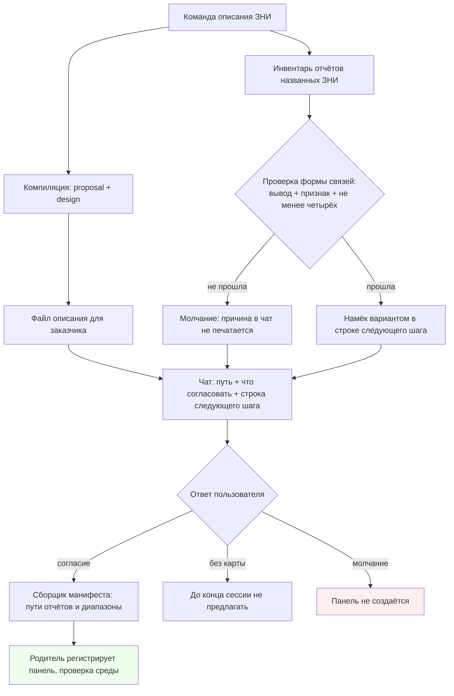

# Architecture: предложение схемы механизма после описания ЗНИ

## Task

Вариант A закрывает Why и не отменяет ни одного инварианта ADR-0008 — **при условии трёх правок `design.md`**: в текущем виде предикат намёка сформулирован без топологического признака (молчаливое ослабление архивного контракта предложения), новый слот решения назван «уже существующей строкой», хотя в чате описания такой строки сегодня нет, и `## Blast Radius` не покрывает два требования, которые дельта фактически переписывает (`Hint only on an existing decision line`, `Map outside walkthrough uses named source`). Класс дельты `extends` верен после правок; без правки первой формулировки дельта читается как частичный `revokes` по умолчанию.

Проверка охватывает: постановку и design ЗНИ `overview-map-offer`, архивный spec `2026-08-28-scenario-map-canvas`, главный spec `scenario-map-canvas`, ADR-0008 (Load-Bearing), контракты скиллов описания ЗНИ и карты сценария, `opsx-output-style.md` §5.6.

## Complexity

**Medium.** Kit-only: четыре текстовых артефакта (скилл описания, скилл карты, макет чата, дельта требований). Нет `.bsl`, нет `src/`, нет объектов метаданных. Сложность не в объёме, а в стыке с Load-Bearing ADR и закрытым перечислением слотов в архивном требовании.

## Chosen Approach

**Approach:** Pragmatic balance — вариант A из `## Implementation Options` принимается, но слот намёка легализуется как **безусловный элемент контракта чата описания**, а не как «строка, которая появляется, когда есть что предложить».

**Rationale:**

- Архивное требование `Hint only on an existing decision line` держится на предикате «строка решения уже есть в этом сообщении» (`openspec/changes/archive/2026-08-28-scenario-map-canvas/specs/scenario-map-canvas/spec.md:217`). Если строка появляется вместе с намёком, предикат вырождается: намёк сам порождает свой слот, то есть становится отдельным вопросом другими словами. Это прямая отмена инварианта ADR-0008 «намёк на существующей строке — только вариант, не сборка».
- Если же строка следующего шага вводится в макет чата описания **независимо от карты** (и печатается, когда карты нет вообще), предикат остаётся истинным: карта занимает уже существующий слот. Именно это написано в `design.md` Decision 1 — но написано как обоснование, а не как отдельная точка правки макета чата, и в Blast Radius не отражено.
- Такой порядок сохраняет и второй смысл требования: «ровно одно действие» в сообщении. Слот один, второго вопроса нет.

**Trade-offs:** макет `T-OVERVIEW` (`.cursor/docs/opsx-output-style.md:541`) сейчас описан как ровно два пункта чата (путь + «Что согласовать»); появление третьего элемента расширяет тонкий чат описания на одну строку. Это цена легальности слота, и она меньше, чем цена отдельного вопроса про карту.

**Отвергнутые альтернативы** — см. `## Simplicity Check`.

## Simplicity Check

- **Viable alternatives:**
  1. **A (design, принят с правками)** — постоянная строка следующего шага в чате описания; намёк — вариант в ней; согласие вызывает сборщика с отчётами ЗНИ. Файлы: скилл описания, скилл карты, §5.6, дельта.
  2. **A′ — намёк пунктом внутри блока «Что согласовать»** — нового слота не вводим вообще. Отклонён: блок «Что согласовать» по контракту скилла (`.cursor/skills/openspec-overview/SKILL.md:129`) — 3–5 пунктов **из финала документа**, то есть предметные решения для заказчика. Пункт «показать схему механизма» — не предмет согласования с ФА, а действие инструмента; он ломает жанр блока и попадает в тот же overview-документ при следующей компиляции.
  3. **A″ — намёк на входе, в брифе B1 описания** — слот решения там уже есть («Подтвердить?»). Отклонён: на входе отчёты ещё не инвентаризованы и проверка связей не прогонялась, поэтому намёк был бы общим вопросом «хотите карту?», что архивное требование запрещает явно (`spec.md:163`).
  4. **B / C / D из `design.md`** — отдельный вопрос / схема внутри файла описания / автосборка. Отклонены в design корректно; отдельно подтверждаю: D отменяет инвариант ADR-0008 напрямую, C делает картой список этапов, B вводит второй вопрос.
- **Selected simplest viable design:** A с явной легализацией слота. Минимален по числу точек правки: одна строка макета чата, одна ветка в скилле описания, два уточнения в скилле карты, одна дельта требований. Новых механизмов, новых команд, новых ролей — нет.
- **Why not simpler:** без слота (A′) намёк не имеет легального места и требование `Hint only on an existing decision line` перестаёт выполняться; без правки скилла карты согласие в описании упирается в отказ «укажите отчёт» (`spec.md:241`), то есть намёк оказывается бесполезным.
- **Complexity budget:**
  - Files touched: **4** (скилл описания, скилл карты, `opsx-output-style.md` §5.6, дельта `specs/scenario-map-canvas/spec.md`).
  - Hooks/intercepts: **1** (слот строки следующего шага в чате описания).
  - New procedures/functions: **0** (новых ролей и команд нет; сборщик вызывается существующим путём).
  - Conditional branches / feature flags: **2** (инвентарь есть / нет; отказ «без карты» в этой сессии).

## Found Patterns

### Pattern 1: Намёк только на уже существующей строке решения

- **Where:** `openspec/changes/archive/2026-08-28-scenario-map-canvas/specs/scenario-map-canvas/spec.md:217`; то же в главном spec `openspec/specs/scenario-map-canvas/spec.md:219`.
- **Usage:** закрытый перечень слотов — «Дальше» исследования, подтверждение списка точек разбора, «Следующий шаг» на выходе разбора. Отдельный вопрос и вторая команда запрещены. Отдельно запрещено: «Строка "Следующий шаг" в том же финале (команда создать ЗНИ) MUST NOT быть слотом предложения карты».
- **Evidence:** тот же файл, сценарии `Нет предложения в финале исследования с постановкой` (`spec.md:234`).
- **Confidence:** high.
- **Applicability:** дельта обязана быть **MODIFIED** этого требования: добавить четвёртый слот (строка следующего шага чата описания) и **сохранить** запрет на слот финала постановки ЗНИ в исследовании. Иначе главный spec получит два взаимно противоречивых абзаца.

### Pattern 2: Источник вне разбора — только названный, кроме двух исключений

- **Where:** `spec.md:241` (архив), `openspec/specs/scenario-map-canvas/spec.md:243`.
- **Usage:** вне разбора карта строится из журнала или указанного пользователем отчёта; исключения — (1) принятое предложение (источник тот, на котором прошла проверка), (2) прямая просьба в активной сессии исследования.
- **Evidence:** `.cursor/skills/scenario-map-canvas/SKILL.md:40` — тот же порядок в скилле.
- **Confidence:** high.
- **Applicability:** `design.md` Behavior Contract 4 вводит **третье** исключение — прямая просьба в активной сессии описания при уже собранном инвентаре. Это MODIFIED, а не ADDED, и в Blast Radius его нет.

### Pattern 3: Предложение считается по форме связей — конъюнкция трёх условий

- **Where:** `spec.md:163` (архив), ADR-0008 решение 5 и Protects-invariants (`openspec/adrs/ADR-0008-scenario-map-native-parent-registration.md:14`, `:28`).
- **Usage:** предложение допустимо только если **(а)** можно назвать конкретный вывод, которого нет в списке, **(б)** есть хотя бы один топологический признак (слои / ветвление со схождением / жизненный цикл / петля или повторное использование устаревшего результата / одно порождает несколько представлений / разные технические пути), **(в)** на выходе разбора и в «Дальше» исследования — ≥4 публикуемых сущностей после обоих отсевов.
- **Evidence:** `.cursor/skills/scenario-map-canvas/SKILL.md:129–139` — та же тройка как «единственный контракт предложения».
- **Confidence:** high.
- **Applicability:** `design.md` BC-2 и Decision 3 перечисляют только (а) и (в). Признак (б) выпал — см. F1.

### Pattern 4: Родитель регистрирует панель, картограф файл не пишет

- **Where:** ADR-0008 решение 1–2; `.cursor/skills/scenario-map-canvas/SKILL.md:45–47`.
- **Usage:** каталог панелей резолвит родительский агент сессии; гейт — чистая проверка панели; путь файла в чат штатно не печатается.
- **Confidence:** high.
- **Applicability:** дельта этого не трогает. `design.md` Assumptions 1–2 фиксируют это верно; Blast Radius строка «Панель без просьбы и без согласия» корректна.

### Pattern 5: Контракт чата описания сегодня — ровно два элемента

- **Where:** `.cursor/docs/opsx-output-style.md:541`; `.cursor/skills/openspec-overview/SKILL.md:129`.
- **Usage:** путь к файлу + блок «Что согласовать» (3–5 пунктов). Строки следующего шага нет.
- **Confidence:** high.
- **Applicability:** это и есть точка F2: слот придётся создать, и создать его надо в макете, а не в ветке карты.

### Pattern 6: Скилл описания запрещает Task к 1С-агентам и чтение отчётов как основы сюжета

- **Where:** `.cursor/skills/openspec-overview/SKILL.md:98` («Не читать как основу сюжета: `tasks.md`, `reports/verification-*`…»), `:137` («Не вызывать `Task` к 1С-агентам из этой команды»).
- **Confidence:** high.
- **Applicability:** обе строки коллидируют с новой веткой. Картограф `onec-scenario-map-designer` по диспетчеру делегирования — не 1С-роль, но по имени попадает под формулировку запрета; инвентарь читает `reports/**`, что формально соседствует с запретом чтения отчётов. Обе коллизии снимаются одной правкой каждая, но в `## Migration Plan` они не названы — см. F4, F5.

## Existing Mechanisms

1. **Скилл описания ЗНИ** — компиляция `proposal` + `design` в связный текст; отчёты в сюжет файла не входят; сборщик карты не вызывается.
2. **Макет чата описания (§5.6)** — путь к файлу и блок согласования; слота решения нет.
3. **Скилл карты сценария** — молчание по умолчанию, намёк вариантом на существующей строке, проверка формы связей, три разрешённых источника.
4. **Сборщик манифеста** — принимает путь источника и диапазоны доказательств; файл панели не пишет.
5. **ADR-0008** — регистрация родителем, граф не список, нет отдельной команды карты.

**Почему не оставляем как есть:** описание ЗНИ — момент, когда согласующий принимает решение по плану, и к этому моменту связи механизма уже могут быть доказаны отчётами этой же ЗНИ. Новый механизм не вводится: расширяются два входа существующего — «когда предлагать» и «какой источник».

## Findings — что править в `design.md`

Пронумерованный список правок по секциям. Пересказ файла не приводится; каждая правка формулируется как замена или добавление.

### F1 — Предикат намёка без топологического признака (блокирующая правка; риск скрытого `revokes`)

**Где:** `## Behavior Contract` п. 2; `## Decisions` п. 3.

**Что не так:** оба места задают условие намёка как «≥4 связанных сущностей после отсева **и** можно назвать вывод, которого нет в списке этапов». Архивное требование — конъюнкция **трёх** условий, третье это топологический признак формы связей. Формулировка «проверка связей та же, что у исследования на выходе» отсылает к полному предикату, но перечисление рядом с отсылкой сильнее отсылки: автор дельты скопирует перечисление. Результат — предложение станет возможным на плоском связном наборе без формы, что прямо противоречит инварианту ADR-0008 «Предложение схемы считается по форме связей, не по теме механизма и не по числу шагов».

**Правка:** в BC-2 и D-3 назвать признак третьим условием явно, тем же перечнем, что в архивном требовании, и добавить фразу «признак определяется по форме связей в отчётах, не по теме ЗНИ и не по числу этапов поставки».

### F2 — Слот намёка назван «существующей строкой», хотя строки нет (блокирующая правка)

**Где:** `## Behavior Contract` п. 1; `## Decisions` п. 1; `## Migration Plan` п. 1; `## Blast Radius`.

**Что не так:** `## Existing Mechanisms` п. 2 сам констатирует, что строки следующего шага в чате описания сейчас нет. Пока строка появляется вместе с намёком, требование «намёк — вариант в уже существующей строке» не выполняется: намёк порождает собственный слот. Отдельно: архивное требование содержит явный запрет считать слотом карты строку «Следующий шаг» в финале с постановкой ЗНИ — дельта обязана показать, что речь о другом слоте другой команды, иначе два абзаца главного spec будут противоречить друг другу.

**Правка:**

1. BC-1 переформулировать так, чтобы строка следующего шага была **безусловным** элементом чата описания: печатается всегда, включая прогоны, где карта не рассматривалась вовсе; содержимое по умолчанию — одно действие описания.
2. Migration Plan п. 1 назвать конкретный артефакт: `.cursor/docs/opsx-output-style.md` §5.6 (`T-OVERVIEW`) — третий элемент тонкого чата; и `.cursor/skills/openspec-overview/SKILL.md` шаг «Write + чат» плюс Self-check п. 5, где чат сейчас описан как «путь + согласовать».
3. В `## Blast Radius` добавить строку: контракт «намёк только в трёх перечисленных строках решения; финал с постановкой ЗНИ слотом не является» → класс `extends` → эффект «в чате описания появляется постоянная строка следующего шага; запрет на слот финала постановки сохраняется» → альтернатива «намёк пунктом блока согласования» → обоснование.

### F3 — Третье исключение для источника не отражено в Blast Radius (блокирующая правка)

**Где:** `## Behavior Contract` п. 4 (последнее предложение); `## Blast Radius`.

**Что не так:** BC-4 разрешает прямой просьбе «покажи карту сценария» в сессии описания брать уже собранный инвентарь. Архивное требование `Map outside walkthrough uses named source` перечисляет ровно два исключения из отказа «укажите отчёт», и сессии описания среди них нет; сессия описания — «вне разбора». Строка Blast Radius про источник покрывает только **согласие на намёк**, но не прямую просьбу.

**Правка:** добавить в таблицу отдельную строку для прямой просьбы в сессии описания (класс `extends`, альтернатива — «требовать путь отчёта даже при готовом инвентаре», обоснование — инвентарь уже прошёл ту же проверку) и указать в Migration Plan п. 3, что дельта переписывает это требование как MODIFIED с третьим исключением, а не добавляет новое требование рядом.

### F4 — Коллизия с запретом делегирования в скилле описания

**Где:** `## Migration Plan` п. 2.

**Что не так:** `.cursor/skills/openspec-overview/SKILL.md:137` содержит «Не вызывать `Task` к 1С-агентам из этой команды». Роль сборщика манифеста по диспетчеру делегирования 1С-ролью не является, но её имя начинается тем же префиксом, и исполнитель прочитает запрет буквально. Ветка согласия без снятия коллизии не исполнима.

**Правка:** в Migration Plan п. 2 добавить пункт: уточнить guardrail скилла описания — сборщик манифеста карты выведен из-под запрета явно; обследование кода и правки `.bsl` из команды описания по-прежнему запрещены.

### F5 — Чтение отчётов и жанр файла описания

**Где:** `## Migration Plan` п. 2; `## Behavior Contract` п. 3.

**Что не так:** в скилле описания секция источников запрещает читать `tasks.md` и отчёты проверки постановки **как основу сюжета**. Новая ветка читает `reports/**` — для инвентаря, не для сюжета. Разделение проговорено в BC-3 по смыслу, но точка правки скилла не названа, и правка легко превратится в снятие запрета целиком.

**Правка:** в Migration Plan п. 2 назвать секцию «Источники (только Read)» скилла описания и потребовать формулировку с двумя ветками: сюжет файла — `proposal` и `design`; инвентарь карты — отчёты разбора, журналы пошагового прохода, архитектурные отчёты по теме; `tasks.md` и отчёты проверки постановки не входят ни в одну ветку.

### F6 — Архивные ЗНИ как источник инвентаря

**Где:** `## Decisions` п. 2.

**Что не так:** команда описания резолвит и активные, и архивные ЗНИ (`.cursor/skills/openspec-overview/SKILL.md:66–70`), причём архивная ЗНИ — типовой вход для согласования уже сделанного. Формулировка «каталоги названных ЗНИ, папка отчётов» архив не исключает, но и не называет; на архивной ЗНИ поведение окажется неопределённым.

**Правка:** в D-2 добавить, что каталог архивной ЗНИ равноправен активному, путь резолвится тем же способом, что и в самой команде описания.

### F7 — Зависимость от мультиисточника соседней ЗНИ

**Где:** `## Decisions` п. 2 и п. 5.

**Что не так:** «Несколько файлов — все пути в сборщика, **если роль уже принимает несколько**» описывает будущее состояние, которое приносит соседняя открытая ЗНИ. Сегодня контракт вызова — путь источника и диапазоны. Формулировка «если уже принимает» превращает поведение в неопределённое на момент приёмки.

**Правка:** зафиксировать дефолт на сегодня — **один** отчёт, на котором прошла проверка (предпочтение: журнал прохода, затем разбор), а мультиисточник назвать поведением, которое включится само после поставки соседней ЗНИ, без правок в этой. Независимость срезa от соседней ЗНИ этим сохраняется.

## Ответы на вопросы постановки

**1. Вариант A и Why.** Закрывает. Why говорит: согласующий видит этапы поставки и не видит ловушку, ради которой изменение затеяли, хотя отчёты со связями уже лежат. A даёт ровно это: инвентарь тех же отчётов, та же проверка, намёк с конкретным «что станет видно», панель только по согласию. ADR-0008 не ломается ни в одном из шести Protects-invariants — при условии F1 (иначе ломается «предложение по форме связей») и F2 (иначе ломается «намёк на существующей строке — только вариант»).

**2. Достаточность Blast Radius.** Недостаточна: покрыты пять контрактов, не покрыты три — предикат предложения (F1: в подвале таблицы стоит «не ослабляется», но самой строки нет, а текст BC-2 ослабление и вносит), слот решения в команде, где строки решения не было (F2), прямая просьба в сессии описания (F3). Скрытого `revokes` по четырём проверяемым осям **нет**: автосборки нет (согласие обязательно), этапы как узлы запрещены явно, порог четырёх и запрет выдуманных рёбер сохранены, отдельная команда не вводится. Единственное фактическое ослабление — F1, и оно устраняется формулировкой, а не пересмотром решения.

**3. Срез.** Один срез вертикален и корректен. Пользовательский сценарий доходит до наблюдаемого результата (панель из отчётов), Primary достижим задачами этого же среза — все четыре артефакта внутри среза, внешних зависимостей нет. Foundation-slice отсутствует; отказ от среза «только строка в чате» обоснован верно: намёк без согласия и отказа отдельной приёмки не имеет. Замечания: (а) колонка «Scenarios из spec» ссылается на сценарии, которых пока нет — каталог `specs/` в ЗНИ не создан, и до его появления проверка готовности задач не пройдёт; (б) пункт «Нет отдельной команды карты» помечен как задача сверки — это регрессионная проверка, а не покрытие сценария, и так его и следует назвать, требование при этом в дельте не трогать.

**4. Правки design.** F1–F7 выше. Блокирующие до записи дельты — F1, F2, F3. F4–F5 блокируют исполнимость реализации. F6–F7 снимают неопределённость приёмки.

## Architecture

Ключевое в схеме: ветка инвентаря (E → F → H) присоединяется к строке чата, но **не** пересекается с веткой компиляции файла (B → C). Файл описания остаётся текстом для заказчика и источником узлов не становится.

## Implementation Phases

Один срез, четыре последовательные фазы. Фазы не являются срезами и отдельной приёмки не имеют.

### Phase 1: Слот решения в чате описания

- [ ] Ввести строку следующего шага как безусловный элемент чата описания.
  - Files: `.cursor/docs/opsx-output-style.md` (§5.6), `.cursor/skills/openspec-overview/SKILL.md` (шаг «Write + чат», Self-check п. 5).
  - Criteria: прогон описания на ЗНИ **без** отчётов печатает три элемента — путь, блок согласования, одну строку следующего шага; второго вопроса нет; лимит тонкого чата не превышен.
  - Dependencies: нет.

### Phase 2: Инвентарь отчётов и проверка формы связей

- [ ] Добавить в скилл описания ветку инвентаря после записи файла: сбор отчётов названных ЗНИ (активных и архивных), отсев без доказательства и без связи, проверка трёх условий предложения.
  - Files: `.cursor/skills/openspec-overview/SKILL.md` (секции «Источники (только Read)», «Write + чат», Guardrails).
  - Criteria: секция источников разделена на сюжет файла и инвентарь карты; guardrail делегирования не запрещает вызов сборщика манифеста; при непройденной проверке в чат не уходит ни строки о причине.
  - Dependencies: Phase 1.

### Phase 3: Сессия описания в правилах карты

- [ ] Внести сессию описания в скилл карты: как место намёка, как источник при согласии и как третье исключение отказа «укажите отчёт» для прямой просьбы при готовом инвентаре.
  - Files: `.cursor/skills/scenario-map-canvas/SKILL.md` (секции «Порядок действий по просьбе» п. 1, «Молчание и пороги», «Проверка топологии и вывода», «Источник узлов»).
  - Criteria: согласие строит панель тем же порогом, той же раскладкой и теми же подписями, что прямая просьба; повторного подтверждения нет; команда сессии не меняется; запрет публиковать этапы поставки как цепочку узлов записан явно.
  - Dependencies: Phase 2.

### Phase 4: Дельта требований

- [ ] Записать `openspec/changes/overview-map-offer/specs/scenario-map-canvas/spec.md`.
  - Files: дельта capability `scenario-map-canvas`.
  - Criteria: `Hint only on an existing decision line` и `Map outside walkthrough uses named source` идут блоками **MODIFIED** (не ADDED), сохраняя запрет на слот финала постановки ЗНИ и оба прежних исключения; предикат предложения воспроизводит все три условия; требования `No dedicated map command`, `Node contract…`, `Causal map has layers or branches` не трогаются; каждый сценарий из таблицы покрытия в `design.md` имеет блок в дельте.
  - Dependencies: Phase 3.

## Test Scenarios

### Scenario 1: Описание ЗНИ с отчётами предлагает схему

- **Actor:** разработчик.
- **Action:** вызывает описание ЗНИ, у которой в каталоге отчётов лежит разбор со связями и доказательствами и видна форма связей.
- **Expected Result:** в чате путь к файлу, блок согласования и строка следующего шага с вариантом схемы и конкретным «что станет видно»; панель не создана.

### Scenario 2: Намёк без ответа панель не создаёт

- **Actor:** разработчик.
- **Action:** видит намёк и ничего не отвечает, сессия завершается.
- **Expected Result:** панели нет; повторного вопроса нет.

### Scenario 3: Согласие строит панель из отчётов, не из этапов

- **Actor:** разработчик.
- **Action:** отвечает согласием на намёк.
- **Expected Result:** панель открывается штатной кнопкой среды; узлы и связи взяты из отчётов разбора; ни один узел не соответствует этапу поставки из файла описания; шапка отвечает на вопрос «зачем меняем».

### Scenario 4: Описание ЗНИ без отчётов молчит

- **Actor:** разработчик.
- **Action:** вызывает описание ЗНИ, где есть только постановка и решения.
- **Expected Result:** строка следующего шага напечатана, варианта схемы в ней нет; строки о причине отсутствия предложения нет.

### Scenario 5: Плоский связный набор без формы связей не даёт намёка

- **Actor:** разработчик.
- **Action:** вызывает описание ЗНИ, где отчёты дают четыре и более доказанных связанных сущностей, но ни слоёв, ни ветвления, ни жизненного цикла, ни петли.
- **Expected Result:** намёка нет (проверка формы связей F1); прямая просьба в этой же сессии панель строит — цепочкой с подписями следования.

### Scenario 6: Отказ не повторяется

- **Actor:** разработчик.
- **Action:** отвечает «без карты», затем продолжает сессию описания (вторая ЗНИ, перекомпиляция).
- **Expected Result:** намёк до конца сессии не повторяется; строка следующего шага остаётся, но без варианта схемы.

### Scenario 7: Прямая просьба в сессии описания

- **Actor:** разработчик.
- **Action:** после описания просит показать карту сценария, путь к отчёту не называет; инвентарь уже собран.
- **Expected Result:** панель строится из инвентаря; отказа «укажите отчёт» нет. Если инвентарь пуст — одна строка отказа с указанием, что карта строится из журнала или указанного отчёта.

### Scenario 8: Отдельной команды карты не появилось

- **Actor:** автор кита.
- **Action:** смотрит список команд.
- **Expected Result:** команды карты нет; описание ЗНИ прерывать не требуется.

## Assumptions

1. **Строка следующего шага помещается в лимит тонкого чата описания.** Confidence: high. Verification: прогон описания на ЗНИ без отчётов — три элемента, не больше.
2. **Сборщик манифеста доступен из сессии описания после снятия коллизии guardrail.** Confidence: medium. Verification: живой прогон согласия; при отказе — текстового резерва в описании нет (журнала разбора нет), поэтому исход «публиковать нельзя» отдаёт одну строку.
3. **Отчёты разбора в каталоге ЗНИ содержат доказательства в виде путей и диапазонов.** Confidence: medium. Verification: инвентарь на реальной ЗНИ; отчёт без диапазонов даёт узлы без доказательства и отсеивается.
4. **Таксономия базы знаний в kit не заведена.** Confidence: high — файла индекса нет, Discovery пуст; опора на ADR-0008 и архивный spec.
5. **Приёмка ручная.** Confidence: high — автотестов панелей в kit нет.

## Open Questions

1. **Где искать отчёты, кроме каталога ЗНИ.** Из `design.md`. По умолчанию — каталог ЗНИ (активный или архивный) и явно названный в сессии путь. Addressed to: User. Blocker: **No**.
2. **Что делать при расхождении отчётов двух ЗНИ в одном описании.** `design.md` Risks п. 5 запрещает дорисовывать ребро, но не говорит, публиковать ли панель по одной ЗНИ или молчать. Предложение: публиковать по тому источнику, на котором прошла проверка, расхождение на полотно не выносить. Addressed to: User. Blocker: **No** (решается формулировкой в D-2).

## Knowledge conflicts

Не выявлено: `## Existing Knowledge` пуст, таксономия в kit отсутствует.

## KB references

Секция `## Existing Knowledge` во входном промпте присутствует и пуста (Discovery без совпадений) — ссылок нет.

## Next Steps

1. Внести F1–F3 в `design.md` (блокирующие: предикат, слот, источник прямой просьбы; плюс три строки Blast Radius).
2. Внести F4–F7 (Migration Plan: guardrail делегирования, секция источников скилла описания; Decisions: архивные каталоги, дефолт одного отчёта).
3. Записать дельту требований в `specs/scenario-map-canvas/spec.md` блоками MODIFIED по Phase 4.
4. Собрать `tasks.md` по срезу S1 и фазам 1–4.
5. Проверку постановки запускать после шагов 1–4.
