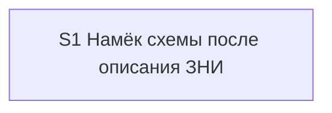

# Quality Control — overview-map-offer

Date: 2026-08-29  
Report: `quality-control-2026-08-29-2.md`  
Mode: **slice** (`tasks.md` содержит `# Срез S1`)  
Scope: критерии 1–6, 8, 8b, 9–11 из `.cursor/rules/vertical-slices.mdc` QUALITY CONTROLLER — SLICE COHERENCE; читаемость задач по `.cursor/rules/task-readability.mdc`  
Out of scope: исполнимость приёмки «прямо сейчас» на живой сессии / ИБ; тестовые данные; эталоны ИБ; качество кода и выбор варианта реализации  

Context: kit-only change (скилл описания ЗНИ, макет чата описания, скилл карты, команда описания, дельта spec). Продуктовый `src/**` / `.bsl` не требуется. `form_mode: n/a`. `**Режим apply:** mechanical`. `debug.md` отсутствует; срезов с `[x]` нет; все задачи `[ ]`. Маркеров ручной конфигурации нет. Mechanical DENY (verify 2.1a / 7A–7E): совпадений нет.

Sources: `proposal.md`, `design.md` (`## Slices`), `tasks.md`, `specs/scenario-map-canvas/spec.md` (36 `#### Scenario:`). Предыдущий отчёт `quality-control-2026-08-29.md` (proposed-slice, `tasks.md` ещё не было) **не** перезаписывался; этот прогон — по уже сгенерированному плану задач.

## Verdict

`OK`

Один срез, вертикальный и самодостаточный. Обязательная приёмка — наблюдаемый прогон описания ЗНИ (намёк в чате без панели, согласие открывает панель из отчётов). Восемь новых сценариев описания закрыты Primary и optional-буллетами. Двадцать восемь унаследованных сценариев блоков MODIFIED закрыты задачей сверки текста скилла карты. Прежние пропуски покрытия из отчёта создания ЗНИ закрыты.

## Slice Summary

| Slice | Scenario | Tasks | Acceptance | Dependencies | Gate |
|---|---|---|---|---|---|
| S1: Намёк схемы после описания ЗНИ | Разработчик вызывает описание ЗНИ с отчётами разбора, видит в строке следующего шага, что станет видно на схеме, соглашается — открывается панель из отчётов, не из этапов поставки | 13 рабочих (`S1.1`–`S1.13`) + `S1.accept`; все `[ ]` | `S1.accept` (8/8 новых в теле: 1 mandatory Primary, закрывающий 3 имени, + 5 optional; 28 унаследованных — в `S1.12`, не в теле accept) | нет | `<!-- slice-gate -->` есть |

Notes:

- Порог: Standard (13 рабочих задач). По `vertical-slices.mdc` § ТРИГГЕРЫ — **1 срез по умолчанию**. Второй срез «строка в чате» без панели в `design.md` `## Slices` отвергнут: подготовка без самостоятельной приёмки.
- `form_mode: n/a`. Продуктовый BSL / Form.xml / Template.xml не требуется и в задачах нет.
- Группы `## 1.`–`## 5.` внутри среза — не отдельные срезы.
- Имя «Нет отдельной команды карты» — не `#### Scenario:` дельты; закрыто `S1.13` как регресс главного spec. В покрытие 36 сценариев дельты не входит.

## Scenario Coverage

36 `#### Scenario:` в `openspec/changes/overview-map-offer/specs/scenario-map-canvas/spec.md`. Других `specs/**/spec.md` в change нет.

Классификация: **8 новых** (описание ЗНИ / источник после описания) и **28 унаследованных** (полный текст MODIFIED-требований). Покрытие только в `S<N>.<M>` для унаследованных — OK (критерий 5b).

### Новые Scenario дельты (8)

| Scenario | Covered by | Status |
|---|---|---|
| Описание предлагает схему при топологии в отчётах | `S1.accept` Primary; также `S1.5`, `S1.9` | OK |
| Намёк описания не рисует панель | `S1.accept` Primary; также `S1.6`, `S1.10` | OK |
| Согласие на намёк описания рисует карту из отчётов | `S1.accept` Primary; также `S1.6` | OK |
| Описание без отчётов схему не предлагает | `S1.accept` optional; также `S1.5` | OK |
| Плоский набор без формы связей в описании не даёт намёка | `S1.accept` optional; также `S1.5`, `S1.9` | OK — закрыт пропуск из `quality-control-2026-08-29.md` |
| Отказ без карты в описании не повторяется | `S1.accept` optional; также `S1.6` | OK |
| Прямая просьба в описании берёт инвентарь отчётов | `S1.accept` optional; также `S1.8` | OK |
| Этапы поставки не становятся картой | `S1.accept` optional; также `S1.8`; Then Primary упоминает «узлы не повторяют этапы» | OK |

Три имени в одном mandatory Primary — шаги одного пути (намёк → панели нет → согласие → панель), не три обязательных journey.

### Унаследованные Scenario блоков MODIFIED (28)

Закрыты одной агентской задачей `S1.12` (сверка по тексту скилла карты и дельты spec; явная оговорка: все Scenario пяти требований из `**Связь со spec:**`, кроме восьми новых). Покрытие только в `S<N>.<M>` — OK.

| Scenario | Covered by | Status |
|---|---|---|
| Молчание по умолчанию | `S1.12` | OK |
| Намёк не рисует панель | `S1.12` | OK |
| Системный MUST canvas не действует на opsx | `S1.12` | OK |
| Прямая просьба рисует карту | `S1.12` | OK |
| Карта во время прохода из уже пройденных точек | `S1.12` | OK |
| Прямая просьба после выхода разбора | `S1.12` | OK |
| Просьба при числе сущностей ниже порога | `S1.12` | OK |
| Первая просьба в проекте без открытой панели | `S1.12` | OK |
| Панель открывается штатной кнопкой среды | `S1.12` | OK |
| С узла открывается доказательство, новый чат с панели не запускается | `S1.12` | OK |
| Порядок прохода не выдаётся за причинность | `S1.12` | OK |
| Просьба при линейной цепочке | `S1.12` | OK |
| Согласие на предложение рисует карту | `S1.12` | OK |
| Согласие до первой карточки разбора запоминает фокус | `S1.12` | OK |
| Отложенное согласие публикует карту без повторного вопроса | `S1.12` | OK |
| Согласие было, порог до выхода не набрался | `S1.12` | OK |
| Согласие при неподтвердившейся топологии даёт цепочку | `S1.12` | OK |
| Исследование предлагает схему при топологии без замеров | `S1.12` | OK |
| Разбор предлагает схему на подтверждении списка без порога публикации | `S1.12` | OK |
| Разбор предлагает схему на выходе без замеров времени | `S1.12` | OK |
| На линейных двух шагах схему не предлагают | `S1.12` | OK |
| Предложение не зависит от темы механизма | `S1.12` | OK |
| Намёк на выходе разбора при топологии | `S1.12` | OK |
| Нет намёка, если уже вопрос анализа | `S1.12` | OK |
| Исследование не предлагает карту и разбор сразу | `S1.12` | OK |
| Нет предложения в финале исследования с постановкой | `S1.12` | OK |
| Вне разбора без источника — отказ | `S1.12` | OK |
| Просьба в исследовании берёт текущий отчёт | `S1.12` | OK |

Регресс «Нет отдельной команды карты» (не Scenario дельты) — `S1.13`.

`**Связь со spec:**` перечисляет все 36 имён пяти требований буквально. Тело `S1.accept` намеренно содержит только восемь новых: унаследованные не раздувают пользовательский чеклист.

## Dependency Graph

- Cycles: none.
- Forward acceptance dependencies: none (единственный срез).
- Undeclared predecessors: none (`**Зависимости:** нет`).
- Intra-slice: макет чата (`S1.1`, `S1.2`, `S1.11`) → инвентарь и условия намёка в скилле описания (`S1.3`–`S1.7`) → сессия описания в скилле карты (`S1.8`–`S1.10`) → сверка регрессов (`S1.12`, `S1.13`) → `S1.accept`. Цикла нет. Соседняя ЗНИ `scenario-map-readability-meaning` в граф не входит (Decision 5).

## Checklist Results

| # | Criterion | Result |
|---|---|---|
| 1 | Scenario Coverage | **Pass** — 8/8 новых в Primary / optional / рабочих задачах; 28/28 унаследованных в `S1.12` (agent static «сверить по тексту»). User runtime только на границе `S1.accept` |
| 2 | Slice Independence | **Pass** — принимать S1 можно без несуществующего S2+ |
| 3 | Slice Completeness | **Pass** — слои kit для Primary на месте: макет чата описания (`S1.1`, контракт в `S1.2`/`S1.11`), инвентарь отчётов и три условия (`S1.3`–`S1.5`), согласие → сборщик и Guardrails (`S1.6`–`S1.7`), скилл карты (источник, слот, исключение «укажите отчёт») (`S1.8`–`S1.10`). Сборщик манифеста — существующий механизм, новый файл не требуется. Метаданных/форм 1С нет и не требуется. Дельта spec уже есть; `S1.12` сверяет скилл с ней |
| 4 | Slice Dependency Graph | **Pass** — S1 → нет |
| 5 | Slice Gate Integrity | **Pass** — ровно один `S1.accept`, ровно один `<!-- slice-gate -->`. Legacy `S1.T<M>` нет |
| 5b | Acceptance Checklist Coverage | **Pass** — `**Primary acceptance:**` в metadata есть и совпадает с `**Primary (обязательно):**` в теле accept. Mandatory sub-bullet есть (`accept-checklist-empty` не срабатывает). Все 36 Scenario покрыты (новые — accept, унаследованные — `S1.12`). `accept-bullet-foreign-scenario` N/A (один срез). `accept-bullets-missing-scenario` не эмитирован: «Плоский набор…» есть в optional; унаследованные есть в `S1.12` |
| 6 | Rework Risk | **Pass** — один срез снимает риск «принята строка чата без панели». Соседняя ЗНИ про читаемость в зависимости не стоит. `S1.12` перед accept ловит ослабление унаследованных слотов при правке скилла карты |
| 8 | Slice Verticality | **Pass** — mandatory Primary: вызвать описание ЗНИ с отчётами → в чате вариант схемы с «что станет видно», панели нет → согласие → панель из отчётов. Black-box (чат описания + панель рядом с чатом), не вызов API / код-ревью контракта. Сверка скилла вынесена в `S1.12`/`S1.13`, не в Primary |
| 8b | Self-Achievable Acceptance | **Pass** — нет пары S1/S2. Наблюдаемый исход не заимствован у более позднего среза. Включающие слои Primary (слот чата, инвентарь, три условия, согласие → сборщик, исключение источника) — задачи `S1.1`–`S1.11` того же среза. Наличие конкретной ЗНИ с отчётами на стенде — transient, вне scope |
| 9 | Foundation slice with gate | **Pass** — нет S_k с programmatic accept и зависимого S_k+1. Черновик «срез только строка в чате» отвергнут в `## Slices` |
| 10 | Acceptance Simplicity | **Pass** — ровно один mandatory black-box journey. Optional помечены «(опционально)». «Описание без отчётов…» в теле accept — optional (риск overload из прошлого отчёта не реализован). Три имени в скобках Primary — один Then |
| 11 | User Task Contract | **Pass** — DENY-grep по строкам `^- \[[ x]\] S\d+\.\d+`: нет `тестовой ИБ`, `на стенде`, `runtime-verify`, `спайк`, `в консоли`, `отладчик`, `эмулировать вызов`, `вызвать API`, `При успешном verify S`, `после стенда`. Семантика: `S1.1`–`S1.13` — правки markdown и сверка по тексту (агент). Живой прогон описания — только в `S1.accept` |

### Task readability

| Задачи | Result |
|---|---|
| `S1.1`–`S1.11` | **Pass** — глагол + файл/секция + что меняем + зачем + опорная ссылка (Decision / Behavior Contract / Scenario / F-пункты) |
| `S1.12`, `S1.13` | **Pass** — «Сверить по тексту» + файлы + контракт, который нельзя ослабить; не голый идентификатор решения. Длина > 8 слов |
| `S1.accept` | **Pass** — заголовок с бизнес-результатом среза; тело: Primary + optional с буквальными именами Scenario в ёлочках. Правило «одна строка на каждый Scenario из Связь» для унаследованных выполнено через `S1.12` (исключение покрытия в `S<N>.<M>`, критерий 5b), не через 28 optional-буллетов |

Алерты `task-opaque-title`, `task-too-short`, `task-opaque-acceptance` не эмитированы.

## Alerts

Нет.

**Не эмитировано:** `no-slices`; `deprecated-phase-gate`; `legacy-acceptance-format`; `primary-acceptance-missing`; `accept-checklist-empty`; `accept-bullets-missing-scenario`; `accept-bullet-foreign-scenario`; `slice-not-vertical`; `slice-accept-not-self-achievable`; `slice-foundation-with-gate`; `acceptance-simplicity-overload`; `user-task-contract-violation`.

Закрытие WARNING из `quality-control-2026-08-29.md`: (1) «Плоский набор без формы связей в описании не даёт намёка» — optional в `S1.accept` и имена в `S1.5`/`S1.9`; (2) 28 унаследованных — `S1.12`.

## Recommendations

**Automatic fix**

Нет.

**Decision required**

Нет. Объединение срезов не требуется. Переписывать Primary не нужно. Второй срез не создавать.

**Do not**

- Не вводить второй срез «строка в чате» или «панель отдельно».
- Не превращать optional «без отчётов» / «плоский набор» во второй mandatory буллет.
- Не переносить живой прогон описания в `S1.<M>`.
- Не откладывать `S1.accept` до соседней ЗНИ `scenario-map-readability-meaning`.

**Наблюдение (не алерт, вердикт не меняет):** в `design.md` таблице «Покрытие Scenarios» строка «Описание без отчётов схему не предлагает» всё ещё помечена «S1 Primary», тогда как `tasks.md` держит этот путь optional. Исполняемый план — `tasks.md`; внутри metadata Primary и тело accept согласованы.
