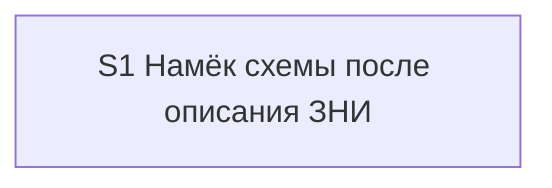

# Quality Control — overview-map-offer

Date: 2026-08-29  
Report: `quality-control-2026-08-29.md`  
Mode: **proposed-slice** (`design.md` `## Slices`; `tasks.md` **не существует**)  
Scope (prompt): criteria **1, 3, 5, 5b, 8, 8b, 9, 10, 11** from `.cursor/rules/vertical-slices.mdc` QUALITY CONTROLLER — SLICE COHERENCE, applied to proposed decomposition + delta spec  
Also filled (output format): independence, dependency graph, rework, task readability (N/A)  
Out of scope: исполнимость приёмки «прямо сейчас» на живой сессии / ИБ; тестовые данные; эталоны ИБ; качество кода и выбор варианта A

Context: kit-only change (скилл описания ЗНИ, макет чата описания, скилл карты, дельта spec). Продуктовый `src/**` / `.bsl` не требуется. `form_mode: n/a`. Prompt: **не** ставить CRITICAL только из-за отсутствия `S1.accept` в файле задач; оценить, будет ли один срез вертикальным и самодостаточным, когда задачи появятся. **`no-slices` not emitted as a blocker** (prompt override): treat `## Slices` as the proposed decomposition.

Sources: `proposal.md`, `design.md` (`## Slices`), `specs/scenario-map-canvas/spec.md` (36 `#### Scenario:`), `.cursor/rules/vertical-slices.mdc`, `.cursor/rules/task-readability.mdc`. Cross-check: `reports/architecture-new-2026-08-29.md` § «Ответы на вопросы постановки» п.3 (not a second SoT).

## Verdict

`WARNING`

Один предложенный срез вертикален, самодостаточен и не является foundation+gate. Primary — наблюдаемый прогон описания ЗНИ (намёк в чате без панели, затем согласие открывает панель из отчётов). В таблице покрытия `## Slices` нет нового сценария дельты «Плоский набор без формы связей в описании не даёт намёка». Двадцать восемь унаследованных Scenario из блоков MODIFIED в дельте тоже не размещены (нет заявленной задачи регресса).

## Slice Summary

| Slice | Scenario | Tasks | Acceptance | Dependencies | Gate |
|---|---|---|---|---|---|
| S1: Намёк схемы после описания ЗНИ | Разработчик вызывает описание ЗНИ с отчётами разбора, видит в строке следующего шага, что станет видно на схеме, соглашается — открывается панель из отчётов, не из этапов | ещё нет (`tasks.md` отсутствует); слои по design: скилл описания, контракт чата описания, скилл карты, дельта требований | S1.accept предложен (1 mandatory Primary + optional/задачи сверки); **7/8** новых Scenario дельты явно размещены, **1 новый не размещён**; **0/28** унаследованных Scenario блоков MODIFIED не размещены | нет | предложен один accept на границе среза; маркер `<!-- slice-gate -->` в design нет (формат `tasks.md`; см. критерий 5) |

Notes:

- Порог: Standard (архитектор: четыре артефакта, фазы 1–4 внутри среза, ожидаемо 6–15 задач). По `vertical-slices.mdc` § ТРИГГЕРЫ — **1 срез по умолчанию**. Второй срез «строка в чате» без панели отклонён явно: это подготовка без самостоятельной приёмки. Согласовано с критериями 8b и 9.
- `form_mode: n/a`. Продуктовый BSL/Form/XML не требуется.
- Архитектурные Phase 1–4 — группы работ внутри S1, не отдельные срезы; QC их не штрафует.
- `**Режим apply:**` в design не указан; для kit markdown допустим `mechanical` на этапе генерации `tasks.md` — вне запрошенных критериев.
- Колонка «Scenarios из spec» содержит имя «Нет отдельной команды карты». Этого `#### Scenario:` **нет** в дельте change (он живёт в главном spec и не переписывается). Архитектор: регрессионная сверка, требование в дельте не трогать. В покрытие дельты это имя не засчитывается.

## Scenario Coverage

36 `#### Scenario:` в `openspec/changes/overview-map-offer/specs/scenario-map-canvas/spec.md`.

Классификация: **8 новых** (описание ЗНИ / источник после описания) и **28 унаследованных** (перенесены в дельту вместе с полным текстом MODIFIED-требований; WHEN/THEN про исследование и разбор эта ЗНИ не меняет по смыслу, но файл spec их содержит, и скилл карты эта ЗНИ правит).

### Новые Scenario дельты (8)

| Scenario | Covered by (proposed) | Status |
|---|---|---|
| Описание предлагает схему при топологии в отчётах | S1 Primary | OK — covered-by-Primary |
| Намёк описания не рисует панель | S1 Primary (тот же путь: намёк есть, панели ещё нет) | OK — covered-by-Primary |
| Согласие на намёк описания рисует карту из отчётов | S1 Primary (Then того же пути) | OK — covered-by-Primary |
| Описание без отчётов схему не предлагает | S1 Primary в таблице покрытия | OK как покрытие; **не** второй mandatory journey — см. критерий 10 |
| Плоский набор без формы связей в описании не даёт намёка | **нигде в `## Slices`** (нет Primary, нет optional, нет заявленной `S1.<M>`) | **GAP** — `accept-bullets-missing-scenario` |
| Отказ без карты в описании не повторяется | S1 optional | OK — covered-by-optional |
| Прямая просьба в описании берёт инвентарь отчётов | S1 optional | OK — covered-by-optional |
| Этапы поставки не становятся картой | S1 optional | OK — covered-by-optional |

Сценарий «Плоский набор…» в дельте **новый** (Requirement «Offer by topology…», WHEN: ≥4 связанных сущности без слоёв / ветвления / жизненного цикла / петли). Behavior Contract п.2 и Decision 3 как раз требуют топологический признак третьим условием; архитектор Test Scenario 5 описывает тот же путь. Таблица покрытия `design.md` это имя не перенесла. Это не «наследие архива, которое можно молча опустить».

**Связь со spec** в строке S1 перечисляет 8 имён: семь новых из дельты плюс «Нет отдельной команды карты» (не из дельты) и **не** включает «Плоский набор без формы связей в описании не даёт намёка».

Имя «Нет отдельной команды карты» в таблице покрытия помечено «S1 задача сверки скилла» — допустимо как регресс главного spec, **не** закрывает дыру дельты.

### Унаследованные Scenario блоков MODIFIED (28)

Ни одно имя ниже не стоит в таблице «Покрытие Scenarios» и не заявлено как `S1.<M>` регресса.

| Scenario | Covered by (proposed) | Status |
|---|---|---|
| Молчание по умолчанию | нет | **GAP** |
| Намёк не рисует панель | нет | **GAP** |
| Системный MUST canvas не действует на opsx | нет | **GAP** |
| Прямая просьба рисует карту | нет | **GAP** |
| Карта во время прохода из уже пройденных точек | нет | **GAP** |
| Прямая просьба после выхода разбора | нет | **GAP** |
| Просьба при числе сущностей ниже порога | нет | **GAP** |
| Первая просьба в проекте без открытой панели | нет | **GAP** |
| Панель открывается штатной кнопкой среды | нет | **GAP** |
| С узла открывается доказательство, новый чат с панели не запускается | нет | **GAP** |
| Порядок прохода не выдаётся за причинность | нет | **GAP** |
| Просьба при линейной цепочке | нет | **GAP** |
| Согласие на предложение рисует карту | нет | **GAP** |
| Согласие до первой карточки разбора запоминает фокус | нет | **GAP** |
| Отложенное согласие публикует карту без повторного вопроса | нет | **GAP** |
| Согласие было, порог до выхода не набрался | нет | **GAP** |
| Согласие при неподтвердившейся топологии даёт цепочку | нет | **GAP** |
| Исследование предлагает схему при топологии без замеров | нет | **GAP** |
| Разбор предлагает схему на подтверждении списка без порога публикации | нет | **GAP** |
| Разбор предлагает схему на выходе без замеров времени | нет | **GAP** |
| На линейных двух шагах схему не предлагают | нет | **GAP** |
| Предложение не зависит от темы механизма | нет | **GAP** |
| Намёк на выходе разбора при топологии | нет | **GAP** |
| Нет намёка, если уже вопрос анализа | нет | **GAP** |
| Исследование не предлагает карту и разбор сразу | нет | **GAP** |
| Нет предложения в финале исследования с постановкой | нет | **GAP** |
| Вне разбора без источника — отказ | нет | **GAP** |
| Просьба в исследовании берёт текущий отчёт | нет | **GAP** |

Эти Scenario остаются в дельте, потому что требования переписаны целиком (MODIFIED, не точечный ADDED). ЗНИ правит тот же скилл карты (слот намёка, третье исключение источника). Регресс слотов исследования и разбора — in scope для покрытия (правило среза 6: регресс → optional accept **или** agent static `S<N>.<M>`). Не тащить 28 имён в mandatory Primary и не делать второй срез.

## Dependency Graph

- Cycles: none.
- Forward acceptance dependencies: none (единственный срез).
- Undeclared predecessors: none (`**Зависимости:**` в графе design = «S1 → нет»).
- Intra-slice (projected, по Migration Plan / архитектору): макет чата (`opsx-output-style.md` §5.6) → ветка инвентаря и намёка в скилле описания → правки скилла карты (слот, источник согласия, третье исключение) → дельта spec → `S1.accept`. Цикла нет. Соседняя ЗНИ `scenario-map-readability-meaning` в граф не входит (Decision 5: дефолт одного отчёта).

## Checklist Results

| # | Criterion | Result |
|---|---|---|
| 1 | Scenario Coverage | **Fail (WARNING)** — новых 7/8; унаследованных 0/28. Пропуск нового: «Плоский набор без формы связей в описании не даёт намёка». Остальные новые: Primary / optional. Унаследованные MODIFIED — ни optional, ни заявленная задача «верифицировать по тексту скилла». User runtime только на границе accept (projected) |
| 2 | Slice Independence | **Pass** (информативно, не в запросе) — принимать S1 можно без несуществующего S2+ |
| 3 | Slice Completeness | **Pass** — слои kit, нужные для Primary «описание с отчётами → намёк без панели → согласие → панель из отчётов», в колонке «Файлы» названы: скилл описания (инвентарь, намёк, согласие → сборщик), контракт чата описания (безусловная строка следующего шага), скилл карты (место намёка, источник, третье исключение), дельта требований. Сборщик манифеста — существующий механизм, новый файл не требуется. Метаданных/форм 1С нет и не требуется. `opsx-output-style.md` §5.6 в колонке сжат в «контракт чата» — не дыра слоя, см. SUGGESTION |
| 4 | Slice Dependency Graph | **Pass** (информативно) — S1 → нет |
| 5 | Slice Gate Integrity | **Pass (projected)** — предложен **ровно один** срез и **ровно один** `S1.accept`. Дубля нет. Маркер `<!-- slice-gate -->` — артефакт `tasks.md`, в `## Slices` его нет по формату design; **не** эмитирован CRITICAL (нет `# Срез` в tasks; явный override промпта). При генерации tasks — ровно один accept + один маркер (SUGGESTION) |
| 5b | Acceptance Checklist Coverage | **Fail (WARNING)** — Primary в metadata таблицы есть; чеклист ещё не в `tasks.md` → `primary-acceptance-missing` / `accept-checklist-empty` **не** срабатывают (override промпта: не CRITICAL из-за отсутствия файла задач). `accept-bullet-foreign-scenario` N/A (один срез). `accept-bullets-missing-scenario` — да (новый «Плоский набор…» + 28 унаследованных) |
| 6 | Rework Risk | **Pass** (информативно) — один срез снимает риск «принята строка чата без панели». Соседняя ЗНИ про читаемость в зависимости не стоит. Плотность Primary (намёк + отсутствие панели + согласие) — один путь, не rework между срезами |
| 8 | Slice Verticality | **Pass** — mandatory Primary: вызвать описание ЗНИ с отчётами → в чате вариант схемы с «что станет видно», панели нет → согласие → панель из отчётов. Это black-box (чат описания + панель рядом с чатом), не вызов API / код-ревью контракта. Programmatic (сверка скилла, «нет отдельной команды») вынесены из Primary в задачи — верно. Отдельный срез «только строка» был бы невертикален; он отвергнут |
| 8b | Self-Achievable Acceptance | **Pass** — нет пары S1/S2. Наблюдаемый исход не заимствован у более позднего среза. Все включающие слои Primary (слот чата, инвентарь отчётов, проверка трёх условий, согласие → сборщик, исключение источника) заявлены в том же S1. Отказ от среза «строка без панели» как раз закрывает этот критерий. Соседняя ЗНИ для мультиисточника не нужна (Decision 5: один отчёт) |
| 9 | Foundation slice with gate | **Pass** — нет S_k с programmatic accept и зависимого S_k+1 с UX. Черновик «срез только строка в чате» отвергнут в `## Slices` со ссылкой на подготовку без самостоятельной приёмки |
| 10 | Acceptance Simplicity | **Pass (projected)** — задуман **один** mandatory black-box journey (описание с отчётами → намёк без панели → согласие → панель). Три новых Scenario («предлагает схему», «намёк не рисует», «согласие рисует») — шаги **одного** Then, не три обязательных буллета. Риск: в таблице покрытия «Описание без отчётов…» тоже помечено Primary, а текст Primary в metadata заканчивается вторым Given («на ЗНИ только с постановкой предложения нет»). Если при генерации tasks это станет вторым mandatory sub-bullet без пометки «опционально» → `acceptance-simplicity-overload` (SUGGESTION) |
| 11 | User Task Contract | **Pass (projected)** — строк `S<N>.<M>` нет, DENY-grep не к чему применить. Приёмка «ручной прогон описания на ЗНИ с отчётами и без них» стоит на границе среза (колонка «Приёмка» / Assumptions п.4) — **допустимо** в `S1.accept`. Сверка скилла заявлена как **задача** (агент по тексту), не user-spike в середине среза. CRITICAL не ставить до появления запрещённых формулировок в tasks |

Task readability: **N/A** — нет `- [ ] S1.<M>`. Критерий 7 не в запросе; при генерации tasks действует `.cursor/rules/task-readability.mdc`.

## Alerts

### 1. `accept-bullets-missing-scenario`

- affected: S1 / delta spec Scenario «Плоский набор без формы связей в описании не даёт намёка»
- alert type: `accept-bullets-missing-scenario`
- severity: `WARNING`
- evidence: `specs/scenario-map-canvas/spec.md` (Requirement «Offer by topology not by topic»). Таблица «Покрытие Scenarios» и колонка «Scenarios из spec» в `design.md` `## Slices` имя не содержат. Архитектор Test Scenario 5 и Decision 3 описывают тот же путь. Остальные 7 новых Scenario размещены.
- recommendation: при генерации `tasks.md` покрыть сценарий **хотя бы в одном месте**: optional sub-bullet `S1.accept` (предпочтительно: описание ЗНИ, отчёты дают ≥4 связанных сущности без формы связей → в строке следующего шага варианта схемы нет, причины в чат нет) **или** `S1.<M>` агенту «по тексту скилла описания/карты: третье условие предложения — топологический признак; плоский набор намёка не даёт». **Не** делать второй mandatory journey (критерий 10). Добавить имя в `**Связь со spec:**` S1. Убрать из «Связь со spec» имя «Нет отдельной команды карты» либо оставить его только как задачу сверки без претензии, что это Scenario дельты.

### Remediation (auto-repair)

- alert: `accept-bullets-missing-scenario`
- target: `design.md` `## Slices` (таблица покрытия + «Scenarios из spec») и будущий `tasks.md` срез S1
- action: (1) В `design.md` добавить строку покрытия: Scenario «Плоский набор без формы связей в описании не даёт намёка» → S1 optional **или** S1 задача сверки скилла. (2) Вписать то же имя в колонку «Scenarios из spec». (3) В `S1.accept` — optional-буллет с буквальным именем Scenario **либо** задача `S1.<M>` со сверкой трёх условий предложения. Не включать этот путь в mandatory Primary.

### 2. `accept-bullets-missing-scenario` (inherited MODIFIED)

- affected: S1 / 28 унаследованных `#### Scenario:` в той же дельте
- alert type: `accept-bullets-missing-scenario`
- severity: `WARNING`
- evidence: дельта переписывает пять требований целиком; в `specs/scenario-map-canvas/spec.md` остаются Scenario исследования, разбора, прямой просьбы и отказа «укажите отчёт». Таблица покрытия `## Slices` их не называет. ЗНИ меняет `.cursor/skills/scenario-map-canvas/SKILL.md` (слот намёка, источник, исключения) — те же секции, что держат унаследованные WHEN/THEN.
- recommendation: **одна** (или две) агентские `S1.<M>` «верифицировать по тексту скилла карты»: слоты «Дальше» / подтверждение списка / «Следующий шаг» разбора; молчание без просьбы; отказ вне разбора без источника; два прежних исключения источника; запрет слота финала постановки ЗНИ. В тексте задачи перечислить имена Scenario буквально **или** дать `**Связь со spec:**` среза со всеми 28 именами и закрыть их этой задачей. **Не** выносить регресс в optional-буллеты accept (раздует чеклист) и **не** делать второй срез. Покрытие только в `S<N>.<M>` — OK (критерий 5b).

### Remediation (auto-repair)

- alert: `accept-bullets-missing-scenario`
- target: `design.md` `## Slices` (таблица покрытия) и будущий `tasks.md` срез S1
- action: (1) Добавить в таблицу покрытия одну строку: «унаследованные Scenario MODIFIED (исследование / разбор / прямая просьба / источник вне описания)» → S1 задача сверки скилла карты. (2) В `tasks.md` до `S1.accept` — задача(и) агента со сверкой по тексту; имена Scenario в теле задачи или в `**Связь со spec:**`. (3) Не включать эти пути в mandatory Primary.

### 3. `slice-gate-pending-tasks`

- affected: S1 (generation of `tasks.md`)
- alert type: (informational for criterion 5; not in the removed-alert list)
- severity: `SUGGESTION`
- evidence: `## Slices` задаёт один `S1.accept` и критерии приёмки; HTML-маркер конца среза в design не пишется.
- recommendation: в `tasks.md` — `# Срез S1: Намёк схемы после описания ЗНИ`, блок метаданных с `**Primary acceptance:**` из таблицы, ровно один `- [ ] S1.accept …` с `**Primary (обязательно):**` из metadata, затем `<!-- slice-gate: после описания ЗНИ с отчётами в строке шага есть намёк схемы без панели; согласие открывает панель из отчётов -->`.

### 4. `acceptance-simplicity-guard`

- affected: S1.accept (projected)
- alert type: профилактика критерия 10 (`acceptance-simplicity-overload`)
- severity: `SUGGESTION`
- evidence: Primary одним предложением закрывает намёк, отсутствие панели и согласие (три Scenario — один путь). Четвёртое имя «Описание без отчётов схему не предлагает» в таблице стоит как Primary; в metadata Primary вторым Given идёт «на ЗНИ только с постановкой предложения нет».
- recommendation: в теле `S1.accept` оставить **один** mandatory sub-bullet: вызвать описание ЗНИ с отчётами разбора → в строке следующего шага вариант схемы с «что станет видно», панели нет → согласие → панель из отчётов, узлы не повторяют этапы. «Описание без отчётов…», «Отказ без карты…», «Прямая просьба…», «Этапы поставки…», «Плоский набор…» — «(опционально)» или `S1.<M>`. Имена трёх шагов happy-path не превращать в три строки без пометки «опционально».

### 5. `user-task-contract-guard`

- affected: будущие `S1.<M>`
- alert type: профилактика критерия 11
- severity: `SUGGESTION`
- evidence: колонка «Приёмка» = ручной прогон описания; Assumptions п.4 — тот же прогон. DENY-маркеров в design нет.
- recommendation: живой прогон `/opsx:overview` (с отчётами / без / плоский набор / отказ / прямая просьба) держать только в `S1.accept`. Правки markdown и «верифицировать по тексту скилла/макета чата» — агентские `S1.<M>` (ALLOW-agent). Не писать в `S1.<M>` «на стенде», «на тестовой ИБ», «runtime-verify», «в консоли», условные «после verify».

### 6. Completeness — явные задачи слоёв

- affected: S1 task generation
- alert type: профилактика критерия 3
- severity: `SUGGESTION`
- evidence: колонка «Файлы» достаточна семантически; архитектурный отчёт и Migration Plan перечисляют ещё `.cursor/docs/opsx-output-style.md` §5.6, секции «Источники (только Read)» и Guardrails скилла описания (сборщик манифеста выведен из-под запрета Task), третье исключение в скилле карты.
- recommendation: в группах S1 до accept явно закрыть слои: макет тонкого чата описания (строка шага всегда); инвентарь отчётов + три условия предложения; согласие вызывает сборщика; скилл карты (слот описания, источник, исключение «укажите отчёт»); дельта spec. Не выделять Phase 1 «только слот» в отдельный срез.

**Не эмитировано:** `no-slices` (просьба промпта); `primary-acceptance-missing`; `accept-checklist-empty`; `accept-bullet-foreign-scenario`; `slice-not-vertical`; `slice-accept-not-self-achievable`; `slice-foundation-with-gate`; `acceptance-simplicity-overload`; `user-task-contract-violation`; `legacy-acceptance-format`; `deprecated-phase-gate`. CRITICAL по отсутствию `S1.accept` в `tasks.md` **не** ставился.

## Recommendations

**Automatic fix**

1. Дописать в `## Slices` покрытие Scenario «Плоский набор без формы связей в описании не даёт намёка» (optional accept или задача сверки) — см. Remediation alert 1.
2. Дописать покрытие 28 унаследованных Scenario одной (двумя) задачей сверки скилла карты — см. Remediation alert 2.
3. При генерации `tasks.md`: один `# Срез S1`, один `S1.accept` с одним mandatory Primary, `<!-- slice-gate -->`, optional/agent для остальных Scenario из Связь.

**Decision required**

Нет. Критерий 8b / объединение срезов не требуется: декомпозиция уже один срез. Переписывать Primary на другой путь не нужно. Второй срез не создавать.

**Do not**

- Не вводить второй срез «строка в чате» или «панель отдельно» (критерии 8b и 9).
- Не ставить два+ mandatory black-box journey в `S1.accept` (в том числе не делать «без отчётов» вторым обязательным буллетом).
- Не закрывать пропуск «плоский набор» вторым обязательным accept-путём.
- Не откладывать `S1.accept` до соседней ЗНИ `scenario-map-readability-meaning`.
- Не превращать архитектурные Phase 1–4 в четыре `# Срез`.
