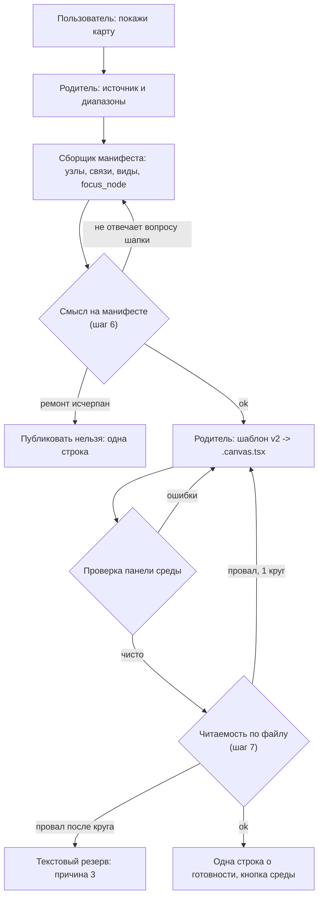
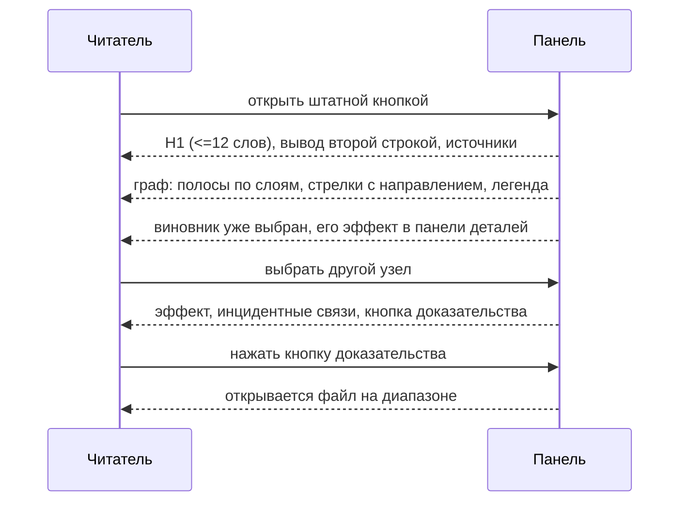

# Architecture: читаемость и смысл карты сценария

**Исход: подход принять с правками `design.md`.** Выбранная точка правки (шаблон панели + проверки при записи, без нового агента и без смены модели сборщика) подтверждается доказательствами ревью трёх живых панелей и не задевает инварианты ADR-0008. Правки нужны в девяти местах: главная — владелец и порядок двух проверок (смысл до записи файла, читаемость после чистой проверки панели), полосы по полю `layer` вместо рангов раскладки, и явный запрет достраивать рёбра под давлением требования полноты смысла.

## KB references

Совпадений нет: таксономия базы знаний в kit не заведена (`openspec/knowledge/_index.yaml` отсутствует), Discovery пуст. Опора решений — ADR-0008, архивный spec `2026-08-28-scenario-map-canvas` и прочитанные файлы кита.

## Task

Проверить архитектурный подход ЗНИ `scenario-map-readability-meaning`: как сделать карты сценария читаемыми и смысловыми, не ломая контракт данных архивной capability и инварианты ADR-0008. Выдать вердикты по клику, по числу чек-листов, по числу срезов и список правок `design.md`.

## Complexity

Medium (5–7 файлов кита, один сквозной контракт данных, один Load-Bearing ADR в области).

## Chosen Approach

**Approach:** Pragmatic balance — расширяем существующие артефакты (шаблон панели, скилл, роль сборщика, эталоны, spec), новых механизмов и новых ролей не вводим.

**Rationale:**

- Причина «разочаровывающих» карт установлена по коду живых панелей: карта, собранная почти дословно по `fixtures/canvas-shell.md`, — худшая по чтению; отступившие от шаблона — лучшие (ревью §1.1, §2). Значит рычаг — слой представления в шаблоне, а не дисциплина исполнителя.
- Контракт данных (словарь `relation`, `evidence_ref`, порог четырёх, запрет выдуманных рёбер) работает: у карты «по учебнику» каждую стрелку можно проверить (ревью §2 п.1). Его правка не нужна и не предлагается.
- Гейт публикации по ADR-0008 остаётся у родителя. Проверки читаемости и смысла встраиваются в уже существующие точки (шаг 6 «Макет» и шаг 7 «Регистрация» скилла) и в уже существующие круги ремонта, поэтому новый субагент-ревьюер панели не нужен (ревью §4.3).

**Trade-off:** родитель одновременно исполнитель записи и держатель проверок — риск самооценки (см. Risks 1). Принимается, потому что альтернатива (отдельный ревьюер панели) добавляет вызов и вторую точку истины на каждую карту при неподтверждённой выгоде.

## Simplicity Check

- **Viable alternatives:**
  1. **A. Только два чек-листа, шаблон не трогать** (вариант A из `design.md`). Файлы: `SKILL.md`. Отклонён по доказательству: нечитаемость воспроизводится именно при точном следовании шаблону (ревью §1.1 «это почти дословная реализация `fixtures/canvas-shell.md`»); чек-лист без исправленного шаблона переводит систематический дефект в систематический ремонт.
  2. **B′. Шаблон v2 + один объединённый чек-лист.** Файлы: `canvas-shell.md`, `SKILL.md`. Отклонён: у двух проверок разные владельцы ремонта и разные исходы провала (нечитаемость → перезапись файла родителем; пустой смысл → пересборка манифеста сборщиком либо «публиковать нельзя»). Объединение загоняет один из исходов в чужой круг ремонта. Доказательство разделимости: `shtamp-EP-mechanism` читается лучше всех и при этом учит опасный шаг (ревью §1.3 «Содержательный риск»), а `shtamp-EP-stale-cache` фактурно верна и нечитаема (§1.1).
  3. **B. Шаблон v2 + два чек-листа на существующих кругах ремонта + аддитивное расширение манифеста (выбран).** Файлы: `canvas-shell.md`, `SKILL.md`, `onec-scenario-map-designer.md`, `scenario-map-designer.md`, новый плохой эталон, delta spec.
  4. **C. B + отдельный субагент-ревьюер панели.** Отклонён: ревью §4.3 прямо показывает, что чек-лист по коду записанного файла дешевле и не требует нового вызова.
  5. **D. B + смена модели сборщика.** Вне scope по ограничению постановки и по ревью §4.5 (модель — вторичный рычаг, замер после внедрения 4.1–4.3).
- **Selected simplest viable design:** B. Минимален при условии Behavior Contract: закрывает и представление, и смысл, не вводя ни новой роли, ни нового круга ремонта сверх уже описанных в скилле.
- **Why not simpler:** A не закрывает пункты 1–3 Behavior Contract (направление, честные полосы, вывод без клика) — они физически живут в шаблоне. B′ не закрывает пункт 5–6 (ответ с графа, находка на полотне) без смешивания кругов ремонта.
- **Complexity budget:**
  - Files touched: 6 файлов кита + delta spec в ЗНИ (7).
  - Hooks/intercepts: 0 (kit-only, продуктовый код не затрагивается).
  - New procedures/functions: 3 в шаблоне панели (полосы по `layer`, легенда, панель деталей с кнопкой доказательства); 0 новых ролей.
  - Conditional branches / feature flags: 2 необязательных поля манифеста (`header.focus_node`, `modes[]` ≤3); 0 флагов включения.

## Found Patterns

### Pattern 1: Гейт публикации у родителя, манифест у сборщика

- **Where:** `.cursor/skills/scenario-map-canvas/SKILL.md:46-48` (шаги 6–8), `.cursor/agents/onec-scenario-map-designer.md:29-48`
- **Usage:** сборщик возвращает `check` / `repair_round` / `manifest`, файл пишет родитель, гейт — чистая проверка панели у родителя.
- **Evidence:** прочитаны файлы; ADR-0008 §Решение п.1–2.
- **Confidence:** high
- **Applicability:** обе новые проверки встают в эти же две точки без новой роли: смысл — на манифесте (шаг 6), читаемость — на записанном файле (шаг 7).

### Pattern 2: Два уровня self-check с фиксированной нумерацией

- **Where:** `SKILL.md:235-247` (пункты 1–6 сборщика, 7–8 родителя); ссылки на нумерацию в `.cursor/agents/onec-scenario-map-designer.md:46-48`
- **Usage:** контракт роли ссылается на номера пунктов скилла.
- **Evidence:** «манифест не прошёл self-check скилла **пункты 1–6**… Пункты 7–8 … картограф **не** проверяет».
- **Confidence:** high
- **Applicability:** новые пункты добавлять буквенными (`6a`, `6b`, `8a`…`8g`), чтобы формулировки «пункты 1–6» и «пункты 7–8» в роли остались верными без правки смысла.

### Pattern 3: Ложные подписи полос заложены в шаблоне

- **Where:** `fixtures/canvas-shell.md:92-97` (`rankTitle` берёт слой **первого** узла ранга), там же `126-145` (полосы рисуются по `layout.ranks`)
- **Usage:** подпись полосы = слой первого узла ранга DAG.
- **Evidence:** код шаблона + ревью §1.1 «Ложные подписи полос… подпись врёт».
- **Confidence:** high
- **Applicability:** Behavior Contract п.2 в `design.md` невыполним, пока полосы строятся по рангам: ранг может смешивать слои. Полосы должны строиться **из поля `layer`**.

### Pattern 4: Клик в шаблоне делает два действия сразу

- **Where:** `fixtures/canvas-shell.md:185-189` (`setSelected` + `openEvidence` в одном обработчике)
- **Usage:** клик выбирает узел и тут же открывает файл доказательства.
- **Evidence:** код шаблона; ревью §1.1 «клик тут же открывает BSL-модуль на 5000+ строк — читатель наказан дважды».
- **Confidence:** high
- **Applicability:** правка сводится к снятию `openEvidence` из обработчика узла и появлению кнопки в панели деталей — контракт «доказательство доступно с узла» сохраняется.

### Pattern 5: Закрытый список причин текстового резерва

- **Where:** `openspec/specs/scenario-map-canvas/spec.md:106`, `SKILL.md:188-196`
- **Usage:** резерв только при среде без панели, неопределившемся каталоге, исчерпанном ремонте записи/проверки.
- **Evidence:** прочитан spec.
- **Confidence:** high
- **Applicability:** провал смысла — **не** технический отказ и в резерв уходить не должен; он маппится на существующий исход «публиковать нельзя» (одна строка, чего не хватает).

## Assumptions

1. **Проверку смысла выполняет родитель по манифесту, без нового вызова.** Confidence: medium. Verification: две-три живые сборки после внедрения; если провалы смысла систематически проходят гейт — оформлять расширение `check-failed` сборщика (путь уже назван в ревью §4.3).
2. **Ручная раскладка ≤12 узлов считается родителем при заполнении шаблона, координаты в манифест не возвращаются.** Confidence: high (роль сборщика прямо ограничена данными: `onec-scenario-map-designer.md:16`). Verification: в шаблоне порядок полос выводится из топологии рёбер, при неоднозначности — порядок первого появления `layer` в `nodes`.
3. **Живые панели остаются вне git; приёмка проводится в проекте Документооборота вручную.** Confidence: high (ADR-0008 §Последствия, `SKILL.md:45`).

## Open Questions

1. **Кто судит смысл при спорной формулировке `header.insight`** — родитель по манифесту или пользователь на приёмке? Addressed to: User. Blocker: No (по умолчанию — родитель; пользователь остаётся последней инстанцией на `S1.accept`).
2. **Сохраняются ли полосы в запасной generic-раскладке (>12 узлов).** Addressed to: User / решение в `design.md`. Blocker: No (рекомендация ниже — полосы без подписей либо без полос; подпись слоем первого узла ранга запрещена).

## Вердикт 1 — клик vs ADR-0008 и архивный сценарий

**Классификация: `restructure` контракта с одним узким `revoke` наблюдаемого шага. ADR-0008 не задет, замена ADR не требуется.**

Разбор по трём источникам:

| Источник | Формулировка | Что делает ЗНИ | Класс |
|---|---|---|---|
| ADR-0008 `Protects-invariants` | «У узла есть имя и доказательство; у ребра — отношение, подпись и ссылка на источник» | доказательство остаётся обязательным полем узла и остаётся доступным с узла | не задето |
| ADR-0008 §Решение п.3–4 | контракт узла и «главный вид — граф» | не меняется | не задето |
| Главный spec `spec.md:120` (Requirement «Node contract…») | «С узла панели MUST открываться доказательство; запуск нового чата с панели MUST NOT» | остаётся истинным: доказательство открывается с узла кнопкой панели деталей | `restructure` (уточнение формулировки: «одним явным действием на узле») |
| Архивный + главный Scenario «С узла открывается доказательство, новый чат с панели не запускается» (`spec.md:62-65`) | WHEN «разработчик выбирает узел» → THEN «открывается доказательство узла» | выбор узла теперь открывает панель деталей; файл — по кнопке | **`revoke` шага THEN** → требуется MODIFIED-сценарий в delta spec |

Практические следствия:

1. Инвариант ADR-0008 не отменяется, поэтому пункт «клик = `openFile`» нельзя выдавать за отмену Load-Bearing решения: в `Protects-invariants` такого пункта нет (проверено построчно, ADR-0008:8-14).
2. Отмена всё же есть — на уровне наблюдаемого шага архивного сценария. Значит delta spec обязан содержать **MODIFIED** этого Requirement и этого Scenario с новым THEN («выбор узла показывает эффект и доказательство в панели деталей; файл доказательства открывается кнопкой»), а `## Blast Radius` в `design.md` — назвать класс словом `restructure` с оговоркой про отменённый шаг. Сейчас в таблице класс не указан.
3. Слово **BREAKING** в `proposal.md` §What Changes п.6 корректно и достаточно: ломается поведение клика, не контракт доказательности.

## Вердикт 2 — два чек-листа против одного

**Два, но с разными владельцами, разными точками и разными исходами провала. Формулировка `design.md` «при записи родитель проверяет читаемость и смысл» — слишком поздняя точка для смысла и должна быть разделена.**

Доказательство разделимости (не умозрительное): две живые карты дают ортогональные провалы — `shtamp-EP-stale-cache` фактурно и структурно безупречна и нечитаема (ревью §1.1); `shtamp-EP-mechanism` читаема, со стрелками и режимами, и советует шаг, включающий ловушку одной подписи (§1.3). Один чек-лист с одним исходом не различает эти случаи.

Целевое разделение:

| Проверка | Что проверяет | Где | Владелец | Исход провала |
|---|---|---|---|---|
| **Смысл** | вопрос шапки отвечается расположением и стрелками; находка, меняющая действие, есть узлом или подписанной связью; вывод не живёт только в тексте шапки | на **манифесте**, до записи файла (шаг 6 скилла) | родитель, ремонт — сборщиком через существующий `check-failed` / `repair_round` ≤2 | пересборка манифеста; при исчерпании — **«публиковать нельзя»** (одна строка, чего не хватает), **не** текстовый резерв |
| **Читаемость** | направление у каждой связи; подписи рёбер не пересекают узлы; полосы совпадают с `layer`; эффект узла-виновника виден без клика; легенда при цвете/пунктире; H1 ≤12 слов; нет литеральных backticks; нет карточных секций-дашбордов | на **записанном файле**, после чистой проверки панели и до строки о готовности (шаг 7 скилла) | родитель, свой ремонт — 1 круг | перезапись файла родителем; при исчерпании — существующая причина резерва №3 («запись или проверка исчерпала разрешённый ремонт»), новых причин резерва **не появляется** |

Почему смысл нельзя оставлять «при записи»: провал смысла лечится пересборкой манифеста, то есть повторным вызовом сборщика. Если проверка стоит после записи файла, каждый провал стоит лишней записи и лишней проверки панели, а исход «публиковать нельзя» приходится изобретать заново после того, как файл уже создан.

## Вердикт 3 — срезы

**Один срез. Три среза черновика постановки принять нельзя.**

Основания:

1. **Порог.** Объём работ — 6–15 задач (шаблон, две проверки, контракт манифеста, роль и бриф, эталон, delta spec). По `vertical-slices.mdc` § ТРИГГЕРЫ это Standard: **1 срез по умолчанию**, дополнительные — только при самостоятельном пользовательском исходе у каждого.
2. **`foundation-slice-with-gate`.** Срез «шаблон панели» из черновика даёт наблюдаемый результат только тогда, когда по нему собрана живая карта, то есть в срезе проверок; отдельный `accept` и `slice-gate` на шаблоне — прямо запрещённый антипаттерн.
3. **Дубль Primary (критерий QC 8b).** И «карта читается», и «карта не теряет смысл» проверяются одним и тем же пользовательским путём: попросить карту → открыть панель штатной кнопкой → посмотреть на граф. Разделение дало бы два среза с существенно совпадающим Primary → `slice-accept-not-self-achievable`.
4. **Why не закрывается частично.** Приёмка одного «читаемого» среза без проверки смысла оставляет ровно тот провал, из-за которого ЗНИ создана: «ни одна карта не показала ловушку одной подписи» (ревью §1.4).

Структура внутри среза — группы `## 1…## 5` по фазам ниже. Primary одна: живая пересборка карты по теме исследования, где одновременно видно направление, легенду, честные полосы, выбранного виновника и находку, меняющую действие. Отрицательные случаи (вывод только в шапке; расхождение совета с отчётами) — optional-буллеты приёмки либо задачи «верифицировать по коду шаблона и скилла».

## Правки `design.md` (внести оркестратору)

| # | Секция | Правка |
|---|---|---|
| **D1** | `## Behavior Contract` п.2 | Переписать на источник полос: «Полосы строятся из поля `layer` узлов; подпись полосы — имя слоя её узлов. В запасной generic-раскладке полосы либо не подписываются, либо не рисуются; подпись слоем первого узла ранга запрещена». Причина: текущая формулировка невыполнима при `rankTitle` по рангам (`canvas-shell.md:92-97`). |
| **D2** | `## Decisions` п.2 и новая строка в `## Behavior Contract` | Зафиксировать точки и владельцев двух проверок: смысл — на манифесте до записи, ремонт сборщиком в существующих ≤2 кругах, исход исчерпания «публиковать нельзя»; читаемость — на записанном файле после чистой проверки панели, ремонт родителя 1 круг, исход исчерпания — существующая причина резерва №3. Явно написать: **новых причин текстового резерва не вводится**, провал смысла в резерв не уходит. |
| **D3** | `## Blast Radius` | Добавить колонку класса и проставить: клик — `restructure` с отменённым шагом THEN архивного сценария (требуется MODIFIED Requirement «Node contract…» и MODIFIED Scenario); «ответ читается с графа» — `extends`; `header.focus_node` и `modes[]` — `extends` (аддитивные необязательные поля); полосы по `layer` — `restructure`. Дописать строку: ADR-0008 правки не требует, `Protects-invariants` не содержит «клик = `openFile`». |
| **D4** | `## Decisions` (новый пункт) | Аддитивность контракта манифеста: добавляются только необязательные `header.focus_node` (узел из `nodes`, обязателен при наличии причинных рёбер; в чистой `follows`-цепочке по умолчанию первый узел) и `modes[]` ≤3. Существующие поля не удаляются и не переименовываются. Пункты self-check добавляются буквенными номерами (`6a`, `6b`, `8a`…), чтобы ссылки «пункты 1–6» / «пункты 7–8» в роли сборщика остались верными. |
| **D5** | `## Decisions` п.5 (режимы) | Дописать границу: режим меняет **подсветку** того же набора узлов и рёбер и один короткий ответ. Скрывать или отфильтровывать рёбра в режиме **запрещено** (живой дефект: вид «Сброс» молча выбрасывал часть рёбер, ревью §1.1). |
| **D6** | `## Decisions` п.4 и `## Risks` | Дописать защиту контракта данных: блок расхождений в брифе — источник **кандидатов**, а не разрешение достроить связь. Находка попадает на граф только с `evidence` и `evidence_ref`; если доказанного отношения нет — вопрос шапки сужается, ребро не рисуется. Иначе требование полноты смысла становится обходом запрета выдуманных рёбер. |
| **D7** | `## Behavior Contract` (п.1 или новый) | Внести пороги оформления, которые сейчас есть только в отчёте ревью: H1 ≤12 слов, подписи рёбер ≤4 слов (длинное — в панель деталей), запрет литеральных backticks в текстах панели. Без этого чек-лист читаемости проверяет то, чего нет в контракте. |
| **D8** | `## Decisions` п.1 | Уточнить владельца раскладки: координаты полос и узлов для карт ≤12 узлов считает **родитель** при заполнении шаблона; сборщик координаты не возвращает (граница роли по ADR-0008 и `onec-scenario-map-designer.md:16`). Порядок полос — топологический по рёбрам, при неоднозначности — порядок первого появления `layer` в `nodes`. |
| **D9** | `## Slices` | Заменить отложенную формулировку на решение: **один срез**, Primary — живая пересборка карты, где одновременно видны направление, легенда, честные полосы, выбранный виновник и находка, меняющая действие. Указать причину отказа от трёх срезов черновика: `foundation-slice-with-gate` для «шаблона» и дубль Primary между «читаемостью» и «смыслом». |

Дополнительно (не правка `design.md`, а вход для delta spec, который будет писать оркестратор): MODIFIED Requirement «Node contract forbids empty or code-primary nodes», MODIFIED Scenario «С узла открывается доказательство…», MODIFIED Requirement «Causal map has layers or branches» (ответ читается с графа), MODIFIED Scenario «Эталон карты в скилле — граф, не список» (появляется эталон «граф без смысла»).

## Architecture

### Компоненты и точки правки



#### Компонент 1: шаблон панели

- **Path:** `.cursor/skills/scenario-map-canvas/fixtures/canvas-shell.md`
- **Responsibility:** представление: полосы из `layer`, стрелки с направлением, цвет и пунктир по `relation` с легендой, панель деталей с кнопкой доказательства, стартовый выбранный узел, режимы-подсветка.
- **Dependencies:** манифест сборщика; API панели среды (`computeDAGLayout` — только запасной путь).
- **Evidence:** текущий шаблон `canvas-shell.md:64-231`; дефекты — ревью §1.1, §4.1.
- **Interface:**
  - полосы по `layer` — заменяет `rankTitle` (`canvas-shell.md:92-97`);
  - обработчик узла — только `setSelected` (снять `openEvidence`, `canvas-shell.md:185-189`);
  - кнопка «Открыть доказательство» в панели деталей — единственная точка `openFile`.

#### Компонент 2: скилл карты

- **Path:** `.cursor/skills/scenario-map-canvas/SKILL.md`
- **Responsibility:** шаг 6 — проверка смысла на манифесте и передача нескольких источников с блоком расхождений; шаг 7 — чек-лист читаемости по записанному файлу и контракт клика; §Эталоны — новый плохой эталон; §Self-check — буквенные пункты `6a/6b` и `8a…8g`.
- **Dependencies:** ADR-0008, spec capability.
- **Evidence:** `SKILL.md:46-48`, `SKILL.md:212-247`.

#### Компонент 3: роль сборщика и бриф

- **Path:** `.cursor/agents/onec-scenario-map-designer.md`, `.cursor/skills/1c-agent-patterns/scenario-map-designer.md`
- **Responsibility:** `OUTPUT` расширяется `header.focus_node` и `modes[]`; `INPUT` принимает несколько путей источников и блок расхождений; guardrail «расхождения не разрешают достраивать рёбра».
- **Dependencies:** контракт манифеста в скилле.
- **Evidence:** `onec-scenario-map-designer.md:18-48`; `scenario-map-designer.md:11-27`.

#### Компонент 4: эталоны

- **Path:** `fixtures/map-good-causal.md`, `fixtures/map-bad-accordion.md`, новый `fixtures/map-bad-no-insight.md`
- **Responsibility:** эталон «граф есть — смысла нет» (или учит неверный шаг): полный манифест, стрелки, при этом вывод только в шапке и потерянная находка, меняющая действие.
- **Evidence:** `SKILL.md:212-220`; ревью §1.3, §4.2.

### Порядок чтения панели (что видит читатель)



## Implementation Phases

### Фаза 1: шаблон панели v2

- [ ] **Переписать представление** в `fixtures/canvas-shell.md`
  - Files: `.cursor/skills/scenario-map-canvas/fixtures/canvas-shell.md`
  - Criteria:
    - полосы строятся из `layer` узлов, подпись полосы — имя слоя её узлов; `rankTitle` по рангам удалён;
    - у каждого ребра видно направление (маркер конца), цвет и пунктир зависят от `relation`, под графом легенда использованных типов;
    - обработчик узла выполняет только выбор; `openFile` вызывается единственной кнопкой в панели деталей;
    - панель деталей показывает эффект, инцидентные связи с источником отношения и кнопку доказательства;
    - `header.focus_node` при наличии выбран стартово;
    - `newComposerChat` отсутствует; в списке обязательных пунктов шаблона появились H1 ≤12 слов, подписи рёбер ≤4 слов, запрет литеральных backticks;
    - `computeDAGLayout` остаётся описан как запасной путь для карт >12 узлов, полосы в нём без подписей.
  - Dependencies: нет.

### Фаза 2: две проверки в скилле

- [ ] **Встроить проверку смысла в шаг 6 и чек-лист читаемости в шаг 7**
  - Files: `.cursor/skills/scenario-map-canvas/SKILL.md`
  - Criteria:
    - в шаге 6 описана проверка смысла на манифесте, её исход при провале — повтор сборки в пределах существующих двух кругов, при исчерпании — «публиковать нельзя» с одной строкой в чат;
    - в шаге 7 описан чек-лист читаемости по записанному файлу, после чистой проверки панели и до строки о готовности, ремонт — 1 круг;
    - раздел текстового резерва не получил новых причин; провал смысла явно не является причиной резерва;
    - контракт клика переписан: выбор узла показывает эффект и доказательство, файл открывается кнопкой;
    - §Self-check пополнен буквенными пунктами (`6a`, `6b` — смысл; `8a`…`8g` — читаемость), формулировки «пункты 1–6» и «пункты 7–8» в тексте роли остались верны;
    - §Контракт карты описывает `header.focus_node` и `modes[]` (≤3, только подсветка, скрытие рёбер запрещено).
  - Dependencies: Фаза 1 (формулировки чек-листа ссылаются на элементы шаблона).

### Фаза 3: контракт манифеста, роль и бриф

- [ ] **Расширить OUTPUT роли и intent-бриф**
  - Files: `.cursor/agents/onec-scenario-map-designer.md`, `.cursor/skills/1c-agent-patterns/scenario-map-designer.md`
  - Criteria:
    - в `OUTPUT` роли есть `header.focus_node` и необязательный `modes[]`, поля `file_path` по-прежнему нет;
    - в `INPUT` роли и в брифе допускается несколько путей источников и блок расхождений;
    - guardrail роли явно запрещает достраивать рёбра из блока расхождений: находка без `evidence_ref` на графе не появляется;
    - `check: cannot-publish` сохраняет прежний смысл и дополнен случаем «вопрос шапки не отвечается графом после двух кругов».
  - Dependencies: Фаза 2.

### Фаза 4: эталон «граф без смысла»

- [ ] **Добавить плохой эталон смысла и сослаться на него**
  - Files: `.cursor/skills/scenario-map-canvas/fixtures/map-bad-no-insight.md`, `SKILL.md` §Эталоны
  - Criteria:
    - эталон содержит полный манифест и стрелки, при этом вывод присутствует только в тексте шапки и находка, меняющая действие читателя, отсутствует на графе;
    - в эталоне подписано, какими пунктами чек-листа смысла он отсекается;
    - §Эталоны скилла ссылается на три файла: хороший, «список без рёбер», «граф без смысла».
  - Dependencies: Фаза 2.

### Фаза 5: требования и сквозная сверка

- [ ] **Записать дельту требований и проверить перекрёстные ссылки**
  - Files: `openspec/changes/scenario-map-readability-meaning/specs/scenario-map-canvas/spec.md` (пишет оркестратор), `openspec/specs/scenario-map-canvas/spec.md` (только чтение на этом шаге)
  - Criteria:
    - MODIFIED Requirement «Node contract forbids empty or code-primary nodes» и MODIFIED Scenario про открытие доказательства с узла;
    - MODIFIED Requirement «Causal map has layers or branches» — ответ на вопрос шапки восстановим с графа;
    - MODIFIED Scenario «Эталон карты в скилле — граф, не список» — появился эталон «граф без смысла»;
    - словарь `kind` / `relation`, порог четырёх, запрет выдуманных рёбер, регистрация файла родителем и успех штатной кнопкой в дельте не ослаблены;
    - ADR-0008 не правится; ссылки на пункты self-check в роли сборщика совпадают с новой нумерацией скилла.
  - Dependencies: Фазы 1–4.

## Test Scenarios

### Сценарий 1: направление, легенда и честные полосы

- **Actor:** разработчик, который просит карту в сессии исследования
- **Action:** попросить карту сценария по теме, где ≥4 публикуемых сущностей; открыть панель штатной кнопкой; не нажимать ничего
- **Expected Result:** у каждой связи на панели видно, куда она направлена; под графом есть легенда использованных цветов и пунктира; каждая полоса подписана слоем тех узлов, что в ней лежат

### Сценарий 2: главный вывод без клика

- **Actor:** читатель, который не читал отчёты
- **Action:** открыть только что опубликованную панель
- **Expected Result:** один узел уже выбран, его эффект показан в панели деталей; заголовок читается за секунды; ответ на вопрос шапки складывается из расположения и стрелок, а не из абзаца в шапке

### Сценарий 3: выбор узла не открывает модуль

- **Actor:** разработчик на панели
- **Action:** щёлкнуть по узлу, чьё доказательство — крупный модуль
- **Expected Result:** узел выделен, показаны эффект и инцидентные связи; файл модуля не открылся; после нажатия кнопки доказательства открывается файл на нужном диапазоне; новый чат с панели не запускается

### Сценарий 4: панель с выводом только в шапке не публикуется

- **Actor:** пользователь, попросивший карту
- **Action:** дождаться результата на наборе, где граф не отвечает на вопрос шапки (вывод есть только текстом)
- **Expected Result:** панель рядом с чатом не появилась; в чате одна строка, чего не хватило; строки о готовности схемы нет; в журнал разбора текстовый резерв по этой причине не пишется

### Сценарий 5: находка из второго отчёта видна на полотне

- **Actor:** пользователь, у которого по теме два отчёта с расхождением
- **Action:** попросить карту; оркестратор передаёт оба пути и перечень расхождений
- **Expected Result:** находка, меняющая порядок действий читателя, присутствует на панели узлом или подписанной связью с источником; либо вопрос шапки на панели сужен и в чате одной строкой сказано, что находка вне охвата

### Сценарий 6: режим меняет подсветку, а не набор

- **Actor:** читатель панели с режимами
- **Action:** переключить режим
- **Expected Result:** набор узлов и связей тот же, изменилась подсветка и один короткий ответ; ни одно ребро не исчезло; стены одинаковых карточек на панели нет

## Critical Details

### Error Handling

```yaml
Провал смысла (манифест):
  - не техническая ошибка: повтор сборки в существующих кругах ремонта (<=2)
  - исчерпание: "публиковать нельзя" + одна строка в чат, панель не создаётся
  - текстовый резерв по этой причине запрещён (закрытый список причин резерва не расширяется)

Провал читаемости (записанный файл):
  - перезапись файла родителем, 1 круг
  - исчерпание: существующая причина резерва №3 (запись или проверка исчерпала ремонт)

Проверка панели среды:
  - остаётся гейтом публикации по ADR-0008; чек-лист читаемости выполняется после неё
```

### State Management

```yaml
Панель:
  - выбранный узел и выбранный вид хранятся в состоянии панели
  - стартовое значение выбранного узла — header.focus_node
  - режим — только подсветка; набор узлов и рёбер не зависит от состояния
```

### Testing

```yaml
Инфраструктуры автотестов для панелей в kit нет:
  - приёмка — ручная: одна живая пересборка карты и её осмотр по сценариям выше
  - статическая часть — сверка шаблона и скилла по коду (задачи агента, не пользователя)
  - отрицательные случаи (вывод только в шапке, режим прячет рёбра) — optional-буллеты приёмки
```

### Performance

```yaml
- ручная раскладка для карт <=12 узлов вычисляется один раз при заполнении шаблона,
  а не на каждый рендер (снимает известную проблему цикла reuses в generic-раскладке)
- легенда и панель деталей не требуют дополнительных вызовов среды
```

## Technical Debt

- **Родитель проверяет то, что сам записал** (самооценка на слое представления). Impact: систематическая слепота может пережить чек-лист. Plan: после двух-трёх живых карт замерить, ловит ли чек-лист провалы; при отрицательном результате — перенести пункты читаемости в `check-failed` сборщика (путь назван в ревью §4.3), новый субагент не вводить.
- **Модель сборщика не усилена** (осознанный non-goal). Impact: разброс качества может сохраниться. Plan: открытый вопрос `design.md` п.1 — вернуться только если после шаблона и проверок карты снова разъедутся.

## Next Steps

1. Внести правки D1–D9 в `design.md`.
2. Записать delta spec по перечню MODIFIED из вердикта 1 и фазы 5.
3. Сгенерировать `tasks.md` одним срезом с группами по фазам 1–5 и одной Primary-приёмкой.
