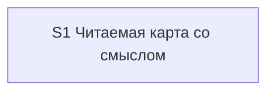

# Quality Control — scenario-map-readability-meaning

Date: 2026-08-29  
Report: `quality-control-2026-08-29-2.md`  
Mode: **slice** (`# Срез S1` in `tasks.md`)  
Scope: criteria 1–6, 8, 8b, 9–11 + task readability  
Prior report: `quality-control-2026-08-29.md` (proposed-slice, `tasks.md` ещё не было) — **не перезаписывался**  
Out of scope: исполнимость приёмки «прямо сейчас» на живой панели / в проекте Документооборота; тестовые данные; эталоны ИБ

Context: kit-only change (скилл, шаблон панели, эталоны, роль сборщика, дельта spec). Продуктовый BSL/XML не требуется. `form_mode: n/a`. **Режим apply:** mechanical.

Sources: `tasks.md`, `design.md` (`## Slices`), `proposal.md`, `specs/scenario-map-canvas/spec.md` (10 `#### Scenario:`), `.cursor/rules/vertical-slices.mdc`, `.cursor/rules/task-readability.mdc`. Mechanical pre-check (prompt): чекбоксы на месте; маркер конца среза есть; фаз нет; User Task Contract DENY-grep: none; маркеров «вручную / в Конфигураторе / создать реквизит / элемент формы» нет.

## Verdict

`OK`

Один срез, одна приёмка, один маркер границы. Все десять сценариев спецификации покрыты (восемь в чеклисте приёмки, два задачами агента). Обязательный осмотр панели — один взгляд после открытия штатной кнопкой. Предыдущий пропуск «Связь без видимого отношения не выдумывается» закрыт.

## Slice Summary

| Slice | Scenario | Tasks | Acceptance | Dependencies | Gate |
|---|---|---|---|---|---|
| S1: Читаемая карта со смыслом | Разработчик просит карту по теме с несколькими отчётами и открывает панель штатной кнопкой среды | 15 агентских (`S1.1`–`S1.15`) + `S1.accept`; группы `## 1`–`## 5` внутри среза | `S1.accept` (8/10 имён в чеклисте; 2/10 только в `S1.8`, `S1.13`–`S1.14`) | нет | да (`<!-- slice-gate -->`) |

Notes:

- Порог: 15 кодовых задач — верх Standard (6–15); с приёмочной строкой — граница Full. Второй срез не требуется: один самостоятельный пользовательский исход (открытая панель читается и не теряет смысл). Группы внутри среза — не отдельные срезы.
- Черновик из трёх срезов («шаблон» / «читаемость» / «смысл») в `design.md` `## Slices` отклонён — согласовано с фактическим `tasks.md`.
- `map-bad-no-insight.md` в репозитории ещё нет — это результат `S1.13`, не дыра слоя.

## Scenario Coverage

10 `#### Scenario:` в `openspec/changes/scenario-map-readability-meaning/specs/scenario-map-canvas/spec.md`. Поле `**Связь со spec:**` перечисляет все десять.

| Scenario | Covered by | Status |
|---|---|---|
| Направление связей и легенда видны без клика | Primary `S1.accept` + `S1.2` | OK |
| Главный вывод виден без клика по узлу | Primary `S1.accept` + `S1.3`, `S1.10`, `S1.11` | OK |
| Находка, меняющая действие, на полотне | Primary `S1.accept` + `S1.5`, `S1.11` | OK |
| Слои или ветвление видны на панели | optional `S1.accept` + `S1.1` | OK |
| С узла открывается доказательство, новый чат с панели не запускается | optional `S1.accept` + `S1.3`, `S1.7` | OK |
| Вывод только в шапке не публикуется | optional `S1.accept` + `S1.5`, `S1.13` | OK |
| Режим не прячет рёбра | optional `S1.accept` + `S1.10` | OK |
| Связь без видимого отношения не выдумывается | optional `S1.accept` + `S1.12` | OK — **закрыт** относительно `quality-control-2026-08-29.md` |
| Провал смысла не уходит в текстовый резерв | `S1.8` (запись правила в скилл; имя Scenario в тексте задачи) | OK — покрытие задачей агента (implementation-only; не blocking) |
| Эталон карты в скилле — граф, не список | `S1.13`, `S1.14` | OK — покрытие задачей агента |

Покрытие только в `S<N>.<M>` для двух последних — **допустимо** (критерий 5b / правило среза 6). `accept-bullets-missing-scenario` **не** эмитируется.

Смежный optional «Вывод только в шапке не публикуется» наблюдает отказ публикации, но не фиксирует «резерв в журнал не пишется» — отличительный THEN сценария провала смысла закрыт текстом скилла в `S1.8`, этого достаточно.

## Dependency Graph

- Cycles: none.
- Forward acceptance dependencies: none (единственный срез).
- Undeclared slice predecessors: none (`**Зависимости:** нет`).
- Intra-slice (порядок файла): шаблон (`S1.1`–`S1.4`) → скилл (`S1.5`–`S1.10`) → роль/бриф (`S1.11`–`S1.12`) → эталон (`S1.13` создаёт файл, `S1.14` ссылается) → сверка текстов (`S1.15`) → `S1.accept`. Цикла нет. Явная межсрезовая зависимость не нужна.

## Checklist Results

| # | Criterion | Result |
|---|---|---|
| 1 | Scenario Coverage | **Pass** — 10/10. Primary / optional / агентская задача. User runtime только на границе `S1.accept` |
| 2 | Slice Independence | **Pass** — принимать S1 можно без несуществующего следующего среза |
| 3 | Slice Completeness | **Pass** — слои kit, нужные для Primary «открыть панель → видно направление, легенду, полосы по слоям, виновника и находку»: шаблон (`S1.1`–`S1.4`), скилл смысла и читаемости (`S1.5`–`S1.10`), роль + prompt сборщика (`S1.11`–`S1.12`), эталон (`S1.13`–`S1.14`), сверка контрактов (`S1.15`). Метаданных/форм 1С нет и не требуется |
| 4 | Slice Dependency Graph | **Pass** — S1 → нет |
| 5 | Slice Gate Integrity | **Pass** — ровно один `S1.accept`, ровно один `<!-- slice-gate -->`. Legacy `S1.T<M>` нет. Фаз / `phase-gate` нет |
| 5b | Acceptance Checklist Coverage | **Pass** — есть `**Primary acceptance:**` в metadata и `**Primary (обязательно):**` в теле accept. Чеклист не пуст. Чужих сценариев нет (один срез). Все Scenario spec где-то покрыты |
| 6 | Rework Risk | **Pass** — нет опоры на непринятый предыдущий срез; сценарии не дублируются между срезами. Плотность Primary (три имени в одном Then) намеренна и не создаёт второго среза |
| 8 | Slice Verticality | **Pass** — mandatory Primary: попросить карту → открыть панель штатной кнопкой → **взглядом** увидеть направление, легенду, честные полосы, выбранного виновника и находку. Black-box (панель рядом с чатом), не вызов API и не код-ревью. Programmatic (сверка скилла, эталон markdown) вынесены из Primary |
| 8b | Self-Achievable Acceptance | **Pass** — нет пары S1/S2. Все включающие слои Primary (шаблон, проверки скилла, бриф сборщика с несколькими отчётами и `focus_node`) лежат в задачах этого же среза. Наблюдаемый исход не заимствован у более позднего среза |
| 9 | Foundation slice with gate | **Pass** — нет foundation-среза с programmatic accept и зависимого UX-среза. Подготовка шаблона внутри того же S1, не отдельный gate |
| 10 | Acceptance Simplicity | **Pass** — **один** mandatory black-box journey (одна открытая панель, один взгляд). Три Scenario указаны в скобках одного Then, не тремя обязательными буллетами. Остальные пять — «(опционально)» |
| 11 | User Task Contract | **Pass** — DENY-grep по `S1.<M>` пуст. Семантика: `S1.1`–`S1.15` — правки markdown / сверка по тексту (агент). Осмотр живой панели, клик, смена режима, негативные «панель не появилась» — только в `S1.accept`. Условных цепочек «после verify / после стенда» нет. Assumptions design п.4 (пересборка в Документообороте) = граница приёмки, не mid-slice user-spike |

## Task Readability

Применяется ко всем `S1.1`–`S1.15`. `S1.accept` — по исключению (бизнес-результат в заголовке + чеклист).

| Check | Result |
|---|---|
| Глагол + файл/объект + зачем + опора (D/ADR/Scenario) | **Pass** — зачины «В `<путь>`: …» / «Создать `<файл>`» / «Сверить по тексту …»; опоры D1–D9, ADR-0008, Behavior Contract, имена Scenario |
| Антипаттерн «голый идентификатор решения» | нет |
| Антипаттерн «глагол без объекта» | нет |
| Описание < 8 слов | нет |
| `S1.accept` заголовок с бизнес-результатом | **Pass** — «карта читается с первого взгляда и не теряет дорогое знание» |
| Recipe vs outcome | **Pass** — детали раскладки и двух чек-листов — принятые решения design (D1, D2, D8), не самовольный рецепт вместо наблюдаемого Then |

Алерты читаемости не эмитируются. `S1.12` трогает два файла одной строкой — формулировка самодостаточна, дробить не требуется.

## Alerts

Нет.

Предыдущий WARNING `accept-bullets-missing-scenario` (отчёт создания ЗНИ) **снят**: сценарий «Связь без видимого отношения не выдумывается» есть в `**Связь со spec:**`, в optional `S1.accept` и в `S1.12`.

Профилактические SUGGESTION того отчёта (`slice-gate-pending-tasks`, `acceptance-simplicity-guard`, `user-task-contract-guard`, явность слоёв) **исполнены** в `tasks.md` и повторно не поднимаются.

**Не эмитировано:** `no-slices`; `deprecated-phase-gate`; `legacy-acceptance-format`; `primary-acceptance-missing`; `accept-checklist-empty`; `accept-bullets-missing-scenario`; `accept-bullet-foreign-scenario`; `slice-not-vertical`; `slice-accept-not-self-achievable`; `slice-foundation-with-gate`; `acceptance-simplicity-overload`; `user-task-contract-violation`; `task-opaque-title`; `task-too-short`; `task-opaque-acceptance`.

## Recommendations

**Automatic fix**

Нет.

**Decision required**

Нет. Объединение срезов / переписывание Primary не требуется.

**Do not**

- Не вводить второй срез «шаблон» или «смысл отдельно».
- Не разворачивать три имени в Primary в три обязательных буллета.
- Не переносить осмотр живой панели / клик / смену режима в `S1.<M>`.
- Не откладывать подпись `S1.accept` «пока не будет следующего среза».
